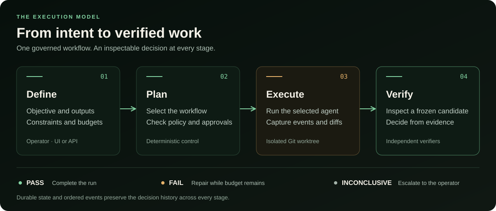
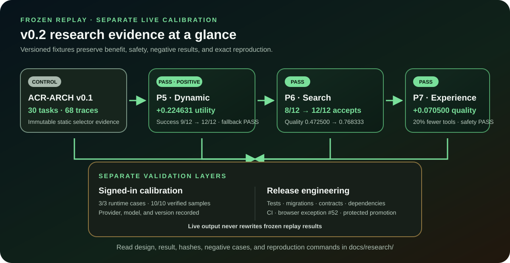

<div align="center">

# Accretion

### Observable, deterministic orchestration for local AI coding agents

Accretion supervises Codex and Claude Code through one provider-neutral control
plane, with deterministic planning, bounded verifier-gated feedback loops,
isolated workspaces, and a durable normalized execution trace.

[](https://github.com/santapong/Accretion/actions/workflows/ci.yml)
[](https://www.python.org/)
[](https://nodejs.org/)
[](LICENSE)
[](#project-status)

[Author: resume.draveniq.dev](https://resume.draveniq.dev) ·
[Documentation](docs/README.md) · [Frontend guide](docs/guides/frontend.md) ·
[Developer guide](docs/guides/developer.md) · [Showcase](docs/guides/showcase.md) ·
[Research results](docs/research/README.md) · [Project status](#project-status) ·
[v0.2 plan](docs/releases/v0.2/plan.md)

<br />


</div>

> [!IMPORTANT]
> The `v0.2.0` release candidate adds opt-in P5 validated dynamic workflows,
> P6 bounded candidate search, P7 verified-experience replay, and frozen research
> gates while retaining the immutable `v0.1.0` release as the current release and
> static control. Promotion is blocked until every item in the
> [v0.2 release audit](docs/releases/v0.2/audit.md) passes.
> The inherited v0.1 foundation includes P0 runtime feasibility, P1
> deterministic planning, P2 verifier-gated feedback loops, P3 static graph
> execution, and the P4 governed harness/operator release gate. Its five validated
> templates can execute:
> `direct-v1`, `feedback-loop-v1`, `fixed-graph-v1` (with human approval gates),
> `hybrid-rd-v1`, and the bounded `safe-unknown-v1` fallback.

<div align="center">
  <a href="docs/assets/project-overview.svg">
    
  </a>
</div>

## Start here

Accretion is for developers and operators who want to run local AI coding agents
without making a provider session the authority for permissions, acceptance, or
recovery. The repository contains the FastAPI control plane, React operator UI,
PostgreSQL schema, runtime adapters, deterministic verifiers, frozen research
fixtures, examples, and operational documentation in one workspace.

| I want to… | Use | Release position |
|---|---|---|
| Evaluate the current release | Clone the `v0.1.0` tag and follow [Quick start](#quick-start) | Released and immutable |
| Evaluate the v0.2 candidate | Check out `develop` after the release-candidate PR merges | Not a release until the audit passes and `v0.2.0` is tagged |
| Reproduce the static control | Clone `v0.1.0` and read the [frozen baseline](docs/releases/v0.1/baseline.md) | Preserved v0.1 evidence |
| Understand the safety model | Read [Architecture](#architecture), the [trust boundary](docs/assets/trust-boundary.svg), and [SECURITY.md](SECURITY.md) | Applies across releases |
| Build a contribution | Start with the [developer guide](docs/guides/developer.md) and [CONTRIBUTING.md](CONTRIBUTING.md) | Pull requests target `develop` |
| Reproduce the evidence | Start with [Experiments and results](docs/research/README.md), then open the detailed ACR-ARCH or P5–P7 report | Frozen replay is deterministic; live-provider and release evidence stay separate |

This is a local orchestration and research system, not an unrestricted deployment
agent. It deliberately fails closed when evidence, authority, budgets, or recovery
state are uncertain.

## Why Accretion

AI coding runtimes expose different protocols, session models, event formats,
and failure behavior. Accretion puts a durable control plane around them so an
operator can answer five questions before and during every run:

- **What will execute?** Typed task contracts produce an inspectable profile and
  a versioned strategy decision.
- **Why was it selected?** Every score, unknown feature, matched rule, alternative,
  and override is visible and persisted.
- **Where can it make changes?** Each mutable run receives an isolated disposable
  Git worktree with explicit capability constraints.
- **What actually happened?** Provider activity becomes a normalized,
  append-only event stream that survives UI reconnects and backend restarts.
- **Did the result really pass?** Independent deterministic verifiers inspect an
  immutable candidate snapshot; provider-reported completion is never acceptance.

## Capabilities

| Area | Included today |
|---|---|
| Runtime control | Structured Codex App Server and Claude Code adapters, plus a deterministic fake runtime |
| Task planning | Versioned prompt/context contracts, deterministic profiling, static strategy selection, and explicit unknown handling |
| Feedback execution | Bounded multi-turn loops, structured repair directives, one reusable provider session, and durable pause/resume/cancel controls |
| Independent acceptance | Output-contract, Git-diff, trajectory-policy, and bounded command verifiers with fail-closed policy evaluation |
| Safety | Hard wall-time, turn, tool-call, and iteration ceilings; high-risk approval gates; audited overrides; and side-effect idempotency |
| Isolation | One Git worktree lease per mutable run with captured diff artifacts |
| Recovery | Atomic iteration commits, optimistic revisions, session continuation, and restart reconciliation without replaying committed work |
| Observability | Durable PostgreSQL state, immutable verifier evidence, monotonic normalized events, resumable SSE, runtime health, and usage pressure |
| Operator frontend | Eleven implemented routes for dashboard, task/planning, live graph and controls, runtime monitor, history/audit, approvals, capability registries, ACR-ARCH, and P5–P7 research |
| Governed capabilities | Immutable capability/skill/plugin/policy registries, task-scoped MCP exposure, approval-bound idempotent side effects, and executor-boundary credential injection |
| Architecture benchmark | Frozen 30-task ACR-ARCH corpus, 68 balanced replay scenarios, raw dimensions, utility/regret, filterable operator UI, and opt-in live provider calibration |
| Dynamic workflow research | Frozen 12-task P5 static-versus-dynamic suite with cohort uplift, architecture regret, structural variation, invalid-proposal fallback, and a release-gate UI |
| Candidate search | Opt-in P6 best-of-N, hypothesis, cross-provider, and generator-reviewer execution with shared budgets, isolated trajectories, independent ranking, and crash-safe promotion |
| Verified experience | Opt-in P7 immutable terminal evidence, repository-scoped deterministic retrieval, compatibility and transfer-risk scoring, explicit negative knowledge, fresh-control trajectory replay, repeated revalidation, and a frozen transfer benchmark |

## Frontend status

Yes—the frontend is implemented for the P0–P7 v0.2 candidate scope.
It is not a mock dashboard: it calls the generated API contract, starts from
authoritative snapshots, follows active runs through resumable server-sent
events, and exposes the decision and verifier evidence needed to explain a run.

<div align="center">
  <a href="docs/assets/operator-ui-map.svg">
    
  </a>
</div>

| Frontend gate | Current evidence |
|---|---|
| User-facing scope | Dashboard, New Task/Planning, Live Run, Runtimes, History, Approvals, Capabilities, ACR-ARCH, P5 Dynamic, P6 Search, and P7 Experience |
| API safety | Generated OpenAPI TypeScript schema; backend remains the authority for policy and transitions |
| Live behavior | Snapshot-first state, monotonic SSE, reconnect and sequence-gap recovery |
| Verification | 22 component tests, ESLint, TypeScript, OpenAPI idempotence, and production build pass; browser/accessibility remains a blocking release-audit item |

See the [operator frontend guide](docs/guides/frontend.md) for every route, the
operator journey, data flow, P5–P7 coverage, source map, and frontend commands.

## Architecture

<div align="center">
  <a href="docs/assets/accretion-architecture.svg">
    
  </a>
</div>

<p align="center"><sub>Click the diagram to open the full-size version.</sub></p>

### P2 feedback-loop lifecycle

The executable P2 path is intentionally small and inspectable: one provider
session produces a candidate, independent verifiers inspect an immutable
snapshot, and only policy-approved evidence can finish the run. A failed
candidate returns structured findings to the same session; budget exhaustion or
uncertainty escalates to the operator.

<div align="center">
  <a href="docs/assets/accretion-feedback-loop.svg">
    
  </a>
</div>

<p align="center"><sub>Click the lifecycle diagram to open the full-size version.</sub></p>

The profiler reads typed task metadata and deterministic repository evidence. It
does **not** parse objective keywords or invoke an LLM. The selector persists one
of the following static decisions:

| Mode | Template | Current behavior |
|---|---|---|
| `DIRECT` | `direct-v1` | Executes one provider call, then applies the configured acceptance policy |
| `LOOP` | `feedback-loop-v1` | Executes bounded observe/verify/repair iterations in one provider session |
| `GRAPH` | `fixed-graph-v1` | Executes a checkpointed static graph with plan and outcome approval gates |
| `HYBRID` | `hybrid-rd-v1` | Executes the macro research graph with bounded local experiment/develop loops |
| Safe fallback | `safe-unknown-v1` | Runs one bounded loop, verifies, and performs at most one replan before escalating |

### How a feedback loop succeeds

1. The runtime produces a candidate in the run's disposable worktree.
2. Accretion captures an immutable observation and invokes the policy's independent
   verifiers.
3. `PASS` completes the run; `FAIL` becomes a structured repair directive for the
   next iteration.
4. `INCONCLUSIVE`, exhausted budgets, repeated failure, or no progress fail closed
   to explicit escalation. Cancellation and restart reconciliation close the
   current attempt without losing committed iteration history.

Worker text such as “done” or “tests pass” is never sufficient evidence. Every
loop remains bounded by persisted wall-time, turn, tool-call, and iteration
ceilings.

## Developer showcase

<div align="center">
  <a href="docs/guides/showcase.md">
    
  </a>
</div>

Run a bounded, read-only task through the real HTTP API and deterministic fake
runtime without consuming a signed-in provider session:

```bash
uv run python examples/showcase.py --repository "$PWD"
```

The [showcase walkthrough](docs/guides/showcase.md) explains the resulting planning,
runtime, verification, graph, trace, and audit records.

## Project status

| Milestone | Status | Scope |
|---|---|---|
| P0 — Runtime feasibility | Complete | Runtime adapters, isolation, normalized events, health, recovery, and idempotency |
| P1 — Deterministic planning | Complete | Prompt/context contracts, profiling, selection, persistence, API, and New Task UI |
| P2 — Feedback loops | Complete | Bounded repeat execution, independent verification, recovery, controls, and loop visualization |
| P3 — Static graphs | Complete | Template registry, GRAPH/HYBRID engines, approval gates, checkpoints, replay, and graph visualization |
| P4 — Harness and release gate | Complete | Governed capabilities/MCP, credential boundary, side-effect evidence, complete operator surfaces, resumable SSE, and ACR-ARCH |
| P5 — Dynamic workflows | Implemented (opt-in) | Typed proposals, deterministic graph validation, static fallback, immutable revisions, safe replan, and operator inspection |
| P6 — Bounded candidate search | Implemented (opt-in) | Evidence-based routing, isolated branches, shared budgets, fail-closed ranking, promotion recovery, operator lineage, and frozen N=1/2/4 replay research |
| P7 — Verified experience | Implemented (opt-in) | Explicit materialization/selection, exact deterministic retrieval, invalidation, negative guidance, isolated fresh-control replay, operator provenance, and frozen negative-transfer research |

### Research result summary

<div align="center">
  <a href="docs/assets/research-results.svg">
    
  </a>
</div>

The consolidated [experiments and results guide](docs/research/README.md)
explains the frozen design, primary result, classification, negative/null cases,
fixture provenance, and reproduction path for ACR-ARCH and P5–P7. It also keeps
signed-in provider calibration and release engineering results visibly separate
from deterministic research claims.

### P6 completion summary

P6 was delivered as three independently reviewed slices into `develop`:

| Slice | Merged evidence | Result |
|---|---|---|
| Contracts and persistence | [PR #37](https://github.com/santapong/Accretion/pull/37) | Versioned search plans, runtime decisions, candidate trajectories/scores, promotion records, feature gates, PostgreSQL migration `0008`, and API contracts |
| Executor and recovery | [PR #38](https://github.com/santapong/Accretion/pull/38) | Best-of-N, hypothesis, cross-provider, and generator-reviewer execution; isolated worktrees; shared budgets; independent selection; cancellation; and crash reconciliation |
| Operator and research surfaces | [PR #39](https://github.com/santapong/Accretion/pull/39) | Search planning and lineage UI, provider/model/version and spend evidence, frozen 12-task N=1/2/4 benchmark, runbook, showcase, acceptance report, and accessible diagrams |

All nine P6 acceptance criteria (`V02-P6-001` through `V02-P6-009`) are mapped
to automated evidence in the [P6 acceptance report](docs/research/p6/acceptance.md).
The final P6 gate recorded 200 passing PostgreSQL-backed backend tests with three
opt-in live-provider tests skipped, 19 passing UI tests, a successful production
build, and a complete PostgreSQL upgrade/downgrade/upgrade cycle. P6 remains off
by default. `REPLAY_BRANCH` continues to fail closed unless the independent P7
deployment/project gates are enabled and the operator has frozen compatible
matches into task context.

### P7 completion summary

P7 adds explicit procedural reuse without automatic learning or authority
expansion. Its immutable experience contracts and pgvector persistence landed in
[PR #41](https://github.com/santapong/Accretion/pull/41); deterministic retrieval,
compatibility, invalidation, selection, and `ContextBundle` v2 landed in
[PR #42](https://github.com/santapong/Accretion/pull/42); and replay execution,
operator explainability, and the frozen transfer gate landed in
[PR #43](https://github.com/santapong/Accretion/pull/43). Replay execution keeps a
fresh control, creates a new isolated worktree/session per positive seed, uses
negative experience only as avoidance guidance, and revalidates before launch,
selection, promotion, and recovery.

All eight P7 criteria (`V02-P7-001` through `V02-P7-008`) are mapped in the
[P7 acceptance report](docs/research/p7/acceptance.md). The frozen P7 gate contains
20 tasks, 50 sources, and 80 traces; it records 95% stale rejection, 3.33%
negative transfer, +0.0705 replay quality, 20% fewer replay tool calls, and no
false-accept or success-rate regression. These are fixture results, not live
provider claims.

See the [v0.1 system design](docs/sdd/Accretion_SDD_v0.1.md) and the
[multi-release SDD index](docs/sdd/Accretion_SDD_INDEX_v0.3.md) for the full
architecture and acceptance criteria. The latest
[v0.1 release audit](docs/releases/v0.1/audit.md) records the clean-checkout GO
decision. The [frozen v0.1 baseline](docs/releases/v0.1/baseline.md) identifies the exact
release and experimental control; the [v0.1.0 release notes](docs/releases/v0.1/notes.md)
describe its shipped scope, compatibility, and reproducibility hashes.

The v0.2 candidate includes the opt-in P5 dynamic-workflow, P6 bounded-search, and P7
verified-experience slices. Start with the [P5 dynamic benchmark](docs/research/p5/benchmark.md), [P7 runbook](docs/runbooks/p7-verified-experience.md),
[developer showcase](docs/research/p7/showcase.md), [acceptance report](docs/research/p7/acceptance.md),
and [delivery plan](docs/releases/v0.2/plan.md). The [v0.2 release audit](docs/releases/v0.2/audit.md) records the current NO-GO gate and remaining blockers; the
[v0.2 SDD](docs/sdd/Accretion_SDD_v0.2.md) remains the normative contract.

## Quick start

### Prerequisites

- Python 3.12+
- [`uv`](https://docs.astral.sh/uv/)
- Node.js 22+ and npm
- Git
- Docker with Compose
- Optional: supported, signed-in Codex and Claude Code CLIs for live providers

The validated v0.2 live-provider range is Codex CLI `>=0.148,<0.149` and Claude
Code `>=2.1.231,<2.2`.

### Choose and clone a version

For the current immutable release:

```bash
git clone --branch v0.1.0 https://github.com/santapong/Accretion.git
cd Accretion
```

For the v0.2 release candidate and ongoing development:

```bash
git clone --branch develop https://github.com/santapong/Accretion.git
cd Accretion
```

Then install and migrate:

```bash
cp .env.example .env

uv sync --all-groups
npm ci
docker compose up -d postgres
uv run alembic upgrade head
```

### Start the control plane

Run the API and UI in separate terminals:

```bash
make api
```

```bash
make ui
```

Open `http://localhost:5173`. The API is available at
`http://localhost:8000`, with interactive documentation at
`http://localhost:8000/docs`.

Live providers are disabled by default. Enable them only after confirming the
local CLIs are installed and signed in:

```dotenv
ACCRETION_ENABLE_LIVE_PROVIDERS=true
```

Accretion checks CLI authentication status but never reads or copies raw
provider credentials.

For deterministic acceptance, declare concrete repository-relative output paths
when creating a task. If required evidence or a configured verifier is unavailable,
Accretion returns `INCONCLUSIVE` and escalates instead of accepting the run.

## Configuration

All settings use the `ACCRETION_` prefix and can be placed in `.env`.

| Variable | Default | Purpose |
|---|---|---|
| `ACCRETION_DATABASE_URL` | Local PostgreSQL | Authoritative state and event store |
| `ACCRETION_DATA_DIR` | `.accretion` | Worktrees and captured artifacts |
| `ACCRETION_ENABLE_LIVE_PROVIDERS` | `false` | Allows Codex and Claude executions |
| `ACCRETION_ENABLE_DYNAMIC_WORKFLOWS` | `false` | Enables P5 proposal and graph-revision services globally |
| `ACCRETION_ENABLE_CANDIDATE_SEARCH` | `false` | Enables P6 search globally; project opt-in is still required |
| `ACCRETION_ENABLE_EXPERIENCE_RETRIEVAL` | `false` | Enables P7 materialization, retrieval, selection, and replay integration globally |
| `ACCRETION_GLOBAL_MAX_RUNS` | `4` | Global concurrency ceiling |
| `ACCRETION_PROVIDER_MAX_RUNS` | `2` | Per-provider concurrency ceiling |
| `ACCRETION_PROJECT_MAX_RUNS` | `2` | Per-project concurrency ceiling |
| `ACCRETION_OPERATOR_IDENTITY` | `local-operator` | Identity recorded in override audits |

See [.env.example](.env.example) for the complete local configuration.

## Verification

Run the standard backend and frontend checks:

```bash
make check
make test
npm run build
npm run api:generate
```

PostgreSQL integration tests use `ACCRETION_TEST_POSTGRES_URL`. Signed-in live
provider tests are deliberately opt-in:

```bash
ACCRETION_LIVE_PROVIDERS=1 ACCRETION_CLAUDE_LIVE_MODEL=sonnet \
  PYTEST_DISABLE_PLUGIN_AUTOLOAD=1 \
  uv run --no-sync pytest -p pytest_asyncio.plugin -m live

ACCRETION_LIVE_PROVIDERS=1 ACCRETION_CLAUDE_LIVE_MODEL=sonnet \
  uv run --no-sync python scripts/run_acr_arch_live_sample.py
```

The validated CLI range and recorded acceptance evidence are documented in the
[P0 runtime runbook](docs/runbooks/p0-runtime.md) and the
[P2 loops and verifiers runbook](docs/runbooks/p2-feedback-loops.md).

## Repository guide

```text
apps/ui/                  React operator interface
src/accretion/api/        FastAPI routes and schemas
src/accretion/runtimes/   Codex, Claude, and fake runtime adapters
src/accretion/persistence Durable state, planning history, and side effects
src/accretion/planning.py Deterministic profiler and selector policy
src/accretion/looping.py  Loop policy, budgets, and terminal outcomes
src/accretion/projections.py Read-only execution graph projections
src/accretion/governance.py Capability policy, credentials, and governed executor
src/accretion/benchmark.py Frozen ACR-ARCH replay and architecture metrics
src/accretion/search_benchmark.py Frozen P6 quality-vs-compute replay metrics
src/accretion/experience_benchmark.py Frozen P7 transfer-safety replay metrics
src/accretion/orchestration/ P5 workflow and P6 candidate-search authority
src/accretion/experience/ P7 materialization, embedding, compatibility, and retrieval
src/accretion/verifiers/  Deterministic verifier implementations and registry
migrations/               Alembic schema history
tests/                    Unit, API, PostgreSQL, and live acceptance tests
examples/                 Safe public-API demonstrations using the fake runtime
docs/                     Documentation hub and grouped visual assets
docs/guides/              Newcomer, developer, frontend, and showcase guides
docs/runbooks/            P0–P7 operation and recovery procedures
docs/research/            Experiment design, frozen results, and decisions
docs/releases/            Versioned plans, audits, notes, and baselines
docs/governance/          Repository and documentation process
docs/sdd/                 Versioned normative system design specifications
```

## Contributing and security

Development uses short-lived branches and pull requests into protected
`develop`; stable releases are promoted to `main`. Before contributing, read
[CONTRIBUTING.md](CONTRIBUTING.md) and the
[branch policy](docs/governance/branch-policy.md).

Please report security concerns through the process in
[SECURITY.md](SECURITY.md), not through a public issue.

## License

Accretion is available under the [MIT License](LICENSE).
