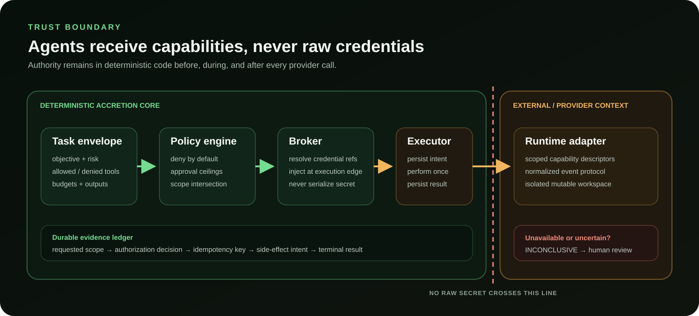

# Security policy

## Security model

- Agent runtimes receive scoped capabilities, never raw credentials.
- Consequential effects record durable intent before execution and a durable
  result afterward; uncertain outcomes fail closed instead of silently retrying.
- Provider output cannot raise permission ceilings or accept its own artifact.
- Mutable runs use isolated Git worktrees and independent verification.

See the [v0.1 security architecture](docs/sdd/Accretion_SDD_v0.1.md) and
[developer guide](docs/DEVELOPER_GUIDE.md#6-preserve-the-authority-boundary) for
the implementation boundary.

## Supported versions

Accretion is pre-release software. Security fixes are applied to the latest
commit on `main` and included in the next tagged release.

## Reporting a vulnerability

Do not open a public issue for a suspected vulnerability. Use GitHub's private
vulnerability reporting for this repository and include:

- affected version or commit;
- reproduction steps or a minimal proof of concept;
- expected impact;
- any suggested mitigation.

Avoid accessing data that is not yours, disrupting provider services, or
publishing details before a fix is available. The maintainer will acknowledge a
report as soon as practical and coordinate validation and disclosure through
the private report.
