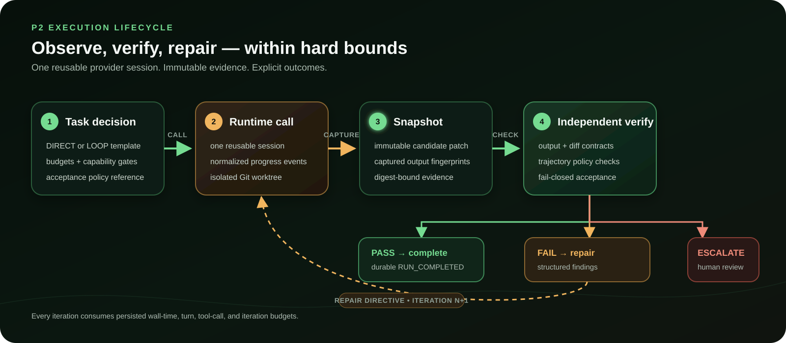

# Accretion P2 loops and verifiers runbook



## Scope

P2 enables the persisted `LOOP/feedback-loop-v1` decision. A loop reuses one
runtime session across bounded calls, captures an immutable candidate observation
after each call, applies independent deterministic verifiers, and either completes,
repairs, or escalates according to a versioned acceptance policy.

`GRAPH/fixed-graph-v1`, `HYBRID/hybrid-rd-v1`, and `safe-unknown-v1` remain blocked
until P3. P2 does not emulate these modes through direct or loop execution.

For the current operator route and data-flow map, see the
[frontend guide](FRONTEND_GUIDE.md). The historical counts below remain the P2
milestone evidence; the P7 completion report records the current aggregate UI gate.

## Safety and recovery invariants

- Provider-reported completion never accepts its own output.
- Missing verifier evidence and `INCONCLUSIVE` results fail closed unless the
  persisted policy explicitly permits them.
- Wall-time, turn, tool-call, and iteration ceilings are enforced by the control
  plane, including around a stalled or overly permissive provider.
- Each immutable loop iteration, its verifier results, normalized events, and the
  next aggregate state commit atomically under an optimistic revision check.
- Pause and cancellation durably close an already-started attempt and consume its
  budget exactly once.
- Reconciliation resumes at the next uncommitted iteration and never regresses a
  terminal loop or emits a second terminal run event.
- The React Flow projection is read-only and derives its iteration, traversal,
  verifier, and stop-state display from persisted backend evidence.

## Built-in verifiers

| Verifier | Evidence |
|---|---|
| `output-contract` | Required paths, non-empty files, JSON validity, and required JSON keys |
| `git-diff` | Immutable tracked and untracked patch content bound to its captured digest |
| `trajectory-policy` | Denied operations and unresolved approval events in the normalized trace |
| `CommandVerifier` | Constructor-injected trusted argv with bounded time and output; no shell expansion |

Verifier registration is explicit. A policy that references an unavailable
verifier cannot silently pass.

## Release acceptance mapping

| Criterion | Evidence |
|---|---|
| `V01-P2-001` | Unit and manager tests cover verified success, all budget stops, no progress, repeated/provider failure, cancellation, interruption, and policy escalation. |
| `V01-P2-002` | A fake runtime reports completion after writing invalid JSON; `output-contract` rejects it and the same session receives structured findings before a verified repair. |
| `V01-P2-003` | Recovery tests preserve the committed iteration count, session, and remaining budgets across reconciliation, then resume at iteration N+1. |
| `V01-P2-004` | Central deadline and tool-ceiling tests interrupt an unbounded call and prevent an extra `TOOL_STARTED`; max iterations and turns are persisted stop conditions. |
| `V01-P2-005` | Fail-closed policy tests prove missing or inconclusive required evidence escalates to `REQUIRES_HUMAN`. |
| `V01-P2-006` | UI tests render the custom curved loop-back SVG path and assert iteration badges, traversal counts, verifier details, remaining budgets, and stop state against API-shaped trace data. |

## Recorded P2 acceptance evidence

Validated locally on 2026-08-20:

- Default non-live backend suite: 79 passed, 7 live/PostgreSQL cases excluded.
- PostgreSQL 16 migration cycle: upgrade to head, downgrade to base, and upgrade to
  head completed successfully.
- PostgreSQL-backed non-live suite: 83 passed, 3 live cases skipped.
- Frontend: TypeScript, ESLint, 8 Vitest cases, generated OpenAPI contract check,
  and the Vite production build passed.
- Strict backend checks: Ruff and mypy passed for the complete P2 tree.
- Signed-in provider smoke suite: 3 passed with Codex CLI `0.148.0` and Claude Code
  `2.1.231`, using harmless prompts in disposable repositories.

The release commands are:

```bash
uv run ruff check .
uv run mypy src
PYTEST_DISABLE_PLUGIN_AUTOLOAD=1 \
  uv run --no-sync pytest -p pytest_asyncio.plugin

npm run api:generate
git diff --exit-code -- apps/ui/src/api/schema.d.ts
npm run check
npm run test
npm run build
```

With a disposable PostgreSQL 16 instance available through
`ACCRETION_TEST_POSTGRES_URL`, also run the Alembic upgrade/downgrade cycle and the
same backend suite. Signed-in runtime acceptance remains deliberately opt-in:

```bash
ACCRETION_LIVE_PROVIDERS=1 \
  PYTEST_DISABLE_PLUGIN_AUTOLOAD=1 \
  uv run --no-sync pytest -p pytest_asyncio.plugin -m live \
  tests/test_live_runtimes.py
```

Live cases use the harmless prompt in `tests/test_live_runtimes.py`; they create no
requested files or tool calls and never run in CI by default.
