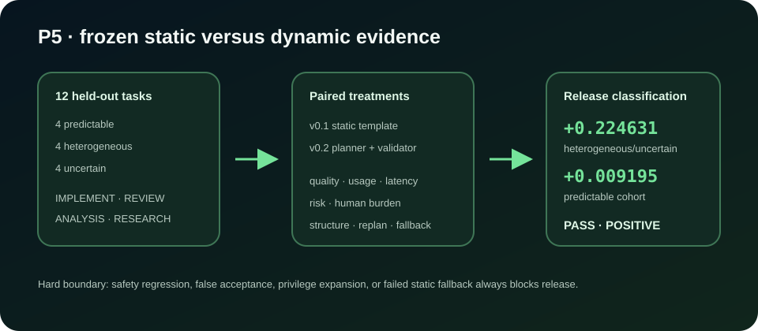

# P5 dynamic workflow benchmark

Status: frozen v0.2 release evidence, recorded 2026-08-24.



This benchmark closes `RQ-DYN` and the research condition in v0.2 SDD §18.1
and §19.5. It compares the best v0.1 static-template treatment with the v0.2
fragment planner plus deterministic `GraphValidator`. It is deterministic replay
evidence, not a claim about current hosted-model quality.

## Frozen design

- 12 held-out tasks and 24 paired traces;
- four predictable, four heterogeneous, and four uncertain tasks;
- three tasks each for implement, review, analysis, and research;
- the published ACR-ARCH utility weights for quality, usage, latency, risk, and
  human burden;
- preregistered minimum utility uplift `0.02` for heterogeneous/uncertain tasks;
- preregistered predictable-task non-inferiority floor `-0.02`; and
- hard gates for success non-regression, v0.1 safety invariants, and operational
  static fallback after an invalid proposal.

## Frozen result

| Cohort | Static utility | Dynamic utility | Uplift | Static success | Dynamic success |
|---|---:|---:|---:|---:|---:|
| Predictable | 0.757985 | 0.767180 | +0.009195 | 4 / 4 | 4 / 4 |
| Heterogeneous | 0.429203 | 0.586183 | +0.156980 | 3 / 4 | 4 / 4 |
| Uncertain | 0.249650 | 0.541931 | +0.292281 | 2 / 4 | 4 / 4 |

The combined heterogeneous/uncertain uplift is `+0.224631`, the predictable
cohort remains above its non-inferiority floor, overall success improves from
9/12 to 12/12, and the deliberately invalid proposal in `p5-008` reaches the
validated static fallback. No dynamic trace records a false accept or risk
event. The release classification is **PASS · POSITIVE**.

Fixture SHA-256 fingerprints:

- `config.v1.json`: `55678342830491bc20ceea16332b6385c3f6afba3f8fd35fee6342d1260da8de`
- `tasks.v1.json`: `b411b0573d514a496b81b82e25ccee146b66af7fd990187ede6e7ea4c1c399db`
- `replay-traces.v1.json`: `77645b41f35430bb886fae558a6ee684664d87b7adcb755c68a92c3db6dd3616`

## Reproduce

Use **P5 Dynamic** in the operator UI, or run:

```bash
curl http://localhost:8000/api/v2/benchmarks/dynamic
curl -X POST http://localhost:8000/api/v2/benchmarks/dynamic/run \
  -H 'Content-Type: application/json' \
  -d '{"execution_source":"REPLAY"}'
```

`LIVE` is rejected by the benchmark API so live provider output cannot silently
replace or contaminate the frozen replay result.
