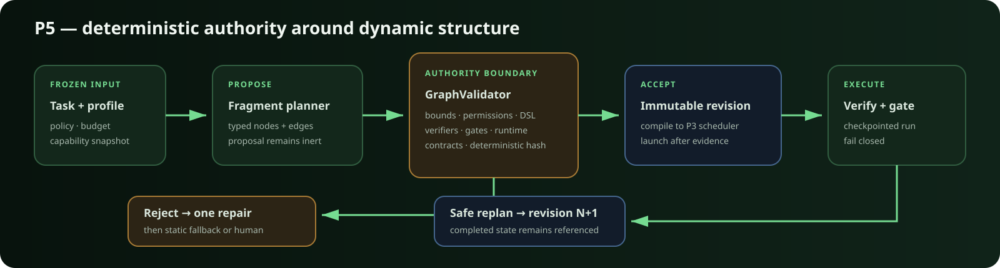

# Accretion P5 validated dynamic workflow runbook



## Scope

P5 adds opt-in, run-specific workflow proposals without giving a model policy
authority. Reviewed fragments produce typed `WorkflowProposal` records;
deterministic code validates and content-addresses the graph; only an accepted
proposal is compiled into the existing P3 checkpoint, verifier, approval, and
side-effect scheduler. P6 candidate search is a separate opt-in extension and
grants no authority when only P5 is enabled. P7 experience retrieval remains
unimplemented.

## Enable P5

P5 has two independent gates. The deployment flag defaults off:

```dotenv
ACCRETION_ENABLE_DYNAMIC_WORKFLOWS=true
```

After applying migrations and restarting the API, enable one project with an
optimistic revision:

```bash
curl -X PATCH http://localhost:8000/api/v2/projects/PROJECT_ID/features \
  -H 'Content-Type: application/json' \
  -d '{"dynamic_workflows":true,"expected_revision":1}'
```

The P5 UI performs the same project opt-in when an operator selects **Propose
P5 graph**. Enabling the project cannot bypass a globally disabled deployment.

## Proposal-to-activation workflow

1. `POST /api/v2/tasks/{task_id}/workflow/propose` creates a PENDING run, an
   inert immutable proposal, and a version-keyed runtime-decision record.
2. `POST /api/v2/runs/{run_id}/workflow/proposals/{proposal_id}/validate`
   freezes capability/runtime/policy snapshots and runs `graph-validator-v2`.
3. A repairable proposal receives exactly one repair. A second failure cancels
   the inert dynamic run and starts its validated v0.1 static strategy. A replan
   failure remains paused and requires a human.
4. `POST .../activate` requires the latest validation to be `ACCEPT`. It
   compiles the content-addressed graph, persists revision 1, emits activation
   evidence, and then launches the existing scheduler.
5. High-risk graphs must contain a gate on every terminal path. Runtime output
   still passes the normal independent verifier policy before success.

The reviewed P5 fragment library contains `single-act-verify`,
`bounded-repair`, `approval-gated-change`, and the serial
`dual-analysis-join`. True speculative parallel candidates belong to P6.

## Safe replanning

`POST /api/v2/runs/{run_id}/replan` pauses a running graph at a safe boundary,
validates a new proposal against the same authority ceilings, and activates
revision N+1. Historical `RunGraphRevision` rows are never updated. Completed,
failed, or cancelled node definitions cannot be removed or rewritten, and the
new revision records their node IDs plus durable side-effect operation IDs in
`protected_state_refs`. The active run-graph projection may change; immutable
revision and event evidence does not.

Replan is rejected when a node cannot settle, the run is terminal, a revision
is missing, the proposal changes protected history, or validation fails.

## Conservative graph grammar

| Bound | P5 value |
|---|---:|
| Nodes / edges | 32 / 64 |
| Acyclic depth | 8 |
| Fan-out ceiling | 4 and task concurrency ceiling |
| Loop/retry traversal | 3 |
| Proposal repair attempts | 1 |
| Executable condition | typed `node.outcome == KNOWN_OUTCOME` |

The condition library can validate and evaluate other allowlisted state paths,
but the P5 serial scheduler rejects conditions it cannot execute. `FANOUT`,
`MERGE`, `ERROR`, and semantic `LOOP_BACK` edges are rejected at the executor
boundary; P5 loops use bounded LOOP nodes. No Python or JavaScript evaluation
is possible.

## Recovery and diagnosis

- Inspect proposals and validations before looking at runtime output.
- Compare immutable revisions with `GET .../graph/diff?from=N&to=N+1`.
- Confirm `GRAPH_REVISION_ACTIVATED` precedes `RUN_STARTED` in the event log.
- Use `runtime-decisions` to inspect candidates, version, score inputs, selected
  runtime, reason, and fallback order.
- A rejected initial proposal should have one cancelled dynamic run and one
  ordinary static run. It must never keep repairing indefinitely.
- After a crash, the inherited P3 checkpoint/reconcile rules remain authority;
  inconsistent workspace or cursor evidence escalates to a human.

## Verification commands

```bash
uv run ruff check .
uv run mypy src
PYTEST_DISABLE_PLUGIN_AUTOLOAD=1 uv run --no-sync pytest -p pytest_asyncio.plugin
npm run api:generate
npm run check
npm run test
npm run build
```

For PostgreSQL evidence, apply migration `0007_p5_dynamic_workflows`, perform
the full upgrade/downgrade/upgrade cycle on a disposable PostgreSQL 16 database,
and run the integration suite with `ACCRETION_TEST_POSTGRES_URL` set.
