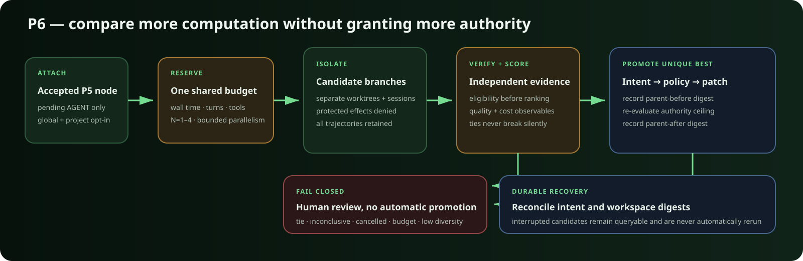
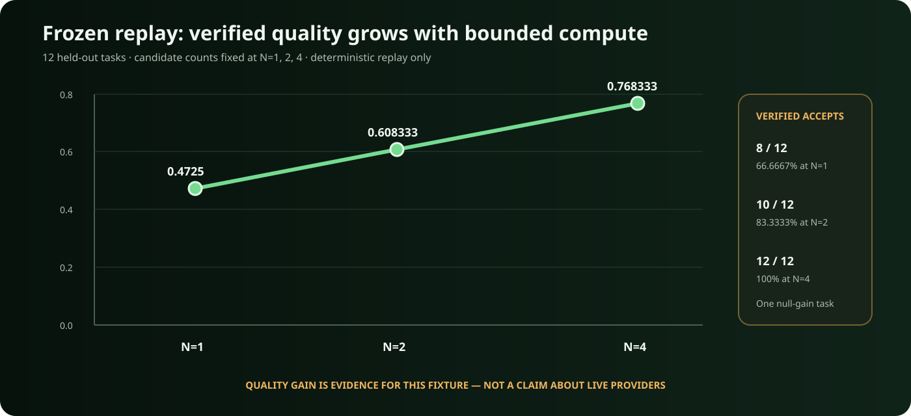

# Accretion P6 bounded candidate-search runbook



## Scope

P6 adds optional test-time compute to an accepted P5 graph. One pending `AGENT`
node may receive a versioned `SearchPlan` with one to four isolated candidates.
Accretion reserves one shared budget, records runtime provenance and every
trajectory, independently verifies candidates, and promotes only a unique
eligible winner. Search can multiply computation; it cannot multiply authority.

P6 implements `BEST_OF_N`, `HYPOTHESIS_BRANCH`, `CROSS_PROVIDER`, and
`GENERATOR_REVIEWER`. A P6-only service keeps `REPLAY_BRANCH` fail closed with
`REPLAY_BRANCH_REQUIRES_P7`; the independently gated P7 service activates it only
for explicitly selected, currently compatible verified experience.

The [frontend guide](FRONTEND_GUIDE.md) maps search-plan inputs and the complete
candidate lineage, score, spend, selection, and promotion views. These frontend
surfaces are implemented and gate-passing on `develop`.

## Enable P6

Both deployment gates default off. P6 also depends on P5 dynamic workflows:

```dotenv
ACCRETION_ENABLE_DYNAMIC_WORKFLOWS=true
ACCRETION_ENABLE_CANDIDATE_SEARCH=true
```

After applying migrations and restarting the API, opt in one project using its
current feature revision:

```bash
curl -X PATCH http://localhost:8000/api/v2/projects/PROJECT_ID/features \
  -H 'Content-Type: application/json' \
  -d '{"dynamic_workflows":true,"candidate_search":true,"expected_revision":1}'
```

The planning UI performs this project update when the operator chooses **Attach
search plan**. Project opt-in never overrides a disabled deployment flag.

## Plan, review, and execute

1. Create a task and use **Propose P5 graph** in Planning Review.
2. Wait for deterministic validation to accept the proposal. Do not activate it
   yet.
3. Select a pending `AGENT` node, mode, branch count, parallel limit, and both
   per-branch and total budgets in **Attach bounded P6 search**.
4. Review the returned plan, then activate the P5 graph. The scheduler executes
   the attached search when it reaches that node.
5. Open the run. **Candidate search tree** shows branch lineage, provider,
   runtime/model/version, reviewer, score, quality, cost/latency proxies, actual
   spend, terminal reason, and final selection.

The equivalent API call, after the P5 proposal has been accepted and before it
is activated, is:

```bash
curl -X POST http://localhost:8000/api/v2/runs/RUN_ID/search \
  -H 'Content-Type: application/json' \
  -d '{
    "parent_node_id":"act",
    "mode":"BEST_OF_N",
    "branch_count":2,
    "max_parallel":2,
    "per_branch_budget":{
      "schema_version":"2.0",
      "wall_time_seconds":120,
      "max_turns":4,
      "max_tool_calls":12
    },
    "total_budget":{
      "schema_version":"2.0",
      "wall_time_seconds":240,
      "max_turns":8,
      "max_tool_calls":24
    },
    "candidate_directives":[]
  }'
```

`HYPOTHESIS_BRANCH` requires exactly one directive per branch.
`GENERATOR_REVIEWER` requires exactly two branches. Cross-provider execution
requires two or four branches and only uses explicitly enabled, healthy
providers.

## Inspect and control a search

| View or action | Endpoint |
|---|---|
| Searches attached to a run | `GET /api/v2/runs/{run_id}/searches` |
| Authoritative search record | `GET /api/v2/search/{search_id}` |
| All candidate trajectories | `GET /api/v2/search/{search_id}/candidates` |
| Independent score evidence | `GET /api/v2/search/{search_id}/scores` |
| Persist cancellation intent | `POST /api/v2/search/{search_id}/cancel` |

Cancellation is persisted before active runtime calls are interrupted. The
operator may cancel only a planned, running, or selecting search. A cancelled
search can never promote a candidate.

## Budget and authority rules

- The parent run owns the total wall-time, turn, and tool-call envelope.
- Per-branch reservations cannot exceed the total envelope. Actual spend is
  charged to the parent; interrupted work conservatively retains its reservation.
- Candidate workspaces, runtime sessions, artifacts, and verifier evidence are
  independent. Sibling candidates cannot observe mutable candidate state.
- Speculative candidates receive no protected external side-effect capability,
  credentials, approval authority, or permission expansion.
- Task, project, provider, and global concurrency limiters still apply. A search
  borrows its already-held parent slot, so a deployment limit of one cannot
  deadlock its own candidate.

## Selection and promotion

Only independently verified, policy-eligible candidates may be ranked. Scores
are rounded by the persisted policy. A unique highest score may win; a tie,
inconclusive verifier evidence, indistinguishable artifacts, or insufficient
expected gain stops without automatic promotion.

Promotion first persists an intent with the selected patch digest and the
parent-before workspace digest. Accretion then re-evaluates the current policy
and authority ceiling, applies only that patch, and persists the parent-after
digest. On restart, those records distinguish a safe completion from a conflict.
Candidate completion order and provider order never break a tie.

## Recovery and diagnosis

- `BUDGET_EXHAUSTED`, `LOW_EXPECTED_GAIN`, `LOW_DIVERSITY`,
  `VERIFIER_UNCERTAIN`, `PROVIDER_UNAVAILABLE`, `OPERATOR_CANCELLED`, and
  `CANDIDATE_FAILURE` are explicit terminal evidence, not hidden retries.
- An interrupted candidate remains queryable and is never automatically rerun.
- A candidate failure cannot change sibling or parent workspaces.
- If a promotion intent exists without a parent-after digest, reconciliation
  compares the current parent digest with the recorded before state and selected
  patch. Any ambiguity requires a human.
- Use the runtime decision records and candidate provider/model/version fields to
  diagnose routing separately from verification or promotion.

## Frozen replay benchmark



Open **P6 Search** in the operator UI, or run:

```bash
curl http://localhost:8000/api/v2/benchmarks/search
curl -X POST http://localhost:8000/api/v2/benchmarks/search/run \
  -H 'Content-Type: application/json' \
  -d '{"execution_source":"REPLAY"}'
```

The suite is frozen at 12 held-out tasks and N=1, 2, and 4. It reports verified
acceptance, mean quality, compute observables, provider comparisons, null results,
and SHA-256 fixture fingerprints. `LIVE` is deliberately rejected by this API;
signed-in Codex/Claude calibration is a separate explicit local release gate and
never replaces or silently mixes with the replay baseline.

## Verification commands

```bash
uv run ruff check .
uv run mypy src
PYTEST_DISABLE_PLUGIN_AUTOLOAD=1 uv run --no-sync pytest -p pytest_asyncio.plugin
npm run api:generate
git diff --exit-code -- apps/ui/src/api/schema.d.ts
npm run check
npm run test
npm run build
```

For PostgreSQL evidence, apply migration `0008_p6_search_contracts`, perform the
full upgrade/downgrade/upgrade cycle on a disposable PostgreSQL 16 database, and
run the complete suite with `ACCRETION_TEST_POSTGRES_URL` set.
