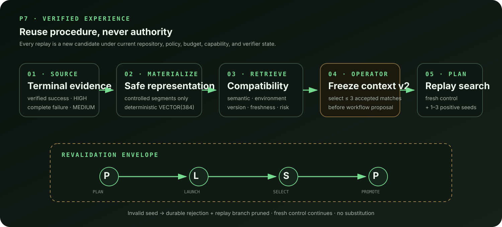
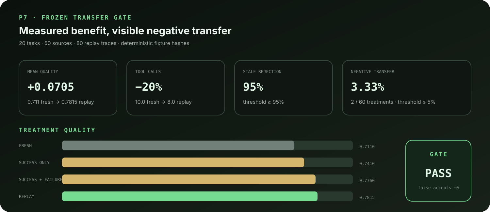

# P7 developer showcase: replay verified procedure safely

This showcase demonstrates the difference between experience and authority.
Accretion can reuse redacted procedural structure from a verified source, but the
new run still starts from the current repository snapshot, receives current
permissions, executes in a fresh session/worktree, and must pass current
verifiers.

Use the [frontend guide](FRONTEND_GUIDE.md) to orient the Planning Review, Live
Run, and P7 Experience pages before walking through the scenario.

## Scenario

Use a disposable local Git repository and the deterministic fake runtime:

1. Complete a small `IMPLEMENT` task and explicitly materialize the successful
   run as positive experience.
2. Materialize one complete failed run for the same task family as negative
   knowledge.
3. Create a new task in the same repository. Choose **Retrieve matches**, inspect
   compatibility and transfer risk, select both records, and freeze them.
4. Propose and validate a P5 workflow.
5. Attach **Fresh + verified replay** to its `act` node. The plan has candidate 1
   as a fresh control and candidate 2 as the positive replay treatment. The
   negative match adds avoidance guidance only to candidate 2.
6. Activate the graph and open the run's **Experience replay lineage** panel.

The panel connects five kinds of evidence:

| Evidence | What proves it |
|---|---|
| Source | Run/candidate ID, repository identity, commit, runtime/model/version, trust, and outcome |
| Match | Semantic, environment, version, freshness, final score, transfer risk, disposition, and reasons |
| Seed | Exact source match/experience/segment IDs, controlled procedural guidance, assumptions, and required revalidations |
| Treatment | Fresh or replay source kind, new candidate workspace/session, budget spend, verifier score, and terminal reason |
| Decision | Replay start/rejection event, selection evidence, promotion intent, and parent before/after digests |

## Demonstrate fail-closed invalidation

Create the replay plan but do not activate it. Retract the positive experience,
then activate. The observable result should be:

- the fresh candidate opens its own workspace and runtime session;
- the replay candidate is pruned before it receives either;
- `TRAJECTORY_REPLAY_REJECTED` records phase `LAUNCH` and
  `EXPERIENCE_RETRACTED`;
- no replacement seed is selected; and
- the fresh control remains eligible to finish the bounded search.

This is the central P7 safety property: retrieved evidence may reduce effort, but
loss of transfer validity can only remove influence, never add authority.

## Reproduce the research result

Open `http://localhost:5173/benchmarks/experience` and choose **Reproduce P7
gate**, or call the replay endpoint from the [P7 runbook](P7_RUNBOOK.md). The
report includes the two negative-transfer cases instead of hiding them. The
frozen fixture passes because aggregate negative transfer remains within the
preregistered ceiling, stale evidence is rejected at the required rate, false
accepts do not increase, success does not regress, and replay improves both
quality and tool use.

Continue with the [P7 acceptance report](P7_ACCEPTANCE_REPORT.md) for criterion
mapping and the [P7 decision record](P7_DECISIONS.md) for frozen thresholds and
explicit exclusions.
