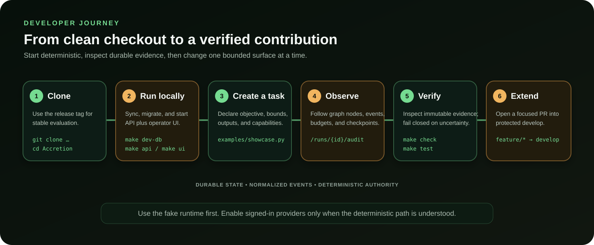

# Accretion documentation

This is the documentation entry point for operators, contributors, integrators,
and release reviewers. Start with the path that matches what you want to do.

## Choose your path

| Goal | Start here | Continue with |
|---|---|---|
| Run Accretion locally | [Developer guide](DEVELOPER_GUIDE.md) | [Showcase](SHOWCASE.md) |
| Understand the system | [README architecture](../README.md#architecture) | [v0.1 SDD](sdd/Accretion_SDD_v0.1.md) |
| Build a contribution | [Contributing](../CONTRIBUTING.md) | [Branch policy](BRANCH_POLICY.md) |
| Operate or recover runs | [P0 runtime runbook](P0_RUNBOOK.md) | [P2 loops](P2_RUNBOOK.md), [P3 replay](P3_RUNBOOK.md) |
| Reproduce research | [ACR-ARCH](ACR_ARCH_V01.md) | [v0.1 release audit](V0_1_RELEASE_AUDIT.md) |
| Review security | [Security policy](../SECURITY.md) | [Trust-boundary diagram](assets/trust-boundary.svg) |
| Plan the next release | [v0.2 delivery plan](V0_2_PLAN.md) | [v0.2 SDD](sdd/Accretion_SDD_v0.2.md) |

## Visual reference

| Diagram | Explains | Primary document |
|---|---|---|
| [System architecture](assets/accretion-architecture.svg) | Task-to-runtime and durable telemetry flow | [Project README](../README.md) |
| [Developer journey](assets/developer-journey.svg) | First checkout through verified PR | [Developer guide](DEVELOPER_GUIDE.md) |
| [Feedback lifecycle](assets/accretion-feedback-loop.svg) | Bounded act, observe, verify, repair | [P2 runbook](P2_RUNBOOK.md) |
| [Checkpoint and replay](assets/checkpoint-replay.svg) | Recovery classification and safe replay | [P3 runbook](P3_RUNBOOK.md) |
| [Trust boundary](assets/trust-boundary.svg) | Capability, credential, and side-effect authority | [Security policy](../SECURITY.md) |
| [Benchmark pipeline](assets/benchmark-pipeline.svg) | Frozen inputs through reproducible metrics | [ACR-ARCH](ACR_ARCH_V01.md) |
| [Delivery workflow](assets/delivery-workflow.svg) | Protected branches, CI, and releases | [Branch policy](BRANCH_POLICY.md) |
| [v0.2 roadmap](assets/v02-roadmap.svg) | P5–P7 sequencing and release gates | [v0.2 plan](V0_2_PLAN.md) |

Every SVG has a title and long description for assistive technology. Technical
diagrams are repository-native so changes can be reviewed as text. The generated
bitmap in the showcase is illustrative and never defines behavior.

## Version authority

- The immutable `v0.1.0` tag and its release notes define the shipped v0.1 baseline.
- `main` is the stable branch; `develop` integrates the next release.
- `codex/v0.1-local-control-plane` is an unmerged historical prototype, not a
  release branch or source of current contracts.
- Versioned SDDs are normative only for their declared release scope.

## Documentation rules

When behavior changes, update the closest runbook or contract in the same pull
request. Commands must be executable from a clean checkout, generated contracts
must be synchronized, and diagrams must describe implemented behavior or be
clearly labeled as plans.
