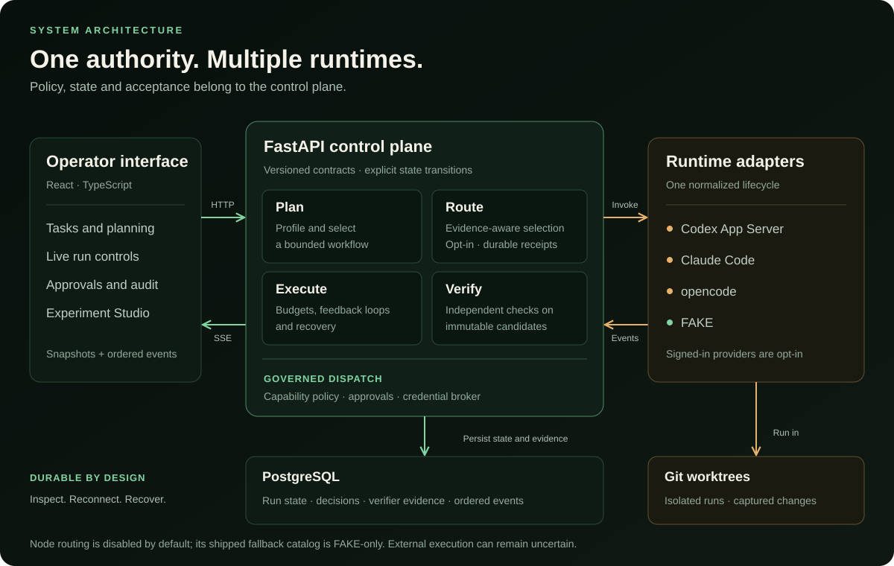

# Accretion showcase

This walkthrough demonstrates the v0.1 product without consuming a signed-in
provider session. It uses the deterministic fake runtime and the same public API
used by the operator interface.


> The banner is an illustrative product visualization. The diagrams and API
> responses below describe the implemented behavior.

## What the example proves



The example exercises these real boundaries:

1. Project registration resolves an existing local Git repository.
2. Typed task metadata creates immutable prompt, context, profile, and strategy
   records.
3. The deterministic selector chooses a validated execution template.
4. The fake adapter emits the provider-neutral runtime event protocol.
5. An isolated worktree protects the source checkout.
6. Output and trajectory verifiers evaluate the candidate independently.
7. The audit endpoint returns one provenance-linked view of the run.

## Run it

From a clean `develop` checkout:

```bash
cp .env.example .env
uv sync --all-groups
npm ci
make dev-db
make migrate
```

Start the API:

```bash
make api
```

Then run the showcase in another terminal:

```bash
uv run python examples/showcase.py --repository "$PWD"
```

The command prints JSON shaped like this:

```json
{
  "provider": "FAKE",
  "state": "SUCCEEDED",
  "strategy": {
    "mode": "DIRECT",
    "template": "direct-v1"
  },
  "verifications": [
    {"status": "PASS", "verifier": "output-contract"},
    {"status": "PASS", "verifier": "trajectory-policy"}
  ]
}
```

Identifiers, event counts, and sequence numbers vary per run. A nonzero exit
means the run did not reach verified success; the emitted error or audit state is
the diagnostic starting point.

## Explore the same run

Start the UI with `make ui`, open `http://localhost:5173`, and select the new run.
The dashboard exposes:

- deterministic profile evidence and matched selector rules;
- the instantiated workflow graph and node states;
- the snapshot-first, resumable normalized event stream;
- verifier findings and acceptance status;
- checkpoint, approval, capability, and audit provenance when present.

The equivalent read-only API views are:

| View | Endpoint |
|---|---|
| Authoritative run snapshot | `GET /api/v1/runs/{run_id}` |
| Full provenance bundle | `GET /api/v1/runs/{run_id}/audit` |
| Instantiated graph projection | `GET /api/v1/runs/{run_id}/graph` |
| Normalized execution trace | `GET /api/v1/runs/{run_id}/trace` |
| Resumable live events | `GET /api/v1/runs/{run_id}/events?after=N` |
| Verification records | `GET /api/v1/runs/{run_id}/verifications` |

## Extend the showcase safely

- Change the objective or typed task fields to observe a different deterministic
  strategy decision.
- Add repository-relative required outputs to exercise stronger output contracts.
- Use `IMPLEMENT` only in a disposable repository because it requires a Git diff.
- Enable `CODEX` or `CLAUDE` only after the fake-runtime path is understood and
  the supported CLI is installed and signed in.
- Never turn a showcase task into an unbounded deployment, publishing, deletion,
  payment, or messaging action.

For architecture details, continue with the [developer guide](DEVELOPER_GUIDE.md)
and [v0.1 SDD](sdd/Accretion_SDD_v0.1.md). To extend the tour with opt-in,
shared-budget candidate comparison, use the [P6 developer showcase](P6_SHOWCASE.md).
