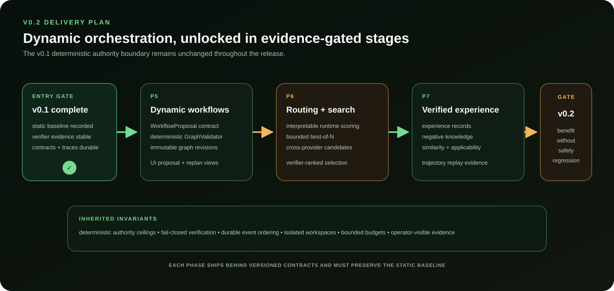

# Accretion v0.2 delivery plan

Status: P5 implemented behind opt-in gates; P6 and P7 remain planned. This document translates
the normative [v0.2 SDD](sdd/Accretion_SDD_v0.2.md) into an implementation and
review sequence; it does not change the SDD contracts.

## Release thesis

v0.2 will let Accretion propose and revise run-specific workflows, choose among
runtimes using observable evidence, spend bounded compute on multiple candidates,
and reuse verified prior experience. Dynamic behavior may change computation
structure, but it never changes authority ceilings, credential handling,
acceptance policy, or durable-state ownership.

## Entry gate

The v0.1 prerequisites are now present:

- immutable `v0.1.0` release tag and published release evidence;
- deterministic static strategy baseline and validated templates;
- normalized runtime protocol with fake, Codex, and Claude adapters;
- verifier-gated execution, checkpoints, replay, governance, and operator views;
- frozen ACR-ARCH inputs and reproducible baseline reports.

Before implementation begins, record a v0.2 baseline snapshot from the current
`develop` branch and convert the unresolved SDD questions needed by P5 into
tracked decisions.

## Scope and sequence

### P5 — Validated dynamic workflow proposals

Implementation status: complete on the P5 feature branch, pending PR release
review. Operational details and evidence are in the [P5 runbook](P5_RUNBOOK.md)
and [P5 acceptance report](P5_ACCEPTANCE_REPORT.md).

Outcome: a model may propose graph structure, but deterministic code decides
whether that structure is admissible and executable.

Deliverables:

- versioned `WorkflowProposal`, node, edge, validation, and graph-revision contracts;
- deterministic `GraphValidator` with bounded topology and authority checks;
- proposal persistence, checksums, provenance, and immutable revision history;
- replan triggers that preserve completed work and never replay side effects;
- operator UI for proposal, validation findings, revisions, and replan reason;
- static-template fallback for every proposal or revision failure.

Exit evidence:

- adversarial invalid graphs fail before execution;
- valid proposals instantiate repeatably from the same frozen inputs;
- crash/reconcile tests preserve revision identity and graph cursor state;
- every P3 checkpoint/replay test remains green.

### P6 — Evidence-based routing and bounded search

Outcome: Accretion can compare a small number of candidates without hiding the
cost, selection evidence, or losing trajectories.

Deliverables:

- interpretable runtime-decision records based on health, compatibility, prior
  observed results, and declared constraints;
- versioned `SearchPlan` and `CandidateTrajectory` contracts;
- bounded best-of-N, cross-provider, generator-reviewer, and replay-branch modes;
- hard shared budgets across candidates, including wall time and tool calls;
- independent verifier ranking with explicit ties and inconclusive outcomes;
- UI views for candidate lineage, spend, evidence, and final selection.

Exit evidence:

- search never exceeds the persisted shared budget;
- the static v0.1 strategy is retained as the control treatment;
- all candidate traces, including rejected and failed candidates, remain queryable;
- routing and search reports preserve negative and null results.

### P7 — Verified experience retrieval and replay

Outcome: prior evidence can inform a new run without becoming unreviewed policy.

Deliverables:

- versioned experience, query, match, and applicability records;
- retrieval over task structure, environment, strategy, and verifier evidence;
- explicit negative knowledge and negative-transfer measurement;
- trajectory replay that creates a new evidenced candidate rather than copying a
  prior acceptance decision;
- operator explanations for why an experience matched and how it affected a run;
- retention, invalidation, and provenance rules.

Exit evidence:

- unverifiable or stale experiences cannot influence execution;
- retrieval improves a preregistered treatment without increasing false accepts;
- negative transfer is measured and blocks the release gate when material;
- no experience is automatically promoted into policy, skills, or permissions.

## Cross-cutting workstreams

| Workstream | Required throughout v0.2 |
|---|---|
| Contracts | Additive versioning; preserve v0.1 identifiers and audit references |
| Persistence | Forward and reverse migrations; immutable proposal/revision/candidate evidence |
| Security | Deterministic capability ceilings and credential isolation remain authoritative |
| Verification | Calibrate ranking reliability and false-accept risk before expanding search |
| UI | Snapshot-first projections; every dynamic decision has provenance and fallback state |
| Benchmark | Static control, preregistered treatments, negative/null results, fixture hashes |
| Operations | Recovery classification for proposals, revisions, candidates, and retrieval |

## Proposed pull-request slices

1. Contracts and database migrations for P5 records.
2. Pure GraphValidator plus adversarial fixtures.
3. Proposal persistence and static fallback, with no dynamic execution yet.
4. Dynamic graph instantiation and revision-safe checkpointing.
5. P5 operator surfaces and P5 acceptance report.
6. Runtime evidence and `SearchPlan` contracts.
7. Bounded candidate executor and shared-budget accounting.
8. Candidate comparison UI and P6 research report.
9. Experience records, retrieval, invalidation, and negative knowledge.
10. Replay integration, P7 UI, and final v0.2 release audit.

Each slice must be independently reviewable, retain a disabled or static fallback
until its release gate passes, and include schema, migration, API, UI, recovery,
and benchmark evidence where applicable.

## Decisions required before P5

- Freeze the allowed v0.2 graph grammar and maximum topology bounds.
- Define which completed node outputs a revision may reuse.
- Define the minimum verifier calibration report required before P6 ranking.
- Freeze shared search-budget semantics and candidate cancellation behavior.
- Define experience invalidation keys for code, environment, provider, and policy
  changes.

These decisions should become ADRs or tracked issues linked back to the open
questions in the v0.2 SDD.

## Explicit non-goals

v0.2 does not include reinforcement-learned routing, self-modifying architecture,
automatic promotion of experience into policy, unrestricted production
deployment, or the full plugin/identity ecosystem assigned to v0.3.

## Release gate

Release v0.2 only when the P5–P7 acceptance evidence is reproducible from a clean
checkout, the dynamic treatment demonstrates preregistered benefit over the v0.1
static control, verifier safety does not regress, negative-transfer results are
reported, all inherited v0.1 gates pass, and the operator can explain every
proposal, revision, candidate, retrieval, and terminal decision from durable
records.
