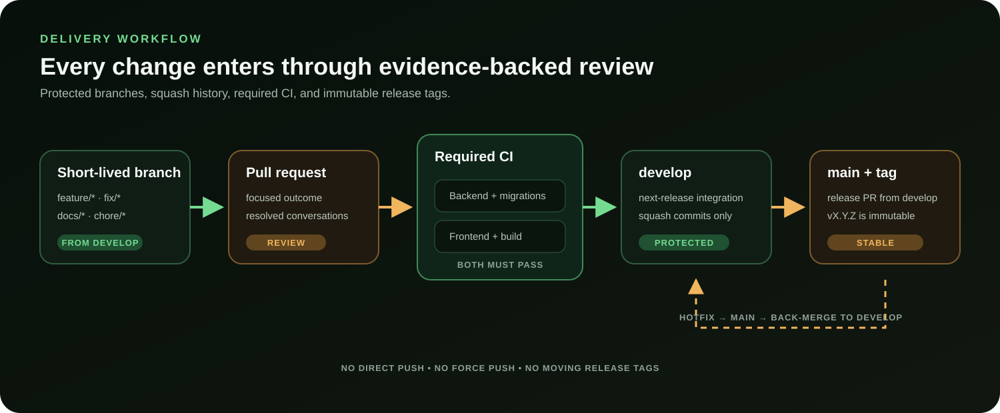

# Branch policy

## Long-lived branches

### `main`

`main` is the stable release branch. It accepts pull requests from `develop`
for planned releases and from `hotfix/*` for urgent fixes. Direct pushes,
deletion, force-pushes, and merge commits are prohibited. Every merge must pass
the backend and frontend CI checks and have all review conversations resolved.

### `develop`

`develop` is the integration branch for the next release. Work reaches it by
pull request from a short-lived branch. It has the same CI, history, deletion,
and force-push protections as `main`.

## Short-lived branches

Create branches from `develop` with a concise kebab-case suffix:

- `feature/` for new behavior
- `fix/` for defects
- `docs/` for documentation-only work
- `refactor/` for behavior-preserving restructuring
- `test/` for test-only work
- `chore/` for maintenance and dependency work

Create `hotfix/` branches from `main`. After a hotfix reaches `main`, merge the
same change back into `develop` through a pull request.

Historical experiment branches, including `codex/v0.1-local-control-plane`, are
not release baselines and must not receive new work. Use the immutable release
tag for v0.1 evaluation and the latest `develop` for current development.

## Merge and release rules

- Pull requests use squash merge so each PR becomes one traceable commit.
- The pull request title follows Conventional Commit style and becomes the
  squash commit subject.
- `develop` is promoted to `main` through a release pull request. When an older
  squash promotion left the two branches without usable merge ancestry, create
  the release branch from `main`, replace its complete tree with the exact
  audited `develop` tree, and verify tree equality before opening the pull
  request. This protected release bridge is squash-merged into `main`; it does
  not require a merge-commit or linear-history exception.
- Releases are tagged from `main` using semantic versions such as `v0.1.0`.
- An administrator may change protection only to resolve an incident; the
  exception must be recorded in an issue and protections restored immediately.

The release-bridge procedure is content promotion, not a new source of release
changes. After its final refresh, `git diff --exit-code <develop> <bridge>` must
pass, required CI must be green on the bridge, and the release audit must record
the two exact commit IDs. If the audited `develop` tree moves, the bridge is
stale and must not merge. This rule preserves the protected linear histories,
the immutable prior release tag, and the exact candidate content at the same
time.

GitHub enforces the mechanical rules. This document defines the intended source
and destination branches that GitHub's protection API cannot express directly.
