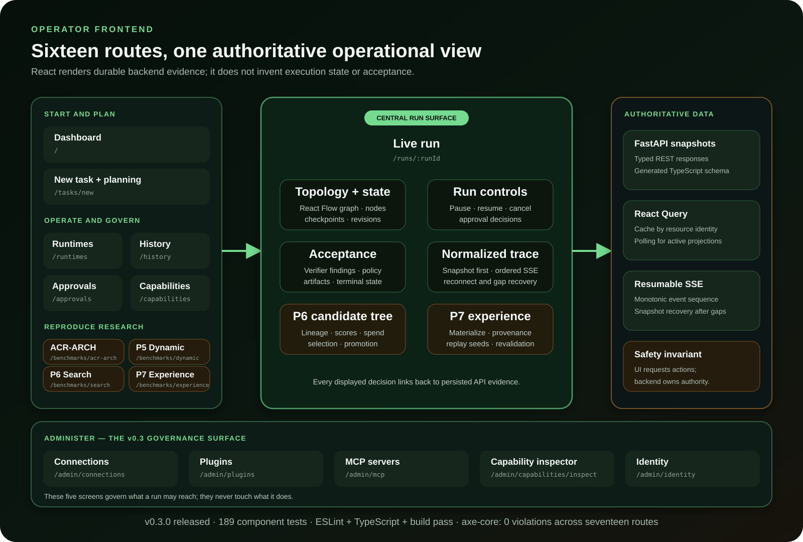

# Operator frontend guide

The Accretion frontend is the browser-based operator console for the same typed
HTTP API and durable records used by automation. It is implemented for the full
P0–P7 scope plus the v0.3 M6 administration surface: project and task setup,
deterministic planning, live run control, graph and verifier evidence,
governance, bounded candidate search, verified-experience replay, reproducible
benchmark views, and the Plugins, Connections, MCP Servers, Capability Inspector
and Identity pages.



> [!IMPORTANT]
> The frontend is feature-complete for the v0.3 release. Its generated
> contract, lint, TypeScript, component tests, and production build pass.
> Rendered browser and accessibility evidence **is** claimed for v0.3.0: axe-core
> 4.10.2 reports zero violations across all seventeen routes, no route scrolls
> horizontally at 390 px, and no measured text falls below WCAG AA. See
> [browser and accessibility evidence](../releases/v0.3/browser-a11y-evidence.md).
> The v0.2 release exception in issue #52 is thereby discharged.

## What an operator can do

| Surface | Route | Implemented behavior |
|---|---|---|
| Dashboard | `/` | Runtime health, active/recent runs, current system state, and navigation into run evidence |
| New task | `/tasks/new` | Project registration, typed task constraints, budgets, outputs, capabilities, profiling, planning review, and strategy override |
| Live run | `/runs/:runId` | Run controls, read-only React Flow topology, node/loop state, approvals, verifiers, runtime decisions, candidate lineage, P7 materialization/replay provenance, and normalized events |
| Runtimes | `/runtimes` | Provider health, supported runtime versions, pressure, and active session inspection |
| History | `/history` | Durable run history and full audit lookup |
| Approvals | `/approvals` | Pending human gates and explicit approve/deny decisions |
| Capabilities | `/capabilities` | Capability, skill, plugin, and policy registry inspection |
| ACR-ARCH | `/benchmarks/acr-arch` | Frozen v0.1 architecture benchmark filters, task details, utility, regret, and replay evidence |
| P5 Dynamic | `/benchmarks/dynamic` | Frozen static/dynamic cohort comparison, structure/replan metrics, safety, fallback, and release classification |
| P6 Search | `/benchmarks/search` | Frozen N=1/2/4 quality-versus-compute results and provider/null-result comparison |
| P7 Experience | `/benchmarks/experience` | Frozen fresh/success/failure/replay treatments, transfer-safety metrics, task results, and gate reproduction |
| Plugins | `/admin/plugins` | Installed plugin version, state, requested capabilities, grants, connector status, and lifecycle history |
| Connections | `/admin/connections` | Per-connection status, scopes, owner and last health check, with connect, reauthorize, revoke and health actions that never render a credential |
| MCP servers | `/admin/mcp` | Server transport, patterns, discovered tools and capabilities, cache hints, and circuit-breaker state |
| Capability inspector | `/admin/capabilities/inspect` | Resolution of a capability onto its binding, connection, risk and policy, stating the reason when resolution is refused |
| Identity and roles | `/admin/identity` | The caller's issuer, subject and session, plus enterprise-authorization state; read-only, with no way to change a role |

Unknown routes render an explicit not-found page. Live provider actions remain
disabled unless the deployment and project gates permit them.

## Operator journey

1. Open **New task** and register a local Git repository.
2. Create a typed task with objective, constraints, concrete success criteria,
   budgets, output paths, capability bounds, and risk.
3. Inspect the deterministic profile, selected static strategy, evidence, and
   unknown inputs before starting a run.
4. Optionally retrieve and freeze P7 experience, propose and validate a P5
   workflow, and attach a P6 or P7 search before activation.
5. Open **Live run** to follow graph state, loop iterations, candidate branches,
   approvals, verifier evidence, and the resumable normalized event stream.
6. Use **History**, **Runtimes**, **Approvals**, and **Capabilities** to diagnose
   operational or policy state without treating the UI cache as authority.
7. Reproduce ACR-ARCH, P6, or P7 research from its dedicated benchmark page.

## Data and authority model

The UI is intentionally a projection, not an execution authority:

- FastAPI responses are the typed snapshot source of truth.
- `openapi-typescript` generates `apps/ui/src/api/schema.d.ts`; handwritten UI
  types alias that generated contract.
- Styling is mid-migration. `apps/ui/src/theme.css` holds the design tokens and
  the Tailwind v4 layers; `apps/ui/src/styles.css` still holds every rule the app
  actually renders and is deliberately unlayered, so it takes precedence over any
  utility. Tailwind's Preflight reset is not imported yet. Moving a rule therefore
  means deleting it and adding the utility in the same edit — a utility placed
  beside a surviving rule has no effect.
- React Query keys cache entries by durable resource identity and polls active
  projections where needed.
- Live runs load an authoritative audit snapshot first, then subscribe to
  monotonic server-sent events. A sequence gap closes the stream and refetches
  snapshots before reconnecting.
- Buttons request backend transitions. Backend policy, optimistic revisions,
  feature flags, approval rules, budgets, and verifiers decide whether the
  transition is valid.
- Provider messages and frontend labels cannot mark work accepted.

## P5–P7 frontend coverage

| Milestone | Planning surface | Run/research surface |
|---|---|---|
| P5 dynamic workflows | Propose, validate, inspect findings, attach only to accepted graph nodes, activate | Graph revision/runtime decisions plus frozen static-versus-dynamic cohort evidence |
| P6 candidate search | Choose mode, node, branch/parallel limits, and branch/total budgets | Candidate tree with runtime/model/version, reviewer, spend, score, terminal reason, selection, and promotion state |
| P7 verified experience | Retrieve same-repository matches, inspect provenance/compatibility/risk, freeze up to three, choose replay | Explicit terminal materialization, fresh/replay labels, source lineage, safe segment IDs/guidance, revalidation, and frozen transfer gate |

P5, P6, and P7 remain independently disabled by default. The UI can opt a
project in, but it cannot override a disabled deployment flag.

## Run the frontend

From a `develop` checkout after the root installation steps:

```bash
make api
```

In another terminal:

```bash
make ui
```

Open `http://localhost:5173`. Vite proxies `/api` to the local FastAPI service.
Start with the deterministic `FAKE` runtime; signed-in Codex and Claude sessions
are optional local integrations.

## Verify frontend changes

```bash
npm run api:generate
git diff --exit-code -- apps/ui/src/api/schema.d.ts
npm run check
npm run test
npm run build
```

The v0.3 release gate records 97 component tests plus successful ESLint,
TypeScript, generated-contract, and production-build checks, and the
accessibility evidence above. The build currently
reports a non-blocking bundle-size advisory; it is visible technical debt, not a
failed correctness gate.

When changing an API response, regenerate the OpenAPI client and commit the
schema diff with the backend change. When changing a surface, add a component
test for the user-visible state and retain semantic labels/regions used by
assistive technology.

## Frontend source map

| Path | Responsibility |
|---|---|
| `apps/ui/src/App.tsx` | Shell, routing, dashboard, task/planning, governance, runtime, history, and benchmark pages |
| `apps/ui/src/RunExecution.tsx` | Live graph, controls, approvals, verifiers, P6 candidate tree, P7 experience lineage, and materialization |
| `apps/ui/src/api.ts` | Typed HTTP client and resumable event URL construction |
| `apps/ui/src/api/schema.d.ts` | Generated OpenAPI TypeScript contract; do not hand-edit |
| `apps/ui/src/types.ts` | Small aliases over generated schemas |
| `apps/ui/src/graphLayout.ts` | Deterministic layout for read-only execution projections |
| `apps/ui/src/styles.css` | Responsive visual system and state styling |
| `apps/ui/src/*.test.tsx` | Component, event recovery, lineage, benchmark, and layout evidence |

For end-to-end system behavior, continue with the [developer showcase](showcase.md).
For release status, see the [v0.2 release audit](../releases/v0.2/audit.md) and
[delivery plan](../releases/v0.2/plan.md).
