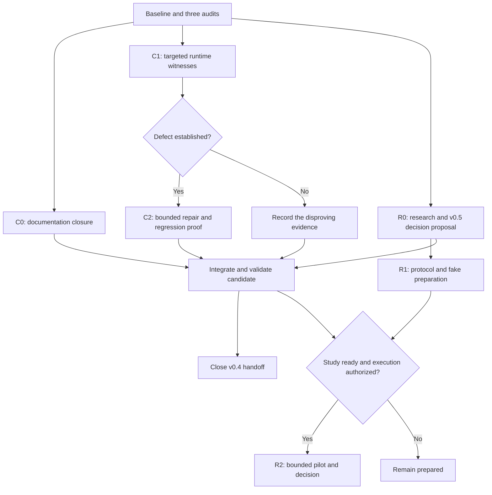

# v0.4 completion and handoff plan

**Prepared: 8 September 2026. Approved by Santapong in the Codex conversation
on 8 September 2026; bounded local implementation and validation completed
on 9 September; protected integration completed through [PR #179](https://github.com/santapong/Accretion/pull/179) the same day.** The original reviewed
plan is preserved at `55536dce89b2a64d16dcae20a1e5a0f11db05638`. Follow the
[execution record](closure-execution-2026-09-08.md) for completed work and checks.

The v0.4.0 and v0.4.1 releases already exist. M0–M10 are recorded as delivered;
the job is to reconcile the remaining documentation, test specific correctness
concerns, and make the research handoff explicit. Rebuilding completed milestones
would not advance this work.

## Baseline and meaning of completion

The planning base is freshly fetched `develop` at
`8ded8bab151267ec8e06182f52543dabed6eaca7`. `main` and the peeled v0.4.1 tag
point to `f60c7faae68a4ebae7ad4e15696746957690ce7b`. The
[baseline checkpoint](planning/baseline-checkpoint-2026-09-08.json) records tag
identities, worktrees, frozen document hashes and the limits of this inspection.
The [plan validation record](planning/plan-validation-2026-09-08.json) records
document checks, independent review and the work not performed by this plan.

| Dimension | Evidence at the planning base | Completion rule |
|---|---|---|
| Released engineering | v0.4.0 and v0.4.1 are tagged; M0–M10 have dated closure evidence | Preserve the releases and reconcile current status pages |
| Acceptance | The dated baseline reports 167 criteria: 159 claiming tests, 5 frontend witnesses, 3 unexpired manual witnesses; 50 belong to v0.4 | Re-run applicable gates on any new code candidate; do not describe historical counts as a new run |
| Runtime limitations | Tool-bearing routed AGENT sessions remain denied; exploration accounting reconstructs reservation charges | Test the narrow remaining concerns and retain safe defaults until proven |
| Research | Synthetic replay gives a paired regret result; the full registered claim remains partial; the priced routing pilot was not run | Record the limited claim and a scoped go/no-go decision; a negative result can close a study |
| Future roadmap | v0.5 simulation and v1.1–v1.8 are forward designs | Admit each release only through its own entry conditions |

Sources: [release baseline](baseline.md), [acceptance baseline](acceptance-baseline.md),
[research results](../../research/v0.4/results.md), and the three audits below.
This planning pass did not run application tests, read raw locked traces, invoke
providers, or execute a physical trial.

## Parallel review and worktrees

Four new worktrees were created from the same commit. Existing M2 and runtime
worktrees were left in place.

| Role | Branch | Worktree under `/mnt/data/accretion-v04-plan-2026-09-08/` | Deliverable |
|---|---|---|---|
| Coordinator | `docs/v04-completion-plan` | `integration` | This plan, baseline and validation records |
| Release reviewer | `docs/v04-release-audit` | `release-audit` | [Release and documentation audit](planning/release-closure-audit-2026-09-08.md) |
| Runtime reviewer | `docs/v04-runtime-audit` | `runtime-audit` | [Runtime gap audit](planning/runtime-gap-audit-2026-09-08.md) |
| Research reviewer | `docs/v04-research-audit` | `research-audit` | [Research readiness audit](planning/research-readiness-audit-2026-09-08.md) |

Use at most three workers plus one coordinator. Workers own disjoint files,
commit bounded work locally, and report evidence before integration. These are
planning worktrees; they contain no runtime implementation changes.

## Decisions that prevent unnecessary work

1. **Close the documentation mismatch first.** The backlog still marks M2
   pending and M6–M9 unstarted; the milestone index and audit contain pre-release
   wording. The dated acceptance and release records supersede those sentences.
2. **Test accounting behavior before designing a new ledger.** `LedgerRegistry`
   reconstructs EXPLORE reservation charges from immutable receipts. Loss of all
   prior spending on restart is not the current behavior. Settlement overruns,
   cross-run admission, malformed charge labels and cap scope need narrower
   evidence, described in the runtime audit.
3. **Keep exact tool binding as a capability boundary.** Selected TOOL calls
   and AGENT sessions have different paths. Support in one does not prove support
   in the other. Do not remove the AGENT rejection to make a workflow run.
4. **Keep the research conclusion honest.** Amendment 1 was already frozen
   and read, and the access log has four rows. No additional locked read is
   necessary to explain the current result. The full claim did not become a pass.
5. **Separate a closure from a new release.** Documentation corrections need
   no new product version. A confirmed backward-compatible defect may justify a
   patch proposal; new AGENT capabilities or schema semantics require explicit
   scope and version review. This plan does not allocate v0.5 to unrelated work.

## Work packages

### C0 — Reconcile release and operational documentation

**Priority:** first. **Owner:** release worker. **Size:** small.

Update the project README, documentation hub, v0.4 milestone index and backlog
to identify v0.4.1 as released and M0–M10 as complete. Correct stale draft labels,
access-log counts and the distinction between reserved and settled exploration
cost. Explain TOOL pin enforcement separately from AGENT session denial.

Keep original release evidence and frozen research documents intact. Use dated
clarifications where a historical statement needs context. Correct illustrative
release-position diagrams only where they make a current status claim; keep
their accessible titles and descriptions synchronized.

**Acceptance:** every current entry point agrees with the baseline; each milestone
links to its witness; limitations match code; links and SVG checks pass; no
unclaimed feature, research result or repeated live-provider run is introduced.
The release audit supplies the exact document inventory.

### C1 — Establish executable witnesses for the remaining runtime concerns

**Priority:** before enabling exploration or widening a pilot. **Owner:** runtime
worker. **Size:** medium; investigation may close a concern without a fix.

Use deterministic tests and disposable PostgreSQL state, with real independent
store connections where locking is the question. Cover:

- two runs competing for the last allowance under the same workspace/node-class
  key, including more than one service process;
- settlement below, equal to and above its reserved cost, followed by a registry
  rebuild and a second exploration request;
- missing, malformed, duplicate or contradictory receipt charges;
- the actual cap scope: workspace/node class versus the SDD's per-run/per-day
  wording, with no assumption that a normalized cost cap is a currency limit;
- a historical stored contract that is projected/upcast before a routing
  reference check, distinguishing its writer identity from the projected hash.

**Acceptance:** each concern is either reproduced with an expected invariant and
a failing regression test, disproved with a test that covers the alleged path,
or left explicitly unresolved with a bounded next probe. Inspecting a method or
passing an in-memory test alone does not prove multi-process behavior.

### C2 — Repair only defects established by C1

**Priority:** conditional correctness work. **Owner:** runtime worker; coordinator
owns shared store interfaces and migrations. **Size:** medium or large after C1.

For a reproduced budget race, serialize admission at the budget's actual shared
key and make the reservation/receipt commitment atomic with that decision.
Define lock order relative to the existing per-run lock, and test contention,
crash windows, duplicate delivery and independent keys.

For an observed overrun, preserve the measured cost and define a conservative
overrun/deny policy that survives restart. Do not clamp reality to its estimate
or erase the observation to retain a proof. Add a durable settlement mechanism
only if the demonstrated invariant needs it; do not create a second mutable
copy of the whole ledger by default.

For an upcast identity defect, compare against the verified stored writer
identity at the reference boundary while retaining the current projection for
understood semantics. A readable projection does not authorize execution when a
newer field has unknown execution significance. Preserve immutable receipt and
contract identities. Legacy digest migration is a separate compatibility project.

If recovery introduces new durable accounting facts, old AUTO writers must
remain disabled unless they understand those facts. A downgrade test alone
does not make an older binary enforce new reservations or settlements.

**Acceptance:** the C1 witness fails before and passes after the repair; both
stores preserve the same contract; restart, replay, duplicate and contention
cases pass; required release gates pass; defaults stay baseline-only unless a
separate activation gate is satisfied. Record a version decision before proposing
a release. If C1 finds no defect, close the package with its evidence.

### R0 — Record the research outcome and v0.5 entry decision

**Priority:** required for an unambiguous research handoff. **Owner:** research
worker; decision belongs to the maintainer. **Size:** small.

Prepare a dated decision recording: engineering release complete; synthetic
paired regret result retained; no verified binary superiority or full safety
success claimed; no priced routing result. The proposed outcome is **NO-GO for
the full routing-benefit claim**, with a bounded account of what the paired
result supports. This is a decision proposal until the maintainer adopts it.

Map that decision to [v0.5 §2.4](../../sdd/future/v0.4-v1.0/02_SDDS/Accretion_SDD_v0.5.md#24-entry-conditions).
Verify the other four entry conditions individually: prior release gates,
stable migrations, undeclared-capability denial, and independent three-valued
verification. A tag or this plan alone does not establish all five.

**Acceptance:** an explicit, attributable decision and evidence matrix exists;
the partial research result is preserved; moving into simulation does not imply
a positive hosted-provider claim or physical authorization.

### R1 — Prepare a separate real-provider development pilot

**Priority:** optional research continuation, independent of historical release
closure. **Owner:** research worker, with a bounded instrumentation contributor
after C1. **Size:** medium; no provider spend in preparation.

Create a new study directory and identifier. Specify the decision the pilot
will inform, the fixed baseline and candidate policy, frozen tasks and splits,
provider/model/runtime identities, allowed configuration observability, independent
verification, failure handling, complete cost accounting and stopping rules.

The current replay runner is not a live routing study. The existing M6 grading
path does not supply an independently verified outcome, and its normalized cost
proxy does not establish a monetary cost. Supply attributable verification
records and either measured prices or explicitly labeled unavailable estimates.
Keep cached, failed, retried, rejected and verification calls in the ledger.

Prove the data collection and export path with fake runtimes and a zero-spend
dry run. Use the smallest compatible runtime configuration; a pin-aware AGENT
session is a dependency only if the approved pilot requires that capability.

Record how OQ-409 applies: the current shadow evidence floor of 30 complete
pairs at workspace scope does not establish a per-configuration quota or a
hosted-model power calculation. Qualify the chosen evidence rule before any
promotion or claim; do not copy the synthetic trial count as live power.

**Dependency:** protocol drafting can run in parallel with C1. Instrumentation
and any R2 treatment using a questioned boundary require its C1/C2 disposition.
Repair a confirmed defect first or mechanically exclude the affected mode. A
baseline-only instrumentation pilot can be independent only when its manifest
explains and enforces why the questioned accounting path is unused.

**Acceptance:** dry-run artifacts join configuration → receipt → execution →
independent outcome → usage/cost; missing data becomes inconclusive; fresh data
roles prevent development examples leaking into final evaluation; the manifest
and verifier qualification can be reviewed before spending.

### R2 — Execute and report a pilot only after its explicit gate

This package remains **blocked on study inputs and execution authorization**,
not on another general literature review. Before any call, the reviewable R1
artifact must name providers/accounts, price provenance, total monetary ceiling,
per-run limits, task count, repeats, verifier, approved side effects and the
person accepting the plan. No numerical threshold or spending allowance is
inferred from this planning request.

An AUTO treatment additionally requires the applicable C2 repairs and existing
calibration, holdout and promotion gates. A signed study does not override a
runtime accounting or binding failure.

Run only the frozen development pilot, preserve failures and costs, and publish
a local decision report with uncertainty and limitations. Do not turn a pilot
into a confirmatory result. Any later confirmatory study needs a new registered
protocol, justified endpoints and sample size, independent evaluation data and
its own execution decision. The existing 0.05 false-acceptance ceiling is not
changed after inspecting its outcomes.

**Acceptance:** budget and stop rules hold; results are reproducible from
redacted artifacts; the outcome is go, no-go or inconclusive with reasons. A
negative result completes the study rather than triggering unlimited retries.

### E1 — Optional pin-aware AGENT sessions

Keep this as a separately scoped capability extension. It needs an end-to-end
pin that binds runtime session creation, tool discovery and invocation to the
selected configuration; exact allowlisting; stale/revoked binding denial;
reconnect and crash handling; and proof of no effect when any pin cannot be
honored. Provider/runtime adapters must demonstrate support individually.

The current refusal remains the fallback. Do not implement this lane in parallel
with conflicting C2 edits to the same runtime/store boundaries. It does not block
closing the already released v0.4 scope, and it needs an explicit SDD/version
decision before execution.

## Execution waves and ownership



| Wave | Worker A | Worker B | Worker C | Coordinator |
|---|---|---|---|---|
| 0, completed for this plan | Release audit | Runtime audit | Research audit | Reconcile evidence and write plan |
| 1 | C0 documentation | C1 budget witnesses | R0 decision + R1 protocol only | Assign shared-file ownership and review witnesses |
| 2, conditional | Upcast fixtures/tests only, then assigned repair after budget merge | C2 budget repair; sole owner of shared store/service edits | R1 fake-runtime instrumentation after applicable C1/C2 disposition | Serialize store, migration and run-manager changes |
| 3 | Targeted regression review | Compatibility/recovery review | Evidence/protocol review | Integrate one PR at a time; run final gates |
| Later, explicit scope | E1 capability extension or R2 study | Assign only when independently useful | No forced third lane | Version/study decision before execution |

In Wave 1, worker A exclusively owns C0's README/index/backlog/status edits;
worker C writes new decision/protocol documents and sends any shared-index
change to A. In Wave 2, worker B owns budget changes to the store and routing
service. Worker A may prepare independent upcast fixtures/tests, but takes over
those shared implementation files only after B's work is integrated.

The coordinator assigns migration numbers and owns SDD authority decisions,
schema export integration, lockfile changes and final conflict resolution.
Workers submit dependencies before touching an owned surface. Never let two
branches allocate the same migration or rewrite the same frozen research
record. New dependency-update branches fetched on 8 September stay outside this
work unless a tested fix requires one.

The audit reports use local package identifiers. Their mapping to this master
plan is: C0 = release RC-1/RC-2 and runtime E0; C1/C2 = runtime E1/E2;
R0 = research R0; R1 = research R1–R4 preparation; R2 = research R5 and any
separately approved R6 continuation; optional AGENT E1 here = runtime E3.

## Worktree execution rules

For implementation, create fresh branches from the latest reviewed `develop`;
the planning worktrees preserve the audit base and should not silently become
long-lived implementation branches. Use names such as
`docs/v04-close-status`, `test/v04-budget-invariants`,
`fix/v04-budget-admission` and `docs/v04-next-pilot-protocol` only when that
work package starts.

```bash
# From the main checkout, after confirming that develop is clean/current:
git fetch origin
git worktree add -b test/v04-budget-invariants ../Accretion-v04-budget origin/develop

# Inside that new worktree:
uv sync --locked --all-groups
uv run --no-sync python -c 'from pathlib import Path; import accretion; print(Path(accretion.__file__).resolve())'
```

The printed import must belong to that worktree. Do not share an editable Python
environment that imports the main checkout. Give concurrently tested worktrees
separate disposable databases and ports; two connections inside a concurrency
test intentionally share that test's database. Do not start, stop or reuse a
production service as a shortcut. No app dependencies or services were installed
for these documentation-only audit worktrees.

## Integration, validation and release

1. Review a worker's diff and evidence, then integrate its bounded commit into a
   fresh integration branch. Resolve shared-file changes there. Rebase/refresh
   dependent work from the merged `develop` before its next gate.
2. Documentation-only changes: validate all new Markdown links and run
   `make docs-check`. Preserve the 187-file future-package manifest. No runtime
   acceptance or research claim follows from these checks.
3. Runtime changes: run meaningful targeted tests first, then the repository's
   required `make check`, `make test`, `make acceptance` and `make release-gate`
   with the documented disposable environment. Run migrations both ways if any
   migration changes, regenerate affected contracts and keep frontend anchors
   synchronized. Avoid paid/live-provider tests unless separately authorized.
   The unchanged regression suite may reproduce committed benchmark calculations
   using temporary access logs. That is a reproducibility test, not a new
   scientific read: it must not append to the committed research log, change
   frozen inputs, tune analysis or claim a new measured result.
4. Use plain Git for commits and push only the intended branch. Open a PR into
   `develop`; require backend, frontend, browser and clean-checkout CI and
   resolved review conversations. Squash through the protected PR workflow.
   Do not bypass branch protection or push directly to `develop`.
5. If a new runtime release is justified, record its semantic-version decision,
   exact candidate and audit. Promote through the repository's protected
   `develop`→`main` release procedure, verify tree equality, and create a baseline
   only after the actual release/tag exists. Do not rewrite v0.4.0 or v0.4.1.

`make acceptance` includes the existing expiring manual witnesses; it does not
require a new paid provider run while they remain valid. The earliest recorded
expiry is 28 February 2027. A new result must still satisfy its own scope.

## Exit checklist and stop conditions

- [x] C0: status, limitations, milestone witnesses and research counts agree.
- [x] C1: each high-priority runtime concern has a reproducible witness or an
  explicit bounded disposition; no source-only suspicion is called a fixed bug.
- [x] C2: any confirmed defect is repaired and independently reviewed, or the
  affected optional mode remains unavailable with an explicit limitation.
- [x] R0: the full-claim research decision and all v0.5 entry conditions have
  attributable dispositions; partial evidence is preserved.
- [ ] The final integrated candidate passes its applicable local and remote
  gates; original tags, manifests, frozen protocols and access-log history match.
- [x] Deferred work has an owner, trigger and scope; it is not presented as
  unfinished M0–M10 implementation.

Stop and revise the plan if a witness needs a wider contract change, the runtime
cannot enforce a selected pin, a shared budget cannot be accounted for, an
experiment lacks an independent outcome, or the latest `develop` changes the
audited boundary. Do not open a new locked research read, weaken safety
thresholds, enable learned routing, or spend against unspecified allowances to
obtain a green result. Unchanged regression reproduction with a temporary log
is permitted under the validation rule above.

The remaining v0.3 enterprise/identity deferrals, legacy digest rehashing, parked
operator-UI ladder, public benchmark naming, dependency housekeeping and physical
robotics stay separate. E1 and R2 may be worthwhile next work, but neither changes
the recorded fact that the v0.4 releases have already shipped.
