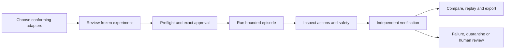

# v0.5 completion plan — Robotics Simulation and Embodiment Foundation

Prepared 9 September 2026 (Asia/Bangkok) from freshly fetched
`develop@01e2268b3b602a12eeaf81f55fb4670a1fe7636f`.
Status: **APPROVED FOR IMPLEMENTATION** by Santapong on 9 September 2026.
Follow the [execution checkpoint](execution-2026-09-09.md) and concrete decision
gates. The dated planning validation describes the original proposed document.
The released line remains v0.4.1. No v0.5 implementation or simulation result is
claimed by this document.

## 1. Intended result

A researcher can define one simulation experiment, bind it to two different
robot adapters, execute bounded episodes, inspect every admitted action and
safety decision, independently verify the result, replay the evidence and
compare outcomes from a frozen evaluation protocol. The same high-level reach,
pick-and-place and declared recovery tasks work across the two embodiments.

Accretion orchestrates experiments. The adapter/controller executes the motion;
the control plane owns permission, resource limits, evidence and acceptance.
Physical execution, learned real-time control, validated cross-embodiment policy
transfer and v0.8 graph learning remain outside v0.5.

**Recommended release profile:** CPU-oriented MuJoCo workers; UR5e with a
Robotiq 2F-85 gripper as the six-axis flagship; an independently implemented
Panda adapter as the second embodiment. This is an explicit proposed alternative
to the SDD's Gazebo Harmonic / ROS 2 Jazzy defaults. M0 must approve and record
that choice before adapter development. A single pinned physics engine keeps
the initial comparison bounded; this release would not claim cross-simulator
portability. [Runtime audit and primary sources](planning/runtime-audit-2026-09-09.md#simulator-and-embodiment-decision-for-m0).

## 2. Basis and readiness

The [forward v0.5 SDD](../../sdd/future/v0.4-v1.0/02_SDDS/Accretion_SDD_v0.5.md)
defines ten implementation steps and **30 acceptance criteria**. This plan names
its §21 steps **M0–M9** in the same order. The older robotics charter contains
broader transfer proposals; it does not replace the narrower SDD.

Three parallel planning agents inspected contracts, runtime and acceptance in
separate worktrees, while the coordinator inspected product integration and
assembled the delivery sequence:

| Review | Finding | Detailed evidence |
|---|---|---|
| Contracts and authority | Existing IDs, writer identities, event envelopes, approvals and verifier identities need an explicit robotics reconciliation | [Contract audit](planning/contract-audit-2026-09-09.md) |
| Runtime and adapters | Core orchestration primitives exist; the simulation host, leases, admission, recorder, real adapters and embodied verification do not | [Runtime audit](planning/runtime-audit-2026-09-09.md) |
| Acceptance and research | Current CI cannot certify v0.5; all 30 criteria need harness ownership and a new, non-vacuous simulation evaluation | [Acceptance audit](planning/acceptance-audit-2026-09-09.md) |
| Product and integration | Reuse the current operator shell and backend-derived projection, with new simulation inventory, experiment and episode surfaces | Sections 5–8 below |

The [v0.4 handoff](../v0.4/research-handoff-2026-09-08.md) records satisfied
inherited entry conditions, including the explicitly allowed **documented
NO-GO** for v0.4's full routing-benefit claim. The [closure](../v0.4/closure-execution-2026-09-08.md)
and [dependency review](../v0.4/dependency-review-2026-09-09.md) contain the executed
migration, capability-denial and independent-verification evidence. Those are
historical runs on their recorded candidates, not fresh v0.5 checks.

The [planning checkpoint](planning/baseline-checkpoint-2026-09-09.json) pins the
source identities. The original protocols, four-row scientific access log and
187-file imported package remain unchanged. Planning needs no locked-corpus
re-read and inherits no positive simulation claim.

## 3. M0 decision packet

The following decisions are part of the implementation plan, with explicit
review before dependent work begins. The [contract audit](planning/contract-audit-2026-09-09.md#m0-decisions-that-block-independent-implementation)
contains the source conflicts and alternatives.

| Decision | Recommended implementation direction | Completion condition |
|---|---|---|
| Active specification and ownership | Create an active `docs/sdd/Accretion_SDD_v0.5.md` and scoped registry/ADR overlay from the preserved source. Use stable proposed IDs `AC5-001`–`AC5-030` in §22 source order; store milestone ownership separately | Reviewed source-to-active diff; all 30 original requirements retained; inherited contracts have one owner |
| Simulator and models | Select the MuJoCo/UR5e+2F-85/Panda profile above, with a documented Gazebo/Jazzy alternative if ROS is a release requirement | Bounded feasibility confirms installation, headless observations, rigid-object contacts and both model bindings; exact package/image/model/controller digests and licenses recorded |
| Canonical contracts | Keep existing prefixed IDs, workspace/project scope, canonical JSON algorithm, typed refs and risk/evidence enums. Separate verified original writer envelopes from reader projections | Golden vectors, schema inventory, old/new-reader cases and unknown-major/authority-field refusal specified |
| Simulation authority | Start with a content-bound approval for each exact episode. Every action also needs current capability permission and deterministic safety admission. Preserve the current HIGH mapping and generic gateway rules | Freeze approval scope, consumption, expiry, revocation, preflight and lease binding. Existing objective approval alone must not authorize arbitrary future episodes |
| Finite study approvals | A reviewable finite matrix of exact trial approvals is the proposed usability option; it needs explicit M0 authority review. Otherwise the runner pauses for each episode approval | No driver-generated human approvals, wildcard seeds, unreviewed retries or silent policy downgrades. Report approval overhead in end-to-end timing |
| Action preparation and safety | A bounded preparation step produces a candidate command without advancing physics. Admission binds its digest to the current state, transforms, envelope and fenced lease; execution consumes exactly that command | No pose-only safety claim. Test path interiors, numeric limits, stale state and command substitution before real invocation |
| Grasp and collision policy | Freeze permitted finger/object contacts by task phase and bounds while retaining forbidden contact/workspace checks | Pick/place can grasp without globally disabling collisions; task verifier measures release and post-release stability |
| Receipt signatures and identities | Define an authenticated evaluator identity and detached, domain-separated signed safety receipts; keep policy and safety decisions distinct | Key custody/rotation and signature validation specified; a SHA-256 content hash is not treated as a signature |
| Host, lease and endpoint boundary | Out-of-process isolated simulation workers, internally resolved opaque endpoints, durable exclusive leases and fencing, bounded resources and process-tree teardown | No arbitrary URL or physical/device endpoint; stale workers cannot act after lease replacement |
| Events, artifacts and replay | A compatible versioned domain envelope/outbox supports events before a run exists. Content-addressed, chunked manifests capture raw and normalized evidence; tolerant physics replay is the default proposal | Event reconstruction and physics replay have separate tests; old AgentEvent/read paths remain valid; replay never upgrades its declared class |
| Verifier and experience boundary | Separate verifier process and service identity with read-only sealed evidence; one explicit bridge to existing experience/contradiction lineage | Producer cannot submit acceptance. Different-embodiment material remains an explained weak prior and cannot choose live actions |
| API, UI and evaluation contract | Freeze minimum APIs plus scoped read/list/SSE/export endpoints, state meanings, protocol fields and all acceptance ownership | Backend DTOs drive generated frontend types; study thresholds/splits remain prospective and separately frozen before outcome access |

M0 has two bounded parts: **M0a** approves the design decisions and a feasibility
budget; **M0b** executes that approved feasibility and freezes exact environment,
contracts, test fixtures and acceptance registration. Feasibility is development
evidence, not the registered benchmark. If the recommended profile fails, record
the failure and review the alternative before expanding simulator scope.

## 4. Milestones and completion gates

Paths here are proposed unless linked to an existing source. Detailed test
ownership is in the [30-criterion matrix](planning/acceptance-audit-2026-09-09.md).
A construction milestone closes when the exit witnesses below pass on the
integrated candidate. The matrix's owner is accountable for the criterion;
it does not mean all its later witness components exist at that milestone.
For example, M0 registers AC5-023, but M9 must prove prospective study adoption
and protocol-to-result identity; M1's AC5-010 still awaits both real adapters.
Keep those components explicitly pending. A mocked or interface-only sub-PR
cannot satisfy a required simulator, browser or benchmark witness, and all
components must pass before the full release.

| Milestone | Deliverable | Depends on | Required exit witness |
|---|---|---|---|
| **M0 — freeze** | Active SDD/registry overlay, simulator and authority ADRs, canonical schemas, protocol/event/API contracts, acceptance binding | Plan approval and inherited entry evidence | All 30 criteria registered with stable identity; missing rows/claims fail closed; agreed environment feasibility; no authority ambiguity delegated to workers |
| **M1 — registry and SDK** | Immutable embodiments, adapter manifests, conformance registry, SDK/protocol, additive storage and artifact references | M0 | Same-version mutation and cross-workspace access denied; digest changes invalidate conformance; malformed SDK messages rejected. FAKE validates protocol/fault behavior only |
| **M2 — gateway and leases** | Isolated host, managed simulation gateway, six `robotics.sim.*` capabilities, durable leases and preflight | M1; M0 authority/signature decisions | Two-client lease races, fencing, endpoint confusion, heartbeat/deadline/crash and resource-limit witnesses through the actual host boundary |
| **M3 — deterministic safety** | Prepared-command admission, signed receipts, joint/path/contact/resource checks | M0 types; integrated M2 lease/state boundary | Every denied proposal causes zero execution; stale state, NaN/Inf, substitutions and exact boundary violations fail closed; permitted grasp contacts are narrowly enforced |
| **M4 — episodes and recorder** | Frozen experiments, optimistic state transitions, append-only action/acknowledgement ledger, bounded capture and sealed manifests | M1–M3 | Complete episode through preflight/action/finalization; changed-body retries conflict; uncertain acknowledgement aborts without resend; replay reconstructs state after restart |
| **M5 — independent verification and replay** | Separate verifier host, task/safety/completeness/replay results, quarantine and eligible-experience projection | M4 evidence format; M2 isolation | Forged producer success, tampered/missing evidence and self-verification refused; new-process physics replay passes declared tolerances; contradiction discovers dependent experience |
| **M6 — flagship adapter** | UR5e + 2F-85 adapter and licensed scene/controller overlay, if M0 selects MuJoCo | Develop after M1/M3 interface freeze; close after M4/M5 | Actual reach, grasp/lift/transport/release and declared recoverable fault pass independent verification through Accretion |
| **M7 — second adapter** | Independent Panda translation and descriptor under the same task-level contract and physics profile | M1 protocol; close after M4/M5 and both adapter integration | Genuine second embodiment passes the same black-box conformance and shared tasks; no robot-name branch in the orchestrator and no renamed FAKE/flagship implementation |
| **M8 — Experiment Studio** | Registry, experiment/approval/preflight, live episode, verifier/replay, comparison and export views | UI can start after M0 DTO freeze; close after M4/M5 | Browser journey consumes real backend state, recovers from SSE gaps and displays all failure/review/quarantine outcomes; new routes pass measured accessibility checks |
| **M9 — benchmark and release** | Frozen paired evaluation, ablations, reproduction bundle, security/recovery audit, release candidate and version records | M1–M8 complete; registered protocol approved | All 30 criteria plus inherited gates pass; real simulator campaign and clean-room reproduction substantiate the claim; exact audited tree promoted through protected release workflow |

The first useful demo is **one verified UR5e reach through the complete gateway
and recorder**. It is an intermediate result. It does not finish v0.5 without
pick/place, recovery, the second embodiment, replay, experience boundaries,
Studio and benchmark evidence.

## 5. Parallel execution with isolated worktrees

Use **one coordinator plus at most three active workers**. Agents own bounded
PRs, not the whole release. The coordinator owns integration, reviews, shared
file changes, gate evidence and the next wave's base. Workers may prepare
interfaces or pure tests early, but must not mark integration acceptance passed
before its dependencies exist.

The current planning worktrees are under
`/mnt/data/accretion-v05-plan-2026-09-09/` (`integration`, `contracts`, `runtime`,
`evidence`). Implementation uses fresh task-specific worktrees under a distinct
`accretion-v05-execution-<date>/` directory from the latest verified `develop`.
Do not reuse old v0.4 worktrees or overwrite their remaining work.

| Wave | Worker A | Worker B | Worker C | Coordinator exit gate |
|---|---|---|---|---|
| **0 — M0** | Canonical schemas, refs and compatibility decision packet | Simulator/model/host feasibility specification, then approved bounded feasibility | Acceptance mapping, benchmark draft and API/UI contract review | Reconcile and approve shared decisions; integrate M0 registration and schemas before downstream workers start |
| **1 — foundations** | M1 registry and additive persistence | M1 SDK/conformance protocol and fault adapter | M3 pure safety evaluator and receipt verification against frozen commands | Shared types/store/interfaces integrated; targeted parity and contract checks green |
| **2 — execution boundary** | M2 host, gateway, leases and preflight | M6 flagship translation/controller/scene module | M5 deterministic verifier logic and immutable artifact-reader fixtures | Actual isolated host and fenced lease witnesses pass; adapter/verifier modules remain unaccepted until integrated |
| **3 — episode path** | M4 orchestrator, recorder, APIs and event/outbox integration | M7 independent second adapter | M8 Studio inventory/experiment/episode surfaces against generated contracts | First complete recorded flagship episode with verifier handoff; durable events and artifact manifests verified. Independent verification closes in wave 4 |
| **4 — integrated behavior** | M5 separate verifier host, physics replay, experience/quarantine bridge | M6/M7 real conformance, pick/place and recovery integration | M8 real backend journey, reconnect, comparison/export and browser checks | Both real adapters and all required task families work; all security/uncertainty blockers closed |
| **5 — study preparation** | Fresh-candidate acceptance/migration/security integration audit | Clean-room conformance/replay reproduction and environment manifest | M9 protocol finalization, holdout access controls, paired runner instrumentation | All engineering criteria supported; review exact study protocol, matrix, approvals, budgets and hashes before outcome access |
| **6 — evidence and release** | Candidate integrity and incident triage; any behavior repair stops the affected campaign | Registered simulator campaign in the single compute lane; preserve all outcomes | Independent result/reproduction review and release documentation | M9 evidence passes for the frozen candidate; resolve review findings; exact candidate promoted, tagged and baseline recorded only under release authorization |

M3's integrated admission work belongs with M2/M4 even though its pure evaluator
starts in wave 1. M5's isolated host and replay remain wave 4 gates despite its
logic being authored earlier. M6/M7 have independent adapter owners, followed
by a reviewer who did not author their task-success logic.

Split broad lanes into reviewable PRs without adding concurrent agents. In
particular, M4a implements the durable episode/state/action ledger; M4b adds
recording, manifests, API/outbox and their integrated crash-recovery witnesses.
Neither PR alone closes M4. Refresh the second PR from the reviewed first tree.

No additional subagents are hidden inside a worker. Reuse available worker
slots for gate/review tasks after implementation returns. Run at most one
resource-heavy simulator/benchmark lane and one local browser suite at a time;
agent concurrency is not permission to multiply simulator processes or budgets.
Within the approved bounded window, continue past routine successful gates;
return for changed scope, an unresolved M0 authority decision or the concrete
study/release authorization gate.

Freeze the executable candidate, adapters, evaluator, configuration catalog and
analysis before the locked campaign. A repair that changes any of them or their
qualified dependencies stops the campaign: preserve its outcomes and disposition,
requalify the repaired candidate, and adopt the applicable prospective amendment
or new study with a fresh eligible locked set before resuming confirmatory work.
Never combine different candidates under one result or transfer a passing gate
to a repaired tree. Report/documentation additions may accompany release only
after verifying the executed dependency closure is unchanged and auditing the
final release tree.

## 6. Shared-file and resource ownership

| Surface | Single owner | Coordination rule |
|---|---|---|
| `src/accretion/contracts/robotics/`, IDs, refs and schema export inventory | Contract owner in wave 0/1 | Public types freeze before parallel adapters; reconcile any need to change canonical/upcast behavior with regression witnesses |
| `persistence/models.py`, `persistence/store.py`, ordered migrations and Memory/PostgreSQL parity | Coordinator-designated persistence owner | Workers supply service requirements; allocate the next migration ID from the current tree at integration, not from this plan |
| `api/main.py`, new `api/robotics.py`, event/outbox registration, acceptance/CI configuration | Coordinator/API owner | Integrate one patch at a time; use the current route/envelope conventions and record compatible projection |
| `robotics/host.py`, gateway, leases, preflight and episode service | Execution owner | Keep simulator control out of the generic run manager; only a narrow workflow-capability seam enters it |
| `robotics/adapters/mujoco_ur5e/` and `mujoco_panda/` | Different adapter owners | Share protocol/transport, not robot-specific acceptance logic; model/controller identity remains distinct |
| `robotics/verifiers/`, replay and eligibility bridge | Verification owner | Separate producer/verifier authority and artifact mounts; independent review for acceptance logic |
| `apps/ui/src/routes.tsx`, `api.ts`, `types.ts`, simulation pages and E2E route fixtures | Frontend owner | `OperatorShell` already derives navigation from `routes.tsx`; do not create a second route list |
| `apps/ui/src/api/schema.d.ts`, exported schemas, dependency lockfiles | Coordinator at integration | Regenerate from accepted source; never hand-edit generated schemas or let parallel package installs race |
| Release/protocol records and acceptance policy disposition | Coordinator with evidence owner | Every claim links to a real candidate and witness; no worker can waive its own failed criterion |

Each testing worktree uses its own locked Python environment and verifies that
`import accretion` resolves inside that worktree. Avoid sharing an editable
installation. Reuse dependency caches only where safe; keep simulation packages
in an explicit optional group/image so unit and contract checks run without
loading a simulator.

Use a task-owned PostgreSQL 16 service and separate databases per lane, plus
separate artifact roots and host sockets. Schema migration tests run serially
within a lane; tests clean only their own fixtures. The coordinator runs the
final full suite on a fresh integrated database. Simulation workers get bounded
CPU/memory/PID/output/disk/time limits; exact limits and endpoint profile freeze
in M0. Never reuse production services or robot devices as test dependencies.

## 7. Researcher journey and frontend scope

Reuse the current React shell, generated API types, query invalidation and
snapshot/SSE recovery patterns in
[`routes.tsx`](../../../apps/ui/src/routes.tsx),
[`EventStream.tsx`](../../../apps/ui/src/EventStream.tsx) and
[`LiveRunPage.tsx`](../../../apps/ui/src/pages/LiveRunPage.tsx).
The new episode stream has a typed projection; it is not an unchecked cast to
legacy AgentEvent. Keep graph topology controlled by backend versioned actions.

Proposed screens, finalized with the M0 API contract:

| Surface | User action and evidence |
|---|---|
| `/simulations` | Choose an experiment or create one; see simulation-only labels, task/seed matrix and recent episode outcomes |
| `/simulations/registry` | Inspect embodiment and adapter versions, required observations, approved environment and conformance validity |
| `/simulations/experiments/:experimentId` | Review immutable contract/version differences; choose approved robot/task/seed profile; inspect preflight; grant or inspect exact episode approvals; start eligible episodes |
| `/simulations/episodes/:episodeId` | Inspect normalized observations, proposed/admitted/denied action receipts, budgets, safety events and terminal state; terminate; view independent verdicts, replay, comparison and export |

The minimum SDD API table omits some collection/read/stream operations needed by
these views. M0 must define scoped pagination and read/list/detail/SSE/export
DTOs alongside the eleven specified operations. Writes use idempotency and
optimistic concurrency; stale approvals or versions return an actionable state,
not optimistic client success.

The complete browser journey is:

Test empty inventory, stale conformance, denied preflight, expired approval,
changed-body retries, lost SSE events, abort, FAIL, unresolved INCONCLUSIVE and
quarantine. Sensor previews are bounded artifact views; the browser never owns
simulation state or sends a raw actuator command.

Add new paths and seeded data to `apps/ui/e2e/routes.ts` and the existing browser
harness. The computed-style gate compares DOM shape with its base; new routes
need a specifically documented structural-change entry and measured element
floor while retaining focus, contrast, overflow and accessibility checks. Do
not copy an old route's measurement or turn off the whole browser gate.

## 8. Acceptance, evaluation and the meaning of finished

The [acceptance audit](planning/acceptance-audit-2026-09-09.md) is the complete
source-ordered matrix for `AC5-001`–`AC5-030`. Active registration must reject
missing/duplicate criteria and unknown IDs. Future criteria can be explicitly
not-yet-due during intermediate PRs under the existing policy, with reviewed
milestone/expiry disposition; no v0.5 release gate may pass with them excluded.
A green stage filter over zero criteria is never completion evidence.

For each implementation PR run relevant contract/unit/integration tests and the
current full required CI. At final candidate, run fresh serial migrations,
Memory/PostgreSQL parity, full backend/frontend checks, generated API/schema
comparison, inherited acceptance/release gates, real adapter conformance,
security/fault witnesses, UI browser evidence, sealed export/import and a
clean-environment physics replay. A skipped simulator suite cannot satisfy a
robotics criterion. Preserve the exact environment and commands.

The study has the SDD's four treatments: direct simulator-specific baseline,
static Accretion, routing without retrieved experience, and routing with
compatible verified experience. Pair tasks, seeds, randomization and verifier
versions within each embodiment. Different-embodiment experience never controls
live action selection. Freeze the actual compatible configuration catalog and
policy; relabeling the same execution four ways is not an ablation.

Use distinct development/pilot and held-out evaluation identities. Freeze task
success and post-release stability rules, tolerance profiles, safety/false-
acceptance gates, paired analyses, retries/exclusions, independence, resource
caps and corpus access before seeing held-out outcomes. Pilot outcomes can
inform the prospective design; they cannot be silently reused as held-out data.
Protocol approval includes exact finite trial scope, approvals and compute
budget. A stopped or underpowered study is reported as such.

The [capacity proposal](planning/acceptance-audit-2026-09-09.md#splits-budgets-and-treatment-qualification)
is a review envelope, not approved compute or a statistical justification:

| Bound | Initial proposal, to validate and freeze before execution |
|---|---|
| Matrix | 3 development + 5 qualification + at most 30 locked seeds per task; 3 task families × 2 embodiments × 4 treatments |
| Attempts | At most 912 primary attempts plus one separately recorded replay each: 1,824 total episode executions |
| Per episode | At most 120 simulated seconds, 180 wall-clock seconds and 300 action intents; storage/output ceiling still requires feasibility measurement |
| Campaign | One compute lane with at most two simulator workers; 48 elapsed hours and 96 measured CPU hours; stop on the first exhausted bound |
| Providers | Zero external-provider calls in the proposed local deterministic study; a different scope needs an explicit inventory and budget |

Qualification supplies timing and paired power/precision estimates. The final
locked sample count, numerical nonregression margins, false-acceptance risk
bound and storage ceiling must be justified before protocol freeze. If adequate
precision cannot fit, prospectively revise the scope/budget or report that the
study cannot establish the claim. Failed, denied, aborted, timed-out and
inconclusive attempts stay in the ledger and registered denominator; permitted
reruns consume the same budget. The FAKE-only baseline catalog is insufficient
for B2/B3: qualify a meaningful eligible local configuration set in M0–M8.

| Status | Evidence required | What can be said |
|---|---|---|
| Engineering ready | All implemented surfaces and non-study acceptance witnesses pass on the integrated candidate; benchmark rows remain honestly pending | Ready for the registered simulation evaluation |
| Research qualified | Registered real two-adapter evaluation, required ablations, safety/false-acceptance/non-regression gates and reproduction all pass | The bounded embodiment-neutral simulation-foundation claim is supported |
| **v0.5.0 finished and released** | All 30 criteria, inherited gates, current review findings and evidence pass; exact audited tree merged to main, tagged, release notes and baseline verified | v0.5.0 is released within its documented simulation-only scope |

Unlike the explicit v0.4 entry exception, v0.5's current SDD does **not** allow
its own failed benchmark gate to count as a completed v0.5.0 release. A NO-GO
can support a truthful development preview and a scoped redesign, not a hidden
waiver or automatic unlock of v0.6. Do not tune acceptance thresholds after
outcome access to manufacture a pass.

## 9. Integration and release sequence

Each worker returns a clean commit, changed-file inventory, source-linked
checks and unresolved findings. The coordinator reviews the result, integrates
compatible commits into the candidate worktree and reruns checks affected by
integration. Shared contract changes refresh dependent branches before their
next acceptance run. Keep repair rounds bounded; escalate a changed assumption
instead of widening a worker's scope indefinitely.

Feature PRs target protected `develop`, use Conventional Commits and squash
merge after required checks and review resolutions. Use plain Git and the
visible browser for GitHub-only operations. Inspect the actual compare base/head,
then verify the merged tree and local branch state. Do not reuse the prior
v0.4 merge authorization as permission for a new release.

At release, update package versions and locks together, build the exact candidate,
and record its audit. Follow the repository's
[protected release bridge](../../governance/branch-policy.md#merge-and-release-rules)
if squash ancestry requires it; verify whole-tree equality with audited develop.
Promote to main and tag only under release authorization. After the tag exists,
record the real tag/commit in the baseline and synchronize the release documents
through the normal integration workflow.

There is no defensible completion date before simulator feasibility, the first
verified pick/place episode and pilot timing exist. Review progress at each wave
against merged witnesses, unresolved risks and remaining criteria rather than
agent activity or optimistic task counts.

## 10. Immediate next step after plan approval

Start **wave 0 / M0a** with the three bounded briefs in the audit reports:
contract/authority reconciliation, simulator feasibility design and acceptance/
protocol registration. Present the concrete simulator and approval decisions
with exact scope; then execute only the approved M0b feasibility and freeze.
The subsequent waves follow the dependency table above.
