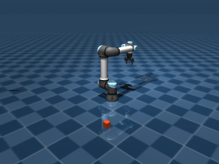
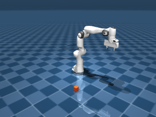

# v0.5 M0 simulation feasibility

**Decision: the approved MuJoCo profile is feasible for continued local
development.** On 2026-09-09, one sequential simulator process loaded and stepped
UR5e with Robotiq 2F-85 and Franka Emika Panda, produced RGB and metric depth,
and measured rigid-object contacts using CPU software rendering. This is a
development feasibility result, not adapter conformance, grasping, independent
verification, benchmark acceptance or completion of v0.5.

The [reproducible script](../../../scripts/robotics/feasibility.py) owns the
scene overlay and small position-servo stimulus. The
[hashed requirements file](../../../scripts/robotics/requirements-feasibility.txt)
pins its optional environment. Product dependencies and core contracts are
owned by the coordinated M0 changes; this work does not implement a gateway or
adapter SDK.

## Executed witness

Each assembly ran two resets with seed `707`, 1,000 physics steps per reset,
and a fixed `0.002 s` time step. The first arm joint received a `0.015 rad`
sinusoidal target offset through the model's existing position servo; other
targets were held. A free `0.05 kg`, `0.05 m` cube fell onto the floor. No state
was teleported after reset. The contact witness is **cube–floor contact**, not
gripper–object manipulation.

| Measurement | UR5e + 2F-85 | Panda |
| --- | --- | --- |
| Arm joints | 6 hinges, radians | 7 hinges, radians |
| Gripper metadata | 8 articulated hinge joints | 2 sliding fingers, metres |
| Physics state | Finite; arm position limits respected | Finite; arm position limits respected |
| First-joint observed motion | 0.0143419 rad | 0.0148329 rad |
| Maximum arm target tracking error | 0.0106660 rad | 0.00658174 rad |
| Cube–floor contact steps, first reset | 906 / 1,000 | 906 / 1,000 |
| Maximum cube–floor normal force | 2.48988 N | 2.48988 N |
| Final cube centre height | 0.0248922 m | 0.0248922 m |
| RGB | 320 × 240 × 3, uint8 | 320 × 240 × 3, uint8 |
| Depth | 320 × 240, finite positive float32 metres | 320 × 240, finite positive float32 metres |
| Repeated-reset sampled state trace delta | 0.0 within the same process | 0.0 within the same process |

RGB and depth share the final simulation state at approximately 2.0 seconds.
Joint position, velocity, simulation time and cube-contact presence were sampled
every tenth step. Exact agreement of these two sampled traces does not prove
full-state, cross-process, cross-host or independent simulator replay. Far-plane
background depth is included; this is not a calibrated perception evaluation.
The script validates content and shape, and both RGB images were visually
inspected for the expected assembly and rigid cube.





These are actual simulator renders from this development test. They are not
product screenshots or evidence of successful grasping.

## Exact environment and provenance

- CPython `3.12.9`, Linux x86-64; MuJoCo `3.10.0`, NumPy `2.3.3`, Pillow
  `11.3.0`. All transitive package versions and allowed package distribution
  hashes are pinned in the feasibility requirements file. Pillow is used only
  to write the PNG witnesses.
- `MUJOCO_GL=egl`, `LIBGL_ALWAYS_SOFTWARE=1`,
  `MESA_LOADER_DRIVER_OVERRIDE=llvmpipe`, `LP_NUM_THREADS=1` and single-thread
  OpenMP/OpenBLAS. The script rejects any renderer whose reported name is not
  llvmpipe. Observed renderer: `llvmpipe (LLVM 21.1.8, 256 bits)`;
  OpenGL: `4.6 (Compatibility Profile) Mesa 26.1.6-1`. No GPU rendering or
  network simulator endpoint was used.
- MuJoCo uses its CPU engine with elliptic friction cone, `impratio=10`, and
  the pinned upstream models' servo gains. These values and the stimulus are
  explicit in the script. Complete model source hashes include controller
  parameters; no unpinned IK or learned policy package is involved.
- Menagerie commit: `e4049d0a3bfd58d2a3081614e6777d4007e3f86a`. The script checks
  the exact checkout and rejects changes/missing files in all three model
  directories. [Per-file SHA-256 values](evidence/m0-feasibility-2026-09-09/model-files.json)
  and Git tree IDs are retained in the result.
- The UR5e/gripper composition pattern and home vectors were inspected in
  RoboLLM's `sim/vla-bed/scene/build_scene.py` at source commit
  `9a4a6a2c51e0c9bd20056a0279ea10794a85699e`. The feasibility tool is an
  Accretion-owned implementation using upstream models; no RoboLLM experiment,
  score, dataset, Pi service or controller package was imported as evidence.

Model source and notices:

| Source | Frozen reference | License retained with evidence |
| --- | --- | --- |
| UR5e | [Pinned model source](https://github.com/google-deepmind/mujoco_menagerie/tree/e4049d0a3bfd58d2a3081614e6777d4007e3f86a/universal_robots_ur5e) | [BSD-3-Clause notice](evidence/m0-feasibility-2026-09-09/licenses/universal_robots_ur5e.txt) |
| Robotiq 2F-85 | [Pinned model source](https://github.com/google-deepmind/mujoco_menagerie/tree/e4049d0a3bfd58d2a3081614e6777d4007e3f86a/robotiq_2f85) | [BSD-2-Clause notice](evidence/m0-feasibility-2026-09-09/licenses/robotiq_2f85.txt) |
| Panda | [Pinned model source](https://github.com/google-deepmind/mujoco_menagerie/tree/e4049d0a3bfd58d2a3081614e6777d4007e3f86a/franka_emika_panda) | [Apache-2.0 notice](evidence/m0-feasibility-2026-09-09/licenses/franka_emika_panda.txt) |

The [official MuJoCo 3.10.0 distribution](https://pypi.org/project/mujoco/3.10.0/)
and [native rendering documentation](https://mujoco.readthedocs.io/en/stable/python.html#rendering)
were checked when selecting the implementation environment. Mesa/system-library
digests and an immutable container image remain part of the later environment
freeze; this local feasibility record is not the release environment snapshot.

## Commands, exits and bounded execution

The source worktree started at
`5d589c53417c97b86f779ce0a86c4611913d5cdb` on
`feature/v05-m0-runtime-20260909`. Successful final run `run-04` used the exact
script and lock digests recorded in
[result.json](evidence/m0-feasibility-2026-09-09/result.json).

| Step | Recorded outcome |
| --- | --- |
| Fresh sparse upstream clone and checkout at the exact Menagerie commit | Exit 0; selected files subsequently checked clean and hashed; [source setup log](evidence/m0-feasibility-2026-09-09/models.txt) |
| `uv pip install --python <isolated-venv>/bin/python --require-hashes --link-mode copy -r scripts/robotics/requirements-feasibility.txt` | Exit 0; [locked environment check](evidence/m0-feasibility-2026-09-09/install-locked.txt) |
| `<isolated-venv>/bin/python scripts/robotics/feasibility.py --models <pinned-checkout> --output <new-run-directory>` | Exit 0; 4.9165 seconds wall, 5.6575 seconds CPU; [final command output](evidence/m0-feasibility-2026-09-09/run-04.txt) |
| Ruff check and format check on the final script | Exit 0 |

The script limits one process to 240 CPU seconds, 300 wall seconds and 128 MiB
per output file. The actual final output was under 1 MiB. Earlier successful development runs took 7.24 seconds wall / 7.51 seconds CPU
and 7.02 seconds wall / 6.44 seconds CPU; an initial failed
run took 2.40 seconds wall / 1.72 seconds CPU. The recorded physics invocations
together used under 25 CPU seconds, well below the authorized ten CPU minutes.
Packages and source assets were stored only in the task-owned external directory
`/mnt/data/accretion-v05-feasibility-2026-09-09`.

Two setup findings were resolved and retained:

1. A local clone of the existing sparse/partial Menagerie repository did not
   hydrate missing Panda blobs. A fresh upstream sparse checkout at the same
   exact commit supplied them. A Git command's exit alone was insufficient;
   file presence, clean status and hashes were checked before execution.
2. `mj_saveLastXML` failed after compiling an `MjSpec` with “No XML model
   loaded.” The script now serializes its owning `MjSpec` with `to_xml()`.
   The failed [run result](evidence/m0-feasibility-2026-09-09/failed-run-01.json)
   and [output](evidence/m0-feasibility-2026-09-09/run-01.txt) remain available.
   Parent/child friction settings are also aligned before attachment, and native
   MuJoCo logs are confined to the output directory.

Mesa emitted a warning while enumerating EGL devices; the resulting context
reported llvmpipe, and the script checked that identity before rendering. No
accelerated fallback is allowed by this test.

## Reproduction

From the repository root, use a Linux host with Mesa EGL software rendering and
Python 3.12 available. This command sequence creates only a fresh temporary
environment and immutable-source checkout:

```bash
accretion_m0_root="$(mktemp -d)"
uv venv --python 3.12 "$accretion_m0_root/venv"
uv pip install --python "$accretion_m0_root/venv/bin/python" --require-hashes \
  -r scripts/robotics/requirements-feasibility.txt
git clone --filter=blob:none --sparse --no-checkout \
  https://github.com/google-deepmind/mujoco_menagerie.git "$accretion_m0_root/models"
git -C "$accretion_m0_root/models" sparse-checkout set \
  universal_robots_ur5e robotiq_2f85 franka_emika_panda
git -C "$accretion_m0_root/models" checkout --detach \
  e4049d0a3bfd58d2a3081614e6777d4007e3f86a
"$accretion_m0_root/venv/bin/python" scripts/robotics/feasibility.py \
  --models "$accretion_m0_root/models" --output "$accretion_m0_root/result"
```

The tool refuses an existing output directory, wrong dependency/model versions,
modified model sources, non-software rendering and failed data/contact checks.
The result carries every generated artifact's digest. Raw depth and sampled
traces are retained with this report; generated XML remains in the external
run directory, with its digest in the result, because it references the local
model asset checkout. Regenerate it from the source pin and overlay when needed.

The next required work remains backend contracts, isolated adapter hosting,
fenced leases, deterministic action admission, episode recording, independent
verification and replay, actual manipulation tasks, both adapter conformance
suites and the pre-registered benchmark. This feasibility result authorizes no
physical execution and makes no claim about those later gates.
