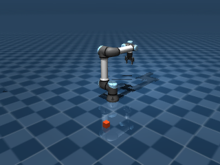

# M6 UR5e/Robotiq adapter: bounded development implementation

This implements the first real UR5e/Robotiq adapter slice. It does **not** complete
M6, establish AC5 conformance, authorize an episode, or prove a grasp. All action
receipts in the optional tests are explicitly signed development fixtures. A
production gateway must still deny execution without the required independent
admission and supported safety evidence. The current internal interval-bound
schema is stronger than the sampled adapter output; see the
[construction limitation](m2-modules-construction-2026-09-09.md#evidence-and-limits).

## Implemented boundary

`accretion.robotics.adapters.ur5e` implements the frozen `RobotAdapter` interface.
Importing it loads no MuJoCo, NumPy, Pillow or OpenGL. Its only simulation backend
is the exact optional environment: MuJoCo 3.10.0, NumPy 2.3.3 and Pillow 11.3.0.
The existing frozen `uv.lock` supplies distribution hashes. No dependency or lock
file changed in this slice.

The adapter composes the Menagerie UR5e and Robotiq 2F85 at commit
`e4049d0a3bfd58d2a3081614e6777d4007e3f86a`. Every selected upstream source, mesh and
license file must match the shipped SHA-256 manifest before model compilation.
The generated MJCF has relative asset names, avoiding checkout-path-dependent
world hashes. The supplied checkout and implementation must be mounted read-only
by the host; the adapter does not claim to provide process isolation itself.

The scene contains a real free rigid cube, floor, attached gripper and a 320×240
camera. Physics uses a 2 ms step, elliptic friction, `impratio=10` and the pinned
model's integrator. The cube is placed only at seeded reset. Execution calls
`mj_step`; it never assigns live joint positions or teleports the cube.

Arm commands use `PIECEWISE_QUINTIC_HERMITE_V1` with all endpoint position,
velocity and acceleration constraints. The controller evaluates that desired
curve at each physics step end and holds that position target for the numerical
step. Upstream servos receive gravity-bias and desired-velocity feedforward.
This discrete controller application is explicit in its source/parameter digest;
the interpolated command is not substituted with linear waypoint interpolation.
The pure numerical test independently reconstructs a fifth-order polynomial with
nonzero endpoint derivatives.

The Robotiq model has eight revolute joints and an internal 0–255 tendon actuator.
The public command and observation use metres. Opening is measured from the
separation of actual opposing pad faces. A pinned aperture feedback controller
tracks a rest-to-rest quintic opening reference, respecting the requested
reference velocity and acceleration scales. The requested force is in Newtons;
its actuator mapping uses an explicitly nominal 0.03 m torque arm and an aggregate
sampled pad-contact force cutoff. **This mapping is not a calibrated continuous
force guarantee.** The descriptor's force range and selected velocity/acceleration
caps are development control settings, not manufacturer-certified limits.

Observations include six arm positions/velocities/accelerations/actuator efforts,
metric aperture, tool pose, cube position, contact-force maximum, RGB and depth.
They use the SDK's raw little-endian tensor encoding and exact SI schemas. The
normal validator reads and verifies every actual referenced byte. `observe` returns
an immutable cached batch: no solver, renderer, time or sequence refresh occurs.
`prepare` uses a clone for bounded damped least-squares IK and never steps the live
data. `snapshot` also leaves the live observation and integration state unchanged.

Execution rechecks the original prepared seal, trusted safety signature, exact
command bytes, episode/lease/state/scope, safety envelope, expiry and reserved
duration. It consumes the local candidate before entering physics. Signed DENY,
bad signatures and duplicate commands cause zero steps. A failure after stepping,
including failure to persist its trace, poisons the adapter and requires a fresh
episode. These local checks supplement the gateway; they do not replace durable
approval, policy, lease-generation, issuance or budget transactions.

Each completed or aborted execution emits a sampled trace, explicitly labelled
`DEVELOPMENT_SAMPLED_DYNAMICS_NOT_CONTINUOUS_PROOF`. It includes each physics step's
desired/actual joints, dynamics, tracking error, aperture, tool/cube positions and
body/geom contact force and penetration. There is a 5,000-step action ceiling,
64-contact step ceiling and 8 MiB trace ceiling. Actual tracking and aggregate
pad-contact cutoffs terminate divergence; they cannot retrospectively establish
that no bound was crossed between samples.

## Host bootstrap

```python
profile = build_profile(
    models_root, authorized_artifacts,
    workspace_id=workspace_id, project_id=project_id, principal=adapter_principal,
    created_at=frozen_profile_time, descriptor_id=descriptor_id,
    observation_spec_id=observation_spec_id,
    simulator_image_digest=pinned_oci_digest,
    host_compatibility_profile_hash=verified_host_profile_hash,
)
description = profile.description  # Exact original descriptor/spec writer seals + closure.
adapter = UR5eAdapter(
    profile, episode=episode_pins, artifacts=authorized_artifacts,
    trusted_keys=trusted_public_safety_keys,
    replay_source_episode_id=None,
)
initial = adapter.observe()
```

Both explicit host digest arguments are optional only for local development.
Without them the closure identifies a local optional environment, explicitly
`LOCAL_OPTIONAL_ENVIRONMENT_NOT_OCI`; it is not an OCI-image or isolation claim.
All other model/controller/schema/source/physics/rendering pins are generated
from the actual verified inputs. Rebuilding a registered profile requires its
same record IDs, principal and creation time. The host must compare the resulting
complete description with its admitted description.

`authorized_artifacts` implements the SDK's bounded `iter_bytes` and the existing
`ArtifactStore.put` signature. A scoped host RPC implementation can supply this
interface; direct shared writable artifact-directory access is unnecessary.
Scope authorization belongs to that service. Public safety keys are bootstrap
trust configuration, never generated by the adapter.

The episode seed's exact sample is `randomization_sample(seed)`, a deterministic
development cube x-coordinate in [0.34, 0.36] m. Its complete canonical hash must
equal `EpisodePins.randomization_sample_hash`. Construction materializes this
time-zero state; the single initial `reset` confirms that exact seeded state.

Snapshots preserve `mjSTATE_INTEGRATION`, warm start, controller target/control/
force range, complete source observations and source action counter. Restore is
allowed only once in an untouched fresh episode with a different lease and the
explicit source episode, identical dependency closure and randomization. Restored
physics is checked against **all** original observation tensors, including
RGB/depth, before the batch is accepted. The new episode starts command sequence
0; source action sequence remains provenance for M5 mapping. Original receipts,
approvals and admission are never restored.

## Development reproduction and evidence

Use an already authorized optional simulation window and the pinned local model
checkout. The wrapper never downloads models or packages, resumes an existing
window without resetting its ledger, and refuses exhausted time/CPU/output budgets.

```bash
uv sync --frozen --group dev --group simulation
.venv/bin/python scripts/robotics/ur5e_development.py \
  --models /path/to/pinned/menagerie \
  --window /path/to/authorized/development-window
```

The recorded first window permits 20 minutes wall time, 600 measured child CPU
seconds and 2 GiB output. It uses one simulator process at a time, software EGL
with llvmpipe and deterministic development seed 707. It does not use a GPU,
network simulator, provider, study seed or physical device. Exact commands,
exits, measured resources and unchanged-source checks are retained in the
[evidence directory](evidence/m6-ur5e-development-2026-09-09/).

The final retained attempt passed **7 real optional tests** with identical source
hashes before and after the process. **126 pure SDK/import/numerical tests** also
passed. Ruff, mypy and the documentation/frozen-source check passed. Across all
seven development attempts the window used **1,051.55 seconds elapsed wall time,
186.33 measured child CPU seconds and 79,028,480 output bytes**. No simulator
remains running. The retained evidence is about 1.18 MB, including compressed
dense traces, original RGB/depth observation bytes, rendered PNG, generated MJCF,
controller/model manifests, licenses and exact commands/source hashes.

| Observed development quantity | Result |
| --- | --- |
| Arm trajectory samples | 500 real physics steps |
| Maximum joint tracking error | 0.00005781 rad |
| Maximum individual cube/floor contact force | 2.48988 N |
| Maximum sampled cube/floor penetration | 0.0108273 m |
| Cube final centre height | 0.0248922 m |
| Requested / measured aperture | 0.060 / 0.0615818 m |
| Aperture control steps | 1,191 |
| Tool target displacement / final position error | 0.010 / 0.00009518 m |
| Snapshot checks | All tensors after arm and gripper; exact arm continuation |

The cube-drop fixture's sampled peak penetration is **10.83 mm** under the
inherited soft-contact model. This is a material development observation, not
an acceptable safety limit. A later admitted world/contact profile must justify
its own bounds and would have to deny this fixture if those bounds are tighter.



The initial attempt correctly stopped on tracking divergence: uncompensated
gravity produced a large initial acceleration, which the exact Hermite curve
preserved. The controller was changed to explicit gravity/velocity feedforward
and rerun. A later gripper test requested a scaled movement longer than the
10-second command cap and was refused before stepping; the development test
then selected full reference scales explicitly. Intermediate probes are not
release evidence. Source hashes are frozen for the final retained witnesses.
One intermediate probe had a source edit in flight and is excluded from final
source-attested evidence; the runner now detects and rejects such drift.

## Required follow-up before an M6 or conformance claim

- Integrate with the isolated real host, scoped artifact channel, durable gateway,
  registry admission and recorder; establish exact image/host closure pins.
- Complete the explicitly versioned numerical-stage evidence profile and its
  independent checks, retaining continuous commanded-path/body-sweep checks.
  Samples cannot be relabelled as continuous actual-physics bounds; the current
  adapter supplies no fabricated `HostPreview`.
- Calibrate and verify aperture force mapping and actual tracking throughout the
  admitted workspace, then demonstrate real approach/grasp/lift/transport/release.
- Run independent replay/verifiers and the actual black-box conformance suite,
  including worker loss, lease fencing, revocation and uncertain acknowledgement.
- Complete the independent Panda embodiment and gated benchmark/release program.

Upstream provenance: [UR5e source](https://github.com/google-deepmind/mujoco_menagerie/tree/e4049d0a3bfd58d2a3081614e6777d4007e3f86a/universal_robots_ur5e)
under BSD-3-Clause and [Robotiq source](https://github.com/google-deepmind/mujoco_menagerie/tree/e4049d0a3bfd58d2a3081614e6777d4007e3f86a/robotiq_2f85)
under BSD-2-Clause. Original licenses and exact hashes are retained with the M0
evidence and verified again by this adapter. The Accretion overlay/controller is
new source under this repository's license; no earlier research experiment
outcomes are imported as Accretion evidence.
