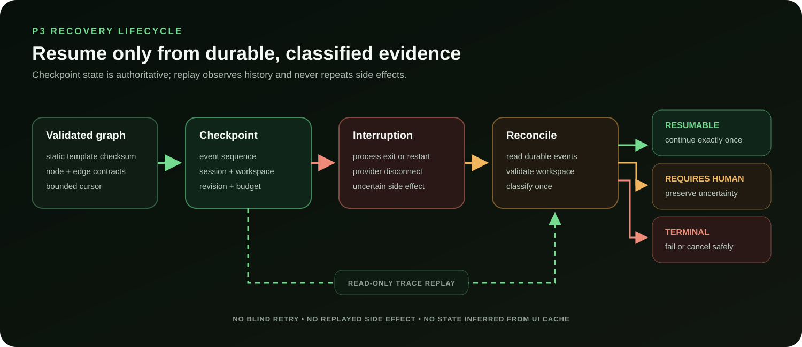

# Accretion P3 static graphs, checkpoints, and replay runbook



## Scope

P3 enables the persisted `GRAPH/fixed-graph-v1`, `HYBRID/hybrid-rd-v1`, and
`safe-unknown-v1` decisions. Every run instantiates an immutable `RunGraph`
from a VALIDATED, checksum-pinned template; a fail-closed scheduler walks the
graph, checkpoints at node boundaries, blocks on durable human approval gates,
and delegates bounded loop regions to the P2 engine. The v0.1 P3 API remains
static and unchanged; opt-in P5 proposals now compile into this same scheduler
only after deterministic validation. Learned routing remains out of scope.

The current [frontend guide](../guides/frontend.md) shows where the graph projection,
controls, approval state, verifier evidence, and normalized trace appear in the
completed operator UI. Historical counts below remain the P3 milestone snapshot.

## Safety and recovery invariants

- Only VALIDATED, checksum-stable templates instantiate run graphs; unknown
  names, non-VALIDATED status, mode mismatches, and content drift all reject
  the run with a distinct 409 before any state is created.
- No API accepts executable node/edge topology; templates are code-defined and
  the only operator template input remains the audited strategy override.
- Edge selection is fail-closed: a node outcome with no eligible edge — or an
  ambiguous match — escalates to `REQUIRES_HUMAN`, never a silent default.
- Approval gates persist durable records: a pending decision pauses the wall
  clock, a decision made while the backend is down is honored exactly once on
  resume, and denial routes to the terminal explicitly.
- `safe-unknown-v1` performs at most one bounded replan inside its static
  topology before escalating.
- Checkpoints commit atomically with their `CHECKPOINT_SAVED` event and are
  immutable evidence; a checkpoint the log cannot contain fails closed.
- Reconciliation classifies crashed runs as resumable, recreate, terminal, or
  requires-human: lost workspaces holding candidate work (including any
  revision conflict) always require a human; only an empty lost substrate is
  recreated at its recorded base revision.
- Auto-resume runs only behind `ACCRETION_AUTO_RESUME_ON_RECONCILE`, only from
  a valid checkpoint, and only when the run's runtime is actually available.
- Replay is a pure fold over the immutable event log: the execution trace and
  the graph projection are identical before and after a backend restart, and
  the projection's node set never expands with iterations.

## Template registry

| Template | Mode | Topology |
|---|---|---|
| `direct-v1` | DIRECT | initialize → act → verify → complete |
| `feedback-loop-v1` | LOOP | the unchanged P2 loop region (act/observe/evaluate/verify) |
| `fixed-graph-v1` | GRAPH | plan → **plan approval** → act → observe → verify (one bounded retry) → **outcome approval** → complete |
| `hybrid-rd-v1` | HYBRID | research → theorize → experiment loop ⊂ → develop loop ⊂ → verify → complete |
| `safe-unknown-v1` | HYBRID | plan → bounded loop ⊂ → verify → {complete \| one replan \| escalate} |

⊂ marks a bounded loop subflow rendered as a nested group in React Flow.

## Release acceptance mapping

| Criterion | Evidence |
|---|---|
| `V01-P3-001` | Template guards reject unknown/DRAFT/RETIRED/drifted templates at `start_run` (409 tests); `instantiate_run_graph` enforces VALIDATED structurally; seeding is idempotent and aborts on checksum drift. |
| `V01-P3-002` | An OpenAPI introspection test walks every POST/PUT/PATCH request schema transitively (resolving `$ref`s, items, and unions) asserting no reachable schema exposes writable `nodes`/`edges`; `GET /templates` returns summaries only; template definitions live exclusively in code. |
| `V01-P3-003` | A two-manager restart test lands the crashed run in durable PAUSED, then auto-resumes from the last valid checkpoint to verified success at iteration N+1; invalid checkpoints (sequence ahead of log, workspace conflict) fail closed to `REQUIRES_HUMAN`. |
| `V01-P3-004` | `build_execution_trace` reconstructs traversals, loop iterations, runtime/tool calls, approvals, verifications, and checkpoints from events alone; the restart test asserts trace equality across managers. |
| `V01-P3-005` | Projection equality before/after restart (node/edge IDs, statuses, traversal counts); node ids remain `run_id:key`, matching every durable event. |
| `V01-P3-006` | Backend and UI tests assert the node count never grows with iterations (seven traversals render the same node set); hybrid children carry `parent_id` and render inside their parent group with the iteration badge on the LOOP node. |

## Recorded P3 acceptance evidence

Validated locally on 2026-08-21:

- Default non-live backend suite: 130 passed, 9 live/PostgreSQL cases excluded.
- PostgreSQL 16 migration cycle: upgrade to head, downgrade to base, and
  upgrade to head completed successfully, including the guarded loop-execution
  uniqueness relaxation and the `agent_events.node_id` widening.
- PostgreSQL-backed non-live suite: 136 passed, 3 live cases skipped.
- Frontend: TypeScript, ESLint, 12 Vitest cases, generated OpenAPI contract
  check, and the Vite production build passed.
- Strict backend checks: Ruff and mypy passed for the complete P3 tree.

The release commands are unchanged from P2:

```bash
uv run ruff check .
uv run mypy src
PYTEST_DISABLE_PLUGIN_AUTOLOAD=1 \
  uv run --no-sync pytest -p pytest_asyncio.plugin

npm run api:generate
git diff --exit-code -- apps/ui/src/api/schema.d.ts
npm run check
npm run test
npm run build
```

With a disposable PostgreSQL 16 instance available through
`ACCRETION_TEST_POSTGRES_URL`, also run the Alembic upgrade/downgrade cycle and
the same backend suite. Signed-in runtime acceptance remains deliberately
opt-in per the P2 runbook.

## Documented SDD deviations

- Gates carry `required_for_risk_gte` (default HIGH): below that risk a
  template gate auto-approves with a durable `ApprovalRecord` and
  `APPROVAL_RESOLVED` evidence, so a deliberately overridden low-risk graph
  run does not dead-end unattended. SDD §9.1 reads gates as unconditional.
  Auto-approval never applies to protected work: a task holding irreversible
  capabilities always waits for the human decision regardless of its declared
  risk level.
- For gate-bearing templates the outcome approval gate is the independent
  human reviewer: their acceptance policies set `require_human_if_risk_gte`
  to `None`, otherwise every HIGH-risk graph run would force `INCONCLUSIVE`
  before its gate could ever run.
- `ExecutionTrace.terminal_state` includes `REQUIRES_HUMAN` (the SDD's
  three-value enum cannot represent escalation without falsifying evidence).
  The terminal `RunState` is written into every terminal event's payload
  (`terminal_state`) so replay reconstructs escalation from immutable events
  alone; pre-P3 events without the key fold from the event type.
- Every template carries a synthetic `initialize` TASK entry node (the
  validator requires exactly one TASK entry), and `direct-v1`'s SDD §9.4
  `execute` node keeps its historical key `act` so P2 event `node_id`s stay
  resolvable. `fixed-graph-v1` likewise begins at `initialize`.
- Template identity is split: `template_record_id` carries the §4.1 `wft_`
  identifier while `template_id` is the stable human slug (`direct-v1`) that
  every historical row and API surface already uses. Run-graph node and edge
  ids use the `run_id:key` scheme rather than a `node_` prefix, matching the
  durable event `node_id` convention.
- Persistence naming: sessions persist in `runtime_sessions` (SDD §16.2
  `agent_sessions`) and leases in `workspace_leases` (`workspaces`). The
  remaining §16.2 tables (capabilities, skills, plugins, policies, evidence,
  research entities, benchmarks, `project_versions`) are P4 / v0.1-gate work.
- Bounded regions intentionally omit the §10.3 no-progress and
  repeated-failure stops: unverified regions cannot judge progress, so
  acceptance is deferred to the downstream VERIFIER while iteration, wall,
  turn, and tool-call ceilings still bound the region. The region runner is a
  sibling of the P2 engine, not a delegation to it.
- Side-effect-boundary checkpoints (`SIDE_EFFECT_BOUNDARY`) activate with the
  P4 capability gateway; `NODE_BOUNDARY` is the only kind P3 produces.
- API paths: `GET /tasks/{id}/profile` is served as `/tasks/{id}/planning`
  (profile and decision travel together) and `POST /tasks/{id}/strategy/override`
  as `/tasks/{id}/strategy-overrides` (the audited override collection).
- The UI replays the full event stream from sequence 0 with a 2.5 s poll
  instead of the §17.5 snapshot-cursor-gap sequence; correct, but heavier
  than the SDD's design. Cursor-seeded SSE arrives with the P4 operator UI.
- Trace folds coerce unknown checkpoint kinds to `NODE_BOUNDARY` and unknown
  verification statuses to `None` rather than failing the whole replay; node
  exit statuses fold pessimistically to `FAILED` in both the trace and the
  projection.
- Turn and tool-call ceilings are enforced cumulatively across a graph run
  through the durable `runs.budget_spent` account; each call and each region
  attempt draws from the same remaining pool (SDD §19 budgets are per-task,
  which P2 approximated per-call).

## Known gaps deferred to P4

- Verifier nodes surface evidence in the adjacent verification panel; the
  §17.4 node-level evidence drawer (click-to-open) lands with the full
  operator UI.
- Mutable HTTP APIs do not yet accept idempotency keys (a retried
  `POST /tasks/{id}/runs` starts a second run), and an already-decided
  approval surfaces as 400 rather than 409. Both predate P3.
