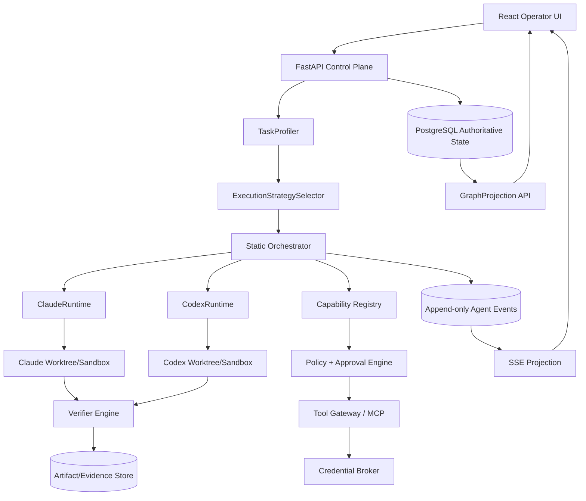
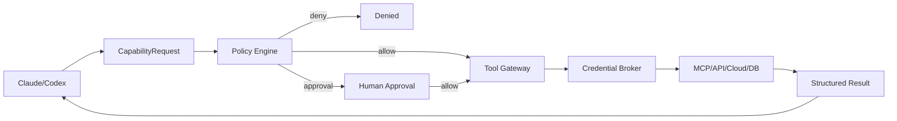

# Accretion v0.1 — System Design Specification

Visual companions: [system architecture](../assets/accretion-architecture.svg),
[feedback lifecycle](../assets/accretion-feedback-loop.svg), and
[checkpoint/replay](../assets/checkpoint-replay.svg). These diagrams summarize;
this SDD remains authoritative.

**Release thesis:** v0.1 proves that one local control plane can safely supervise Claude Code and Codex, choose an inspectable execution structure (`DIRECT`, `LOOP`, `GRAPH`, or `HYBRID`), execute only validated static workflow templates, verify outcomes independently, and expose the complete run through a React Flow operator UI.

> **Codex implementation rule:** Treat this document as authoritative for v0.1. Do not implement v0.2 dynamic workflow synthesis, learned routing, trajectory replay, reinforcement learning, self-evolution, or autonomous production deployment. If a future feature appears in an interface for forward compatibility, keep it disabled behind a feature flag and do not add execution behavior.

---

## 0. Document intent and implementation order

Accretion v0.1 is the **observable static-template release**. It implements research phases P0-P4:

1. **P0 Runtime feasibility** — Claude/Codex adapters, normalized events, isolated workspaces, recovery.
2. **P1 Prompt/context + task profiling** — typed contracts and deterministic strategy selection.
3. **P2 Loop + verification** — bounded feedback loops and independent acceptance.
4. **P3 Static graph + persistence** — validated workflow templates, checkpoints, replay.
5. **P4 Harness + capabilities + frontend** — policy, MCP/tool gateway, skills/plugins, approvals, React Flow UI, benchmark instrumentation.

The implementation order is intentionally conservative. Current production guidance supports mixing code-controlled and LLM-controlled orchestration; v0.1 keeps **architecture authority in code** while using LLMs to produce structured task profiles and to execute bounded nodes. Dynamic topology is a v0.2 concern.

### 0.1 v0.1 definition of done

v0.1 is complete only when all **Release Acceptance Criteria** in Section 20 pass and the `ACR-ARCH` benchmark can reproduce strategy-selection experiments with full trace provenance.

---

# 1. Goals, non-goals, and success claims

## 1.1 Goals

- Run Claude Code and Codex concurrently on one local workstation, each using its native signed-in subscription session where supported.
- Expose a provider-neutral `AgentRuntime` contract.
- Maintain one authoritative backend state for projects, tasks, runs, graphs, approvals, artifacts, verifications, and evidence.
- Profile each non-trivial task into a typed `TaskProfile`.
- Select `DIRECT`, `LOOP`, `GRAPH`, or `HYBRID` using a deterministic, versioned, inspectable policy.
- Execute **only pre-validated static workflow templates** in v0.1.
- Isolate every mutable worker run in its own Git worktree and optionally a container sandbox.
- Keep external/consequential tools behind one capability/policy/credential boundary.
- Verify artifacts independently of worker self-reports.
- Provide a React + TypeScript + React Flow operator UI for topology, events, loops, approvals, runtime health, trace replay, and ACR-ARCH.
- Capture clean trajectories so later v0.2/v0.3 research can use real evidence.

## 1.2 Non-goals

- No arbitrary LLM-authored workflow graph execution.
- No dynamic graph revision during a run.
- No learned provider router or RL.
- No experience retrieval influencing execution.
- No self-modifying prompts/policies/skills.
- No public SaaS using one consumer Claude/ChatGPT subscription as a shared backend.
- No autonomous protected production deployment.
- No direct credential disclosure to model context.
- No shared mutable worktree across concurrent runs.
- No robotics hard-real-time control.

## 1.3 Claims v0.1 is allowed to make

If the acceptance suite passes, v0.1 may claim:

1. **Multi-runtime control:** one Meta-Harness can supervise Claude and Codex through normalized contracts.
2. **Static orchestration:** a deterministic selector can map typed task profiles to validated execution modes/templates.
3. **Governed execution:** workers cannot bypass the Meta-Harness's external capability policy.
4. **Observable execution:** the frontend can reconstruct planned topology and actual execution trace without owning workflow state.
5. **Benchmark readiness:** architecture-selection quality can be measured with `ACR-ARCH`.

It must **not** claim that the selector is optimal until benchmark evidence supports that conclusion.

---

# 2. Architectural invariants

These are hard rules, not heuristics.

| ID | Invariant |
|---|---|
| INV-001 | The Meta-Harness backend is the single authoritative owner of project/run state. |
| INV-002 | Claude Code and Codex are replaceable worker runtimes, not global state owners. |
| INV-003 | One mutable workspace lease belongs to exactly one active run. |
| INV-004 | Provider-native authentication remains owned by the provider client; Accretion does not copy OAuth/session secrets. |
| INV-005 | Consequential external capabilities are deny-by-default and pass through Meta policy. |
| INV-006 | A producer cannot self-accept its artifact. Acceptance is verifier/policy controlled. |
| INV-007 | Every loop has explicit termination/budget/escalation. |
| INV-008 | v0.1 executes only versioned static templates. |
| INV-009 | React Flow is a projection only; UI node/edge state is never execution authority. |
| INV-010 | Every run, prompt, policy, template, capability, verifier, and adapter version is traceable. |
| INV-011 | Secrets are never serialized into `TaskEnvelope`, `ContextBundle`, `AgentEvent`, or frontend payloads. |
| INV-012 | Crash recovery must reconcile durable state before any side-effect retry. |

---

# 3. System architecture



## 3.1 Logical planes

### Control plane

Owns task state, mode selection, template instantiation, scheduling, approvals, budgets, checkpoints, and lifecycle.

### Execution plane

Contains provider adapters, worktrees, sandboxes, native tools, and local processes.

### Capability plane

Contains typed tools, skills, plugins, MCP endpoints, permission policy, and credentials.

### Verification plane

Separates proposal from acceptance using deterministic and independent checks.

### Presentation plane

React UI + React Flow projections. It never mutates run topology directly.

---

# 4. Core domain contracts

## 4.1 Identifiers

Use opaque stable IDs (UUIDv7/ULID acceptable) with type prefixes for operator readability:

```text
prj_   project
tsk_   task
run_   run
ses_   runtime session
wsp_   workspace lease
wft_   workflow template
rgr_   run graph
node_  run graph node
art_   artifact
ver_   verification
apr_   approval
evt_   event
```

## 4.2 TaskEnvelope

```yaml
TaskEnvelope:
  task_id: tsk_...
  project_id: prj_...
  objective: string
  task_type: RESEARCH | ANALYSIS | IMPLEMENT | REVIEW | EXPERIMENT | OTHER
  inputs: [ArtifactRef | EvidenceRef | URIRef]
  constraints: [Constraint]
  success_criteria: [Criterion]
  risk_level: LOW | MEDIUM | HIGH | CRITICAL
  requested_skills: [SkillRef]
  allowed_capabilities: [CapabilityRef]
  denied_capabilities: [CapabilityRef]
  verifier_policy_ref: string
  prompt_contract_ref: string
  context_policy_ref: string
  budgets:
    wall_time_seconds: int
    max_turns: int
    max_loop_iterations: int
    max_parallel_runs: int
  required_outputs: [OutputContract]
```

## 4.3 StateMutationProposal

Workers never directly mutate authoritative project state.

```yaml
StateMutationProposal:
  proposal_id: string
  run_id: string
  expected_state_revision: int
  mutations: [TypedMutation]
  evidence_refs: [string]
  rationale_summary: string
```

The backend applies optimistic concurrency control:

```text
if expected_state_revision != current_revision:
    reject(REVISION_CONFLICT)
else:
    validate_schema()
    validate_authority()
    commit()
```

---

# 5. AgentRuntime contract

```python
class AgentRuntime(Protocol):
    async def health(self) -> RuntimeHealth: ...
    async def create_session(self, config: SessionConfig) -> SessionRef: ...
    async def submit(self, session: SessionRef, task: TaskEnvelope) -> RunRef: ...
    async def events(self, run: RunRef) -> AsyncIterator[AgentEvent]: ...
    async def approve(self, request: ApprovalRequest, decision: ApprovalDecision) -> None: ...
    async def interrupt(self, run: RunRef) -> None: ...
    async def resume(self, run: RunRef) -> None: ...
    async def artifacts(self, run: RunRef) -> list[ArtifactRef]: ...
    async def usage(self, run: RunRef) -> UsageSnapshot: ...
    async def terminate(self, run: RunRef) -> None: ...
```

## 5.1 Runtime health

```yaml
RuntimeHealth:
  runtime_id: string
  provider: CLAUDE | CODEX
  status: READY | BUSY | RATE_LIMITED | AUTH_REQUIRED | UNAVAILABLE | DEGRADED
  auth_mode: SUBSCRIPTION | API | LOCAL
  runtime_version: string
  capabilities: [string]
  active_sessions: int
  active_runs: int
  observed_usage_pressure: UNKNOWN | LOW | MEDIUM | HIGH | EXHAUSTED
  last_error: ErrorSummary?
  observed_at: timestamp
```

Do not invent precise remaining subscription quota if the provider does not expose it.

## 5.2 Codex adapter

Primary path: long-lived **Codex App Server** process.

Responsibilities:

- launch/pin Codex binary version;
- initialize one App Server process per Accretion runtime instance;
- map Accretion sessions to Codex threads;
- map bidirectional JSON-RPC events to `AgentEvent`;
- translate Codex approval requests into Meta-Harness approvals;
- collect diffs/artifacts without making Codex state authoritative;
- restart App Server and reconcile incomplete runs after crashes.

## 5.3 Claude adapter

Primary path: Claude Code structured programmatic mode (`claude -p` / stream-json) or Agent SDK when its local subscription-backed behavior is appropriate and stable.

Responsibilities:

- never scrape ANSI terminal UI;
- parse documented structured output/events only;
- inject generated tool allow/deny policy;
- project Accretion skills/MCP config into the Claude session;
- persist only non-secret session identifiers;
- reconcile interruptions and resumes through durable Accretion state.

## 5.4 Provider extension payloads

Normalized events may include an optional `provider_extension` block, but domain logic must never require it.

---

# 6. Normalized event model

```yaml
AgentEvent:
  event_id: evt_...
  run_id: run_...
  session_id: ses_...
  provider: CLAUDE | CODEX | DETERMINISTIC | HUMAN
  native_type: string
  normalized_type: EventType
  sequence: int
  timestamp: timestamp
  correlation_id: string
  causation_id: string?
  node_id: string?
  payload: object
  adapter_version: string
```

### EventType

```text
RUN_CREATED
RUN_STARTED
RUN_PROGRESS
NODE_ENTERED
NODE_EXITED
LOOP_ITERATION_STARTED
LOOP_ITERATION_COMPLETED
TOOL_REQUESTED
TOOL_STARTED
TOOL_COMPLETED
TOOL_FAILED
FILE_CHANGED
DIFF_AVAILABLE
APPROVAL_REQUIRED
APPROVAL_RESOLVED
ARTIFACT_CREATED
VERIFICATION_STARTED
VERIFICATION_RESULT
CHECKPOINT_SAVED
RUN_PAUSED
RUN_RESUMED
RUN_COMPLETED
RUN_FAILED
RUN_CANCELLED
```

### Ordering rule

Events are append-only per run with monotonic `sequence`. UI may reconnect using `Last-Event-ID`/sequence and request a snapshot if it detects a gap.

---

# 7. Task profiling

The profiler **describes** the task. It does not authorize topology.

```yaml
TaskProfile:
  task_id: string
  complexity: 0.0..1.0
  structure_certainty: 0.0..1.0
  feedback_dependency: 0.0..1.0
  dependency_complexity: 0.0..1.0
  parallelism_potential: 0.0..1.0
  uncertainty: 0.0..1.0
  verifier_strength: 0.0..1.0
  risk: LOW | MEDIUM | HIGH | CRITICAL
  irreversible_actions: bool
  expected_horizon: SHORT | MEDIUM | LONG
  profile_confidence: 0.0..1.0
  observed_features: [FeatureEvidence]
  semantic_rationale: string
  profiler_version: string
```

## 7.1 Feature sources

Use deterministic features where possible:

- known template match;
- required stage count;
- presence of executable tests/benchmark;
- requested side effects;
- repository size/change surface;
- capability dependencies;
- explicit user constraints.

Use LLM structured output for semantic estimates such as feedback dependence or ambiguity. Persist both score and rationale for benchmarking.

## 7.2 Low-confidence profile behavior

If `profile_confidence < PROFILE_MIN_CONFIDENCE`, selector must choose `safe-unknown-v1` or require operator review; it must not pretend certainty.

---

# 8. Deterministic execution strategy selector

## 8.1 Modes

| Mode | Meaning | Best fit |
|---|---|---|
| `DIRECT` | Single bounded execution + verification. | Simple, low-feedback tasks. |
| `LOOP` | Iterative action-observation-evaluation until bounded stop. | Debugging/refinement where feedback changes next action. |
| `GRAPH` | Known macro-stages and gates. | Predictable multi-stage workflows. |
| `HYBRID` | Graph macro-structure containing local loops. | R&D and long tasks with stable stages but adaptive internals. |

## 8.2 Initial selector

Thresholds are configurable hypotheses:

```python
def select_mode(p: TaskProfile) -> ExecutionMode:
    if (
        p.complexity < 0.30
        and p.feedback_dependency < 0.30
        and p.dependency_complexity < 0.30
        and p.risk == LOW
    ):
        return DIRECT

    if (
        p.structure_certainty >= 0.70
        and p.feedback_dependency < 0.45
    ):
        return GRAPH

    if (
        p.feedback_dependency >= 0.60
        and p.dependency_complexity < 0.45
    ):
        return LOOP

    return HYBRID
```

Risk override:

```text
if risk >= HIGH or irreversible_actions:
    force template containing explicit verifier/approval gates
```

## 8.3 StrategyDecision

```yaml
StrategyDecision:
  task_id: string
  selected_mode: DIRECT | LOOP | GRAPH | HYBRID
  selected_template_id: string
  task_profile_ref: string
  policy_version: string
  matched_rules: [string]
  alternatives: [ExecutionMode]
  rationale: string
  operator_override_allowed: bool
  created_at: timestamp
```

## 8.4 Operator override

An override is a backend command, not UI-local state. It must record:

- original decision;
- requested replacement mode/template;
- operator identity;
- policy result;
- reason;
- timestamp.

Overrides cannot remove required safety gates.

---

# 9. Static workflow execution model

## 9.1 WorkflowTemplate

```yaml
WorkflowTemplate:
  template_id: wft_...
  version: semver
  mode: DIRECT | LOOP | GRAPH | HYBRID
  input_schema: object
  nodes: [WorkflowNodeSpec]
  edges: [WorkflowEdgeSpec]
  global_budget_policy: BudgetPolicy
  required_verifiers: [VerifierRef]
  required_approval_gates: [GateSpec]
  checksum: string
  status: DRAFT | VALIDATED | RETIRED
```

## 9.2 RunGraph

v0.1 instantiates a validated template with task parameters. It cannot add arbitrary nodes/edges.

```yaml
RunGraph:
  run_graph_id: rgr_...
  template_id: string
  template_version: string
  task_id: string
  nodes: [RunNode]
  edges: [RunEdge]
  graph_revision: int
  instantiated_at: timestamp
```

## 9.3 ExecutionTrace

Immutable record of actual traversal:

```yaml
ExecutionTrace:
  run_id: string
  run_graph_id: string
  traversals: [NodeTraversal]
  loop_iterations: [LoopIteration]
  runtime_calls: [RuntimeCallRef]
  tool_calls: [CapabilityCallRef]
  approvals: [ApprovalRef]
  verifications: [VerificationRef]
  terminal_state: SUCCEEDED | FAILED | CANCELLED
```

## 9.4 Required v0.1 templates

### `direct-v1`

```text
execute -> verify -> complete
```

### `feedback-loop-v1`

```text
initialize -> act -> observe -> evaluate
                     ^           |
                     |--- retry --|
                         |
                     verify -> complete
```

### `fixed-graph-v1`

Version-controlled ordered/conditional nodes with explicit recovery edges.

### `hybrid-rd-v1`

```text
research -> theory/hypothesis -> experiment(loop) -> develop(loop) -> verify
```

### `safe-unknown-v1`

```text
plan -> bounded execution loop -> verify -> {complete | broaden/replan once | escalate}
```

---

# 10. Loop engine

## 10.1 Loop contract

```yaml
LoopSpec:
  loop_id: string
  max_iterations: int
  max_wall_time_seconds: int
  max_tool_calls: int
  success_condition: Condition
  no_progress_condition: Condition
  escalation_target: node_id | HUMAN | FAIL
  verifier_ref: string?
```

## 10.2 Loop state

```yaml
LoopState:
  iteration: int
  latest_observation_ref: string
  accumulated_evidence_refs: [string]
  progress_score: float?
  repeated_failure_signature: string?
  budget_remaining: object
```

## 10.3 Stop conditions

Stop when any is true:

- success verified;
- max iterations reached;
- wall time reached;
- tool budget reached;
- no new evidence/progress for configured window;
- repeated failure signature threshold;
- policy denial requires escalation;
- operator cancellation.

Infinite/self-critique loops without new evidence are invalid.

---

# 11. Verifier-centered acceptance

## 11.1 Verifier interface

```python
class Verifier(Protocol):
    async def verify(self, target: VerificationTarget, context: VerificationContext) -> VerificationResult: ...
```

```yaml
VerificationResult:
  verification_id: ver_...
  verifier_id: string
  verifier_version: string
  target_ref: string
  status: PASS | FAIL | INCONCLUSIVE
  score: float?
  findings: [Finding]
  evidence_refs: [string]
  false_accept_risk_estimate: float?
  executed_at: timestamp
```

## 11.2 v0.1 verifier types

- schema/output contract verifier;
- unit/integration test verifier;
- compiler/type/lint verifier where relevant;
- benchmark verifier;
- policy/permission trajectory verifier;
- optional independent Claude/Codex reviewer for higher-risk work.

## 11.3 AcceptancePolicy

```yaml
AcceptancePolicy:
  required_verifiers: [VerifierRef]
  all_required_must_pass: true
  score_thresholds: object
  allow_inconclusive: false
  require_independent_reviewer: bool
  require_human_if_risk_gte: HIGH
  outcome_check: string?
```

Worker text such as “done” or “tests pass” is never sufficient evidence.

---

# 12. Workspace, sandbox, concurrency, and recovery

## 12.1 WorkspaceLease

```yaml
WorkspaceLease:
  lease_id: wsp_...
  project_id: string
  run_id: string
  base_revision: string
  path: string
  branch_name: string
  isolation: WORKTREE | CONTAINER
  writable: bool
  acquired_at: timestamp
  expires_at: timestamp
  cleanup_policy: KEEP_ON_FAILURE | ARCHIVE | DELETE
```

## 12.2 Lifecycle

1. reserve runtime capacity;
2. acquire workspace lease;
3. create worktree at known revision;
4. optionally mount into container;
5. materialize prompt/context/skills/tool policy;
6. start provider run;
7. stream normalized events;
8. checkpoint at node and protected side-effect boundaries;
9. collect artifacts and run verifiers;
10. submit candidate for deterministic promotion/merge;
11. archive evidence and release workspace.

## 12.3 Concurrency

```text
global_active_runs <= GLOBAL_MAX
active_runs(provider) <= PROVIDER_MAX[provider]
active_runs(project) <= PROJECT_MAX[project]
```

v0.1 does not use dynamic search branching, but parallel independent tasks and cross-provider verification are allowed within configured limits.

## 12.4 Crash reconciliation

On backend or provider restart:

```text
load durable run state
-> inspect runtime/session availability
-> inspect workspace status
-> inspect durable side-effect intents/results
-> classify run: resumable | recreate | terminal | requires-human
-> resume/recreate only after reconciliation
```

Never blindly retry a side effect after an uncertain crash.

---

# 13. Capability, Tool, Skill, and Plugin model

## 13.1 Definitions

| Object | Definition |
|---|---|
| Capability | Discoverable typed ability available to orchestration. |
| Tool | Atomic executable capability. |
| Skill | Reusable procedure/knowledge for solving a task class. |
| Plugin | Versioned package of skills, tools/MCP config, verifiers, policies, context sources, and provider projections. |
| Agent-as-Tool | Bounded delegated task executed by another `AgentRuntime`. |

## 13.2 Capability

```yaml
Capability:
  id: github.create_pr
  kind: TOOL | AGENT
  version: string
  input_schema: object
  output_schema: object
  risk: LOW | MEDIUM | HIGH | CRITICAL
  side_effects: [string]
  required_permissions: [string]
  idempotency: NONE | KEYED | TRANSACTIONAL
  backend: MCP | NATIVE | HTTP | CLI | PYTHON | AGENT_RUNTIME
  provider_projections: object
  verifier_policy_ref: string?
```

## 13.3 MetaSkill

```yaml
MetaSkill:
  id: research.controlled-experiment
  version: string
  description: string
  activation_criteria: object
  instructions: string
  required_capabilities: [string]
  required_context: [string]
  outputs: [OutputContract]
  verifiers: [string]
  examples: [object]
  provider_overrides: object
```

## 13.4 MetaPlugin structure

```text
plugin-name/
  plugin.yaml
  skills/
  tools/
  mcp/
  verifiers/
  policies/
  context/
  references/
  providers/
    claude/
    codex/
```

## 13.5 Projection rule

Accretion stores provider-neutral metadata first. Adapters translate to provider-native skills/plugins/tool rules where possible. Provider-specific features remain optional extensions.

---

# 14. Tool gateway, policy, approvals, and credentials



## 14.1 Two classes of tool access

**Workspace-native:** read/edit/search/local shell/tests/git diff. Controlled by provider sandbox + generated allow/deny rules.

**Governed external:** GitHub merge, production DB write, deployment, billing, cloud mutation, privileged secrets. Exposed only via Meta Tool Gateway.

## 14.2 CapabilityRequest

```yaml
CapabilityRequest:
  request_id: string
  run_id: string
  node_id: string
  capability_id: string
  capability_version: string
  arguments: object
  declared_reason: string
  idempotency_key: string?
```

## 14.3 Authorization

```text
authorize(identity, project, phase, capability, args, risk, state, budget, policy_version)
  -> ALLOW | DENY | REQUIRE_APPROVAL
```

Availability is not authorization.

## 14.4 Credential broker

The runtime receives a capability result, not raw credentials. If a tool requires secrets, the broker injects them only into the tool execution boundary and strips/redacts secret-bearing outputs.

---

# 15. Prompt and context engineering

## 15.1 PromptContract

```yaml
PromptContract:
  id: string
  version: string
  role: string
  objective: string
  hard_constraints: [string]
  non_goals: [string]
  tool_rules: [string]
  output_schema: object
  uncertainty_policy: object
  completion_criteria: [string]
  examples: [object]
```

## 15.2 ContextBundle

```yaml
ContextBundle:
  task_ref: string
  phase: string
  project_summary: string
  evidence_refs: [string]
  artifact_refs: [string]
  workspace_map: object
  previous_failure_refs: [string]
  constraints: [string]
  permissions: [string]
  freshness: object
  provenance: [string]
  token_budget: int
```

v0.1 does not retrieve procedural experience. `experience_refs` is reserved but must be empty.

## 15.3 Context rules

- role-specific views;
- provenance on externally derived evidence;
- secret filtering before prompt construction;
- deterministic file/repo context where possible;
- explicit token budget;
- stale-context marker;
- no hidden state that is required for restart/replay.

---

# 16. Persistence model

## 16.1 Stores

| Store | v0.1 choice | Purpose |
|---|---|---|
| Relational state | PostgreSQL | authoritative entities and operational state |
| Event log | PostgreSQL append-only table initially | audit/replay facts |
| Git | native Git + worktrees | source provenance/isolation |
| Artifact store | local filesystem | diffs, reports, raw benchmark output |
| Telemetry | OpenTelemetry | traces/metrics correlation |

## 16.2 Required tables

```text
projects
project_versions
tasks
task_profiles
strategy_decisions
workflow_templates
run_graphs
run_graph_nodes
run_graph_edges
runs
agent_sessions
workspaces
agent_events
checkpoints
capabilities
skills
plugins
policies
approvals
artifacts
verifications
evidence
claims
theories
hypotheses
experiments
experiment_runs
results
decisions
benchmark_tasks
benchmark_runs
architecture_metrics
```

## 16.3 Event sourcing boundary

Execution/audit facts are append-only. Operational state uses materialized tables. Every critical update has revision/version fields for optimistic concurrency.

---

# 17. Frontend architecture — required

## 17.1 Stack

- React + TypeScript + Vite;
- `@xyflow/react` (React Flow);
- TanStack Query for server state;
- Zustand or equivalent for local visualization/view state;
- SSE for live events in v0.1.

## 17.2 Required screens

1. **Dashboard** — active runs, runtime health, failures, approvals.
2. **New Task / Task Profiler** — task input, profile features, strategy recommendation, allowed override.
3. **Live Run** — React Flow topology, event stream, node inspector.
4. **Runtime Monitor** — Claude/Codex health and sessions.
5. **Run History / Trace Replay** — planned graph vs actual trace.
6. **Verifiers / Approvals** — evidence and operator decisions.
7. **Capabilities** — read-only capability/skill/plugin registry for v0.1.
8. **ACR-ARCH** — architecture regret, mode comparisons, profile evidence.

## 17.3 GraphProjection

```yaml
GraphProjection:
  run_id: string
  workflow_template_id: string
  run_graph_version: int
  nodes: [GraphProjectionNode]
  edges: [GraphProjectionEdge]
  generated_at: timestamp
```

```yaml
GraphProjectionNode:
  node_id: string
  parent_id: string?
  kind: TASK | AGENT | TOOL | VERIFIER | GATE | LOOP | JOIN | TERMINAL
  label: string
  status: PENDING | RUNNING | WAITING | SUCCEEDED | FAILED | CANCELLED
  provider: CLAUDE | CODEX | DETERMINISTIC | HUMAN | null
  iteration: int?
  max_iterations: int?
  artifact_count: int
  verifier_state: PASS | FAIL | INCONCLUSIVE | null
  risk: LOW | MEDIUM | HIGH | CRITICAL
```

```yaml
GraphProjectionEdge:
  edge_id: string
  source: string
  target: string
  kind: NORMAL | CONDITION | LOOP_BACK | RETRY | ERROR | FANOUT | MERGE | APPROVAL
  label: string?
  active: bool
  traversal_count: int
```

## 17.4 React Flow visual rules

- `LOOP_BACK` renders a custom curved/return edge.
- Loop node shows `iteration/max_iterations` badge.
- HYBRID uses nested/group nodes (`parentId`) for bounded local loops/subflows.
- Provider badge: Claude/Codex/deterministic/human.
- Verifier nodes expose evidence drawer.
- Approval node remains waiting until backend approval event.
- Low-level tool calls belong in node detail/event stream unless topology requires them.
- Dragging changes viewport/layout only; no executable topology mutation.

## 17.5 Snapshot + SSE consistency

Frontend load sequence:

```text
GET run snapshot
-> GET GraphProjection
-> connect SSE from snapshot.last_sequence + 1
-> if sequence gap detected: refetch snapshot and graph
```

---

# 18. API surface

```text
POST /api/v1/projects
GET  /api/v1/projects/{project_id}

POST /api/v1/tasks
GET  /api/v1/tasks/{task_id}
GET  /api/v1/tasks/{task_id}/profile
POST /api/v1/tasks/{task_id}/strategy/override

POST /api/v1/tasks/{task_id}/runs
GET  /api/v1/runs/{run_id}
GET  /api/v1/runs/{run_id}/graph
GET  /api/v1/runs/{run_id}/trace
GET  /api/v1/runs/{run_id}/events       # SSE
GET  /api/v1/runs/{run_id}/artifacts
POST /api/v1/runs/{run_id}/pause
POST /api/v1/runs/{run_id}/resume
POST /api/v1/runs/{run_id}/cancel

GET  /api/v1/runtimes
GET  /api/v1/runtimes/{runtime_id}/health

GET  /api/v1/capabilities
GET  /api/v1/skills
GET  /api/v1/plugins

GET  /api/v1/approvals
POST /api/v1/approvals/{approval_id}/decision

GET  /api/v1/verifications/{verification_id}

GET  /api/v1/benchmarks/acr-arch
POST /api/v1/benchmarks/acr-arch/run
GET  /api/v1/benchmarks/acr-arch/tasks/{task_id}
```

Use OpenAPI-generated frontend types where practical.

---

# 19. Observability, security, and benchmark design

## 19.1 Minimum telemetry

Capture:

- task/profile/strategy/template IDs;
- mode decision and matched rules;
- provider/runtime/model/adapter version;
- node transitions and loop iterations;
- tool calls/errors/retries/timeouts;
- approvals/denials;
- context size and provenance;
- verifier results;
- checkpoint/resume events;
- workspace revision;
- wall-clock time;
- provider usage-pressure signal;
- token/API cost where observable;
- UI event sequence gap and projection version.

## 19.2 Security threats

| Threat | Control |
|---|---|
| prompt/tool injection | trust labels + schema validation + least privilege |
| secret exfiltration | credential broker + redaction + no secret context |
| unsafe shell | sandbox + provider policy + approval hooks |
| privilege escalation | capabilities resolved outside agent |
| workspace race | exclusive lease |
| duplicate side effect | durable intent + idempotency key |
| false self-completion | independent verifier |
| UI split brain | backend authority only |

## 19.3 ACR-ARCH benchmark

For each benchmark task, run applicable modes under comparable budgets:

```text
DIRECT
LOOP
GRAPH
HYBRID
```

Utility:

```text
U(m,t) = Quality(m,t)
         - lambda * Cost(m,t)
         - mu * Latency(m,t)
         - nu * Risk(m,t)
         - eta * HumanBurden(m,t)
```

Observed best:

```text
m*(t) = argmax_m U(m,t)
```

Selector choice `m_hat(t)`:

```text
ArchitectureRegret(t) = U(m*(t),t) - U(m_hat(t),t)
```

Report raw dimensions as well as utility. Do not hide tradeoffs in one score.

### v0.1 benchmark starter set

Minimum 30 tasks:

- 5 direct/simple knowledge or repo tasks;
- 8 feedback-driven debugging/refinement tasks;
- 7 predictable multi-stage graph tasks;
- 7 hybrid R&D/engineering tasks;
- 3 safety/recovery tasks.

Every benchmark task has versioned environment, verifier, budget, and expected success criteria.

---

# 20. Release acceptance criteria

All **MUST** criteria are release blocking.

## 20.1 P0 — Runtime feasibility

| ID | Acceptance criterion | Level |
|---|---|---|
| V01-P0-001 | Detect installed Claude and Codex runtimes without reading raw auth tokens. | MUST |
| V01-P0-002 | Codex App Server can be launched, initialized, and used for at least two independent threads. | MUST |
| V01-P0-003 | Claude structured programmatic run produces normalized start/progress/terminal events. | MUST |
| V01-P0-004 | Claude and Codex run concurrently in separate worktrees with no mutable-path collision. | MUST |
| V01-P0-005 | A provider crash mid-run is detected and reconciled without corrupting authoritative state. | MUST |
| V01-P0-006 | Adapter restart does not duplicate a protected side effect. | MUST |
| V01-P0-007 | Runtime health API reports `AUTH_REQUIRED`, `RATE_LIMITED`, or `UNAVAILABLE` distinctly. | MUST |

## 20.2 P1 — Prompt, context, profiling, selector

| ID | Acceptance criterion | Level |
|---|---|---|
| V01-P1-001 | `PromptContract` and `ContextBundle` are schema/version validated and persisted by reference. | MUST |
| V01-P1-002 | `TaskProfiler` returns all required typed features or explicit `UNKNOWN`/low-confidence handling. | MUST |
| V01-P1-003 | Same profile + same selector version deterministically returns the same mode/template. | MUST |
| V01-P1-004 | `StrategyDecision` stores matched rules, rationale, profile ref, policy version, and alternatives. | MUST |
| V01-P1-005 | High-risk task cannot be downgraded to a template lacking required approval/verifier gates. | MUST |
| V01-P1-006 | Operator override is persisted/audited and cannot bypass hard policy. | MUST |

## 20.3 P2 — Loops and verifiers

| ID | Acceptance criterion | Level |
|---|---|---|
| V01-P2-001 | Loop terminates on success, budget, no-progress, repeated failure, cancellation, or escalation. | MUST |
| V01-P2-002 | Deliberately bad patch is rejected even when provider reports completion. | MUST |
| V01-P2-003 | Loop iteration count is durable across backend restart. | MUST |
| V01-P2-004 | Loop cannot exceed configured max iteration/time/tool ceilings. | MUST |
| V01-P2-005 | `INCONCLUSIVE` verifier result follows declared acceptance policy rather than being silently accepted. | MUST |
| V01-P2-006 | React Flow loop-back edge and iteration badge match backend trace. | MUST |

## 20.4 P3 — Static graph, checkpoint, replay

| ID | Acceptance criterion | Level |
|---|---|---|
| V01-P3-001 | Only templates with status `VALIDATED` may instantiate executable `RunGraph`s. | MUST |
| V01-P3-002 | v0.1 execution path contains no API that directly accepts arbitrary executable node/edge topology. | MUST |
| V01-P3-003 | Run resumes from last valid checkpoint after backend restart. | MUST |
| V01-P3-004 | Replay reconstructs node traversals/loops/approvals/verifiers from immutable events. | MUST |
| V01-P3-005 | React `GraphProjection` node/edge IDs/statuses match backend graph before and after replay. | MUST |
| V01-P3-006 | HYBRID template renders macro graph + bounded loop subflow without expanding unbounded iteration nodes. | MUST |

## 20.5 P4 — Harness, capability, policy, frontend

| ID | Acceptance criterion | Level |
|---|---|---|
| V01-P4-001 | Denied external capability cannot be executed through Claude or Codex native escape path. | MUST |
| V01-P4-002 | Credential values never appear in serialized model context, event payloads, or UI payloads. | MUST |
| V01-P4-003 | Side-effect call writes durable intent before execution and durable result after execution. | MUST |
| V01-P4-004 | Dashboard, task profiler, live run, runtime monitor, trace history, approvals, capabilities, and ACR-ARCH pages are functional. | MUST |
| V01-P4-005 | SSE reconnect handles missed sequence by refetching authoritative snapshot. | MUST |
| V01-P4-006 | React Flow dragging/layout cannot mutate workflow authority. | MUST |
| V01-P4-007 | Full run audit links task -> profile -> strategy -> template -> runtime -> events -> artifacts -> verifications. | MUST |
| V01-P4-008 | At least one Claude-produced artifact is independently verified by Codex or deterministic checks, and vice versa. | SHOULD |

## 20.6 ACR-ARCH release gate

| ID | Acceptance criterion | Level |
|---|---|---|
| V01-BENCH-001 | At least 30 versioned benchmark tasks execute reproducibly. | MUST |
| V01-BENCH-002 | Each applicable task records raw success, latency, usage/cost proxy, risk, human burden, and utility. | MUST |
| V01-BENCH-003 | Architecture regret is computable for every task where two or more modes were evaluated. | MUST |
| V01-BENCH-004 | Benchmark UI can filter by mode, provider, task type, verifier, and selector version. | MUST |
| V01-BENCH-005 | Benchmark configuration and task environments are versioned independently from selector implementation. | MUST |

### v0.1 release decision

```text
RELEASE v0.1 only if:
  all MUST criteria pass
  AND no open CRITICAL security issue exists
  AND benchmark data can be reproduced from a clean checkout/environment
```

---

# 21. Open questions and required decisions

These are intentionally preserved instead of hiding uncertainty.

| ID | Open question | Proposed v0.1 default | Decision deadline |
|---|---|---|---|
| OQ-001 | Claude integration: CLI stream-json or Agent SDK as the primary adapter? | Implement adapter interface with CLI first if SDK subscription behavior is unstable; keep alternate implementation swappable. | Before P0 adapter completion |
| OQ-002 | One Codex App Server per Accretion process or per project? | One long-lived process with multiple threads initially. | P0 |
| OQ-003 | How much provider-native shell/tool access should remain versus Meta MCP tools? | Native for local workspace operations; Meta gateway for consequential external actions. | P4 |
| OQ-004 | What task-profile features can be deterministically extracted instead of LLM-estimated? | Start with template/risk/verifier/dependency evidence; log semantic estimates separately. | P1 |
| OQ-005 | What initial selector thresholds minimize architecture regret? | Use configurable seed thresholds in Section 8; benchmark rather than hard-code forever. | Before v0.1 benchmark freeze |
| OQ-006 | Should high-risk tasks always force HYBRID, or choose a risk-specific GRAPH template? | Prefer explicit risk-specific static template. | P3 |
| OQ-007 | Which graph auto-layout should React Flow use: ELK, Dagre, or custom? | Evaluate ELK/Dagre offline in UI; layout must not be a runtime dependency. | P3 UI |
| OQ-008 | At what graph density should low-level tool events collapse into node detail? | Collapse tool calls by default; topology represents control structure. | P3 UI |
| OQ-009 | SSE versus WebSocket? | SSE for v0.1 events; HTTP commands for control. | P0 UI |
| OQ-010 | PostgreSQL event table versus dedicated event store? | PostgreSQL append-only events for v0.1. | P0 |
| OQ-011 | Is Docker/Podman mandatory for every run? | Worktree mandatory; container optional by task/risk. | P0 |
| OQ-012 | What verifier reliability threshold is required before v0.2 best-of-N search? | Measure false accept/reject in v0.1; do not predeclare a universal threshold. | v0.2 planning |
| OQ-013 | How to normalize subscription usage pressure across providers? | Categorical provider-specific pressure signal; never pretend it equals token cost. | P4 |
| OQ-014 | How should plugin signatures/trust be represented? | Local allowlisted plugins in v0.1; signed package system later. | P4 |
| OQ-015 | Should `safe-unknown-v1` permit one replan step? | Yes, one bounded replan using existing static templates only. | P3 |

---

# 22. Architecture Decision Records

| ADR | Decision | Rationale |
|---|---|---|
| ADR-001 | Backend control plane owns authoritative state. | Prevent cross-provider split brain. |
| ADR-002 | Reuse provider-native agent loops. | Avoid rebuilding mature harness behavior. |
| ADR-003 | Codex App Server is primary Codex integration. | Structured, bidirectional, thread-aware control surface. |
| ADR-004 | Claude integration uses documented structured programmatic surface only. | Avoid terminal scraping and preserve control. |
| ADR-005 | One mutable worktree per active run. | Isolation and reproducibility. |
| ADR-006 | External consequential actions use Meta Tool Gateway. | Central least-privilege authority. |
| ADR-007 | MCP is preferred external tool protocol. | Provider-neutral typed capabilities. |
| ADR-008 | Verifier acceptance is independent of producer confidence. | Reduce false success. |
| ADR-009 | v0.1 mode selector is deterministic over typed `TaskProfile`. | Inspectable and benchmarkable. |
| ADR-010 | v0.1 executes only validated static templates. | Separate static baseline from v0.2 dynamic research. |
| ADR-011 | React Flow is a read-only execution projection. | Rich observability without split brain. |
| ADR-012 | SSE is the default live event transport. | Simple local-first unidirectional stream. |
| ADR-013 | PostgreSQL holds operational state and append-only events in v0.1. | Minimal infrastructure. |
| ADR-014 | No experience retrieval in v0.1 execution path. | Preserve clean baseline for v0.2. |

---

# 23. Repository structure

```text
accretion/
  apps/
    api/
    cli/
    ui/
      src/
        app/
        api/
        features/
          dashboard/
          tasks/
          runs/
          runtimes/
          approvals/
          capabilities/
          benchmarks/
        flow/
          ExecutionCanvas.tsx
          nodeTypes/
          edgeTypes/
          projection/
        stores/
        types/

  core/
    contracts/
    ids/
    events/
    state/

  runtimes/
    base/
    claude/
    codex/
    fake/

  orchestration/
    profiler/
    selector/
    templates/
    loops/
    scheduler/

  workspace/
    git/
    sandbox/

  capabilities/
    registry/
    gateway/
    mcp/

  skills/
  plugins/
  policy/
  verification/
  context/
  evidence/
  artifacts/
  telemetry/
  evals/
    acr_arch/
  migrations/
  docs/
    adr/
```

---

# 24. Implementation milestones

## P0 — Weeks 1-2

Deliver runtime skeleton, fake runtime, Codex/Claude adapters, worktrees, events, health API, minimal dashboard/event stream.

## P1 — Weeks 3-4

Deliver task/profile contracts, prompt/context, deterministic selector, New Task UI, profile/decision persistence.

## P2 — Weeks 5-6

Deliver loop engine, verifier interface, bounded repair loop, loop visualization.

## P3 — Weeks 7-8

Deliver validated template engine, RunGraph, checkpoints, replay, graph/hybrid React Flow UI.

## P4 — Weeks 9-10

Deliver capability registry, MCP gateway, policy/approvals, credentials boundary, complete operator UI, ACR-ARCH v0.1.

Do not schedule v0.2 implementation until the release gate passes.

---

# 25. Research and production references

- OpenAI, **Unlocking the Codex harness: how we built the App Server** (2026-02-04): https://openai.com/index/unlocking-the-codex-harness/
- OpenAI Agents SDK, **Agent orchestration**: https://openai.github.io/openai-agents-python/multi_agent/
- Anthropic, **Building Effective AI Agents**: https://www.anthropic.com/engineering/building-effective-agents
- Anthropic Claude Code documentation (CLI, hooks, MCP, plugins): https://code.claude.com/docs/
- Model Context Protocol specification: https://modelcontextprotocol.io/specification/
- React Flow documentation: https://reactflow.dev/learn
- Yue et al., **From Static Templates to Dynamic Runtime Graphs: A Survey of Workflow Optimization for LLM Agents**, arXiv:2603.22386 (2026).
- Internal research basis: **Beyond Graph Engineering — Deep Research Edition**, 2026-08-19.

---

# 26. Handoff to v0.2

v0.1 must produce the following stable interfaces/data for v0.2:

- `TaskProfile` + `StrategyDecision` history;
- versioned `WorkflowTemplate` and immutable `RunGraph`/`ExecutionTrace`;
- `AgentRuntime` and runtime health data;
- verifier results and false-accept/false-reject measurements;
- capability registry with risk/permission metadata;
- isolated workspace/search-ready execution primitive;
- React Flow `GraphProjection` contract;
- benchmark tasks and architecture-regret data.

v0.2 will **extend** these contracts; it must not replace the v0.1 control-plane invariants.
