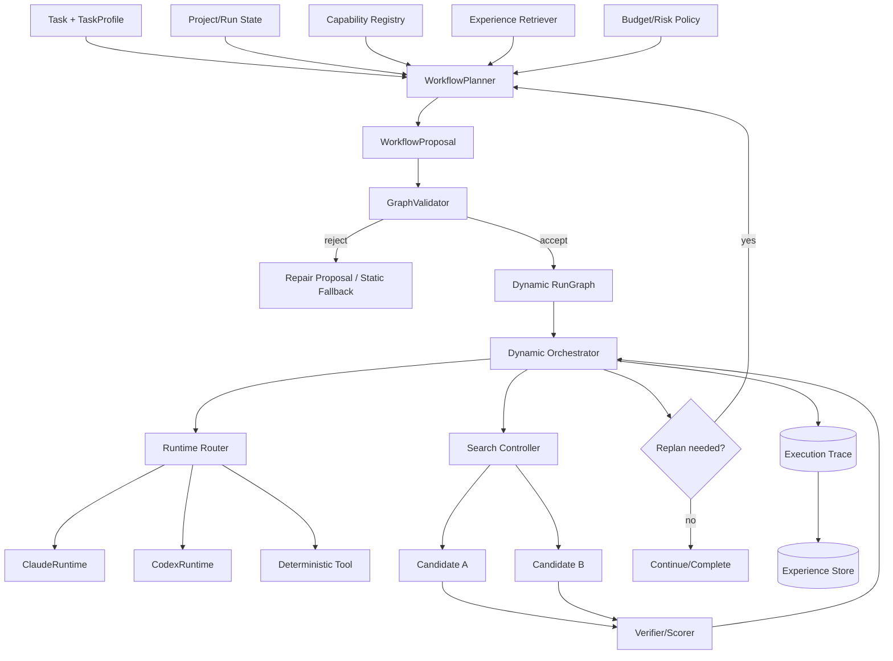

# Accretion v0.2 — System Design Specification

**Release thesis:** v0.2 extends the proven v0.1 control plane so Accretion can **construct and revise run-specific workflows**, choose providers/actions using runtime evidence, spend bounded test-time compute on multiple Claude/Codex trajectories, and retrieve verified prior experiences — while keeping permissions, graph admissibility, verifier authority, budgets, and durable state deterministic.

> **Codex implementation rule:** Do not start this release until all v0.1 MUST acceptance criteria pass. Preserve v0.1 APIs/contracts unless this document explicitly adds a versioned extension/migration. v0.2 still does **not** include RL-based policy learning, self-evolving architecture, or unrestricted production deployment.

---

## 0. Why v0.2 exists

v0.1 answers:

> Can one control plane reliably execute static `DIRECT`, `LOOP`, `GRAPH`, and `HYBRID` templates across Claude and Codex?

v0.2 answers:

> Can the system use task/runtime/evidence state to construct a **better run-specific computation structure**, search alternative trajectories when valuable, and reuse prior verified experience — with measurable improvement over the v0.1 static baseline?

This release is grounded in the research distinction between:

- **workflow template** — reusable design-time structure;
- **run-specific graph** — structure instantiated/constructed for a task;
- **execution trace** — what actually happened.

The 2026 workflow-optimization survey formalizes this static-vs-dynamic distinction. GraphFlow demonstrates task-specific workflow construction from a shared graph substrate. Test-time scaling work such as SWE-Replay motivates branching/replay only when the quality-cost tradeoff is favorable.

---

# 1. Prerequisites and inherited invariants

v0.2 inherits every v0.1 invariant. In particular:

- backend control plane remains authoritative;
- runtimes remain replaceable;
- one mutable worktree per candidate run;
- agents never grant themselves permissions;
- protected side effects remain policy/human controlled;
- verifiers remain independent of producers;
- React Flow remains a projection;
- secrets remain outside model context;
- v0.2 graph synthesis changes **computation structure**, never authority ceilings.

### 1.1 Required v0.1 artifacts

v0.2 requires:

- stable `AgentRuntime` adapters;
- stable normalized event stream;
- `TaskProfile` and `StrategyDecision` history;
- versioned static templates and benchmark results;
- `RunGraph`, `ExecutionTrace`, checkpoint/replay;
- capability registry and policy engine;
- verifier reliability measurements;
- React Flow graph projection;
- isolated worktree primitives;
- ACR-ARCH baseline.

If these are not stable, v0.2 is blocked.

---

# 2. v0.2 goals and non-goals

## 2.1 Goals

- Generate a **run-specific workflow proposal** from task/state/capabilities/risk/budget.
- Validate proposed graphs before execution.
- Permit bounded mid-run graph revision/replanning.
- Use performance history and health to select Claude, Codex, deterministic tools, reviewers, or human escalation.
- Support bounded best-of-N, cross-provider, hypothesis-branch, and generator-reviewer search.
- Reuse compatible verified trajectories/strategies through an `ExperienceStore`.
- Show dynamic graph creation, graph diffs, replans, search trees, and experience provenance in the frontend.
- Benchmark dynamic workflow quality against v0.1 static templates.
- Preserve deterministic authority and rollback.

## 2.2 Non-goals

- No end-to-end RL or online learned policy.
- No self-evolving prompts/tools/harness architecture.
- No autonomous permission expansion.
- No benchmark-driven automatic architecture promotion.
- No unrestricted public SaaS subscription pooling.
- No arbitrary unverified natural-language graph execution.
- No dynamic change to hard verifier or approval requirements.
- No direct production deployment without human/policy gate.

---

# 3. v0.2 architecture delta



## 3.1 New components

- `WorkflowPlanner`
- `WorkflowProposal`
- `GraphValidator`
- `ReplanController`
- `PerformanceAwareRuntimeRouter`
- `SearchController`
- `CandidateTrajectory`
- `ExperienceStore`
- `ExperienceRetriever`
- `StrategyExtractor` (recommendation only)
- dynamic graph/search frontend projections

---

# 4. Dynamic workflow model

## 4.1 WorkflowProposal

The planner outputs a typed proposal, never free-form executable text.

```yaml
WorkflowProposal:
  proposal_id: string
  task_id: string
  based_on_graph_revision: int?
  planner_version: string
  planner_runtime: CLAUDE | CODEX | DETERMINISTIC
  objective: string
  assumptions: [string]
  nodes: [WorkflowNodeSpec]
  edges: [WorkflowEdgeSpec]
  required_capabilities: [string]
  requested_search_budget: SearchBudget?
  expected_verifiers: [string]
  expected_approval_gates: [string]
  rationale_summary: string
  confidence: float
  provenance_refs: [string]
```

## 4.2 WorkflowNodeSpec

```yaml
WorkflowNodeSpec:
  local_id: string
  kind: AGENT | TOOL | VERIFIER | GATE | LOOP | JOIN | HUMAN | TERMINAL
  objective: string
  input_contract: object
  output_contract: object
  runtime_requirement: ANY | CLAUDE | CODEX | DETERMINISTIC | HUMAN
  skill_refs: [string]
  capability_refs: [string]
  verifier_refs: [string]
  risk_level: LOW | MEDIUM | HIGH | CRITICAL
  max_attempts: int
  timeout_seconds: int
  loop_spec: LoopSpec?
  checkpoint: bool
```

## 4.3 WorkflowEdgeSpec

```yaml
WorkflowEdgeSpec:
  source: string
  target: string
  kind: NORMAL | CONDITION | LOOP_BACK | RETRY | ERROR | FANOUT | MERGE | APPROVAL
  condition: TypedCondition?
  max_traversals: int?
```

Conditions use a restricted expression DSL over known state fields; no arbitrary Python/JS evaluation.

---

# 5. GraphValidator

The graph validator is a **deterministic authority boundary**.

```python
class GraphValidator(Protocol):
    def validate(
        self,
        proposal: WorkflowProposal,
        capability_snapshot: CapabilitySnapshot,
        policy_snapshot: PolicySnapshot,
        budget: BudgetEnvelope,
    ) -> GraphValidationResult: ...
```

## 5.1 Validation rules

A proposal is rejected if any condition holds:

1. unknown capability/tool/skill/verifier ID;
2. capability incompatible with provider/runtime;
3. requested capability exceeds task/project permission ceiling;
4. missing mandatory approval gate;
5. missing mandatory verifier;
6. unbounded loop/cycle;
7. `max_traversals` absent on retry/loop edges;
8. graph has unreachable required terminal state;
9. fan-out exceeds budget/concurrency ceiling;
10. graph can skip mandatory verification path;
11. protected side effect can execute before durable intent/policy gate;
12. node contract output cannot satisfy downstream input contract;
13. graph exceeds max nodes/edges/depth;
14. planner tries to mutate hard policy/credentials/evaluation authority;
15. proposed runtime is unavailable and no fallback exists.

## 5.2 GraphValidationResult

```yaml
GraphValidationResult:
  proposal_id: string
  status: ACCEPT | REJECT | REPAIRABLE
  errors: [ValidationFinding]
  warnings: [ValidationFinding]
  normalized_graph_hash: string?
  required_repairs: [RepairInstruction]
  validator_version: string
```

## 5.3 Repair policy

At most `GRAPH_PROPOSAL_REPAIR_ATTEMPTS` repairs. If still invalid:

```text
fallback to best validated v0.1 static template
OR require human
```

No “keep asking until accepted” unbounded loop.

---

# 6. Dynamic RunGraph lifecycle

## 6.1 State machine

```text
PROPOSED
  -> VALIDATING
  -> REJECTED
  -> VALIDATED
  -> ACTIVE
  -> REPLAN_REQUESTED
  -> SUPERSEDED
  -> COMPLETED | FAILED | CANCELLED
```

## 6.2 Graph revisions

Each accepted replan creates a new immutable graph revision:

```yaml
RunGraphRevision:
  run_graph_id: string
  revision: int
  parent_revision: int?
  proposal_id: string
  reason: INITIAL | EVIDENCE_CHANGE | NODE_FAILURE | BUDGET_CHANGE | RUNTIME_FAILURE | HUMAN_REQUEST
  nodes: [...]
  edges: [...]
  activated_at: timestamp
```

Never mutate historical graph revisions in place.

## 6.3 Replanning triggers

A replan may be requested when:

- node fails after local recovery budget;
- new evidence invalidates a prior assumption;
- required capability becomes unavailable;
- verifier returns inconclusive and an alternate evidence path exists;
- budget materially changes;
- operator requests replan;
- search results indicate a different branch should become primary.

A replan is **not** triggered just because an LLM wants variety.

## 6.4 Replan safety

Completed side effects remain facts. A new graph must account for prior execution state; it cannot pretend old actions did not happen.

---

# 7. Performance-aware runtime routing

v0.1 provides runtime health and historical results. v0.2 uses them in routing.

## 7.1 Runtime decision

```yaml
RuntimeDecision:
  node_id: string
  candidates: [RuntimeCandidate]
  selected_runtime: string
  selected_reason: string
  policy_version: string
  fallback_order: [string]
  observed_features: object
```

## 7.2 Seed scoring model

No learned model required yet.

```text
Score(runtime, node) =
    wq * historical_quality
  - wc * usage_pressure
  - wl * expected_latency
  - wr * risk_penalty
  + wa * availability
  + ws * specialization_fit
```

`usage_pressure` is provider-specific and categorical/normalized; it is not assumed to equal monetary cost.

## 7.3 Routing actions

Router can choose:

- Claude;
- Codex;
- deterministic tool;
- Claude producer + Codex reviewer;
- Codex producer + Claude reviewer;
- parallel candidates;
- human escalation.

## 7.4 Fallback

Provider failure triggers bounded fallback according to the already-validated graph/policy. Fallback cannot silently reduce mandatory verifier or approval requirements.

---

# 8. Search / test-time compute

## 8.1 Principle

Search is used only when:

- uncertainty is high;
- branch outcomes can be independently verified;
- task value justifies extra compute;
- budget permits;
- diversity is expected to be meaningful.

## 8.2 SearchPlan

```yaml
SearchPlan:
  search_id: string
  parent_node_id: string
  mode: BEST_OF_N | HYPOTHESIS_BRANCH | CROSS_PROVIDER | GENERATOR_REVIEWER | REPLAY_BRANCH
  branch_count: int
  max_parallel: int
  per_branch_budget: BudgetEnvelope
  total_budget: BudgetEnvelope
  candidate_generator: object
  verifier_policy_ref: string
  diversity_requirement: object
  stop_policy: SearchStopPolicy
```

## 8.3 CandidateTrajectory

```yaml
CandidateTrajectory:
  candidate_id: string
  search_id: string
  runtime: string
  workspace_lease_id: string
  seed_experience_ref: string?
  trajectory_ref: string
  artifact_refs: [string]
  verifier_results: [string]
  quality_score: float?
  cost_proxy: float
  latency_ms: int
  risk_score: float
  terminal_status: string
```

## 8.4 Search objective

```text
Score(tau) = Q(tau)
             - lambda * C(tau)
             - mu * L(tau)
             - nu * Risk(tau)
```

## 8.5 Stop conditions

Stop when:

- candidate meets acceptance threshold;
- budget exhausted;
- marginal expected quality gain falls below threshold;
- branch diversity collapses;
- verifier confidence is insufficient to rank/prune;
- provider availability changes;
- human/policy intervention required.

## 8.6 Search modes in v0.2

### Best-of-N

Independent candidates in isolated worktrees.

### Cross-provider

Claude and Codex solve same bounded node under comparable budgets.

### Hypothesis branch

Competing explanations each receive a bounded experiment.

### Generator-reviewer

One provider produces; another reviews. Reverse direction must also be benchmarkable.

### Replay-branch

Start from a compatible verified prior trajectory state, then branch at a useful point.

Beam/best-first tree search beyond shallow bounded search is optional and must not block v0.2 release.

---

# 9. Experience engineering

## 9.1 Experience record

```yaml
Experience:
  experience_id: string
  task_signature: object
  environment_signature: object
  architecture_version: string
  run_graph_versions: [int]
  runtime_provider_model: object
  prompt_skill_plugin_versions: object
  trajectory_ref: string
  outcome_ref: string
  verifier_summary: object
  cost_latency_usage: object
  failure_taxonomy: [string]
  transfer_tags: [string]
  trust_level: LOW | MEDIUM | HIGH
  created_at: timestamp
```

Only verified runs may become `HIGH` trust experience.

## 9.2 ExperienceQuery

```yaml
ExperienceQuery:
  task_signature: object
  environment_signature: object
  required_task_family: string
  compatible_runtime_versions: [string]?
  compatible_policy_version: string?
  max_age: duration?
  include_failures: bool
  top_k: int
```

## 9.3 ExperienceMatch

```yaml
ExperienceMatch:
  experience_id: string
  semantic_similarity: float
  environment_compatibility: float
  version_compatibility: float
  transfer_risk: float
  final_score: float
  reusable_segments: [TrajectorySegmentRef]
```

## 9.4 Retrieval policy

Similarity alone is insufficient. Require metadata compatibility. Old experience must be down-ranked or rejected if repository/runtime/policy semantics materially changed.

## 9.5 Negative knowledge

Failed experiences are stored with failure taxonomy. Retrieval may surface “avoid this path” as well as successful strategies.

## 9.6 StrategyExtractor

May generate `StrategyCandidate` recommendations from repeated patterns, but v0.2 does not automatically promote them into routing policy/skills without explicit review.

---

# 10. Experience-based trajectory replay

Replay is not “copy a previous answer.” It reuses validated procedural state.

```yaml
TrajectorySeed:
  source_experience_id: string
  source_segment_ref: string
  compatibility_score: float
  injected_state: object
  assumptions: [string]
  required_revalidation: [string]
```

Before replay:

- verify environment compatibility;
- revalidate assumptions;
- do not reuse irreversible side-effect state;
- do not reuse stale credentials/permissions;
- preserve provenance that the run was seeded.

---

# 11. Verifier extensions for dynamic workflows

v0.2 adds two verifier categories.

## 11.1 Structure verifier

Evaluates graph-level properties:

- valid capability use;
- required gates;
- bounded cycles;
- reachability;
- unnecessary branch explosion;
- invalid or redundant node structure;
- structural variation metrics.

## 11.2 Search/verifier calibration

Track:

- false accept;
- false reject;
- ranking consistency;
- candidate selection regret;
- disagreement between deterministic and LLM reviewers;
- test flakiness.

Do not expand search aggressively until verifier calibration is known.

---

# 12. Frontend — dynamic workflow observability

v0.2 extends the v0.1 React Flow UI.

## 12.1 New screens/features

1. **Workflow Planner Inspector** — proposal rationale, assumptions, requested capabilities, graph-validation result.
2. **Graph Revision Timeline** — revision 1 → revision 2 with explicit replan reason.
3. **Graph Diff** — added/removed/replaced nodes/edges; protected gates highlighted.
4. **Dynamic Live Run** — React Flow updates to new graph revision without losing historical trace.
5. **Search Tree / Candidate View** — parallel branches, runtimes, verifier scores, selected candidate.
6. **Router Inspector** — runtime candidates, scores/features, fallback order.
7. **Experience Panel** — retrieved experiences, compatibility/transfer-risk, reused segments.
8. **v0.2 Benchmark Dashboard** — static vs dynamic, search curves, experience uplift, negative transfer.

## 12.2 Dynamic GraphProjection

```yaml
DynamicGraphProjection:
  run_id: string
  active_graph_revision: int
  revisions: [GraphRevisionSummary]
  nodes: [GraphProjectionNode]
  edges: [GraphProjectionEdge]
  pending_proposal: WorkflowProposalSummary?
  validation_state: object?
  generated_at: timestamp
```

## 12.3 UI behavior on replan

- never delete historical revision data from the client trace;
- animate/highlight new active revision, but preserve old revision accessible in timeline;
- show why replan happened;
- mark completed side-effect nodes immutable/historical;
- show pending graph proposal separately from active graph until validation/activation.

## 12.4 Search visualization

Search branches are rendered as a separate candidate tree or grouped subflow; the main active workflow should not become unreadable by expanding every candidate into the primary graph.

---

# 13. Data model additions

Add/migrate:

```text
workflow_proposals
graph_validation_results
run_graph_revisions
replan_requests
runtime_decisions
search_plans
search_candidates
candidate_scores
experiences
experience_embeddings        # optional pgvector
experience_matches
trajectory_segments
strategy_candidates
```

## 13.1 Version rules

- proposal immutable after submission;
- graph validation immutable;
- each accepted graph revision immutable;
- active revision pointer is mutable authoritative state;
- search candidate artifacts immutable after terminal state;
- experiences immutable except trust/retraction metadata through versioned moderation action.

---

# 14. API additions

```text
POST /api/v2/tasks/{task_id}/workflow/propose
GET  /api/v2/runs/{run_id}/workflow/proposals
GET  /api/v2/runs/{run_id}/workflow/proposals/{proposal_id}
POST /api/v2/runs/{run_id}/workflow/proposals/{proposal_id}/validate
POST /api/v2/runs/{run_id}/workflow/proposals/{proposal_id}/activate

POST /api/v2/runs/{run_id}/replan
GET  /api/v2/runs/{run_id}/graph/revisions
GET  /api/v2/runs/{run_id}/graph/revisions/{revision}
GET  /api/v2/runs/{run_id}/graph/diff?from=1&to=2

GET  /api/v2/runs/{run_id}/runtime-decisions

POST /api/v2/runs/{run_id}/search
GET  /api/v2/search/{search_id}
GET  /api/v2/search/{search_id}/candidates
POST /api/v2/search/{search_id}/cancel

POST /api/v2/experiences/query
GET  /api/v2/experiences/{experience_id}
POST /api/v2/experiences/{experience_id}/retract

GET  /api/v2/benchmarks/dynamic-workflow
GET  /api/v2/benchmarks/search
GET  /api/v2/benchmarks/experience
```

Keep v0.1 APIs backward compatible where possible.

---

# 15. New event types

```text
WORKFLOW_PROPOSAL_CREATED
WORKFLOW_PROPOSAL_REPAIRED
GRAPH_VALIDATION_STARTED
GRAPH_VALIDATION_RESULT
GRAPH_REVISION_ACTIVATED
REPLAN_REQUESTED
REPLAN_STARTED
REPLAN_COMPLETED
RUNTIME_DECISION
SEARCH_STARTED
SEARCH_CANDIDATE_STARTED
SEARCH_CANDIDATE_COMPLETED
SEARCH_CANDIDATE_PRUNED
SEARCH_SELECTION
SEARCH_STOPPED
EXPERIENCE_QUERY
EXPERIENCE_RETRIEVED
TRAJECTORY_REPLAY_STARTED
TRAJECTORY_REPLAY_REJECTED
```

All retain monotonic per-run sequence and causation/correlation IDs.

---

# 16. Dynamic orchestration failure handling

| Failure | Recovery |
|---|---|
| invalid graph proposal | structured repair attempt, then static fallback/human |
| repeated invalid planner output | disable dynamic planner for task, use v0.1 template |
| runtime unavailable after graph activation | route fallback if contract-compatible; else replan |
| node failure | local recovery budget, then replan request |
| search branch crash | mark candidate failed; continue if search quorum/budget permits |
| verifier unable to rank candidates | stop search / collect more evidence / human |
| experience transfer mismatch | reject seed and continue fresh |
| graph revision conflict | optimistic concurrency failure; regenerate proposal from latest state |
| provider quota pressure | reduce branch count / reroute / pause; never silently exceed budgets |

Static fallback is a first-class safety mechanism, not a failure of the design.

---

# 17. Security and authority in v0.2

Dynamic graph generation introduces new threats:

| Threat | Control |
|---|---|
| planner creates privilege-expanding node | GraphValidator checks capability ceiling |
| planner omits required verifier | required gate/verifier closure validation |
| unbounded self-spawn/search | global and per-node branch ceilings |
| graph complexity DoS | max nodes/edges/depth + validation budget |
| replanning hides prior side effect | immutable execution trace + revision-aware state |
| malicious experience poisons planner | trust levels + compatibility + retraction + verifier history |
| search multiplies dangerous actions | sandbox branches; protected side effects disabled in speculative candidates |
| router chooses weaker unsafe path | hard verifier/approval requirements independent of runtime choice |

### Speculative branch rule

Search candidates run in isolated/simulated/local workspaces. A speculative branch cannot directly perform protected external side effects. Promotion occurs only after candidate selection and policy re-evaluation.

---

# 18. v0.2 benchmark suite

## 18.1 RQ-DYN — dynamic workflow vs static templates

Baseline: best v0.1 static template selected by deterministic policy.

Treatment: v0.2 planner + GraphValidator.

Measure:

- task success;
- cost/usage proxy;
- latency;
- architecture regret;
- structural variation;
- invalid proposal rate;
- replan frequency;
- graph complexity;
- human intervention.

Primary hypothesis:

> Dynamic workflows improve cost-adjusted success on heterogeneous/uncertain tasks but may not beat static templates on predictable tasks.

## 18.2 RQ-ROUTE — provider routing

Compare:

- always Claude;
- always Codex;
- fixed task-type heuristic;
- v0.2 performance-aware router.

Report success/cost/latency and fallback rate.

## 18.3 RQ-SEARCH — test-time compute

Compare candidate counts `N = 1, 2, 4` initially.

Report:

- best-of-N gain;
- quality-vs-cost curve;
- branch diversity;
- candidate selection regret;
- verifier ranking reliability.

Do not require N=8 for v0.2 release.

## 18.4 RQ-XPROV — cross-provider diversity

Compare equal-budget:

```text
Codex + Codex
Claude + Claude
Claude + Codex
```

Measure candidate behavioral/artifact diversity and verified success.

## 18.5 RQ-EXP — experience retrieval

Compare:

- fresh start;
- success-only retrieval;
- success + failure retrieval;
- replay branch where applicable.

Measure:

- success uplift;
- steps/tool calls saved;
- latency/usage difference;
- negative-transfer rate;
- stale experience rejection accuracy.

## 18.6 Benchmark hygiene

- separate development and held-out tasks;
- freeze task/environment/verifier versions per experiment;
- do not tune planner on holdout;
- report static baseline every time;
- preserve complete traces;
- explicitly record planner/model/runtime versions;
- distinguish model upgrade effects from orchestration changes.

---

# 19. v0.2 release acceptance criteria

All MUST criteria are release blocking.

## 19.1 P5 — Dynamic workflow proposal and validation

| ID | Acceptance criterion | Level |
|---|---|---|
| V02-P5-001 | Planner emits schema-valid `WorkflowProposal` with typed nodes/edges/capabilities/verifiers/budgets. | MUST |
| V02-P5-002 | GraphValidator rejects unknown capability IDs. | MUST |
| V02-P5-003 | GraphValidator rejects unbounded loops/retries/fan-out. | MUST |
| V02-P5-004 | GraphValidator rejects proposals that omit mandatory verifier/approval gates. | MUST |
| V02-P5-005 | GraphValidator rejects privilege expansion beyond task/project policy. | MUST |
| V02-P5-006 | Repeated invalid proposals fall back to a validated v0.1 static template or human. | MUST |
| V02-P5-007 | Accepted run graph is versioned/immutable and traceable to proposal/validator versions. | MUST |
| V02-P5-008 | Mid-run replan creates a new graph revision rather than mutating old revision. | MUST |
| V02-P5-009 | Completed protected side effects remain represented in state after replan. | MUST |
| V02-P5-010 | Runtime decision records candidates, selected runtime, reason, policy version, and fallback order. | MUST |

## 19.2 Dynamic UI

| ID | Acceptance criterion | Level |
|---|---|---|
| V02-UI-001 | Planner inspector shows proposal, assumptions, capabilities, and validation findings. | MUST |
| V02-UI-002 | React Flow shows active graph revision and preserves access to prior revisions. | MUST |
| V02-UI-003 | Graph diff accurately shows added/removed/replaced nodes/edges. | MUST |
| V02-UI-004 | Pending proposal is visually distinct from active executable graph. | MUST |
| V02-UI-005 | Replan event updates UI without losing execution trace/history. | MUST |
| V02-UI-006 | Router inspector shows observed routing features and fallback order without exposing secrets. | MUST |

## 19.3 P6 — Search/test-time compute

| ID | Acceptance criterion | Level |
|---|---|---|
| V02-P6-001 | Best-of-2 creates isolated candidate workspaces and never shares mutable candidate state. | MUST |
| V02-P6-002 | SearchController enforces per-branch and total budgets. | MUST |
| V02-P6-003 | Speculative branches cannot execute protected external side effects. | MUST |
| V02-P6-004 | Verifier/scorer can select one candidate and only selected candidate enters promotion path. | MUST |
| V02-P6-005 | Search stops on acceptance, budget, low expected gain, low diversity, verifier uncertainty, or operator cancellation. | MUST |
| V02-P6-006 | Candidate failure does not corrupt sibling workspaces or parent run state. | MUST |
| V02-P6-007 | Cross-provider search records provider/runtime/model/version for each candidate. | MUST |
| V02-P6-008 | Search tree UI shows candidate status, score, runtime, cost/latency proxy, and selected/pruned reason. | MUST |
| V02-P6-009 | Search benchmark produces quality-vs-compute curve for N=1,2,4 on held-out tasks. | MUST |

## 19.4 P7 — Experience retrieval/replay

| ID | Acceptance criterion | Level |
|---|---|---|
| V02-P7-001 | Verified run can be materialized into immutable `Experience` with environment/version provenance. | MUST |
| V02-P7-002 | Experience query uses semantic similarity plus environment/version compatibility. | MUST |
| V02-P7-003 | Deliberately stale/incompatible experience is rejected or heavily down-ranked. | MUST |
| V02-P7-004 | Failed trajectories can be retrieved as negative procedural knowledge. | MUST |
| V02-P7-005 | Replay seed records source experience/segment and required revalidation. | MUST |
| V02-P7-006 | Replay cannot reuse prior credentials, permissions, or irreversible side-effect state. | MUST |
| V02-P7-007 | Experience panel shows provenance, compatibility, transfer risk, and reused segment. | MUST |
| V02-P7-008 | Held-out experiment measures uplift and negative-transfer rate versus fresh-start baseline. | MUST |

## 19.5 v0.2 research release gate

```text
RELEASE v0.2 only if:
  all MUST criteria pass
  AND dynamic workflow does not violate any v0.1 hard invariant
  AND at least one heterogeneous held-out benchmark shows measurable dynamic-workflow uplift
      OR the release is explicitly labeled experimental with a documented null/negative result
  AND search quality-vs-compute curve is measured
  AND experience negative-transfer rate is measured
  AND static v0.1 fallback remains operational
```

A negative research result is acceptable; hiding it is not.

---

# 20. Open questions and required decisions

| ID | Open question | Proposed v0.2 default | Decision deadline |
|---|---|---|---|
| OQ2-001 | What workflow DSL should conditions use? | Restricted typed expression DSL over known state; no arbitrary code. | Before P5 |
| OQ2-002 | Which provider should be default WorkflowPlanner? | Benchmark Claude/Codex; keep planner runtime swappable. | Early P5 |
| OQ2-003 | Should planner generate from scratch or compose a library of workflow fragments? | Prefer fragment composition + limited generated glue; fallback to static templates. | P5 |
| OQ2-004 | Maximum graph size/depth? | Start conservative (e.g. 32 nodes, bounded nesting) and benchmark. | P5 validator |
| OQ2-005 | How many graph repair attempts? | 1-2 bounded repairs, then fallback/human. | P5 |
| OQ2-006 | Which failures justify replan versus local retry? | Local retry for recoverable node error; replan after budget/fundamental assumption/capability failure. | P5 |
| OQ2-007 | Can active nodes be removed by replan? | Only pending/unstarted nodes; completed/running state must be reconciled explicitly. | P5 |
| OQ2-008 | How should runtime quality history be normalized across changing model versions? | Version-keyed rolling estimates; never aggregate incompatible versions silently. | P5 routing |
| OQ2-009 | What minimum verifier calibration is required for best-of-N? | Gate by empirical false-accept/ranking reliability from v0.1/v0.2 calibration. | Before P6 |
| OQ2-010 | How to measure branch diversity? | Combine artifact/diff/plan features; avoid only text embedding diversity. | P6 |
| OQ2-011 | How should search allocate subscription usage when exact quotas are opaque? | categorical pressure + time/turn ceilings + provider health. | P6 |
| OQ2-012 | Should candidates use same or different prompt/skill configs? | Support both; benchmark provider diversity separately from prompt diversity. | P6 research |
| OQ2-013 | When should search stop early after first passing candidate? | Acceptance threshold + expected marginal gain policy. | P6 |
| OQ2-014 | What experience metadata determines transfer validity? | task family + repo/environment signature + runtime/policy/tool versions + freshness. | P7 |
| OQ2-015 | pgvector or separate vector DB? | PostgreSQL + pgvector initially unless scale demands otherwise. | P7 |
| OQ2-016 | How long should experience remain valid after repo/model changes? | No universal TTL; compatibility scoring + explicit freshness metadata. | P7 |
| OQ2-017 | Should experience retrieval occur before or after initial planning? | Retrieve before planning but allow planner to reject matches; benchmark both. | P7 research |
| OQ2-018 | How should React Flow render large search trees? | Separate candidate tree view + collapsed branch summaries. | P6 UI |
| OQ2-019 | How should graph revisions animate without implying removed history? | Revision timeline + diff overlay; historical nodes remain accessible. | P5 UI |
| OQ2-020 | What uplift is sufficient to justify dynamic workflow complexity? | Pre-register utility threshold per benchmark before testing. | Release review |

---

# 21. Architecture Decision Records

| ADR | Decision | Rationale |
|---|---|---|
| ADR2-001 | Dynamic planner proposes; deterministic GraphValidator authorizes. | Separate creativity from authority. |
| ADR2-002 | Every accepted replan creates immutable graph revision. | Traceability and rollback. |
| ADR2-003 | v0.1 static template is always an available fallback. | Bounded degradation path. |
| ADR2-004 | Dynamic graph cannot create permissions/capabilities. | No privilege expansion. |
| ADR2-005 | Search candidates are isolated and speculative side effects are blocked. | Safe test-time compute. |
| ADR2-006 | Runtime routing uses interpretable evidence/heuristics, not RL in v0.2. | Preserve research attribution and control. |
| ADR2-007 | Experience retrieval requires compatibility metadata, not embeddings alone. | Reduce negative transfer. |
| ADR2-008 | Failed trajectories are first-class experience. | Learn what not to do. |
| ADR2-009 | React Flow displays proposals/revisions/search but remains projection-only. | Preserve backend authority. |
| ADR2-010 | v0.2 research must report static baseline and negative/null results. | Prevent misleading complexity claims. |

---

# 22. Repository additions

```text
accretion/
  orchestration/
    planner/
      workflow_planner.py
      proposal_models.py
    validator/
      graph_validator.py
      condition_dsl.py
    replan/
      controller.py
    router/
      performance_router.py
    search/
      controller.py
      scoring.py
      diversity.py

  experience/
    models.py
    store.py
    retrieval.py
    compatibility.py
    replay.py
    strategy_candidates.py

  apps/ui/src/features/
    workflowPlanner/
    graphRevisions/
    search/
    experience/
    routing/

  evals/
    dynamic_workflow/
    routing/
    search/
    experience/
```

---

# 23. Implementation milestones

## P5 — Weeks 11-13

- WorkflowProposal schemas;
- planner adapter;
- restricted condition DSL;
- GraphValidator;
- graph revision model;
- replan controller;
- performance-aware runtime routing;
- workflow planner/revision UI;
- dynamic-vs-static benchmark.

## P6 — Weeks 14-16

- SearchController;
- best-of-2 then N=4;
- candidate isolation;
- cross-provider/generator-reviewer modes;
- candidate scorer/verifier calibration;
- search-tree UI;
- quality-vs-compute benchmark.

## P7 — after sufficient verified traces

- ExperienceStore;
- compatibility/retrieval;
- negative knowledge;
- replay-branch;
- experience UI;
- uplift/negative-transfer benchmark.

Do not begin P8 policy learning until v0.2 traces are stable and the v0.2 release review is complete.

---

# 24. Research references

- Yue et al., **From Static Templates to Dynamic Runtime Graphs: A Survey of Workflow Optimization for LLM Agents**, arXiv:2603.22386 (2026): https://arxiv.org/abs/2603.22386
- Li et al., **GraphFlow: A Graph-Based Workflow Management for Efficient LLM-Agent Serving**, arXiv:2605.22566 / ICML 2026: https://arxiv.org/abs/2605.22566
- Kong et al., **Workflow-R1: Group Sub-sequence Policy Optimization for Multi-turn Workflow Construction**, arXiv:2602.01202 (2026): https://arxiv.org/abs/2602.01202
- Ma et al., **Thinking Longer, Not Larger: Enhancing Software Engineering Agents via Scaling Test-Time Compute**, arXiv:2503.23803 (2025).
- Ding & Zhang, **SWE-Replay: Efficient Test-Time Scaling for Software Engineering Agents**, arXiv:2601.22129 (2026): https://arxiv.org/abs/2601.22129
- OpenAI Agents SDK, **Agent orchestration**: https://openai.github.io/openai-agents-python/multi_agent/
- Anthropic, **Building Effective AI Agents**: https://www.anthropic.com/engineering/building-effective-agents
- OpenAI, **Unlocking the Codex harness**: https://openai.com/index/unlocking-the-codex-harness/
- React Flow documentation: https://reactflow.dev/learn
- Internal research basis: **Beyond Graph Engineering — Deep Research Edition**, 2026-08-19.

---

# 25. Handoff to v0.3

v0.2 must produce a stable dataset before any learned policy work:

```text
state/profile features
action/workflow/routing decision
provider/runtime/model versions
search structure
experience used
verifier results
outcome
latency/cost/usage proxy
risk/constraint events
human interventions
```

v0.3 may learn routing/resource policies **only inside** the action space allowed by the unchanged deterministic policy/authorization boundary.
