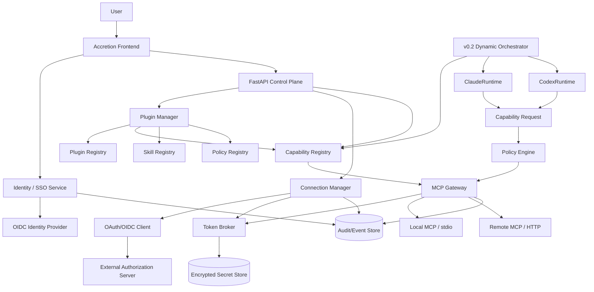
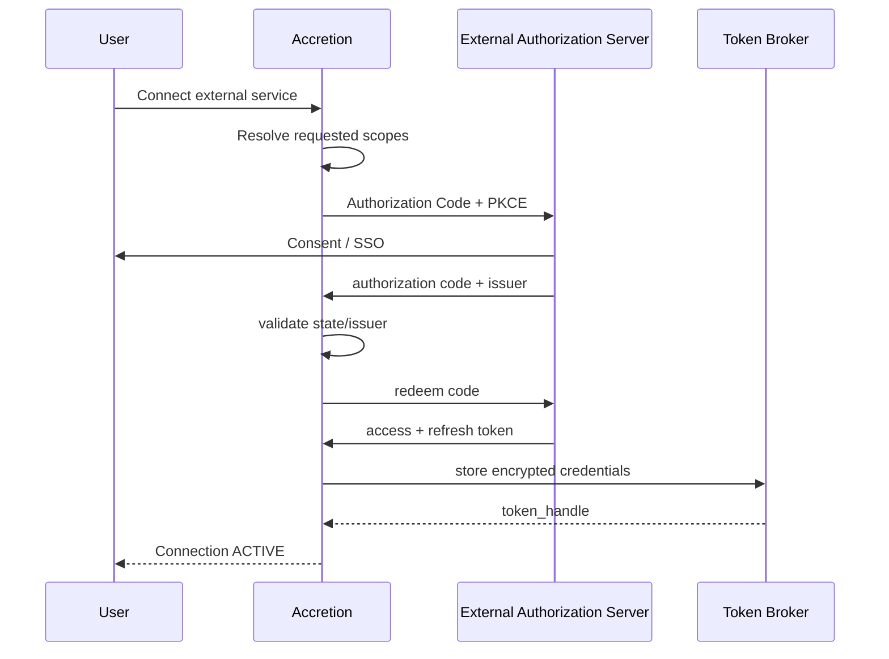

# Accretion v0.3 — System Design Specification

Roadmap context: [multi-release SDD index](Accretion_SDD_INDEX_v0.3.md). v0.3
remains locked behind the completed v0.2 release gate.

**Release thesis:** v0.3 turns Accretion from a local multi-runtime meta-harness into a governed **integration platform**. It adds installable plugins, remote/local MCP connection management, OAuth/OIDC and enterprise SSO, per-user/per-workspace connections, token brokerage, capability binding, and administrative policy — while preserving the v0.1/v0.2 rule that agents receive capabilities, never raw credentials.

> **Codex implementation rule:** v0.3 does not replace the v0.1 Capability Registry or v0.2 Dynamic Orchestrator. It extends them. Do not implement learned policy/RL or self-evolution here. Identity, authorization, secrets, and approval ceilings remain deterministic.

---

# 0. Version boundary

## 0.1 Why v0.3 is the correct release for full plugin/SSO support

Accretion already needs a **minimal MCP/capability foundation in v0.1**. v0.2 consumes those capabilities inside dynamic workflows. v0.3 is where the project adds the full **integration ecosystem**:

```text
v0.1
Static/Observable Harness
  + local MCP/tool gateway foundation
  + capability registry

v0.2
Dynamic Workflow Harness
  + dynamic capability use
  + search / experience

v0.3
Integration & Identity Platform
  + plugin lifecycle
  + remote MCP management
  + OAuth/OIDC
  + enterprise SSO
  + user/workspace connections
  + token broker
  + MCP Apps / UI-capability metadata

v0.4
Learned Routing / Policy
```

Therefore:

- **Basic MCP is NOT deferred to v0.3.** It is a v0.1 foundation.
- **Full plugin installation, account linking, SSO, remote MCP governance, and connector lifecycle ARE v0.3.**
- The earlier planned learned-policy release moves to **v0.4**.

## 0.2 Core research / product question

> Can Accretion expose many external systems to Claude, Codex, and future runtimes through one typed, identity-aware, least-privilege capability layer without leaking provider credentials or creating provider-specific workflow logic?

---

# 1. Goals and non-goals

## 1.1 Goals

- Support installable, versioned `MetaPlugin` packages.
- Support local stdio MCP servers and remote HTTP MCP servers.
- Discover and cache MCP tools/resources/prompts using the current MCP specification.
- Authenticate Accretion users through OIDC/SSO.
- Authorize external application access through OAuth/OIDC or enterprise-managed authorization.
- Store external credentials only in a secure Token Broker / Secret Store.
- Support per-user and per-workspace connections.
- Bind external accounts to Accretion principals without exposing tokens to agent runtimes.
- Project plugin capabilities into Claude, Codex, and future runtimes.
- Support research-oriented plugins and connectors.
- Support business/design tools such as Canva when an API/MCP/plugin integration is available.
- Provide frontend pages for Plugins, Connections, MCP Servers, Identity, Scopes, and Audit.
- Preserve all v0.1/v0.2 security and authority invariants.

## 1.2 Non-goals

- No use of SSO ID tokens as universal API access tokens.
- No direct token injection into model prompts or event payloads.
- No arbitrary plugin code executing outside sandbox/policy.
- No automatic privilege expansion because a plugin declares more scopes.
- No runtime learning of authorization policy.
- No shared consumer subscription account used as multi-user service identity.
- No self-installing plugins without operator/workspace policy.
- No arbitrary remote MCP endpoint accepted without trust checks.
- No RL-based plugin selection in v0.3.

---

# 2. Terminology

| Term | Meaning |
|---|---|
| `Principal` | Human/service identity known to Accretion. |
| `Workspace` | Administrative/security boundary containing projects, plugins, policies, and shared connections. |
| `IdentityProvider` | OIDC/SSO provider used to authenticate Accretion users. |
| `Connector` | Definition of an external system integration (GitHub, Google, Canva, research API, remote MCP server). |
| `Connection` | A configured and authenticated instance of a Connector for a principal/workspace. |
| `Plugin` | Versioned workflow package containing skills, connector requirements, MCP definitions, verifiers, policies, and optional UI metadata. |
| `Capability` | Typed action/resource the harness may expose to a runtime. |
| `TokenBroker` | Secure component that obtains/stores/refreshes credentials and returns only opaque handles to the rest of Accretion. |
| `MCPGateway` | Accretion MCP client/proxy layer that discovers, authorizes, invokes, audits, and normalizes MCP capabilities. |
| `EMA` | Enterprise-Managed Authorization extension for centrally managed MCP authorization. |

---

# 3. Architectural invariants

| ID | Invariant |
|---|---|
| INV3-001 | SSO authenticates a Accretion principal; it does not automatically authorize external tools. |
| INV3-002 | External OAuth/OIDC tokens are scoped to the external resource and stored only by Token Broker/Secret Store. |
| INV3-003 | Agent runtimes receive `ConnectionRef`/`CapabilityRef`, never access or refresh tokens. |
| INV3-004 | Plugin installation cannot grant permissions beyond workspace policy. |
| INV3-005 | MCP tool availability is not equivalent to authorization. Every call passes Accretion policy. |
| INV3-006 | Remote MCP server identity, issuer, scopes, and endpoint trust are validated before enabling. |
| INV3-007 | A plugin may declare required scopes, but only a user/admin can consent to them. |
| INV3-008 | Per-user connections are not silently shared with other principals. |
| INV3-009 | Workspace-shared connections require explicit admin policy and service-account semantics where supported. |
| INV3-010 | Plugin/runtime projections may differ, but core capability IDs remain provider-neutral. |
| INV3-011 | All connection, consent, token refresh, tool invocation, and revocation events are auditable. |
| INV3-012 | Revoking a connection immediately removes its capabilities from future execution planning. |

---

# 4. System architecture



## 4.1 Control responsibilities

### Identity Service

Authenticates the human/operator into Accretion.

### Plugin Manager

Installs, validates, enables, disables, upgrades, and removes plugins.

### Connection Manager

Creates external service connections and maps them to principals/workspaces.

### Token Broker

Owns credential lifecycle. It is the only component allowed to receive/decrypt refresh tokens.

### MCP Gateway

Discovers and invokes MCP tools/resources/prompts after authorization.

### Capability Registry

Presents one provider-neutral catalog to the orchestrator.

### Runtime Adapter

Translates selected capabilities/skills into provider-specific surfaces.

---

# 5. Identity model

## 5.1 Principal

```yaml
Principal:
  principal_id: usr_...
  type: HUMAN | SERVICE
  subject: string
  issuer: string
  email: string?
  display_name: string?
  workspace_memberships: [WorkspaceRole]
  status: ACTIVE | DISABLED
  created_at: datetime
```

Identity uniqueness MUST be derived from `(issuer, subject)`, not email alone.

## 5.2 Workspace roles

Initial roles:

```text
OWNER
ADMIN
DEVELOPER
RESEARCHER
VIEWER
SERVICE
```

Roles do not directly encode every capability permission. They are inputs into policy evaluation.

## 5.3 SSO flow

```text
Browser
  ↓
Accretion /auth/login
  ↓
OIDC Authorization Code + PKCE
  ↓
Identity Provider
  ↓
/auth/callback
  ↓
validate issuer / nonce / audience / state
  ↓
create/update Principal
  ↓
Accretion session
```

### Important distinction

```text
SSO / OIDC login
= Who are you in Accretion?

External OAuth connection
= What may Accretion do in GitHub/Google/Canva/etc. on your behalf?
```

These MUST remain separate security concepts even when the same identity provider is used.

---

# 6. External authorization model

## 6.1 OAuth connection flow



## 6.2 TokenHandle

```yaml
TokenHandle:
  token_handle_id: tokh_...
  connector_id: string
  principal_id: string?
  workspace_id: string
  issuer: string
  scopes: [string]
  audience: [string]
  expires_at: datetime?
  secret_store_key: opaque
  status: ACTIVE | EXPIRED | REVOKED | ERROR
```

The `secret_store_key` is not returned through public API or runtime context.

## 6.3 Scope step-up

If a requested tool needs a scope absent from the existing connection:

```text
Capability Request
   ↓
Policy accepts capability class
   ↓
Connection scopes insufficient
   ↓
INSUFFICIENT_SCOPE
   ↓
operator prompted for re-authorization
   ↓
new consent
   ↓
connection version updated
```

Never silently broaden scopes.

---

# 7. MCP architecture

## 7.1 Protocol target

Target MCP protocol revision `2026-07-28` for new remote integrations where supported.

Important properties Accretion should exploit:

- stateless core;
- request routing through MCP headers;
- cache hints on capability lists;
- hardened OAuth/OIDC authorization;
- formal extension mechanism;
- Tasks extension for long-running operations;
- MCP Apps extension for server-provided UI where useful;
- Enterprise-Managed Authorization for centralized enterprise connectivity.

## 7.2 Local MCP

For trusted local development/research tools:

```text
Accretion MCPGateway
  ↓ stdio
local MCP process
```

Requirements:

- executable allowlist;
- working-directory sandbox;
- environment-variable allowlist;
- no inherited full shell environment;
- process lifecycle/health monitoring;
- capability schema snapshot persisted.

## 7.3 Remote MCP

```text
Accretion MCPGateway
  ↓ HTTPS
Remote MCP server
```

Requirements:

- HTTPS except explicit local-dev exception;
- endpoint allowlist / trust policy;
- DNS/IP SSRF protection;
- issuer validation;
- authorization metadata validation;
- per-server connection profile;
- timeout/retry/circuit-breaker policy;
- request/response size limits;
- content trust labels;
- schema validation;
- audit correlation ID.

## 7.4 MCP server registration

```yaml
MCPServerDefinition:
  mcp_server_id: mcp_...
  name: string
  transport: STDIO | HTTP
  endpoint: string?
  command: [string]?
  protocol_versions: [string]
  auth_profile_ref: string?
  trust_level: TRUSTED | RESTRICTED | UNTRUSTED
  owner: plugin_id | workspace_id
  enabled: bool
  health_policy:
    timeout_ms: int
    failure_threshold: int
  discovery_policy:
    tools: true
    resources: true
    prompts: true
  allowed_tool_patterns: [string]
  denied_tool_patterns: [string]
```

## 7.5 Capability discovery

```text
register server
  ↓
validate transport/auth
  ↓
discover tools/resources/prompts
  ↓
validate schemas
  ↓
apply policy filters
  ↓
normalize capability IDs
  ↓
cache with server-provided TTL
  ↓
Capability Registry
```

## 7.6 Capability normalization

External MCP names must not leak into domain workflows as hard dependencies.

Example:

```text
remote MCP tool:
semantic-scholar.search_papers

Accretion capability:
research.literature.search
```

Mapping:

```yaml
CapabilityBinding:
  capability_id: research.literature.search
  backend:
    type: MCP
    server_ref: mcp_research_01
    method: tools/call
    tool_name: semantic-scholar.search_papers
  input_transform_ref: research-search-v1
  output_transform_ref: research-results-v1
  policy_ref: research-readonly-v1
```

This allows the backend to change without rewriting workflows.

---

# 8. Enterprise-Managed Authorization (EMA)

For enterprise/workspace deployments, Accretion SHOULD support MCP Enterprise-Managed Authorization as an optional auth strategy.

Conceptually:

```text
User signs in once to Accretion / Enterprise IdP
                   ↓
             Identity context
                   ↓
       Enterprise Auth Manager
                   ↓
        connected MCP servers
                   ↓
   centrally governed authorization
```

Use cases:

- company-managed GitHub MCP;
- internal research database MCP;
- CRM/data warehouse MCP;
- enterprise document stores;
- centrally controlled design/content tooling.

EMA does not remove Accretion policy. It reduces repeated external authorization friction.

---

# 9. Plugin model

## 9.1 Plugin definition

A Accretion plugin is a **distribution unit**, not execution authority.

```yaml
MetaPluginManifest:
  id: research-intelligence
  version: 0.3.0
  name: Research Intelligence
  description: Evidence-oriented research workflow capabilities

  skills:
    - literature-review
    - contradiction-analysis
    - hypothesis-generation

  connectors:
    required:
      - academic-search
    optional:
      - github
      - zotero

  mcp_servers:
    - research-mcp

  capabilities:
    - research.literature.search
    - research.paper.fetch
    - research.citation.resolve

  verifiers:
    - citation-verifier
    - provenance-verifier

  policies:
    - research-readonly

  ui:
    pages:
      - research-sources
    node_badges:
      - research

  provider_projections:
    claude: providers/claude/
    codex: providers/codex/
```

## 9.2 Plugin lifecycle

```text
DISCOVERED
  ↓
VALIDATING
  ↓
INSTALLED
  ↓
CONFIGURATION_REQUIRED
  ↓
READY
  ↓
ENABLED
  ↓
DISABLED
  ↓
REMOVED
```

Upgrade is versioned and reversible.

## 9.3 Plugin installation sequence

```text
Plugin package
  ↓
signature/hash verification
  ↓
manifest schema validation
  ↓
resolve connector dependencies
  ↓
resolve scopes / policy requirements
  ↓
admin/user consent
  ↓
register skills/capabilities/verifiers
  ↓
register MCP server definitions
  ↓
connect accounts if required
  ↓
health check
  ↓
ENABLE
```

## 9.4 Plugin authority rule

A plugin may say:

```text
"I require github.write"
```

but Accretion may respond:

```text
DENY
```

or:

```text
INSTALL WITH READ-ONLY CAPABILITIES
```

Plugin manifests are requests; policy is authority.

---

# 10. Research MCP / plugin design

A first-class v0.3 plugin should be `research-intelligence`.

```text
ResearchIntelligencePlugin
│
├── Skills
│   ├── literature-review
│   ├── evidence-extraction
│   ├── contradiction-analysis
│   ├── theory-construction
│   └── experiment-design
│
├── Capabilities
│   ├── research.literature.search
│   ├── research.paper.fetch
│   ├── research.metadata.resolve
│   ├── research.citation.verify
│   ├── github.search
│   └── python.execute
│
├── MCP / connectors
│   ├── academic-search
│   ├── paper-store
│   └── optional reference manager
│
└── Verifiers
    ├── citation-verifier
    ├── provenance-verifier
    └── evidence-quality-verifier
```

## 10.1 Research call path

```text
Research Node
  ↓
CapabilityResolver
  ↓
research.literature.search
  ↓
Policy Engine
  ↓
ConnectionResolver
  ↓
MCPGateway
  ↓
Research MCP / API adapter
  ↓
normalized EvidenceCandidate[]
  ↓
Evidence Verifier
  ↓
Evidence Store
```

The agent never needs to know whether the source is MCP, REST, local database, or another agent.

---

# 11. Design-tool integration (Canva example)

If the intended tool is **Canva**, model it as a normal external connector/plugin rather than special-casing it in the orchestrator.

Example capability surface:

```text
design.search
design.create
design.read
design.update
design.export
```

Possible architecture:

```text
Accretion task
  ↓
Design Skill
  ↓
design.create
  ↓
Capability Registry
  ↓
Policy
  ↓
Connection Resolver
  ↓
Canva connector / MCP / provider API
  ↓
Token Broker injects user authorization
  ↓
Design ArtifactRef
```

The plugin might look like:

```yaml
MetaPluginManifest:
  id: design-workflow
  connectors:
    required: [canva]
  skills:
    - create-report-visual
    - create-presentation-asset
  capabilities:
    - design.create
    - design.read
    - design.export
```

**If “Canvas” means ChatGPT Canvas:** do not build Accretion around it. Treat Accretion's own editor/workspace/UI as the product surface; ChatGPT Canvas is not the integration target for this architecture.

---

# 12. Connection model

## 12.1 ConnectorDefinition

```yaml
ConnectorDefinition:
  connector_id: conndef_...
  plugin_id: string?
  name: string
  kind: MCP | REST | GRAPHQL | SDK | LOCAL
  auth_type: NONE | OAUTH2 | OIDC | API_KEY | SERVICE_ACCOUNT | EMA
  authorization_server: string?
  resource_server: string?
  default_scopes: [string]
  optional_scopes: [string]
  connection_scope: USER | WORKSPACE
  capability_bindings: [CapabilityBinding]
  health_check_ref: string
```

## 12.2 Connection

```yaml
Connection:
  connection_id: conn_...
  connector_id: string
  workspace_id: string
  principal_id: string?
  scope: USER | WORKSPACE
  token_handle_ref: string?
  granted_scopes: [string]
  status: PENDING | ACTIVE | DEGRADED | REAUTH_REQUIRED | REVOKED
  created_at: datetime
  last_health_check: datetime?
  metadata: object
```

## 12.3 Connection resolution

```text
Capability Request
  ↓
capability binding
  ↓
required connector
  ↓
find connection:
    user connection first
    workspace service connection second if policy permits
  ↓
validate scopes
  ↓
validate status
  ↓
execute
```

---

# 13. Token Broker

## 13.1 Responsibilities

- exchange authorization codes;
- encrypt access/refresh tokens;
- refresh access tokens;
- revoke credentials;
- enforce issuer/audience/scopes;
- produce short-lived credential material only inside gateway process boundaries;
- never log secrets;
- support secret-store backend abstraction.

## 13.2 Interface

```python
class TokenBroker(Protocol):
    async def store_authorization(...)->TokenHandle: ...
    async def get_access_material(handle, audience, scopes)->EphemeralCredential: ...
    async def refresh(handle)->TokenHandle: ...
    async def revoke(handle)->None: ...
    async def status(handle)->TokenStatus: ...
```

`EphemeralCredential` must never be serializable into AgentEvent or model-facing context.

## 13.3 Storage

v0.3 local-first options:

```text
Preferred:
OS keyring / dedicated encrypted secret store

Acceptable development fallback:
application-level envelope encryption with a master key outside PostgreSQL
```

Never store plaintext tokens in PostgreSQL.

---

# 14. Policy model

Authorization inputs:

```text
Principal
Workspace
Project
Task phase
Plugin
Capability
Connector
Connection owner
Requested arguments
Risk
Scopes
Runtime
Budget
```

Decision:

```text
ALLOW
DENY
REQUIRE_APPROVAL
REQUIRE_REAUTH
```

Example:

```yaml
policy: research-canva-readonly
rules:
  - capability: design.read
    decision: ALLOW
  - capability: design.export
    decision: ALLOW
  - capability: design.update
    decision: REQUIRE_APPROVAL
  - capability: design.delete
    decision: DENY
```

---

# 15. Runtime projection

## 15.1 General rule

Accretion selects capabilities first:

```text
Task
 ↓
Capability set
 ↓
Runtime adapter
 ↓
provider-specific projection
```

Not:

```text
Task
 ↓
Claude plugin naming / Codex plugin naming
 ↓
domain logic
```

## 15.2 Claude projection

Possible projection elements:

- skill instructions;
- least-privilege MCP server/tool allowlist;
- native permission configuration;
- hooks where useful;
- provider-specific metadata.

## 15.3 Codex projection

Possible projection elements:

- Codex skills;
- MCP server configuration;
- App Server approvals;
- installed plugin/app capabilities when supported.

## 15.4 Opencode projection

Possible projection elements:

- inline server configuration via `OPENCODE_CONFIG_CONTENT`;
- per-prompt tool allow/deny map on `prompt_async`;
- non-interactive permission policy (`edit`/`bash` patterns, `webfetch`, `external_directory`);
- per-session working directory, which is how a run is pinned to its worktree.

Two constraints distinguish this adapter from §15.2 and §15.3:

- **No capability gateway.** opencode resolves `mcp` once per server process, while the
  Accretion gateway pins one `ACCRETION_GATEWAY_RUN_ID` for its lifetime. On a server shared
  by concurrent runs that would attribute every governed side effect to whichever run started
  first, so the adapter configures no gateway and refuses any task carrying a non-empty
  capability set. Such tasks must be routed to Claude or Codex.
- **The model is configuration, never code.** `prompt_async` takes an explicit
  `providerID`/`modelID`, supplied by `ACCRETION_OPENCODE_MODEL` or `SessionConfig.model`.
  `health()` verifies the configured model still appears in `opencode models` and reports
  `DEGRADED` when it does not, so a withdrawn preview model fails at planning time rather
  than mid-run.

Provider differences remain isolated in adapters.

---

# 16. Frontend

v0.3 adds the following screens.

## 16.1 Plugins

```text
Plugins
──────────────────────────────────────
Research Intelligence     ENABLED
Software Engineering      ENABLED
Design Workflow           SETUP REQUIRED
Data / ML                 DISABLED
```

Plugin detail shows:

- version;
- skills;
- connectors;
- requested capabilities;
- required scopes;
- verifiers;
- policies;
- provider projections;
- installation audit.

## 16.2 Connections

```text
Connections
────────────────────────────────────────────
GitHub            Santapong        ACTIVE
Research MCP      Workspace        ACTIVE
Canva             Santapong        REAUTH REQUIRED
```

Display scopes, owner, status, last refresh/health status, and revoke/reconnect actions.

Never display token values.

## 16.3 MCP Servers

Show:

- transport;
- URL/command;
- protocol revision;
- auth mode;
- health;
- discovered tools/resources/prompts;
- cache TTL;
- trust level;
- enabled/blocked tool patterns.

## 16.4 Identity / SSO

Show:

- current IdP;
- principal subject/issuer;
- workspace roles;
- active sessions;
- enterprise authorization configuration.

## 16.5 Capability Inspector

```text
Capability: research.literature.search
Backend: MCP research-main
Connection: conn_...
Policy: research-readonly-v3
Allowed runtimes: Claude / Codex
Risk: LOW
```

## 16.6 React Flow extension

v0.3 may add capability/integration badges to execution nodes:

```text
Research Node
[Claude]
[MCP: Research]
[SSO: user]
[read-only]
```

React Flow remains a projection only.

---

# 17. API surface

```text
# Identity / sessions
GET  /api/v1/me
GET  /api/v1/workspaces
GET  /api/v1/auth/providers
POST /api/v1/auth/logout

# Plugins
GET  /api/v1/plugins
GET  /api/v1/plugins/{plugin_id}
POST /api/v1/plugins/{plugin_id}/install
POST /api/v1/plugins/{plugin_id}/enable
POST /api/v1/plugins/{plugin_id}/disable
POST /api/v1/plugins/{plugin_id}/upgrade
DELETE /api/v1/plugins/{plugin_id}

# Connectors / connections
GET  /api/v1/connectors
GET  /api/v1/connections
POST /api/v1/connectors/{connector_id}/connect
GET  /api/v1/oauth/callback/{connector_id}
POST /api/v1/connections/{connection_id}/reauthorize
POST /api/v1/connections/{connection_id}/revoke
GET  /api/v1/connections/{connection_id}/health

# MCP
GET  /api/v1/mcp/servers
POST /api/v1/mcp/servers
GET  /api/v1/mcp/servers/{id}
POST /api/v1/mcp/servers/{id}/refresh-discovery
POST /api/v1/mcp/servers/{id}/enable
POST /api/v1/mcp/servers/{id}/disable
GET  /api/v1/mcp/servers/{id}/capabilities

# Capability resolution
GET  /api/v1/capabilities
POST /api/v1/capabilities/resolve
POST /api/v1/capabilities/{id}/dry-run

# Audit
GET  /api/v1/audit/connections
GET  /api/v1/audit/plugins
GET  /api/v1/audit/capabilities
```

OAuth callback endpoints require anti-CSRF `state` correlation and PKCE validation.

---

# 18. Persistence model

New tables/entities:

```text
principals
identity_providers
workspace_memberships
plugins
plugin_versions
plugin_installations
connector_definitions
connections
auth_profiles
token_handles
mcp_servers
mcp_server_discovery_snapshots
capability_bindings
connection_capabilities
consent_records
scope_grants
plugin_audit_events
connection_audit_events
```

Secrets remain outside these tables.

## 18.1 Important relations

```text
Principal 1---* Connection
Workspace 1---* PluginInstallation
PluginVersion 1---* ConnectorDefinition
ConnectorDefinition 1---* Connection
MCPServer 1---* CapabilityBinding
Capability 1---* CapabilityBinding
Connection 1---* ScopeGrant
```

---

# 19. Security and threat model

## 19.1 Threats

| Threat | Mitigation |
|---|---|
| OAuth mix-up / wrong issuer | issuer validation and authorization-server binding |
| CSRF in OAuth callback | state + PKCE + short-lived transaction record |
| ID token replay | nonce/audience/issuer validation, session controls |
| Refresh token leakage | encrypted secret store, no logs, no frontend exposure |
| MCP endpoint SSRF | URL validation, DNS/IP policy, egress controls |
| Malicious MCP tool description | untrusted metadata labels, policy independent of descriptions |
| Plugin supply-chain compromise | signature/hash, version pinning, review, sandboxing |
| Scope escalation | explicit re-consent, policy ceilings, no silent scope merge |
| Cross-user connection leak | owner/workspace resolution and policy isolation |
| Runtime credential exfiltration | token injection only in gateway process; never model context |
| Connection revocation race | capability invalidation + token revocation + cache purge |
| Prompt injection from resources | trust labels, content isolation, verifier/policy boundaries |

## 19.2 Secret redaction

Apply redaction before:

- event persistence;
- model context creation;
- logs;
- OpenTelemetry spans;
- frontend responses;
- error reporting.

## 19.3 Plugin trust levels

```text
BUILTIN
WORKSPACE_APPROVED
SIGNED_THIRD_PARTY
UNVERIFIED_DEV
BLOCKED
```

Risky capabilities may require a minimum plugin trust level.

---

# 20. Reliability / lifecycle

## 20.1 Connection states

```text
UNCONFIGURED
  ↓
AUTHORIZING
  ↓
ACTIVE
  ├→ DEGRADED
  ├→ REAUTH_REQUIRED
  └→ REVOKED
```

## 20.2 MCP server states

```text
DISABLED
READY
DEGRADED
UNREACHABLE
AUTH_REQUIRED
SCHEMA_ERROR
BLOCKED
```

## 20.3 Plugin states

```text
DISCOVERED
VALIDATING
INSTALLED
SETUP_REQUIRED
READY
ENABLED
DISABLED
FAILED
REMOVED
```

All state transitions emit append-only audit events.

---

# 21. Observability

Minimum metrics:

```text
plugin_install_success_rate
plugin_upgrade_failure_rate
connection_auth_success_rate
connection_reauth_rate
token_refresh_failure_rate
mcp_server_health
mcp_discovery_latency
mcp_tool_call_latency
mcp_tool_error_rate
capability_policy_denial_rate
scope_step_up_rate
connection_resolution_failure_rate
secret_redaction_incidents
plugin_capability_usage
```

Trace fields:

```text
principal_id
workspace_id
plugin_id/plugin_version
connector_id
connection_id
mcp_server_id
capability_id
policy_version
runtime_id
run_id
correlation_id
```

Never record token values.

---

# 22. Research integration example

Task:

> Compare three recent approaches to dynamic workflow synthesis and create a research brief.

Execution:

```text
TaskProfiler
  ↓
Dynamic Workflow (v0.2)
  ↓
Research Skill (v0.3 plugin)
  ↓
Capability Resolver
  ├→ research.literature.search
  ├→ research.paper.fetch
  └→ research.citation.verify
       ↓
Connection Resolver
       ↓
MCP / external research services
       ↓
Evidence Store
       ↓
Verifier
       ↓
Claude/Codex synthesis/review
```

Identity is orthogonal:

```text
Principal
  ↓
connection permission
  ↓
external resource authorization
```

The workflow does not contain credentials.

---

# 23. Design-tool example (Canva)

Task:

> Turn the verified research brief into a visual one-page design.

```text
Verified Research Artifact
  ↓
Design Skill
  ↓
design.create
  ↓
Policy: user-approved design write
  ↓
ConnectionResolver(canva, principal)
  ↓
TokenBroker
  ↓
Canva connector
  ↓
Design ArtifactRef
  ↓
Frontend link / artifact metadata
```

The research plugin and design plugin remain independent but composable.

---

# 24. Release acceptance criteria

v0.3 is complete only when all `MUST` criteria pass.

## 24.1 Identity / SSO

| ID | Priority | Acceptance criterion |
|---|---|---|
| AC3-ID-01 | MUST | User can authenticate to Accretion through configured OIDC Authorization Code + PKCE flow. |
| AC3-ID-02 | MUST | Principal identity is keyed by issuer + subject; changing email does not create a duplicate identity. |
| AC3-ID-03 | MUST | Invalid issuer, audience, nonce, or state causes authentication failure. |
| AC3-ID-04 | MUST | Workspace role changes take effect without requiring plugin reinstall. |
| AC3-ID-05 | MUST | Disabled principal cannot invoke new capabilities. |

## 24.2 External OAuth / connections

| ID | Priority | Acceptance criterion |
|---|---|---|
| AC3-CON-01 | MUST | User can create an OAuth-backed external connection without exposing tokens to frontend/backend logs. |
| AC3-CON-02 | MUST | Refresh token is encrypted outside normal relational state. |
| AC3-CON-03 | MUST | Connection with insufficient scopes returns `REQUIRE_REAUTH`, not silent scope expansion. |
| AC3-CON-04 | MUST | Revoking a connection prevents subsequent capability invocation. |
| AC3-CON-05 | MUST | Per-user connection cannot be resolved for another user unless explicit workspace-share policy exists. |
| AC3-CON-06 | MUST | Token issuer/audience mismatch is rejected. |

## 24.3 MCP

| ID | Priority | Acceptance criterion |
|---|---|---|
| AC3-MCP-01 | MUST | Register and invoke one local stdio MCP server through MCPGateway. |
| AC3-MCP-02 | MUST | Register and invoke one remote authenticated MCP server. |
| AC3-MCP-03 | MUST | Discovered tool schemas are validated before capability publication. |
| AC3-MCP-04 | MUST | `tools/list`/resource/prompt discovery cache respects server cache hints where applicable. |
| AC3-MCP-05 | MUST | Disabled MCP server is removed from capability resolution. |
| AC3-MCP-06 | MUST | Tool call cannot bypass Accretion policy even when the MCP server advertises the tool. |
| AC3-MCP-07 | MUST | SSRF-prohibited endpoint registration fails. |
| AC3-MCP-08 | MUST | Auth failure moves server/connection into observable `AUTH_REQUIRED` or `REAUTH_REQUIRED`. |

## 24.4 Plugins

| ID | Priority | Acceptance criterion |
|---|---|---|
| AC3-PLG-01 | MUST | Install a signed/test plugin and register its skills/capabilities without restarting Accretion. |
| AC3-PLG-02 | MUST | Plugin requesting disallowed capability installs disabled or fails according to policy; it never gains authority automatically. |
| AC3-PLG-03 | MUST | Disabling a plugin removes its executable capability bindings while preserving historical run provenance. |
| AC3-PLG-04 | MUST | Plugin upgrade preserves old version references for historical traces. |
| AC3-PLG-05 | MUST | Plugin removal cannot delete evidence/artifacts from prior runs. |
| AC3-PLG-06 | SHOULD | Provider-specific projections can differ while canonical capability IDs remain stable. |

## 24.5 Token/security

| ID | Priority | Acceptance criterion |
|---|---|---|
| AC3-SEC-01 | MUST | Automated secret scan finds no access/refresh token in AgentEvent, TaskEnvelope, ContextBundle, frontend payload, or OpenTelemetry export. |
| AC3-SEC-02 | MUST | Agent requesting token/credential values receives denial. |
| AC3-SEC-03 | MUST | Capability invocation uses Token Broker internally and agent sees only normalized result. |
| AC3-SEC-04 | MUST | OAuth callback CSRF/state replay test fails safely. |
| AC3-SEC-05 | MUST | Revocation purges capability-resolution cache for affected connection. |

## 24.6 Research plugin

| ID | Priority | Acceptance criterion |
|---|---|---|
| AC3-RES-01 | MUST | Research plugin exposes at least literature search, paper retrieval/metadata, and citation verification capabilities. |
| AC3-RES-02 | MUST | Research workflow can switch connector backend without changing canonical workflow capability IDs. |
| AC3-RES-03 | MUST | Evidence provenance records connector, capability, query, timestamp, and source identifier. |
| AC3-RES-04 | MUST | Unverified external text is marked lower trust than deterministic verifier evidence. |

## 24.7 Frontend

| ID | Priority | Acceptance criterion |
|---|---|---|
| AC3-UI-01 | MUST | Plugins page shows installed version, status, requested capabilities and connection requirements. |
| AC3-UI-02 | MUST | Connections page supports connect/reconnect/revoke without ever displaying token values. |
| AC3-UI-03 | MUST | MCP page shows health and discovered capabilities. |
| AC3-UI-04 | MUST | Capability inspector resolves canonical capability -> backend connector/MCP binding. |
| AC3-UI-05 | MUST | React Flow run node can display plugin/connection/capability metadata without becoming authoritative state. |

## 24.8 Release gate

```text
release_v0_3 =
    all(MUST acceptance criteria pass)
    AND secret_exposure_incidents == 0
    AND capability_policy_bypass == 0
    AND connection_isolation_tests == PASS
    AND v0.1/v0.2 regression suite == PASS
```

---

# 25. Open questions / decisions needed

## OQ3-01 — Identity provider for local-first development

**Question:** use Keycloak, Auth0, Entra ID, Google OIDC, or a lightweight local OIDC provider?

**Proposed default:** abstraction first; use Keycloak for reproducible local/enterprise testing if self-hosting is desirable.

**Decision deadline:** before Identity Service implementation.

## OQ3-02 — Secret-store backend

**Question:** OS keyring vs Vault-compatible service vs application envelope encryption?

**Proposed default:** interface abstraction; OS keyring/local encrypted store for v0.3 development, production-ready Vault/KMS adapter later.

## OQ3-03 — User vs workspace connection precedence

**Proposed default:** user connection first; workspace service connection only when explicit policy permits.

## OQ3-04 — Remote MCP trust onboarding

**Question:** manual allowlist only or signed registry?

**Proposed default:** manual workspace-admin approval + endpoint policy in v0.3.

## OQ3-05 — Plugin package signing

**Question:** require signatures immediately?

**Proposed default:** hash pinning for dev plugins, signing required for workspace/third-party distribution.

## OQ3-06 — MCP capability naming

**Question:** preserve server names or normalize to domain capabilities?

**Proposed default:** canonical Accretion capability IDs with explicit bindings; raw MCP name is metadata only.

## OQ3-07 — MCP Apps

**Question:** should Accretion render MCP-provided app UI in v0.3?

**Proposed default:** support metadata/discovery first; sandboxed rendering may be an optional v0.3.x capability after security review.

## OQ3-08 — Enterprise Managed Authorization

**Question:** implement EMA in the first v0.3 milestone or second?

**Proposed default:** standard OAuth first, EMA second milestone behind `enterprise_auth` feature flag.

## OQ3-09 — Plugin UI extensions

**Question:** how much UI can plugins contribute?

**Proposed default:** declarative pages/panels/badges only. No arbitrary frontend JavaScript in first v0.3 release.

## OQ3-10 — Connector SDK

**Question:** Python-only or TypeScript + Python?

**Proposed default:** Python core connector interface because control plane is Python; MCP servers may be Python or TypeScript independently.

## OQ3-11 — API key connectors

**Question:** support manual API-key connections?

**Proposed default:** yes, through Token Broker only; UI stores value once and never returns it.

## OQ3-12 — Service accounts

**Question:** allow shared service identity?

**Proposed default:** yes only at workspace scope with admin-only setup and explicit capability policy.

## OQ3-13 — Research source federation

**Question:** one research MCP server aggregating sources vs many direct connectors?

**Proposed default:** canonical capability layer above multiple connectors. Avoid locking orchestration to one aggregator.

## OQ3-14 — Canva integration shape

**Question:** direct connector/API, MCP server, or both?

**Proposed default:** `design.*` canonical capability abstraction so backend can change without changing Accretion workflows.

## OQ3-15 — Plugin dependency solver

**Question:** full semantic dependency solver?

**Proposed default:** exact/range version constraints with acyclic dependency validation; no complex package-manager behavior initially.

## OQ3-16 — Connection selection in autonomous runs

**Question:** can orchestrator select among multiple user accounts?

**Proposed default:** no implicit cross-account choice. Task/project policy selects connection or operator chooses default.

## OQ3-17 — SSO requirement for local single-user mode

**Question:** must local developer mode run an external IdP?

**Proposed default:** support `LOCAL_PRINCIPAL` dev mode, but exercise full OIDC in integration tests and require it for multi-user mode.

## OQ3-18 — OAuth browser flow in CLI-only operation

**Proposed default:** localhost callback or device flow if connector supports it; never copy bearer tokens into CLI arguments.

---

# 26. ADRs

| ADR | Decision | Rationale |
|---|---|---|
| ADR3-001 | Basic MCP Gateway remains inherited from v0.1. | MCP is foundational, not a v0.3-only feature. |
| ADR3-002 | v0.3 owns full plugin/connection/identity lifecycle. | Keeps integration complexity out of static/dynamic orchestration research. |
| ADR3-003 | SSO identity and external OAuth authorization are distinct. | Prevents token/audience confusion and privilege leakage. |
| ADR3-004 | Token Broker is the sole credential authority. | Agents need capabilities, not secrets. |
| ADR3-005 | Canonical capability IDs abstract MCP/API/provider names. | Enables backend replacement and multi-provider portability. |
| ADR3-006 | Plugin manifest requests permissions but never grants them. | Workspace policy remains authoritative. |
| ADR3-007 | Remote MCP endpoints are treated as external trust boundaries. | Reduces SSRF, supply-chain, and prompt/tool injection risk. |
| ADR3-008 | User connections are private by default. | Prevents accidental cross-user authorization. |
| ADR3-009 | React Flow remains read-only execution authority. | Preserve backend single-writer invariant. |
| ADR3-010 | Learned routing moves to v0.4. | v0.3 data/identity integration must stabilize first. |

---

# 27. Implementation sequence

## M0 — Refactor capability layer for connections

Build:

- `ConnectorDefinition`
- `Connection`
- `CapabilityBinding`
- Connection-aware `CapabilityResolver`

Exit:

- v0.1/v0.2 capabilities work unchanged without authentication.

## M1 — Identity / SSO

Build:

- `Principal`
- workspace membership
- OIDC Authorization Code + PKCE
- session middleware

Exit:

- multi-user identity tests pass.

## M2 — Token Broker / OAuth connections

Build:

- OAuth transaction state
- token storage abstraction
- refresh/revoke
- scope model

Exit:

- one OAuth connector works end to end with zero secret leakage.

## M3 — Remote MCP Manager

Build:

- remote MCP registration
- discovery cache
- auth binding
- health/circuit breaker
- endpoint security

Exit:

- authenticated remote MCP capabilities appear in canonical registry.

## M4 — Plugin Manager

Build:

- manifest validation
- install/enable/disable/upgrade
- connector dependency resolution
- provider projection registration

Exit:

- research plugin installs and becomes operational.

## M5 — Research Intelligence plugin

Build:

- research capabilities
- evidence normalization
- provenance
- citation verifier integration

Exit:

- v0.2 dynamic workflow can use research plugin without provider-specific logic.

## M6 — Frontend / admin

Build:

- Plugins
- Connections
- MCP Servers
- Capability Inspector
- Identity/roles

Exit:

- operator can diagnose setup and authorization without shell access.

## M7 — EMA / enterprise auth

Build optional enterprise-managed authorization integration.

Exit:

- centrally managed MCP authorization works without repeated end-user OAuth where supported.

## M8 — Release hardening

Run all v0.1 + v0.2 + v0.3 acceptance suites.

---

# 28. Suggested repository additions

```text
accretion/
├── identity/
│   ├── principals/
│   ├── oidc/
│   ├── sessions/
│   └── workspaces/
│
├── integrations/
│   ├── connectors/
│   ├── connections/
│   ├── oauth/
│   ├── token_broker/
│   └── secrets/
│
├── mcp/
│   ├── gateway/
│   ├── servers/
│   ├── discovery/
│   ├── auth/
│   └── bindings/
│
├── plugins/
│   ├── registry/
│   ├── manager/
│   ├── manifests/
│   ├── validation/
│   └── builtin/
│       ├── research_intelligence/
│       └── design_workflow/
│
└── apps/ui/src/features/
    ├── plugins/
    ├── connections/
    ├── mcp/
    ├── identity/
    └── capabilities/
```

---

# 29. Updated product roadmap

```text
v0.1 — Observable Static Meta-Harness
  DIRECT / LOOP / GRAPH / HYBRID
  static templates
  Claude + Codex
  MCP/capability foundation
  React Flow
  ACR-ARCH

v0.2 — Dynamic Workflow Meta-Harness
  workflow synthesis
  graph validation/replanning
  runtime routing
  cross-provider search
  experience retrieval

v0.3 — Plugin, MCP & Identity Integration Platform
  plugin manager
  remote MCP management
  research plugin
  OAuth/OIDC
  SSO
  token broker
  per-user/workspace connections
  EMA enterprise auth
  integration frontend

v0.4 — Learned Orchestration
  success/cost/latency estimators
  learned runtime/resource routing
  contextual bandit / offline policy research

v0.5+ — Guarded Architecture Optimization
  meta-evaluation
  architecture candidates
  canary / rollback / human promotion
```

---

# 30. References / design basis

Use current official documentation as implementation authority and re-check before coding unstable integration details.

- Model Context Protocol, 2026-07-28 specification release and authorization changes.
- Model Context Protocol Enterprise-Managed Authorization extension.
- Model Context Protocol TypeScript/Python SDK documentation for 2026-07-28.
- OpenAI current Plugin/Skills model for ChatGPT and Codex.
- OpenAI Codex App Server integration documentation.
- Anthropic Claude Code MCP / permissions / plugin documentation.
- OAuth 2.x / OIDC provider documentation used by the selected connector.
- Accretion v0.1 and v0.2 SDDs remain normative for inherited runtime, policy, graph, verifier, and frontend invariants.
