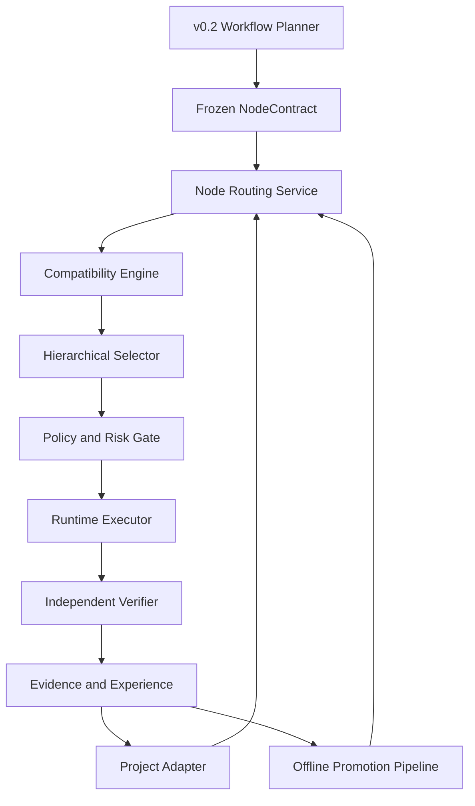
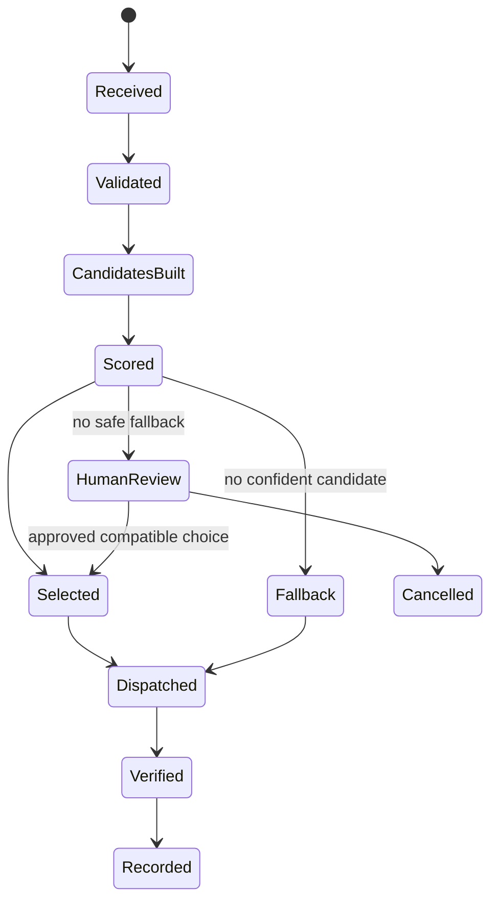

# Accretion v0.4 Software Design Description

## Evidence-Aware Node Configuration Routing

**Document type:** Implementation-ready Software Design Description  
**Status:** Forward implementation specification; locked until v0.1-v0.3 release gates pass  
**Date:** 2026-08-20  
**Depends on:** Accretion v0.1, v0.2, v0.3, and the Golden Direction charter  
**Primary domain:** Software engineering and AI research  
**Explicitly excluded:** Learned graph planning and physical Robotics

---

## 1. Purpose

Accretion v0.4 adds a learned, evidence-governed router that selects a complete execution configuration for every workflow graph node:

\[
a_i=(Runtime, Model, Tools, Skills, VerifierImplementation, Environment)
\]

The router must reduce constrained configuration regret on unseen Software/AI projects while preserving the approved verified-success floor and all policy, risk, permission, and verification invariants.

This SDD specifies how to build v0.4. The separate research protocol specifies how to evaluate the scientific claim.

---

## 2. Normative language

`MUST`, `MUST NOT`, `SHOULD`, `SHOULD NOT`, and `MAY` are normative.

- **Planner:** the governed v0.2 workflow planner.
- **Router:** the v0.4 node configuration router.
- **Producer:** the runtime/configuration that creates the node artifact.
- **Verifier:** an independent implementation of the frozen verification specification.
- **Configuration:** the complete routed execution tuple.
- **Experience:** a permission-preserving record derived from verified execution.
- **Workspace prior:** the team-workspace outcome model.
- **Project adapter:** project-specific residual adaptation over the workspace prior.

---

## 3. Scope

### 3.1 Included

- Typed `NodeContract` and frozen `VerificationSpec`;
- Full node execution configuration schema;
- Capability and environment compatibility engine;
- Hierarchical candidate construction with beam/Pareto pruning;
- Offline outcome prediction and ranking;
- Uncertainty calibration and lower-confidence gates;
- Conservative cold-start routing;
- Shadow routing;
- Guarded contextual-bandit exploration for eligible digital nodes;
- Local and final-run feedback capture;
- Typed failure classification and recovery ownership;
- Team-workspace prior and project adapter;
- Offline router promotion, rollback, and lineage;
- Routing explanation and bounded human override;
- REST/SSE contracts, persistence, observability, frontend, and tests.

### 3.2 Excluded

- Learning workflow topology or graph revisions;
- Joint planner-router training;
- End-to-end reinforcement learning;
- Physical or high-risk online exploration;
- Autonomous modification of policies, permissions, contracts, or verifiers;
- Cross-workspace data pooling by default;
- Robotics execution or cross-embodiment claims;
- Self-modifying plugins, skills, or production code.

---

## 4. Inherited invariants

v0.4 MUST preserve all earlier release invariants:

1. Backend state is authoritative.
2. Claude, Codex, and future runtimes remain replaceable workers.
3. Mutable runs use isolated workspaces/worktrees/containers.
4. Plugins request capabilities; they do not grant authority.
5. Policy and connection resolution occur before credential injection.
6. Agents receive capability references, never raw OAuth or service tokens.
7. Producers cannot self-accept.
8. React Flow is a projection, not workflow authority.
9. Graph revisions are versioned and validated by v0.2.
10. Inconclusive verification pauses rather than silently passing.
11. Experience preserves provenance, visibility, and contradiction state.
12. Physical/high-risk trials require individual approval when Robotics is later enabled.

---

## 5. System context



### 5.1 Separation of responsibilities

| Component | Owns | MUST NOT own |
|---|---|---|
| Workflow Planner | Node decomposition, dependencies, graph revision | Runtime/model/tool selection policy |
| Node Router | Compatible execution configuration selection | Node objective or graph topology |
| Policy Engine | Permission, risk, approval decision | Utility optimization |
| Capability Registry | Normalized capability metadata and bindings | User authorization |
| Runtime Executor | Artifact production | Acceptance decision |
| Verifier Engine | Contract-based verification | Contract mutation |
| Evidence Store | Immutable evidence/provenance | Learned policy activation |
| Promotion Pipeline | Offline candidate evaluation and model versioning | Live self-promotion |
| Human | Contract approval, bounded override, inconclusive resolution | Retroactive evidence mutation |

---

## 6. Component architecture

### 6.1 `NodeRoutingService`

Responsibilities:

- Accept an immutable routing request;
- Resolve the exact model/registry/contract snapshots;
- Request compatible candidates;
- Run hierarchical selection;
- Apply policy and confidence gates;
- Persist the receipt before dispatch;
- Support deterministic replay;
- Return fallback or human-review status when routing is unsafe.

### 6.2 `CompatibilityEngine`

Responsibilities:

- Validate contract schemas and versions;
- Check required capability coverage;
- Check tool/skill/runtime/environment compatibility;
- Validate verifier equivalence to the frozen specification;
- Validate risk and policy preconditions;
- Emit machine-readable rejection reasons;
- Never use semantic similarity to bypass a hard constraint.

### 6.3 `CandidateBuilder`

Responsibilities:

- Construct partial configurations in ordered stages;
- Use capability bindings and provider/runtime projections;
- Retain a bounded beam and Pareto frontier;
- Deduplicate behaviorally equivalent configurations;
- Preserve at least one audited fallback when available.

### 6.4 `OutcomePredictor`

Predicts a vector rather than a single reward:

\[
\hat{\mathbf y}(x,a)=
(\hat Q,\hat C,\hat L,\hat P_{node},\hat P_{run},\hat U)
\]

where \(\hat U\) is predictive uncertainty.

### 6.5 `ProjectAdapter`

- Applies a conservative project residual over the workspace model;
- Starts near zero influence for a new project;
- Increases influence only from compatible resolved outcomes;
- Is versioned independently from the workspace model;
- Cannot modify policy, risk, capability, or verification rules.

### 6.6 `GuardedBandit`

- Operates only after shadow validation;
- Explores only among hard-eligible low-risk digital candidates;
- Logs selection propensity and policy version;
- Uses conservative uncertainty bounds;
- Falls back when evidence or eligibility is insufficient;
- MUST NOT operate on physical/high-risk nodes.

### 6.7 `FeedbackAttributor`

- Preserves local and final-run verification as separate labels;
- Maps downstream outcomes through graph dependencies;
- Records retries, branches, and alternative configurations;
- Produces provisional attribution with confidence;
- Treats unresolved outcomes as censored;
- Does not overwrite raw execution or verifier evidence.

### 6.8 `RouterPromotionService`

- Builds an immutable experience snapshot;
- Trains/evaluates candidate models offline;
- Runs holdout, cohort, calibration, and shadow evaluation;
- Produces a promotion report;
- Activates a model only through an explicit promotion transaction;
- Maintains an immediate rollback target.

---

## 7. Core data contracts

All records MUST include `schema_version`, stable IDs, timestamps, and provenance.

### 7.1 `ObjectiveContractRef`

```yaml
ObjectiveContractRef:
  project_id: uuid
  objective_contract_id: uuid
  version: integer
  content_hash: sha256
  verified_success_floor: number
  utility_profile_id: uuid
  risk_policy_id: uuid
  approved_by: principal_id
  approved_at: timestamp
```

### 7.2 `NodeContract`

```yaml
NodeContract:
  schema_version: accretion.node-contract/v1
  node_contract_id: uuid
  project_id: uuid
  run_graph_id: uuid
  graph_revision: integer
  node_id: string
  execution_instance_id: uuid
  objective_contract_ref: ObjectiveContractRef
  objective: string
  node_type: enum
  input_schema: json_schema
  output_schema: json_schema
  required_capabilities:
    - capability_id: string
      version_range: semver_range
      required_scope: string
  evidence_requirements: [EvidenceRequirement]
  environment_constraints: [EnvironmentConstraint]
  risk_class: LOW | MEDIUM | HIGH | PHYSICAL
  budget:
    maximum_cost: decimal
    maximum_latency_ms: integer
    maximum_attempts: integer
    maximum_tool_calls: integer
  verification_spec: VerificationSpec
  immutable_hash: sha256
  created_at: timestamp
```

### 7.3 `VerificationSpec`

```yaml
VerificationSpec:
  spec_id: uuid
  version: integer
  claims:
    - claim_id: string
      description: string
      criticality: REQUIRED | SUPPORTING
      required_evidence_types: [string]
  metrics:
    - metric_id: string
      operator: GTE | LTE | EQ | CUSTOM
      threshold: number | string
      evaluator_contract: string
  independence:
    producer_cannot_self_accept: true
    separate_context_required: true
    distinct_runtime_preferred: true
  accepted_outcomes: [PASS, FAIL, INCONCLUSIVE]
  content_hash: sha256
```

### 7.4 `RoutingContext`

```yaml
RoutingContext:
  routing_request_id: uuid
  node_contract_ref: uuid
  task_features: object
  graph_features:
    parent_node_types: [string]
    child_node_types: [string]
    depth: integer
    critical_path: boolean
    retry_number: integer
  project_features: object
  available_runtime_snapshot_id: uuid
  capability_registry_snapshot_id: uuid
  connection_availability_snapshot_id: uuid
  policy_snapshot_id: uuid
  workspace_router_version: string
  project_adapter_version: string | null
  historical_experience_refs: [uuid]
  requested_at: timestamp
```

### 7.5 `ExecutionConfiguration`

```yaml
ExecutionConfiguration:
  configuration_id: uuid
  runtime:
    runtime_id: string
    adapter_version: string
  model:
    model_id: string
    provider_id: string
    inference_profile: object
  tools:
    - capability_id: string
      binding_id: string
      binding_version: string
  skills:
    - skill_id: string
      version: string
  verifier:
    implementation_id: string
    version: string
    verification_spec_hash: sha256
  environment:
    environment_profile_id: string
    image_digest: string | null
    workspace_isolation: string
  configuration_hash: sha256
```

### 7.6 `ConfigurationCandidate`

```yaml
ConfigurationCandidate:
  candidate_id: uuid
  configuration: ExecutionConfiguration
  construction_stage: enum
  hard_eligible: boolean
  compatibility_decision_refs: [uuid]
  predicted:
    quality: DistributionEstimate
    cost: DistributionEstimate
    latency: DistributionEstimate
    node_verified_success: DistributionEstimate
    run_verified_success: DistributionEstimate
  uncertainty_score: number
  lower_confidence_success: number
  utility_score: number | null
  pareto_dominated: boolean
  fallback_eligible: boolean
```

### 7.7 `CompatibilityDecision`

```yaml
CompatibilityDecision:
  decision_id: uuid
  subject_type: RUNTIME | MODEL | TOOL | SKILL | VERIFIER | ENVIRONMENT | CONFIGURATION
  subject_ref: string
  status: COMPATIBLE | INCOMPATIBLE | UNKNOWN
  rule_id: string
  rule_version: string
  reason_code: string
  evidence_refs: [uuid]
  evaluated_at: timestamp
```

`UNKNOWN` MUST NOT be treated as compatible for a required constraint.

### 7.8 `RoutingDecisionReceipt`

```yaml
RoutingDecisionReceipt:
  receipt_id: uuid
  routing_request_id: uuid
  node_contract_hash: sha256
  selected_configuration_id: uuid | null
  selected_configuration_hash: sha256 | null
  decision_type: EXPLOIT | EXPLORE | FALLBACK | HUMAN_OVERRIDE | HUMAN_REVIEW_REQUIRED
  selection_propensity: number | null
  predicted_outcomes: object
  uncertainty: object
  candidate_summary_refs: [uuid]
  rejected_candidate_reasons: [object]
  experience_refs: [uuid]
  workspace_router_version: string
  project_adapter_version: string | null
  objective_contract_version: integer
  capability_registry_snapshot_id: uuid
  policy_snapshot_id: uuid
  fallback_configuration_id: uuid | null
  explanation: StructuredExplanation
  created_at: timestamp
```

### 7.9 `VerificationResult`

```yaml
VerificationResult:
  verification_result_id: uuid
  execution_instance_id: uuid
  verification_spec_hash: sha256
  verifier_implementation_id: string
  verifier_version: string
  status: PASS | FAIL | INCONCLUSIVE
  claim_results:
    - claim_id: string
      status: PASS | FAIL | INCONCLUSIVE
      evidence_refs: [uuid]
      coverage: number
      confidence: number | null
      limitations: [string]
  deterministic_evidence_refs: [uuid]
  model_review_refs: [uuid]
  conflict_refs: [uuid]
  signed_at: timestamp
```

### 7.10 `ExperienceRecord`

```yaml
ExperienceRecord:
  experience_id: uuid
  visibility: PROJECT | TEAM_WORKSPACE
  source_project_id: uuid
  source_run_id: uuid
  source_node_execution_id: uuid
  contract_signature: object
  configuration_hash: sha256
  local_verification_status: PASS | FAIL | INCONCLUSIVE
  final_run_status: PASS | FAIL | INCONCLUSIVE | NOT_AVAILABLE
  attribution:
    score: number | null
    confidence: number
    method_version: string
  outcomes:
    quality: number | null
    cost: decimal
    latency_ms: integer
  failure_type: string | null
  contradiction_status: NONE | OPEN | RESOLVED
  evidence_refs: [uuid]
  permission_provenance: object
  eligible_for_learning: boolean
  created_at: timestamp
```

### 7.11 `FailureEvent`

```yaml
FailureEvent:
  failure_event_id: uuid
  execution_instance_id: uuid
  failure_type: TRANSIENT | CONFIGURATION | CAPABILITY | EVIDENCE | VERIFICATION_CONFLICT | STRUCTURAL | POLICY_RISK | OBJECTIVE
  affected_layer: string
  retryable: boolean
  classification_confidence: number
  evidence_refs: [uuid]
  attempted_configuration_hashes: [sha256]
  assigned_owner: RECOVERY_CONTROLLER | ROUTER | CAPABILITY_RESOLVER | EVIDENCE_RESOLVER | PLANNER | HUMAN
  recommended_action: object
```

### 7.12 `RouterModelVersion`

```yaml
RouterModelVersion:
  router_version_id: string
  scope: TEAM_WORKSPACE | PROJECT_ADAPTER
  workspace_id: uuid
  project_id: uuid | null
  algorithm_id: string
  feature_schema_version: string
  training_snapshot_id: uuid
  artifact_digest: sha256
  calibration_artifact_digest: sha256
  parent_version_id: string | null
  status: CANDIDATE | SHADOW | ACTIVE | RETIRED | ROLLED_BACK
  created_at: timestamp
```

### 7.13 `RouterPromotionReport`

```yaml
RouterPromotionReport:
  report_id: uuid
  candidate_version: string
  baseline_version: string
  training_snapshot_id: uuid
  holdout_definition_id: uuid
  primary_metric_result: object
  verified_success_non_regression: object
  false_acceptance_non_regression: object
  calibration_result: object
  cohort_results: [object]
  shadow_result: object
  critical_regressions: [object]
  noncritical_tradeoffs: [object]
  rollback_target: string
  decision: PROMOTE | REJECT | REQUIRE_REVIEW
  approved_by: principal_id | null
  created_at: timestamp
```

---

## 8. Routing lifecycle

### 8.1 Decision state machine



### 8.2 Idempotency

- `routing_request_id` is the idempotency key.
- Repeated requests with identical immutable inputs MUST return the same receipt.
- A changed registry/model/policy/contract snapshot MUST use a new request ID.
- Dispatch MUST reference a persisted receipt.
- Outcome ingestion MUST be idempotent by `verification_result_id`.

### 8.3 Snapshot consistency

Routing MUST use exact snapshots for:

- NodeContract and ObjectiveContract;
- Capability Registry;
- Runtime/model availability;
- Connection availability without token content;
- Policy;
- Workspace router and project adapter;
- Utility profile.

Live changes do not mutate an in-progress routing decision.

---

## 9. Routing algorithms

### 9.1 Candidate construction stages

1. Validate NodeContract.
2. Resolve required capability and environment constraints.
3. Enumerate compatible runtime/model pairs.
4. Bind compatible tool backends and skills.
5. Bind independent verifier implementations.
6. Construct complete configuration tuples.
7. Re-run joint compatibility and policy checks.
8. Predict outcome vector and uncertainty.
9. Apply verified-success lower-confidence gate.
10. Rank feasible candidates by project utility.
11. Select exploration/exploitation/fallback behavior.

### 9.2 Beam and Pareto pruning

- Each stage retains at most `beam_width` partial candidates.
- Hard-incompatible candidates are removed immediately.
- Behaviorally equivalent candidates are canonicalized by configuration signature.
- Partial candidates dominated on quality, cost, latency, and uncertainty MAY be removed.
- At least one audited fallback MUST be retained when compatible.
- Final selection always operates on complete tuples.

### 9.3 Outcome estimation

The predictor MUST emit calibrated distributions or intervals for:

- Local verified success;
- Final-run contribution or success estimate;
- Quality metric vector;
- Cost;
- Latency;
- Epistemic uncertainty.

Training SHOULD begin with interpretable ranking/calibration baselines before complex neural policies.

### 9.4 Cold-start policy

```text
permission filter
→ typed compatibility filter
→ verified experience retrieval
→ similarity/evidence ranking
→ confidence check
→ ranked choice OR audited fallback OR human review
```

Cross-domain evidence receives a capped prior weight and cannot directly enable live routing.

### 9.5 Guarded exploration

Define:

\[
\mathcal A_{safe}(x)=\{a:\text{hard eligible}\land LCB[P(V=1)]\ge\tau\}
\]

Exploration is allowed only when:

```text
risk_class == LOW
AND digital == true
AND reversible == true
AND isolated == true
AND verifier_available == true
AND shadow_policy_passed == true
AND exploration_budget_remaining == true
```

The router MUST log behavior propensity for offline policy evaluation.

### 9.6 Feedback and attribution

Raw signals remain immutable:

- Local claim-level verification;
- Final-run verification;
- Resource consumption;
- Failure taxonomy;
- Graph dependencies;
- Retry and branch histories.

Attribution is a derived, versioned view. Initial v0.4 SHOULD use conservative dependency-aware heuristics and paired retry deltas before advanced causal attribution.

### 9.7 Recovery decision

Configuration failures route back to the router. Structural failures route to the planner. Verification conflicts route to evidence resolution. Policy/risk failures route to human authority.

Automatic recovery continues only when hard caps remain and:

\[
LCB[EVI(a)]>\epsilon
\]

Equivalent failed configurations MUST NOT repeat without new evidence.

---

## 10. Offline training and promotion

### 10.1 Training snapshot

The snapshot MUST record:

- Included experience IDs;
- Permission and visibility proof;
- Contract/feature schema versions;
- Contradiction treatment;
- Deduplication rules;
- Time/provider/model version boundaries;
- Training, validation, and holdout project groups.

### 10.2 Candidate evaluation

Before promotion, evaluate:

- Constrained configuration regret;
- Verified-success lower confidence bound;
- False-acceptance rate;
- Calibration error;
- Cost and latency;
- Cold-start projects;
- Provider/tool version cohorts;
- Failure and contradiction cohorts;
- Critical risk cohorts;
- Shadow-decision agreement and projected utility.

### 10.3 Promotion transaction

Promotion MUST atomically:

1. Mark the candidate `ACTIVE`;
2. Mark the prior active model `RETIRED` but rollback-eligible;
3. Record the promotion report and approver;
4. Update the active workspace pointer;
5. Emit `router.version.promoted`;
6. Preserve the exact rollback target.

Critical correctness/safety regression blocks promotion. Non-critical tradeoffs require explicit bounds and disclosure.

---

## 11. API contracts

All mutating endpoints require authentication, workspace/project authorization, idempotency, and audit metadata.

### 11.1 Routing

| Method | Path | Purpose |
|---|---|---|
| POST | `/api/v1/projects/{project_id}/node-executions/{id}/route` | Create or replay a routing decision |
| GET | `/api/v1/routing-decisions/{receipt_id}` | Retrieve full decision receipt |
| GET | `/api/v1/routing-decisions/{receipt_id}/candidates` | Retrieve compatible/rejected candidate summaries |
| POST | `/api/v1/routing-decisions/{receipt_id}/override` | Select another policy-compatible candidate |
| POST | `/api/v1/routing-decisions/{receipt_id}/cancel` | Cancel before dispatch |

Routing request:

```json
{
  "routing_request_id": "uuid",
  "node_contract_id": "uuid",
  "expected_node_contract_hash": "sha256",
  "mode": "AUTO|SHADOW|BASELINE_ONLY",
  "expected_registry_snapshot_id": "uuid"
}
```

Override request:

```json
{
  "candidate_id": "uuid",
  "reason_code": "EXPERIMENTAL_COMPARISON",
  "reason": "Testing a compatible lower-cost runtime",
  "expected_receipt_version": 1
}
```

The override endpoint MUST reject candidates absent from the receipt's eligible set.

### 11.2 Feedback and experience

| Method | Path | Purpose |
|---|---|---|
| POST | `/api/v1/node-executions/{id}/verification-results` | Ingest independent result |
| POST | `/api/v1/runs/{run_id}/final-verification` | Ingest final-run result |
| GET | `/api/v1/experiences/search` | Retrieve permission-compatible experience |
| GET | `/api/v1/experiences/{id}` | Inspect evidence/provenance |
| POST | `/api/v1/experiences/{id}/resolve-contradiction` | Record authorized resolution |

### 11.3 Router models and promotion

| Method | Path | Purpose |
|---|---|---|
| GET | `/api/v1/router-models` | List workspace/project versions |
| POST | `/api/v1/router-models/train-candidate` | Start offline candidate job |
| GET | `/api/v1/router-promotions/{id}` | Retrieve promotion report |
| POST | `/api/v1/router-promotions/{id}/promote` | Promote an eligible candidate |
| POST | `/api/v1/router-models/{id}/rollback` | Roll back to recorded version |

### 11.4 Shadow evaluation

| Method | Path | Purpose |
|---|---|---|
| POST | `/api/v1/shadow-policies` | Register candidate shadow policy |
| GET | `/api/v1/shadow-policies/{id}/report` | Compare shadow and executed decisions |

---

## 12. Event contracts

SSE is the v0.4 UI transport. Durable events are also written to the event store.

| Event | Required fields |
|---|---|
| `routing.requested` | request, node, contract hash |
| `routing.candidates.built` | counts by rejection/eligibility |
| `routing.decision.created` | receipt, selected config, decision type |
| `routing.override.recorded` | prior choice, new choice, principal, reason |
| `routing.fallback.selected` | fallback and cause |
| `routing.human_review.required` | blocking reasons |
| `verification.result.recorded` | status, claim coverage, conflicts |
| `experience.created` | experience ID and visibility |
| `router.candidate.trained` | candidate and snapshot |
| `router.promotion.evaluated` | report and decision |
| `router.version.promoted` | new, previous, rollback target |
| `router.version.rolled_back` | failed version, restored version, cause |

Events MUST exclude tokens, secrets, hidden provider payloads, and private reasoning.

---

## 13. Persistence model

Recommended persistence remains relational for authoritative state plus object storage for artifacts.

| Table | Key fields |
|---|---|
| `node_contracts` | ID, project, graph revision, hash, JSON, immutable flag |
| `verification_specs` | ID, version, hash, JSON |
| `routing_requests` | ID, node execution, snapshot refs, status |
| `configuration_candidates` | candidate, request, config hash, predictions, eligibility |
| `compatibility_decisions` | candidate, rule, status, reason |
| `routing_receipts` | receipt, selected config, versions, propensity, decision type |
| `routing_overrides` | receipt, principal, candidate, reason |
| `verification_results` | execution, spec hash, status, claim results |
| `experience_records` | source lineage, signatures, outcomes, visibility, eligibility |
| `failure_events` | execution, taxonomy, owner, evidence |
| `router_model_versions` | scope, artifact digest, lineage, status |
| `router_training_snapshots` | included experience manifest and split definition |
| `router_promotion_reports` | candidate/baseline metrics, cohorts, decision |
| `shadow_decisions` | executed receipt, shadow receipt, comparison |

### 13.1 Database constraints

- Contract hash/version tuples are unique.
- One immutable receipt per routing request ID.
- One active workspace router per workspace.
- One active adapter per project/router family.
- Promotion reports are append-only.
- Evidence/experience deletion follows existing retention policy and must not orphan provenance silently.

---

## 14. Security and threat model

### 14.1 Threats

- Candidate configuration requests unauthorized tools;
- Plugin manifest attempts permission expansion;
- Model selects its own permissive verifier;
- Experience leaks private content across projects;
- Poisoned or misverified experience alters the workspace prior;
- Router learns to optimize verifier weaknesses;
- Human override bypasses policy;
- Registry/model versions change between decision and execution;
- Shadow or training pipelines receive secrets;
- Model artifact substitution or rollback tampering.

### 14.2 Controls

- Hard policy and capability checks after routing and immediately before execution;
- Token Broker injection only after authorization;
- VerificationSpec frozen before routing;
- Verifier compatibility and independence checks;
- Permission-preserving experience projections;
- Contradiction and evidence-quality gates;
- Immutable snapshots, hashes, and signed model artifacts;
- Offline promotion with holdout and rollback;
- Override only within eligible candidate set;
- Redaction and structured telemetry schemas;
- Audit logging for every decision, override, promotion, and rollback.

### 14.3 Reward-hacking controls

- Router cannot choose verification thresholds;
- Training uses claim-level coverage and false acceptance, not producer self-ratings;
- Verifier implementation performance is independently calibrated;
- Critical claims cannot be averaged away;
- Suspicious sudden utility gains trigger review;
- Promotion compares failure and contradiction cohorts.

---

## 15. Reliability and recovery

### 15.1 Availability behavior

- Runtime unavailable before dispatch: rebuild candidates from the same snapshots only if availability snapshot revision is explicit; otherwise create a new routing request.
- Runtime unavailable after dispatch: emit transient failure and apply bounded recovery.
- Router model unavailable: use audited deterministic baseline.
- Project adapter unavailable: use workspace prior with reduced confidence.
- Workspace model unavailable: use deterministic baseline.
- Evidence retrieval unavailable: do not fabricate history; use baseline or review.
- Verifier unavailable: do not execute unless another equivalent verifier is already eligible.

### 15.2 Rollback

Router rollback changes new decisions only. Existing receipts and runs remain pinned to their original versions.

### 15.3 Circuit breakers

Automatic exploration is disabled when:

- False-acceptance alert fires;
- Calibration exceeds threshold;
- Critical cohort regression appears;
- Provider/model version drift is unvalidated;
- Verification coverage drops;
- Policy or audit service is unavailable.

---

## 16. Observability

### 16.1 Metrics

- Routing request latency;
- Candidate counts by pruning stage;
- Fallback and human-review rates;
- Exploration rate and budget;
- Node verified-success rate;
- Final-run verified-success rate;
- False-acceptance and inconclusive rates;
- Quality/cost/latency prediction error;
- Calibration error;
- Configuration switching cost;
- Recovery attempts and EVI termination;
- Experience retrieval coverage;
- Cross-domain prior influence;
- Override rate and verified override outcome;
- Workspace/project adapter drift;
- Promotion and rollback counts;
- Constrained configuration regret in benchmark mode.

### 16.2 Traces

Each trace correlates:

```text
project → run → graph revision → node execution
→ routing request → receipt → runtime execution
→ verification → experience → promotion snapshot
```

---

## 17. Experiment Studio requirements

### 17.1 Node routing panel

Display:

- Selected full configuration;
- Decision type and confidence;
- Predicted quality, cost, and latency intervals;
- Verified-success lower bound;
- Relevant experiences and contradiction status;
- Compatible alternatives;
- Rejected candidates with structured reasons;
- Frozen verifier requirement and implementation;
- Router/adapter/registry/contract versions;
- Override control for eligible alternatives.

### 17.2 Shadow mode

Show executed baseline versus shadow recommendation, predicted/observed outcomes, accumulated non-inferiority evidence, and remaining promotion gates.

### 17.3 Router administration

Show model lineage, training snapshot, holdout definition, cohort results, promotion report, active version, and rollback target.

### 17.4 React Flow projection

Each graph node may show:

- Runtime/model badge;
- Tool/skill count;
- Exploit/explore/fallback status;
- Verification status;
- Retry/configuration revision history;
- Cost/latency accumulation;
- Human-review or override marker.

Layout interactions do not change backend routing or graph authority.

---

## 18. Testing strategy

### 18.1 Unit tests

- Schema validation and immutable hashes;
- Compatibility rules and reason codes;
- Candidate canonicalization;
- Beam/Pareto pruning;
- Utility normalization;
- Confidence-bound gates;
- Cold-start fallback;
- Exploration eligibility;
- EVI stopping;
- Failure taxonomy;
- Experience visibility;
- Promotion gate calculations.

### 18.2 Property tests

- Ineligible candidates are never selected;
- Adding an unauthorized capability never increases eligibility;
- Lowering evidence coverage cannot convert inconclusive to pass;
- Replaying an immutable request returns the same receipt;
- Contract/registry/model version changes alter the routing identity;
- Physical/high-risk nodes never enter the bandit;
- Critical regression always blocks promotion.

### 18.3 Integration tests

- Planner to frozen NodeContract;
- Router to capability/policy services;
- Router to Claude/Codex runtimes;
- MCP/plugin binding and Token Broker isolation;
- Executor to independent verifier;
- Local/final feedback to experience;
- Promotion and rollback;
- SSE/UI consistency;
- Workspace/project permission boundaries.

### 18.4 Adversarial tests

- Prompt requests weaker verifier;
- Plugin claims undeclared capability;
- Semantically similar but schema-incompatible experience;
- Poisoned high-score experience;
- Contradictory evidence hidden from retrieval;
- Human override targets rejected candidate;
- Model artifact digest mismatch;
- Provider version changes during routing;
- Repeated equivalent recovery loop;
- Apparent mean improvement hides critical cohort regression.

### 18.5 End-to-end tests

1. New project cold start uses workspace prior/fallback.
2. Known project adapts after verified runs.
3. Low-risk node moves from shadow to guarded exploration.
4. Material verifier conflict becomes inconclusive and pauses.
5. Configuration failure reroutes without graph mutation.
6. Structural failure replans without router authority expansion.
7. Promotion passes and rollback restores prior model.
8. Project-disjoint benchmark produces reproducible receipts and regret.

---

## 19. Implementation milestones

| Milestone | Deliverable | Exit condition |
|---|---|---|
| M0 | Contract and feature freeze | Schemas, hashes, migrations, fixtures approved |
| M1 | Compatibility engine | Hard rules, reason codes, snapshot replay pass |
| M2 | Hierarchical deterministic selector | Complete tuple, pruning, fallback, receipts pass |
| M3 | Experience and feedback pipeline | Local/final outcomes, contradictions, visibility pass |
| M4 | Offline ranker and calibration | Holdout predictions and calibration report pass |
| M5 | Project adapter and cold start | Workspace/project blending and fallback tests pass |
| M6 | Shadow routing | UI/reporting and non-inferiority evidence pass |
| M7 | Guarded bandit | Low-risk gates, propensity logging, circuit breakers pass |
| M8 | Promotion/rollback | Versioned offline pipeline and rollback drill pass |
| M9 | Experiment Studio | Routing, alternatives, override, shadow, admin views pass |
| M10 | Research benchmark integration | Baselines, ablations, artifacts, reproducibility pass |

No milestone may enable online exploration before M0-M6 release gates pass.

---

## 20. Release acceptance criteria

Every criterion is MUST (the specification states no lower priority). The `Owner` column names the
milestone of §19 whose exit proves the criterion; the acceptance harness reads these rows and
gates each milestone by `--stage v0.4-M<n>` (ADR-052). Ids keep the original numbering:
`AC-0NN` became `AC4-M<owner>-0NN`. M0 (the contract freeze) owns no criterion: it lays the
schemas the later milestones prove against.

### Contracts and authority

| ID | Priority | Acceptance criterion | Owner |
|---|---|---|---|
| AC4-M2-001 | MUST | Every routed execution references an immutable NodeContract hash. | M2 |
| AC4-M2-002 | MUST | VerificationSpec is frozen before candidate generation. | M2 |
| AC4-M3-003 | MUST | Producer and verifier cannot be the same acceptance authority. | M3 |
| AC4-M2-004 | MUST | Contract revisions create new versions and do not mutate active runs. | M2 |
| AC4-M1-005 | MUST | Policy/risk/permission gates remain outside the learned router. | M1 |

### Candidate construction

| ID | Priority | Acceptance criterion | Owner |
|---|---|---|---|
| AC4-M1-006 | MUST | All complete tuples pass joint compatibility validation. | M1 |
| AC4-M1-007 | MUST | Unknown required compatibility is treated as ineligible. | M1 |
| AC4-M1-008 | MUST | Candidate rejection exposes stable reason codes. | M1 |
| AC4-M2-009 | MUST | Equivalent configurations are deduplicated. | M2 |
| AC4-M2-010 | MUST | An audited fallback is retained when one exists. | M2 |

### Routing and replay

| ID | Priority | Acceptance criterion | Owner |
|---|---|---|---|
| AC4-M2-011 | MUST | Identical immutable requests replay the same receipt. | M2 |
| AC4-M2-012 | MUST | Every receipt pins router, adapter, contract, registry, and policy versions. | M2 |
| AC4-M2-013 | MUST | Decision receipts exclude secrets and private reasoning. | M2 |
| AC4-M2-014 | MUST | Dispatch cannot occur without a persisted receipt. | M2 |
| AC4-M2-015 | MUST | Human override is restricted to eligible candidates and records a reason. | M2 |

### Learning and exploration

| ID | Priority | Acceptance criterion | Owner |
|---|---|---|---|
| AC4-M4-016 | MUST | Offline ranking precedes any shadow or live learned policy. | M4 |
| AC4-M6-017 | MUST | Shadow decisions never alter execution. | M6 |
| AC4-M7-018 | MUST | Guarded exploration operates only on eligible low-risk digital nodes. | M7 |
| AC4-M7-019 | MUST | Every explored decision records propensity. | M7 |
| AC4-M7-020 | MUST | Circuit breakers disable exploration on safety/calibration alerts. | M7 |
| AC4-M5-021 | MUST | Cross-domain evidence cannot directly enable live routing. | M5 |
| AC4-M2-022 | MUST | Insufficient evidence selects fallback or human review. | M2 |

### Verification and feedback

| ID | Priority | Acceptance criterion | Owner |
|---|---|---|---|
| AC4-M3-023 | MUST | Claim-level evidence coverage is persisted. | M3 |
| AC4-M3-024 | MUST | Inconclusive outcomes are not positive/negative labels. | M3 |
| AC4-M3-025 | MUST | Local and final-run results remain separately queryable. | M3 |
| AC4-M3-026 | MUST | Attribution is versioned and cannot overwrite raw outcomes. | M3 |
| AC4-M3-027 | MUST | Material verifier conflict blocks acceptance until resolved. | M3 |

### Recovery

| ID | Priority | Acceptance criterion | Owner |
|---|---|---|---|
| AC4-M3-028 | MUST | Failure taxonomy deterministically assigns the recovery owner when rules are conclusive. | M3 |
| AC4-M3-029 | MUST | Configuration failures cannot grant planner authority to change policy. | M3 |
| AC4-M3-030 | MUST | Structural failures cannot be disguised as repeated configuration attempts. | M3 |
| AC4-M3-031 | MUST | Hard caps and EVI thresholds stop recovery loops. | M3 |
| AC4-M3-032 | MUST | Equivalent failed configurations do not repeat without new evidence. | M3 |

### Experience and promotion

| ID | Priority | Acceptance criterion | Owner |
|---|---|---|---|
| AC4-M3-033 | MUST | Experience visibility and permission provenance are enforced. | M3 |
| AC4-M3-034 | MUST | Contradictory evidence remains retrievable. | M3 |
| AC4-M8-035 | MUST | Training snapshots are immutable and reproducible. | M8 |
| AC4-M8-036 | MUST | Promotion uses project-disjoint holdout evaluation. | M8 |
| AC4-M8-037 | MUST | Critical correctness/safety regression blocks promotion. | M8 |
| AC4-M8-038 | MUST | Every active router has a tested rollback target. | M8 |
| AC4-M8-039 | MUST | Rollback affects new decisions without rewriting old receipts. | M8 |

### Frontend and observability

| ID | Priority | Acceptance criterion | Owner |
|---|---|---|---|
| AC4-M9-040 | MUST | Node panel shows selected configuration, uncertainty, alternatives, and rejection reasons. | M9 |
| AC4-M6-041 | MUST | Shadow view compares recommendations with executed outcomes. | M6 |
| AC4-M8-042 | MUST | Router lineage and promotion report are inspectable. | M8 |
| AC4-M9-043 | MUST | React Flow remains a projection only. | M9 |
| AC4-M9-044 | MUST | All routing/recovery/promotion events are correlated end to end. | M9 |

### Scientific integration

| ID | Priority | Acceptance criterion | Owner |
|---|---|---|---|
| AC4-M10-045 | MUST | Project-disjoint benchmark split is enforced mechanically. | M10 |
| AC4-M10-046 | MUST | Strongest fixed, deterministic, per-run, model-only, planner-LLM, and oracle baselines run. | M10 |
| AC4-M10-047 | MUST | Constrained configuration regret is reproducible from stored artifacts. | M10 |
| AC4-M10-048 | MUST | Verified-success and false-acceptance gates are reported separately from utility. | M10 |
| AC4-M10-049 | MUST | Required ablations are executable from configuration. | M10 |
| AC4-M10-050 | MUST | Pre-registered effect-size, confidence, and non-regression gates pass before a superiority claim. | M10 |

---
## 21. Architecture decisions

- ADR-041: One graph-node execution instance is one routable action.
- ADR-042: The router selects a complete configuration tuple.
- ADR-043: Configuration construction is hierarchical, but final validation is joint.
- ADR-044: Verification semantics are frozen before routing.
- ADR-045: Outcome models predict a vector, not one permanent scalar reward.
- ADR-046: v0.4 begins offline, then shadow, then guarded bandit.
- ADR-047: Team-workspace prior plus project adapter is the learning scope.
- ADR-048: Cross-domain evidence is a weak prior only.
- ADR-049: Router promotion is an offline, versioned, reversible release.
- ADR-050: Learned graph planning and Robotics are excluded from v0.4.

---

## 22. Open questions with proposed defaults

| ID | Question | Proposed default | Decision deadline |
|---|---|---|---|
| OQ-401 | Initial outcome model? | Gradient-boosted ranking/calibration baseline before neural models | M4 design |
| OQ-402 | Initial bandit? | Conservative contextual bandit over eligible candidates | M7 design |
| OQ-403 | Beam width? | Tune on validation; hard cap by node class | M2 design |
| OQ-404 | Pareto pruning tolerance? | Preserve near-frontier candidates within epsilon | M2 design |
| OQ-405 | Success lower-bound method? | Calibrated conformal or bootstrap interval selected empirically | M4 design |
| OQ-406 | Project-adapter form? | Regularized residual/calibration layer | M5 design |
| OQ-407 | Attribution method? | Dependency heuristic plus paired retry deltas | M3 design |
| OQ-408 | Cross-domain prior cap? | Small fixed cap, tuned only on validation | M5 design |
| OQ-409 | Minimum shadow evidence? | Determined by protocol power/non-inferiority analysis | M6 gate |
| OQ-410 | Exploration budget? | ObjectiveContract percentage plus absolute cap | M7 design |
| OQ-411 | Promotion approval? | Workspace admin/research owner | M8 design |
| OQ-412 | Promotion cadence? | Manual batch initially | M8 design |
| OQ-413 | Critical cohorts? | Correctness, policy, secrets, high-risk, verifier conflict | M8 design |
| OQ-414 | Experience retention? | Follow workspace policy; preserve aggregate lineage | M3 design |
| OQ-415 | Provider/model drift window? | Require revalidation on behaviorally material version change | M4 design |
| OQ-416 | Fallback catalog ownership? | Versioned admin-managed configuration bundles | M2 design |
| OQ-417 | Override reason taxonomy? | Structured code plus optional explanation | M9 design |
| OQ-418 | Model verifier independence score? | Separate context mandatory; different runtime preferred | M0 design |
| OQ-419 | Public benchmark name? | Decide during protocol publication preparation | M10 |
| OQ-420 | v0.5 interface hooks? | Reserve generic embodiment metadata without robotics behavior | M0 design |

---

## 23. Handoff rule

Codex may implement v0.4 only after:

1. Every v0.1, v0.2, and v0.3 release acceptance gate is evidenced on the actual repository baseline;
2. The Golden Direction is accepted;
3. M0 schemas and invariants are reviewed against the cross-release contract registry;
4. The separate research protocol freezes primary metrics and split rules;
5. v0.1-v0.3 interface names and persisted schemas are aligned to Accretion through explicit migrations rather than duplicate contracts;
6. The deterministic router remains an operational fallback and rollback target;
7. No v0.5 Robotics or v0.8 learned-graph requirements are added to the v0.4 backlog.
