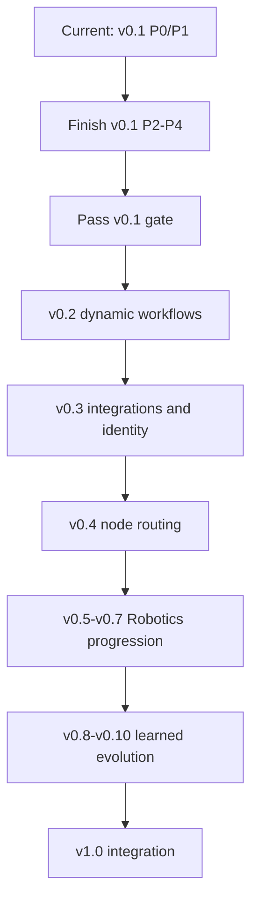

# Accretion Direction and SDD Audit

## v0.4 to v1.0

**Audit date:** 2026-08-20  
**Repository:** [santapong/Accretion](https://github.com/santapong/Accretion/tree/develop)  
**Inspected branch:** `develop`  
**Inspected commit:** `9b5997751011eabb0b2f06ebb4597450f4a3f037`  
**Audit outcome:** Direction preserved, with documentation repairs required and completed in this package

---

## 1. Executive conclusion

Accretion has **not missed its original direction**.

The v0.4-v1.0 line remains a coherent continuation of the Adaptive R&D Meta-Harness:

> Accretion is an evidence-governed adaptive R&D workbench that coordinates replaceable agent runtimes, tools, skills, plugins, verifiers, experiments, and structured experience. It is not a new foundation model, free-form swarm, raw robot controller, or self-authorizing system.

The releases preserve the user's selected Golden Direction:

- hybrid daily tool and research platform;
- primary user: developer-researcher;
- primary near-term domains: Software and AI;
- Robotics later through simulation, individually approved physical trials, and cross-embodiment research;
- rough-goal intake with Accretion structuring the project;
- web Experiment Studio and run dashboard as the primary workspace;
- structured project/runs/evidence as authoritative, with chat as control;
- verified success/failure/contradiction retrieval;
- independent verification and human review when inconclusive;
- one approval per physical/high-risk trial;
- node-level learned execution configuration first;
- learned graph planning only after node routing and Robotics foundations;
- learned systems never design authority.

The audit found no fundamental product-direction reversal. It found four handoff risks, all addressed here:

1. v0.5-v0.7 were charters rather than implementation-grade SDDs;
2. the roadmap said later SDDs should not yet exist, conflicting with the completed forward designs;
3. no central contract owner prevented cross-release schema drift;
4. the GitHub repository is still at v0.1 P0/P1, so Codex could otherwise implement v0.4 prematurely.

## 2. Repository baseline

### 2.1 What exists on `develop`

At the inspected commit, the repository contains:

- Python package version `0.1.0`;
- runtime adapters for Codex, Claude, and a fake runtime;
- typed core contracts such as `TaskEnvelope`, `PromptContract`, `ContextBundle`, `TaskProfile`, and `StrategyDecision`;
- deterministic task profiling and strategy selection;
- run and workspace management;
- persistence and tests;
- frontend application foundations;
- v0.1, v0.2, and v0.3 SDDs under `docs/sdd`.

### 2.2 Current implementation phase

The repository README and run manager indicate:

- P0 runtime feasibility is implemented;
- P1 deterministic planning is implemented;
- P2 loop execution is planned;
- P3 graph/hybrid execution is planned;
- non-`DIRECT` execution is deliberately blocked until its owning phase exists.

This is correct behavior. It protects the architecture from pretending that LOOP, GRAPH, or HYBRID are complete when only the selector exists.

### 2.3 Branch governance

The `develop` branch is protected and requires `backend` and `frontend` status checks. This package does not change repository files, branches, issues, pull requests, or settings.

## 3. Original architecture continuity

The repository v0.1-v0.3 SDDs establish the foundation inherited by this package:

| Foundation | Original owner | v0.4-v1.0 treatment |
|---|---|---|
| Backend-authoritative Meta-Harness | v0.1 | Permanent invariant |
| Claude/Codex as replaceable workers | v0.1 | Preserved through `AgentRuntime` |
| DIRECT/LOOP/GRAPH/HYBRID | v0.1 | Routing/planning learn only within validated structures |
| Isolated mutable workspaces | v0.1 | Preserved |
| Independent verification | v0.1 | Strengthened; false acceptance is critical |
| Capability/MCP foundation | v0.1 | Used by all later domains |
| Dynamic graph synthesis/revision | v0.2 | Baseline for v0.8 learned planning |
| Search and experience | v0.2 | Baseline for verified retrieval and learning |
| Plugins/MCP/SSO/OAuth/Token Broker | v0.3 | Preserved as the integration/identity plane |
| Plugin is not authority | v0.3 | Permanent invariant |
| React Flow as projection | v0.1-v0.3 | Preserved across every release |

No later release turns Canva, MCP, a simulator, or a robot adapter into an `AgentRuntime`. They remain governed capability/adapter integrations.

## 4. Golden Direction traceability

| User decision | Normative realization | Releases |
|---|---|---|
| Hybrid product | Daily workbench plus research platform | All |
| Developer-researcher primary user | Rough-goal intake, ObjectiveContract, Experiment Studio | v0.4, v1.0 |
| Software/AI first | Primary v0.4 and v0.8-v0.10 benchmarks | v0.4, v0.8-v0.10 |
| Robotics later | Simulation → physical → cross-embodiment | v0.5-v0.7 |
| Incorrect acceptance is worst failure | False-acceptance gates, quarantine, rollback | All |
| Inconclusive means human review | Verification hierarchy and pause state | All |
| Individual approval for physical/high-risk trial | Exact single-use approval | v0.6-v1.0 |
| Rough goal becomes structure | ObjectiveContract and workflow | v0.4, v0.8, v1.0 |
| Adaptive branching under uncertainty | Dynamic graph/revision and learned planner | v0.2, v0.8 |
| Learn successes, failures, evidence | Experience retrieval and promotion | v0.4+ |
| Team-workspace prior | Workspace prior plus project adaptation | v0.4+ |
| Preserve contradictions | Contradiction graph and promotion block | All |
| Project/runs authoritative | Backend state; chat/UI compile to commands | All |
| Web Experiment Studio primary | Required UI surfaces | All |
| Reproduce/extend AI paper | v0.4 flagship and v1.0 flagship | v0.4, v1.0 |
| Reduced scale first | ObjectiveContract budgets and expansion gate | v0.4, v1.0 |
| Publishable adaptive orchestration | Node routing, graph planning, joint policy | v0.4, v0.8-v0.9 |
| Select runtime/model/tool per graph node | `ExecutionConfiguration` and router | v0.4 |
| Node and final verification teach router | Attribution and promotion protocol | v0.4 |
| Offline ranking then guarded bandit | Staged router learning | v0.4 |
| Online exploration only low-risk digital | Risk-gated shadow-to-live promotion | v0.4, v0.8-v0.9 |
| Compatibility before transfer | Hard pruning and weak prior | v0.4, v0.7 |
| Verification defined before routing | `NodeContract` + `VerificationSpec` | v0.4+ |
| Failure taxonomy decides recovery owner | Router vs planner vs stop | v0.4+ |
| Hard caps and expected-value threshold | Loop/recovery termination | v0.4+ |
| User-approved utility weights/floor | Versioned `ObjectiveContract` | v0.4+ |
| Offline workspace promotion | Holdout, rollback, cohort gates | v0.4+ |
| Block critical cohort regressions | Promotion invariant | v0.4-v1.0 |
| v0.4 boundary is node configuration only | Graph learning excluded | v0.4 |

Traceability result: every recorded decision has a release owner and no later release intentionally reverses it.

## 5. Release-by-release assessment

### 5.1 v0.4 — Evidence-Aware Node Configuration Routing

**Assessment:** Aligned and implementation-grade.

The SDD correctly limits learning to one graph node's execution configuration. It defines compatibility pruning before ranking, independent verifier selection, offline promotion, guarded low-risk digital exploration, project-specific adaptation, false-acceptance gates, and constrained configuration regret on unseen Software/AI projects.

The research protocol correctly makes the flagship an AI-paper reproduction/extension and requires pre-registration, paired evaluation, effect size, confidence interval, safety non-regression, and ablations.

### 5.2 v0.5 — Robotics Simulation and Embodiment Foundation

**Prior issue:** Only a charter existed.

**Resolution:** Added `Accretion_SDD_v0.5.md` with adapter isolation, typed embodiment/observation/action/safety contracts, deterministic preflight, simulation capability namespace, replay classes, independent verification, APIs/events/persistence, security, benchmark, acceptance criteria, and entry/exit gates.

**Direction check:** Simulation only. No physical capability and no raw agent-to-servo path.

### 5.3 v0.6 — Physical Robotics Safety and Execution

**Prior issue:** Only a charter existed, and standards references needed current-edition verification.

**Resolution:** Added `Accretion_SDD_v0.6.md`. It binds one human approval to one exact trial and preflight hash, atomically consumes approval at arming, separates the safety supervisor and stop path, forbids automatic resume/retry, requires physical evidence typing, and uses current ISO 10218:2025 references for the initial industrial-manipulator profile.

**Direction check:** Accretion coordinates trials; it is not a real-time controller and makes no certification claim.

### 5.4 v0.7 — Cross-Embodiment Transfer

**Prior issue:** Only a charter existed.

**Resolution:** Added `Accretion_SDD_v0.7.md` with hard compatibility gates, soft weak-prior ranking, source success/failure/contradiction retrieval, target adaptation plans, target-specific verification, matched scratch cohorts, negative-transfer events, conservative fallback, lineage, and embodiment-disjoint research gates.

**Direction check:** It does not promise every robot type. It proves bounded transfer across at least two meaningfully different embodiments.

### 5.5 v0.8 — Learned Workflow Planning

**Assessment:** Aligned and technically deep.

It learns graph structure only after node routing is stable. It preserves deterministic graph validation, frozen verification, hard caps, low-risk digital exploration, separated Robotics simulation evaluation, project-disjoint holdouts, and rollback.

### 5.6 v0.9 — Joint Hierarchical Orchestration

**Assessment:** Aligned and technically deep.

It learns coordination between planner and router but does not merge their authority. It includes separate snapshots, credit, evaluation, promotion, and rollback. Physical online exploration remains excluded.

### 5.7 v0.10 — Guarded Capability Evolution

**Assessment:** Aligned, provided the prohibition list remains permanent.

It proposes bounded non-parametric capability changes in a sandbox. Candidate code cannot access production secrets, modify protected control planes, install itself, evaluate itself as sole verifier, promote itself, or change physical safety/approval semantics.

### 5.8 v1.0 — Evidence-Governed R&D Operating System

**Assessment:** Correct integration target.

v1.0 does not imply autonomy, AGI, universal Robotics, perfect verification, or unrestricted self-improvement. Its platform claim is integrated, evidence-governed R&D across Software, AI, and approved Robotics research.

## 6. Issues found and resolutions

| ID | Severity | Finding | Risk | Resolution |
|---|---|---|---|---|
| A-01 | High | v0.5-v0.7 were charters only | Codex lacks implementable contracts/gates | Added full SDDs |
| A-02 | Medium | Roadmap prohibited forward SDDs while they existed | Conflicting document authority | Patched roadmap: forward SDDs allowed but locked |
| A-03 | High | No central cross-release contract owner | Duplicate/incompatible schemas | Added contract registry |
| A-04 | Critical handoff | Repo is v0.1 P0/P1, package starts at v0.4 | Version skipping and broken dependencies | Added read-first handoff and unlock sequence |
| A-05 | High | Physical standards could reference withdrawn editions | Incorrect safety basis | Updated to current ISO 10218:2025 references |
| A-06 | Medium | “Support every robot” could be read literally | Unsafe/unfalsifiable scope | Defined adapter protocol support vs tested concrete adapters |
| A-07 | High | Forward learning releases could be read as authority expansion | Unsafe implementation | Repeated permanent prohibitions and entry gates |
| A-08 | Medium | Later integrated schemas may appear canonical | Schema drift | Registry says owner-release schema wins |

## 7. Risks that remain intentionally open

### 7.1 Empirical uncertainty

The learned router, planner, joint policy, transfer method, and capability-evolution claims are hypotheses until pre-registered evaluation passes. A technically complete SDD is not evidence that a method works.

### 7.2 Concrete technology choices

Simulator, ROS distribution, robot hardware, controller, storage technology, policy learner, offline-evaluation estimator, and deployment topology remain proposed defaults. They must be revalidated at each entry review.

### 7.3 Standards applicability

Robotics standards depend on the exact application, region, environment, robot class, integration, and human interaction. The v0.6 SDD establishes a governance process, not a universal compliance determination.

### 7.4 Verification limits

Independent verification reduces risk but does not guarantee truth. False-acceptance monitoring, contradiction handling, quarantine, and human review remain necessary.

### 7.5 Generalization limits

The v0.4 primary boundary is unseen Software/AI projects with familiar capability types. Robotics and later domains require their own validation. v1.0 must disclose supported, unsupported, and experimental profiles.

## 8. Required implementation sequence

Codex MUST NOT treat the package version list as parallel workstreams. Only one release may be unlocked for active implementation unless an approved ADR demonstrates isolated preparatory work that cannot change runtime authority or shipped behavior.

## 9. Codex-safe interpretation

When this package is provided to Codex:

1. read `00_READ_ME_FIRST.md`;
2. inspect the current `develop` branch and current tests;
3. do not implement v0.4 yet;
4. use the package to preserve architecture while completing v0.1;
5. open an ADR instead of silently resolving cross-document conflict;
6. preserve unrelated user changes;
7. implement only the currently authorized milestone;
8. run backend and frontend checks before any proposed commit;
9. never push, merge, change branch protection, or open a PR without explicit user instruction.

## 10. Final audit verdict

**Direction:** PASS  
**Cross-release coherence after repairs:** PASS as a forward design baseline  
**Ready to implement v0.4 immediately:** NO  
**Ready to hand to Codex as guarded future architecture:** YES  
**Repository mutation performed by this audit:** NO

The Golden Direction remains:

> Software/AI evidence-governed R&D first; Robotics through simulation, approved physical trials, and bounded cross-embodiment transfer; learned orchestration only after stable verified baselines; human authority and deterministic policy outside learned systems.
