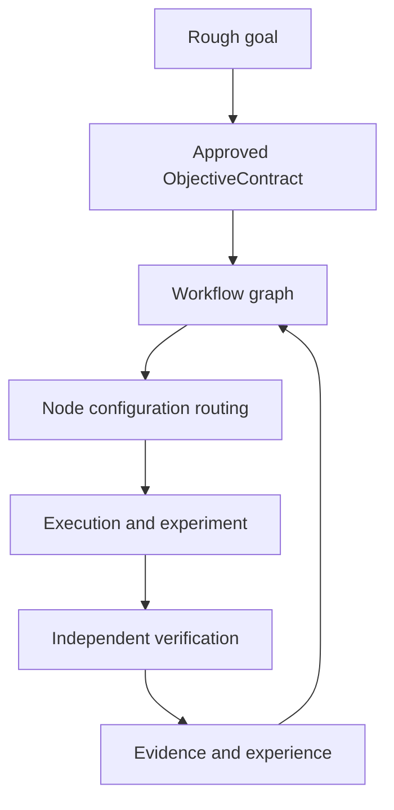
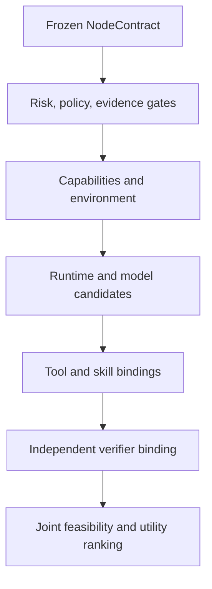

# Accretion — Golden Direction and v0.4 Research Charter

**Status:** Discussion conclusion / architecture direction  
**Date:** 2026-08-20  
**Primary user:** Developer-researcher  
**Near-term domains:** Software engineering and AI research  
**Long-term domain:** Robotics, embodied AI, and cross-embodiment learning

---

## 1. Final conclusion

Accretion should **feel as usable as Codex or Claude Code**, but it should not begin as another foundation-model coding agent.

Its distinctive role is a higher-level **adaptive R&D workbench, meta-harness, and extensible platform** that coordinates runtimes such as Codex and Claude, research tools, plugins, verifiers, experiments, and structured evidence.

The central product promise is:

> Give Accretion a rough research or development goal. It structures the goal into an approved objective, constructs and executes a governed workflow, selects the best compatible execution configuration for every graph node, independently verifies the results, preserves evidence and contradictions, and learns cautiously from verified experience.

The product is therefore a hybrid of:

- A daily developer-researcher tool;
- A web Experiment Studio and run dashboard;
- A provider-neutral orchestration platform;
- A reproducible experimentation and verification system;
- A research substrate for adaptive orchestration;
- A future foundation for Robotics and cross-embodiment research.

Accretion's differentiator is not merely “multiple agents.” It is:

> **Evidence-governed adaptive orchestration across runtimes, models, tools, skills, verifiers, and environments.**

---

## 2. Product identity

### 2.1 What Accretion is

Accretion is an **Adaptive R&D Meta-Harness** for developer-researchers.

It connects research and implementation in one authoritative project system:



### 2.2 What Accretion is not

Accretion is not initially:

- A new foundation model;
- A Codex or Claude replacement runtime;
- A free-form multi-agent swarm;
- An autonomous permission-expansion system;
- A system that accepts model confidence as proof;
- An end-to-end reinforcement-learning controller;
- A real-time robot controller;
- A self-modifying production system.

### 2.3 Primary experience

The authoritative workspace is a structured hierarchy:

```text
Workspace
└── Project
    ├── ObjectiveContract versions
    ├── Workflow and NodeContracts
    ├── Runs and graph revisions
    ├── Artifacts and evidence
    ├── Verifier reports
    ├── Contradictions
    ├── Experiences
    └── Router decisions
```

Chat is a control surface over this structure. The **Web Experiment Studio and Run Dashboard** are the primary daily interface. CLI, IDE, API, and chat are secondary surfaces over the same backend state.

---

## 3. Core user and domain direction

### 3.1 Primary user

The primary user is a **developer-researcher** who needs to move repeatedly between:

- Literature and evidence collection;
- Hypothesis formation;
- Software design and implementation;
- Experiment execution;
- Benchmarking and statistical analysis;
- Verification, reproduction, and extension;
- Documentation and artifact production.

### 3.2 Near-term domain boundary

Accretion begins with **Software and AI** because these tasks are digitally isolatable, comparatively reversible, and suitable for repeated verification and routing benchmarks.

### 3.3 Long-term Robotics direction

Robotics remains a main long-term goal, including:

- Multiple robot types;
- Embodied AI;
- Cross-embodiment learning;
- Simulation-to-real workflows;
- Robot-agnostic task and capability abstractions.

However, Robotics is not part of v0.4. It will later be introduced as a governed pack with embodiment adapters, simulation-first validation, physical approval gates, and lower-level safety controllers. Accretion will orchestrate experiments but will not replace deterministic real-time control and safety layers.

---

## 4. Flagship problem

The first flagship challenge is:

> **Reproduce and extend an AI research paper, beginning at reduced scale and expanding only when the evidence is promising.**

The paper should offer a strong opportunity for a publishable extension. The first targeted contribution is a **new adaptive orchestration method** that decides which runtime, model, tools, skills, verifier implementation, and environment should execute every workflow graph node.

This flagship challenge connects all essential Accretion capabilities:

- Paper and evidence retrieval;
- Claim extraction;
- Reproduction planning;
- Implementation;
- Experiment management;
- Verification and statistics;
- Adaptive routing;
- Reproducible artifact generation.

---

## 5. Release roadmap

| Release | Research/product boundary | Status in this charter |
|---|---|---|
| v0.1 | Observable static meta-harness: runtimes, deterministic architecture selection, static templates, verifiers, React Flow, benchmark logging | Defined and parked |
| v0.2 | Dynamic workflow meta-harness: validated graph synthesis/revision, search, and experience retrieval | Defined and parked |
| v0.3 | Plugin, MCP, connection, identity, SSO/OAuth, token brokerage, and integration governance | Defined and parked |
| **v0.4** | **Evidence-Aware Node Configuration Routing** | **Current research charter** |
| Later | Learned graph planning, broader policy learning, guarded self-evolution | Deferred |
| Robotics track | Simulation, embodiment adapters, physical governance, cross-embodiment transfer | Deferred for a dedicated deep dive |

The boundary is deliberate:

> v0.4 learns how to configure a graph node. It does not jointly learn how to construct the workflow graph.

---

## 6. v0.4 research method

### 6.1 Working name

**Evidence-Aware Node Configuration Routing** (working name).

### 6.2 Routable action

One routable action is one **workflow graph node execution instance**.

The router selects:

\[
a_i =
(Runtime, Model, Tools, Skills, VerifierImplementation, Environment)
\]

Internal calls made by the selected runtime are not separately routed by Accretion unless they appear as explicit graph nodes. This keeps graph planning and node routing as separate research problems.

### 6.3 Node contract

Every node has a typed, versioned contract established before routing:

```yaml
NodeContract:
  objective: string
  input_schema: object
  output_schema: object
  required_capabilities: []
  required_evidence: []
  environment_constraints: []
  risk_class: LOW | MEDIUM | HIGH | PHYSICAL
  budget:
    cost: number
    latency: duration
    attempts: integer
  verification_spec:
    claims: []
    metrics: []
    thresholds: []
    independence_requirements: []
    outcomes: [PASS, FAIL, INCONCLUSIVE]
```

The router may optimize the executor and select a compatible independent verifier implementation. It may not weaken the frozen verification semantics.

### 6.4 Hard feasibility before optimization

The candidate set is constrained first:

\[
\mathcal A_{feasible}(x)=
\left\{
a:
CapabilityMatch(a,x)=1,
Policy(a)=ALLOW,
Risk(a)\le R_{max},
LCB[P(V=1\mid x,a)]\ge \tau
\right\}
\]

Only feasible configurations are ranked by project utility:

\[
U(a\mid p)=
w_q(p)\hat Q(a)
-w_c(p)\hat C(a)
-w_l(p)\hat L(a)
-w_s(p)\hat S(a)
\]

where \(p\) is the approved project profile and \(S\) represents switching or reconfiguration overhead.

Correctness, policy, and risk are not exchangeable for lower cost or latency.

### 6.5 Hierarchical configuration construction

The router avoids a combinatorial flat action space through hierarchical selection with compatibility pruning:



It should retain a small beam or Pareto set of compatible partial configurations rather than make irreversible greedy choices. Complete candidate tuples are jointly validated before execution.

### 6.6 Learning progression

v0.4 uses four guarded stages:

1. **Offline data generation** from repeated benchmark configurations;
2. **Offline outcome ranking** with calibrated uncertainty;
3. **Shadow routing** while a trusted baseline remains authoritative;
4. **Guarded contextual bandit exploration** for eligible low-risk digital nodes.

End-to-end reinforcement learning is excluded.

### 6.7 Hierarchical feedback

The router learns from two distinct signals:

- Local node verification: did the node satisfy its contract?
- Final-run verification: did the whole workflow satisfy the project objective?

An experience record contains:

\[
E_i=
(Context_i, Configuration_i, V_i^{local}, V^{run},
Cost_i, Latency_i, Risk_i, Dependencies_i)
\]

Final-run results are not copied blindly onto every node. Accretion needs dependency-aware attribution using graph structure, retries, branches, alternative configurations, and controlled comparisons.

`INCONCLUSIVE` is a censored outcome. It is neither positive nor negative training reward until resolved.

---

## 7. Experience, cold start, and transfer

### 7.1 Cold start

When verified evidence is insufficient, Accretion:

1. Retrieves permitted verified successes, failures, and contradictions;
2. Applies typed compatibility gates;
3. Ranks remaining evidence by relevance and quality;
4. Uses it only when confidence is adequate;
5. Otherwise executes an audited conservative baseline;
6. Pauses for human review if no safe baseline exists.

### 7.2 Transfer compatibility

Experience transfer requires compatibility across:

- Node contract;
- Required capabilities and versions;
- Environment and data modality;
- Risk regime;
- Verifier semantics and reliability.

Semantic similarity can rank already-compatible evidence but cannot authorize transfer.

### 7.3 Cross-domain evidence

Compatible cross-domain evidence is a **weak prior** and a hypothesis for shadow validation. It cannot directly become live authority.

This rule will later support cross-embodiment research: experience from one simulator or robot may suggest a configuration for another embodiment, but new embodiment-specific evidence is required.

### 7.4 Learning scope

The learned router uses a team-workspace prior plus conservative project adaptation:

\[
\hat{\mathbf y}_p(x,a)=
\hat{\mathbf y}_{workspace}(x,a)
+\alpha_p(x)\Delta_p(x,a)
\]

The local influence \(\alpha_p\) increases only with compatible verified project evidence.

Project experiences enter the shared workspace router only through versioned offline promotion with compatibility checks, holdout evaluation, shadow validation, and a recorded rollback target.

---

## 8. Verification and human authority

### 8.1 Fundamental rule

> **No evidence, no acceptance.**

The most unacceptable failure is accepting an incorrect result as correct.

### 8.2 Verification hierarchy

1. Deterministic checks;
2. Quantitative and statistical evaluation;
3. Independent model review;
4. Cross-verifier corroboration;
5. Human review when automation remains inconclusive.

Model judgment should identify semantic gaps that deterministic tests miss. It must not replace executable evidence when executable evidence is possible.

### 8.3 Conflict behavior

If deterministic checks pass but an independent model verifier identifies a material correctness concern:

1. Mark the result `INCONCLUSIVE`;
2. Map the concern to a specific contract claim;
3. Seek targeted stronger evidence;
4. Resolve to `PASS` or `FAIL` only when supported;
5. Request human review if unresolved.

Weighted averaging cannot erase an uncovered critical claim.

### 8.4 Human approvals

Human authority is proportional to risk:

- Low-risk digital work may proceed under the approved ObjectiveContract and policy;
- Physical or high-risk experiments require approval for every individual trial;
- Inconclusive verification pauses for human review;
- Human approval authorizes an action but does not prove its result correct.

---

## 9. Failure recovery

Accretion diagnoses the failed layer before adapting:

| Failure type | Recovery owner |
|---|---|
| Transient infrastructure | Recovery controller |
| Execution configuration | Node router |
| Capability binding | Capability resolver and router |
| Missing evidence | Evidence-acquisition step |
| Verification conflict | Evidence resolver, then human if unresolved |
| Structural workflow failure | Dynamic planner |
| Policy or risk boundary | Human/policy authority |
| Infeasible or underspecified objective | Human and planner |

The router cannot repeat an equivalent failed configuration without new evidence. The planner cannot disguise an equivalent workflow as a new graph revision.

Automatic recovery continues only while hard resource caps remain and the conservative expected value of another attempt is positive:

\[
EVI(a)=
P_{improve}(a)V_{success}
-Cost(a)-LatencyPenalty(a)-Risk(a)-Switching(a)
\]

Continue only when:

\[
CapsAvailable \land LCB[EVI(a)]>\epsilon
\]

Otherwise Accretion stops, preserves the evidence, and produces a recovery report for the user.

---

## 10. Objective governance

### 10.1 Objective creation

The user supplies a rough goal. Accretion proposes a typed `ObjectiveContract` containing:

- Goal and required claims;
- Verified-success floor;
- Quality metrics;
- Quality, cost, and latency utility profile;
- Resource caps;
- Evidence and statistical requirements;
- Risk classification;
- Exploration boundary;
- Approval and stopping rules.

The developer-researcher reviews and approves it before execution.

### 10.2 Objective revisions

Accretion may propose a revision after new evidence, but it must include a versioned diff and impact analysis. The revision affects new runs only after user approval.

Existing runs remain pinned to their original contract. Accretion may compute a derived re-evaluation under a later contract, but it cannot overwrite the historical result.

---

## 11. Explainability and control

Every routing action produces a structured `RoutingDecisionReceipt` containing:

- Node and contract version;
- Selected complete configuration;
- Predicted quality, cost, latency, and uncertainty;
- Relevant verified experiences;
- Compatible alternatives;
- Rejection reasons;
- Exploration, exploitation, or fallback status;
- Router, project-adapter, registry, and objective versions;
- Final verified outcome.

The developer-researcher can inspect the choice and override it with another policy-compatible configuration. The reason is recorded.

An override cannot bypass permissions, risk, credentials, approval gates, or frozen verification requirements. It becomes learning evidence only after the executed configuration is independently verified.

---

## 12. v0.4 scientific hypothesis

### 12.1 Primary hypothesis

> On unseen Software/AI projects using familiar capability types, Evidence-Aware Node Configuration Routing reduces constrained configuration regret relative to the strongest routing baseline while preserving the required verified-success floor and critical safety behavior.

For node \(i\):

\[
Regret_i=U(a_i^{oracle})-U(a_i^{selected})
\]

The oracle is the best observed valid configuration evaluated post hoc during benchmarking. It is not available to the live router.

### 12.2 Generalization boundary

The v0.4 test set contains unseen Software/AI projects. Capability types may be familiar, but repositories, project lineages, objectives, graphs, environments, and compositions must be excluded from training.

Zero-shot workspace-prior performance and within-project adaptation performance must be reported separately.

### 12.3 Baselines

The evaluation includes:

1. Strongest fixed configuration;
2. Cheapest valid configuration;
3. Deterministic v0.1 routing;
4. Performance-aware pre-learning routing;
5. Per-run routing;
6. Model-only node routing;
7. Planning-LLM configuration selection;
8. Offline ranker without online exploration;
9. Full guarded Accretion router;
10. Post-hoc oracle.

### 12.4 Primary and safety endpoints

Primary endpoint:

- Constrained configuration regret on unseen projects.

Safety and validity gates:

- Verified-success lower confidence bound meets the contract floor;
- No critical false-acceptance regression;
- No critical safety, permission, or cohort regression;
- Inconclusive outcomes are reported rather than hidden.

Secondary endpoints:

- Quality;
- Total cost;
- End-to-end latency;
- Recovery overhead;
- Calibration;
- Cold-start performance;
- Cross-project adaptation speed.

### 12.5 Scientific release gate

A v0.4 improvement claim requires:

- Pre-registered hypotheses, metrics, exclusions, and analysis;
- Project-disjoint paired evaluation;
- Repeated stochastic trials;
- Power analysis for sample size;
- Confidence intervals;
- A predeclared minimum meaningful effect size;
- Safety and correctness non-regression;
- Cohort-level analysis;
- Complete ablations;
- Reproducible artifacts and failure reporting.

A p-value alone is insufficient.

### 12.6 Required ablations

Remove each of the following independently:

- Hierarchical configuration construction;
- Compatibility pruning;
- Verified-experience retrieval;
- Project-specific adaptation;
- Local node feedback;
- Final-run feedback;
- Guarded exploration;
- Independent verification.

---

## 13. Router promotion governance

Candidate workspace routers are trained and evaluated offline. A promotion report must include:

- Training and holdout snapshots;
- Compatibility and permission filtering;
- Outcome and calibration changes;
- False-acceptance changes;
- Quality, cost, and latency effects;
- Cohort regressions;
- Shadow-validation result;
- Rollback target.

Critical correctness and safety regressions block promotion. Bounded non-critical cost or latency tradeoffs may be accepted only when statistically supported, explicitly disclosed, and compatible with the affected project profiles.

If a candidate helps one cohort but harms another, Accretion should prefer a cohort- or project-specific adapter over a global promotion.

---

## 14. v0.4 scope

### Included

- Typed `NodeContract` and frozen `VerificationSpec`;
- Hierarchical full-configuration routing;
- Compatibility pruning and joint validation;
- Offline outcome/ranking models;
- Calibrated uncertainty;
- Shadow routing;
- Guarded contextual bandit for low-risk digital nodes;
- Local and final-run feedback;
- Conservative cold start;
- Typed experience transfer;
- Team-workspace prior and project adapter;
- Versioned offline promotion and rollback;
- Failure taxonomy and bounded recovery;
- RoutingDecisionReceipt and compatible human override;
- Project-disjoint benchmark, baselines, ablations, and release gate;
- Experiment Studio views for routing decisions and evidence.

### Explicitly excluded

- Learned workflow graph construction;
- Joint training of planner and node router;
- End-to-end reinforcement learning;
- Autonomous modification of permissions or verification rules;
- Cross-workspace global training by default;
- Physical Robotics routing;
- Cross-embodiment performance claims;
- Autonomous physical/high-risk experimentation;
- Self-modifying production plugins or code;
- Broad self-evolution claims.

---

## 15. v0.4 acceptance gates

v0.4 is complete only when all of the following hold:

1. Every routed node is bound to a versioned NodeContract.
2. Verification requirements are frozen before executor selection.
3. The producer cannot self-accept.
4. Every selected configuration passes capability, permission, environment, and risk validation.
5. Hierarchical routing produces a jointly compatible complete tuple.
6. Every decision emits a reproducible RoutingDecisionReceipt.
7. Cold-start behavior falls back safely when evidence is insufficient.
8. Cross-domain evidence cannot directly become live authority.
9. Online exploration is limited to eligible low-risk digital nodes after shadow validation.
10. Hard caps and expected-value stopping prevent infinite recovery.
11. Router and planner recovery responsibilities follow the typed failure taxonomy.
12. `INCONCLUSIVE` cannot be recorded as success or ordinary failure.
13. Human overrides cannot bypass policy or verification requirements.
14. Workspace and project router versions are pinned to every run.
15. Candidate router promotion is offline, versioned, evaluated, and reversible.
16. Critical correctness and safety cohort regressions block promotion.
17. The project-disjoint benchmark includes the strongest required baselines.
18. The primary regret improvement satisfies the pre-registered confidence and effect-size gate.
19. The verified-success floor and false-acceptance non-regression gates pass.
20. All required ablations and reproducibility artifacts are complete.

---

## 16. Golden Principles

1. **No evidence, no acceptance.**
2. Inconclusive verification pauses for human review; approval is not verification.
3. Human authority is proportional to risk; every physical or high-risk trial requires individual approval.
4. A rough goal becomes an approved, typed ObjectiveContract before execution.
5. Branch adaptively when uncertainty is high; do not use multi-agent branching by default.
6. Retrieve relevant verified successes, failures, and evidence before policy learning.
7. Experience is team-workspace shared by default while permissions, privacy, and secrets remain preserved.
8. Contradictory evidence is preserved and explicitly resolved, never overwritten.
9. Structured projects and runs are authoritative; chat is a control surface.
10. The Web Experiment Studio and Run Dashboard are the primary daily workspace.
11. The first flagship challenge is reproducing and extending an AI research paper.
12. Begin reduced-scale and expand only when evidence is promising.
13. The first publishable contribution targets a new adaptive orchestration method.
14. Routing initially selects the execution configuration for every agent action represented as a graph node.
15. A routable action is a workflow graph node; graph planning and node routing remain separate.
16. The router learns from both node-level and final-run verification.
17. Begin with offline ranking, then shadow evaluation, then a guarded contextual bandit.
18. Online exploration begins only on low-risk digital nodes after shadow validation.
19. Cold start retrieves compatible evidence, then uses an audited conservative baseline.
20. Experience transfer requires typed contract, capability, environment, risk, and verifier compatibility.
21. Compatible cross-domain experience is a weak prior that must pass shadow validation.
22. Construct configurations hierarchically with compatibility pruning and final joint validation.
23. Define verification in the NodeContract before routing and bind an independent compatible verifier.
24. Prefer deterministic evidence, then model judgment, then human review when inconclusive.
25. Material verifier conflicts remain inconclusive until resolved by stronger evidence or a human.
26. The router handles configuration failures; the planner handles structural failures under a typed taxonomy.
27. Hard resource caps and conservative expected-value thresholds terminate adaptation loops.
28. Correctness and safety are hard constraints; quality, cost, and latency use project-defined utility.
29. Accretion proposes the ObjectiveContract from the rough goal; the user reviews and approves it.
30. Objective changes are versioned proposals with impact analysis and approval before affecting new runs.
31. Learning uses a team-workspace prior with conservative project-specific adaptation.
32. Project evidence reaches the shared router only through versioned offline promotion, holdout evaluation, and rollback validation.
33. Critical correctness or safety regressions block promotion; bounded non-critical tradeoffs must be disclosed.
34. v0.4 must generalize to unseen Software/AI projects using familiar capability types.
35. The primary claim is lower constrained configuration regret while preserving the verified-success floor.
36. Improvement requires pre-registration, paired evaluation, confidence intervals, minimum effect size, safety non-regression, and ablations.
37. Users may inspect and override among policy-compatible configurations, with the reason recorded.
38. v0.4 learns node-level execution configuration only; learned graph planning and Robotics are deferred.

---

## 17. Deferred open questions

These do not block the Golden Direction, but they must be resolved during the v0.4 SDD and experiment protocol:

1. Exact benchmark task families and project count;
2. The minimum meaningful regret reduction \(\delta_{min}\);
3. Verified-success threshold defaults and non-inferiority margins;
4. The initial offline ranking model and contextual-bandit algorithm;
5. The final local/global credit-assignment method;
6. Beam width and pruning strategy for hierarchical configuration search;
7. Verifier calibration and independence scoring;
8. Experience-compatibility ontology and version rules;
9. Workspace router promotion cadence;
10. Provider, model, tool, and skill matrix used in the first experiment;
11. Benchmark name and public dataset format;
12. Detailed Experiment Studio interaction design;
13. The later learned graph-planning research release;
14. Robotics Pack safety architecture and standards;
15. Cross-embodiment task, observation, action, and verifier interfaces.

---

## 18. Golden one-sentence direction

> **Accretion is an evidence-governed developer-researcher workbench that converts rough goals into reproducible, verified workflows and learns—first at the graph-node configuration level—how to select the best compatible runtime, model, tools, skills, verifier, and environment under project-specific quality, cost, latency, risk, and human-authority constraints.**

---

## 19. Immediate next work

The next activity is no longer broad ideation. It should be a focused **Accretion v0.4 SDD and research protocol** built from this charter:

1. Freeze the v0.4 data contracts;
2. Specify the outcome models and hierarchical router;
3. Define the benchmark projects and baselines;
4. Pre-register the statistical protocol;
5. Define the Experiment Studio routing and evidence views;
6. Produce milestones, acceptance tests, and implementation sequencing;
7. Keep learned graph planning and Robotics outside the v0.4 implementation backlog.

The separate Robotics deep dive should begin only after the Software/AI node-routing method and its evidence pipeline are stable enough to serve as a trustworthy prior rather than an unverified assumption.
