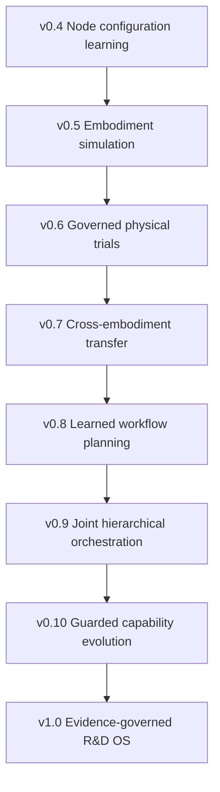
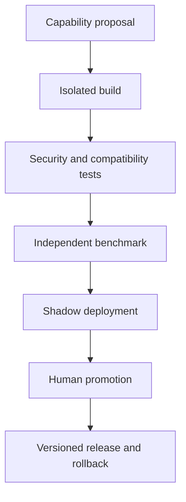

# Accretion Evidence-Gated Roadmap: v0.6 to v1.0

**Document type:** Research and product roadmap  
**Status:** Proposed direction derived from the Golden Direction  
**Date:** 2026-08-20  
**Rule:** Versions are unlocked by evidence gates, not calendar dates

---

## 1. Roadmap thesis

Accretion should progress from verified digital orchestration to simulation, governed physical execution, cross-embodiment transfer, learned workflow planning, and finally guarded capability evolution.

The roadmap does not promise universal Robotics, AGI, ASI, or unrestricted self-improvement. Each release adds one new source of authority only after the prior release demonstrates reproducible benefit and safety non-regression.



---

## 2. Release map

| Release | Name | New research authority | Primary claim |
|---|---|---|---|
| v0.4 | Evidence-Aware Node Configuration Routing | Learns compatible node execution configuration | Lower constrained routing regret on unseen Software/AI projects |
| v0.5 | Robotics Simulation and Embodiment Foundation | Runs governed simulation episodes across adapters | Reproducible shared task contracts across simulated embodiments |
| **v0.6** | **Physical Robotics Safety and Execution** | Executes individually approved physical trials | Reproducible physical execution under independent safety supervision |
| **v0.7** | **Cross-Embodiment Transfer** | Uses source embodiment evidence as guarded target prior | Reduced target adaptation effort without correctness/safety regression |
| v0.8 | Learned Workflow Planning | Learns graph topology and revision policy in digital/simulation domains | Lower architecture regret than governed rule/LLM planning |
| v0.9 | Joint Hierarchical Orchestration | Coordinates graph policy and node configuration policy | Lower total orchestration regret without unsafe coupling |
| v0.10 | Guarded Capability Evolution | Proposes candidate skills/adapters/verifiers in sandbox | Verified capability improvement through human-governed promotion |
| v1.0 | Accretion Research OS | Stable multi-domain evidence-governed platform | Reliable Software, AI, and Robotics R&D workflows |

---

## 3. Permanent invariants across all releases

1. No evidence, no acceptance.
2. Human approval is not verification.
3. Physical/high-risk trials require individual approval.
4. Policies, permissions, credentials, and safety limits remain outside learned authority.
5. Producers cannot self-accept.
6. Contradictions are preserved and resolved explicitly.
7. Every decision and artifact is versioned and reproducible.
8. Cross-domain or cross-embodiment evidence begins as a weak prior.
9. Online exploration is risk-bounded and never begins on physical systems.
10. Real-time control and emergency safety remain below LLM/orchestration layers.
11. Learned policies are promoted offline, evaluated, monitored, and reversible.
12. A later version cannot silently weaken an earlier verification or safety gate.

---

## 4. v0.6 — Physical Robotics Safety and Execution

### Objective

Enable Accretion to conduct reproducible physical manipulation experiments through explicit trial contracts, simulation preflight, human approval, independent safety supervision, lower-level robot controllers, and sensor-based verification.

### Flagship

A 6-DOF arm and webcam perform an individually approved reach and pick-and-place task after calibration and simulation preflight.

### New components

- `PhysicalTrialContract`;
- Physical Robot Adapter;
- Digital Twin and preflight comparison;
- Sensor/robot calibration registry;
- Trial approval queue;
- Independent real-time safety supervisor integration;
- Emergency-stop and watchdog evidence;
- Physical episode and incident records;
- Sensor-based physical verifier;
- Sim-to-real discrepancy model;
- Physical Experiment Studio.

### Explicit exclusions

- Physical contextual-bandit exploration;
- Autonomous trial approval;
- Universal robot driver claims;
- Learned real-time safety;
- Direct raw LLM actuator commands;
- Cross-embodiment superiority claim.

### Unlock gate for v0.7

v0.6 must demonstrate:

- No unauthorized physical actuation;
- Individual-trial approval enforcement;
- Safety supervisor and emergency-stop drills;
- Reproducible physical episode evidence;
- Verified task outcomes across repeated trials;
- Calibrated sim-to-real discrepancy reporting;
- Incident and near-miss audit completeness;
- Independent verification with no critical false-acceptance regression.

---

## 5. v0.7 — Cross-Embodiment Transfer

### Objective

Test whether compatible verified evidence from a source embodiment reduces target-embodiment adaptation effort while preserving target task correctness and safety.

### Transfer object

- Task and capability contract;
- Observation and action semantics;
- Constraints and safety claims;
- Verification specification;
- Configuration successes and failures;
- Uncertainty and contradiction records;
- Adaptation and calibration evidence.

### New components

- Embodiment compatibility engine;
- Task/capability ontology;
- Morphology/dynamics descriptor;
- Observation/action mapping quality model;
- Transfer candidate ranker;
- Negative-transfer detector;
- Target adaptation controller;
- Cross-embodiment benchmark and dashboard;
- Physical/simulation transfer evidence ledger.

### Primary research claim

For target embodiment B:

\[
N_B^{transfer}<N_B^{scratch}
\]

or equivalently lower adaptation cost/regret, subject to:

\[
LCB[P(V_B=1)]\ge\tau_B
\]

and no critical safety regression.

### Explicit exclusions

- Universal embodiment representation claim;
- Automatic sim-to-real permission;
- Unbounded physical adaptation;
- Transfer based only on text similarity;
- Treating source evidence as target evidence before validation.

### Unlock gate for v0.8

- Project/embodiment-disjoint evaluation;
- Significant adaptation benefit over scratch baseline;
- Negative-transfer detection and fallback;
- Correctness and safety non-regression;
- Reproducible task/adapter/verifier mapping;
- Source evidence remains distinguishable from target evidence;
- At least two meaningfully different embodiments.

---

## 6. v0.8 — Learned Workflow Planning

### Status

Forward design baseline. The technical SDD may document contracts, authority boundaries, tests, and provisional defaults before v0.7 evidence exists, but it MUST NOT be treated as an implementation authorization. Its entry conditions and experimental parameters remain locked until the v0.7 release gate supplies the required evidence.

### Objective

Learn graph-level decisions while keeping the v0.4 node router fixed during initial causal evaluation.

### Graph actions

- Select `DIRECT`, `LOOP`, `GRAPH`, or `HYBRID`;
- Select/compose workflow templates;
- Add/remove/reorder nodes;
- Create/prune branches;
- Insert evidence or verification nodes;
- Select loop termination;
- Propose graph revision after structural failure.

### Learning path

```text
verified graph trajectories
→ offline graph ranking/imitation
→ project-disjoint holdout
→ shadow planner
→ guarded digital/simulation planning
```

### Primary metric

\[
ArchitectureRegret=U(G^{oracle})-U(G^{selected})
\]

### Exclusions

- Joint planner/router optimization;
- Physical live graph exploration;
- Learned permissions or verifier semantics;
- End-to-end RL as the first implementation.

### Unlock gate for v0.9

- Lower architecture regret;
- No verified-success or safety regression;
- Bounded graph revision and loop behavior;
- Structural credit assignment evidence;
- Shadow-to-live promotion and rollback;
- Planner decisions are inspectable and reproducible.

---

## 7. v0.9 — Joint Hierarchical Orchestration

### Status

Provisional research theme.

### Objective

Coordinate the graph planner and node configuration router without collapsing them into one opaque end-to-end policy.

\[
\pi_G(G\mid Task,State)
\]

\[
\pi_N(a_i\mid Node_i,G,State)
\]

Joint optimization must preserve separate contracts, receipts, models, and rollback boundaries.

### Research questions

- When does topology choice change the best node configuration?
- When does node configuration availability justify graph revision?
- Can hierarchical credit assignment prevent planner-router blame shifting?
- Does joint optimization improve total utility beyond separately optimized policies?

### Primary metric

Total orchestration regret compared with:

- Fixed planner plus learned node router;
- Learned planner plus fixed node router;
- Independently learned planner and router;
- Post-hoc hierarchical oracle where feasible.

### Unlock gate for v0.10

- Joint improvement beyond independent policies;
- Stable credit assignment;
- No recovery thrashing;
- Separate rollback of planner and router;
- Critical safety/correctness non-regression;
- No autonomous policy or permission expansion.

---

## 8. v0.10 — Guarded Capability Evolution

### Status

Long-term provisional research theme. This is not unrestricted self-evolution.

### Objective

Allow Accretion to propose candidate improvements to its capability layer while retaining sandboxing, independent evaluation, and human promotion.

### Candidate artifacts

- Skills;
- Plugin manifests;
- MCP/API bindings;
- Robot adapters;
- Verifier implementations;
- Workflow templates;
- Benchmark tasks;
- Documentation and compatibility rules.

### Promotion flow



### Permanent prohibition

Accretion MUST NOT write, install, authorize, and promote its own consequential capability without independent controls and human authority.

### Unlock gate for v1.0

- Candidate capability improves predeclared metrics;
- Security, policy, and compatibility gates pass;
- Promotion and rollback are reproducible;
- No permission expansion;
- Negative results and rejected proposals remain auditable;
- Multi-domain integration remains stable.

---

## 9. v1.0 — Evidence-Governed R&D Operating System

### Product definition

Accretion v1.0 is a stable platform for structuring, executing, verifying, reproducing, and improving Software, AI, and Robotics R&D across heterogeneous runtimes and embodiments.

### v1.0 does mean

- Mature structured project/run workspace;
- Provider-neutral runtimes and capabilities;
- Evidence and contradiction governance;
- Learned node routing;
- Simulation and governed physical Robotics;
- Guarded cross-embodiment transfer;
- Learned workflow planning where validated;
- Versioned, human-governed capability evolution;
- Reproducible research artifacts and benchmarks.

### v1.0 does not mean

- AGI or ASI;
- Universal robot control;
- Autonomous physical experimentation;
- Perfect verification;
- Unrestricted self-modification;
- A guarantee of scientific novelty;
- Elimination of human research judgment.

---

## 10. Cross-release benchmark evolution

| Release | Primary regret/efficiency metric | Hard gate |
|---|---|---|
| v0.4 | Node configuration regret | Verified-success and false-acceptance non-regression |
| v0.5 | Embodiment adapter/task reproducibility | Simulation safety/evidence completeness |
| v0.6 | Physical trial utility and sim-to-real discrepancy | Individual approval and physical safety |
| v0.7 | Adaptation/transfer regret | Target correctness and safety non-regression |
| v0.8 | Architecture regret | Bounded validated graph behavior |
| v0.9 | Total hierarchical orchestration regret | Stable separated authority |
| v0.10 | Capability improvement regret | Security and human promotion |
| v1.0 | Multi-domain verified objective completion | All permanent invariants |

---

## 11. Version planning rule

Only the next one or two releases may become active implementation specifications. Later releases may have deep forward SDDs when this is useful for architectural continuity, threat analysis, contract ownership, and research planning.

At the current point:

- v0.4 has a technical SDD and research protocol;
- v0.5-v0.7 have implementation-grade forward SDDs plus non-normative research charters;
- v0.8-v1.0 have implementation-grade forward SDDs;
- every forward SDD contains explicit entry conditions and remains locked until the preceding release gate passes;
- empirical thresholds, concrete technologies, hardware profiles, and experimental parameters are revalidated and versioned at entry review;
- only the SDD for the currently unlocked release may be converted into an implementation backlog.

This rule preserves cross-release technical continuity without creating false implementation authority. The Golden Direction, permanent invariants, release gates, and approved current SDD always take precedence over speculative details in a locked forward SDD.
