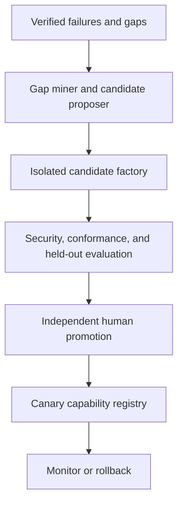

# Accretion v0.10 Software Design Description

## Guarded Capability Evolution

**Document status:** Forward technical design baseline  
**Implementation authority:** Locked until the v0.9 exit gate passes  
**Primary domains:** Software engineering and AI research  
**Robotics boundary:** Adapters and simulation skills may be proposed; physical activation requires separate safety approval  
**Core prohibition:** Accretion cannot install, authorize, evaluate, and promote its own consequential change without independent controls and human authority

---

## 1. Purpose

Accretion v0.10 allows the system to propose bounded improvements to its non-parametric capability layer—skills, prompts, adapters, tool bindings, workflow operators, environment recipes, and verifier implementations—when verified failure evidence shows that planning and routing alone cannot meet an approved objective.

This is not unrestricted self-evolution. The active system remains immutable during proposal. Every candidate is built in a sandbox, tested against frozen contracts and held-out cohorts, reviewed independently, promoted by a human, deployed through a canary, and immediately reversible.

The release tests:

> Can evidence-driven, sandboxed capability proposals reduce time-to-close verified capability gaps and improve held-out objective completion relative to human-only capability maintenance, without critical correctness, security, safety, or authority regressions?

## 2. Relationship to research

STOP shows that a model-infused scaffolding program can propose improvements to scaffolding code and explicitly studies sandbox-bypass concerns. Darwin Gödel Machine evaluates self-modified coding agents empirically with sandboxing and human oversight. Self-Harness mines verifier-grounded failures, proposes bounded harness edits, and regression-tests held-in and held-out tasks.

Accretion adopts the evidence-to-proposal-to-regression-test pattern, but narrows the writable surface, requires independent verifier and security review, separates candidate build from active execution, prevents self-authorization, and retains mandatory human promotion.

## 3. Research boundary

### 3.1 In scope

- Capability-gap detection from verified traces;
- Failure clustering and contradiction-aware hypothesis generation;
- Bounded candidate change specifications;
- Skills, prompt modules, workflow operators, tool/MCP adapters, environment recipes, and verifier implementations;
- Ephemeral sandbox build and execution;
- Static, dependency, secret, policy, and supply-chain analysis;
- Contract conformance and adversarial testing;
- Held-in, held-out, cross-project, and critical-cohort evaluation;
- Independent human review and approval;
- Canary, monitoring, rollback, and lineage;
- Research comparison with human-only and external-optimizer baselines.

### 3.2 Forbidden in v0.10

- Autonomous permission, role, OAuth-scope, credential, or policy changes;
- Modification of the Token Broker or secret store by a candidate;
- Modification of the promotion controller or immutable audit trail;
- Modification of ObjectiveContract approval semantics;
- Modification of physical safety envelopes, emergency-stop paths, or individual-trial approval rules;
- Self-approval or sole self-verification;
- Direct mutation of the active deployment;
- Unreviewed installation from public registries;
- Model-weight recursive self-improvement;
- Open-ended internet deployment of generated services;
- Claims of general or safe recursive self-improvement.

## 4. Entry gates

v0.10 implementation requires:

1. v0.9 passes total orchestration-regret and safety gates;
2. Planner and router failure ownership is reliable enough to identify genuine capability gaps;
3. Capability Registry, Plugin Registry, MCP Gateway, Policy Engine, Token Broker, and audit schemas are stable;
4. Every active capability has a manifest, owner, provenance, version, risk class, contracts, and rollback target;
5. Sandboxes block access to production credentials and control planes;
6. Held-out and critical-regression suites exist for at least one candidate class;
7. Human promotion roles and separation-of-duty policy are configured;
8. Incident response and rollback drills pass.

## 5. Permanent invariants

1. Incorrect acceptance remains the critical failure.
2. Proposal is not authority.
3. Installation is not authorization.
4. Approval is not verification.
5. A candidate cannot evaluate itself as the sole acceptance authority.
6. A proposer cannot promote its own candidate.
7. Candidate code never receives production secrets during evaluation.
8. Verifier semantics remain frozen; a new implementation proves equivalence before use.
9. Critical cohorts use hard non-regression gates.
10. Failed and rejected candidates remain in an immutable lineage.
11. Contradictory evidence is preserved.
12. Active versions are immutable and content-addressed.
13. Every promotion has a tested rollback.
14. Physical/high-risk capability activation requires separate safety review and per-trial approval.
15. No release may silently weaken an earlier gate.

## 6. Capability-change taxonomy

| Class | Candidate type | Example | Default promotion authority |
|---|---|---|---|
| C0 | Documentation/description | Better capability metadata | Maintainer review |
| C1 | Prompt/skill logic with no new side effect | Citation extraction skill | Research owner |
| C2 | Read-only adapter or tool binding | New literature-search adapter | Research + security owner |
| C3 | Consequential tool/workflow operator | Repository write adapter | Research + security + workspace owner |
| C4 | Verifier implementation | Independent test verifier | Verification owner + research owner |
| C5 | Robotics simulation adapter | New simulator embodiment adapter | Robotics + safety owner |
| C6 | Physical robotics adapter | Driver/control integration | Separate physical safety case; never auto-promoted |
| F | Forbidden control-plane change | Permission engine, token broker, E-stop | Not candidate-eligible |

The class is assigned deterministically from the declared and observed effect surface. A candidate cannot lower its own class.

## 7. Reference architecture



### 7.1 Plane separation

| Plane | Contains | Write access |
|---|---|---|
| Active execution plane | Current signed capabilities and policies | Deployment controller only |
| Candidate factory | Generated candidate source and tests | Candidate builder in isolated workspace |
| Evaluation plane | Frozen benchmarks, verifiers, red-team suites | Evaluation owner; candidate read-only |
| Promotion plane | Approval, signatures, rollout manifests | Authorized humans and release service |
| Evidence plane | Immutable traces, results, contradictions | Append-only services |

### 7.2 Components

| Component | Responsibility | Cannot do |
|---|---|---|
| Capability Gap Miner | Cluster verified failures and estimate missing capability | Declare success from model intuition |
| Evolution Scope Gate | Decide whether a gap is eligible for a candidate | Expand forbidden surface |
| Candidate Proposer | Produce bounded change spec and rationale | Write active deployment |
| Candidate Factory | Materialize source/tests in disposable sandbox | Access production secrets |
| Manifest Compiler | Generate normalized capability manifest and SBOM | Authorize scopes |
| Static/Supply-chain Scanner | Analyze code, deps, licenses, secrets, network/side effects | Waive findings |
| Conformance Runner | Test declared contracts and negative cases | Change contracts |
| Independent Evaluation Harness | Run held-in/held-out/critical suites | Reveal hidden test answers to proposer |
| Verifier Equivalence Lab | Compare new verifier implementation with frozen semantics | Redefine success |
| Promotion Board Service | Gather human decisions and signatures | Substitute automated score for approval |
| Canary Controller | Deploy limited signed candidate | Broaden exposure beyond manifest |
| Rollback Controller | Restore last known good version | Delete incident evidence |

## 8. Core contracts

### 8.1 CapabilityGapReport

```yaml
CapabilityGapReport:
  gap_id: uuid
  workspace_id: uuid
  project_cohorts: [string]
  source_failure_refs: [uuid]
  failure_taxonomy: [string]
  verification_evidence_refs: [uuid]
  contradiction_refs: [uuid]
  frequency: object
  utility_loss: object
  existing_capability_attempts: [object]
  routing_planning_exhausted: boolean
  proposed_gap_type: SKILL | ADAPTER | OPERATOR | ENVIRONMENT | VERIFIER
  confidence: number
  data_access_class: string
  created_by_policy_ref: object
```

### 8.2 CapabilityChangeProposal

```yaml
CapabilityChangeProposal:
  proposal_id: uuid
  gap_id: uuid
  base_capability_refs: [object]
  change_class: C0 | C1 | C2 | C3 | C4 | C5 | C6
  hypothesis: string
  minimal_change_description: string
  allowed_file_globs: [string]
  forbidden_surfaces: [string]
  requested_capability_types: [string]
  declared_side_effects: [string]
  required_connections: [string]
  required_scopes: [string]
  test_plan_ref: uuid
  expected_utility_delta: object
  proposer_lineage: object
  budget: object
```

The proposal declares requested authority; it does not receive it.

### 8.3 CandidateManifest

```yaml
CandidateManifest:
  candidate_id: uuid
  proposal_id: uuid
  content_hash: sha256
  source_tree_hash: sha256
  capability_manifest: object
  dependency_lock_hash: sha256
  sbom_ref: uuid
  license_report_ref: uuid
  build_environment_ref: object
  declared_network_policy: object
  declared_filesystem_policy: object
  declared_tool_effects: [object]
  test_inventory: [object]
  signatures: [object]
```

### 8.4 CandidateEvaluationPlan

```yaml
CandidateEvaluationPlan:
  plan_id: uuid
  candidate_id: uuid
  frozen_before_candidate_build: boolean
  held_in_suite_ref: object
  held_out_suite_ref: object
  critical_regression_suite_ref: object
  adversarial_suite_ref: object
  conformance_suite_ref: object
  verifier_refs: [object]
  baseline_refs: [object]
  metrics: [string]
  minimum_effect: object
  confidence_method: string
  safety_non_regression: object
  resource_caps: object
```

### 8.5 CandidateEvaluationReport

```yaml
CandidateEvaluationReport:
  report_id: uuid
  candidate_id: uuid
  plan_id: uuid
  build_reproducibility: PASS | FAIL
  static_findings: [object]
  supply_chain_findings: [object]
  conformance_results: [object]
  held_in_results: object
  held_out_results: object
  critical_cohort_results: object
  adversarial_results: object
  verifier_equivalence: object | null
  effect_estimate: object
  regressions: [object]
  residual_risks: [object]
  recommendation: REJECT | REVISE | HUMAN_REVIEW
  evaluator_lineage: object
```

Automated evaluation never returns `PROMOTE`.

### 8.6 PromotionDecision

```yaml
PromotionDecision:
  decision_id: uuid
  candidate_id: uuid
  evaluation_report_ref: uuid
  required_roles: [string]
  human_decisions: [object]
  approved_capabilities: [string]
  denied_capabilities: [string]
  approved_connections: [string]
  denied_connections: [string]
  canary_scope: object
  monitoring_contract_ref: uuid
  rollback_manifest_ref: uuid
  status: REJECTED | REVISION_REQUIRED | CANARY_APPROVED
  signed_at: timestamp
```

### 8.7 CapabilityLineageRecord

```yaml
CapabilityLineageRecord:
  capability_id: string
  version: string
  parent_refs: [object]
  proposal_ref: uuid
  candidate_ref: uuid
  evaluation_ref: uuid
  promotion_ref: uuid
  canary_results_ref: uuid | null
  active_status: CANDIDATE | CANARY | ACTIVE | RETIRED | REVOKED
  rollback_ref: object
  immutable_hash: sha256
```

## 9. Evolution lifecycle

1. Mine recurring verifier-grounded failure patterns.
2. Determine whether routing, replanning, environment repair, or objective clarification can solve the gap.
3. Create a CapabilityGapReport only if existing mechanisms are exhausted.
4. Apply the Evolution Scope Gate and reject forbidden surfaces.
5. Freeze the evaluation plan, hidden holdout split, and critical cohorts.
6. Generate multiple minimal candidate proposals with explicit hypotheses.
7. Materialize each candidate in a fresh isolated workspace.
8. Compile manifest, locked dependencies, SBOM, and side-effect declarations.
9. Run static, secret, dependency, license, policy, and sandbox-escape analysis.
10. Run unit, property, negative, conformance, and adversarial tests.
11. Run held-in and hidden held-out evaluation against strong baselines.
12. For verifier candidates, run equivalence and disagreement analysis using an independent verification owner.
13. Produce an automated report with `REJECT`, `REVISE`, or `HUMAN_REVIEW` only.
14. Authorized humans inspect diff, evidence, residual risks, and requested scopes.
15. If approved, sign a narrowly scoped canary manifest.
16. Deploy to an opt-in low-risk cohort with strict exposure caps.
17. Monitor verification, security, latency, cost, and cohort regressions.
18. Promote to active only after a second human checkpoint or roll back.
19. Preserve all accepted, rejected, and incident lineage.

## 10. Candidate-generation rules

### 10.1 Minimality

Each proposal targets one failure hypothesis. Multi-surface changes must be split unless inseparable and explicitly approved.

### 10.2 Diversity

Candidate set should include different mechanisms, not cosmetic variants. Duplicate detection uses semantic and source-tree comparison.

### 10.3 No authority inference

Missing scope, credential, connection, or permission yields an incomplete proposal, not an implicit grant.

### 10.4 Dependency rules

- Pin exact versions and integrity hashes;
- Prefer existing vetted dependencies;
- Deny lifecycle scripts unless explicitly allowed;
- Deny undeclared network access;
- Record licenses and provenance;
- Quarantine dependencies with unresolved critical vulnerabilities.

### 10.5 Generated tests are insufficient

Candidate-generated tests may supplement, but never replace, frozen independent conformance, adversarial, and held-out suites.

## 11. Verifier evolution

Verifier implementation improvement is C4 and receives stricter handling.

### 11.1 Frozen semantics

The new implementation must target the same versioned VerificationSpec. It cannot change claim coverage, thresholds, evidence requirements, or conflict rules.

### 11.2 Equivalence tests

- Golden deterministic fixtures;
- Known positive and negative cases;
- Metamorphic tests;
- Adversarial false-acceptance cases;
- Cross-implementation disagreement analysis;
- Blind held-out cases;
- Calibration and abstention tests for model verifiers.

### 11.3 Independence

The candidate verifier does not evaluate its own equivalence. The producer of an artifact cannot be its sole verifier. A new verifier remains shadow-only until approved.

### 11.4 Semantic revision

If evidence shows the VerificationSpec itself is inadequate, that is a human-governed specification revision outside the capability-evolution policy. It requires impact analysis and re-baselining.

## 12. Robotics candidate rules

### 12.1 Simulation adapter

C5 candidates may target simulator adapters, observation/action mappings, embodiment metadata, replay tools, or simulation verifiers. They remain isolated until conformance and simulation safety tests pass.

### 12.2 Physical adapter

C6 candidates cannot be automatically activated. Required additional evidence:

- Hardware-specific safety case;
- Controller and driver review;
- Joint/workspace/force/velocity limits;
- Independent watchdog and E-stop path;
- Calibration procedure;
- Simulation and hardware-in-the-loop tests;
- Human safety-owner approval;
- One approval for every exact physical trial.

Candidate logic may never replace the real-time safety supervisor.

## 13. Security evaluation

### 13.1 Static checks

- Secret scanning;
- Dependency and vulnerability scanning;
- License policy;
- Taint/data-flow analysis;
- Forbidden import/API analysis;
- Filesystem and network effect analysis;
- Dynamic code loading/reflection checks;
- Command construction and injection checks;
- Unsafe deserialization;
- Sandbox-escape indicators.

### 13.2 Dynamic checks

- Denied-network tests;
- Read/write boundary tests;
- Credential canary tests;
- Prompt-injection adversarial tasks;
- Malicious tool-output tests;
- Resource exhaustion tests;
- Race and replay tests;
- Rollback drill.

### 13.3 Candidate containment

Candidate environment uses ephemeral identity, no production tokens, read-only frozen test inputs, capped compute, egress allowlist, isolated mutable storage, and full audit.

## 14. Promotion policy

### 14.1 Hard blockers

- Any critical false-acceptance regression;
- Critical security or safety finding;
- Unreproducible build;
- Undeclared side effect or dependency;
- Hidden-test leakage;
- Missing rollback;
- Incomplete provenance;
- Requested forbidden authority;
- Significant critical-cohort regression;
- Verifier semantic drift.

### 14.2 Non-critical tradeoffs

Bounded quality/cost/latency tradeoffs may be approved only when disclosed by cohort and consistent with the ObjectiveContract. They cannot compensate for critical blockers.

### 14.3 Human roles

- Research owner validates the hypothesis and evidence;
- Capability maintainer reviews implementation;
- Security owner reviews C2+;
- Verification owner reviews C4;
- Robotics safety owner reviews C5/C6;
- Workspace owner grants connection/scope authority separately.

One person may fill multiple roles only if workspace separation-of-duty policy permits it. The proposer cannot be the sole approver.

## 15. Canary and rollback

### 15.1 Canary scope

- Opt-in projects;
- Low-risk digital tasks by default;
- Fixed time and execution count;
- Fixed capability and connection scopes;
- Independent verification on every result;
- Baseline shadow comparison;
- Automatic exposure stop on critical signal.

### 15.2 Rollback triggers

- Critical verifier failure;
- Security/policy violation;
- Significant utility or cohort regression;
- Unexpected side effect;
- Availability/SLO breach;
- Audit or provenance gap;
- Owner revocation.

Rollback restores the last known good signed registry snapshot without deleting candidate evidence.

## 16. APIs

| Method | Endpoint | Purpose |
|---|---|---|
| POST | `/api/v1/evolution/gaps` | Register verified capability gap |
| POST | `/api/v1/evolution/proposals` | Generate bounded proposals |
| POST | `/api/v1/evolution/candidates` | Build isolated candidate |
| POST | `/api/v1/evolution/candidates/{id}/scan` | Run security/supply-chain checks |
| POST | `/api/v1/evolution/candidates/{id}/evaluate` | Run frozen evaluation plan |
| GET | `/api/v1/evolution/candidates/{id}/diff` | Inspect normalized change |
| POST | `/api/v1/evolution/promotions` | Record human promotion decision |
| POST | `/api/v1/evolution/canaries` | Start signed canary |
| POST | `/api/v1/evolution/rollback` | Revoke and roll back capability |
| GET | `/api/v1/capabilities/{id}/lineage` | Inspect complete lineage |

All mutations are idempotent, version-guarded, actor-attributed, and audited.

## 17. Events and persistence

### 17.1 Events

- `capability_gap.detected` / `rejected`;
- `evolution.proposal.created`;
- `candidate.build.started` / `completed` / `failed`;
- `candidate.scan.finding`;
- `candidate.evaluation.completed`;
- `promotion.human_review.required`;
- `promotion.canary.approved` / `rejected`;
- `capability.canary.started` / `stopped`;
- `capability.promoted` / `rolled_back` / `revoked`;
- `capability.incident.recorded`.

### 17.2 Tables

- `capability_gap_reports`;
- `capability_change_proposals`;
- `candidate_manifests`;
- `candidate_source_artifacts`;
- `candidate_evaluation_plans`;
- `candidate_evaluation_reports`;
- `security_findings`;
- `sbom_records`;
- `promotion_decisions`;
- `capability_canaries`;
- `capability_lineage`;
- `capability_incidents`;
- `capability_rollbacks`.

Evidence and audit records are append-only and content-addressed.

## 18. Experiment Studio

The Evolution workspace displays:

- Gap frequency, utility loss, and verified evidence;
- Why routing/planning cannot solve it;
- Candidate hypothesis and minimal diff;
- Capability class and requested authority;
- Manifest, dependencies, SBOM, licenses, and side effects;
- Static and dynamic findings;
- Held-in, held-out, adversarial, and critical-cohort results;
- Baseline comparison and confidence interval;
- Verifier disagreement/equivalence report;
- Human decisions by role;
- Canary scope, monitoring, and rollback;
- Complete capability lineage.

No token or secret value is displayed.

## 19. Research benchmark

### 19.1 Candidate tasks

- Improve a software-repository analysis skill;
- Add a read-only research-source adapter;
- Improve an artifact-validation workflow operator;
- Add a simulator adapter;
- Implement an equivalent independent verifier;
- Repair a recurring harness failure without expanding authority.

### 19.2 Baselines

- Human-only maintenance;
- External stronger-model proposer;
- Prompt-only improvement;
- Self-Harness-like bounded edit baseline;
- Evolution search without holdout gate;
- Full guarded Accretion pipeline.

### 19.3 Metrics

- Time/cost to verified capability-gap closure;
- Held-out verified objective completion;
- Critical false-acceptance/security/safety regression count;
- Regression density by cohort;
- Candidate acceptance precision;
- Sandbox and policy violation rate;
- Reproducible-build rate;
- Human review time;
- Canary rollback rate;
- Capability improvement regret;
- Transfer across compatible projects/models.

### 19.4 Primary gate

Require a pre-registered paired comparison, minimum practical effect, held-out confidence interval, critical non-regression, and ablations for gap mining, minimality, security gates, and human promotion.

## 20. Implementation milestones

| Milestone | Deliverable | Exit evidence |
|---|---|---|
| E0 | Freeze eligible surfaces and forbidden control plane | Threat-model approval |
| E1 | Gap Miner and Scope Gate | False-gap and forbidden-surface tests |
| E2 | Candidate Factory | Isolation and reproducible build tests |
| E3 | Manifest/SBOM/security pipeline | Adversarial and supply-chain tests |
| E4 | Independent evaluation harness | Hidden holdout integrity |
| E5 | Verifier equivalence lab | False-acceptance challenge suite |
| E6 | Human promotion workflow | Separation-of-duty audit |
| E7 | Canary and rollback | Failure drill |
| E8 | Evolution Studio | Complete review lineage |
| E9 | Pre-registered benchmark | Claim and ablation report |

## 21. Release acceptance criteria

1. Candidate-eligible and forbidden surfaces are machine-enforced.
2. Permission, Token Broker, audit, promotion, and physical safety control planes are forbidden.
3. Every proposal references verifier-grounded failure evidence.
4. Routing and replanning are exhausted before declaring a capability gap.
5. Every proposal states one testable minimal-change hypothesis.
6. A candidate cannot lower its assigned risk class.
7. Evaluation plans and hidden holdouts freeze before candidate build.
8. Candidate builds use isolated ephemeral identity and storage.
9. Production secrets are unavailable to candidates.
10. Network and filesystem effects are deny-by-default.
11. Dependencies are pinned with integrity and provenance.
12. Every candidate has an SBOM and license report.
13. Static, secret, vulnerability, policy, and sandbox checks run.
14. Generated tests do not replace independent tests.
15. Contract conformance includes positive, negative, and adversarial cases.
16. Held-in and held-out results are reported separately.
17. Critical cohorts use hard non-regression gates.
18. Automated evaluation cannot return `PROMOTE`.
19. The proposer cannot be the sole evaluator or approver.
20. Human approval records requested, approved, and denied authority separately.
21. Installation does not imply authorization.
22. Verifier candidates target frozen semantics.
23. Verifier equivalence is evaluated independently.
24. Verifier disagreement and false acceptance block promotion.
25. Candidate source, build, tests, reports, and decisions are content-addressed.
26. Rejected candidates and contradictions are preserved.
27. Active capability versions are immutable and signed.
28. Canary exposure is narrow, opt-in, and time/execution capped.
29. Every canary result receives independent verification.
30. Critical signal automatically stops canary exposure.
31. Rollback restores the last known good registry snapshot.
32. Rollback retains incident and candidate evidence.
33. C5 Robotics candidates stay simulation-only by default.
34. C6 physical adapters require a separate safety case and cannot auto-promote.
35. Candidate logic cannot replace watchdog/E-stop/safety supervisor.
36. Every physical trial retains individual approval.
37. Experiment Studio exposes diff, authority, evidence, risk, and rollback.
38. The research evaluation includes human-only and strong automated baselines.
39. v0.10 demonstrates held-out capability improvement without critical regression.
40. If the primary claim fails, the evolution system remains disabled outside research mode.

## 22. Open questions and proposed defaults

| ID | Question | Proposed default |
|---|---|---|
| OQ-1001 | First candidate class? | C1 read-only research/software skill |
| OQ-1002 | Candidate language? | Python/TypeScript subset with locked dependencies |
| OQ-1003 | Maximum changed files? | 5 for first study |
| OQ-1004 | Maximum dependency additions? | 1 vetted dependency |
| OQ-1005 | Candidate count per gap? | 3 diverse minimal candidates |
| OQ-1006 | Hidden holdout owner? | Independent evaluation service/owner |
| OQ-1007 | Automated merging? | No; separate candidates evaluated first |
| OQ-1008 | Candidate can add MCP server? | Adapter/config only; server code C2/C3 review |
| OQ-1009 | Candidate can alter prompt? | C1 with regression suite |
| OQ-1010 | Candidate can alter graph grammar? | No in v0.10 |
| OQ-1011 | Candidate can alter router/planner model? | No; separate research release |
| OQ-1012 | Verifier proposal frequency? | Only after stable recurring verifier gap |
| OQ-1013 | Canary duration? | Minimum task count plus wall-time window |
| OQ-1014 | Second approval after canary? | Required for C2+ |
| OQ-1015 | Vulnerability severity blocker? | Any unresolved critical; high requires explicit security decision |
| OQ-1016 | License allowlist? | Permissive allowlist by workspace policy |
| OQ-1017 | Physical adapter research? | Design only until separate hardware safety case |
| OQ-1018 | Same-model proposer/reviewer? | Different contexts minimum; independent runtime preferred |
| OQ-1019 | Negative result publication? | Preserve and include in research report |
| OQ-1020 | Capability retirement? | Human-approved after impact and dependency analysis |
| OQ-1021 | Active version count? | One default plus explicit canary |
| OQ-1022 | Maximum evolution rounds? | 3 with improvement threshold |
| OQ-1023 | Workspace sharing? | Team workspace by default, policy filtered |
| OQ-1024 | External package publication? | Separate human release process |

## 23. Technical foundations

- [Self-Taught Optimizer (STOP)](https://arxiv.org/abs/2310.02304)
- [Darwin Gödel Machine](https://arxiv.org/abs/2505.22954)
- [Self-Harness: Harnesses That Improve Themselves](https://arxiv.org/abs/2606.09498)
- [AFlow](https://arxiv.org/abs/2410.10762)
- [NIST AI Risk Management Framework: Generative AI Profile](https://doi.org/10.6028/NIST.AI.600-1)

These sources motivate empirical capability/harness improvement and lifecycle risk management. Accretion intentionally imposes narrower writable surfaces, mandatory independent evaluation, authority separation, and human promotion.

## 24. Handoff gate to v1.0

v1.0 is permitted only when:

1. At least one C1/C2 capability gap is closed with held-out verified improvement;
2. No critical correctness, security, policy, safety, or secret regression occurs;
3. Reproducible build, complete provenance, canary, and rollback all pass;
4. Rejected and failed candidates remain auditable;
5. The active platform can disable the entire evolution subsystem without losing core R&D function;
6. Software, AI, and Robotics-simulation workflows share stable evidence and contract foundations;
7. Operations, security, verification, research, and Robotics owners approve v1.0 readiness.
