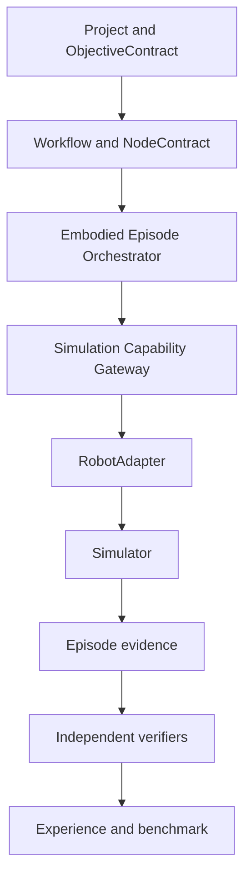
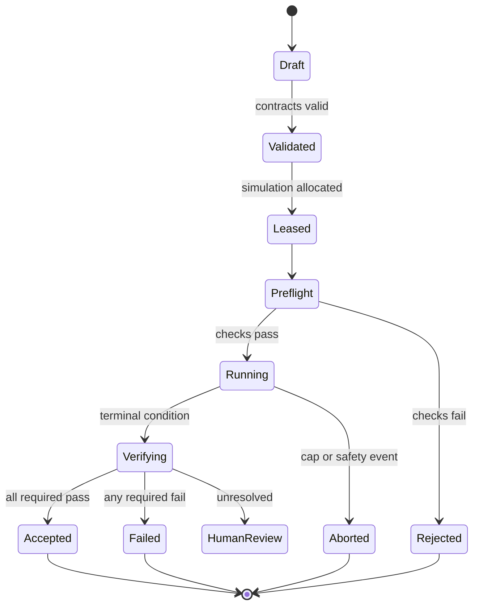

# Accretion v0.5 Software Design Description

## Robotics Simulation and Embodiment Foundation

**Status:** Forward implementation baseline; locked until the v0.4 release gate passes  
**Normative scope:** v0.5 only  
**Primary domain:** Simulated manipulation  
**Flagship:** One six-degree-of-freedom arm in simulation, with a second adapter used for conformance  
**Authority:** The backend is authoritative; no physical actuation capability exists in this release

---

## 1. Purpose

Accretion v0.5 introduces an embodiment-neutral Robotics research substrate without turning Accretion into a robot controller. It lets the existing project, workflow, routing, verification, evidence, experience, MCP, and identity planes execute reproducible experiments against simulation adapters.

The release answers one bounded question:

> Can Accretion express, execute, verify, replay, and compare embodied experiments through typed contracts while remaining independent of a specific robot and simulator?

v0.5 is successful only if the same high-level experiment can be bound to more than one conforming simulated embodiment without bypassing safety or evidence requirements.

## 2. Direction and release boundary

### 2.1 Golden Direction alignment

v0.5 preserves the original Accretion objective:

- developer-researchers start with a rough goal;
- Accretion structures a versioned project and experiment plan;
- research, implementation, execution, and evidence remain connected;
- incorrect acceptance is the most serious failure;
- verification is independent of the producing runtime;
- experience is retrieved only under explicit compatibility rules;
- the web Experiment Studio is the primary workspace and chat is a control surface;
- Robotics follows the Software/AI foundation instead of replacing it.

### 2.2 In scope

- a simulator-neutral `RobotAdapter` protocol;
- embodiment, observation, action-intent, and safety contracts;
- deterministic simulation reset and episode capture;
- a capability namespace for simulated sensing and action;
- simulation preflight and adapter conformance;
- independent embodied-task and safety verification;
- artifact-complete episode replay;
- domain randomization declared as experiment data;
- React Flow projection of embodied nodes and episodes;
- simulation-only Robotics benchmark and evidence export.

### 2.3 Out of scope

- physical robot actuation;
- direct model output to a motor, joint, servo, PLC, or fieldbus;
- learned safety policy or learned permission decisions;
- cross-embodiment policy claims;
- autonomous physical approval;
- safety certification;
- a universal adapter for every robot type;
- v0.8 learned graph planning.

### 2.4 Entry conditions

Implementation MUST NOT begin until:

1. v0.1, v0.2, and v0.3 release gates have passed;
2. v0.4 has demonstrated its pre-registered node-routing claim or has a documented no-go decision;
3. the v0.4 contract migrations are stable;
4. the capability gateway can deny undeclared capabilities;
5. the verifier can return `PASS`, `FAIL`, and `INCONCLUSIVE` without producer self-acceptance.

## 3. Permanent inherited invariants

1. The Accretion backend owns project, run, graph, policy, approval, and evidence state.
2. Claude, Codex, and later models are replaceable `AgentRuntime` workers.
3. A plugin or adapter manifest requests capabilities; it never grants authority.
4. Models receive capability references, never raw OAuth credentials or robot-control credentials.
5. Mutable runs use isolated workspaces.
6. A verifier implementation must be independent of the producer it evaluates.
7. Contradictory evidence is preserved and explicitly resolved.
8. `INCONCLUSIVE` verification pauses for human review when additional deterministic evidence cannot resolve it.
9. React Flow is a read-only projection of backend execution authority.
10. A simulation success is not physical evidence.

## 4. System context



No arrow in this architecture crosses into physical actuation in v0.5.

## 5. Component architecture

### 5.1 `EmbodimentRegistry`

Stores immutable versions of:

- `EmbodimentDescriptor`;
- `RobotAdapterManifest`;
- observation and action schemas;
- controller and simulator compatibility;
- conformance status;
- safety-envelope templates.

Registry lookup is by `(embodiment_id, descriptor_version, adapter_version)`. Aliases MUST resolve to immutable identifiers before a run is admitted.

### 5.2 `RobotAdapterHost`

Runs adapters out of process with:

- declared simulator endpoints;
- allow-listed message/service types;
- bounded CPU, memory, wall time, and output size;
- per-episode credentials or connection handles;
- heartbeat and command deadlines;
- deterministic shutdown.

An adapter crash MUST fail the episode closed. The host MUST NOT silently reconnect and replay an action after uncertainty about whether the previous action was applied.

### 5.3 `SimulationGateway`

Normalizes simulator operations:

- create/load world;
- set seed;
- reset world and robot;
- apply declared randomization;
- step/pause simulation;
- capture clock, state, sensor, and contact data;
- take and restore supported snapshots;
- terminate an episode.

The gateway is the only component permitted to call simulator-management endpoints.

### 5.4 `EmbodiedEpisodeOrchestrator`

Compiles a validated workflow node into a `SimulationExperimentContract`, obtains a lease, runs preflight, starts the episode, records actions and observations, terminates on policy conditions, and submits immutable evidence to verification.

It MUST enforce:

- maximum episode duration;
- maximum action count;
- maximum cumulative simulated motion;
- no-action timeouts;
- safety-envelope checks before every action intent;
- idempotent finalization.

### 5.5 `SafetyEnvelopeEvaluator`

Deterministically checks proposed `ActionIntent` values against:

- joint position, velocity, acceleration, effort, and workspace bounds;
- allowed controller mode;
- collision policy;
- forbidden volumes;
- tool and payload restrictions;
- episode-level motion/resource budgets.

It returns a signed decision receipt. A planner or model cannot override a denial.

### 5.6 `EpisodeRecorder`

Writes an append-only, time-aligned record of:

- normalized observations;
- raw artifact references;
- proposed and admitted action intents;
- adapter commands and acknowledgements;
- simulator clock and wall clock;
- contact/collision events;
- safety decisions;
- workflow and routing receipts;
- verifier outputs.

### 5.7 `EmbodiedVerifierHost`

Runs task, safety, reproducibility, and evidence-completeness verifiers in a separate process and identity from the producer. At least one deterministic verifier is mandatory for every episode.

### 5.8 `AdapterConformanceService`

Executes a fixed test suite before an adapter can become `ACTIVE`:

- schema round-trip;
- deterministic reset;
- monotonic sequence and time behavior;
- command deadline behavior;
- duplicate-command rejection;
- unknown-command rejection;
- limit and forbidden-volume denial;
- crash and heartbeat-loss behavior;
- artifact completeness;
- replay equivalence within declared tolerances.

## 6. Control-layer separation

| Layer | Owns | Must not own |
|---|---|---|
| Accretion planner | Goals, workflow structure, evidence needs | Servo loop |
| Node router | Runtime/model/tool configuration | Safety thresholds |
| Agent runtime | Bounded reasoning and proposal | Capability authority |
| Embodied orchestrator | Episode lifecycle | Hardware safety certification |
| Adapter | Translation to simulator/controller interface | Project policy |
| Controller | Trajectory/control execution | Research acceptance |
| Safety evaluator | Deterministic admission | Task optimization |
| Verifier | Independent claim evaluation | Production of evaluated result |

An agent MAY propose `ActionIntent`. It MUST NOT publish raw joint commands to a simulator or controller transport.

## 7. Contract conventions

Every v0.5 contract MUST contain:

```yaml
contract_type: string
schema_version: semver
contract_id: uuid
content_hash: sha256
created_at: rfc3339
created_by: principal_ref
project_id: uuid
```

Canonical JSON serialization is used for hashing. Unknown major versions are rejected. Unknown optional fields in a compatible minor version are preserved during forwarding.

## 8. Core contracts

### 8.1 `EmbodimentDescriptor`

```yaml
contract_type: EmbodimentDescriptor
embodiment_id: robot.sim.arm6dof.v1
descriptor_version: 1.0.0
kind: MANIPULATOR
kinematics:
  joint_names: [joint_1, joint_2, joint_3, joint_4, joint_5, joint_6]
  base_frame: base_link
  tool_frame: tool0
  joint_limits_ref: artifact://limits.json
control_interfaces:
  - JOINT_TRAJECTORY
sensors:
  - sensor_id: wrist_rgb
    modality: RGB
    frame_id: wrist_camera
end_effectors:
  - type: PARALLEL_GRIPPER
workspace_ref: artifact://workspace.json
```

The descriptor identifies facts about an embodiment. It does not imply an active connection or permission.

### 8.2 `ObservationSpec`

```yaml
contract_type: ObservationSpec
required:
  - field: joint_position
    dtype: float64
    shape: [6]
    unit: rad
  - field: wrist_rgb
    dtype: uint8
    shape: [480, 640, 3]
    unit: pixel
time_alignment:
  clock: SIMULATION
  maximum_skew_ms: 20
missing_data_policy: FAIL_EPISODE
```

### 8.3 `ActionIntent`

```yaml
contract_type: ActionIntent
intent_id: uuid
episode_id: uuid
sequence: 42
semantic_action: MOVE_END_EFFECTOR
target:
  frame_id: base_link
  pose_ref: artifact://target-pose.json
constraints:
  speed_scale: 0.20
  acceleration_scale: 0.15
  planning_time_ms: 500
expires_at_sim_time_ns: 8300000000
idempotency_key: sha256
```

`sequence` is strictly monotonic per episode. Expired, duplicated, or out-of-order intents are rejected.

### 8.4 `SafetyEnvelope`

```yaml
contract_type: SafetyEnvelope
safety_envelope_id: uuid
embodiment_descriptor_hash: sha256
controller_modes: [JOINT_TRAJECTORY]
speed_scale_max: 0.25
acceleration_scale_max: 0.20
joint_limit_margin_rad: 0.05
collision_policy: STOP_BEFORE_CONTACT
forbidden_volume_refs: [artifact://forbidden-volumes.json]
max_episode_sim_seconds: 120
max_actions: 300
max_cumulative_joint_motion_rad: 80
```

Safety-envelope loosening requires a new version and policy approval. An active episode remains pinned to its admitted version.

### 8.5 `RobotAdapterManifest`

```yaml
contract_type: RobotAdapterManifest
adapter_id: gazebo.arm6dof.adapter
adapter_version: 0.5.0
embodiment_descriptor_hashes: [sha256]
simulator:
  family: GAZEBO
  version_constraint: ">=harmonic,<ionic"
transport: ROS2
ros_distribution: JAZZY
capabilities:
  - robotics.sim.observe
  - robotics.sim.propose_action
  - robotics.sim.reset
observation_spec_hash: sha256
action_intent_schema_hash: sha256
conformance_report_hash: sha256
artifact_digest: sha256
```

The concrete simulator and ROS distribution shown are proposed defaults and MUST be frozen in the implementation ADR before coding.

### 8.6 `SimulationExperimentContract`

```yaml
contract_type: SimulationExperimentContract
experiment_id: uuid
objective_contract_ref: {id: uuid, version: 3}
node_contract_ref: {id: uuid, hash: sha256}
embodiment_ref: {id: robot.sim.arm6dof.v1, version: 1.0.0}
adapter_ref: {id: gazebo.arm6dof.adapter, version: 0.5.0}
world_artifact_digest: sha256
controller_artifact_digest: sha256
safety_envelope_hash: sha256
verification_spec_hash: sha256
seed_set: [101, 102, 103]
randomization_spec_ref: artifact://randomization.yaml
resource_budget:
  max_episodes: 30
  max_wall_seconds: 3600
```

### 8.7 `SimulationEnvironmentSnapshot`

```yaml
contract_type: SimulationEnvironmentSnapshot
simulator_image_digest: sha256
world_digest: sha256
robot_model_digest: sha256
controller_digest: sha256
adapter_digest: sha256
physics_engine: DART
physics_parameters_ref: artifact://physics.json
rendering_parameters_ref: artifact://rendering.json
host_architecture: x86_64
gpu_driver: optional-string
```

### 8.8 `EpisodeRecord`

```yaml
contract_type: EpisodeRecord
episode_id: uuid
experiment_contract_hash: sha256
environment_snapshot_hash: sha256
seed: 101
started_at: rfc3339
finished_at: rfc3339
termination_reason: TASK_COMPLETE
trajectory_ref: artifact://trajectory.parquet
sensor_manifest_ref: artifact://sensors.json
action_receipts_ref: artifact://action-receipts.jsonl
safety_events_ref: artifact://safety-events.jsonl
metrics_ref: artifact://metrics.json
producer_runtime_ref: runtime-version
```

### 8.9 `EmbodiedVerificationSpec`

```yaml
contract_type: EmbodiedVerificationSpec
task_verifiers:
  - implementation: pose-threshold-v1
    independent: true
    required: true
safety_verifiers:
  - implementation: envelope-audit-v1
    independent: true
    required: true
reproducibility_verifier: replay-equivalence-v1
evidence_completeness_verifier: episode-manifest-v1
inconclusive_policy: HUMAN_REVIEW
```

### 8.10 `AdapterConformanceReport`

```yaml
contract_type: AdapterConformanceReport
adapter_digest: sha256
suite_version: 0.5.0
tests_total: 48
tests_passed: 48
result: PASS
tolerance_profile_hash: sha256
evidence_bundle_ref: artifact://adapter-conformance.tar.zst
expires_on_environment_change: true
```

## 9. Capability model

### 9.1 Canonical capabilities

| Capability | Effect | Default risk |
|---|---|---|
| `robotics.sim.inspect` | Read descriptor/world metadata | Low |
| `robotics.sim.observe` | Read normalized observations | Low |
| `robotics.sim.propose_action` | Submit bounded `ActionIntent` | Medium |
| `robotics.sim.reset` | Reset an allocated simulation | Medium |
| `robotics.sim.snapshot` | Create/restore a simulation snapshot | Medium |
| `robotics.sim.terminate` | End an episode | Low |

There is no `robotics.physical.*` namespace in the v0.5 runtime registry.

### 9.2 Invocation path

```text
AgentRuntime
→ CapabilityRequest
→ PolicyEngine
→ SimulationLeaseResolver
→ SafetyEnvelopeEvaluator
→ RobotAdapterHost
→ Simulator
```

The gateway records every hop and returns opaque artifact references rather than unbounded raw payloads.

## 10. Episode lifecycle



State transitions use optimistic concurrency and an idempotency key. Only the orchestrator service account may advance execution states; verifiers may only advance verification substates.

## 11. Preflight

Preflight MUST verify:

1. every contract hash resolves;
2. the adapter conformance report is valid for the exact artifact digest;
3. the simulator, world, robot model, and controller versions satisfy constraints;
4. the seed and randomization specification are frozen;
5. observation fields and time alignment are available;
6. the safety envelope is compatible with the embodiment descriptor;
7. all required verifiers are installed and independent;
8. resource quota and simulation lease are valid;
9. no physical connector is selected;
10. the run workspace and artifact store are writable.

Any failure prevents `RUNNING`.

## 12. Reproducibility and replay

### 12.1 Required capture

- container and binary digests, not mutable tags;
- world and robot-model digests;
- simulator and physics configuration;
- controller parameters;
- all random seeds and randomization samples;
- normalized and raw observations with time mapping;
- admitted actions and acknowledgements;
- hardware/host characteristics that may affect determinism;
- all routing, policy, safety, and verification receipts.

### 12.2 Replay classes

| Class | Requirement |
|---|---|
| Exact | Bitwise-equivalent normalized trace where supported |
| Tolerant | Metrics and state remain within declared numeric tolerance |
| Statistical | Distribution over frozen seed set remains within pre-registered bounds |

The experiment contract MUST declare its replay class. A result cannot claim a stronger replay class than its evidence supports.

## 13. Verification

### 13.1 Hierarchy

1. deterministic task checks;
2. deterministic safety and evidence checks;
3. statistical checks across the approved seed set;
4. independent model judgment only for claims not reducible to deterministic evidence;
5. human review when unresolved.

### 13.2 Required outcomes

An episode is `ACCEPTED` only when all required task, safety, and completeness verifiers return `PASS`. If deterministic checks pass and a model verifier raises a material concern, the result becomes `INCONCLUSIVE`; Accretion seeks additional evidence and then pauses for human review if unresolved.

### 13.3 False-acceptance response

If an accepted result is later shown incorrect:

- quarantine the episode and dependent experience;
- preserve the original record and append the contradiction;
- identify affected router/planner training snapshots;
- evaluate rollback of promoted policies;
- notify the project owner;
- require contradiction resolution before reuse.

## 14. Experience rules

An `EpisodeRecord` becomes eligible experience only when:

- verification is `PASS`;
- environment and adapter hashes are complete;
- task and safety verifier versions are recorded;
- no unresolved contradiction exists;
- evidence retention permits team-workspace reuse.

Experience from a different embodiment MAY be retrieved only as a weak prior in v0.5. It MUST NOT change live action selection or support a cross-embodiment claim. v0.7 owns validated transfer.

## 15. API surface

| Method | Path | Purpose |
|---|---|---|
| `POST` | `/api/v1/embodiments` | Register immutable descriptor version |
| `GET` | `/api/v1/embodiments/{id}/versions/{version}` | Read descriptor |
| `POST` | `/api/v1/robot-adapters` | Register adapter manifest |
| `POST` | `/api/v1/robot-adapters/{id}/conformance-runs` | Execute conformance suite |
| `POST` | `/api/v1/simulation-experiments` | Create frozen contract |
| `POST` | `/api/v1/simulation-experiments/{id}/preflight` | Validate and allocate |
| `POST` | `/api/v1/simulation-experiments/{id}/episodes` | Start one episode |
| `POST` | `/api/v1/episodes/{id}/action-intents` | Submit bounded intent |
| `POST` | `/api/v1/episodes/{id}/terminate` | Terminate episode |
| `GET` | `/api/v1/episodes/{id}/evidence` | Read evidence manifest |
| `POST` | `/api/v1/episodes/{id}/replay` | Run replay verification |

Write operations require `Idempotency-Key` and `If-Match` where a resource version exists.

## 16. Event contracts

Every event uses the v1 event envelope inherited from earlier releases and includes `event_id`, `event_type`, `occurred_at`, `project_id`, `run_id`, `correlation_id`, `causation_id`, `producer`, `schema_version`, and a payload digest.

Required event types:

- `embodiment.registered`;
- `robot_adapter.registered`;
- `robot_adapter.conformance_completed`;
- `simulation_experiment.created`;
- `simulation_preflight.completed`;
- `simulation_episode.started`;
- `simulation_action.proposed`;
- `simulation_action.denied`;
- `simulation_action.admitted`;
- `simulation_episode.terminated`;
- `simulation_verification.completed`;
- `simulation_episode.quarantined`.

Large sensor payloads are never placed on the event bus; events reference content-addressed artifacts.

## 17. Persistence

### 17.1 Relational entities

- `embodiment_descriptors`;
- `robot_adapter_versions`;
- `adapter_conformance_runs`;
- `simulation_experiment_contracts`;
- `simulation_environment_snapshots`;
- `simulation_episodes`;
- `simulation_action_receipts`;
- `simulation_safety_events`;
- `embodied_verification_results`.

### 17.2 Constraints

- contract hashes are unique and immutable;
- an episode references exactly one frozen experiment contract;
- admitted action sequence numbers are unique per episode;
- an `ACCEPTED` episode has all required verifier results;
- artifacts use content digests and retention class;
- quarantine is append-only and cannot erase provenance.

## 18. Security and reliability

### 18.1 Threats

- malicious or buggy adapter escapes;
- action-intent schema smuggling;
- simulator endpoint confusion;
- stale conformance evidence;
- oversized sensor artifacts;
- prompt injection through scene labels or metadata;
- reward hacking of task metrics;
- simulation evidence mislabeled as physical evidence.

### 18.2 Controls

- process/container isolation and egress allow lists;
- signed adapter artifact digest;
- strict schema and unit validation;
- endpoint binding through opaque lease handles;
- evidence type labels enforced at storage and export;
- independent safety metrics not exposed as optimization targets where avoidable;
- artifact size and decompression limits;
- no secrets in model context, logs, events, or evidence bundles.

### 18.3 Failure behavior

Heartbeat loss, simulator clock regression, observation skew violation, adapter crash, artifact-store failure, or uncertain action acknowledgement aborts the episode. Recovery begins from a new reset and a new episode ID; commands are not replayed into an uncertain state.

## 19. Experiment Studio

The UI MUST provide:

- embodiment and adapter inventory with conformance state;
- experiment contract diff and approval view;
- simulator/world/seed matrix;
- live normalized observation and event view;
- action-intent proposal/admission receipts;
- safety-envelope status;
- task, safety, and replay verification panels;
- episode comparison and contradiction view;
- artifact and provenance export.

The UI MAY allow graph layout changes. It MUST NOT modify execution topology, safety envelopes, or capabilities without a backend versioned operation.

## 20. Benchmark

### 20.1 Flagship tasks

At minimum:

- reach a target pose;
- pick and place one rigid object;
- recover from one declared perception or planning failure;
- repeat across a frozen seed and randomization matrix.

### 20.2 Baselines

- direct simulator-specific script;
- Accretion with a single adapter and static workflow;
- Accretion with routing but no retrieved experience;
- Accretion with compatible verified experience.

### 20.3 Metrics

- verified task success;
- false-acceptance count;
- safety-envelope violation count;
- replay success by replay class;
- evidence completeness;
- adapter integration effort;
- time and episodes to verified result;
- cost and latency;
- failure-recovery correctness.

### 20.4 Claim gate

v0.5 may claim an embodiment-neutral simulation foundation only if a pre-registered paired evaluation shows reproducible execution through at least two conforming adapters or adapter versions, without safety or verified-success regression relative to the simulator-specific baseline.

## 21. Implementation milestones

1. Freeze contract registry entries and simulator/ROS ADR.
2. Implement registry and adapter SDK.
3. Implement simulator gateway and lease model.
4. Implement deterministic safety evaluator.
5. Implement episode orchestration and recorder.
6. Implement independent verifiers and replay.
7. Build the flagship arm adapter.
8. Build an independent second conformance adapter.
9. Add Experiment Studio surfaces and event replay.
10. Run the pre-registered benchmark and release audit.

## 22. Release acceptance criteria

### 22.1 Contracts and authority

- [ ] All contracts have immutable IDs, versions, canonical hashes, and schema tests.
- [ ] No v0.5 capability can resolve to a physical endpoint.
- [ ] Adapter manifests cannot grant capabilities.
- [ ] Unknown major contract versions fail closed.
- [ ] Active episodes remain pinned to admitted contract hashes.

### 22.2 Adapter and simulator

- [ ] At least two adapter implementations or materially distinct versions pass conformance.
- [ ] Reset, timeout, duplicate, out-of-order, and crash tests pass.
- [ ] Simulator images and worlds use immutable digests.
- [ ] Seed and randomization capture is complete.
- [ ] Observation unit, frame, shape, and time validation is enforced.

### 22.3 Safety and execution

- [ ] Every action intent is checked before adapter invocation.
- [ ] Joint, velocity, acceleration, workspace, and episode caps fail closed.
- [ ] Uncertain acknowledgement aborts instead of replaying a command.
- [ ] Hard caps terminate every automatic loop.
- [ ] Safety evaluator denial cannot be overridden by a runtime or plugin.

### 22.4 Verification and evidence

- [ ] Every accepted episode passes independent task, safety, and completeness checks.
- [ ] `INCONCLUSIVE` reaches human review when unresolved.
- [ ] Contradictory evidence is preserved and dependents are discoverable.
- [ ] Replay class is declared and verified.
- [ ] Simulation evidence cannot be exported as physical evidence.

### 22.5 Experience and benchmark

- [ ] Only verified, complete, contradiction-free episodes become eligible experience.
- [ ] Different-embodiment experience is a weak prior only.
- [ ] Benchmark splits, seeds, metrics, and analyses are pre-registered.
- [ ] False acceptance and safety non-regression gates pass.
- [ ] Ablations isolate routing and experience effects.

### 22.6 Product and operations

- [ ] Experiment Studio renders backend-derived episode state.
- [ ] APIs enforce idempotency and optimistic concurrency.
- [ ] Event replay reconstructs episode state.
- [ ] Adapter and simulator failures produce actionable typed errors.
- [ ] Security tests cover adapter escape, payload limits, and endpoint confusion.

## 23. Open questions and proposed defaults

| # | Question | Proposed default | Decision deadline |
|---:|---|---|---|
| 1 | First simulator | Gazebo Harmonic-class release | Before milestone 1 |
| 2 | First middleware | ROS 2 Jazzy-class LTS-compatible profile | Before milestone 1 |
| 3 | First embodiment | Six-DOF arm plus parallel gripper | Before adapter coding |
| 4 | Second conformance target | Same task through a second adapter implementation | Before benchmark freeze |
| 5 | Physics engine | Freeze one engine per experiment; no mixed-engine primary claim | Before protocol registration |
| 6 | Exact replay expectation | Tolerant replay by default; exact only where demonstrated | Before recorder design |
| 7 | Sensor storage | Chunked content-addressed artifacts with Parquet metadata | Before persistence migration |
| 8 | Action abstraction | End-effector or trajectory intent; never torque/current | Before schema freeze |
| 9 | Domain randomization | Explicit frozen distribution and sampled values | Before first experiment |
| 10 | Simulation approval | ObjectiveContract approval covers low-risk episodes within caps | Before UI implementation |
| 11 | Model-based verifier | Optional and always secondary to deterministic evidence | Before verifier registry |
| 12 | Multi-robot simulation | Excluded until single-robot gate passes | v0.5 release review |

## 24. Technical foundations

- ROS 2 managed lifecycle nodes provide an explicit state machine for initialization and activation: [ROS 2 managed nodes](https://docs.ros.org/en/humble/Tutorials/Demos/Managed-Nodes.html).
- MoveIt Servo documents collision checking, singularity checking, smoothing, and joint limit enforcement; Accretion treats these as controller-layer defenses, not as proof of system safety: [MoveIt Servo](https://moveit.picknik.ai/main/doc/examples/realtime_servo/realtime_servo_tutorial.html).
- Gazebo provides the first proposed simulator family, but all dependencies remain behind `SimulationGateway` and `RobotAdapter`: [Gazebo documentation](https://gazebosim.org/docs/).

## 25. Handoff gate to v0.6

v0.6 remains locked until:

- all v0.5 acceptance criteria pass;
- no unresolved critical safety or false-acceptance incident exists;
- the flagship simulation benchmark is reproducible;
- adapter conformance is demonstrated independently;
- safety envelopes and evidence labels survive replay;
- a human approves a physical-safety case and the exact initial hardware scope.

Passing v0.5 does not authorize physical execution. It only supplies evidence required to design v0.6 responsibly.
