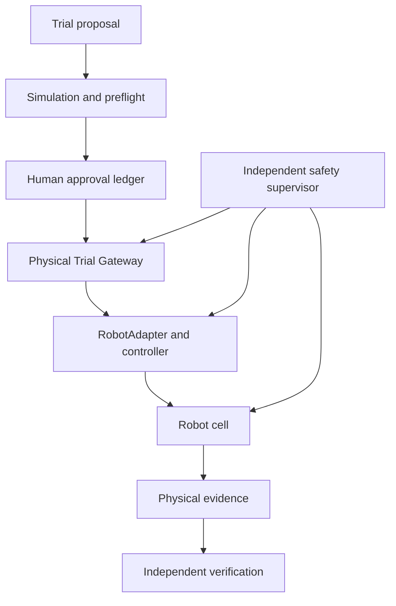
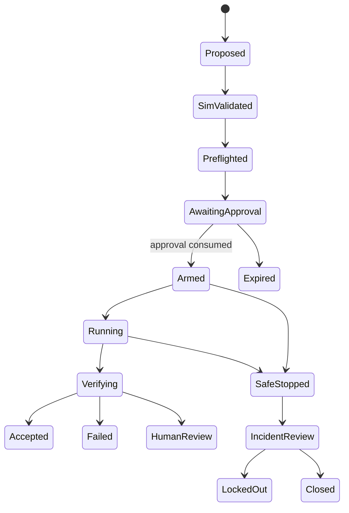

# Accretion v0.6 Software Design Description

## Physical Robotics Safety and Execution

**Status:** Forward implementation baseline; locked until the v0.5 release gate passes  
**Normative scope:** v0.6 only  
**Initial hardware:** One fixed six-degree-of-freedom arm, parallel gripper, fixed RGB camera, guarded workspace  
**Approval policy:** One human approval for every individual physical or otherwise high-risk trial  
**Safety claim:** Accretion coordinates evidence-governed trials; it does not replace certified robot, cell, controller, or emergency-stop safety functions

---

## 1. Purpose

Accretion v0.6 extends the simulation-only embodiment substrate into tightly bounded physical trials. Its purpose is not broad robot autonomy. Its purpose is to prove that a developer-researcher can move from a verified simulation proposal to one human-approved, independently supervised, artifact-complete physical trial without allowing a model, learned router, workflow planner, plugin, or adapter to create authority.

The release answers:

> Can Accretion execute individually approved physical experiments through layered, fail-safe controls while preserving verification, provenance, reproducibility, and human authority?

## 2. Direction and release boundary

### 2.1 Golden Direction alignment

v0.6 keeps Software/AI research as Accretion's core and adds Robotics as a governed experimental domain. It preserves the project's most important safety decision: an incorrect result must not be accepted as correct. In the physical domain, this is extended with a second non-negotiable constraint: an agent must never acquire unilateral actuation authority.

### 2.2 In scope

- one fixed manipulator cell with a documented risk assessment;
- simulation-to-physical preflight;
- an immutable `PhysicalTrialContract`;
- exact-contract, single-use human approval;
- a physical capability gateway isolated from model runtimes;
- an independent safety supervisor and hardware safety chain;
- calibration and environment snapshot capture;
- time-synchronized physical episode recording;
- task, safety, and evidence verification;
- incident quarantine and learning rollback hooks;
- Experiment Studio physical-trial control surfaces.

### 2.3 Out of scope

- mobile, aerial, legged, humanoid, medical, wearable, outdoor, or human-contact robots;
- collaborative operation in an occupied workspace;
- raw torque, current, PWM, or unconstrained servo control from an agent;
- online learning during an armed trial;
- automatic approval, approval delegation to a model, or reusable blanket approval;
- learned safety, learned permissions, or learned emergency-stop decisions;
- multi-robot cells;
- safety certification by Accretion;
- cross-embodiment physical transfer, which belongs to v0.7.

### 2.4 Entry conditions

Implementation MUST NOT begin until:

1. v0.5 passes every simulation, adapter, replay, and evidence gate;
2. the target hardware, controller, end effector, camera, workspace, and safety devices are frozen;
3. a qualified human completes and approves an application-specific risk assessment;
4. applicable laws, facility rules, manufacturer instructions, and safety standards are identified;
5. the robot's independent protective functions and emergency stop have been tested outside Accretion;
6. a physical incident response plan and authorized operator roster exist;
7. no unresolved critical v0.5 contradiction or safety defect exists.

## 3. Inherited invariants

1. Backend authority, replaceable runtimes, isolated workspaces, policy enforcement, independent verification, contradiction preservation, and secret isolation remain mandatory.
2. Every physical/high-risk trial requires one approval for exactly one trial.
3. Approval is bound to the complete trial content hash and expires.
4. A retry, changed parameter, changed environment, changed artifact, changed verifier, or changed safety envelope requires a new contract and approval.
5. Deterministic evidence precedes model judgment; unresolved results pause for human review.
6. Physical evidence and simulation evidence remain separately typed.
7. The planner proposes experiments; it cannot arm equipment.
8. The learned router may select only policy-compatible digital configuration. It cannot select or relax physical safety limits.
9. Independent hardware/controller protections remain effective if Accretion, the network, or an agent fails.
10. React Flow and the UI project backend state; they do not directly command the robot.

## 4. Safety standards boundary

The project safety case MUST identify the applicable standards for the actual robot application. For the initial industrial-manipulator profile, the design review SHOULD evaluate ISO 10218-1:2025 for the robot and ISO 10218-2:2025 for the integrated application/cell. The older 2011 editions are withdrawn. Standards inform the engineering and risk assessment; conformance or certification requires competent, context-specific assessment outside this SDD.

This SDD cannot authorize work where local law, the manufacturer, the facility, or the approved risk assessment requires stronger controls.

## 5. Reference architecture



The safety supervisor has an independent stop path. It MUST NOT depend solely on the same application process, network route, power domain, or learned component that issues task commands.

## 6. Component architecture

### 6.1 `PhysicalTrialService`

Owns proposal, contract freezing, preflight coordination, approval resolution, arm request, episode finalization, verification, and quarantine. It never communicates directly with controller transports.

### 6.2 `PhysicalPreflightService`

Evaluates the exact trial against:

- approved risk assessment and cell profile;
- simulation evidence and discrepancy limits;
- robot, adapter, controller, firmware, tool, payload, and calibration versions;
- workspace inspection and occupancy state;
- safety-device health;
- verification readiness;
- recording capacity;
- resource and motion budgets.

Preflight receipts expire when any observed dependency changes.

### 6.3 `ApprovalLedger`

Stores immutable, signed `PhysicalTrialApproval` records. It provides atomic single-use consumption and rejects:

- expired approvals;
- already-consumed approvals;
- content-hash mismatch;
- unauthorized approvers;
- approvals signed before the final successful preflight;
- approvals for a different cell or environment snapshot.

### 6.4 `PhysicalTrialGateway`

The sole software ingress to the physical adapter. It runs in a restricted network zone and accepts only an armed lease containing:

- trial contract hash;
- approval ID and consumption receipt;
- cell and adapter identity;
- safety-supervisor session;
- maximum duration and motion budgets;
- command schema and sequence range.

It cannot alter these values.

### 6.5 `PhysicalRobotAdapterHost`

Translates high-level admitted intents to the approved controller interface. It is pinned to signed artifact digests, runs out of process, validates units and frames, applies deadlines, and reports acknowledgements. It MUST expose an idempotent stop operation but MUST NOT automatically retry an uncertain motion command.

### 6.6 `IndependentSafetySupervisor`

Monitors, at minimum:

- gateway and controller heartbeat;
- protective-stop and emergency-stop state;
- cell access/occupancy sensors required by the safety case;
- joint and Cartesian bounds available through the approved interface;
- speed, acceleration, payload, and episode budgets;
- stale command, observation, and clock conditions;
- watchdog deadlines;
- forbidden safety-state transitions.

It can prevent arming and request/trigger the approved stop behavior. Its critical rules are deterministic, configuration-controlled, and unavailable to model modification.

### 6.7 `CalibrationRegistry`

Stores versioned, immutable calibration bundles with validity intervals, method, operator, residual error, input artifacts, and hardware identifiers. A changed camera, tool, robot base, or environment reference invalidates affected bundles.

### 6.8 `PhysicalEpisodeRecorder`

Records synchronized controller state, admitted commands, acknowledgements, safety state, images, calibration references, environment observations, human actions, and verifier artifacts. The recorder has a health gate before arming and a bounded local spool if remote storage becomes unavailable.

### 6.9 `IncidentManager`

Creates an append-only incident record for any safety stop, unexpected contact, boundary breach, command uncertainty, lost observation, device fault, or evidence integrity failure. Critical incidents immediately disable new arming for the affected cell until an authorized human closes the lockout.

## 7. Authority matrix

| Actor/component | May propose | May approve | May arm | May command | May stop | May verify |
|---|---:|---:|---:|---:|---:|---:|
| Agent runtime | Yes | No | No | No | Request only | No self-acceptance |
| Workflow planner | Yes | No | No | No | Request only | No |
| Human approver | Review | Yes | No direct API | No | Yes | Human review |
| PhysicalTrialService | Compile | No | Request | No | Request | No |
| ApprovalLedger | No | Validate | Authorize once | No | No | Audit only |
| Trial Gateway | No | No | With valid lease | Forward admitted | Yes | No |
| Safety supervisor | No | No | Veto | No | Yes | Safety evidence |
| Controller/safety chain | No | No | Hardware-defined | Execute | Yes | State evidence |
| Independent verifier | No | No | No | No | No | Yes |

## 8. Contract conventions

All contracts use the cross-release canonical header, content hashing, immutable versions, and compatibility rules. A physical contract hash MUST cover all referenced manifest and artifact digests transitively or include a deterministic Merkle root over them.

## 9. Core contracts

### 9.1 `PhysicalCellDescriptor`

```yaml
contract_type: PhysicalCellDescriptor
cell_id: lab.cell.arm01
descriptor_version: 1.0.0
robot_serial_ref: secretless-asset-id
robot_model: fixed-arm-6dof
controller_model: approved-controller
firmware_digest: sha256
adapter_digest: sha256
network_zone: ROBOT_CELL
safety_devices:
  emergency_stop: hardware
  protective_stop: hardware
  access_interlock: required
approved_risk_assessment_ref: artifact://risk-assessment.pdf
```

### 9.2 `PhysicalTrialContract`

```yaml
contract_type: PhysicalTrialContract
trial_id: uuid
objective_contract_ref: {id: uuid, version: 4}
node_contract_hash: sha256
simulation_evidence_refs: [evidence://episode-set]
physical_cell_descriptor_hash: sha256
embodiment_descriptor_hash: sha256
adapter_digest: sha256
controller_configuration_digest: sha256
calibration_bundle_hashes: [sha256]
environment_snapshot_hash: sha256
safety_supervisor_contract_hash: sha256
safety_envelope_hash: sha256
verification_spec_hash: sha256
task_parameters_ref: artifact://trial-parameters.json
limits:
  max_wall_seconds: 90
  max_actions: 40
  speed_scale_max: 0.10
  acceleration_scale_max: 0.10
approval_policy: INDIVIDUAL_TRIAL
```

### 9.3 `PhysicalTrialApproval`

```yaml
contract_type: PhysicalTrialApproval
approval_id: uuid
trial_contract_hash: sha256
preflight_receipt_hash: sha256
approver_principal: principal-ref
approver_role: ROBOT_TRIAL_APPROVER
approved_at: rfc3339
expires_at: rfc3339
scope: ONE_TRIAL
status: AVAILABLE
signature: detached-signature
```

Consumption creates an immutable receipt and atomically changes status from `AVAILABLE` to `CONSUMED`. No reverse transition exists.

### 9.4 `CalibrationBundle`

```yaml
contract_type: CalibrationBundle
calibration_id: uuid
cell_id: lab.cell.arm01
calibration_type: HAND_EYE
hardware_asset_refs: [robot, camera, tool]
method: approved-method-v1
input_artifact_refs: [artifact://calibration-inputs]
transform_artifact_ref: artifact://transform.json
residual_metrics_ref: artifact://residuals.json
performed_by: principal-ref
valid_from: rfc3339
valid_until: rfc3339
invalidating_changes: [CAMERA_MOVED, TOOL_CHANGED, BASE_MOVED]
```

### 9.5 `PhysicalEnvironmentSnapshot`

```yaml
contract_type: PhysicalEnvironmentSnapshot
cell_id: lab.cell.arm01
captured_at: rfc3339
captured_by: principal-ref
workspace_image_refs: [artifact://workspace-view-1.jpg]
fixture_manifest_hash: sha256
object_manifest_hash: sha256
access_state: UNOCCUPIED_AND_INTERLOCKED
lighting_profile_ref: artifact://lighting.json
inspection_checklist_ref: artifact://checklist.json
```

### 9.6 `SafetySupervisorContract`

```yaml
contract_type: SafetySupervisorContract
supervisor_version: 1.0.0
cell_descriptor_hash: sha256
heartbeat_deadline_ms: 100
command_staleness_ms: 150
observation_staleness_ms: 150
stop_behavior: PROTECTIVE_STOP
monitors:
  - E_STOP_STATE
  - ACCESS_INTERLOCK
  - CONTROLLER_HEARTBEAT
  - JOINT_LIMIT_MARGIN
  - WORKSPACE_BOUNDARY
  - SPEED_AND_ACCELERATION
lockout_on_critical_incident: true
```

Deadlines are examples and MUST be derived from the validated cell safety case, controller behavior, and test evidence.

### 9.7 `ArmedTrialLease`

```yaml
contract_type: ArmedTrialLease
lease_id: uuid
trial_contract_hash: sha256
approval_consumption_receipt_hash: sha256
preflight_receipt_hash: sha256
gateway_instance: service-identity
safety_session_id: uuid
sequence_start: 1
sequence_end: 40
issued_at: rfc3339
expires_at: rfc3339
```

### 9.8 `PhysicalEpisodeRecord`

```yaml
contract_type: PhysicalEpisodeRecord
episode_id: uuid
trial_contract_hash: sha256
armed_lease_hash: sha256
approval_id: uuid
started_at: rfc3339
finished_at: rfc3339
termination_reason: TASK_COMPLETE
controller_trace_ref: artifact://controller.parquet
sensor_manifest_ref: artifact://sensors.json
admitted_actions_ref: artifact://actions.jsonl
safety_trace_ref: artifact://safety.jsonl
operator_events_ref: artifact://operator-events.jsonl
metrics_ref: artifact://metrics.json
evidence_class: PHYSICAL
```

### 9.9 `PhysicalIncidentRecord`

```yaml
contract_type: PhysicalIncidentRecord
incident_id: uuid
episode_id: uuid
severity: CRITICAL
category: SAFETY_STOP
detected_at: rfc3339
detected_by: SAFETY_SUPERVISOR
automatic_response: PROTECTIVE_STOP_AND_LOCKOUT
evidence_refs: [artifact://incident-window]
affected_cell_id: lab.cell.arm01
quarantined_experience_ids: [uuid]
resolution_status: OPEN
```

### 9.10 `SimToRealDiscrepancyReport`

```yaml
contract_type: SimToRealDiscrepancyReport
trial_id: uuid
simulation_cohort_ref: evidence://cohort
physical_episode_ref: evidence://episode
matched_variables_ref: artifact://matching.json
metric_deltas:
  endpoint_error_m: 0.004
  duration_s: 0.8
  peak_speed_ratio: 1.07
within_registered_bounds: true
review_status: PASS
```

## 10. Physical capability model

### 10.1 Canonical capabilities

| Capability | Default decision | Required context |
|---|---|---|
| `robotics.physical.inspect` | Allow to authorized team | Cell/project access |
| `robotics.physical.preflight` | Allow to orchestrator | Frozen trial contract |
| `robotics.physical.request_approval` | Allow | Successful preflight |
| `robotics.physical.arm` | Deny unless all gates pass | Single-use approval and supervisor |
| `robotics.physical.propose_action` | Deny unless armed | Valid lease and intent |
| `robotics.physical.stop` | Allow to gateway/operator/supervisor | Audited identity |
| `robotics.physical.reset_fault` | Human-only | Resolved incident and controller policy |

### 10.2 Invocation path

```text
AgentRuntime
→ bounded ActionIntent
→ Capability Gateway
→ policy and armed-lease validation
→ deterministic safety admission
→ PhysicalRobotAdapter
→ approved controller interface
```

The system MUST NOT provide a generic shell, network, MCP, or plugin route from an agent runtime into the robot cell network.

## 11. Trial lifecycle



Only one trial may be `ARMED` or `RUNNING` per initial cell. Arming is a distributed transaction across approval consumption, supervisor session establishment, gateway lease issuance, and controller readiness. If final commit fails, the approval remains consumed and a new approval is required.

## 12. Preflight pipeline

The exact order is:

1. resolve immutable contract graph;
2. verify v0.5 simulation evidence and discrepancy prerequisites;
3. validate the current cell descriptor and controller/firmware identity;
4. validate adapter conformance for the exact digest;
5. validate calibration freshness and residual bounds;
6. capture and validate the environment snapshot;
7. verify cell unoccupied/interlocked state as required by the safety case;
8. test safety supervisor heartbeat and stop path;
9. test recorder health and local storage capacity;
10. load all independent verifiers;
11. validate resource, motion, and time caps;
12. produce a short-lived signed preflight receipt.

The user reviews the diff between simulation and proposed physical parameters before approval.

## 13. Approval semantics

### 13.1 One approval means one attempt

Approval covers one transition into `ARMED`. It does not cover:

- automatic retries;
- another seed or object placement;
- a changed prompt, model, tool, runtime, policy, or code artifact;
- a changed safety parameter;
- a changed cell observation or calibration;
- a second trial after a safe stop.

### 13.2 Approval presentation

The UI MUST show:

- human-readable goal and task;
- exact trial content hash;
- code, model, adapter, controller, and calibration versions;
- simulation evidence and known discrepancies;
- action, speed, acceleration, workspace, duration, and resource caps;
- safety devices and supervisor health;
- verifiers and success criteria;
- rollback/stop behavior;
- all changes since the last reviewed proposal.

## 14. Safety behavior

### 14.1 Defense in depth

1. manufacturer/controller protections;
2. engineered cell safeguards and emergency stop;
3. independent safety supervisor;
4. gateway armed lease and command admission;
5. adapter/controller limits;
6. application-level action intent and episode caps;
7. human approval and operator observation required by the risk assessment.

No higher layer is allowed to weaken a lower layer.

### 14.2 Fail-safe conditions

The trial enters the approved stop behavior on:

- emergency/protective-stop or access-interlock change;
- supervisor, gateway, adapter, controller, or required sensor heartbeat loss;
- stale or out-of-order command/observation;
- contract, lease, or sequence mismatch;
- limit or forbidden-volume prediction/observation;
- unexpected contact or controller fault;
- recorder inability to preserve required evidence;
- operator stop request;
- any condition declared critical by the approved safety case.

### 14.3 Recovery

Automatic resume after a safety stop is prohibited. An authorized human inspects the cell and incident. Fault reset follows the controller/facility process. A new trial contract and approval are required for another attempt.

## 15. Verification and acceptance

### 15.1 Verification hierarchy

1. controller and safety-state integrity;
2. deterministic task measurement;
3. evidence and calibration integrity;
4. pre-registered statistical comparison to simulation/baseline;
5. independent model review only for qualitative material concerns;
6. human review when unresolved.

### 15.2 Acceptance rule

A physical episode is `ACCEPTED` only when:

- all required safety checks pass;
- no unresolved incident exists;
- deterministic task criteria pass;
- evidence completeness and integrity pass;
- physical evidence is correctly typed;
- any required discrepancy analysis passes;
- independent verifier identities differ from producer identity.

Task success never overrides a safety failure.

## 16. Experience and learning

Physical experience is team-workspace visible by default only after project policy, verification, privacy, and safety eligibility checks. It is never automatically promoted into a learned router or planner.

Before offline promotion, the snapshot MUST exclude:

- failed or inconclusive episodes as positive labels;
- unresolved incidents;
- stale calibration/environment records;
- episodes under a superseded unsafe configuration;
- evidence with broken provenance.

Online exploration remains disabled for physical nodes. A candidate policy may run in shadow mode and propose alternatives, but it cannot affect the armed configuration.

## 17. API surface

| Method | Path | Purpose |
|---|---|---|
| `POST` | `/api/v1/physical-cells` | Register immutable cell descriptor |
| `POST` | `/api/v1/calibrations` | Register calibration bundle |
| `POST` | `/api/v1/physical-trials` | Create trial proposal |
| `POST` | `/api/v1/physical-trials/{id}/preflight` | Execute preflight |
| `POST` | `/api/v1/physical-trials/{id}/approval-requests` | Request individual approval |
| `POST` | `/api/v1/physical-trials/{id}/approvals` | Record authorized approval |
| `POST` | `/api/v1/physical-trials/{id}/arm` | Atomically consume approval and arm |
| `POST` | `/api/v1/physical-trials/{id}/action-intents` | Submit intent through armed lease |
| `POST` | `/api/v1/physical-trials/{id}/stop` | Request immediate safe stop |
| `GET` | `/api/v1/physical-trials/{id}/evidence` | Read evidence manifest |
| `POST` | `/api/v1/incidents/{id}/resolve` | Human incident resolution |

`arm`, `action-intents`, and `stop` use mutually authenticated service identities inside the cell zone. Browser clients never call controller-facing endpoints.

## 18. Events

Required events include:

- `physical_trial.proposed`;
- `physical_preflight.started`;
- `physical_preflight.failed`;
- `physical_preflight.passed`;
- `physical_approval.requested`;
- `physical_approval.granted`;
- `physical_approval.consumed`;
- `physical_trial.armed`;
- `physical_trial.started`;
- `physical_action.denied`;
- `physical_action.admitted`;
- `physical_trial.safe_stopped`;
- `physical_incident.opened`;
- `physical_trial.verification_completed`;
- `physical_trial.quarantined`.

Approval, arm, command, safety, stop, and incident events have the highest audit-retention class.

## 19. Persistence and audit

### 19.1 Entities

- `physical_cell_descriptors`;
- `physical_trial_contracts`;
- `physical_preflight_receipts`;
- `physical_trial_approvals`;
- `approval_consumption_receipts`;
- `armed_trial_leases`;
- `calibration_bundles`;
- `physical_environment_snapshots`;
- `physical_episode_records`;
- `physical_safety_events`;
- `physical_incident_records`;
- `sim_to_real_discrepancy_reports`.

### 19.2 Mandatory constraints

- approval content hash equals trial content hash;
- each approval has at most one consumption receipt;
- each armed lease has exactly one consumed approval;
- one cell has at most one armed/running trial;
- an accepted episode has no open incident;
- every admitted action belongs to the lease sequence range;
- incident and approval audit records cannot be deleted by project users.

## 20. Network and security architecture

### 20.1 Zones

| Zone | Components | Allowed inbound |
|---|---|---|
| User | Browser | HTTPS to control API |
| Control | Project/orchestrator/approval services | Authenticated API/event traffic |
| Evidence | Artifact and audit stores | Signed service writes/authorized reads |
| Robot cell | Gateway, adapter, supervisor, recorder | Restricted control-plane service identities |
| Controller/safety | Robot controller and safety devices | Approved cell interfaces only |

There is no general Internet egress from the robot-cell or controller/safety zones during an armed trial.

### 20.2 Major threats

- approval replay or content substitution;
- compromised adapter/gateway;
- stale calibration or environment evidence;
- confused-deputy capability invocation;
- command duplication after timeout;
- sensor spoofing or clock desynchronization;
- evidence deletion after incident;
- model prompt injection from scene metadata;
- unsafe parameter disguised as a task parameter.

Controls include cryptographic content binding, single-use transactions, separation of duties, signed artifacts, mTLS service identity, strict schemas/units, monotonic sequences, time-health checks, append-only audit, network allow lists, physical lockout, and independent stop paths.

## 21. Reliability requirements

- The stop request path MUST remain available when the project UI or main orchestrator is unavailable.
- The safety supervisor MUST fail to safe behavior on its own fault according to the approved safety design.
- The recorder MUST declare degraded status before arming if evidence cannot be guaranteed.
- Restarted services MUST reconstruct state from authoritative records and MUST NOT infer that a trial remains safe to resume.
- Clock synchronization health is part of preflight and continuous monitoring.
- Cell lockout survives service restart.

Proposed software SLOs do not supersede safety-response timing established by the hardware and approved safety design.

## 22. Experiment Studio

The physical trial workspace MUST show:

- prominent cell state: `OFFLINE`, `SAFE`, `PREFLIGHT`, `AWAITING_APPROVAL`, `ARMED`, `RUNNING`, `STOPPED`, or `LOCKED_OUT`;
- contract diff and transitive artifact hashes;
- live safety-device and supervisor health;
- calibration and environment validity;
- simulation evidence and discrepancy view;
- single-use approval status and expiry;
- live trial timeline, command receipts, and evidence-health state;
- always-visible stop control for authorized users;
- incident and lockout workflow;
- post-trial verification and contradiction view.

The browser never holds robot credentials, approval signing keys, or armed-lease secrets.

## 23. Flagship experiment and benchmark

### 23.1 Task sequence

1. reach a pose in an empty guarded workspace;
2. pick and place a rigid object with fixed pose;
3. pick and place across a small pre-registered pose distribution;
4. evaluate one declared perception/planning recovery without automatic physical retry.

### 23.2 Comparators

- approved manual/controller script baseline;
- Accretion static configuration;
- v0.4 router recommendation in shadow mode;
- simulation-predicted performance versus physical performance.

### 23.3 Metrics

- verified task success;
- false acceptance;
- safety stop and limit-event counts;
- approval-contract mismatch rejection;
- sim-to-real metric discrepancy;
- trial setup and evidence-completion time;
- cost and latency;
- evidence completeness;
- incident detection and lockout correctness.

### 23.4 Claim gate

The release may claim safe, evidence-governed physical experiment coordination only after pre-registered paired evaluation, zero critical uncontained safety events, zero approval bypasses, no correctness/safety regression, full incident drills, and independent review of the safety architecture. It MUST NOT claim that Accretion makes a robot or cell certified.

## 24. Implementation milestones

1. Freeze hardware, cell, standards applicability, and risk assessment.
2. Implement cell, calibration, environment, and trial contracts.
3. Build isolated physical gateway and adapter.
4. Build/test independent safety supervisor and stop integration.
5. Implement approval ledger and atomic consumption.
6. Implement recorder, incident manager, and lockout.
7. Implement physical verifiers and discrepancy reports.
8. Build Experiment Studio physical workspace.
9. Complete fault injection and incident drills without autonomous motion.
10. Execute staged flagship trials and release audit.

## 25. Release acceptance criteria

### 25.1 Entry and scope

- [ ] Every v0.5 release gate is evidenced.
- [ ] Hardware and cell scope is frozen to the approved initial profile.
- [ ] Applicable law, facility rules, instructions, and standards are documented.
- [ ] A qualified human approves the application-specific risk assessment.
- [ ] Excluded robot classes cannot be registered as active v0.6 cells.

### 25.2 Approval and authority

- [ ] Every armed trial has exactly one content-matched approval.
- [ ] Approval consumption is atomic and non-reversible.
- [ ] Retry, change, expiry, or failed arm requires new approval.
- [ ] Models, plugins, planners, routers, and adapters cannot approve or arm.
- [ ] UI and API tests reject approval replay and substitution.

### 25.3 Safety

- [ ] Independent emergency/protective stop functions are tested.
- [ ] Supervisor heartbeat, stale data, limit, interlock, and fault tests fail safe.
- [ ] Automatic resume after any safety stop is impossible.
- [ ] One cell cannot have two armed/running trials.
- [ ] Critical incident lockout survives service restart.
- [ ] Online learning and physical exploration are disabled.

### 25.4 Execution and evidence

- [ ] Commands require valid lease, schema, sequence, deadline, and safety admission.
- [ ] Uncertain command acknowledgement stops the trial without retry.
- [ ] Calibration and environment changes invalidate preflight.
- [ ] Required evidence recording is healthy before arming.
- [ ] Physical and simulation evidence types cannot be confused.

### 25.5 Verification

- [ ] Task success cannot override a safety failure.
- [ ] Producer identity cannot self-accept.
- [ ] Unresolved material concern becomes human review.
- [ ] Open incidents block acceptance and experience promotion.
- [ ] False-acceptance quarantine traces all dependent policies and experiences.

### 25.6 Operations and security

- [ ] Robot cell has no general Internet route during armed trials.
- [ ] Browser and agent contexts contain no robot credentials.
- [ ] mTLS/service authorization and network allow lists are tested.
- [ ] Stop remains available under UI/orchestrator failure.
- [ ] Disaster-recovery drills never resume motion automatically.

### 25.7 Research claim

- [ ] Protocol, metrics, exclusions, and effect thresholds are pre-registered.
- [ ] Sim-to-real discrepancies are reported, not hidden.
- [ ] Safety and correctness non-regression gates pass.
- [ ] Incident drills and ablations are complete.
- [ ] The release language makes no certification claim.

## 26. Open questions and proposed defaults

| # | Question | Proposed default | Decision deadline |
|---:|---|---|---|
| 1 | Exact arm/controller | Freeze one commercially supported fixed arm after risk review | Entry review |
| 2 | Cell access control | Guarded, unoccupied, interlocked workspace | Safety design freeze |
| 3 | Approval expiry | Ten minutes and invalidated by dependency change | API freeze |
| 4 | Operator presence | Required throughout initial trials | Risk assessment |
| 5 | Gateway platform | Dedicated industrial/edge host in robot-cell zone | Deployment ADR |
| 6 | Supervisor implementation | Separate process and host where practical; independent stop path mandatory | Safety design freeze |
| 7 | Motion interface | Approved trajectory/action intent only | Adapter schema freeze |
| 8 | Camera scope | One fixed RGB camera plus controller state | Calibration plan |
| 9 | Evidence retention | Long-term for approval, safety, incident, and accepted research evidence | Governance review |
| 10 | Model shadow recommendations | Visible but never applied during physical trial | Benchmark freeze |
| 11 | Physical trial count | Small pre-registered sequence with no automatic retry | Protocol registration |
| 12 | External safety review | Required before first armed trial | Release candidate |

## 27. Technical foundations

- ISO lists ISO 10218-1:2025 and ISO 10218-2:2025 as the current industrial-robot and application/cell safety editions: [ISO robotics catalogue](https://www.iso.org/cms/live/live/en/sites/isoorg/contents/data/committee/59/15/5915511/x/catalogue/).
- ROS 2 managed lifecycle nodes support explicit configure/activate/deactivate behavior useful for gateway and adapter lifecycle control: [ROS 2 managed nodes](https://docs.ros.org/en/humble/Tutorials/Demos/Managed-Nodes.html).
- MoveIt Servo exposes collision, singularity, smoothing, and joint-limit defenses, but these remain subordinate controller/application safeguards: [MoveIt Servo](https://moveit.picknik.ai/main/doc/examples/realtime_servo/realtime_servo_tutorial.html).

## 28. Handoff gate to v0.7

v0.7 remains locked until:

- all v0.6 acceptance criteria pass;
- the physical flagship is reproducible under the approved protocol;
- no unresolved critical incident exists;
- sim-to-real discrepancy and calibration drift are characterized;
- physical approval, stop, lockout, evidence, and verification paths survive fault injection;
- a second embodiment can be evaluated first in simulation without expanding physical authority;
- the user approves the bounded cross-embodiment research protocol.
