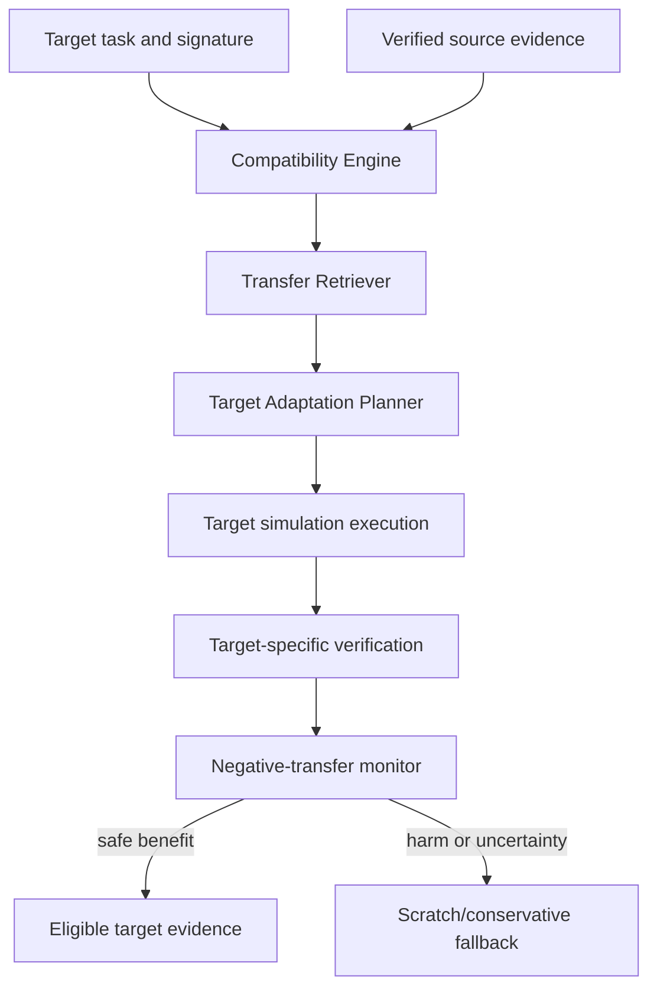
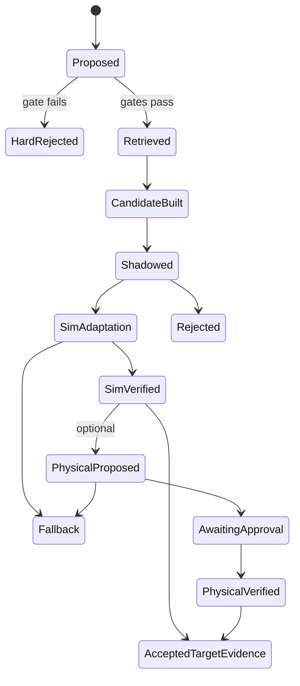

# Accretion v0.7 Software Design Description

## Cross-Embodiment Transfer

**Status:** Forward implementation baseline; locked until the v0.6 release gate passes  
**Normative scope:** v0.7 only  
**Primary research domain:** Manipulation transfer across two or more meaningfully different embodiments  
**Physical policy:** Target simulation first; every target physical trial retains v0.6 individual approval  
**Learning boundary:** Transfer verified knowledge and configuration priors; do not learn graph planning

---

## 1. Purpose

Accretion v0.7 introduces explicit, testable transfer across robot embodiments. It does not promise that one policy controls every robot. It provides contracts, compatibility gates, adaptation protocols, negative-transfer detection, target-specific verification, and matched evaluation so evidence from one embodiment can be reused safely and scientifically on another.

The release answers:

> When source experience is compatible but not identical, can Accretion reduce the evidence, trials, cost, or latency required for verified target success without increasing correctness or safety risk?

## 2. Golden Direction alignment

v0.7 follows the original direction because it:

- treats Robotics as a governed R&D domain after the Software/AI foundation;
- connects research hypotheses, adapter implementation, experiment execution, and evidence;
- retrieves verified successes, failures, and contradictions;
- branches adaptively when transfer uncertainty is high;
- uses source experience as evidence with declared compatibility, not as authority;
- preserves target verification and human control;
- optimizes multi-objective verified utility rather than raw task reward;
- explicitly measures and falls back on negative transfer.

## 3. Release boundary

### 3.1 In scope

- a high-level `EmbodiedTaskContract` independent of joint count and controller transport;
- normalized `EmbodimentSignature` and versioned comparison;
- hard compatibility pruning and soft prior weighting;
- retrieval of verified source success, failure, and contradiction evidence;
- explicit transfer candidates and target adaptation plans;
- source-to-target evidence lineage;
- target simulation evaluation against scratch baselines;
- optional target physical confirmation under all v0.6 rules;
- negative-transfer monitoring and automatic fallback;
- embodiment-disjoint benchmark splits and transfer regret;
- UI for compatibility, prior influence, and target evidence.

### 3.2 Out of scope

- universal zero-shot control;
- learned graph planning (v0.8);
- joint planner/router learning (v0.9);
- autonomous physical exploration;
- transfer of safety thresholds, permissions, approvals, or verifier semantics;
- mobile-to-aerial, manipulator-to-legged, or other radically different physical transfer in the first claim;
- end-to-end foundation-model training as a release requirement;
- target acceptance based on source evidence alone.

### 3.3 Entry conditions

Implementation MUST NOT begin until:

1. v0.6 has passed its full release gate;
2. the source embodiment has verified simulation and physical evidence where the protocol requires it;
3. target embodiment simulation adapter conformance passes;
4. a shared high-level task can be expressed without hiding target-specific requirements;
5. target-specific deterministic verifiers exist;
6. a scratch target baseline and matched budget are pre-registered;
7. negative-transfer thresholds and fallback behavior are frozen;
8. any target physical work has a separate approved v0.6 safety case.

## 4. Inherited invariants

1. Source evidence never changes target authority.
2. Target execution uses target adapter, target safety envelope, target environment, and target verifier.
3. Physical trials require exact, single-use human approval.
4. Learned policies cannot create capabilities, approvals, safety limits, or verifier semantics.
5. Contradictions remain first-class and are retrieved with successes.
6. An unresolved target result is not accepted based on source confidence.
7. A compatibility decision is deterministic and replayable for a fixed input snapshot.
8. Transfer and scratch cohorts use matched conditions.
9. Negative transfer triggers down-weighting or fallback, not hidden cherry-picking.
10. Source, target-simulation, and target-physical evidence remain distinguishable.

## 5. Research hypotheses

### 5.1 Primary hypothesis

For a target embodiment with compatible task semantics and capability types, verified source experience plus explicit target adaptation lowers the number of target trials required to reach a pre-registered verified-success floor compared with training/configuring from scratch, without correctness or safety regression.

### 5.2 Secondary hypotheses

- explicit compatibility pruning outperforms similarity-only retrieval;
- failures and contradictions improve negative-transfer detection;
- weak-prior initialization is safer than unconstrained policy reuse;
- target-specific verification prevents false transfer acceptance;
- transparent fallback improves worst-cohort behavior.

## 6. Flagship design

### 6.1 Embodiments

The flagship MUST use at least two meaningfully different manipulation embodiments, such as arms with different kinematics, reach, controller, observation layout, or end effector. The exact pair is selected only after v0.6 evidence exists.

### 6.2 Shared task family

Start with high-level tasks that admit embodiment-independent success criteria:

- reach a target region;
- pick and place a rigid object;
- move an object between semantic zones;
- recover from a declared perception/planning failure.

The contract MUST allow target-specific constraints and MUST NOT pretend that low-level action spaces are identical.

### 6.3 Experimental conditions

- target from scratch;
- target with same-embodiment retrieved experience;
- target with compatible cross-embodiment weak prior;
- target with similarity-only retrieval ablation;
- oracle compatibility/routing for regret estimation where feasible.

## 7. Reference architecture



## 8. Component architecture

### 8.1 `EmbodimentSignatureService`

Derives a normalized signature from immutable embodiment, adapter, observation, action, controller, environment, risk, and verifier contracts. Derived fields include explicit provenance and derivation version.

### 8.2 `EmbodimentCompatibilityEngine`

Performs deterministic hard-gate evaluation, then computes soft compatibility features. It cannot override a hard failure. Its output is versioned and replayable.

### 8.3 `TransferEvidenceRetriever`

Retrieves eligible source records from the team-workspace prior with project-specific filtering. It returns successes, failures, contradictions, and uncertainty—not a single unqualified similarity score.

### 8.4 `TransferCandidateBuilder`

Constructs candidates from transferable layers:

- task decomposition;
- research hypothesis and workflow fragments;
- perception representation or calibration method;
- high-level action-intent strategy;
- model/runtime/tool configuration prior;
- controller/planner parameter prior within target policy limits;
- verifier test templates where target verifier implementations remain independent.

It MUST mark non-transferable fields and produce a content hash.

### 8.5 `TargetAdaptationPlanner`

Creates a bounded plan for target data collection, parameter adaptation, fine-tuning or reconfiguration, simulation evaluation, and optional physical confirmation. It operates under an approved `ObjectiveContract` and cannot modify target safety or approval policy.

### 8.6 `NegativeTransferMonitor`

Compares transfer and scratch performance using pre-registered sequential or batch rules. It tracks:

- verified-success probability;
- false acceptance;
- safety events;
- trials/time/cost to threshold;
- calibration and environment mismatch;
- verifier disagreement;
- posterior/prior conflict.

It can set a candidate to `DOWNWEIGHTED`, `SUSPENDED`, or `REJECTED` and initiate the conservative fallback.

### 8.7 `TransferLineageService`

Maintains a provenance graph from every target decision back to source records, compatibility receipts, candidate fields, adaptation steps, target runs, and verifier results.

## 9. Transfer authority model

| Transferable | Conditional | Never transferable as authority |
|---|---|---|
| High-level task structure | Model weights or embeddings | Physical approval |
| Verified failure patterns | Controller parameter prior | Capability grant |
| Evidence collection plan | Action representation | Safety threshold |
| Runtime/model/tool ranking prior | Perception/calibration method | Emergency-stop behavior |
| Verifier test template | Workflow fragment | Target acceptance result |
| Research hypothesis | Skill/controller initialization | Target verifier independence |

All conditional transfer requires hard-gate compatibility, explicit adaptation, shadow/simulation validation, and target verification.

## 10. Contract conventions

Contracts use canonical versioned headers and hashes from the cross-release registry. `source_*` and `target_*` identifiers are mandatory where evidence could otherwise be confused. Major version mismatch is a hard failure.

## 11. Core contracts

### 11.1 `EmbodiedTaskContract`

```yaml
contract_type: EmbodiedTaskContract
task_id: uuid
task_version: 1.0.0
semantic_goal: place object_A in zone_B
required_capabilities:
  perception: [RGB_OBJECT_LOCALIZATION]
  manipulation: [REACH, GRASP, TRANSPORT, RELEASE]
required_observation_semantics: [OBJECT_POSE, TOOL_POSE, GRIPPER_STATE]
success_predicate_ref: verifier-contract://place-in-zone-v1
failure_taxonomy: [NO_GRASP, COLLISION, TIMEOUT, PERCEPTION_ERROR]
target_specific_constraint_slots:
  - workspace
  - payload
  - grasp_family
```

### 11.2 `EmbodimentSignature`

```yaml
contract_type: EmbodimentSignature
signature_id: uuid
embodiment_descriptor_hash: sha256
adapter_digest: sha256
kinematic_features:
  kind: SERIAL_MANIPULATOR
  dof: 6
  reach_m: 0.85
end_effector:
  family: PARALLEL_GRIPPER
observation_semantics: [RGB, JOINT_STATE, TOOL_POSE]
action_semantics: [CARTESIAN_POSE_INTENT, GRIPPER_BINARY]
controller_semantics: [TRAJECTORY]
environment_class: TABLETOP_GUARDED
risk_class: PHYSICAL_HIGH
verifier_contract_hashes: [sha256]
derivation_version: 1.0.0
```

### 11.3 `EmbodimentCompatibilityDecision`

```yaml
contract_type: EmbodimentCompatibilityDecision
decision_id: uuid
source_signature_hash: sha256
target_signature_hash: sha256
task_contract_hash: sha256
engine_version: 1.0.0
hard_gates:
  task_semantics: PASS
  required_capabilities: PASS
  action_adaptation_available: PASS
  observation_mapping_available: PASS
  target_verifier_available: PASS
  risk_policy: PASS
soft_features:
  kinematic_similarity: 0.68
  observation_similarity: 0.90
  action_similarity: 0.74
decision: COMPATIBLE_AS_WEAK_PRIOR
maximum_prior_weight: 0.20
reasons: [different_kinematics, compatible_grasp_semantics]
```

### 11.4 `TransferEvidenceSet`

```yaml
contract_type: TransferEvidenceSet
evidence_set_id: uuid
retrieval_snapshot_id: uuid
query_hash: sha256
source_experience_ids: [uuid]
success_ids: [uuid]
failure_ids: [uuid]
contradiction_ids: [uuid]
eligibility_policy_version: 1.0.0
maximum_prior_weight: 0.20
content_digest: sha256
```

### 11.5 `TransferCandidate`

```yaml
contract_type: TransferCandidate
candidate_id: uuid
source_evidence_set_hash: sha256
compatibility_decision_hash: sha256
target_task_hash: sha256
transfer_layers:
  task_decomposition_ref: artifact://decomposition.json
  routing_prior_ref: artifact://routing-prior.json
  perception_initialization_ref: artifact://perception-init
adaptation_required:
  - TARGET_CALIBRATION
  - TARGET_ACTION_HEAD
  - TARGET_SIMULATION_VALIDATION
explicitly_excluded:
  - SAFETY_ENVELOPE
  - APPROVAL
  - TARGET_VERIFICATION_RESULT
candidate_digest: sha256
```

### 11.6 `TargetAdaptationPlan`

```yaml
contract_type: TargetAdaptationPlan
adaptation_plan_id: uuid
candidate_hash: sha256
objective_contract_ref: {id: uuid, version: 2}
target_environment_snapshot_hash: sha256
stages:
  - TARGET_BASELINE
  - SHADOW_EVALUATION
  - TARGET_SIMULATION_ADAPTATION
  - TARGET_SIMULATION_CONFIRMATION
  - OPTIONAL_PHYSICAL_PROPOSAL
budgets:
  max_target_episodes: 100
  max_compute_hours: 20
fallback: SCRATCH_CONSERVATIVE_BASELINE
stop_rules_ref: artifact://sequential-stop-rules.json
verification_spec_hash: sha256
```

### 11.7 `TransferOutcome`

```yaml
contract_type: TransferOutcome
outcome_id: uuid
adaptation_plan_hash: sha256
target_cohort_id: uuid
scratch_cohort_id: uuid
matched_protocol_hash: sha256
verified_success_delta: 0.08
trials_to_threshold_delta: -18
cost_delta: -42.5
latency_delta_s: -3600
safety_event_delta: 0
false_acceptance_delta: 0
confidence_interval_ref: artifact://paired-ci.json
result: BENEFICIAL
```

### 11.8 `NegativeTransferEvent`

```yaml
contract_type: NegativeTransferEvent
event_id: uuid
candidate_id: uuid
target_cohort_id: uuid
trigger: VERIFIED_UTILITY_BELOW_SCRATCH_BOUND
detected_at: rfc3339
evidence_ref: artifact://negative-transfer-evidence.json
response: FALLBACK_TO_SCRATCH
prior_weight_before: 0.20
prior_weight_after: 0.00
affected_experience_ids: [uuid]
```

### 11.9 `TargetVerificationReceipt`

```yaml
contract_type: TargetVerificationReceipt
target_run_id: uuid
target_embodiment_signature_hash: sha256
target_environment_snapshot_hash: sha256
target_verifier_implementation_hashes: [sha256]
task_result: PASS
safety_result: PASS
evidence_result: PASS
overall: PASS
source_evidence_was_sufficient: false
```

## 12. Compatibility model

### 12.1 Hard gates

The engine rejects transfer when any required condition fails:

- task semantic contract cannot be mapped;
- required target observation or action semantic is absent;
- no bounded target adaptation implementation exists;
- units, frames, timing, or controller semantics are unresolved;
- target safety/risk policy forbids the candidate;
- target verifier is missing or not independent;
- source evidence is unverified, incomplete, contradicted without resolution, or outside retention policy;
- source or target contract major version is incompatible.

### 12.2 Soft ranking

After hard gates, candidates may be ranked by:

- task and scene similarity;
- morphology/kinematics and end-effector compatibility;
- observation/action representation compatibility;
- controller and timing similarity;
- source evidence quantity, recency, and uncertainty;
- environment/calibration similarity;
- prior transfer outcomes for the signature pair.

### 12.3 Prior weight

The effective source prior is bounded:

\[
w_{source}=\min(w_{policy}, w_{compatibility}, w_{evidence})
\]

The first cross-domain/embodiment use defaults to a weak prior and shadow validation. Target evidence monotonically dominates as it accumulates. No source prior can reduce the target verified-success floor.

## 13. Transfer lifecycle



Each transition emits a receipt with the input snapshot hash. Physical states are delegated to the v0.6 state machine and approval rules.

## 14. Negative-transfer handling

### 14.1 Definition

Negative transfer occurs when a transfer condition produces a pre-registered material regression relative to the matched scratch condition in verified success, safety, false acceptance, trials/cost/latency, or robustness.

### 14.2 Response

On threshold breach:

1. stop further allocation to the candidate;
2. fall back to the conservative scratch baseline;
3. preserve transfer and scratch evidence;
4. create a `NegativeTransferEvent`;
5. down-weight the signature pair in future retrieval;
6. identify dependent candidates and policy snapshots;
7. require human review for any safety/correctness regression;
8. never rewrite the failed transfer as a positive experience.

### 14.3 Contradictions

A new target result that contradicts trusted source evidence preserves both. The contradiction resolver may conclude environment shift, embodiment incompatibility, verifier mismatch, source overfitting, or unresolved cause. Until resolution, the candidate is ineligible for promotion.

## 15. Simulation-to-physical progression

1. source simulation evidence;
2. target scratch simulation baseline;
3. target transfer simulation adaptation;
4. paired target simulation confirmation on held-out seeds/scenes;
5. optional target physical proposal under a separate v0.6 safety case;
6. one approved target physical trial at a time;
7. target-specific verification and discrepancy analysis;
8. eligibility review for target experience.

No simulation result grants physical authority. A target physical adapter is a new v0.6 cell integration and must pass all associated gates.

## 16. Evaluation design

### 16.1 Splits

- project-disjoint train/validation/test where learned ranking is used;
- embodiment-disjoint target test;
- task instances and environment variations held out;
- source evidence timestamped before target evaluation cutoff.

### 16.2 Pairing

Scratch and transfer conditions share:

- target task distribution;
- target embodiment/adapter/controller;
- environment and calibration protocol;
- seed/scene/object set;
- compute, episode, and time budgets;
- verifier versions;
- stopping and human-intervention policy.

### 16.3 Utility and regret

For safe choices satisfying the verified-success floor:

\[
U=Q-\lambda C-\mu L-\nu R
\]

Transfer regret is:

\[
Regret_{transfer}=U(c^*)-U(c_{selected})
\]

where the oracle comparison is post-hoc over policy-compatible candidates. Safety and correctness floors are hard constraints, not compensable utility terms.

### 16.4 Primary claim

The primary claim is lower trials-to-verified-threshold or lower constrained transfer regret on an unseen target embodiment, with the verified-success floor, false-acceptance ceiling, and safety non-regression preserved.

## 17. Verification

Target verification MUST be defined before candidate selection and use target-compatible independent implementations. Source verifier outputs are evidence inputs, never substitutes.

If deterministic target checks pass but an independent model verifier identifies a material concern, the target result becomes `INCONCLUSIVE`; Accretion seeks additional evidence and requests human review if unresolved.

Structural failures go to the workflow planner; configuration/adapter failures go to the router or adaptation controller according to the typed failure taxonomy. All loops terminate on hard caps plus an expected-value improvement threshold.

## 18. API surface

| Method | Path | Purpose |
|---|---|---|
| `POST` | `/api/v1/embodied-tasks` | Register task contract |
| `POST` | `/api/v1/embodiment-signatures/derive` | Derive immutable signature |
| `POST` | `/api/v1/transfer/compatibility-decisions` | Evaluate hard/soft compatibility |
| `POST` | `/api/v1/transfer/evidence-queries` | Retrieve eligible source evidence |
| `POST` | `/api/v1/transfer/candidates` | Build content-addressed candidate |
| `POST` | `/api/v1/transfer/adaptation-plans` | Freeze bounded target plan |
| `POST` | `/api/v1/transfer/adaptation-plans/{id}/execute` | Execute simulation stages |
| `POST` | `/api/v1/transfer/candidates/{id}/suspend` | Human/policy suspension |
| `GET` | `/api/v1/transfer/outcomes/{id}` | Read matched outcome |
| `GET` | `/api/v1/transfer/lineage/{id}` | Read source-to-target provenance |

Physical proposal endpoints remain those of v0.6; v0.7 cannot bypass them.

## 19. Events

Required events:

- `embodiment_signature.derived`;
- `transfer.compatibility_evaluated`;
- `transfer.evidence_retrieved`;
- `transfer.candidate_built`;
- `transfer.candidate_hard_rejected`;
- `transfer.shadow_completed`;
- `transfer.adaptation_started`;
- `transfer.target_verified`;
- `transfer.negative_detected`;
- `transfer.fallback_activated`;
- `transfer.outcome_recorded`;
- `transfer.contradiction_opened`.

Events include source and target signature hashes and never embed large model/data artifacts.

## 20. Persistence

### 20.1 Entities

- `embodied_task_contracts`;
- `embodiment_signatures`;
- `embodiment_compatibility_decisions`;
- `transfer_evidence_sets`;
- `transfer_candidates`;
- `target_adaptation_plans`;
- `transfer_stage_runs`;
- `transfer_outcomes`;
- `negative_transfer_events`;
- `transfer_lineage_edges`;
- `target_verification_receipts`.

### 20.2 Constraints

- a transfer candidate has one source evidence snapshot and one target signature;
- a hard-rejected decision cannot produce an executable candidate;
- source and target evidence classes are explicit;
- a beneficial outcome requires a matched scratch cohort;
- a safety/correctness regression cannot be labeled beneficial;
- an open contradiction blocks promotion;
- a physical target stage must reference a valid v0.6 trial and approval.

## 21. Security, privacy, and reliability

### 21.1 Threats

- compatibility-score manipulation;
- poisoned source experience;
- source/target evidence confusion;
- policy or weight artifact tampering;
- target safety parameter smuggling;
- benchmark leakage across embodiment/project splits;
- negative-transfer evidence suppression;
- physical approval bypass through transfer APIs.

### 21.2 Controls

- deterministic hard gates before learned/similarity ranking;
- content-addressed, signed candidate and model artifacts;
- explicit source/target fields and evidence types;
- target policy revalidation after every adaptation;
- immutable split and cutoff manifests;
- append-only negative-transfer/contradiction records;
- no physical actuation route in transfer services;
- tenant/project access enforcement for shared experience.

### 21.3 Failure behavior

Retriever, compatibility, adaptation, or monitor failure falls back to the target scratch/conservative baseline. It never silently increases prior weight. Service recovery reconstructs from immutable stage receipts and does not repeat physical trials.

## 22. Experiment Studio

The UI MUST provide:

- source and target embodiment comparison;
- hard-gate results and soft feature explanation;
- retrieved successes, failures, and contradictions;
- transfer-layer include/exclude view;
- prior-weight and target-evidence evolution;
- scratch versus transfer cohort dashboard;
- negative-transfer signals and fallback history;
- source-to-target provenance graph;
- target simulation and optional physical approval boundary;
- target verifier and discrepancy results.

A developer-researcher may override among policy-compatible transfer candidates with a reason recorded. They cannot override a hard compatibility failure, safety rule, or approval requirement.

## 23. Benchmark protocol

### 23.1 Baselines

- target from scratch;
- similarity-only retrieval;
- same-embodiment experience where available;
- compatibility-pruned weak-prior transfer;
- oracle candidate selection post-hoc where feasible.

### 23.2 Metrics

- verified success and false acceptance;
- safety events and target safety-verifier result;
- target episodes, wall time, compute, and cost to threshold;
- transfer regret;
- negative-transfer detection precision/recall and detection delay;
- fallback utility;
- calibration and sim-to-real discrepancy;
- evidence and provenance completeness.

### 23.3 Evidence gate

A superiority claim requires pre-registration, paired evaluation, confidence interval, minimum effect size, safety/correctness non-regression, project/embodiment-disjoint testing, and ablations for compatibility pruning, failures/contradictions, and prior weight.

## 24. Implementation milestones

1. Freeze flagship source/target pair and task contracts.
2. Implement signatures and deterministic compatibility engine.
3. Implement evidence retrieval and lineage.
4. Implement transfer candidate and adaptation-plan contracts.
5. Implement scratch/transfer cohort orchestration.
6. Implement negative-transfer monitor and fallback.
7. Implement target-specific verification and contradiction flow.
8. Add Experiment Studio transfer surfaces.
9. Run target simulation protocol and audit.
10. If separately approved, run bounded target physical confirmation.

## 25. Release acceptance criteria

### 25.1 Entry and contracts

- [ ] Every v0.6 release gate is evidenced.
- [ ] At least two meaningfully different embodiments have immutable signatures.
- [ ] The shared task contract exposes all target-specific constraint slots.
- [ ] Contract hashes, versions, units, frames, and evidence types are validated.
- [ ] Major-version incompatibility fails closed.

### 25.2 Compatibility and retrieval

- [ ] Every executable candidate passes all hard gates.
- [ ] Soft similarity cannot override a hard failure.
- [ ] Retrieval returns eligible failures and contradictions with successes.
- [ ] Prior weight is bounded and replayable.
- [ ] Source/target cutoff and split leakage tests pass.

### 25.3 Adaptation and authority

- [ ] Target adaptation cannot alter safety, permissions, approvals, or verifier semantics.
- [ ] Target policy and capability compatibility is revalidated after adaptation.
- [ ] Target simulation precedes any physical proposal.
- [ ] All physical stages use v0.6 single-trial approval.
- [ ] Online physical exploration remains impossible.

### 25.4 Verification and negative transfer

- [ ] Target-specific independent verifiers are required.
- [ ] Source evidence alone cannot accept a target result.
- [ ] Material negative transfer triggers fallback within registered bounds.
- [ ] Safety/correctness regression blocks a beneficial label and promotion.
- [ ] Contradictory evidence remains visible and blocks promotion while open.

### 25.5 Research validity

- [ ] Scratch and transfer conditions are matched.
- [ ] Project- and embodiment-disjoint evaluation is complete.
- [ ] Confidence intervals, effect size, non-regression, and ablations pass.
- [ ] Transfer regret and trials-to-threshold are reported.
- [ ] Failures and excluded cohorts are disclosed.

### 25.6 Product and operations

- [ ] UI explains compatibility, prior influence, alternatives, and fallback.
- [ ] Authorized overrides are policy-compatible and reasoned.
- [ ] Event replay reconstructs every transfer stage.
- [ ] Signed artifact and poisoned-experience tests pass.
- [ ] Service failure chooses scratch/conservative fallback.

## 26. Open questions and proposed defaults

| # | Question | Proposed default | Decision deadline |
|---:|---|---|---|
| 1 | First source/target pair | Two fixed manipulators with different kinematics but compatible grippers | Entry review |
| 2 | Physical target evidence | Optional and small; simulation claim is primary | Protocol freeze |
| 3 | Transfer layer | Task/configuration/perception priors before full policy weights | Candidate schema freeze |
| 4 | Prior cap | 0.20 until target evidence justifies less/more within policy | Protocol freeze |
| 5 | Negative-transfer rule | Sequential safety/correctness gate plus pre-registered utility bound | Protocol registration |
| 6 | Shared representation | Explicit semantic mapping first; learned latent actions remain experimental | Architecture ADR |
| 7 | Target scratch budget | Equal to transfer condition, with paired stopping rules | Benchmark freeze |
| 8 | Contradiction resolution | Human-reviewed typed cause before promotion | Governance freeze |
| 9 | Target physical approval | One approval per individual trial, unchanged from v0.6 | Permanent |
| 10 | Experience scope | Team-workspace prior with project-specific adaptation | Data policy freeze |
| 11 | Generalist policy baseline | Octo/RT-X-style initialization only if licenses and interfaces fit | Protocol freeze |
| 12 | Claim language | Bounded cross-embodiment transfer, never “supports every robot” | Release review |

## 27. Technical foundations

- Open X-Embodiment demonstrates that data and models can span many robot embodiments, while still requiring careful representation and evaluation: [Open X-Embodiment project](https://robotics-transformer-x.github.io/) and [paper](https://arxiv.org/abs/2310.08864).
- Octo explicitly addresses adaptation to new sensory inputs and action spaces, supporting the need for target-specific adaptation rather than assuming identical embodiments: [Octo paper](https://arxiv.org/abs/2405.12213).
- Cross-embodiment results motivate the research direction but do not remove Accretion's compatibility, safety, target-verification, or approval gates.

## 28. Handoff gate to v0.8

v0.8 learned workflow planning remains locked until:

- all v0.7 acceptance criteria pass;
- the target is unseen under a frozen embodiment/project split;
- transfer provides a statistically supported benefit or a documented negative result;
- negative transfer is detected and conservative fallback works;
- source evidence remains distinguishable from target evidence;
- target correctness and safety show no regression;
- contracts, adapters, workflows, and verifiers are reproducible;
- at least two meaningfully different embodiments have been evaluated;
- the node-level router is stable enough to hold fixed during the initial graph-planner study.
