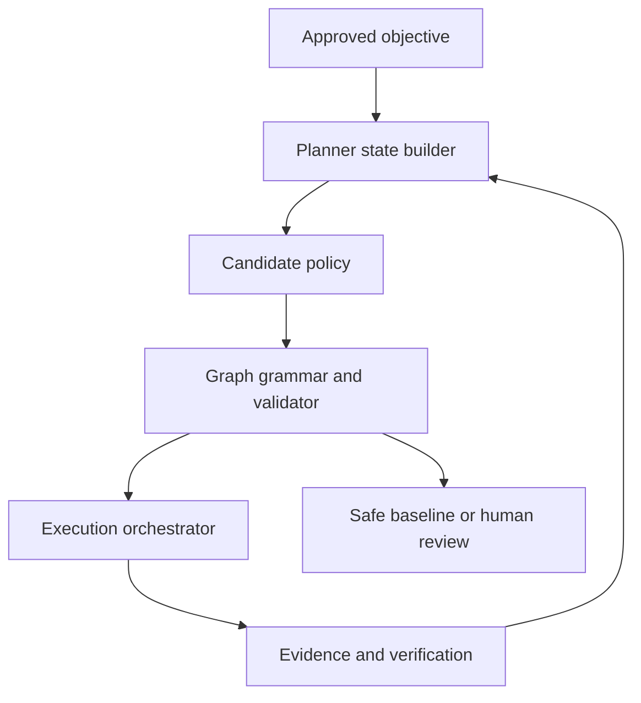

# Accretion v0.8 Software Design Description

## Learned Workflow Planning

**Document status:** Forward technical design baseline  
**Implementation authority:** Locked until the v0.7 exit gate passes  
**Primary domains:** Software engineering and AI research  
**Permitted secondary domain:** Robotics simulation and replay  
**Excluded authority:** Physical online exploration, permission learning, verifier-semantics learning

---

## 1. Purpose

Accretion v0.8 learns how to construct and revise a workflow graph for a rough developer-researcher goal. Earlier releases select static or LLM-proposed workflows and learn the execution configuration of each existing node. v0.8 makes workflow structure itself a governed learning target.

The release must answer:

> On unseen Software/AI projects with familiar capability types, can a constrained learned planner reduce architecture regret relative to the strongest governed rule-based and LLM-planner baselines while preserving the approved verified-success floor?

The planner may choose task decomposition, evidence branches, verifier placement, bounded loops, joins, recovery edges, and termination. It may not create authority, weaken a `NodeContract`, alter an approved `ObjectiveContract`, or directly control a physical robot.

This specification is informed by workflow-search and sequential workflow-construction research. AFlow treats code-represented workflow design as search; Workflow-R1 treats workflow construction as sequential decision-making; Agent Lightning demonstrates separation between agent execution and learning. Accretion adopts the separation and sequential formulation, but adds deterministic graph validation, frozen verification semantics, conservative promotion, and human authority.

## 2. Release boundary

### 2.1 In scope

- Typed workflow-plan state;
- Restricted graph grammar;
- Offline graph-candidate generation and ranking;
- Run-specific graph synthesis;
- Evidence-triggered graph revision;
- Planner trajectory and propensity logging;
- Architecture-regret evaluation;
- Shadow-policy evaluation;
- Guarded online exploration on low-risk digital tasks only;
- Planner explanations, alternatives, and policy-compatible overrides;
- Robotics-simulation shadow evaluation after digital release gates pass.

### 2.2 Out of scope

- Joint learning of workflow topology and node execution configuration;
- Learned permission, credential, risk, approval, or safety policy;
- Learned verification semantics or acceptance thresholds;
- Autonomous capability installation;
- Online exploration on physical or high-risk nodes;
- Unbounded graph generation or recursion;
- Model-weight self-modification;
- Claiming general planning across arbitrary domains.

### 2.3 Entry conditions

Implementation may start only when:

1. v0.4 node routing preserves its verified-success floor on unseen projects;
2. v0.5-v0.7 provide stable embodiment and transfer contracts, even if Robotics is not enabled in the first v0.8 experiment;
3. Graph, node, evidence, verifier, failure, and objective schemas are versioned;
4. Static and governed dynamic planners are reproducible baselines;
5. Planner behavior policies log candidate sets and selection propensities;
6. False-acceptance and critical-safety cohorts have immutable release gates;
7. Rollback to the deterministic planner is tested.

## 3. Inherited invariants

v0.8 MUST preserve the Golden Direction:

1. An incorrect result accepted as correct is the most unacceptable failure.
2. Verification is defined before routing or planning and cannot be weakened by either.
3. Deterministic evidence is preferred; independent model judgment is secondary; unresolved cases pause for human review.
4. Human approval is not verification.
5. Materially contradictory evidence is preserved until explicitly resolved.
6. A rough goal becomes a versioned, user-approved `ObjectiveContract`.
7. The backend project/run model is authoritative; chat is a control surface.
8. Team-workspace experience is shared by default, subject to policy.
9. Transfer requires contract, capability, environment, risk, and verifier compatibility.
10. Learned policies are promoted offline with holdout evaluation and rollback validation.
11. Critical correctness or safety regression blocks promotion.
12. Physical and high-risk trials require one approval for each exact trial.
13. A model cannot design or expand its own authority.
14. Every automatic loop has hard resource caps and an expected-value improvement threshold.

## 4. Research formulation

### 4.1 Planner state

At planning step `t`, Accretion constructs:

\[
s_t = (O, G_t, E_t, C_t, V_t, B_t, R_t, H_t)
\]

where:

- `O` is the approved ObjectiveContract;
- `G_t` is the current validated partial graph;
- `E_t` is the evidence/contradiction/gap state;
- `C_t` is the eligible capability-contract catalog;
- `V_t` is the frozen verification requirement set;
- `B_t` is remaining cost, latency, token, and step budget;
- `R_t` is risk and approval state;
- `H_t` is the planner-action and execution history.

Secrets, raw credentials, and inaccessible experience are excluded from planner state.

### 4.2 Planner action

The learned action is a typed `GraphEdit`, never executable source code:

```yaml
GraphEdit:
  edit_id: uuid
  base_graph_version: integer
  action_type: ADD_NODE | ADD_EDGE | ADD_BRANCH | ADD_JOIN |
               ADD_BOUNDED_LOOP | ADD_VERIFY_NODE | ADD_EVIDENCE_NODE |
               ADD_APPROVAL_GATE | REPLACE_SUBGRAPH | CLOSE_BRANCH |
               TERMINATE | REQUEST_HUMAN
  operands: object
  rationale: string
  evidence_refs: [uuid]
  expected_utility_delta: number
  uncertainty: number
  policy_id: string
  policy_version: string
```

The edit becomes executable only after deterministic validation and compilation.

### 4.3 Objective

For an allowed graph `G` and project `p`:

\[
U_p(G)=w_qQ(G)-w_cC(G)-w_lL(G)-w_rR(G)-w_hH(G)
\]

subject to:

\[
P(VerifiedSuccess\mid G,p) \ge \tau_p
\]

and all policy, verifier, risk, approval, and resource constraints.

`H(G)` measures routine human burden. It never rewards removing mandatory human gates.

Architecture regret is:

\[
Regret_{arch}=U_p(G^*_{allowed})-U_p(G_{selected})
\]

The primary claim concerns constrained regret, not raw average score.

### 4.4 Decision horizon

A planner transition ends when one of the following occurs:

- A graph edit is accepted or rejected;
- A newly added node/subgraph produces an observation;
- Verification changes the evidence state;
- A contradiction or failure is classified;
- A human decision is recorded;
- The run terminates.

This is modeled as a semi-Markov decision process because subgraphs have variable duration and cost.

## 5. Reference architecture



### 5.1 Components

| Component | Responsibility | Forbidden authority |
|---|---|---|
| Planner State Builder | Produce policy-safe typed state | Reveal secrets or inaccessible experience |
| Graph Grammar Registry | Declare permitted edits and templates | Grant capabilities or permissions |
| Candidate Generator | Produce diverse grammar-valid candidates | Execute candidates |
| Planner Ranker | Rank allowed candidates | Change constraints |
| Deterministic Graph Validator | Validate structure, budgets, policy, contracts | Infer missing authorization |
| Graph Compiler | Compile accepted edits into RunGraph versions | Alter frozen contracts |
| Revision Controller | Decide when structural replanning is eligible | Handle configuration-only failure |
| Baseline Planner | Provide conservative fallback | Learn online |
| Planner Credit Assigner | Attribute verified outcomes to decisions | Rewrite raw outcomes |
| Policy Trainer | Produce offline candidate policy snapshots | Promote itself |
| Promotion Controller | Run gates, canary, rollback | Waive critical gates |

## 6. Graph grammar

### 6.1 Node classes

- `RESEARCH`: obtain or synthesize evidence;
- `IMPLEMENT`: create or modify a digital artifact;
- `EXPERIMENT`: execute a registered digital or simulated experiment;
- `VERIFY`: run an independent frozen verification contract;
- `COMPARE`: compare hypotheses, candidates, or evidence;
- `DECIDE`: choose among policy-compatible alternatives;
- `APPROVAL`: request mandatory human authority;
- `CHECKPOINT`: persist state and reproducibility material;
- `TERMINATE`: close the run with a typed status.

Every executable node references an immutable `NodeContract` version.

### 6.2 Edge classes

- `SUCCESS`;
- `FAILURE_TYPED`;
- `INCONCLUSIVE`;
- `EVIDENCE_AVAILABLE`;
- `CONTRADICTION_FOUND`;
- `BUDGET_EXHAUSTED`;
- `APPROVED` / `REJECTED`;
- `LOOP_BACK` with explicit bound and progress predicate.

### 6.3 Structural constraints

The validator MUST enforce:

- One entry and at least one typed termination;
- No unreachable executable node;
- No dangling contract or capability reference;
- No cycle without loop metadata;
- Finite loop and graph-edit budgets;
- Verifier coverage for every acceptance claim;
- Approval gates before consequential actions;
- Join semantics for parallel branches;
- Data classification compatibility on every edge;
- Workspace isolation for mutable candidates;
- No producer-as-sole-verifier relationship;
- No weakening relative to parent graph versions.

### 6.4 Restricted condition DSL

Conditions may reference only typed run state:

```yaml
Condition:
  all:
    - field: verification.status
      op: EQ
      value: INCONCLUSIVE
    - field: budget.remaining_fraction
      op: GTE
      value: 0.20
```

No arbitrary code, network call, reflection, secret lookup, or model-generated predicate is executed as a condition.

## 7. Core contracts

### 7.1 WorkflowPlanState

```yaml
WorkflowPlanState:
  plan_state_id: uuid
  project_id: uuid
  run_id: uuid
  objective_contract_ref: object
  graph_ref: {graph_id: uuid, version: integer, hash: sha256}
  evidence_summary_refs: [uuid]
  contradiction_refs: [uuid]
  unresolved_claims: [object]
  eligible_node_contract_templates: [string]
  eligible_capability_types: [string]
  frozen_verification_requirements: [object]
  risk_tier: LOW | MEDIUM | HIGH | PHYSICAL
  approval_state: object
  budget_state: object
  failure_state: object | null
  lineage: object
  created_at: timestamp
```

### 7.2 GraphCandidateSet

```yaml
GraphCandidateSet:
  candidate_set_id: uuid
  plan_state_id: uuid
  behavior_policy_ref: object
  candidates:
    - graph_edit: object
      generation_source: RETRIEVED | RULE | MODEL | SEARCH | LEARNED
      validation_precheck: PASS | FAIL
      predicted_verified_success: object
      predicted_utility: object
      epistemic_uncertainty: number
      selection_propensity: number
  fallback_candidate_ref: uuid
```

### 7.3 PlannerDecisionReceipt

```yaml
PlannerDecisionReceipt:
  decision_id: uuid
  candidate_set_id: uuid
  selected_edit_id: uuid
  rejected_alternatives: [object]
  compatibility_pruning: [object]
  constraint_checks: [object]
  expected_utility: object
  lower_confidence_verified_success: number
  exploration_mode: NONE | SHADOW | GUARDED_DIGITAL
  override: object | null
  policy_lineage: object
  created_at: timestamp
```

### 7.4 GraphRevision

```yaml
GraphRevision:
  revision_id: uuid
  run_id: uuid
  from_version: integer
  to_version: integer
  triggering_failure_or_evidence_ref: uuid
  accepted_edits: [uuid]
  validator_report_ref: uuid
  preserved_completed_nodes: [uuid]
  invalidated_nodes: [uuid]
  budget_delta: object
  approval_impact: object
  hash: sha256
```

### 7.5 PlannerOutcome

```yaml
PlannerOutcome:
  decision_id: uuid
  edit_validation: PASS | FAIL
  local_outcomes: [object]
  final_verification_status: PASS | FAIL | INCONCLUSIVE
  utility_components: object
  failure_taxonomy: [string]
  contradiction_refs: [uuid]
  causal_confidence: LOW | MEDIUM | HIGH
  eligible_for_training: boolean
```

## 8. Planning lifecycle

1. Compile the rough goal into a proposed ObjectiveContract.
2. User approves the objective or a versioned revision.
3. Build a privacy- and policy-filtered planner state.
4. Retrieve compatible verified workflow experience.
5. Generate a candidate set from rules, retrieval, baseline LLM planning, and learned policy.
6. Prune invalid candidates before scoring.
7. Rank candidates under the approved utility and verified-success constraint.
8. If confidence is insufficient, select the conservative baseline or request human review.
9. Validate the selected edit deterministically.
10. Compile a new immutable graph version.
11. Execute eligible nodes using the fixed v0.4 node router version.
12. Record local and final verification evidence.
13. Classify failures as configuration, structural, environment, policy, verification conflict, or objective failure.
14. Replan only structural failures or meaningful evidence-state changes.
15. Stop on caps, low expected improvement, objective completion, or required human review.
16. Store the complete decision and evidence lineage.

## 9. Learning strategy

### 9.1 Phase A: supervised and offline ranking

Train a listwise graph-edit ranker from:

- Replayed validated trajectories;
- Counterfactual candidate executions from the architecture benchmark;
- Human policy-compatible overrides with verified outcomes;
- Verified successes and failures;
- Structural failure and contradiction-resolution traces.

Unverified outputs MUST NOT receive positive labels.

### 9.2 Phase B: offline policy evaluation

Because historical actions are biased by the behavior policy, evaluation MUST retain candidate sets and propensities. At least two estimators should be reported where assumptions permit:

- Direct outcome modeling;
- Inverse-propensity scoring with clipped weights;
- Doubly robust estimation.

No estimator may replace paired controlled execution for the primary release claim.

### 9.3 Phase C: shadow planning

The candidate policy observes live low-risk digital states and emits decisions without controlling execution. Compare it with the active baseline on:

- Validity;
- Estimated and realized utility;
- Verified-success lower confidence bound;
- Failure cohorts;
- Graph complexity;
- Human-review burden.

### 9.4 Phase D: guarded digital exploration

Exploration is permitted only when:

- Risk is low and execution is reversible;
- Candidate is grammar- and policy-valid;
- Predicted verified-success lower bound exceeds the project floor;
- Incremental resource exposure is capped;
- A tested baseline fallback exists;
- The action does not change permissions, verifiers, approval gates, or secrets;
- A workspace admin enabled the exploration cohort.

Use conservative contextual bandit selection before policy-gradient or end-to-end RL. Any later RL experiment remains behind the same action grammar and validator.

### 9.5 Promotion

Policy snapshots are immutable and promoted offline. Promotion requires:

- Pre-registered holdout evaluation;
- Minimum effect size and confidence interval;
- Verified-success and false-acceptance non-regression;
- Critical cohort non-regression;
- Cost/latency disclosure;
- Ablations for retrieval, grammar, ranker, and revision policy;
- Canary and automatic rollback;
- Human approval by the research owner.

## 10. Revision controller

### 10.1 Replan triggers

- Structural failure from the typed failure taxonomy;
- New evidence invalidates a graph assumption;
- A required capability is unavailable;
- A contradiction blocks a downstream claim;
- Expected utility of continuing falls below the approved threshold;
- A verifier requests additional evidence;
- The human changes the ObjectiveContract through an approved revision.

### 10.2 Non-triggers

- Single runtime/model/tool failure with another compatible node configuration available;
- Transient retryable infrastructure failure;
- A desire to avoid a mandatory verifier or approval;
- Budget exhaustion without approved expansion;
- Model preference unsupported by evidence.

### 10.3 Revision limits

Each run declares:

- Maximum graph versions;
- Maximum added nodes;
- Maximum parallel branches;
- Maximum loop iterations;
- Maximum planner calls;
- Maximum incremental cost and latency;
- Minimum expected utility improvement.

## 11. Verification model

Graph correctness and task correctness are separate.

### 11.1 Graph validation

Deterministically verifies syntax, reachability, contracts, policy, budgets, loops, isolation, and verifier coverage.

### 11.2 Node verification

Uses each frozen `NodeContract.verification_spec` and an independent compatible implementation.

### 11.3 Final-run verification

Tests the approved ObjectiveContract claims and registered extension hypothesis.

### 11.4 Planner evaluation

Evaluates whether the structural decision caused useful improvement without weakening any gate. A valid graph that produces an incorrect accepted result is still a critical failure.

### 11.5 Conflict handling

If deterministic checks pass but a model verifier raises a material concern:

1. Mark the affected claim inconclusive;
2. Add a bounded evidence-resolution branch;
3. Seek independent evidence;
4. Pause for human review if unresolved.

## 12. API surface

| Method | Endpoint | Purpose |
|---|---|---|
| POST | `/api/v1/planner/states` | Build a planner state |
| POST | `/api/v1/planner/candidate-sets` | Generate allowed candidates |
| POST | `/api/v1/planner/decisions` | Select and record an edit |
| POST | `/api/v1/graphs/{id}/validate` | Deterministic validation |
| POST | `/api/v1/runs/{id}/revisions` | Propose a graph revision |
| POST | `/api/v1/planner/decisions/{id}/override` | Record compatible human override |
| POST | `/api/v1/planner/outcomes` | Attach verified outcome |
| GET | `/api/v1/planner/policies/{id}` | Inspect immutable policy snapshot |
| POST | `/api/v1/planner/promotions` | Start governed promotion evaluation |
| POST | `/api/v1/planner/rollback` | Roll back active policy |

All mutation endpoints require idempotency keys and optimistic version checks.

## 13. Events

- `planner.state.built`;
- `planner.candidates.generated`;
- `planner.candidate.pruned`;
- `planner.decision.recorded`;
- `planner.human_review.required`;
- `graph.validation.passed` / `failed`;
- `graph.revision.accepted` / `rejected`;
- `planner.outcome.attached`;
- `planner.policy.shadowed`;
- `planner.policy.promoted` / `rolled_back`;
- `planner.regret.measured`.

Every event includes project, run, actor, policy, schema, graph, and timestamp lineage.

## 14. Persistence

Required logical tables:

- `workflow_plan_states`;
- `graph_grammars` and versions;
- `graph_candidate_sets`;
- `graph_candidates`;
- `planner_decisions`;
- `planner_overrides`;
- `graph_revisions`;
- `graph_validation_reports`;
- `planner_outcomes`;
- `planner_policy_snapshots`;
- `planner_promotion_runs`;
- `architecture_benchmark_trials`;
- `planner_counterfactual_estimates`.

Raw traces and evidence are immutable. Derived features are versioned and recomputable.

## 15. Experiment Studio

The primary workspace displays:

- Current and historical graph versions;
- Proposed edit and affected subgraph;
- Selected action and top alternatives;
- Pruning and policy reasons;
- Expected quality, cost, latency, risk, and human burden;
- Verified-success confidence interval;
- Evidence and contradiction references;
- Node-router version held fixed for the experiment;
- Resource/replanning caps;
- Shadow-versus-active comparison;
- Human override among policy-compatible edits;
- Final planner regret and verification outcome.

React Flow remains a projection. Layout edits never mutate execution authority.

## 16. Security and failure model

### 16.1 Threats

- Prompt injection attempts to create privileged nodes;
- Planner optimizes verifier weakness rather than correctness;
- Candidate graph exfiltrates sensitive evidence;
- Hidden unbounded loop or resource amplification;
- Poisoned experience changes graph recommendations;
- Planner and node router collude through uncontrolled features;
- Human override is misused to bypass policy;
- Graph-version race executes stale authority.

### 16.2 Controls

- Typed grammar and deterministic validator;
- Taint/data-classification checks on edges;
- Independent verification and immutable specs;
- Candidate workspace isolation;
- Policy filtering before state construction;
- Signed policy and schema versions;
- Bounded exploration and resource reservation;
- Optimistic graph-version concurrency;
- Poisoning, cohort, and lineage audits;
- Immediate rollback to baseline.

## 17. Reliability

- Planner unavailable: use the registered baseline template/planner;
- Candidate generator unavailable: use retrieval and rule candidates;
- Validator unavailable: no learned edit executes;
- Evidence store degraded: freeze learning and avoid transfer;
- Policy registry inconsistent: select last known good signed snapshot;
- Graph revision conflict: reject stale edit and rebuild state;
- Verifier unavailable: pause unless an equivalent preapproved verifier exists;
- Telemetry incomplete: mark the trajectory training-ineligible.

## 18. Benchmark and research protocol

### 18.1 Dataset

Use unseen Software/AI projects with familiar capability types. Exclude project lineage, repositories, objectives, graphs, and near-duplicate tasks from training.

### 18.2 Baselines

- Deterministic template selector;
- Governed LLM planner with no learned ranking;
- Retrieval-only graph selection;
- AFlow-like bounded search baseline;
- Learned ranker without revision;
- Full v0.8 planner.

### 18.3 Metrics

- Constrained architecture regret;
- Verified objective completion;
- Critical false-acceptance count;
- Graph-validity rate;
- Structural recovery success;
- Cost and latency;
- Planner calls and graph size;
- Human-review burden;
- Calibration and abstention quality;
- Cohort worst-case utility;
- Reproducibility rate.

### 18.4 Claim gate

Require pre-registered paired evaluation, confidence interval, minimum practical effect, safety non-regression, and ablations. Online metrics are secondary to controlled evaluation.

## 19. Implementation milestones

| Milestone | Deliverable | Exit evidence |
|---|---|---|
| W0 | Freeze research protocol and graph grammar | Reviewed schemas and hypotheses |
| W1 | Planner state and candidate contracts | Contract and privacy tests |
| W2 | Deterministic graph validator/compiler | Property and adversarial tests |
| W3 | Architecture benchmark extension | Counterfactual trials reproducible |
| W4 | Offline ranker | Holdout calibration and regret report |
| W5 | Revision controller | Typed recovery tests |
| W6 | Shadow deployment | No critical invalid decisions |
| W7 | Guarded low-risk digital canary | Rollback and resource gates pass |
| W8 | Experiment Studio | Decision/graph lineage visible |
| W9 | Pre-registered evaluation | Claim and ablation report |

## 20. Release acceptance criteria

1. Only grammar-defined graph edits can be proposed.
2. No proposed edit executes before deterministic validation.
3. Every executable node references a versioned NodeContract.
4. Verification semantics are frozen before planning.
5. Planner cannot weaken verifier coverage or thresholds.
6. Planner cannot create permissions, credentials, or capabilities.
7. Cycles require explicit bounds and progress predicates.
8. Graph and planner resource caps are enforced server-side.
9. Structural and configuration failures route to different controllers.
10. A configuration failure does not trigger unnecessary graph replanning.
11. A material contradiction is preserved and blocks dependent acceptance.
12. Inconclusive verification pauses if bounded evidence resolution fails.
13. Candidate sets and selection propensities are logged.
14. Planner decisions have immutable receipts.
15. Human overrides are limited to policy-compatible candidates and record a reason.
16. Human override cannot bypass approval or verification.
17. Raw traces and verifier evidence remain immutable.
18. Training excludes unverified positive outcomes.
19. Experience retrieval enforces compatibility and visibility.
20. Low-evidence cases use a conservative baseline or human review.
21. Online exploration is disabled by default.
22. Online exploration is limited to approved low-risk reversible digital nodes.
23. Physical and high-risk exploration is impossible.
24. The active node-router version is pinned during planner evaluation.
25. Shadow policy cannot affect execution.
26. Promotion uses holdout, minimum-effect, confidence, and rollback gates.
27. Critical correctness or safety regression blocks promotion.
28. Planner policy snapshots are immutable and signed.
29. Stale graph edits are rejected through version checks.
30. The baseline planner remains callable during degradation.
31. Every accepted run can be replayed from pinned inputs and versions.
32. Experiment Studio shows decisions, alternatives, constraints, and evidence.
33. React Flow cannot edit workflow authority.
34. Architecture regret is reported against registered baselines.
35. v0.8 meets the pre-registered primary claim or is released only as experimental.

## 21. Open questions and proposed defaults

| ID | Question | Proposed default |
|---|---|---|
| OQ-801 | First graph grammar size? | 10 edit types and 9 node classes maximum |
| OQ-802 | Initial learning method? | Offline listwise ranker |
| OQ-803 | First online method? | Conservative contextual bandit |
| OQ-804 | End-to-end RL in release claim? | No; experimental appendix only |
| OQ-805 | Maximum graph revisions? | Project default 4 |
| OQ-806 | Maximum branch factor? | 3 unless explicitly approved |
| OQ-807 | Maximum parallel candidates? | 3 low-risk isolated candidates |
| OQ-808 | Planner state representation? | Typed structured fields plus bounded text summaries |
| OQ-809 | Graph neural representation? | Optional ablation, not architectural dependency |
| OQ-810 | Counterfactual estimator? | Doubly robust plus paired execution |
| OQ-811 | Behavior propensities unavailable? | Exclude from propensity-based evaluation |
| OQ-812 | Human demonstrations? | Include only with verified outcomes |
| OQ-813 | Override learning weight? | Zero until independently verified |
| OQ-814 | Robotics simulation in primary claim? | No; secondary transfer study |
| OQ-815 | Planner–router feedback? | Outcome summaries only; router remains frozen |
| OQ-816 | Graph complexity penalty? | Explicit node/edge/call cost in ObjectiveContract |
| OQ-817 | Verifier placement learning? | May add required verifier nodes, never remove coverage |
| OQ-818 | Dynamic ObjectiveContract change? | Human-approved versioned revision only |
| OQ-819 | Team prior scope? | Workspace prior with project adapter |
| OQ-820 | Failed-policy retention? | Immutable archive for analysis, never silent deletion |

## 22. Technical foundations

- [AFlow: Automating Agentic Workflow Generation](https://arxiv.org/abs/2410.10762)
- [Workflow-R1: Group Sub-sequence Policy Optimization for Multi-turn Workflow Construction](https://arxiv.org/abs/2602.01202)
- [Agent Lightning: Train ANY AI Agents with Reinforcement Learning](https://arxiv.org/abs/2508.03680)
- [Learning to Configure Agentic AI Systems](https://arxiv.org/abs/2602.11574)
- [A Survey of Workflow Optimization for LLM Agents](https://arxiv.org/abs/2603.22386)

These works motivate workflow search, sequential planning, and execution/training separation. Accretion's restricted grammar, independent verification, human review, and promotion rules are project-specific governance requirements.

## 23. Handoff gate to v0.9

v0.9 joint orchestration stays locked until v0.8 demonstrates:

1. Lower constrained architecture regret than the strongest registered baseline;
2. No verified-success-floor or critical-safety regression;
3. Stable graph validation and revision under adversarial tests;
4. Calibrated abstention and conservative fallback;
5. Complete graph-policy lineage and reproducibility;
6. Evidence that planner gains are not merely caused by a stronger node router;
7. A signed human decision approving the next research boundary.

