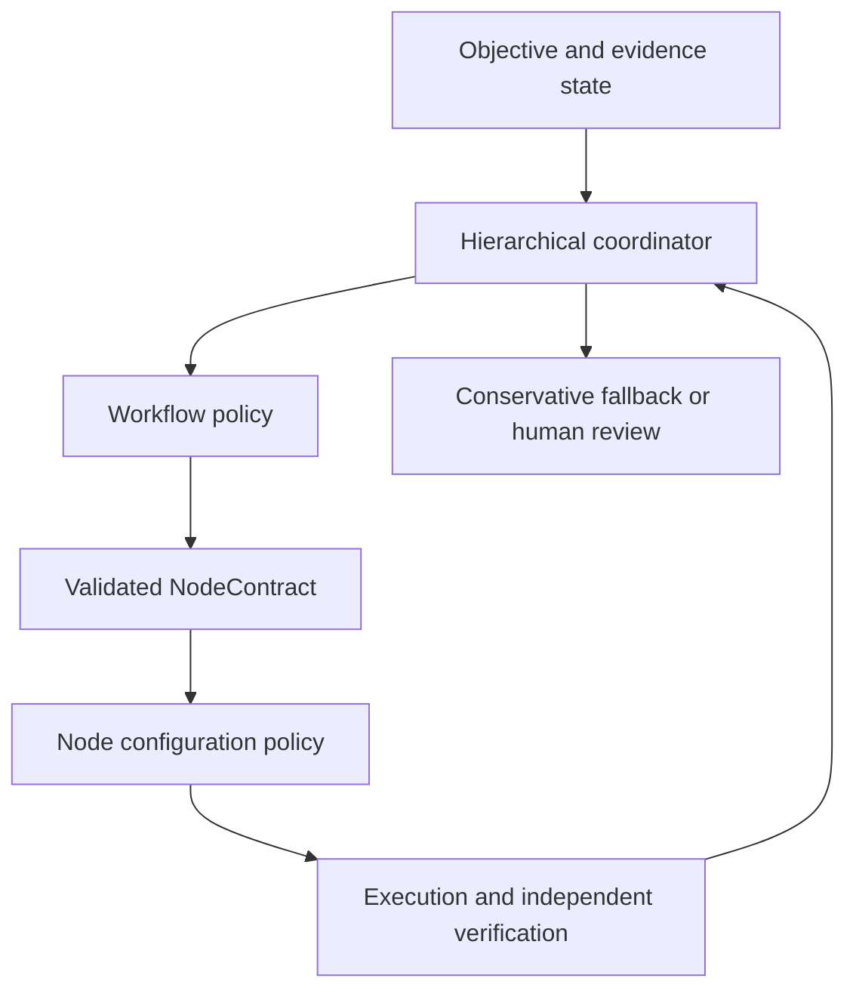

# Accretion v0.9 Software Design Description

## Joint Hierarchical Orchestration

**Document status:** Forward technical design baseline  
**Implementation authority:** Locked until the v0.8 exit gate passes  
**Primary domains:** Software engineering and AI research  
**Secondary evaluation:** Robotics simulation and offline physical replay  
**Excluded authority:** Learned permissions, learned safety rules, physical online exploration

---

## 1. Purpose

Accretion v0.9 coordinates two learned decisions that earlier releases deliberately isolate:

1. The v0.8 planner selects and revises workflow structure;
2. The v0.4-derived router selects a compatible runtime, model, tools, skills, verifier implementation, and environment for each workflow node.

The release tests whether a governed hierarchical policy can reduce total orchestration regret without producing unsafe coupling between graph planning and node configuration.

> v0.9 learns coordination between structure and execution configuration; it does not merge their authority.

The planner cannot select credentials or weaken verification. The router cannot redefine the graph or NodeContract. A deterministic compatibility and policy layer remains between them.

## 2. Research question

> On unseen Software/AI projects with familiar capability types, can a constrained hierarchical orchestration policy jointly coordinate workflow topology and node-level execution configurations to improve verified multi-objective utility over independently optimized planner and router baselines, while preserving the verified-success floor and critical safety behavior?

### 2.1 Primary claim

Lower constrained total orchestration regret than:

- Deterministic graph plus deterministic router;
- Governed LLM planner plus v0.4 learned router;
- v0.8 learned planner plus frozen v0.4 router;
- Alternating but non-joint planner/router optimization;
- A monolithic end-to-end orchestration baseline.

### 2.2 Why this is a separate release

A planner changes the distribution of nodes seen by the router. A router changes the cost, latency, and success of graph structures seen by the planner. Training them together introduces non-stationarity, confounding, incentive leakage, and a risk that one layer compensates for failures in another by weakening behavior. v0.9 therefore requires explicit layer contracts, alternating training stages, joint credit receipts, and separate rollback.

## 3. Scope

### 3.1 In scope

- Hierarchical orchestration state and action contracts;
- Planner/router interaction protocol;
- Compatibility-aware option catalog;
- Offline joint trajectory learning;
- Counterfactual plan/configuration evaluation;
- Alternating and joint-policy optimization experiments;
- Layer-specific and end-to-end credit assignment;
- Independent policy promotion and rollback;
- Guarded low-risk digital exploration after shadow validation;
- Project-specific adaptation over a team-workspace prior;
- Simulation-only embodiment experiments;
- Full decision explanation in Experiment Studio.

### 3.2 Out of scope

- Changing the approved ObjectiveContract without human approval;
- Learning permissions, OAuth scopes, credentials, safety envelopes, or approval rules;
- Learning verification semantics or success thresholds;
- Allowing the router to add/remove graph nodes;
- Allowing the planner to select raw provider credentials or bypass compatibility;
- Physical online exploration;
- Autonomous capability creation or installation;
- Model-weight recursive self-improvement.

## 4. Entry gates

v0.9 implementation requires:

1. v0.8 meets its pre-registered architecture-regret claim;
2. v0.8 has no critical false-acceptance regression;
3. v0.4 router and v0.8 planner have separately reproducible policy snapshots;
4. NodeContract, graph, failure, evidence, and ObjectiveContract schemas are stable;
5. Candidate sets and propensities exist for both layers;
6. The benchmark can execute registered plan/configuration combinations under matched conditions;
7. Separate planner and router rollback is proven;
8. Physical and high-risk execution can be mechanically excluded from exploration.

## 5. Inherited invariants

All v0.8 invariants remain normative. In addition:

1. Structural and configuration authority remain separate even when learned jointly.
2. The planner creates typed node requirements; the router satisfies them with compatible configurations.
3. Node verification requirements freeze before router selection.
4. Neither layer may use the other to bypass a denied capability.
5. Credit assignment cannot rewrite raw verifier evidence.
6. Final-run reward cannot convert a locally failed critical node into a success label.
7. Local success cannot override a failed final ObjectiveContract.
8. A joint policy snapshot references immutable component snapshots.
9. Promotion and rollback are possible per component and for the joint coordinator.
10. High-risk or physical decisions retain individual human authority.

## 6. Hierarchical formulation

### 6.1 Levels

The system uses three policy levels:

| Level | Decision | Authority boundary |
|---|---|---|
| L0 Objective governance | Human-approved quality/cost/latency/risk contract | Not learned |
| L1 Workflow policy | Graph edits, decomposition, revision, termination | Cannot choose privileged configuration |
| L2 Node policy | Compatible execution configuration for a frozen node | Cannot change structure or contract |

Deterministic policy, compatibility, and verification layers constrain both L1 and L2.

### 6.2 State

The joint state is:

\[
z_t=(s_t^{plan}, s_t^{node}, \phi_t, b_t, e_t)
\]

where:

- `s_plan` is the v0.8 planner state;
- `s_node` is the active NodeContract and compatible configuration context;
- `phi` is cross-layer summary information permitted by the interface;
- `b` is the shared resource budget;
- `e` is verified outcome and uncertainty history.

Raw prompts, secrets, hidden verifier answers, and non-permitted evidence are excluded.

### 6.3 Actions

L1 chooses a validated `GraphEdit` or invokes a typed node option. L2 chooses an `ExecutionConfiguration` from a compatibility-pruned set. The joint coordinator may set bounded resource allocations and information-sharing summaries, but it cannot directly execute a capability.

### 6.4 Options

A graph node is modeled as a temporally extended option:

```yaml
NodeOption:
  option_id: uuid
  node_contract_ref: object
  initiation_conditions: object
  eligible_configuration_set_ref: uuid
  termination_conditions: object
  local_verification_requirement_ref: uuid
  failure_routes: object
  budget_envelope: object
```

This allows the planner to reason about expected option outcomes without seeing credentials or bypassing node routing.

### 6.5 Utility and constraints

\[
U_p(G,K)=w_qQ-w_cC-w_lL-w_rR-w_hH
\]

where `K` is the sequence of node configurations. The optimization remains constrained by:

\[
P(VerifiedSuccess\mid G,K,p)\ge\tau_p
\]

and all policy, verifier, risk, approval, compatibility, and resource constraints.

Total orchestration regret is:

\[
Regret_{total}=U_p(G^*,K^*)-U_p(\hat G,\hat K)
\]

within the registered allowed search space.

## 7. Reference architecture



### 7.1 Components

| Component | Responsibility | Cannot do |
|---|---|---|
| Hierarchical Coordinator | Sequence L1/L2 decisions and shared budgets | Grant authority or execute tools |
| Workflow Policy | Select validated graph edits | Select credentials or alter node verification |
| Node Configuration Policy | Rank compatible configurations | Change graph topology |
| Contract Bridge | Compile planner node intent into frozen NodeContract | Invent missing permissions |
| Compatibility Pruner | Enforce runtime/model/tool/environment/verifier compatibility | Learn around hard constraints |
| Shared Budget Allocator | Allocate approved cost/latency/parallelism envelope | Expand total budget |
| Cross-Layer Feature Firewall | Allow typed summaries only | Pass secrets or verifier answer keys |
| Hierarchical Credit Assigner | Produce layer and joint labels | Modify raw evidence |
| Counterfactual Evaluator | Evaluate registered combinations | Claim causal certainty from weak logs |
| Joint Promotion Controller | Evaluate, canary, and rollback snapshots | Waive critical gates |

## 8. Core contracts

### 8.1 HierarchicalOrchestrationState

```yaml
HierarchicalOrchestrationState:
  state_id: uuid
  project_id: uuid
  run_id: uuid
  objective_contract_ref: object
  graph_ref: object
  planner_state_ref: uuid
  active_node_contract_ref: object | null
  eligible_configuration_set_ref: uuid | null
  shared_budget_state: object
  evidence_summary_refs: [uuid]
  failure_state: object | null
  approval_state: object
  risk_tier: string
  component_policy_refs: object
  feature_schema_version: string
```

### 8.2 ContractBridgeReceipt

```yaml
ContractBridgeReceipt:
  bridge_receipt_id: uuid
  source_graph_node_ref: object
  node_contract_ref: object
  required_capability_types: [string]
  frozen_verification_spec_ref: object
  environment_constraints: object
  data_classification: string
  risk_classification: string
  approval_requirement: object
  compilation_checks: [object]
  hash: sha256
```

### 8.3 JointCandidateSet

```yaml
JointCandidateSet:
  candidate_set_id: uuid
  state_id: uuid
  plan_candidates: [object]
  per_plan_configuration_summaries: [object]
  compatibility_pruning_receipts: [uuid]
  baseline_pair_ref: object
  behavior_policy_refs: object
  selection_propensities: object
```

The coordinator receives aggregated configuration distributions, not credentials or raw secret-bearing tool descriptions.

### 8.4 JointDecisionReceipt

```yaml
JointDecisionReceipt:
  decision_id: uuid
  state_id: uuid
  selected_plan_action_ref: uuid
  selected_node_configuration_ref: uuid | null
  expected_local_verified_success: object | null
  expected_final_verified_success: object
  expected_utility_components: object
  cross_layer_tradeoffs: [object]
  alternatives: [object]
  policy_constraints: [object]
  exploration_mode: NONE | SHADOW | GUARDED_DIGITAL
  policy_lineage: object
  override: object | null
```

### 8.5 HierarchicalOutcomeReceipt

```yaml
HierarchicalOutcomeReceipt:
  decision_id: uuid
  node_local_verification: object | null
  subgraph_verification: object | null
  final_run_verification: object
  utility_components: object
  layer_failure_attribution:
    planner: object
    router: object
    environment: object
    verifier_conflict: object
  causal_confidence: LOW | MEDIUM | HIGH
  training_eligibility: object
```

### 8.6 JointPolicySnapshot

```yaml
JointPolicySnapshot:
  joint_policy_id: string
  version: string
  planner_policy_ref: object
  router_policy_ref: object
  coordinator_policy_ref: object
  feature_schema_hash: sha256
  compatibility_registry_hash: sha256
  training_dataset_manifest_ref: uuid
  evaluation_report_ref: uuid
  promotion_status: CANDIDATE | SHADOW | CANARY | ACTIVE | RETIRED
  rollback_refs: object
```

## 9. Decision lifecycle

1. Load approved ObjectiveContract and immutable policy snapshots.
2. Build the planner state.
3. Generate and validate graph candidates.
4. For each viable node option, compile a NodeContract through the Contract Bridge.
5. Freeze verification and risk requirements.
6. Resolve compatible configuration sets.
7. Provide only typed aggregate configuration summaries to the planner/coordinator.
8. Rank allowed plan/configuration combinations under the shared utility.
9. Apply verified-success lower-bound and critical-cohort gates.
10. Fall back or request human review if evidence is insufficient.
11. Execute the node in an isolated environment.
12. Verify locally using the frozen independent verifier.
13. Feed typed outcome summaries to the planner.
14. Continue, reroute, replan, or pause according to failure taxonomy.
15. Perform final-run verification.
16. Store layer-specific and joint outcome receipts.

## 10. Failure ownership

| Failure class | First owner | Escalation |
|---|---|---|
| Runtime/model/tool unavailable | Node router | Planner only if capability requirement cannot be met |
| Configuration incompatibility | Compatibility layer/router | Human if no safe baseline |
| Local implementation failure | Router within retry cap | Planner if repeated failures imply bad decomposition |
| Structural dependency failure | Planner | Human if no valid bounded revision |
| Verification conflict | Evidence resolver | Human if unresolved |
| Objective infeasible | Planner + human | ObjectiveContract revision |
| Permission/risk denial | Human authority | Never learned around |
| Budget exhaustion | Coordinator | Human-approved revision or terminate |

## 11. Training program

### 11.1 Stage 0: frozen independent baselines

Evaluate v0.8 planner and v0.4 router independently. Record candidate sets, propensities, verification, budgets, and failure ownership.

### 11.2 Stage 1: shared value model

Train outcome estimators over typed joint state while keeping both policies frozen. Use node-local and final-run labels, but retain separate heads:

- Local verified success;
- Final verified success;
- Cost;
- Latency;
- Human burden;
- Failure class;
- Critical-regression risk.

### 11.3 Stage 2: alternating offline optimization

1. Freeze router; optimize planner against the registered router distribution.
2. Freeze planner; optimize router against the registered graph distribution.
3. Re-evaluate both on fixed holdout cohorts.
4. Repeat only while expected improvement exceeds the registered threshold.

### 11.4 Stage 3: constrained joint optimization

Optimize the coordinator on a restricted action surface. Planner and router component policies remain separately addressable. Monolithic end-to-end policy is an ablation, not the default production design.

### 11.5 Stage 4: shadow and guarded canary

Joint policy observes live low-risk digital tasks before any control. Guarded canary requires:

- Policy-valid reversible tasks;
- Validated plan and configuration candidates;
- Confidence floor;
- Hard exposure cap;
- Baseline fallback;
- Component-level rollback;
- No physical or high-risk exploration.

## 12. Credit assignment

### 12.1 Labels

- `r_local`: NodeContract verification outcome;
- `r_subgraph`: downstream evidence usefulness and structural progress;
- `r_final`: ObjectiveContract verification outcome;
- `r_cost`, `r_latency`, `r_human`, `r_risk`;
- `r_critical`: critical false acceptance or safety violation.

### 12.2 Rules

- Critical local failure cannot receive a positive training label because the final run succeeded through compensation.
- Final failure does not automatically make every locally correct node negative.
- Configuration failures assign primary loss to the router.
- Structural failures assign primary loss to the planner.
- Ambiguous attribution is retained with low causal confidence.
- Human overrides become evidence only after verification.
- Inconclusive outcomes train abstention and evidence gathering, not success.

### 12.3 Counterfactual evaluation

For selected benchmark tasks, execute matched alternatives:

- Same graph, different node configurations;
- Different graph, fixed node-router policy;
- Jointly varied graph/configuration pairs.

This factorial design estimates interactions and prevents claiming joint-policy gains from a single improved component.

## 13. Exploration governance

### 13.1 Exploration tiers

| Tier | Domain | Allowed |
|---|---|---|
| E0 | Any | Shadow only |
| E1 | Low-risk reversible digital | Guarded plan or router exploration, one layer at a time |
| E2 | Low-risk reversible digital | Guarded joint exploration after E1 evidence |
| E3 | Robotics simulation | Shadow, then registered offline/simulation experiment |
| E4 | Physical/high-risk | No online learning exploration |

### 13.2 Safety floor

Exploration requires a lower-confidence bound on verified success above the ObjectiveContract floor. Critical cohorts use a no-regression rule, not an average utility tradeoff.

## 14. Promotion and rollback

### 14.1 Promotion units

- Planner component;
- Router component;
- Coordinator component;
- Complete joint snapshot.

### 14.2 Required evidence

- Pre-registered paired evaluation;
- Minimum effect size and confidence interval;
- Total and component regret;
- Critical cohort non-regression;
- Calibration and abstention;
- Interaction ablation;
- Shadow and canary report;
- Rollback validation;
- Human promotion approval.

### 14.3 Rollback triggers

- Verified-success floor breach;
- Any critical false-acceptance increase;
- Policy or secret boundary breach;
- Component feature-schema mismatch;
- Significant cohort regression;
- Unexpected graph/configuration oscillation;
- Audit-lineage loss.

## 15. APIs

| Method | Endpoint | Purpose |
|---|---|---|
| POST | `/api/v1/orchestration/states` | Build typed joint state |
| POST | `/api/v1/orchestration/contract-bridge` | Compile node intent |
| POST | `/api/v1/orchestration/candidate-sets` | Generate plan/config pairs |
| POST | `/api/v1/orchestration/decisions` | Record joint decision |
| POST | `/api/v1/orchestration/outcomes` | Attach verification and utility |
| POST | `/api/v1/orchestration/overrides` | Record compatible human override |
| GET | `/api/v1/orchestration/policies/{id}` | Inspect snapshot lineage |
| POST | `/api/v1/orchestration/promotions` | Run promotion pipeline |
| POST | `/api/v1/orchestration/rollback` | Roll back component or joint policy |

Mutations require idempotency, actor identity, project authorization, and version guards.

## 16. Events and persistence

### 16.1 Events

- `orchestration.state.built`;
- `contract_bridge.compiled` / `rejected`;
- `orchestration.candidates.generated`;
- `orchestration.decision.recorded`;
- `orchestration.layer_failure.classified`;
- `orchestration.outcome.recorded`;
- `orchestration.policy.shadowed` / `promoted` / `rolled_back`;
- `orchestration.regret.measured`.

### 16.2 Tables

- `hierarchical_states`;
- `contract_bridge_receipts`;
- `joint_candidate_sets`;
- `joint_decisions`;
- `hierarchical_outcomes`;
- `joint_policy_snapshots`;
- `joint_promotion_runs`;
- `counterfactual_factorial_trials`;
- `cross_layer_feature_schemas`;
- `component_rollbacks`.

All records link to immutable graphs, NodeContracts, verifier evidence, and policy snapshots.

## 17. Experiment Studio

The developer-researcher can inspect:

- Current graph and active node;
- L1 structural decision and alternatives;
- L2 configuration decision and alternatives;
- Contract Bridge output;
- Compatibility pruning;
- Shared resource allocation;
- Local and final verified-success estimates;
- Cross-layer tradeoffs;
- Failure ownership;
- Planner, router, coordinator, registry, and objective versions;
- Shadow/canary state;
- Human override among compatible candidates;
- Component and total regret.

The UI must visually separate learned suggestions, deterministic gates, human authority, execution, and verification.

## 18. Security and threat model

### 18.1 Threats

- Planner encodes privileged behavior into a node description;
- Router chooses a tool whose side effects exceed the NodeContract;
- Cross-layer feature channel leaks secrets;
- Joint reward encourages verifier gaming;
- Planner/router oscillate to consume budget;
- One component masks another's critical regression;
- Joint snapshot becomes irreproducible due to version skew;
- Physical replay data accidentally enables live exploration.

### 18.2 Controls

- Typed Contract Bridge and capability normalization;
- Hard compatibility/policy pruning;
- Feature firewall and data classification;
- Independent verification and frozen semantics;
- Component-specific outcome heads and regression gates;
- Oscillation and resource detectors;
- Signed immutable joint manifest;
- Physical/live actuator deny rule in the exploration gateway;
- Human promotion and immediate rollback.

## 19. Reliability

- Coordinator unavailable: run v0.8 planner plus stable router independently;
- Planner component unavailable: static governed graph plus stable router;
- Router unavailable: deterministic conservative configuration baseline;
- Contract Bridge failure: do not execute node;
- Feature-schema mismatch: reject joint snapshot;
- Evidence unavailable: freeze adaptation and use baseline;
- Verifier unavailable: pause or use preapproved equivalent;
- Telemetry incomplete: exclude trajectory from training.

## 20. Benchmark design

### 20.1 Task distribution

Unseen Software/AI projects, familiar capability types, held-out project lineages, matched budgets, and registered objective weights.

### 20.2 Factorial arms

| Planner | Router | Purpose |
|---|---|---|
| Deterministic | Deterministic | Minimum baseline |
| Governed LLM | v0.4 | Strong manual/dynamic baseline |
| v0.8 | Deterministic | Planner contribution |
| v0.8 | v0.4 | Independently optimized baseline |
| Alternating v0.9 | Alternating v0.9 | Coordination contribution |
| Full joint v0.9 | Full joint v0.9 | Primary candidate |

### 20.3 Metrics

- Total constrained orchestration regret;
- Architecture regret;
- Configuration regret;
- Verified objective completion;
- Node-local verified success;
- Critical false acceptances;
- Cost, latency, human burden;
- Structural and configuration recovery;
- Calibration and abstention;
- Cross-layer oscillation;
- Worst-cohort utility;
- Reproducibility.

### 20.4 Statistical gate

Pre-register the paired design, minimum effect, confidence interval, safety non-regression, and interaction ablation. Report negative and inconclusive findings.

## 21. Implementation milestones

| Milestone | Deliverable | Exit evidence |
|---|---|---|
| H0 | Freeze hierarchical protocol | Interface and authority review |
| H1 | Contract Bridge and feature firewall | Adversarial conformance tests |
| H2 | Joint state/candidate logging | Reproducible receipts |
| H3 | Shared value model | Holdout calibration |
| H4 | Alternating offline optimizer | Component regret report |
| H5 | Joint coordinator | Constrained offline evaluation |
| H6 | Factorial benchmark | Interaction estimates |
| H7 | Shadow deployment | No critical boundary failures |
| H8 | Low-risk digital canary | Rollback and exposure caps pass |
| H9 | Pre-registered evaluation | Primary claim report |

## 22. Release acceptance criteria

1. Planner, router, and coordinator have separate immutable policy identities.
2. The planner cannot select a raw credential or unregistered tool.
3. The router cannot change graph structure or NodeContract semantics.
4. Contract Bridge output is deterministic for the same versioned input.
5. Verification requirements freeze before routing.
6. Cross-layer features follow an explicit versioned schema.
7. Secrets and verifier answer keys cannot cross the feature firewall.
8. All candidates pass hard compatibility pruning.
9. A denied action cannot become allowed through joint optimization.
10. Local and final verification labels remain separate.
11. Critical local failure cannot be relabeled positive by final success.
12. Structural and configuration failures have distinct ownership.
13. Planner and router retries share server-enforced resource caps.
14. Oscillation detection terminates unproductive cross-layer loops.
15. Low expected-value continuation terminates automatically.
16. Inconclusive verification follows evidence resolution then human review.
17. Contradictory evidence is preserved.
18. Candidate sets and propensities exist at both levels.
19. Joint decisions produce immutable receipts.
20. Human overrides stay policy-compatible and are reasoned/audited.
21. Overrides do not become positive learning evidence without verification.
22. Training uses compatible, visible, verified experience only.
23. Team-workspace prior and project adapter remain versioned separately.
24. Shadow mode has no execution authority.
25. Guarded exploration is low-risk, digital, reversible, and opt-in.
26. Robotics simulation exploration is isolated from live control.
27. Physical online exploration is mechanically blocked.
28. Component and joint rollback are tested.
29. Feature-schema mismatch prevents activation.
30. Critical correctness/safety regression blocks promotion.
31. Bounded non-critical tradeoffs are disclosed by cohort.
32. Factorial evaluation isolates planner, router, and interaction effects.
33. The strongest independent baseline is included.
34. Experiment Studio exposes both decision levels and authority boundaries.
35. Every accepted run is reproducible from pinned joint lineage.
36. v0.9 meets its pre-registered total-regret claim or remains experimental.

## 23. Open questions and proposed defaults

| ID | Question | Proposed default |
|---|---|---|
| OQ-901 | Production policy structure? | Modular planner/router plus small coordinator |
| OQ-902 | Monolithic end-to-end policy? | Ablation only |
| OQ-903 | First training mode? | Alternating offline optimization |
| OQ-904 | First online mode? | One-layer-at-a-time guarded exploration |
| OQ-905 | Cross-layer information? | Typed outcome distributions and budgets only |
| OQ-906 | Shared representation learning? | Offline experiment behind feature firewall |
| OQ-907 | Option duration? | Node/subgraph until typed termination |
| OQ-908 | Joint candidate limit? | Top 3 plans × top 3 configurations |
| OQ-909 | Causal attribution? | Factorial execution plus conservative confidence |
| OQ-910 | Reward aggregation? | Separate heads; ObjectiveContract combines utility |
| OQ-911 | Critical failure penalty? | Hard gate, not finite utility penalty |
| OQ-912 | Planner sees model identity? | Capability/performance summary, identity optional ablation |
| OQ-913 | Router sees global graph? | Bounded structural summary, not unrestricted graph text |
| OQ-914 | Human override granularity? | Plan and configuration separately |
| OQ-915 | Project adapter method? | Regularized residual over workspace prior |
| OQ-916 | Cohort minimum size? | Pre-register; abstain when confidence insufficient |
| OQ-917 | Simulation in primary claim? | Secondary only |
| OQ-918 | Physical replay usage? | Offline value/calibration research only |
| OQ-919 | Promotion approver? | Workspace research owner plus safety owner if Robotics affected |
| OQ-920 | Rollback target? | Last known good component-compatible joint manifest |

## 24. Technical foundations

- [Learning to Configure Agentic AI Systems](https://arxiv.org/abs/2602.11574)
- [Agent Lightning](https://arxiv.org/abs/2508.03680)
- [Workflow-R1](https://arxiv.org/abs/2602.01202)
- [AFlow](https://arxiv.org/abs/2410.10762)
- [Optimizing Agents with Better Prompts and Topologies](https://arxiv.org/abs/2502.02533)

These sources motivate hierarchical configuration, trajectory-level learning, and workflow optimization. Accretion's separation of authority, factorial evaluation, frozen verification, and human promotion are stricter project requirements.

## 25. Handoff gate to v0.10

Guarded capability evolution remains locked until:

1. v0.9 improves total constrained regret over the strongest independent baseline;
2. Planner, router, and interaction effects are separated empirically;
3. No critical correctness, policy, secret, or safety regression occurs;
4. Joint decisions remain interpretable and reproducible;
5. Component rollback is proven under canary failure;
6. Failure patterns reveal a measurable capability gap that routing/planning alone cannot solve;
7. A human research owner approves capability evolution as the next boundary.

