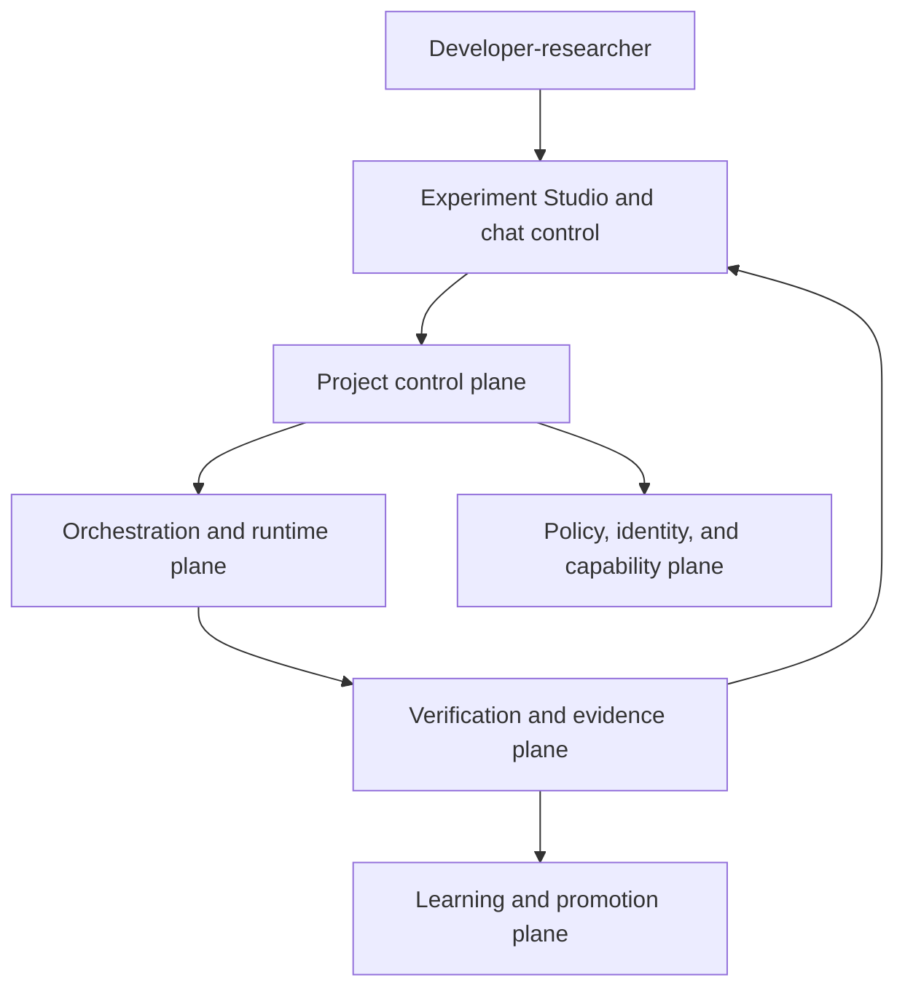
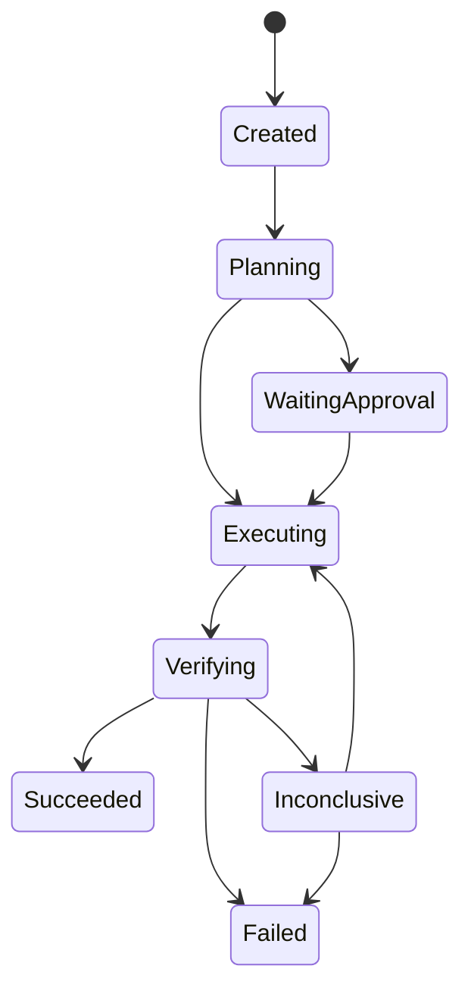

# Accretion v1.0 Software Design Description

## Evidence-Governed Research and Development Operating System

**Document status:** Forward technical design baseline  
**Release authority:** Locked until all v0.4-v0.10 evidence gates pass  
**Primary user:** Developer-researcher  
**Primary domains:** Software engineering, AI research, and governed Robotics research  
**Product identity:** Adaptive R&D Meta-Harness and Experiment Studio

---

## 1. Purpose

Accretion v1.0 is the stable integration of the project's verified capabilities into an evidence-governed R&D operating system. It converts a rough goal into an approved objective, constructs a governed workflow, selects compatible execution configurations, executes across heterogeneous runtimes and tools, independently verifies results, preserves evidence and contradictions, reproduces runs, and improves policies and capabilities only through explicit promotion gates.

v1.0 is not a claim of autonomous science, artificial general intelligence, perfect verification, one model controlling every robot, or unrestricted self-improvement. It is a reliable substrate that keeps research questions, implementation, experiments, evidence, verification, and human authority in one structured system.

## 2. Golden direction compliance

The product promise is:

> Give Accretion a rough research or development goal. It structures the goal into an approved objective, constructs and executes a governed workflow, selects the best compatible execution configuration for each graph node, independently verifies the results, preserves evidence and contradictions, and learns cautiously from verified experience.

The v1.0 flagship remains:

> Reproduce and extend an AI research paper at reduced scale, expand only when evidence is promising, and produce a publishable adaptive-orchestration result with reproducible artifacts.

Robotics is the second major domain, entered through simulation, governed physical trials, and verified cross-embodiment transfer—not through a universal raw-control model.

## 3. v1.0 does and does not mean

### 3.1 v1.0 means

- Structured project/run/evidence workspace with chat as control;
- Web Experiment Studio and live run dashboard;
- Claude, Codex, and replaceable runtime adapters;
- Direct, loop, graph, and hybrid execution;
- Static, dynamic, learned, and human-overridden planning under policy;
- Node-level learned configuration routing;
- Independent verification and contradiction resolution;
- Reproducible software, AI, simulation, and approved physical trials;
- MCP/plugin/capability integration with SSO/OAuth separation and token brokerage;
- Team experience prior with project adaptation;
- Evidence-gated policy and capability promotion;
- Research-object export and provenance interoperability;
- Operational security, reliability, audit, backup, and rollback.

### 3.2 v1.0 does not mean

- Every result is correct;
- Inconclusive results become accepted automatically;
- Human judgment is eliminated;
- Any plugin receives permission because it is installed;
- A model receives raw OAuth or robot-control authority;
- Learned online exploration occurs on physical/high-risk tasks;
- One workflow policy generalizes to all domains without validation;
- Capabilities self-install or self-authorize;
- Accretion replaces lower-level robotics controllers or real-time safety systems.

## 4. Permanent invariants

1. Incorrect acceptance is the highest-severity product failure.
2. The backend project/run/evidence model is authoritative.
3. Chat and UI actions compile into typed commands; they are not the source of truth.
4. ObjectiveContract changes are versioned, impact-analyzed, and human-approved.
5. Verification is defined before execution; routing/planning cannot weaken it.
6. Deterministic evidence is preferred, independent model judgment is secondary, and unresolved cases pause for human review.
7. Human approval is not verification.
8. Producers cannot be their sole acceptance authority.
9. Contradictory evidence is preserved until resolved.
10. Mutable execution is isolated by project/run/candidate.
11. Models use capabilities, never raw secrets.
12. Plugin manifest is a capability request, not authority.
13. SSO establishes identity; OAuth/OIDC connections establish external authorization.
14. Every automatic loop has resource and expected-improvement termination.
15. Team experience is shared by default but policy- and compatibility-filtered.
16. Policy learning uses versioned offline promotion, holdouts, critical gates, and rollback.
17. Physical/high-risk trials require one approval per exact trial.
18. Real-time robot safety remains outside the generative model path.
19. Capability evolution cannot self-authorize or self-promote.
20. Later releases cannot silently weaken earlier gates.

## 5. System context



## 6. Plane architecture

### 6.1 Project control plane

- Project and workspace tenancy;
- ObjectiveContract lifecycle;
- Run, graph, node, experiment, and approval state machines;
- Command API and event sourcing;
- Budget, risk, data-classification, and retention governance;
- Project templates and research protocols.

### 6.2 Orchestration and runtime plane

- Task profiler;
- Strategy selector: Direct, Loop, Graph, Hybrid;
- Static/dynamic/learned workflow planner;
- Hierarchical orchestration coordinator;
- Node configuration router;
- Claude/Codex/other `AgentRuntime` adapters;
- Isolated worktrees, containers, compute jobs, and simulator sessions;
- Failure recovery and termination control.

### 6.3 Capability, integration, and identity plane

- Capability Registry;
- Plugin and Connector Registry;
- MCP Gateway aligned with the current MCP specification;
- Local/remote MCP and direct API adapters;
- Policy Engine;
- Connection Resolver;
- Token Broker;
- OIDC/SSO identity and separate OAuth connections;
- Approval and scope governance;
- Supply-chain and capability health.

### 6.4 Verification and evidence plane

- VerificationSpec Registry;
- Deterministic and independent model verifier implementations;
- Human review queue;
- Claim/evidence graph;
- Contradiction Register;
- Provenance and artifact store;
- Reproducibility bundles;
- Benchmark/evaluation service.

### 6.5 Learning and promotion plane

- Experience eligibility and compatibility;
- Team prior and project adapters;
- Offline router/planner/coordinator training;
- Shadow and guarded digital exploration;
- Policy Registry and promotion;
- Guarded capability candidate factory;
- Independent evaluation, canary, rollback, and audit.

### 6.6 Robotics plane

- Embodiment Registry and adapters;
- Simulation Gateway;
- Physical Trial Gateway;
- Calibration and environment snapshots;
- Lower-level ROS 2/MoveIt/controller interfaces;
- Independent real-time safety supervisor, watchdog, and E-stop;
- Sensor/task/safety verification;
- Cross-embodiment transfer registry.

## 7. Authority matrix

| Actor/component | May propose | May execute | May verify | May approve/promote |
|---|---:|---:|---:|---:|
| Developer-researcher | Yes | Through governed command | Human review | Yes by role |
| Planner | Graph edits | No direct capability | No | No |
| Node router | Configurations | No direct capability | No | No |
| Runtime worker | Artifact/action output | Within assigned contract | Evidence only | No |
| Verifier | Additional evidence request | Verification capability | Yes | No promotion |
| Policy Engine | Allow/deny decision | Enforce only | Policy audit | No |
| Capability proposer | Candidate change | Sandbox only | No sole evaluation | No |
| Promotion service | No | Canary deploy after signatures | Check gates | Enforce signed human decision |
| Robot safety supervisor | Stop/limit | Real-time safety action | Safety telemetry | No research acceptance |

## 8. Authoritative data model

### 8.1 Root entities

- `Workspace`;
- `Principal` and `RoleBinding`;
- `Project`;
- `ObjectiveContract`;
- `ResearchProtocol`;
- `Run`;
- `RunGraph` and `GraphRevision`;
- `NodeContract` and `NodeExecution`;
- `ExecutionConfiguration` and `RoutingDecisionReceipt`;
- `VerificationSpec`, `VerificationResult`, and `HumanReview`;
- `Claim`, `Evidence`, `Contradiction`, and `Resolution`;
- `Artifact` and `EnvironmentSnapshot`;
- `ExperienceRecord` and policy snapshot;
- `Capability`, `Plugin`, `Connection`, and policy decision;
- `Embodiment`, `PhysicalTrial`, and safety record;
- `CandidateCapability`, evaluation, promotion, and rollback.

### 8.2 Identity and version rules

- Every mutable logical object has an immutable version record;
- Content-bearing records have a cryptographic hash;
- References include schema and object version;
- Deletion uses retention-aware tombstones where audit is required;
- Training features link back to immutable raw evidence;
- A run pins all contract, graph, policy, capability, environment, runtime, model, and verifier versions.

### 8.3 Project

```yaml
Project:
  project_id: uuid
  workspace_id: uuid
  title: string
  domain: SOFTWARE | AI | ROBOTICS_SIM | ROBOTICS_PHYSICAL | MIXED
  objective_contract_current_ref: object
  research_protocol_ref: object | null
  risk_profile_ref: object
  utility_profile_ref: object
  data_classification: string
  experience_visibility: PRIVATE | TEAM_WORKSPACE
  policy_profile_ref: object
  status: DRAFT | ACTIVE | PAUSED | COMPLETED | ARCHIVED
```

### 8.4 Run

```yaml
Run:
  run_id: uuid
  project_id: uuid
  objective_contract_ref: object
  graph_ref: object
  policy_manifest_ref: object
  capability_manifest_ref: object
  environment_manifest_ref: object
  budget: object
  risk_tier: string
  status: CREATED | PROFILING | PLANNING | WAITING_APPROVAL |
          EXECUTING | VERIFYING | INCONCLUSIVE | FAILED |
          SUCCEEDED | CANCELLED
  final_verification_ref: uuid | null
  provenance_root_ref: uuid
```

### 8.5 Evidence

```yaml
Evidence:
  evidence_id: uuid
  claim_id: uuid
  evidence_type: DETERMINISTIC | EMPIRICAL | MODEL_JUDGMENT | HUMAN_JUDGMENT
  artifact_refs: [uuid]
  activity_ref: uuid
  producing_agent_ref: object
  environment_ref: object
  verifier_result_refs: [uuid]
  quality: object
  status: SUPPORTS | REFUTES | AMBIGUOUS
  provenance_hash: sha256
```

## 9. Project lifecycle

### 9.1 Rough-goal intake

The user provides an incomplete goal. Accretion asks only material questions and proposes:

- Objective and success claims;
- Verified-success floor;
- Utility weights for quality, cost, latency, risk, and human burden;
- Budget and scale progression;
- Data and permission boundaries;
- Required verifiers;
- Human approval gates;
- Reproduction and publication outputs.

The user approves the ObjectiveContract before execution.

### 9.2 Planning

The planner selects a static, dynamic, or learned graph path permitted by project policy. Deterministic validation compiles it into a RunGraph.

### 9.3 Execution

Each graph node is routed independently through compatibility pruning. Mutable nodes receive isolated workspaces. Tool use flows through capabilities and policy.

### 9.4 Verification

Every node and final run follow frozen VerificationSpecs. Unresolved conflicts become inconclusive and enter evidence resolution/human review.

### 9.5 Experience

Only eligible verified outcomes become experience. Failures and contradictions remain retrievable. Compatibility filters precede transfer.

### 9.6 Reproduction and extension

Accretion replays the registered baseline at reduced scale, compares expected and observed behavior, then opens an extension hypothesis only if evidence and the ObjectiveContract allow expansion.

### 9.7 Export and publication

The system emits a versioned research object containing protocol, source, data references, environments, graph, traces, evidence, verification, analysis, limitations, and machine-readable provenance.

## 10. State machines

### 10.1 Run state



Cancellation and policy denial can enter a terminal state from any non-terminal state. Physical runs cannot leave `WaitingApproval` without a valid one-trial approval.

### 10.2 Node state

`PENDING → ROUTING → READY → RUNNING → VERIFYING → PASS | FAIL | INCONCLUSIVE | CANCELLED`.

Retries create new `NodeExecution` records; they do not overwrite evidence.

### 10.3 Policy promotion state

`CANDIDATE → OFFLINE_EVALUATED → SHADOW → CANARY → ACTIVE → RETIRED/ROLLED_BACK`.

Critical failure can transition any deployed state to `REVOKED`.

## 11. Capability and MCP architecture

### 11.1 Normalized capability call

```yaml
CapabilityInvocation:
  invocation_id: uuid
  principal_ref: object
  project_id: uuid
  run_id: uuid
  node_execution_id: uuid
  capability_ref: {id: string, version: string}
  input: object
  declared_effect: READ | WRITE | EXTERNAL_SIDE_EFFECT | PHYSICAL
  connection_ref: uuid | null
  policy_decision_ref: uuid
  approval_ref: uuid | null
  idempotency_key: string
```

### 11.2 Invocation path

`Agent → Capability Registry → Policy Engine → Connection Resolver → Token Broker → MCP/API/local tool → normalized result`.

Workers receive opaque capability references and scoped results, never refresh tokens or secret-store access.

### 11.3 MCP

The Gateway supports the current MCP protocol through versioned adapters rather than coupling domain workflows directly to raw server tool names. MCP servers expose tools/resources/prompts; Accretion maps them to stable capability IDs and applies its own policy, connection, approval, audit, and health layers.

### 11.4 Plugin

A plugin packages requested capabilities, skills, adapters, verifiers, UI metadata, and connection requirements. Installation registers a request; policy and connection authorization remain separate.

## 12. Verification architecture

### 12.1 Verification hierarchy

1. Deterministic checks: tests, schemas, numerical assertions, reproducible commands, safety limits;
2. Independent model judgment: rubric-driven, separate context, preferably different runtime;
3. Cross-verifier corroboration;
4. Human review if material uncertainty remains.

### 12.2 VerificationResult

```yaml
VerificationResult:
  verification_result_id: uuid
  verification_spec_ref: object
  verifier_implementation_ref: object
  subject_refs: [uuid]
  claim_results: [object]
  evidence_refs: [uuid]
  status: PASS | FAIL | INCONCLUSIVE
  conflicts: [object]
  independence_receipt: object
  environment_ref: object
  created_at: timestamp
  hash: sha256
```

### 12.3 False-acceptance response

Any confirmed incorrect accepted result triggers:

- Incident severity critical;
- Freeze affected verifier/policy/capability versions;
- Identify all dependent claims and experiences;
- Quarantine derived learning data;
- Re-verify affected outputs;
- Roll back if applicable;
- Record public/internal research limitation according to policy.

## 13. Evidence and provenance

### 13.1 Internal provenance graph

Accretion maps its provenance to entities, activities, and agents, compatible with the conceptual structure of W3C PROV. It records derivation, usage, generation, association, and attribution without forcing the transactional database to use RDF internally.

### 13.2 Research object export

The default export profile uses RO-Crate 1.3-compatible JSON-LD and contains:

- ObjectiveContract and research protocol;
- Workflow definitions and graph versions;
- Code, configuration, environment, data, and model references;
- Artifacts and checksums;
- Execution and verification summaries;
- Evidence/contradiction records;
- Human approvals and reviews, redacted as policy requires;
- Reproduction instructions;
- License and citation metadata.

### 13.3 Evidence classes

- `REPORTED`: directly stated by a source;
- `SYNTHESIZED`: combined from sources;
- `INFERRED`: reasoned from evidence;
- `PROPOSED`: Accretion or human hypothesis/design.

Claims cannot silently cross evidence classes.

## 14. Experience and learning

### 14.1 Eligibility

An experience is training/retrieval eligible only when:

- Local and final verification lineage is complete;
- No unresolved critical contradiction exists;
- Policy permits workspace use;
- Contract, capabilities, environment, risk, and verifier are typed;
- Data is not quarantined by incident;
- Behavior-policy and candidate-set metadata meet the intended evaluation method.

### 14.2 Scope

- Workspace prior;
- Project-specific adapter;
- Cross-domain experience as capped weak prior;
- Shadow validation before higher influence;
- Physical evidence remains embodiment- and safety-specific.

### 14.3 Promotion

Offline versioned training, compatibility checks, holdout evaluation, confidence/minimum effect, critical cohort non-regression, canary, human approval, and rollback.

## 15. Robotics architecture

### 15.1 Control hierarchy

| Layer | Responsibility | Typical latency |
|---|---|---|
| Accretion | Objective, experiment, graph, evidence, verification | Seconds to hours |
| Task planner | Task/skill sequencing | Seconds |
| Motion planner/controller | Trajectory and feedback control | Milliseconds to seconds |
| Safety supervisor | Independent stop/limit path | Real time |
| Hardware driver | Device I/O | Real time |

### 15.2 Physical trial path

1. Exact PhysicalTrialContract;
2. Calibration/environment/safety snapshots;
3. Simulation and preflight verification;
4. Individual human approval consumed when armed;
5. Execution through lower-level controller;
6. Independent watchdog/E-stop and sensing;
7. Separate task and safety verification;
8. Immutable episode/incident record.

### 15.3 Cross embodiment

Transfer uses typed task invariants, capability requirements, observation/action semantics, environment, risk, and verifier mapping. Source evidence is a capped weak prior; target verification creates target authority. Negative transfer triggers fallback to target baseline.

## 16. APIs

### 16.1 Core project APIs

| Method | Endpoint | Purpose |
|---|---|---|
| POST | `/api/v1/projects` | Create structured project |
| POST | `/api/v1/projects/{id}/objective-proposals` | Propose ObjectiveContract |
| POST | `/api/v1/objectives/{id}/approve` | Approve version |
| POST | `/api/v1/runs` | Create run |
| POST | `/api/v1/runs/{id}/plan` | Generate/validate graph |
| POST | `/api/v1/runs/{id}/start` | Start eligible run |
| POST | `/api/v1/runs/{id}/cancel` | Cancel run |
| GET | `/api/v1/runs/{id}` | Authoritative snapshot |
| GET | `/api/v1/runs/{id}/events` | SSE/event replay |

### 16.2 Evidence and research APIs

| Method | Endpoint | Purpose |
|---|---|---|
| POST | `/api/v1/claims` | Register claim |
| POST | `/api/v1/evidence` | Append evidence |
| POST | `/api/v1/contradictions` | Register contradiction |
| POST | `/api/v1/verifications` | Submit verification result |
| POST | `/api/v1/human-reviews` | Resolve/annotate inconclusive case |
| POST | `/api/v1/runs/{id}/reproduce` | Start pinned reproduction |
| POST | `/api/v1/projects/{id}/export-ro-crate` | Export research object |

### 16.3 Administration APIs

- Capabilities/plugins/connectors/connections;
- Policy and role bindings;
- Policy/planner/router promotion and rollback;
- Capability evolution and canary;
- Embodiments, simulations, physical approvals, incidents;
- Audit, retention, backups, and system health.

## 17. Event architecture

### 17.1 Event envelope

```yaml
EventEnvelope:
  event_id: uuid
  event_type: string
  schema_version: string
  occurred_at: timestamp
  workspace_id: uuid
  project_id: uuid | null
  run_id: uuid | null
  actor_ref: object
  correlation_id: uuid
  causation_id: uuid | null
  payload: object
  classification: string
  integrity_hash: sha256
```

### 17.2 Requirements

- At-least-once delivery with idempotent consumers;
- Ordered per run/aggregate where state transitions require it;
- Durable replay for UI and recovery;
- Schema registry and backward-compatibility tests;
- Dead-letter handling without silent event loss;
- Redaction/tokenization for sensitive fields;
- Audit correlation across capability calls and external effects.

## 18. Persistence architecture

### 18.1 Stores

- Relational transactional store for authoritative metadata/state;
- Object store for artifacts, traces, datasets, exports, and large evidence;
- Append-only event/audit store;
- Search index for permitted evidence and experience retrieval;
- Feature/training store derived from immutable evidence;
- Secret store accessible only through Token Broker;
- Optional graph projection for provenance/claim queries.

### 18.2 Transactional patterns

- Outbox pattern for state + event consistency;
- Idempotency keys for external effects;
- Optimistic concurrency on objective, graph, policy, and approval versions;
- Saga/compensation for multi-service workflows;
- Content-addressed artifacts;
- Database migrations with forward/backward compatibility window.

### 18.3 Retention

Retention is workspace-configurable but cannot delete evidence required by an active incident, publication, approval, or regulated project. Training removal uses lineage-driven quarantine and re-materialization.

## 19. Identity, tenancy, and secrets

### 19.1 Identity

- OIDC SSO authenticates principals;
- Workspace/project roles authorize Accretion actions;
- External OAuth connections are separate per user or workspace;
- Service identities are short-lived and scoped;
- Approval records use strong actor identity and anti-replay checks.

### 19.2 Tenancy

- Workspace is the primary tenant boundary;
- Project provides policy, data, experience, and budget boundary;
- Run/candidate provides mutable execution isolation;
- Cross-workspace experience is denied by default;
- Shared artifacts retain owner and recipient policy.

### 19.3 Secrets

- Encrypted at rest/in transit;
- Never placed in prompts, model-visible logs, graph state, or exported research objects;
- Injected server-side for the minimum capability call;
- Redacted from traces and errors;
- Rotatable/revocable by connection;
- Audited by opaque handle.

## 20. Deployment topology

### 20.1 Local developer profile

- Single-node control plane;
- Local database/object storage option;
- Claude/Codex CLI adapters;
- Local containers/worktrees;
- Optional remote model/tool connections;
- No physical robotics without configured safety services.

### 20.2 Team profile

- High-availability API/control services;
- Managed relational/object/event stores;
- Worker pools for runtimes, verifiers, benchmarks, and training;
- Central identity, Token Broker, policy, and audit;
- Isolated candidate/simulation/robot gateways;
- Backup and disaster recovery.

### 20.3 Network zones

- Public ingress/UI;
- Control plane;
- Worker execution;
- Candidate factory;
- Verification/evaluation;
- Secret/integration egress;
- Robotics/safety network.

Default deny between zones; use explicit service identities and policies.

## 21. Reliability and SLOs

### 21.1 Proposed v1.0 SLOs

| Service indicator | Proposed target |
|---|---:|
| Authoritative API availability | 99.9% team profile |
| Accepted command durability | 99.99% |
| Event-to-UI p95 latency | < 2 seconds |
| Run-state recovery after orchestrator restart | < 60 seconds |
| Audit correlation completeness | 100% consequential actions |
| Secret exposure to model-visible data | 0 |
| Physical trial without valid exact approval | 0 |
| Critical false acceptance | Release-blocking; incident on occurrence |
| Reproduction bundle integrity | 100% checksum validation |

Targets must be validated against deployment capacity before release.

### 21.2 Degraded modes

- Learned policy unavailable: deterministic/governed baseline;
- Provider unavailable: compatible alternate or pause;
- Verifier unavailable: equivalent preapproved verifier or pause;
- Evidence retrieval unavailable: execute without learning transfer only if contract permits;
- Integration unavailable: node waits/fails typed; no credential workaround;
- UI unavailable: API state remains authoritative;
- Event lag: snapshot reconciliation and replay;
- Robotics safety path unavailable: physical execution impossible.

### 21.3 Disaster recovery

- Encrypted backups;
- Point-in-time database recovery;
- Versioned object retention;
- Event-log recovery procedure;
- Secret/connection reauthorization plan;
- Quarterly restore drill in team profile;
- Documented RPO/RTO per deployment tier.

## 22. Observability and audit

### 22.1 Metrics

- Verified objective completion;
- False acceptance and verifier disagreement;
- Node, architecture, and total orchestration regret;
- Cost, latency, resource, and human burden;
- Routing/planning abstention and override;
- Recovery/replanning loops;
- Capability health and policy denials;
- Experience transfer/negative transfer;
- Physical task/safety outcomes;
- Promotion/canary/rollback;
- Reproducibility success.

### 22.2 Traces

Distributed trace spans connect user command, plan, graph/node, routing, runtime, capability, external service, artifact, verification, and evidence. Sensitive data is redacted at ingestion.

### 22.3 Audit

Consequential actions record principal, authority, policy version, approval, capability, connection handle, input/output hashes, external-effect receipt, and result. Audit cannot be disabled by a runtime worker.

## 23. Experiment Studio

### 23.1 Primary screens

- Dashboard;
- Project and ObjectiveContract editor;
- New Goal and task profiler;
- Workflow/loop/graph canvas;
- Live run and event stream;
- Node decision/detail;
- Evidence and Contradiction workspace;
- Verification and Human Review queue;
- Benchmark and research protocol;
- Reproduction and Research Object export;
- Runtimes, capabilities, plugins, MCP, and connections;
- Policy/promotion/evolution administration;
- Robotics embodiments, simulations, physical approvals, and incidents.

### 23.2 UI authority

The UI sends typed commands. React Flow/WebGL visualizations are projections. Dragging, animations, or local canvas state cannot alter workflow authority. Consequential mutations show impact and require backend confirmation.

### 23.3 Explanations

For planning/routing/promotion decisions, show:

- Selected candidate and alternatives;
- Compatibility and policy pruning;
- Relevant verified experiences;
- Uncertainty and fallback;
- Expected quality/cost/latency/risk/human burden;
- Frozen verifier and approval requirements;
- Policy/registry/objective versions;
- Final verified outcome.

## 24. Security threat model

### 24.1 Major threats

- Prompt injection and malicious tool output;
- Secret exfiltration;
- Confused deputy across user/workspace connections;
- Plugin/MCP supply-chain compromise;
- Policy bypass or approval replay;
- Workspace/candidate escape;
- Verifier gaming and data poisoning;
- Experience leakage or negative transfer;
- Learned policy cohort regression;
- Capability self-promotion;
- Robot unsafe action or safety-path failure;
- Audit/provenance tampering;
- Denial of service and resource amplification.

### 24.2 Core controls

- Typed contracts and least privilege;
- Server-side policy and token brokerage;
- Sandboxing/worktree/container isolation;
- Input/output validation and taint tracking;
- Capability normalization and side-effect declaration;
- Independent verification;
- Immutable evidence, audit, and signed versions;
- Compatibility filtering and learning quarantine;
- Offline promotion, canary, rollback;
- Network zoning and robotics safety separation;
- Human authority for consequential boundaries.

## 25. Research program

### 25.1 Flagship A: AI paper reproduction and extension

1. Select a paper with a strong adaptive-orchestration extension opportunity;
2. Register claims, baseline, reduced-scale protocol, compute budget, and verifiers;
3. Reproduce baseline under pinned versions;
4. Resolve mismatches and contradictions;
5. Compare node routing, learned planning, and hierarchical orchestration methods;
6. Expand scale only when evidence meets the registered threshold;
7. Run pre-registered held-out evaluation and ablations;
8. Export paper-ready artifacts and RO-Crate research object.

### 25.2 Flagship B: governed Robotics progression

1. Simulated 6-DOF arm task;
2. Physical 6-DOF arm with webcam verification;
3. Cross-embodiment transfer to a different arm/simulator;
4. Measure trials-to-threshold, negative transfer, verified success, and safety;
5. Preserve individual physical approval and real-time safety separation.

### 25.3 v1.0 platform claim

> Accretion improves verified objective completion and reduces constrained R&D orchestration regret across registered Software/AI and Robotics research tasks relative to strong baseline workflows, while preserving critical correctness, security, safety, human-authority, and reproducibility gates.

This is a platform evaluation claim, not proof of universal scientific autonomy.

## 26. v1.0 release acceptance criteria

### 26.1 Product and workflow

1. Rough goals produce reviewable ObjectiveContract proposals.
2. No run starts before required objective approval.
3. Direct, Loop, Graph, and Hybrid modes execute and replay.
4. Static, dynamic, and learned planners use the same validated RunGraph contract.
5. Every node has a NodeContract and immutable execution record.
6. Structural/configuration failures route to the correct controller.
7. All loops and replanning obey resource and improvement termination.
8. Chat/UI never becomes an alternate source of truth.

### 26.2 Verification and evidence

9. Verification semantics freeze before execution.
10. Producer and sole verifier separation is enforced.
11. Deterministic/model/human hierarchy is implemented.
12. Material verifier conflict becomes inconclusive.
13. Unresolved inconclusive cases pause for human review.
14. Contradictory evidence is preserved with dependency impact.
15. Critical false acceptance triggers quarantine and incident workflow.
16. Every accepted result has claim-level evidence and provenance.

### 26.3 Runtimes, capabilities, and identity

17. Claude and Codex adapters pass the provider-neutral runtime contract.
18. Runtime/provider failure has typed fallback or pause behavior.
19. Capability calls pass through policy and connection resolution.
20. Agents never receive raw OAuth refresh tokens or secret-store access.
21. SSO identity and external OAuth authorization remain distinct.
22. Plugin installation does not grant capability authority.
23. MCP/raw tool names are normalized behind stable capability IDs.
24. Consequential capability calls are fully audited.

### 26.4 Learning and evolution

25. Experience eligibility requires verified, compatible lineage.
26. Workspace prior and project adapter are separately versioned.
27. Cross-domain experience begins as a capped weak prior.
28. Node router, planner, and joint coordinator can independently roll back.
29. Promotion requires holdout, effect, critical non-regression, canary, and approval.
30. Learned exploration is limited to approved low-risk digital cohorts.
31. Capability candidates cannot access production secrets or active control planes.
32. Automated evaluation cannot self-promote a capability.
33. Active capability versions are signed, immutable, and reversible.

### 26.5 Robotics

34. Embodiment adapters pass conformance before support is claimed.
35. Simulation and physical evidence remain distinct.
36. Physical trial approval is exact, single-use, and consumed when armed.
37. Retry or changed trial hash requires new approval.
38. Independent watchdog/E-stop/safety supervisor remains outside model control.
39. Task and safety verification are separate.
40. Cross-embodiment source evidence cannot satisfy target verification.
41. Negative transfer triggers target-specific fallback.
42. Physical online learning exploration is blocked.

### 26.6 Reproducibility and interoperability

43. Runs pin all required versions and input hashes.
44. Accepted flagship runs replay within registered tolerance.
45. Research object export validates against the Accretion RO-Crate profile.
46. Provenance maps to W3C PROV concepts.
47. Artifacts validate by checksum.
48. Environment recreation instructions are executable or limitations explicit.
49. Training data can be quarantined by lineage after an incident.
50. Negative and inconclusive experiments remain exportable.

### 26.7 Operations and security

51. Authoritative state survives orchestrator restart.
52. Idempotency prevents duplicate consequential external effects.
53. Event replay reconciles UI with authoritative snapshots.
54. Backup restore drill passes.
55. Audit covers every consequential action.
56. Workspace/project/run/candidate isolation tests pass.
57. Supply-chain and plugin threat tests pass.
58. Secret exposure to model-visible data is zero in the release suite.
59. Physical execution fails closed when safety services are unavailable.
60. The v1.0 pre-registered platform claim passes, or the release is labeled preview rather than stable.

## 27. Implementation program

| Phase | Focus | Exit evidence |
|---|---|---|
| V1-0 | Freeze v1 contracts and compatibility matrix | Architecture review |
| V1-1 | Consolidate project/run/event stores | Migration/recovery tests |
| V1-2 | Runtime/capability/identity hardening | Security and failover tests |
| V1-3 | Verification/evidence/provenance integration | False-acceptance challenge suite |
| V1-4 | Learning/promotion/evolution integration | Independent rollback drills |
| V1-5 | Robotics gateway integration | Simulation/physical safety gates |
| V1-6 | Experiment Studio completion | End-to-end operator tests |
| V1-7 | Research object/export/reproduction | Cross-environment replay |
| V1-8 | Flagship research evaluations | Pre-registered reports |
| V1-9 | Operational readiness | SLO, backup, incident, security sign-off |

## 28. Open questions and proposed defaults

| ID | Question | Proposed default |
|---|---|---|
| OQ-1101 | Deployment default? | Local-first developer profile plus team profile |
| OQ-1102 | Core database? | PostgreSQL-compatible relational store |
| OQ-1103 | Artifact store? | S3-compatible content-addressed object storage |
| OQ-1104 | Event transport? | Durable broker with outbox and replay |
| OQ-1105 | Workflow durability? | Durable orchestrator behind provider-neutral interface |
| OQ-1106 | Provenance internal format? | Relational/event model mapped to W3C PROV |
| OQ-1107 | Research export? | RO-Crate 1.3 Accretion profile |
| OQ-1108 | MCP version strategy? | Versioned Gateway adapter; current spec at implementation |
| OQ-1109 | Default experience visibility? | Team workspace |
| OQ-1110 | Cross-workspace learning? | Disabled |
| OQ-1111 | Default human review SLA? | Workspace-defined; run remains paused |
| OQ-1112 | Provider quota display? | Health and observable usage only |
| OQ-1113 | First stable Robotics target? | User's 6-DOF arm plus webcam |
| OQ-1114 | Physical collaboration? | Prohibited until separate safety case |
| OQ-1115 | Learned planning in physical workflows? | Proposal/shadow only; human-approved static execution |
| OQ-1116 | Capability evolution default? | Disabled outside research workspace |
| OQ-1117 | Model fine-tuning in v1.0? | Optional research backend, not product authority |
| OQ-1118 | Publication integration? | Export package first; external submission remains human action |
| OQ-1119 | Multi-region? | Not required for first v1.0 |
| OQ-1120 | Compliance target? | Threat/risk controls first; certification selected by deployment market |
| OQ-1121 | Data deletion? | Policy-driven with audit/publication/incident holds |
| OQ-1122 | UI 3D/WebGL? | Optional thematic layer; never execution authority |
| OQ-1123 | API compatibility window? | Current plus previous minor schema version |
| OQ-1124 | Stable release owner? | Cross-functional research, security, verification, operations, Robotics sign-off |

## 29. Standards and technical foundations

- [W3C PROV Overview](https://www.w3.org/TR/prov-overview/)
- [RO-Crate Metadata Specification 1.3](https://www.researchobject.org/ro-crate/specification/1.3/)
- [Model Context Protocol Specification 2026-07-28](https://modelcontextprotocol.io/specification/2026-07-28)
- [NIST AI Risk Management Framework: Generative AI Profile](https://doi.org/10.6028/NIST.AI.600-1)
- [AFlow](https://arxiv.org/abs/2410.10762)
- [Workflow-R1](https://arxiv.org/abs/2602.01202)
- [Learning to Configure Agentic AI Systems](https://arxiv.org/abs/2602.11574)
- [Agent Lightning](https://arxiv.org/abs/2508.03680)
- [Self-Harness](https://arxiv.org/abs/2606.09498)
- [Darwin Gödel Machine](https://arxiv.org/abs/2505.22954)

These sources provide interoperability and research foundations. Accretion's specific authority model, verification hierarchy, project contracts, human gates, and release criteria remain project requirements and must be tested rather than assumed.

## 30. Final release statement

Accretion v1.0 is complete only if it functions as one coherent developer-researcher system:

> rough goal → approved objective → governed plan → compatible execution → independent verification → structured evidence → reproducible result → cautious learning → human-governed promotion.

If any arrow lacks reliable contracts, provenance, verification, safety, or rollback, the product is not yet v1.0.

