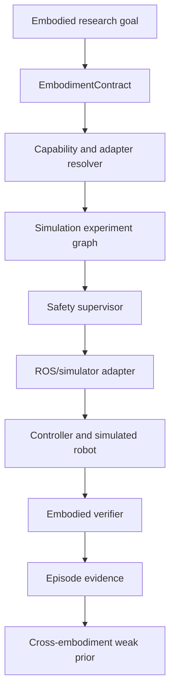

# Accretion v0.5 Robotics Simulation and Embodiment Charter

**Document type:** Release charter and pre-SDD plan  
**Status:** Proposed direction; deep Robotics SDD intentionally deferred  
**Date:** 2026-08-20  
**Entry condition:** Accretion v0.4 release and scientific safety gates pass  
**Primary boundary:** Simulation-first embodiment foundation; no autonomous physical execution

---

## 1. Proposed v0.5 identity

> **Accretion v0.5 — Robotics Simulation and Embodiment Foundation**

v0.5 extends Accretion from Software/AI workflows into robot-agnostic embodied experiments using simulation, typed embodiment adapters, explicit safety contracts, and cross-embodiment evidence transfer.

It is not a universal robot controller. It is the governed experiment and orchestration layer above existing simulators, ROS 2 systems, motion planners, controllers, and robot drivers.

---

## 2. Why Robotics should follow v0.4

v0.4 provides prerequisites that Robotics needs:

- Evidence-governed routing;
- Frozen contracts and independent verifiers;
- Conservative transfer and uncertainty;
- Team/project experience models;
- Shadow validation;
- Bounded recovery;
- Human authority proportional to risk;
- Versioned promotion and rollback.

Without those mechanisms, a Robotics release would be a collection of integrations rather than a trustworthy embodied research system.

v0.5 should therefore apply the stable Software/AI evidence pipeline to simulation before allowing physical actions.

---

## 3. Core objective

> Given an embodied research goal and a supported simulator/robot adapter, Accretion structures a reproducible simulation experiment, resolves embodiment capabilities, executes through lower-level robotics systems, independently verifies task and safety outcomes, and stores compatible experience for guarded cross-embodiment transfer.

---

## 4. “Support every robot type” interpretation

Accretion can be **robot-agnostic by architecture**, but it cannot ship or validate every robot driver.

Support is split into two claims:

### 4.1 Core architectural support

The core represents any embodiment through common typed interfaces for:

- Identity and morphology;
- Sensors and observations;
- Actuators and action spaces;
- Kinematic/dynamic constraints;
- Capabilities;
- Safety envelope;
- Simulator/driver binding;
- Verification and episode evidence.

### 4.2 Concrete adapter support

Each robot, simulator, or robot family requires a tested adapter. An adapter is not “supported” until its conformance, safety, and verification tests pass.

This allows eventual support for:

- Manipulator arms;
- Mobile robots;
- Mobile manipulators;
- Quadrupeds;
- Humanoids;
- Drones;
- Soft/continuum robots;
- Custom research platforms;

but v0.5 should implement only a small representative set.

---

## 5. Recommended flagship

Start with the user's available direction:

> **A 6-DOF manipulation task in simulation, followed by transfer to a second simulated embodiment through the same task contract.**

Example progression:

1. Reach above a detected object;
2. Pick and place a box;
3. Compare classical planning, VLA-assisted planning, and language-generated task planning;
4. Transfer the task intent and verifier to a second arm or mobile manipulator;
5. Measure adaptation cost, verified success, safety violations, and evidence reuse.

This is narrow enough to verify and broad enough to test transferable principles.

---

## 6. Reference architecture



### 6.1 Control-layer separation

| Layer | Responsibility | Timing |
|---|---|---|
| Accretion | Goal, experiment graph, evidence, routing, verification | Seconds to hours |
| Robotics middleware | Topics/services/actions, transforms, planning integration | Milliseconds to seconds |
| Motion/task planner | Feasible trajectory or policy generation | Milliseconds to seconds |
| Safety supervisor | Limits, collision, watchdog, emergency behavior | Real-time capable |
| Robot controller/driver | Servo/control loop and hardware protocol | Hard/soft real time |

Accretion and LLMs MUST NOT replace real-time control or emergency safety layers.

---

## 7. Proposed core contracts

### 7.1 `EmbodimentDescriptor`

```yaml
EmbodimentDescriptor:
  embodiment_id: string
  embodiment_family: MANIPULATOR | MOBILE | MOBILE_MANIPULATOR | QUADRUPED | HUMANOID | AERIAL | SOFT | CUSTOM
  version: string
  morphology:
    links: []
    joints: []
    end_effectors: []
    locomotion_mode: string | null
  observation_spaces: [ObservationSpec]
  action_spaces: [ActionSpec]
  capabilities: [EmbodiedCapability]
  dynamics_profile_ref: string
  safety_envelope_ref: string
  adapter_ref: string
  descriptor_hash: sha256
```

### 7.2 `ObservationSpec`

```yaml
ObservationSpec:
  observation_id: string
  modality: RGB | DEPTH | POINT_CLOUD | JOINT_STATE | FORCE_TORQUE | TACTILE | POSE | AUDIO | CUSTOM
  schema: json_schema
  frame_id: string | null
  rate_hz: number
  latency_bound_ms: integer
  calibration_ref: string | null
  units: object
```

### 7.3 `ActionIntent`

Accretion issues bounded high-level intents, not raw uncontrolled actuator commands:

```yaml
ActionIntent:
  intent_id: uuid
  task_primitive: REACH | GRASP | PLACE | NAVIGATE | INSPECT | CUSTOM
  target: object
  constraints: object
  success_spec_ref: string
  safety_envelope_ref: string
  timeout_ms: integer
  approval_ref: string | null
```

### 7.4 `SafetyEnvelope`

```yaml
SafetyEnvelope:
  envelope_id: string
  environment: SIMULATION | PHYSICAL
  workspace_bounds: object
  joint_limits: object
  velocity_limits: object
  acceleration_limits: object
  force_limits: object | null
  collision_policy: object
  prohibited_regions: []
  watchdog_timeout_ms: integer
  emergency_behavior: string
  approval_requirement: string
  content_hash: sha256
```

### 7.5 `RobotAdapterManifest`

```yaml
RobotAdapterManifest:
  adapter_id: string
  version: string
  embodiment_families: [string]
  middleware: ROS2 | DIRECT_SIM | CUSTOM
  simulator_bindings: [string]
  provided_capabilities: [string]
  required_connections: [string]
  observation_mappings: [object]
  action_mappings: [object]
  safety_hooks: [string]
  verifier_hooks: [string]
  conformance_suite_version: string
```

### 7.6 `EpisodeRecord`

```yaml
EpisodeRecord:
  episode_id: uuid
  project_id: uuid
  run_id: uuid
  embodiment_descriptor_hash: sha256
  simulator_version: string
  world_snapshot_ref: string
  task_contract_hash: sha256
  routing_receipt_refs: [uuid]
  observation_artifact_refs: [uuid]
  action_intent_refs: [uuid]
  controller_trace_refs: [uuid]
  safety_events: [object]
  verification_result_ref: uuid
  random_seed: integer
  started_at: timestamp
  ended_at: timestamp
```

### 7.7 `EmbodiedVerificationSpec`

```yaml
EmbodiedVerificationSpec:
  task_claims: []
  safety_claims: []
  success_metrics: []
  trajectory_metrics: []
  resource_metrics: []
  required_repetitions: integer
  statistical_requirements: object
  independent_observation_requirements: []
```

---

## 8. Capability model

Accretion workflows should request normalized capabilities, for example:

```text
robot.observe.rgb
robot.observe.depth
robot.observe.joint_state
robot.localize
robot.plan.motion
robot.plan.navigation
robot.intent.reach
robot.intent.grasp
robot.intent.place
robot.simulation.reset
robot.simulation.randomize
robot.verify.pose
robot.verify.grasp
robot.verify.collision_free
```

Adapters map normalized capabilities to ROS 2 actions/services/topics or simulator APIs. Workflows do not depend directly on vendor-specific names.

Plugin manifests request these capabilities; they do not grant them.

---

## 9. Simulation strategy

### 9.1 Recommended order

1. CPU-friendly simulator for local development;
2. ROS 2 integration and deterministic replay;
3. Optional higher-fidelity/GPU simulator where available;
4. Multi-simulator comparison;
5. Physical validation in a later release.

Candidate environments may include Gazebo, MuJoCo, PyBullet, or other adapters. Isaac-based integration should remain optional because hardware availability varies.

### 9.2 Reproducibility

Every simulated trial records:

- Simulator and physics-engine version;
- World/model assets and hashes;
- Random seed;
- Time step and solver settings;
- Sensor noise/domain randomization;
- Controller versions;
- Embodiment descriptor;
- Task/verification contracts;
- Complete episode evidence.

### 9.3 Simulation is not physical proof

Simulation results are evidence about the modeled environment. They MUST NOT be represented as physical safety or real-world success.

---

## 10. Cross-embodiment transfer

### 10.1 Transfer object

Accretion transfers structured knowledge, not raw authority:

- Task intent and decomposition;
- Capability requirements;
- Perception/observation abstractions;
- Constraints;
- Verification specification;
- Successful/failed configuration evidence;
- Uncertainty and contradiction state.

### 10.2 Compatibility gates

Transfer requires compatibility across:

- Task semantics;
- Required capabilities;
- Observation availability and mappings;
- Action/task primitive semantics;
- Workspace and dynamics assumptions;
- Safety envelope;
- Verifier comparability.

### 10.3 Weak-prior rule

Evidence from embodiment A becomes a weak prior for embodiment B:

\[
Score_B(a)=Score_{baseline,B}(a)+\gamma_{transfer}Score_A(a)
\]

with small capped \(\gamma_{transfer}\). It influences shadow candidates first. It becomes B-specific evidence only after verified B trials.

### 10.4 Negative transfer

Accretion records:

- Transfer attempt;
- Compatibility rationale;
- Predicted benefit and uncertainty;
- Adaptation steps;
- Verified outcome;
- Safety differences;
- Failure/contradiction evidence.

Negative transfer remains retrievable and lowers future transfer confidence.

---

## 11. Safety and human authority

### 11.1 v0.5 simulation policy

Low-risk isolated simulation trials may run under an approved experiment protocol with hard budgets and watchdogs.

### 11.2 Physical policy

Physical execution is excluded from v0.5. A later physical release must require:

- Approval for every individual physical/high-risk trial;
- Preflight safety checks;
- Real-time independent safety supervisor;
- Hardware emergency stop;
- Workspace and human-presence controls;
- Force/velocity/joint limits;
- Observer-based verification;
- Incident and near-miss recording.

### 11.3 Authority rule

LLMs may propose task plans or high-level ActionIntents. They cannot modify the SafetyEnvelope, bypass approval, disable the watchdog, or send arbitrary actuator commands outside an approved adapter.

---

## 12. v0.5 scope

### Included

- Embodiment/task/safety contracts;
- Robot Adapter SDK and conformance suite;
- Normalized robotics capabilities;
- ROS 2 and direct-simulator gateway patterns;
- At least one manipulation simulator adapter;
- At least one second simulated embodiment for transfer testing;
- Simulation experiment graphs;
- Episode/evidence storage and replay;
- Embodied task and safety verifiers;
- Cross-embodiment weak-prior retrieval;
- Robotics Experiment Studio views;
- Simulation benchmark and reproduction study.

### Excluded

- Unsupervised physical actuation;
- Physical online routing exploration;
- Universal robot driver claims;
- Automatic sim-to-real authority;
- Learned real-time safety;
- LLM replacement of controllers;
- End-to-end cross-embodiment foundation-model training;
- Learned graph planning unless separately approved;
- Self-modifying robot software in operation.

---

## 13. Proposed milestones

| Milestone | Deliverable | Exit condition |
|---|---|---|
| R0 | Robotics requirements and safety study | Standards/protocols/adapters selected for SDD |
| R1 | Embodiment contracts | Schemas and compatibility tests pass |
| R2 | Adapter SDK | Conformance harness and fake adapter pass |
| R3 | First simulation embodiment | 6-DOF arm tasks replay deterministically |
| R4 | ROS 2 integration | Actions/services/topics and safety hooks pass |
| R5 | Embodied verification | Task/safety evidence and repetitions pass |
| R6 | Second embodiment | Same high-level task contract executes with adapter |
| R7 | Cross-embodiment weak-prior study | Transfer/negative-transfer benchmark complete |
| R8 | Experiment Studio | Episode, safety, embodiment, transfer views pass |
| R9 | v0.5 release evidence | Reproduction package and acceptance gates pass |

---

## 14. Proposed acceptance gates

1. The core contains no vendor-specific robot assumptions.
2. Every concrete embodiment uses a versioned adapter manifest.
3. Observation and action mappings are typed and unit/frame aware.
4. Accretion emits high-level bounded ActionIntents only.
5. SafetyEnvelope is immutable during an episode.
6. Simulator/controller versions and seeds are reproducible.
7. Every episode has task and safety verification evidence.
8. Simulation results are labeled as simulation evidence.
9. Adapter failure cannot bypass the safety supervisor.
10. Unsupported capabilities fail closed.
11. Cross-embodiment evidence begins as a weak prior.
12. Transfer compatibility is typed, not semantic-only.
13. Negative transfer remains recorded and retrievable.
14. Two simulated embodiments execute a shared high-level task contract.
15. The second embodiment is evaluated with and without transferred prior.
16. No physical actuator capability is enabled in v0.5.
17. Robotics UI displays embodiment, simulator, safety, and verifier versions.
18. Episode replay reproduces registered metrics within tolerance.
19. Benchmark reports task success, safety, adaptation cost, and uncertainty.
20. A deep physical release requires a separate SDD and risk review.

---

## 15. Research questions for the v0.5 deep dive

1. What abstraction should be invariant across embodiments: task, skill, capability, latent state, or a combination?
2. How should observation spaces with different modalities map without hiding information loss?
3. How should ActionIntent semantics map to heterogeneous controllers?
4. Which embodiment features best predict transfer success?
5. How should dynamics and morphology distance affect prior weight?
6. How should verifier comparability be calibrated across embodiments?
7. What negative-transfer detector is reliable at small sample sizes?
8. Which simulator gives the best CPU-accessible first target?
9. What ROS 2 interface subset belongs in the normalized gateway?
10. How should time, coordinate frames, units, and uncertainty be represented?
11. What safety standards apply to later physical deployment?
12. How should human presence and workspace monitoring enter the SafetyEnvelope?
13. Which VLA/open-weight models are feasible for the chosen compute boundary?
14. What belongs in the robot adapter versus task plugin?
15. What is the correct public cross-embodiment benchmark?

---

## 16. Decision before the full v0.5 SDD

The deep Robotics discussion should decide:

- First simulator;
- ROS 2 distribution and message/action contracts;
- First and second embodiments;
- First shared task;
- Observation/action normalization;
- Safety standard and threat model;
- Benchmark and statistical protocol;
- Compute boundary;
- Whether v0.5 remains simulation-only or includes a separately gated physical pilot.

Until those are decided, this charter is intentionally a boundary document rather than an implementation SDD.

---

## 17. Recommended roadmap after v0.5

The sequence should remain evidence-driven rather than version-driven:

```text
v0.4  Evidence-Aware Node Configuration Routing
  ↓ release/scientific gate
v0.5  Robotics Simulation and Embodiment Foundation
  ↓ simulation/cross-embodiment gate
later Physical Robotics Pack with individual-trial approval
  ↓ physical safety/reproducibility gate
later Learned Workflow Planning or joint planner-router research
```

The ordering of physical Robotics and learned workflow planning should be decided from v0.4-v0.5 evidence, not fixed now.
