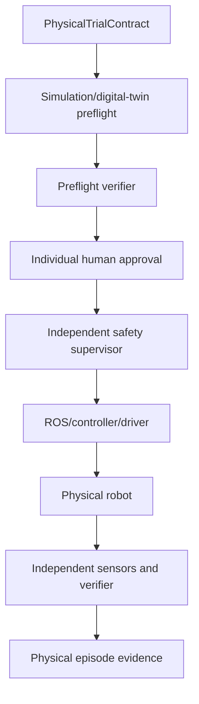
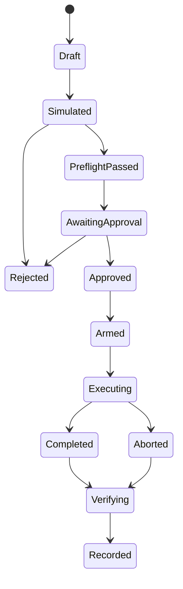

# Accretion v0.6 Physical Robotics Safety and Execution Charter

**Document type:** Detailed release charter / pre-SDD specification  
**Status:** Proposed; implementation waits for v0.5 release gate  
**Date:** 2026-08-20  
**Primary platform:** User's 6-DOF arm, webcam, ROS 2-compatible integration  
**Authority boundary:** Every physical or high-risk trial requires individual approval

---

## 1. Release identity

> **Accretion v0.6 — Physical Robotics Safety and Execution**

v0.6 introduces governed physical experimentation. Accretion may structure, simulate, propose, and orchestrate a physical trial, but execution requires explicit human approval and an independent real-time safety path.

The release proves one narrow claim:

> Accretion can conduct reproducible, individually approved physical manipulation trials while enforcing independent safety and evidence requirements.

It does not claim autonomous Robotics or cross-embodiment transfer.

---

## 2. Entry conditions

v0.6 work begins only after v0.5 demonstrates:

1. Versioned EmbodimentContract and RobotAdapter conformance;
2. Deterministic simulation replay within registered tolerance;
3. Immutable SafetyEnvelope during episodes;
4. Independent task and safety verification;
5. Two simulated embodiments executing a shared high-level task contract;
6. No physical actuator capability enabled in v0.5;
7. Complete episode evidence and adapter lineage;
8. Cross-embodiment evidence treated only as a weak prior.

---

## 3. Flagship physical challenge

### 3.1 Hardware

- Existing 6-DOF arm;
- Webcam;
- Robot controller/driver;
- Host running Accretion and ROS 2 bridge;
- Physical emergency-stop mechanism;
- Defined, restricted tabletop workspace.

### 3.2 Task progression

1. Observe arm state and camera image without actuation;
2. Calibrate camera, robot base, and workspace frames;
3. Execute approved home/stop motions;
4. Reach a pose above a box;
5. Pick and place the box;
6. Repeat across registered object poses;
7. Compare simulation prediction and physical outcome;
8. Produce a reproducible episode and safety report.

### 3.3 Comparative methods

Where feasible, compare:

- Classical perception plus motion planning;
- LLM-generated high-level task decomposition;
- VLA-assisted perception/action intent;
- Accretion routed configuration under the same physical approval/safety constraints.

The lower-level safety/controller path remains identical where possible.

---

## 4. Reference architecture



### 4.1 Independent authority paths

The execution path and safety-stop path MUST not depend on one model process.

```text
Accretion/LLM intent → approved adapter → controller → robot

independent watchdog/safety inputs → stop/limit controller
```

Loss of Accretion, LLM, network, camera, or routing service MUST transition the robot to the registered safe state.

---

## 5. Layer responsibilities

| Layer | Responsibility | Prohibited behavior |
|---|---|---|
| Accretion planner | Trial objective and workflow | Raw servo control |
| Node router | Digital/simulation configuration selection | Physical exploration |
| Human authority | Approve one exact physical trial | Convert approval into verification |
| Safety supervisor | Enforce envelope and stop behavior | Accept task success |
| Motion/task planner | Produce feasible motion | Modify approval or safety envelope |
| Controller/driver | Real-time command execution | Interpret open-ended LLM text |
| Physical verifier | Measure task/safety claims | Alter executed artifact |

---

## 6. Proposed core contracts

### 6.1 `PhysicalTrialContract`

```yaml
PhysicalTrialContract:
  trial_contract_id: uuid
  project_id: uuid
  run_id: uuid
  objective_contract_ref: object
  node_contract_refs: [uuid]
  embodiment_descriptor_hash: sha256
  robot_adapter_hash: sha256
  hardware_inventory_snapshot_id: uuid
  task:
    action_intents: [uuid]
    target_objects: []
    success_spec_ref: string
  physical_environment_snapshot_id: uuid
  safety_envelope_hash: sha256
  calibration_bundle_hash: sha256
  simulation_preflight_ref: uuid
  expected_duration_ms: integer
  abort_conditions: []
  required_observers: []
  approval_requirement: INDIVIDUAL_TRIAL
  immutable_hash: sha256
```

### 6.2 `PhysicalTrialApproval`

```yaml
PhysicalTrialApproval:
  approval_id: uuid
  trial_contract_hash: sha256
  principal_id: uuid
  decision: APPROVE | REJECT
  approved_execution_window:
    starts_at: timestamp
    expires_at: timestamp
  maximum_executions: 1
  conditions: []
  evidence_acknowledged: []
  decided_at: timestamp
```

Approval is invalid if the contract, safety envelope, calibration, adapter, hardware inventory, or environment snapshot changes.

### 6.3 `CalibrationBundle`

```yaml
CalibrationBundle:
  calibration_bundle_id: uuid
  robot_kinematics_ref: string
  camera_intrinsics_ref: string
  camera_extrinsics_ref: string
  transforms:
    - parent_frame: string
      child_frame: string
      transform: object
      covariance: object
  workspace_registration_ref: string
  calibration_method: string
  residual_metrics: object
  valid_until: timestamp | null
  invalidation_conditions: []
  content_hash: sha256
```

### 6.4 `PhysicalEnvironmentSnapshot`

```yaml
PhysicalEnvironmentSnapshot:
  snapshot_id: uuid
  workspace_bounds: object
  prohibited_regions: []
  object_manifest: []
  human_presence_state: CLEAR | SUPERVISED | PROHIBITED
  lighting_conditions: object
  floor/table/reference_geometry: object
  capture_refs: [uuid]
  captured_at: timestamp
  expires_at: timestamp
```

### 6.5 `SafetySupervisorContract`

```yaml
SafetySupervisorContract:
  supervisor_id: string
  version: string
  safety_envelope_hash: sha256
  monitored_signals: []
  stop_channel: object
  watchdog_timeout_ms: integer
  startup_self_tests: []
  runtime_invariants: []
  safe_state: object
  failure_behavior: FAIL_STOP
  independence_attestation: object
```

### 6.6 `PhysicalEpisodeRecord`

```yaml
PhysicalEpisodeRecord:
  physical_episode_id: uuid
  trial_contract_hash: sha256
  approval_id: uuid
  approval_consumed: true
  adapter_hash: sha256
  controller_versions: []
  calibration_bundle_hash: sha256
  environment_snapshot_id: uuid
  command_trace_ref: uuid
  observation_trace_refs: [uuid]
  safety_event_refs: [uuid]
  emergency_stop_events: []
  task_verification_ref: uuid
  safety_verification_ref: uuid
  incident_refs: [uuid]
  started_at: timestamp
  ended_at: timestamp
```

### 6.7 `PhysicalIncidentRecord`

```yaml
PhysicalIncidentRecord:
  incident_id: uuid
  physical_episode_id: uuid
  severity: NEAR_MISS | MINOR | MAJOR | CRITICAL
  category: string
  detected_by: string
  evidence_refs: [uuid]
  automatic_response: object
  human_response: object
  root_cause_status: OPEN | RESOLVED
  blocked_capabilities: []
  created_at: timestamp
```

Any unresolved material incident disables the affected physical capability until authorized resolution.

---

## 7. Trial lifecycle



### 7.1 Approval consumption

- One approval authorizes one exact trial execution.
- Approval is consumed when the system arms the physical adapter.
- Retrying requires a new approval, even if the prior trial failed immediately.
- Changing any bound hash invalidates approval.
- Approval expiration is fail-closed.

---

## 8. Preflight pipeline

Every physical trial MUST pass:

1. Contract/schema validation;
2. Hardware inventory and connectivity check;
3. Calibration validity check;
4. Environment/workspace snapshot check;
5. Safety-supervisor self-test;
6. Stop-channel and watchdog test;
7. Joint/workspace/collision feasibility;
8. Simulation or digital-twin execution;
9. Task and safety preflight verification;
10. Sim-to-real discrepancy/risk report;
11. Human-readable approval summary.

Failure or inconclusive status at any required step blocks approval.

---

## 9. Safety model

### 9.1 Defense in depth

- Mechanical/electrical stop where available;
- Controller limits;
- Independent safety supervisor;
- Workspace exclusion zones;
- Motion-planner collision checking;
- Perception confidence gate;
- Watchdog and communications timeout;
- Human approval and observation;
- Post-trial independent verification.

### 9.2 Fail-safe behavior

The registered safe state MUST define behavior for:

- Lost command channel;
- Lost camera/sensor stream;
- Stale transform/calibration;
- Joint/velocity/force limit violation;
- Unexpected obstacle or human presence;
- Controller fault;
- Safety-supervisor fault;
- Accretion/runtime crash;
- Emergency-stop activation.

### 9.3 Learned-system boundary

Learned components MAY propose perception results, task decomposition, or bounded ActionIntents. Deterministic/independent layers validate feasibility and enforce the SafetyEnvelope.

No learned confidence score can disable a hard safety constraint.

---

## 10. Sim-to-real evidence

### 10.1 Discrepancy record

Compare simulation and physical execution on:

- Initial state;
- Planned versus observed trajectory;
- Pose error;
- Timing;
- Perception uncertainty;
- Contact/grasp outcome;
- Safety margin;
- Controller/sensor latency;
- Task verification result.

### 10.2 Authority rule

Simulation evidence supports risk assessment and candidate selection. It does not authorize a physical action or count as a physical verification result.

### 10.3 Adaptation

v0.6 MAY update a digital-twin discrepancy model offline. It MUST NOT perform online physical exploration. Any changed physical configuration requires a new trial proposal and approval.

---

## 11. Physical verification

### 11.1 Verification hierarchy

1. Controller and safety logs;
2. Independent joint/pose observations;
3. Camera-based object/task verification;
4. Collision/limit/stop evidence;
5. Repeated trials and quantitative statistics;
6. Independent model review for semantic gaps;
7. Human review when inconclusive.

### 11.2 Required claims

Each trial should verify separately:

- The intended trial contract was executed;
- Target task success or failure;
- Safety-envelope compliance;
- Approval validity and one-time consumption;
- Calibration/environment validity;
- Evidence completeness;
- Whether any incident or near miss occurred.

Task success cannot erase a safety failure.

---

## 12. Experience and learning

Physical experience has stricter visibility and eligibility:

- Source embodiment and hardware versions are mandatory;
- Calibration/environment/safety hashes are mandatory;
- Simulation and physical evidence remain distinct;
- One physical success is not enough for general promotion;
- Incidents and near misses remain retrievable;
- Physical experience may update project models only through offline review;
- Physical data cannot enable physical online bandit exploration.

v0.6 routing may recommend physical trial configurations, but a human approves the exact trial and the router cannot expand the candidate set beyond prevalidated configurations.

---

## 13. Experiment Studio

Required views:

- Physical trial proposal;
- Contract/hash and adapter summary;
- Simulation preflight replay;
- Calibration and environment validity;
- Safety-envelope visualization;
- Approval conditions and expiry;
- Arm/disarm/abort status;
- Live safety and watchdog state;
- Independent camera/robot telemetry;
- Task/safety verification;
- Sim-to-real discrepancy;
- Incident and near-miss register;
- Physical episode replay.

The UI MUST clearly distinguish `SIMULATION`, `APPROVED_PHYSICAL`, and `PHYSICAL_RECORDED` evidence.

---

## 14. v0.6 scope

### Included

- One physical 6-DOF arm adapter;
- Webcam-based observation and verification;
- ROS 2 or equivalent bounded gateway;
- Calibration and frame/unit management;
- Digital-twin/simulation preflight;
- Individual-trial approval;
- Independent safety supervisor integration;
- Physical task/safety verification;
- Physical episode, incident, and discrepancy records;
- Reach and pick/place flagship protocol;
- Physical Experiment Studio.

### Excluded

- General robot marketplace;
- Multiple physical robot families as a release requirement;
- Cross-embodiment primary claim;
- Autonomous trial approval;
- Physical online exploration;
- Learned emergency control;
- High-speed/human-collaborative operation without separate safety case;
- Raw LLM-to-actuator interface;
- Self-modifying robot code during operation.

---

## 15. Milestones

| Milestone | Deliverable | Exit condition |
|---|---|---|
| P0 | Physical safety/risk study | Hardware, standards, hazards, stop design reviewed |
| P1 | Contracts and approval service | Hash-bound one-time approval tests pass |
| P2 | Calibration/environment registry | Frame/unit/residual/invalidation tests pass |
| P3 | Hardware/ROS adapter | Read-only then bounded action conformance pass |
| P4 | Independent safety supervisor | Self-test, watchdog, stop, fault drills pass |
| P5 | Simulation preflight | Matched contract and discrepancy report pass |
| P6 | Reach trial | Repeated approved reach evidence passes |
| P7 | Pick/place trial | Repeated task/safety verification passes |
| P8 | Incident/recovery system | Near-miss and fault injection drills pass |
| P9 | Physical Experiment Studio | Approval/live/evidence/replay views pass |
| P10 | Release study | Pre-registered physical study and artifacts complete |

---

## 16. Release acceptance gates

1. Physical capability is disabled by default.
2. Every physical execution binds an immutable PhysicalTrialContract.
3. One human approval authorizes exactly one execution.
4. Changed contract/safety/calibration/adapter/environment invalidates approval.
5. Arming consumes approval and retry requires a new approval.
6. Simulation preflight is mandatory.
7. Inconclusive preflight blocks physical execution.
8. Safety supervisor is independent from the LLM/runtime process.
9. Watchdog and emergency stop pass startup and fault drills.
10. Lost communication transitions to the registered safe state.
11. Workspace, joint, velocity, and collision limits are enforced below Accretion.
12. Raw untyped LLM commands cannot reach the driver.
13. Task success and safety success are verified separately.
14. Physical evidence is distinct from simulation evidence.
15. Every episode records controller, adapter, calibration, and environment versions.
16. Every incident and near miss is recorded and blocks affected capability when unresolved.
17. No physical contextual-bandit exploration is enabled.
18. Physical experience promotion occurs offline only.
19. Repeated reach trials meet pre-registered task/safety thresholds.
20. Repeated pick/place trials meet pre-registered task/safety thresholds.
21. Sim-to-real discrepancy is measured and reported.
22. False acceptance and critical safety regression gates pass.
23. Physical episode replay reconstructs the decision/evidence timeline.
24. The UI clearly displays trial type, approval, safety, and evidence state.
25. v0.7 transfer work remains disabled until the v0.6 release study passes.

---

## 17. Open questions before the technical SDD

1. Exact arm controller and communication protocol;
2. ROS 2 distribution and deployment topology;
3. Hardware emergency-stop mechanism;
4. Independent safety supervisor hardware/process boundary;
5. Joint/velocity/force capabilities of the arm;
6. Camera model, mounting, and calibration approach;
7. Workspace geometry and human-presence policy;
8. CPU-friendly simulator/digital twin;
9. Motion planner and collision model;
10. Gripper feedback and grasp verification;
11. Required trial repetitions and statistical thresholds;
12. Acceptable pose/task tolerances;
13. Incident severity taxonomy;
14. Data retention for physical images/video;
15. Applicable robot safety standards and local requirements;
16. Whether an external observer is required;
17. Power-loss and controller-reset behavior;
18. VLA/model compute and network boundary;
19. Whether physical trials can run remotely;
20. Exact v0.6 publication or portfolio claim.

---

## 18. Handoff rule

The full v0.6 technical SDD may be written only after:

- v0.5 simulation gates pass;
- Hardware/controller details are inspected;
- A hazard analysis is completed;
- The independent stop/safety architecture is selected;
- The physical flagship protocol and statistical thresholds are frozen.
