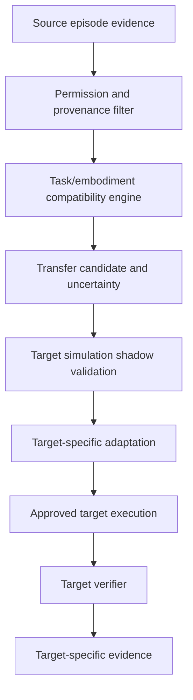

# Accretion v0.7 Cross-Embodiment Transfer Charter

**Document type:** Detailed research/release charter / pre-SDD specification  
**Status:** Proposed; implementation waits for v0.6 release gate  
**Date:** 2026-08-20  
**Primary claim:** Lower target-embodiment adaptation effort without correctness or safety regression  
**Authority boundary:** Source evidence is a weak prior; target verification creates target authority

---

## 1. Release identity

> **Accretion v0.7 — Cross-Embodiment Transfer**

v0.7 studies whether knowledge gathered from one robot embodiment can improve learning, planning, routing, or experimentation on another embodiment.

It does not assume one universal action space, one universal model, or one-to-one trajectory transfer. It transfers typed task knowledge, capability requirements, constraints, verification semantics, configurations, successes, failures, and uncertainty through audited embodiment mappings.

---

## 2. Entry conditions

v0.7 begins only after:

1. v0.5 simulation adapters and shared task contracts pass;
2. v0.6 physical trial approval/safety architecture passes;
3. At least one physical embodiment has reproducible episode evidence;
4. Simulation and physical evidence remain explicitly separated;
5. No physical online exploration exists;
6. Source embodiment incidents and contradictions are queryable;
7. Adapter, calibration, environment, controller, and verifier versions are pinned;
8. False-acceptance and safety non-regression gates pass.

---

## 3. Research question

> Given a source embodiment A and target embodiment B with a compatible high-level task contract, can Accretion use verified A evidence to reduce B's adaptation cost or trials-to-threshold while preserving B-specific task correctness and safety?

### 3.1 Primary hypothesis

Let \(N_B^{scratch}\) be the number of B-specific trials required to reach the registered verified-success floor without source evidence, and \(N_B^{transfer}\) the number with an A-derived weak prior.

\[
E[N_B^{transfer}] < E[N_B^{scratch}]
\]

subject to:

\[
LCB[P(V_B=1)]\ge\tau_B
\]

and:

\[
SafetyRegression_B\le 0
\]

### 3.2 Secondary hypotheses

- Transfer lowers configuration/adaptation regret;
- Typed compatibility outperforms semantic-only retrieval;
- Negative-transfer detection reduces wasted or unsafe target trials;
- Simulation-source evidence can improve target simulation adaptation;
- Physical-source evidence can improve a compatible target only after target simulation validation;
- Morphology/dynamics/context features predict transferability better than task text alone.

---

## 4. Flagship design

### 4.1 Source and targets

Recommended staged study:

1. **Source A:** simulated 6-DOF arm matching the user's physical arm;
2. **Target B:** a different simulated arm with changed kinematics/morphology;
3. **Source A-physical:** the user's physical arm under v0.6 governance;
4. **Optional target C:** simulated mobile manipulator or another arm family;
5. Physical target B only in a later approved sub-study with its own safety case.

### 4.2 Shared task

Use one high-level task contract such as:

> Detect a box, reach a safe pre-grasp pose, grasp it, and place it inside a target region.

The task contract remains stable while embodiment-specific perception, kinematics, motion planning, controller, and calibration change.

### 4.3 Comparators

- Target from scratch;
- Semantic-only source retrieval;
- Typed compatible source weak prior;
- Typed source prior without negative-transfer detector;
- Full Accretion transfer method;
- Optional post-hoc best source/target adaptation strategy.

---

## 5. Transfer architecture



### 5.1 Authority rule

Source evidence may alter target candidate ranking. It cannot:

- Grant a target capability;
- Satisfy a target verification claim;
- Modify a target SafetyEnvelope;
- Authorize a target physical trial;
- Replace target calibration;
- Convert source success into target success.

---

## 6. Transferable knowledge layers

| Layer | Potentially transferable | Target-specific validation required |
|---|---|---|
| Task semantics | Goal, object relation, phase ordering | Yes |
| Capability requirements | Observe, reach, grasp, place | Yes |
| Workflow structure | Perceive-plan-act-verify decomposition | Yes |
| Verification semantics | Success claims and evidence types | Yes, implementation recalibrated |
| Perception representation | Object/pose concepts | Yes, sensor/domain mapping |
| Configuration evidence | Runtime/model/tool/skill performance | Yes |
| Failure patterns | Occlusion, unreachable pose, grasp slip | Yes |
| Trajectory | Usually not directly transferable | Always replan/validate |
| Joint commands | Not transferable across embodiments | Never direct transfer |
| Safety limits | Not transferable as authority | Target envelope mandatory |

---

## 7. Proposed data contracts

### 7.1 `EmbodiedTaskContract`

```yaml
EmbodiedTaskContract:
  task_contract_id: uuid
  version: integer
  objective: string
  task_primitives: []
  object_roles: []
  required_capabilities: []
  observation_requirements: []
  action_intent_requirements: []
  invariant_constraints: []
  embodiment_specific_slots: []
  task_verification_spec_ref: string
  safety_claim_requirements: []
  content_hash: sha256
```

### 7.2 `EmbodimentSignature`

```yaml
EmbodimentSignature:
  embodiment_descriptor_hash: sha256
  family: string
  morphology_features:
    degrees_of_freedom: integer
    kinematic_structure: object
    reachability_summary: object
    end_effector_types: []
    locomotion_type: string | null
  dynamics_features:
    payload_range: object
    velocity_range: object
    actuation_type: string
    compliance_profile: object | null
  observation_features:
    modalities: []
    frame_graph_summary: object
    latency_summary: object
  action_features:
    task_primitives: []
    controller_interfaces: []
  safety_features:
    environment: SIMULATION | PHYSICAL
    envelope_classes: []
  signature_version: string
```

### 7.3 `EmbodimentCompatibilityDecision`

```yaml
EmbodimentCompatibilityDecision:
  decision_id: uuid
  source_signature_ref: string
  target_signature_ref: string
  task_contract_hash: sha256
  hard_checks:
    task_semantics: PASS | FAIL | UNKNOWN
    capability_coverage: PASS | FAIL | UNKNOWN
    observation_mapping: PASS | FAIL | UNKNOWN
    action_intent_mapping: PASS | FAIL | UNKNOWN
    verifier_mapping: PASS | FAIL | UNKNOWN
    safety_separation: PASS | FAIL | UNKNOWN
  soft_similarity:
    morphology: number
    dynamics: number
    observation: number
    environment: number
    historical_transfer: number
  status: COMPATIBLE | INCOMPATIBLE | SHADOW_ONLY
  uncertainty: number
  reason_codes: []
  rule_version: string
```

Any required `FAIL` makes the evidence ineligible. Required `UNKNOWN` restricts use to hypothesis generation or shadow analysis.

### 7.4 `TransferCandidate`

```yaml
TransferCandidate:
  transfer_candidate_id: uuid
  source_experience_refs: [uuid]
  source_embodiment_ref: string
  target_embodiment_ref: string
  task_contract_hash: sha256
  compatibility_decision_ref: uuid
  proposed_transfer:
    workflow_prior: object | null
    configuration_prior: object | null
    failure_prior: object | null
    verifier_mapping: object | null
  prior_weight_cap: number
  predicted_adaptation_benefit: object
  predicted_negative_transfer_risk: object
  required_target_validation: []
  status: PROPOSED | SHADOW | ELIGIBLE | REJECTED | RETIRED
```

### 7.5 `TargetAdaptationPlan`

```yaml
TargetAdaptationPlan:
  adaptation_plan_id: uuid
  target_project_id: uuid
  target_embodiment_ref: string
  transfer_candidate_id: uuid | null
  baseline_type: SCRATCH | SEMANTIC_ONLY | TYPED_TRANSFER
  simulation_trial_budget: object
  physical_trial_budget: object | null
  adaptation_steps: []
  stopping_rule: object
  verified_success_floor: number
  negative_transfer_abort_rules: []
  approval_requirements: []
  content_hash: sha256
```

### 7.6 `TransferOutcome`

```yaml
TransferOutcome:
  transfer_outcome_id: uuid
  adaptation_plan_id: uuid
  source_refs: [uuid]
  target_episode_refs: [uuid]
  trials_to_threshold: integer | null
  adaptation_cost: decimal
  adaptation_latency_ms: integer
  verified_success_result: object
  safety_result: object
  transfer_regret: number | null
  negative_transfer_detected: boolean
  failure_refs: [uuid]
  conclusion: BENEFICIAL | NEUTRAL | HARMFUL | INCONCLUSIVE
  evidence_refs: [uuid]
```

---

## 8. Compatibility model

### 8.1 Hard gates

Transfer requires:

- Same compatible task contract version;
- Target capability coverage;
- Audited observation mapping;
- Audited high-level ActionIntent mapping;
- Target-specific safety envelope;
- Comparable target verifier semantics;
- Permission and provenance access;
- No unresolved critical source contradiction affecting the transferred claim.

### 8.2 Soft ranking

After hard gates, rank by:

- Task-context similarity;
- Morphology and reachability;
- Dynamics and control regime;
- Sensor modality and latency;
- Environment/domain similarity;
- Historical transfer outcomes;
- Evidence quality and age/version;
- Negative-transfer history;
- Mapping uncertainty.

### 8.3 Prior weight

\[
Score_B(a)=Score_{baseline,B}(a)+\gamma_{A\rightarrow B}Score_A(a)
\]

where:

\[
0\le\gamma_{A\rightarrow B}\le\gamma_{max}\ll 1
\]

The cap is frozen by protocol and reduced by uncertainty, contradiction, version drift, or negative-transfer evidence.

As target evidence grows, target-specific prediction replaces the source prior.

---

## 9. Negative-transfer detection

### 9.1 Definition

Transfer is harmful when it increases target trials, cost, regret, failure, or safety risk relative to the registered scratch baseline beyond tolerance.

### 9.2 Detection signals

- Early target verifier failure;
- Repeated unreachable/invalid plans;
- Higher safety-envelope rejection;
- Calibration or perception mismatch;
- Worse adaptation EVI;
- Excessive rollback to target baseline;
- Disagreement between source prediction and target evidence;
- Lower confidence or effective sample size.

### 9.3 Response

```text
detect suspected negative transfer
→ reduce/freeze source prior weight
→ fall back to target baseline
→ preserve failure evidence
→ classify incompatibility
→ require review before another physical target trial
```

The system MUST NOT continue transfer merely to complete a planned experiment.

---

## 10. Simulation-to-physical progression

### Stage 1 — Source simulation

Collect verified source evidence under randomized target-relevant conditions.

### Stage 2 — Target simulation from scratch

Establish the target baseline without source evidence.

### Stage 3 — Target simulation with transfer

Evaluate typed weak-prior benefit and negative-transfer detection.

### Stage 4 — Source physical evidence

Use v0.6 physical evidence only when its task, calibration, safety, and verifier lineage is complete.

### Stage 5 — Target physical proposal

Only after simulation transfer passes. Each physical target trial uses the v0.6 one-trial approval and safety architecture.

Simulation transfer success never authorizes physical transfer automatically.

---

## 11. Experimental design

### 11.1 Conditions

At minimum:

1. Scratch target adaptation;
2. Semantic-only retrieval;
3. Typed weak-prior transfer;
4. Typed transfer without negative-transfer detector;
5. Full transfer method.

### 11.2 Pairing

Use matched target task distributions, simulator/robot versions, budgets, randomization seeds, and verification contracts.

### 11.3 Project/embodiment split

The final test must include target embodiments or embodiment-task combinations excluded from transfer model tuning.

### 11.4 Primary metrics

- Trials to verified-success threshold;
- Adaptation cost;
- Adaptation latency;
- Transfer regret;
- Target verified-success rate;
- Target safety failure/near-miss rate;
- Negative-transfer detection precision/recall or registered decision metric.

### 11.5 Statistical gate

Use pre-registered paired/project-embodiment clustered analysis, effect size, confidence interval, and target correctness/safety non-regression. Physical trials are analyzed separately from simulation trials.

---

## 12. Transfer regret

One proposed formulation is:

\[
TransferRegret_B=
U_B(Adaptation^{oracle})-U_B(Adaptation^{selected})
\]

where utility includes target-specific quality, adaptation cost, latency, trial count, and hard safety constraints.

Alternatively, the primary operational metric may be trials-to-threshold with regret as secondary. The deep SDD/protocol must choose one before test-set evaluation.

---

## 13. Human authority

- Simulation transfer may run under an approved low-risk protocol.
- Every physical target trial requires individual approval.
- The approval summary must disclose source embodiment, compatibility, uncertainty, simulation results, negative-transfer evidence, and target-specific safety envelope.
- A human may reject or choose a different prevalidated target adaptation configuration.
- Human choice is not verification and does not automatically validate transfer.

---

## 14. Experience and contradiction model

Accretion stores source and target evidence separately with explicit relations:

```text
source evidence
  └── supports transfer hypothesis
        ├── target simulation evidence
        └── target physical evidence
```

Contradictory outcomes are preserved:

- Source success / target failure;
- Simulation success / physical failure;
- Task success / safety failure;
- Perception success / control failure;
- Transfer benefit in one context / harm in another.

Resolved contradictions may narrow compatibility rules; they do not erase the original records.

---

## 15. Experiment Studio

Required views:

- Source and target embodiment comparison;
- Task-contract invariant and target-specific fields;
- Observation/action mapping;
- Hard compatibility results;
- Soft similarity and uncertainty;
- Source evidence and contradictions;
- Transfer prior weight and cap;
- Scratch versus transfer adaptation curves;
- Simulation versus physical evidence;
- Negative-transfer alerts and fallback;
- Trials-to-threshold and transfer regret;
- Physical target approval summary;
- Transfer lineage graph.

---

## 16. v0.7 scope

### Included

- Typed task and embodiment signatures;
- Hard compatibility and soft transfer ranking;
- Weak-prior configuration/workflow/failure transfer;
- Target simulation shadow validation;
- Target-specific adaptation and stopping rules;
- Negative-transfer detection and fallback;
- Source/target evidence lineage;
- Cross-embodiment benchmark;
- At least two meaningfully different simulated embodiments;
- Optional carefully gated target physical trials after simulation success;
- Cross-embodiment Experiment Studio.

### Excluded

- Universal morphology-independent policy claim;
- Direct joint/trajectory transfer without replanning;
- Automatic source-to-target permissions;
- Physical online bandit exploration;
- Autonomous physical trial approval;
- Learned safety-envelope modification;
- End-to-end VLA foundation-model training as a release dependency;
- Learned graph planning as a v0.7 requirement;
- Claims beyond evaluated tasks/embodiments.

---

## 17. Milestones

| Milestone | Deliverable | Exit condition |
|---|---|---|
| X0 | Transfer problem definition | Task, embodiments, metrics, protocol frozen |
| X1 | Task/embodiment contracts | Schemas and conformance tests pass |
| X2 | Compatibility engine | Hard-gate and reason-code adversarial tests pass |
| X3 | Scratch target baseline | Reproducible trials-to-threshold baseline complete |
| X4 | Weak-prior transfer | Shadow transfer and capped weight tests pass |
| X5 | Negative-transfer detector | Harm scenarios trigger fallback within tolerance |
| X6 | Simulation study | Paired multi-embodiment evaluation complete |
| X7 | Source physical integration | v0.6 evidence maps without authority leakage |
| X8 | Optional target physical pilot | Individual approval/safety/verification pass |
| X9 | Experiment Studio | Compatibility, lineage, adaptation, alert views pass |
| X10 | Release study | Pre-registered claim and reproducibility package complete |

---

## 18. Release acceptance gates

1. Source evidence cannot satisfy target verification directly.
2. Target capabilities and safety envelope are validated independently.
3. Required unknown compatibility is shadow-only or rejected.
4. Text similarity cannot bypass typed compatibility.
5. Prior weight is capped and versioned.
6. Target evidence progressively replaces the source prior.
7. Source and target evidence remain separately queryable.
8. Contradictory source/target outcomes remain preserved.
9. Scratch baseline is established before superiority testing.
10. Semantic-only retrieval is included as a baseline.
11. Full method includes negative-transfer detection.
12. Suspected harmful transfer triggers target fallback.
13. No source safety limit is copied as target authority.
14. No raw joint command or trajectory is transferred directly across incompatible embodiments.
15. Target simulation validation precedes physical target proposals.
16. Every physical target trial follows v0.6 individual approval.
17. Physical online exploration remains disabled.
18. At least two meaningfully different embodiments are evaluated.
19. Final targets/task combinations are excluded from tuning as registered.
20. Trials-to-threshold/adaptation effect meets the pre-registered minimum effect.
21. Target verified-success floor passes.
22. Critical target safety non-regression passes.
23. Negative-transfer decision performance meets its registered threshold.
24. Reproducibility package includes mappings, versions, seeds, episodes, and evidence.
25. Claims are limited to evaluated task and embodiment boundaries.

---

## 19. Open questions before the technical SDD

1. Exact source and target embodiments;
2. Whether the target must differ in morphology, controller, sensors, or all three;
3. Primary task contract and variation distribution;
4. Primary metric: trials-to-threshold or transfer regret;
5. Scratch adaptation algorithm;
6. Transfer-prior representation;
7. Compatibility ontology and rule ownership;
8. Morphology/dynamics feature representation;
9. Observation/action mapping quality metric;
10. Prior weight cap and decay;
11. Negative-transfer definition and tolerance;
12. Required simulation randomization;
13. Minimum embodiment/project count;
14. Physical target pilot inclusion;
15. Human approval evidence summary;
16. Statistical power under expensive physical trials;
17. Handling unavailable target observations;
18. Verifier equivalence across embodiments;
19. Cross-simulator versus cross-robot distinction;
20. Public dataset and benchmark licensing;
21. VLA/model role and compute boundary;
22. Whether task/workflow structure is transferred in v0.7 or configurations only;
23. How v0.8 learned workflow planning consumes v0.7 evidence;
24. Safety-standard implications for multiple robot types.

---

## 20. Handoff rule

The full v0.7 SDD and pre-registration may be written only after:

- v0.6 physical gate passes;
- Two concrete embodiments and one shared task are selected;
- Scratch and transfer conditions are operationally defined;
- Compatibility and negative-transfer semantics are reviewed;
- Physical target scope is decided;
- The statistical design is feasible under the available compute, hardware, time, and trial budget.
