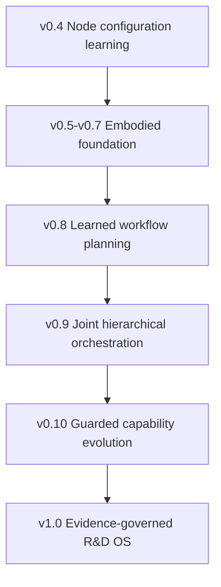

# Accretion v0.8 to v1.0 Technical Package

## Golden Direction Alignment, Dependency Gates, and Reading Order

**Status:** Forward architecture package  
**Date:** 2026-08-20  
**Authority:** Design detail only; implementation remains evidence-gated

---

## 1. Conclusion

Yes. The v0.8-v1.0 technical direction follows Accretion's approved objective as a research-and-development system.

Accretion is not trying to become another base model or a direct copy of Codex or Claude. It uses replaceable runtimes such as Codex and Claude inside a higher-level, evidence-governed R&D workbench. Its distinctive purpose is to connect:

- Rough goals and approved research objectives;
- Literature/evidence and implementation;
- Workflow planning and node execution;
- Experiments and independent verification;
- Reproducibility and cautious learning;
- Software/AI research first, followed by governed Robotics;
- Human authority and machine assistance.

The v0.8-v1.0 sequence preserves that identity.

## 2. Package files

| Document | Research boundary | Implementation status |
|---|---|---|
| `Accretion_SDD_v0.8.md` | Learn validated workflow topology and revision | Locked until v0.7 evidence gate |
| `Accretion_SDD_v0.9.md` | Jointly coordinate graph planning and node configuration | Locked until v0.8 claim gate |
| `Accretion_SDD_v0.10.md` | Propose and evaluate bounded capability improvements | Locked until v0.9 claim gate |
| `Accretion_SDD_v1.0.md` | Integrate the stable evidence-governed R&D OS | Locked until v0.10 and operational gates |

## 3. Release progression

Each release changes exactly one main research authority:

| Release | New learned/governed authority | Explicitly retained restriction |
|---|---|---|
| v0.8 | Graph topology and revision actions | Node router fixed for primary experiment; no authority learning |
| v0.9 | Coordination between graph and node policies | Planner and router authority remain separate |
| v0.10 | Candidate capability proposals | No self-install, self-authorization, or self-promotion |
| v1.0 | No new learning authority; stable integration | All earlier correctness, safety, and human gates remain |

## 4. Alignment with approved objectives

| Approved direction | v0.8 | v0.9 | v0.10 | v1.0 |
|---|---:|---:|---:|---:|
| Primary user is developer-researcher | Yes | Yes | Yes | Primary product persona |
| Software/AI first | Primary claim | Primary claim | First candidate classes | Flagship A |
| Robotics later and governed | Simulation shadow | Simulation/offline replay | Adapter candidates gated | Flagship B and physical safety plane |
| Rough goal becomes structured project | Inherited ObjectiveContract | Inherited | Gap proposals tied to projects | Complete intake lifecycle |
| Research and implementation stay connected | Graph includes evidence/implementation/experiment | Joint end-to-end coordination | Failure evidence drives capability proposals | Unified project/evidence workspace |
| Results independently verified | Frozen graph/node/final verification | Local and final labels separated | Independent held-out evaluation | Full verification plane |
| Incorrect acceptance is unacceptable | Critical promotion blocker | Critical promotion blocker | Critical promotion blocker | Critical incident and release blocker |
| Inconclusive means human review | Yes | Yes | Yes for promotion/verification | Platform-wide queue/state |
| Branch adaptively under uncertainty | Learned bounded graph branches | Joint bounded decisions | Diverse candidate proposals | Governed planning modes |
| Retrieve success, failure, evidence | Planner state | Joint state | Gap Miner | Experience/evidence plane |
| Preserve contradictions | Graph/evidence state | Joint state | Candidate/evaluation lineage | Contradiction Register |
| Team-workspace prior + project adaptation | Planner policy | Joint policy | Gap cohorts | Integrated learning plane |
| Utility balances quality/cost/latency/risk | Planner utility | Joint utility | Candidate improvement utility | ObjectiveContract platform rule |
| Human can inspect and override compatible choices | Planner decision receipt | Two-level receipt | Human promotion | Experiment Studio |
| Physical trial needs one exact approval | No physical exploration | No physical exploration | C6 cannot auto-promote | Exact single-use approval state |

## 5. Research-and-development lifecycle coverage

| R&D stage | Accretion component at v1.0 |
|---|---|
| Goal formulation | Goal intake and ObjectiveContract proposal |
| Research question | ResearchProtocol and claim registry |
| Literature/evidence | Research capabilities, evidence graph, provenance |
| Hypotheses | Typed claims, alternatives, contradictions |
| Planning | Static/dynamic/learned workflow planner |
| Implementation | Runtime workers and isolated workspaces |
| Experiment | Registered node/subgraph/run protocols |
| Verification | Deterministic, independent model, and human hierarchy |
| Reproduction | Pinned run replay and environment manifest |
| Extension | Evidence-gated objective/hypothesis branch |
| Learning | Verified experience, router/planner/coordinator promotion |
| Capability improvement | Sandboxed candidate factory and human promotion |
| Publication | Research object and provenance export |
| Robotics | Simulation, physical trial, and cross-embodiment contracts |

This is why the direction is correctly described as an R&D operating system rather than only an agent router, coding assistant, workflow visualizer, or robotics controller.

## 6. Dependency gates

### 6.1 v0.8 entry

- v0.4 router's unseen-project claim passes;
- v0.7 contracts and evidence lineage are stable;
- Governed planner baselines and graph validator are reproducible;
- Candidate-set/propensity logging exists;
- Rollback to deterministic planning is proven.

### 6.2 v0.9 entry

- v0.8 lowers constrained architecture regret;
- No critical false-acceptance or safety regression;
- Planner and router policies are independently addressable;
- The benchmark can execute factorial plan/router combinations;
- Layer-specific rollback works.

### 6.3 v0.10 entry

- v0.9 lowers total orchestration regret;
- Failure ownership reliably separates planning, configuration, environment, and verifier gaps;
- A measurable gap remains that routing/planning cannot solve;
- Candidate sandbox, hidden holdout, security, and human promotion infrastructure exists.

### 6.4 v1.0 entry

- At least one bounded capability gap closes with held-out improvement;
- No critical correctness, security, safety, policy, or secret regression;
- Reproducibility, canary, rollback, backup, and incident drills pass;
- Software/AI flagship and governed Robotics path produce complete evidence;
- Cross-functional owners approve stable release readiness.

## 7. Scientific claims by release

### v0.8

> Lower constrained architecture regret on unseen Software/AI projects than the strongest governed planner baseline while preserving verified success.

### v0.9

> Lower constrained total orchestration regret than independently optimized planner/router baselines without unsafe coupling.

### v0.10

> Reduce time-to-close verified capability gaps and improve held-out objective completion versus human-only maintenance without critical regression.

### v1.0

> Improve verified objective completion and reduce constrained R&D orchestration regret across registered Software/AI and Robotics research tasks while preserving correctness, security, safety, human authority, and reproducibility gates.

None of these claims should be made without pre-registration, paired evaluation, confidence intervals, minimum practical effects, safety non-regression, and ablations.

## 8. Benchmark evolution

| Release | Primary metric | Strongest required comparison |
|---|---|---|
| v0.8 | Constrained architecture regret | Governed LLM planner and bounded search |
| v0.9 | Constrained total orchestration regret | v0.8 planner + v0.4 router |
| v0.10 | Capability-gap closure and capability improvement regret | Human-only and bounded harness optimizer |
| v1.0 | Verified multi-domain objective completion | Strong end-to-end baseline stack |

Critical false acceptance, policy violation, secret exposure, physical unapproved action, and safety regression remain hard blockers—not utility tradeoffs.

## 9. Technical foundations and how Accretion differs

| Foundation | Useful idea | Accretion adaptation |
|---|---|---|
| AFlow | Search over agentic workflows | Restricted graph grammar and deterministic validation |
| Workflow-R1 | Sequential workflow construction | Conservative staged learning and human review |
| Agent Lightning | Separate execution from training | Immutable evidence and offline promotion |
| Learning to Configure Agentic AI Systems | Hierarchical configuration | Separate structural/configuration authority |
| Self-Harness | Failure mining and bounded harness edits | Independent security/evaluation and human promotion |
| Darwin Gödel Machine / STOP | Empirically evaluate self-proposed changes | Narrow writable surface; no self-authorization |
| W3C PROV | Interoperable provenance concepts | Internal provenance mapped to entities/activities/agents |
| RO-Crate 1.3 | Portable research-object packaging | Accretion profile for protocols, runs, evidence, and verification |
| MCP | Standard tool/context integration | Stable capability IDs plus policy, connections, and Token Broker |
| NIST AI RMF | Lifecycle risk governance | Release, cohort, incident, monitoring, and rollback controls |

## 10. What must not change

The following would violate the Golden Direction even if performance improved:

- Accepting uncertain output to reduce latency;
- Letting a learned planner remove verification or approval nodes;
- Letting the router choose an incompatible verifier;
- Rewarding verifier gaming;
- Treating a plugin manifest as permission;
- Giving an agent raw OAuth or robot-control credentials;
- Using physical trials for online exploration;
- Hiding contradictions or negative experiments;
- Promoting a self-generated capability without independent evaluation and human authority;
- Claiming general intelligence or autonomous science from benchmark gains.

## 11. Recommended implementation order

1. Keep v0.8-v1.0 as design baselines while building/evaluating the active nearer release.
2. At each entry gate, update the next SDD using actual evidence, failure taxonomies, schemas, and measured limits.
3. Freeze the next research protocol before implementing the learned component.
4. Run offline and shadow stages before any guarded online digital exploration.
5. Keep physical systems behind simulation, preflight, safety supervision, exact approval, and target-specific verification.
6. Call v1.0 stable only after end-to-end reproduction, security, incident, backup, and rollback drills.

## 12. Reading order

1. `Accretion_Golden_Direction_v0.4.md`;
2. `Accretion_Roadmap_v0.6_to_v1.0.md`;
3. `Accretion_SDD_v0.8.md`;
4. `Accretion_SDD_v0.9.md`;
5. `Accretion_SDD_v0.10.md`;
6. `Accretion_SDD_v1.0.md`.

The Golden Direction remains the constitutional document. If a later SDD conflicts with it, the SDD must be revised unless a human approves a new Golden Direction version with impact analysis.

## 13. Final assessment

The roadmap is coherent for research and development because it follows a measurable expansion of authority:

1. Learn which configuration should execute an existing node;
2. Learn which validated nodes and edges should exist;
3. Learn how those two decision levels should coordinate;
4. Propose bounded capability changes when orchestration is insufficient;
5. Integrate the proven mechanisms into a stable R&D workbench.

The project's golden direction is therefore:

> **Accretion is an evidence-governed developer-researcher operating system that turns rough Software, AI, and later Robotics goals into reproducible workflows, verified experiments, structured evidence, cautious learning, and human-governed improvement.**

