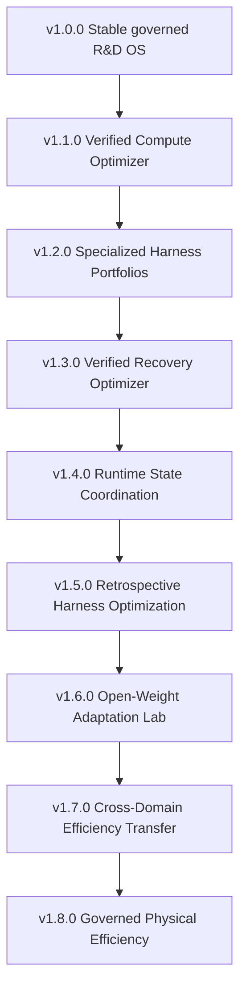

# Accretion v1.x Technical SDD Package

**Document revision:** 3  
**Revised:** 2026-09-05

**Package status:** Forward technical design baseline  
**Prepared:** 2026-09-04  
**Repository:** <https://github.com/santapong/Accretion/tree/develop>  
**Product line covered:** v1.1.0 through v1.8.0  
**Implementation authority:** None; every release remains locked until its entry gate and explicit user authorization pass

---

## 1. Outcome

Revision 3 integrates the 2026-09-05 research review across **every v1.x release**. It keeps revision 2's corrected authority, lifecycle, physical-freeze, TTVS and traceability contracts, then adds a common research-study contract, verifier qualification, adaptive-evaluation logging, observable intervention, evidence derivation and drift fixtures. Read the shared protocol and v1.1 first, then `22_REVISION_3_RESEARCH_INTEGRATION.md`, `23_V1X_RESEARCH_PROGRAM_MATRIX.md` and the owning release SDD. Runtime and scientific acceptance remain pending.

This package defines the post-v1.0 evolution of Accretion. It does **not** revise, replace, or unlock any existing v0.4-v1.0 SDD.

The v1.x theme is:

> **Evidence-governed compute and harness optimization: reduce time-to-verified-success and unnecessary frontier-model use without weakening verified correctness, policy, security, safety, reproducibility, or human authority.**

Accretion v1.0.0 remains the stable prerequisite: an evidence-governed R&D operating system integrating the verified capabilities of v0.4-v0.10. Post-v1.0 releases optimize how that stable system consumes compute, uses harnesses, recovers from failures, coordinates state, and transfers efficiency evidence.

## 2. Frozen predecessor boundary

The following ownership remains unchanged:

| Release | Existing owner capability | v1.x treatment |
|---|---|---|
| v0.4 | Node-level execution-configuration routing | Reused; never redefined |
| v0.5-v0.7 | Simulation, governed physical trials, cross-embodiment transfer | Reused with the same safety and evidence classes |
| v0.8 | Learned graph planning inside deterministic graph grammar | Reused; no competing planner |
| v0.9 | Authority-separated planner/router coordination | Reused; no merged authority |
| v0.10 | Sandboxed capability proposals and human promotion | Reused for any harness or adapter candidate |
| v1.0.0 | Stable integrated R&D OS | Required baseline and rollback target |

No file in this package changes those documents. Any conflict is resolved in favor of the original Golden Direction, the existing cross-release registry, and the v1.0 SDD.

### 2.1 Repository planning snapshot

The package was checked read-only against `santapong/Accretion` `develop` at commit `e66a7b996eeb27a588631a52fb3811c8a3e447f3` on 2026-09-05 UTC. The repository reports v0.3.0 released and v0.4 unlocked; the current commit adds the v0.4 freeze delta for `ShadowRolloutResult`, `RouterActivation`, and the objective-owned exploration policy. This is repository-reported implementation evidence, not a line-by-line audit or a v1.x readiness result. v1.x remains forward planning, and this revision makes no repository, branch, issue, or pull-request change.

Current v0.4 name reconciliations are inherited, including the semantic v0.4 `VerificationResult` implemented in code as `IndependentVerificationResult`, the distinct v0.2 `CompatibilityAssessment` and v0.4 `CompatibilityDecision`, the total `RiskClass`-to-`RiskLevel` mapping, and `ApprovalArtifactRef` for approval receipts.

## 3. Release sequence



| Release | Primary change | Main evidence claim |
|---|---|---|
| v1.1.0 | Tiered compute profiles and TTVS-aware selection | Cost-aware adaptive profiling followed by governed per-node selection |
| v1.2.0 | Compiled specialized harness portfolios | Factorial harness effect and joint-selection value after the profile-only gate |
| v1.3.0 | Learned targeted repair and escalation | Observable snapshot intervention and value-of-replay before learned recovery |
| v1.4.0 | Learned access to Belief, Progress, and Experience views | Trust-preserving derivation, poisoning resistance and selective invalidation |
| v1.5.0 | Offline trace-driven harness proposals | Adaptive trace acquisition and held-out improvement with total search cost |
| v1.6.0 | Sandboxed open-weight adapter/policy adaptation | Verifier-qualified pseudo-labels and calibrated adaptation under shift |
| v1.7.0 | Weak-prior transfer of efficiency profiles in simulation | Matched-budget recalibration and negative-transfer control |
| v1.8.0 | Advisory optimization for approved physical workflows | Fixed-graph workflow allocation in simulation before any physical advisory claim |

## 4. Permanent optimization contract

The primary optimization target is **capped time-to-verified-success**, not raw latency, raw token count, or the number of frontier-model calls.

For an eligible node execution:

\[
TTVS_H=\min(T_{pass},H)
\]

where \(T_{pass}\) is READY-to-committed-independent-PASS wall time. If no PASS is established by \(H\), the observation contributes \(H\). Component spans are recorded separately; overlapping work is never summed into wall time.

Optimization is constrained by:

\[
\operatorname{LCB}\left(P(VerifiedPass\mid x,a)\right) \ge \tau(x)
\]

plus deterministic compatibility, policy, risk, budget, verifier, identity, and approval gates. An efficiency gain cannot compensate for a critical false acceptance, policy violation, secret exposure, safety regression, unapproved physical action, or loss of reproducibility.

## 5. Permanent authority boundary

Learned v1.x components may rank or select only pre-authorized, policy-compatible options. They may never:

- create or expand authority;
- change an approved objective;
- remove or weaken required verification;
- accept their own produced result;
- turn `FAIL`, `INCONCLUSIVE`, `ERROR`, or `QUARANTINED` into `PASS`;
- expose or select raw credentials;
- self-promote a policy, harness, capability, or adapter;
- change a physical safety envelope, controller, stop path, or approval rule;
- perform online exploration or automatic retry during physical/high-risk execution;
- rewrite historical evidence or contradictions.

## 6. Package map

```text
00_READ_ME_FIRST.md
01_SEMVER_AND_CHANGE_CONTROL.md
02_CROSS_RELEASE_CONTRACT_REGISTRY_v1.x.md
03_SHARED_RESEARCH_EVALUATION_PROTOCOL.md
04_Accretion_SDD_v1.1.0.md
05_Accretion_SDD_v1.2.0.md
06_Accretion_SDD_v1.3.0.md
07_Accretion_SDD_v1.4.0.md
08_Accretion_SDD_v1.5.0.md
09_Accretion_SDD_v1.6.0.md
10_Accretion_SDD_v1.7.0.md
11_Accretion_SDD_v1.8.0.md
12_PATCH_RELEASE_SDD_TEMPLATE.md
13_RESEARCH_INTAKE_AND_SDD_AMENDMENT_PROCESS.md
14_REVISION_2_TECHNICAL_ADDENDUM.md
15_CONTRACT_KIT.json
16_EVENT_CATALOG.json
17_CONTRACT_LIFECYCLE_FIXTURES.json
18_ACCEPTANCE_TRACEABILITY.json
19_validate_revision2.py
20_validation_requirements.txt
21_REVISION_2_VALIDATION_REPORT.md
22_REVISION_3_RESEARCH_INTEGRATION.md
23_V1X_RESEARCH_PROGRAM_MATRIX.md
24_V1_1_PILOT_READINESS_AND_PROTOCOL.md
25_RESEARCH_SOURCE_REGISTER.md
26_validate_revision3.py
27_REVISION_3_VALIDATION_REPORT.md
MANIFEST.sha256
```

## 7. Normative reading order

1. Existing `Accretion_Golden_Direction_v0.4.md`;
2. Existing `Accretion_Cross_Release_Contract_Registry_v0.4_to_v1.0.md`;
3. Existing `Accretion_SDD_v1.0.md`;
4. `01_SEMVER_AND_CHANGE_CONTROL.md`;
5. `02_CROSS_RELEASE_CONTRACT_REGISTRY_v1.x.md`;
6. `03_SHARED_RESEARCH_EVALUATION_PROTOCOL.md`;
7. `22_REVISION_3_RESEARCH_INTEGRATION.md` and `23_V1X_RESEARCH_PROGRAM_MATRIX.md`;
8. The currently unlocked v1.x SDD;
9. The release-specific pilot or study amendment when present;
10. Later locked SDDs as design context only;
11. Patch and research-amendment templates.

## 8. Status vocabulary

Each SDD uses these states:

```text
PROPOSED → APPROVED_DESIGN → ENTRY_BLOCKED → IMPLEMENTING
→ EVALUATING → RELEASE_CANDIDATE → RELEASED
→ DEPRECATED | ROLLED_BACK | REVOKED
```

- `PROPOSED` is not approved implementation scope.
- `APPROVED_DESIGN` means the design may guide interfaces but is still release-gated.
- `ENTRY_BLOCKED` means a predecessor claim or operational gate is incomplete.
- `RELEASED` requires every mandatory acceptance gate.
- A critical incident can move a deployed component to `REVOKED` without deleting history.

## 9. Feature release versus patch release

This package uses Semantic Versioning:

- `1.2.0` introduces the new backward-compatible v1.2 feature set.
- `1.2.1` fixes or internally optimizes the released v1.2 behavior without adding a new capability or changing public semantics.
- New SDD detail before software release changes the **document revision**, not the product patch number.
- A new learned model or harness artifact has its own immutable artifact version; it does not automatically change the Accretion product version.

See `01_SEMVER_AND_CHANGE_CONTROL.md` for binding rules and examples.

## 10. Implementation discipline

Before implementing any v1.x release:

1. Inspect the actual repository branch, commit, worktree, instructions, schemas, migrations, and tests.
2. Verify v1.0.0 stability and every declared operational dependency and required promotion gate. Keep platform readiness, research closure and artifact promotion separate. v1.6 is an optional lab: a governed FAIL/INCONCLUSIVE/DEFERRED research closure can precede v1.7 without promoting an adapter; critical incidents and operational gates cannot be bypassed. All other explicit entry conditions still apply.
3. Revalidate paper assumptions and provider capabilities against current primary sources.
4. Freeze the release ResearchProtocol, metrics, cohorts, exclusions, and minimum meaningful effect.
5. Produce an ADR for every conflict with an existing contract owner.
6. Implement one bounded end-to-end milestone at a time.
7. Run unit, property, integration, replay, adversarial, migration, security, and acceptance suites.
8. Obtain explicit user authorization for implementation and separate authorization for any GitHub write, release, or deployment action.

## 11. Research status

All new algorithms in this package are `PROPOSED` adaptations until Accretion evaluates them. Reported paper results are evidence that a direction is plausible, not evidence that Accretion will obtain the same result.

Primary inspirations include:

- [FlowCompile](https://arxiv.org/abs/2605.13647);
- [Better Harnesses, Smaller Models](https://arxiv.org/abs/2607.08938);
- [Meta-Harness](https://arxiv.org/abs/2603.28052);
- [Adaptive Auto-Harness](https://arxiv.org/abs/2606.01770);
- [Retrospective Harness Optimization](https://arxiv.org/abs/2606.05922);
- [EvoHarness-RL](https://arxiv.org/abs/2608.05446);
- [TTPO](https://arxiv.org/abs/2608.27448).

Revision 3 adds source-verified design constraints from Task-CoEvolve, AgentRewardBench, CausalFlow, Conformal Thinking, Memory Poisoning, Who & When, GraphTracer, AgentDojo and HexAGenT. Their reported outcomes are not Accretion results. `25_RESEARCH_SOURCE_REGISTER.md` records the exact source versions, reviewed sections, limitations and permitted uses.

### 11.1 Current research readiness

| Scope | Revision-3 readiness | Reason |
|---|---|---|
| v1.1 offline trace inventory | `READY_TO_SPECIFY` | Repository has relevant typed outcomes and replay fixtures, but compatibility and completeness must be audited |
| v1.1 live pilot | `BLOCKED_PREDECESSOR_AND_INPUTS` | v1.0 is not released; three compatible profile slots, complete timing/cost fields and untouched project lineages are not frozen |
| v1.2-v1.8 studies | `ENTRY_BLOCKED` | Each retains its predecessor release and release-specific evidence gates |
| Research claims | `NOT_EVALUATED` | Document and fixture validation cannot establish empirical benefit |

The next authorized work product is therefore the v1.1 readiness inventory and frozen pilot protocol. It does not start paid calls, training, live routing, or physical execution.

## 12. Handoff rule

The package documents a destination, not a command to skip releases:

> **Implement only the next explicitly authorized, evidence-unlocked release. Preserve v1.0.0 as a tested conservative fallback until a later release independently earns replacement authority.**
