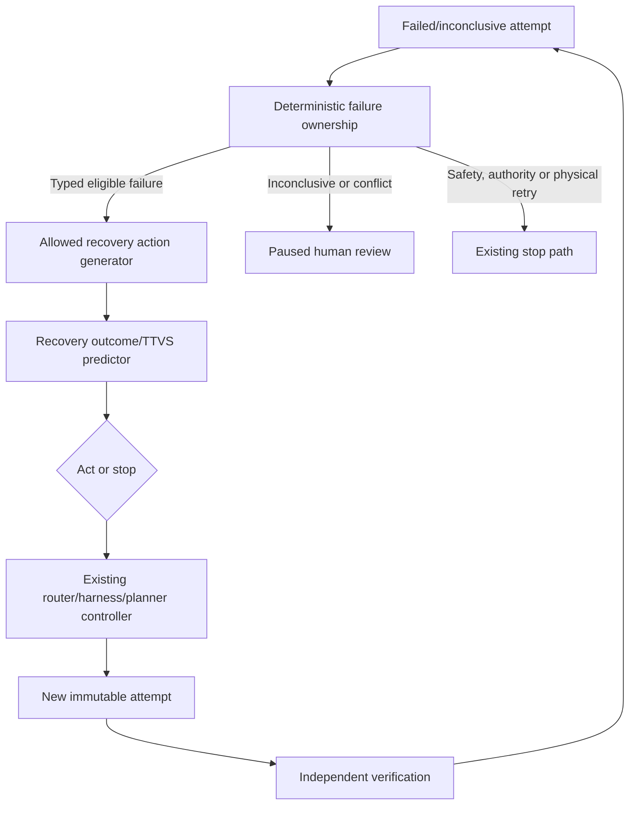

# Accretion v1.3.0 Software Design Description

## Verified Recovery and Escalation Optimizer

**Document status:** Forward technical design baseline  
**Document revision:** 3  
**Release authority:** Locked until v1.2.0 passes all gates  
**Primary domain:** Low-risk digital Software/AI execution  
**Primary objective:** Reduce wasted attempts and escalation time after a typed failure

---

## 1. Purpose and primary claim

v1.3.0 learns which permitted recovery action, if any, should follow a typed eligible failed digital execution. INCONCLUSIVE or verifier conflict pauses for human review before learned action selection. It reasons over an append-only attempt chain and remaining budget, then chooses permitted targeted repair, escalation, replan request, human review, or stop under the deterministic matrix in §10.5.

Primary research claim:

> On eligible low-risk digital failures, the Verified Recovery Optimizer reduces incremental TTVS, wasted compute, and unnecessary frontier escalation relative to the strongest v1.2 deterministic recovery baseline, while preserving verified success, hard termination, correct failure ownership, and critical non-regression.

## 2. Golden Direction alignment

- The existing failure taxonomy determines the recovery owner before learning.
- The router handles configuration failures; the planner handles structural failures.
- Safety, authority, and unresolved unknown failures stop automation.
- A recovery action creates a new execution record; it never edits the failed record.
- Verification remains independent and frozen.
- Every loop retains hard resource caps and an expected-value threshold.
- Physical/high-risk execution has no automatic retry or learned recovery.

## 3. Entry conditions

1. v1.2 passes its verified efficiency claim.
2. Failure ownership is reliable on a preregistered labeled/verified suite.
3. Attempt chains capture changes, timing, cost, evidence, and verification.
4. Equivalent-attempt detection is available to prevent disguised repetition.
5. Deterministic recovery and escalation baselines are stable.
6. Planner, router, harness selector, and capability manager remain separately callable and rollbackable.
7. The v1.0 cancellation, budget, policy, and incident paths pass fault injection.
8. A release protocol freezes allowed actions, maximum chain length, EVI threshold, and risk cohorts.

## 4. Scope

### Included

- `RecoveryContext`, `RecoveryCandidate`, `RecoveryDecisionReceipt`, `AttemptChain`, and `RecoveryOutcome`;
- Typed recovery actions defined by the v1.x registry;
- Failure-class and recurrence prediction;
- Expected verified improvement and incremental TTVS prediction;
- Equivalent-attempt detection;
- Targeted context/tool/harness/budget/model-tier changes;
- Requesting, but not performing, graph replanning;
- Abstain/pause/stop actions;
- Offline learning, shadow, low-risk digital canary, rollback;
- Studio attempt-chain and recovery explanation.

### Excluded

- Recovery from policy or authority denial through alternate credentials/routes;
- Learned recovery for physical/high-risk execution;
- Automatic physical retry;
- Silent objective, graph, verifier, or safety modification;
- Unlimited retry/search;
- Treating `INCONCLUSIVE` as success or failure without resolution;
- New capability generation;
- End-to-end monolithic RL over the whole system.

## 5. Inherited invariants

All predecessor contracts remain authoritative. Recovery cannot:

- retry an equivalent failed action without new evidence or a typed transient reason;
- exceed NodeContract or ObjectiveContract budgets;
- bypass a failed required verifier;
- hide attempts from TTVS/cost accounting;
- change failure ownership to gain a more permissive action;
- use human approval as proof of correctness;
- resume from a critical incident without authorized remediation.

## 6. System context and authority



The learned optimizer ranks actions. Existing authoritative controllers execute them. A planner request is a request, not an unvalidated graph edit.

## 7. Components

### 7.1 Failure Ownership Resolver

- Combines deterministic error codes, contract violations, verifier results, and environment evidence;
- may use a learned diagnostic as supporting evidence but not to override hard safety/authority classification;
- emits confidence and unresolved fields;
- maps unresolved material ambiguity to `UNKNOWN` and pauses.

### 7.2 Attempt Chain Store

- Records causal parent, changed dimensions, execution/verification evidence, budgets, and result;
- computes semantic/configuration fingerprints for equivalence detection;
- preserves every failed/inconclusive attempt;
- exposes a bounded redacted view to the recovery model.

### 7.3 Recovery Candidate Generator

Generates only actions allowed by:

- failure owner;
- NodeContract failure policy;
- ObjectiveContract budget/risk;
- remaining attempts/time/cost;
- compatible compute/harness/tool portfolios;
- graph grammar and planner interface;
- human review/approval policy.

### 7.4 Recovery Predictor

Predicts:

- probability of terminal verified PASS after the action;
- probability of repeated/equivalent failure;
- incremental execution, verification, and escalation time;
- incremental cost and frontier use;
- uncertainty/OOD;
- critical-risk flags.

### 7.5 Recovery Controller

- Applies hard gates and conservative EVI threshold;
- chooses one action or stop/pause;
- emits the receipt;
- dispatches to the existing owning controller;
- atomically reserves attempt/budget before execution;
- stops when the reservation or action becomes stale.

## 8. Contracts

```yaml
RecoveryContext:
  recovery_context_id: uuid
  failure_event_ref: object
  failure_owner: CONFIGURATION | STRUCTURAL | CAPABILITY | VERIFICATION |
                 ENVIRONMENT | SAFETY | AUTHORITY | RESOURCE | UNKNOWN
  attempt_chain_ref: object
  node_contract_ref: object
  verification_spec_ref: object
  remaining_budget: object
  permitted_action_types: [string]
  current_compute_profile_ref: object
  current_harness_ref: object | null
  graph_revision_ref: object
  context_hash: sha256

RecoveryDecisionReceipt:
  decision_id: uuid
  recovery_context_ref: object
  candidates: [RecoveryCandidate]
  selected_action: object | null
  selected_action_evi_lcb: number | null
  decision: ACT | PAUSE | STOP
  stop_reason: string | null
  reservation_ref: object | null
  policy_artifact_ref: object
  content_hash: sha256
```

## 9. Lifecycle and state machines

### Recovery decision

```text
CREATED → OWNERSHIP_RESOLVED → CANDIDATES_FILTERED → RANKED
→ RESERVED → DISPATCHED → ATTEMPT_RECORDED → VERIFIED
```

Terminal branches:

```text
PAUSED_HUMAN | STOPPED_BUDGET | STOPPED_EVI | STOPPED_POLICY
| STOPPED_SAFETY | STOPPED_AUTHORITY | SUCCEEDED | FAILED
```

A stale reservation, changed objective/graph/policy, or consumed budget invalidates dispatch and requires a new RecoveryContext.

## 10. Algorithms and rules

### 10.1 Expected value of recovery

For recovery action \(r\):

\[
EVI(r)=P_{pass}(r)V_{pass}-C(r)-\lambda_T T(r)-\lambda_F P_{repeat}(r)
\]

Execute only when:

\[
HardGates(r)=PASS \land BudgetReserved(r) \land LCB(EVI(r))>\epsilon
\]

Correctness/safety/authority are constraints, not negative utility terms.

### 10.2 Equivalent-attempt rule

An attempt is equivalent when relevant graph, node, configuration, harness, context evidence, environment, and failure-triggering conditions are unchanged within the registered equivalence spec. An equivalent retry is allowed only for a typed transient failure with bounded retry policy and new attempt reservation.

### 10.3 Escalation

Escalation chooses the minimum additional capability/budget expected to clear the failure, not automatically the largest model. A failed low-tier attempt plus escalation remains fully included in TTVS.

### 10.4 Structural handoff

For `STRUCTURAL`, the optimizer may emit `REQUEST_REPLAN` containing the failure evidence and constraints. v0.8/v0.9 planning owns candidate graphs and deterministic validation. Recovery cannot specify an unvalidated topology as executable authority.

### 10.5 Verification failures

INCONCLUSIVE or verifier conflict first enters PAUSED_HUMAN. Bounded, non-mutating evidence collection or cross-verification may run inside that paused state only when allowed by the frozen VerificationSpec and policy. It cannot dispatch a producing recovery action, accept an output, or resume execution. An authorized human resolution receipt must reference the original conflict and all new evidence; independent verification under the frozen semantics is still required for PASS. Human approval alone is not verification. A changed VerificationSpec creates a new evaluation context and never rewrites the historical result.

| Input (highest-priority matching row) | Deterministic action | Resume condition |
|---|---|---|
| Safety/authority denial or QUARANTINED | STOP and incident/quarantine handling | Existing authorized incident process, new context |
| Physical/high-risk failed attempt | STOP; no automatic retry | New exact governed trial/approval if separately authorized |
| INCONCLUSIVE, verifier disagreement, unresolved UNKNOWN | PAUSED_HUMAN | Explicit human resolution plus independent evidence; never model decision alone |
| PASS without unresolved conflict | Record success; no recovery | Normal existing controller transition |
| FAIL with typed eligible digital failure | Consider permitted recovery | Final compatibility, budget reservation, chain/equivalence caps |
| ERROR with verified transient eligible digital cause | Consider bounded retry | Same gates; uncertain invocation is reconciled or paused |
| Missing status or any other case | PAUSED_HUMAN | Resolve authoritative status/ownership first |

Conflicts take precedence over a competing PASS. All original outcomes and contradictory evidence remain immutable. See lifecycle fixtures RECOVERY_CONFLICT and RECOVERY_RESOLUTION in the revision-2 kit.

## 11. APIs and idempotency

| Method | Endpoint | Purpose |
|---|---|---|
| GET | `/api/v1/attempt-chains/{id}` | Inspect immutable causal chain |
| POST | `/api/v1/failures/{id}/recovery-decisions` | Create one decision/stop receipt |
| GET | `/api/v1/recovery-decisions/{id}` | Inspect candidates and evidence |
| POST | `/api/v1/recovery-decisions/{id}/dispatch` | Reserve and dispatch selected action |
| POST | `/api/v1/recovery-policies/{id}/promote` | Promote evaluated policy |
| POST | `/api/v1/recovery-policies/{id}/rollback` | Cohort rollback |

Decision and dispatch use distinct idempotency keys. Dispatch requires expected decision version, unexpired reservation, current objective/graph/policy hashes, and sufficient remaining budget.

## 12. Events and replay

```text
failure.ownership.resolved
failure.ownership.unknown
recovery.candidates.generated
recovery.decision.recorded
recovery.decision.stopped
recovery.budget.reserved
recovery.action.dispatched
recovery.attempt.completed
recovery.outcome.recorded
recovery.policy.rolled_back
```

Replay reconstructs the full attempt chain, candidate set, predicted EVI/TTVS, reservation, dispatched controller command, new execution, verification, and final status.

## 13. Persistence and migrations

- Add recovery-context, candidate, decision, reservation, attempt-chain edge, and outcome aggregates.
- Existing attempts remain immutable and gain additive causal references only.
- Budget reservation uses transactional locking/optimistic concurrency to prevent duplicate attempts.
- Projections may summarize chains but link every raw attempt/evidence record.
- Model features are derived from redacted immutable chain snapshots.
- Rollback disables learned policy while deterministic recovery remains functional.

## 14. Identity, tenancy, secrets, and policy

- Recovery inherits the initiating principal and project scope; it cannot switch identity.
- Connection failures cannot trigger credential discovery or alternate-owner connections.
- Model views redact secrets, hidden verifier fixtures, and unrelated tenant data.
- External side-effect recovery requires existing idempotency/external-effect receipts.
- A denied action is removed before ranking and logged with policy receipt.
- Human review/override is authenticated and cannot retroactively delete a failed attempt.

## 15. Failure handling

| Internal failure | Behavior |
|---|---|
| Ownership unresolved | Pause human review |
| Predictor unavailable | Deterministic predecessor recovery |
| Candidate generator error | Stop and emit ERROR; no ad hoc retry |
| Duplicate/equivalent action | Remove or typed transient-only path |
| Budget race | Cancel dispatch and recompute context |
| Controller dispatch timeout | Reconcile by idempotency/external receipt before retry |
| Policy changes after decision | Invalidate decision |
| Critical incident | Revoke learned recovery and quarantine lineage |

## 16. Verification and contradictions

- Every recovery attempt is independently verified against the same or stronger frozen semantics.
- Recovery success means terminal verified PASS, not disappearance of the original error.
- Conflicting failure-owner evidence produces `UNKNOWN` or human review.
- False recovery attribution is recorded and used only after eligibility review.
- Discovered false acceptance quarantines the complete causal chain and derived policy data.
- Human resolution appends a decision; it does not rewrite evidence.

## 17. Observability and Experiment Studio

Add:

- causal attempt-chain timeline;
- failure owner and supporting evidence;
- permitted/rejected recovery candidates;
- predicted versus observed EVI, TTVS, cost, repeat probability;
- remaining caps and reservation status;
- equivalent-attempt warning;
- escalation path and frontier usage;
- stop/pause reason;
- compatible human override and reason;
- policy cohort, canary, drift, and rollback health.

## 18. Test strategy

### Unit/property

- Failure-to-action permission matrix;
- safety/authority/unknown always stop;
- caps monotonically decrease;
- equivalent attempts cannot loop;
- EVI threshold and uncertainty abstention;
- atomic reservations and idempotency;
- immutable attempt chains.

### Integration/fault injection

- Router/harness/planner/capability/verifier handoffs;
- provider timeouts and ambiguous external side effects;
- budget races and orchestrator restart;
- human review pause/resume;
- policy change invalidation;
- event replay and rollback.

### Adversarial

- Agent mislabels failure to gain tools/model;
- prompt injection requesting weaker verification;
- retry amplification/denial of service;
- hidden attempt/cost manipulation;
- credential switching;
- self-approval or graph-edit smuggling.

## 19. Research benchmark

Construct failure episodes from held-out Software/AI projects, including configuration mismatch, tool-schema error, missing context/evidence, transient provider error, environment mismatch, verifier disagreement, and genuine structural failure.

Required baselines:

1. v1.2 deterministic recovery;
2. always retry same profile;
3. always escalate frontier;
4. rule-based failure-to-action map;
5. learned failure classifier plus fixed action;
6. full constrained recovery optimizer;
7. post-hoc best permitted recovery.

Primary endpoint: capped time to independently verified PASS from the first eligible failed attempt under a separately frozen recovery horizon, retaining every allocated recovery chain. No PASS by that horizon contributes the full horizon, including stops and human pauses. Report full-workflow capped TTVS separately to detect shifted costs; raw time-to-terminal is diagnostic. Verified-success constraints remain mandatory. Report stop quality, repeated-failure rate, compute waste, frontier escalations, chain length, and human-review burden.

Required ablations:

- no attempt-chain history;
- no equivalence detector;
- no EVI stopping;
- no uncertainty/OOD gate;
- no failure ownership gate;
- no verification-cost model;
- local-only versus final-run feedback.

### 19.1 Revision-3 observable-intervention replay study

The causal-blame sub-study is limited to observable interventions in restorable digital environments. Each episode freezes a pre-intervention snapshot, changes exactly one typed component—context bundle, tool binding, artifact producer, compute profile or harness boundary—and re-executes the actual affected descendants. The proposer cannot read gold outputs, hidden tests or the independent verifier result while choosing the intervention.

An intervention may support a bounded causal statement only when snapshot restoration succeeds, the changed component is isolated, descendants actually rerun, independent verification is available, side effects are checked and the same episode is compared with full deterministic retry. Prediction-only counterfactuals are labeled `PREDICTIVE_ONLY`; they may prioritize tests but cannot prove recovery or causal responsibility. The study separately reports snapshot cost, invalidation cost, re-execution cost, full-retry cost, verification cost and saved work.

The value-of-replay gate requires a useful verified outcome or diagnostic gain after accounting for instrumentation and restore overhead. If restorable coverage is too small, the study closes `INCONCLUSIVE` or `DEFERRED` rather than substituting a model-scored outcome.

## 20. Implementation milestones

| Milestone | Deliverable | Exit evidence |
|---|---|---|
| R1 | AttemptChain and RecoveryContext | Contract/replay tests |
| R2 | Ownership and allowed-action engine | Labeled suite + hard-gate tests |
| R3 | Deterministic recovery baseline | Fault-injection benchmark |
| R4 | Predictors/EVI selector | Calibration and offline report |
| R5 | Transactional dispatch/reservation | Race/idempotency/restart tests |
| R6 | Shadow and Studio | Explanation and parity tests |
| R7 | Low-risk canary | Canary/rollback report |
| R8 | Scientific and operational gate | Full reproducibility/security sign-off |

## 21. Release acceptance criteria

Stable IDs map to accountable roles, evidence targets and design fixtures in `18_ACCEPTANCE_TRACEABILITY.json`. All implementation/research evidence remains pending.

- [ ] **AC13-R2-001** Every recovery begins with a typed failure and deterministic owner gate.
- [ ] **AC13-R2-002** Safety, authority, and unresolved unknown failures never enter learned automatic recovery.
- [ ] **AC13-R2-003** Physical/high-risk automatic retry is impossible.
- [ ] **AC13-R1-004** Attempt chains are immutable, complete, and replayable.
- [ ] **AC13-R3-005** Equivalent failed attempts cannot repeat without a valid transient reason.
- [ ] **AC13-R3-006** Caps and EVI threshold terminate every chain.
- [ ] **AC13-R5-007** All actions are policy-compatible and transactionally budget-reserved.
- [ ] **AC13-R5-008** Structural recovery is handed to the planner, not executed by the recovery model.
- [ ] **AC13-R2-009** Verification cannot be weakened or skipped.
- [ ] **AC13-R3-010** v1.2 deterministic recovery remains immediately available.
- [ ] **AC13-R8-011** No critical correctness, policy, authority, secret, isolation, or safety regression occurs.
- [ ] **AC13-R8-012** Verified-success constraint passes globally and on critical cohorts.
- [ ] **AC13-R8-013** Incremental TTVS improvement meets the preregistered effect/confidence gate.
- [ ] **AC13-R8-014** Required baselines, fault injection, adversarial tests, and ablations pass.
- [ ] **AC13-R7-015** Shadow, canary, rollback, incident, and quarantine drills pass.
- [ ] **AC13-R2-016** INCONCLUSIVE or conflicting verification pauses before learned recovery; human resolution and independent evidence are required before acceptance or resumption.
- [ ] **AC13-R8-017** A causal recovery claim requires a restorable snapshot, one typed intervention, actual descendant re-execution, no proposer access to gold outputs, independent verification and a passed side-effect check; predictive-only records remain diagnostic.

## 22. Open questions and defaults

| ID | Question | Proposed default | Resolve by |
|---|---|---|---|
| R-OQ1 | Initial live failure classes | Configuration, capability binding, environment, resource/transient | Protocol freeze |
| R-OQ2 | Structural action | Request planner; never direct edit | R2 |
| R-OQ3 | Max learned chain | Objective/NodeContract cap, additionally conservative global cap | R3 |
| R-OQ4 | EVI model | Calibrated success + quantile TTVS/cost | R4 |
| R-OQ5 | Human review | Mandatory for verification conflict and unresolved UNKNOWN | R2 |
| R-OQ6 | Robotics | Simulation shadow; physical excluded | Release gate |

## 23. Handoff to v1.4.0

v1.4 remains locked until:

1. v1.3 passes its scientific and operational gates;
2. Attempt chains and progress state are reliable and structured;
3. Long-horizon failures show a measurable state-access/context-management gap;
4. Authoritative evidence/progress/experience can expose least-privilege read views;
5. Proposed state updates can be deterministically validated and appended;
6. Hidden chain-of-thought is not required for the product contract.
