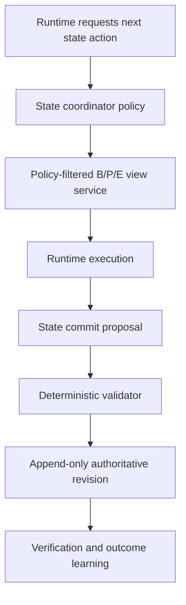

# Accretion v1.4.0 Software Design Description

## Evidence-Grounded Runtime State Coordination

**Document status:** Forward technical design baseline  
**Document revision:** 3  
**Release authority:** Locked until v1.3.0 passes all gates  
**Primary domain:** Long-horizon low-risk digital workflows  
**Research inspiration:** Belief–Progress–Experience coordination, adapted to Accretion's authoritative evidence model

---

## 1. Purpose and primary claim

v1.4.0 adds a learned policy for deciding when and how an executing runtime should inspect, retrieve, summarize, or propose updates to structured state. It reduces repeated context loading and lost-progress failures without making model memory authoritative.

Primary claim:

> On unseen long-horizon Software/AI workflows, evidence-grounded learned state coordination reduces TTVS, context tokens, redundant harness/state calls, and state-related recovery episodes relative to the strongest v1.3 static-state baseline, while preserving verified success, provenance, contradiction visibility, and state authority.

## 2. Golden Direction alignment

- Backend project/run/evidence state remains authoritative.
- Runtime workers receive least-privilege projections, not unrestricted database access.
- Belief means structured claims, evidence, uncertainty, and contradictions—not model opinion promoted to truth.
- Progress is a versioned execution projection linked to graph/node/attempt evidence.
- Experience contains only eligible, verified, compatible records.
- The learned coordinator selects state operations; deterministic services validate and commit them.
- No hidden chain-of-thought is required or treated as evidence.

## 3. Entry conditions

1. v1.3 attempt chains and failure ownership pass.
2. v1.0 project/evidence/experience stores expose versioned least-privilege views.
3. Progress transitions are tied to authoritative graph/node execution state.
4. Contradiction and quarantine propagation are operational.
5. State reads/writes have measurable latency, token, and verification cost.
6. Static/always-load/on-demand heuristic baselines are reproducible.
7. A measurable state-management bottleneck exists on long-horizon tasks.
8. The ResearchProtocol freezes state actions, capacities, privacy rules, and evaluation cohorts.

## 4. Scope

### Included

- Bounded Belief, Progress, and Experience state views;
- Learned selection of `INSPECT`, `RETRIEVE`, `SUMMARIZE`, `PROPOSE_UPDATE`, `NO_OP`, and `EVICT_DERIVED_CACHE`;
- Deterministic validation of state proposals;
- Retrieval budgets and per-node visibility;
- Provenance-preserving summaries;
- State snapshots and decision receipts;
- Offline learning, shadow, low-risk canary, rollback;
- Studio visualization and state-cost analysis.

### Excluded

- Storing private chain-of-thought as a required artifact;
- Direct model writes to authoritative project/evidence/run state;
- Deleting evidence, contradictions, audit, approvals, or incidents;
- Converting unverified notes into eligible experience;
- Cross-workspace retrieval by default;
- Learned physical control, safety state, approval, or automatic physical retry;
- Unlimited memory/retrieval/context expansion;
- End-to-end RL over all Accretion authority.

## 5. Inherited invariants

- Structured backend state, not chat or runtime memory, is authoritative.
- Every view is policy-filtered, versioned, content-hashed, and auditable.
- State proposals are append-only revisions linked to their sources.
- Contradictory claims coexist until resolved.
- `INCONCLUSIVE` remains unresolved and visible.
- Experience eligibility and transfer compatibility precede retrieval.
- Secrets and hidden verifier fixtures never enter model-visible views.
- Safety/controller state remains outside learned write authority.

## 6. System context and authority



The state coordinator never bypasses the view service or validator. A rejected state proposal does not mutate state and remains recorded as evidence.

## 7. Components

### 7.1 State View Service

- Materializes least-privilege views from authoritative records;
- enforces workspace/project/run/node and data-classification scope;
- includes provenance and freshness;
- redacts secrets and unsupported fields;
- supports bounded pagination/retrieval;
- produces immutable `RuntimeStateView` digests.

### 7.2 Belief Projector

Projects:

- registered claims and status;
- supporting/refuting/ambiguous evidence refs;
- verifier outcomes and independence;
- uncertainty and unresolved questions;
- contradictions and resolution state.

It never labels a claim true solely because a model wrote it.

### 7.3 Progress Projector

Projects graph/node/subgoal state, blockers, attempt-chain references, remaining caps, and next allowed transitions. A runtime can propose a semantic progress annotation, but authoritative completion comes from execution and verification state machines.

### 7.4 Experience Retriever

- Reuses existing eligibility/compatibility gates;
- ranks already compatible experiences;
- caps cross-domain influence;
- returns successes, failures, and contradictions;
- records retrieval and non-retrieval reasons.

### 7.5 State Coordination Policy

Predicts expected information value and cost for allowed actions. Initial implementation uses supervised/offline policy learning; cost-aware RL is optional only after a separate approved experiment.

### 7.6 State Validator/Committer

Checks schema, provenance, authority, evidence links, contradiction preservation, monotonic execution semantics, retention, and concurrency. It writes a new version or rejects with typed reasons.

## 8. Contracts

```yaml
RuntimeStateView:
  view_id: uuid
  partition: BELIEF | PROGRESS | EXPERIENCE
  subject_refs: [object]
  source_snapshot_refs: [object]
  visible_fields: [string]
  redaction_receipt_ref: object
  freshness: object
  item_count: integer
  token_estimate: integer
  expires_at: timestamp | null
  content_hash: sha256

StateAccessAction:
  action_id: uuid
  action_type: INSPECT | RETRIEVE | SUMMARIZE | PROPOSE_UPDATE |
               EVICT_DERIVED_CACHE | NO_OP
  partition: BELIEF | PROGRESS | EXPERIENCE
  query_or_scope: object
  max_items: integer
  max_tokens: integer
  max_latency_ms: integer
  policy_decision_ref: object

StateCommitProposal:
  proposal_id: uuid
  target_partition: BELIEF | PROGRESS | EXPERIENCE
  proposed_operations: [object]
  source_evidence_refs: [object]
  base_version: integer
  runtime_output_ref: object
  content_hash: sha256
```

`StateValidationReceipt` records accepted/rejected operations and resulting revision refs. Experience proposals cannot become eligible without normal verification and promotion rules.

## 9. Lifecycle and state machines

### State action

```text
PROPOSED → POLICY_FILTERED → RESERVED → EXECUTED → RECORDED
                 ↘ DENIED
```

### Commit proposal

```text
DRAFT → VALIDATING → ACCEPTED_AS_NEW_REVISION | REJECTED | CONFLICT
```

### State policy

```text
CANDIDATE → OFFLINE_EVALUATED → SHADOW → CANARY_LOW_DIGITAL
→ ACTIVE_COHORT → ROLLED_BACK | REVOKED
```

## 10. Algorithms and rules

### 10.1 Action objective

For state action \(s\):

\[
VOI(s)=E[\Delta P(VerifiedPass)|s]-\lambda_T T_s-\lambda_C C_s-\lambda_K Tokens_s
\]

The coordinator chooses an allowed action only when its conservative VOI exceeds the registered threshold and budgets remain. Otherwise it selects `NO_OP`.

### 10.2 View construction

1. Resolve runtime/node/principal scope.
2. Apply policy/data-classification filters.
3. Resolve requested partition and compatible records.
4. Rank and cap results.
5. Redact secrets/hidden evaluator data.
6. Attach freshness/provenance and hash.
7. Record what was included and excluded.

### 10.3 Summarization

Summaries link every material statement to source refs. Deterministic fields such as status, budget, verification result, and approval are copied structurally, not paraphrased. A lossy summary cannot replace its source.

### 10.4 Experience writes

The runtime may propose a note/skill observation. It enters a pending evidence state. Only normal independent verification, compatibility, contradiction, and promotion rules can make it reusable experience.

### 10.5 Eviction

Only derived caches, embeddings, or recomputable projections may be evicted automatically. Evidence, source artifacts under retention, audit, state revisions, contradictions, approvals, and incidents are protected.

## 11. APIs and idempotency

| Method | Endpoint | Purpose |
|---|---|---|
| POST | `/api/v1/runtime-state/views` | Materialize bounded view |
| GET | `/api/v1/runtime-state/views/{id}` | Inspect view metadata/lineage |
| POST | `/api/v1/nodes/{id}/state-actions` | Record/execute allowed action |
| POST | `/api/v1/runtime-state/proposals` | Submit state update proposal |
| POST | `/api/v1/runtime-state/proposals/{id}/validate` | Deterministic validation/commit |
| GET | `/api/v1/state-coordination/{id}` | Inspect receipt and costs |
| POST | `/api/v1/state-policies/{id}/promote` | Promote eligible cohort policy |
| POST | `/api/v1/state-policies/{id}/rollback` | Roll back policy |

Materialization and proposal commands use idempotency keys. Commit requires expected base version; a conflict creates no automatic overwrite.

## 12. Events and replay

```text
state.view.materialized
state.view.redacted
state.action.requested
state.action.selected
state.action.denied
state.proposal.submitted
state.proposal.validated
state.proposal.rejected
state.revision.committed
state.coordination.completed
state.policy.promoted
state.policy.rolled_back
```

Replay reconstructs the exact source snapshot, policy-filtered view, action, runtime result, proposal, validation, revision, and downstream outcome. Model-visible state bytes may be stored as protected artifacts when policy permits; otherwise store a digest and reproducible projection inputs.

## 13. Persistence and migrations

- Add immutable view metadata, state action, proposal, validation, and coordination outcome aggregates.
- Reuse authoritative claim/evidence/progress/experience stores.
- Add versioned derived projection/cache tables that can be rebuilt.
- Historical v1.3 context usage remains unchanged; do not invent state actions.
- Concurrent commits use optimistic locking and produce explicit conflict receipts.
- Quarantine source evidence invalidates dependent views/features/policies and triggers re-materialization.

## 14. Identity, tenancy, secrets, and policy

- Views inherit least privilege from principal, runtime worker, project, node, and capability.
- A worker cannot broaden view scope through prompt text.
- Cross-workspace retrieval remains denied by default.
- Connection handles, tokens, hidden tests, and unrelated personal data are redacted.
- State actions and proposal commits are consequential audited operations.
- Retention/deletion is policy-driven; learned eviction cannot override holds.
- Encryption and row/object-level authorization apply to state artifacts.

## 15. Failure handling and recovery

| Failure | Behavior |
|---|---|
| View service unavailable | Static minimal context or pause according to NodeContract |
| Policy uncertain/unknown schema | Deny/fail closed |
| Retrieval empty | Record no evidence; do not hallucinate memory |
| Proposal schema/provenance invalid | Reject and preserve receipt |
| Concurrent state change | Conflict; rematerialize and reconsider |
| Summary loses mandatory field | Reject candidate/policy and fall back |
| Coordinator unavailable | v1.3 static state policy |
| State-related false acceptance | Quarantine source/views/policy and roll back |

## 16. Verification and contradictions

- State access does not change the VerificationSpec.
- Material claims in summaries/proposals require evidence references.
- Contradictions are included when relevant and cannot be summarized away.
- A state proposal may be structurally valid but not verified; keep those states distinct.
- Final labels use independent node and run verification.
- False acceptance triggers dependency tracing across views, summaries, experiences, decisions, and policies.

## 17. Observability and Experiment Studio

Add:

- B/P/E view browser with provenance/freshness;
- state-action timeline and cost;
- included/excluded/redacted item counts;
- expected versus observed VOI;
- context tokens saved/added;
- proposal diff and validation result;
- contradiction visibility check;
- cache versus authoritative state labels;
- policy cohort, drift, canary, rollback;
- protected-data access audit.

## 18. Test strategy

### Unit/property

- Scope/redaction and least privilege;
- source-linked summary invariants;
- progress monotonicity and valid transitions;
- no unverified Experience eligibility;
- protected records cannot be evicted;
- budgets and VOI threshold;
- hash/replay/idempotency/concurrency.

### Integration

- View service → runtime → proposal → validator → new revision;
- evidence quarantine and view invalidation;
- recovery/attempt-chain integration;
- workspace isolation;
- static fallback and rollback;
- restart/event replay.

### Adversarial

- prompt requesting hidden tests/secrets;
- memory poisoning and false experience;
- contradiction omission;
- progress spoofing;
- data exfiltration via queries/summaries;
- chain-of-thought extraction;
- unbounded retrieval/context amplification.

## 19. Research benchmark

Use long-horizon Software/AI tasks with multiple subgoals, interruptions, retries, evidence acquisition, and reusable prior experience.

Required baselines:

1. v1.3 static minimal state;
2. full state loaded every step;
3. heuristic on-demand retrieval;
4. static B/P/E prompt scaffold;
5. supervised coordination policy;
6. optional separately approved cost-aware RL policy;
7. post-hoc action oracle.

Primary endpoint: TTVS under verified-success constraints. Secondary: context tokens, state calls, retrieval precision/coverage, progress errors, recovery episodes, human review, and state service cost.

Required ablations:

- remove Belief;
- remove Progress;
- remove Experience;
- no contradiction exposure;
- no action cost;
- no state proposal validation;
- always-call versus learned-call;
- no project adaptation.

### 19.1 Revision-3 write-path trust and invalidation study

The first security study attacks the complete memory write path: raw observation, extraction, summary, experience proposal, validation, commit, retrieval and downstream use. It measures attack success over all injection attempts and retrieval success conditional on a successful malicious write as distinct denominators. Static prompt-only emulation is reported separately from actual tool-mediated storage and retrieval.

Every derived belief, summary or experience inherits the least trust of its sources. Independent verification may elevate factual confidence for a specific claim, but derived text always has `command_authority: NONE`; a summary can never manufacture tool, policy or approval authority. Source identity, trust class, derivation, contradiction and invalidation dependencies remain content-bound and queryable.

The performance study compares exact dependency invalidation with recompute-all and unsafe cache reuse. Selective invalidation is eligible only when affected descendants are complete, stale derived state cannot be served after a source mutation, and its bookkeeping plus re-verification cost is lower at the declared workload. The defense claim remains bounded to the tested attacker, write path, retrieval mechanism and verifier.

## 20. Implementation milestones

| Milestone | Deliverable | Exit evidence |
|---|---|---|
| S1 | State/view contracts and privacy model | Schema/threat review |
| S2 | B/P/E projectors | Provenance and golden fixtures |
| S3 | Proposal validator/committer | Property/concurrency tests |
| S4 | Static baselines and instrumentation | Reproducible benchmark |
| S5 | Learned coordinator | Calibration/offline report |
| S6 | Studio and shadow mode | Explanation/privacy tests |
| S7 | Low-risk canary | Cohort/rollback report |
| S8 | Scientific/operational release gate | Full evaluation and sign-off |

## 21. Acceptance criteria

Stable IDs map to accountable roles, evidence targets and design fixtures in `18_ACCEPTANCE_TRACEABILITY.json`. All implementation/research evidence remains pending.

- [ ] **AC14-S1-001** Runtime state is always a policy-filtered projection of authoritative data.
- [ ] **AC14-S3-002** Model/runtime cannot write authoritative state directly.
- [ ] **AC14-S2-003** Belief statements retain evidence and contradiction links.
- [ ] **AC14-S3-004** Progress completion follows execution/verification state, not self-report.
- [ ] **AC14-S3-005** Experience eligibility remains independently verified and compatible.
- [ ] **AC14-S1-006** No hidden chain-of-thought storage is required.
- [ ] **AC14-S3-007** Protected history cannot be evicted or overwritten.
- [ ] **AC14-S4-008** Every action/proposal/revision is content-hashed and replayable.
- [ ] **AC14-S5-009** v1.3 static state behavior remains available.
- [ ] **AC14-S8-010** No critical correctness, privacy, secret, authority, isolation, or safety regression occurs.
- [ ] **AC14-S8-011** Verified-success non-inferiority passes globally and on critical cohorts.
- [ ] **AC14-S8-012** TTVS improvement meets the preregistered minimum effect.
- [ ] **AC14-S8-013** Context/state-call reductions include state-service and verification costs.
- [ ] **AC14-S8-014** Required baselines and ablations complete.
- [ ] **AC14-S7-015** Promotion, canary, quarantine, and rollback drills pass.
- [ ] **AC14-S4-016** Requested, selected, validated and completed events retain distinct catalog names and resolvable subject contracts.
- [ ] **AC14-S3-017** Every derived state object carries least-source trust, derivation and invalidation dependencies, while command authority remains `NONE` even after independent factual verification.
- [ ] **AC14-S8-018** Memory-poisoning evaluation reports write-path attack success and conditional retrieval success separately and tests actual storage/retrieval plus selective invalidation against frozen controls.

## 22. Open questions and defaults

| ID | Question | Proposed default | Resolve by |
|---|---|---|---|
| S-OQ1 | State action policy | Supervised/offline learning first | S5 |
| S-OQ2 | State representation | Structured JSON views plus evidence refs | S1 |
| S-OQ3 | Chain-of-thought | Never required/persisted | S1 |
| S-OQ4 | Experience capacity | Cohort/project policy with relevance/quality cap | S2 |
| S-OQ5 | Eviction | Derived cache only | S3 |
| S-OQ6 | Live activation | LOW_DIGITAL long-horizon cohort only | S7 |
| S-OQ7 | Robotics | Simulation shadow; physical state writes excluded | Release gate |

## 23. Handoff to v1.5.0

v1.5 remains locked until:

1. v1.4 passes scientific and operational gates;
2. Redacted raw traces and B/P/E/attempt lineage are complete enough for retrospective diagnosis;
3. v0.10 candidate sandbox/evaluation/promotion remains operational;
4. Human-maintained harnesses exhibit measurable recurring verified failure patterns;
5. Hidden holdout and proposer/evaluator separation are proven;
6. Offline optimization cost can be fully accounted and capped.
