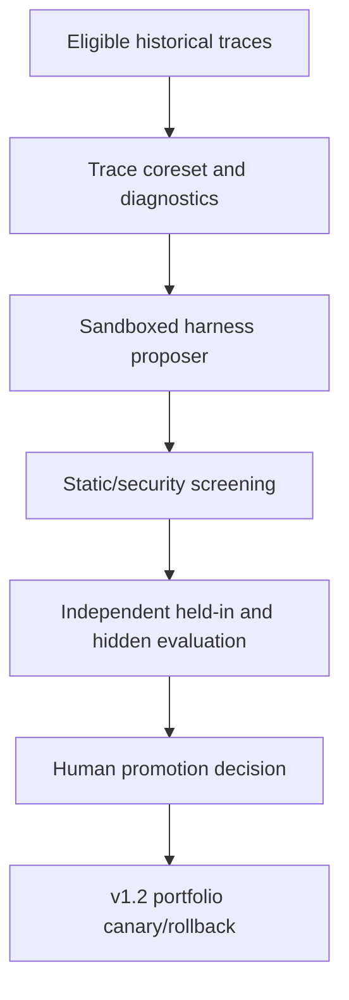

# Accretion v1.5.0 Software Design Description

## Retrospective Harness Optimization

**Document status:** Forward technical design baseline  
**Document revision:** 3  
**Release authority:** Locked until v1.4.0 passes all gates  
**Operation mode:** Offline proposal and evaluation only  
**Primary objective:** Improve promoted harness bundles from verified historical traces without self-authorization

---

## 1. Purpose and primary claim

v1.5.0 adds an offline optimizer that selects informative historical trace cohorts, diagnoses recurring failures, proposes bounded harness variants, and evaluates them independently on held-in and hidden held-out tasks. It operationalizes Meta-Harness/RHO-style improvement through Accretion's existing v0.10 capability-evolution governance.

Primary claim:

> On registered recurring Software/AI task families, retrospective trace-driven optimization produces promoted harness variants that improve held-out TTVS and/or verified success relative to human-maintained and bounded optimizer baselines after all search, replay, verification, and human costs are counted, without critical regression or self-promotion.

## 2. Golden Direction alignment

- v0.10 owns `CapabilityChangeProposal`, candidate sandbox, evaluation, human promotion, canary, and rollback.
- v1.5 specializes that path for harness changes; it creates no new authority.
- Full execution traces may inform proposals only after access control, redaction, and eligibility checks.
- The proposing agent cannot access hidden holdout answers or declare success.
- Self-validation and cross-rollout consistency are diagnostic signals, not final acceptance.
- Negative/inconclusive optimization runs remain evidence.

## 3. Entry conditions

1. v1.4 passes verified efficiency and state-integrity gates.
2. v1.2 HarnessBundle packaging, signing, compatibility, and rollback are stable.
3. v0.10 candidate sandbox and human promotion pipeline pass current security review.
4. Trace lineage includes source code/config, candidate decisions, B/P/E state views, attempts, tools, evidence, verification, TTVS, and cost.
5. Redaction/taint controls prevent secrets and hidden verifier fixtures reaching the proposer.
6. At least one recurring verified failure cluster cannot be solved adequately by routing/recovery alone.
7. Optimizer budget and amortization horizon are preregistered.
8. Hidden holdout is isolated from proposer and search-memory access.

## 4. Scope

### Included

- Eligible trace search and diversity-aware coreset selection;
- Multiple replay rollouts in resettable low-risk digital environments;
- Failure-pattern, self-validation, cross-rollout, verifier, and cost diagnostics;
- Best-of-N bounded harness proposals;
- Candidate packaging as v0.10 capability proposals;
- Cheap static/interface/security screening before expensive evaluation;
- Paired held-in and hidden held-out evaluation;
- Pareto comparison over verified success, TTVS, cost, complexity, and maintenance;
- Human promotion, canary, cohort rollback, and lineage;
- Studio optimization-run and candidate-diff inspection.

### Excluded

- Live request-path harness rewriting;
- Candidate access to production secrets/control plane;
- Editing policy, verifier semantics, approval, evidence, audit, or physical safety;
- Candidate self-installation, self-evaluation as sole authority, or self-promotion;
- Repeated replay of one-shot, irreversible, external-side-effect, or physical tasks;
- Treating self-preference as ground truth;
- Model-weight updates;
- Unbounded optimizer/search budgets.

## 5. Inherited invariants

- Harness candidates use the v1.2 contract and v0.10 promotion path.
- Only resettable, isolated, policy-permitted tasks may be replayed automatically.
- Producer/evaluator separation is enforced by identity and environment boundaries.
- Hidden holdout is inaccessible to proposal/search processes.
- All optimization compute and failed candidates are recorded.
- An average gain cannot offset a critical cohort regression.
- The baseline harness and predecessor release remain rollback targets.

## 6. System context and authority



The optimizer can propose only declared HarnessBundle writable surfaces. Promotion Service enforces signed human decisions and cannot be called with proposer identity as approver.

## 7. Components

### 7.1 Trace Eligibility Service

Requires:

- complete objective/node/graph/config/harness/environment/verifier lineage;
- permitted reuse and retention;
- no unresolved critical contradiction;
- non-quarantined source;
- resettable/side-effect-safe replay classification;
- redaction and data-classification clearance.

### 7.2 Coreset Selector

- Prioritizes failure severity, recurrence, diversity, coverage, uncertainty, and expected information value;
- prevents near-duplicate traces from consuming the budget;
- includes representative successes and contradictions, not failures alone;
- emits inclusion probability/selection rationale for bias analysis.

### 7.3 Replay and Diagnostic Service

- Runs bounded independent re-solves when permitted;
- compares within-task consistency and verifier evidence;
- identifies tool/schema, context, planning, recovery, state, and intrinsic-capability failures;
- separates harness-solvable gaps from model/capability/structural gaps;
- records diagnostic confidence and conflicts.

### 7.4 Harness Proposer

- Receives baseline bundle, redacted eligible traces/diagnostics, allowed edit manifest, and budget;
- creates diverse typed `HarnessVariant` proposals;
- cannot see hidden holdout or evaluator secrets;
- writes only to a candidate workspace.

### 7.5 Candidate Screener

Runs manifest/schema validation, dependency resolution, static analysis, secret scan, policy/safety protected-surface diff, deterministic hook tests, and cheap smoke tasks. Failed candidates do not consume full evaluation unless the protocol explicitly studies screen errors.

### 7.6 Independent Evaluator

- Evaluates baseline and candidates under paired pinned conditions;
- uses held-in validation for selection and hidden held-out only for final confirmation;
- measures verified success, TTVS, context/tool failures, complexity, security, and cost;
- emits v0.10 CandidateEvaluationReport and v1.5 HarnessComparisonReport.

## 8. Contracts

```yaml
TraceCohort:
  cohort_id: uuid
  cohort_version: semver
  eligibility_policy_ref: PolicyRef
  source_trace_refs: [ArtifactRef]
  inclusion_receipts: [object]
  diversity_summary: object
  redaction_report_ref: ArtifactRef
  replay_permission: object
  split_role: DIAGNOSTIC | HELD_IN | HIDDEN_HELD_OUT
  content_hash: sha256

HarnessOptimizationRun:
  optimization_run_id: uuid
  baseline_harness_ref: object
  trace_cohort_refs: [object]
  writable_surface_manifest_ref: object
  proposer_ref: RuntimeRef
  search_budget: object
  candidate_limit: integer
  seed: integer
  candidate_proposal_refs: [object]
  evaluation_plan_ref: object
  total_cost_accounting_ref: object
  status: object
  content_hash: sha256
```

Every harness candidate also has a v0.10 `CapabilityChangeProposal` and `CandidateManifest`.

## 9. Lifecycle and state machines

```text
PROTOCOL_FROZEN
→ COHORT_SELECTED
→ REPLAYED_DIAGNOSED
→ CANDIDATES_PROPOSED
→ SCREENED
→ HELD_IN_EVALUATED
→ FINALISTS_FROZEN
→ HIDDEN_HELD_OUT_EVALUATED
→ HUMAN_DECISION
→ CANARY | REJECTED | INCONCLUSIVE
→ PROMOTED | ROLLED_BACK | REVOKED
```

Hidden holdout is opened only after finalists and analysis are frozen. A failed hidden holdout cannot be reused iteratively as held-in evidence without a new protocol and new untouched holdout.

## 10. Algorithms and rules

### 10.1 Coreset objective

Select traces maximizing declared coverage/diversity/information value subject to privacy, replay safety, and budget. The selector must expose its selection rule so results are not generalized to unseen cohorts silently.

### 10.2 Diagnostics

Combine:

- canonical verifier results;
- deterministic failure/evidence signals;
- cross-rollout outcome consistency;
- self-validation reports;
- attempt/state traces;
- human-reviewed labels where available.

Self-preference may rank proposal hypotheses but never overrides external/independent verification.

### 10.3 Candidate search

Use a bounded best-of-N or iterative search with:

- fixed total proposer/replay/evaluation budget;
- small candidate batches;
- explicit diversity;
- a search-memory log of tried edits/results;
- early rejection for invalid/unsafe candidates;
- no access to final hidden results during search.

### 10.4 Selection

A finalist must be non-dominated on the registered verified-success/TTVS/cost/complexity criteria and pass every security/critical cohort. Prefer the smallest maintainable change when effects are equivalent within the registered equivalence margin.

### 10.5 Amortization

Report offline optimization cost separately and compute break-even at preregistered task volumes. A faster live harness is not a net optimization claim if expected use never repays search cost.

## 11. APIs and idempotency

| Method | Endpoint | Purpose |
|---|---|---|
| POST | `/api/v1/trace-cohorts` | Freeze eligible redacted cohort |
| POST | `/api/v1/harness-optimization-runs` | Start bounded offline run |
| GET | `/api/v1/harness-optimization-runs/{id}` | Inspect stages, cost, lineage |
| POST | `/api/v1/harness-optimization-runs/{id}/propose` | Generate bounded candidates |
| POST | `/api/v1/harness-optimization-runs/{id}/evaluate` | Invoke independent evaluation stage |
| GET | `/api/v1/harness-comparisons/{id}` | Inspect paired report |
| POST | `/api/v1/harness-candidates/{id}/promotion-decisions` | Record authorized v0.10 decision |

Stage transitions require idempotency keys, expected current state, frozen input hashes, and role authorization.

## 12. Events and replay

```text
trace_cohort.frozen
trace_cohort.redaction_failed
harness_optimization.started
harness_optimization.diagnostic_completed
harness_candidate.proposed
harness_candidate.screen_failed
harness_candidate.evaluated
harness_finalists.frozen
harness_hidden_evaluation.completed
harness_optimization.run.completed
harness_candidate.promotion_decided
```

Replay reconstructs trace selection, redaction, proposer inputs, candidate diffs, screening, all evaluated runs, verification, analysis, costs, and human decision.

## 13. Persistence and migrations

- Store cohort metadata/selection receipts and content-addressed trace artifacts.
- Store optimization runs, diagnostics, proposals, screen results, comparisons, and cost ledgers.
- Reuse v0.10 capability lineage and v1.2 HarnessBundle storage.
- Search memory is immutable per iteration and cannot erase failed ideas.
- Hidden holdout access is separately audited.
- Rollback leaves candidates/history available but inactive.
- Quarantine propagates from source traces to diagnostics/candidates and from candidate incidents to portfolios.

## 14. Identity, tenancy, secrets, and policy

- Separate service identities for selector, replay, proposer, screener, evaluator, and promoter.
- Proposer has no production network/secrets/control-plane credentials.
- Evaluator has access only to required hidden fixtures and cannot expose them to proposer artifacts.
- Trace redaction covers prompts, code/data classifications, credentials, personal data, and hidden verifier content.
- Cross-workspace traces are denied unless an explicit data-sharing policy and compatible purpose exist.
- Candidate dependencies are pinned and supply-chain scanned.

## 15. Failure handling and recovery

| Failure | Behavior |
|---|---|
| Trace not replay-safe | Exclude; preserve reason |
| Redaction uncertain | Exclude or human review |
| Environment not resettable | No repeated replay; observational diagnosis only |
| Proposer/screener unavailable | Pause; no unvalidated candidate |
| Candidate escapes sandbox/targets protected surface | Critical reject and incident |
| Evaluator conflict | INCONCLUSIVE; seek stronger independent evidence |
| Hidden holdout fails | Reject/no promotion |
| Optimization budget exhausted | Stop and report best valid evidence |
| Canary regression | Roll back affected bundle/portfolio |

## 16. Verification and contradictions

- Independent verifier results remain the acceptance source.
- Diagnostics and self-preference are labeled `INFERRED`/`PROPOSED` unless independently established.
- Candidate tests include alternate/cross-verifier sampling and anti-reward-hacking checks.
- Contradictory candidate effects are reported by cohort.
- Any candidate-caused false acceptance triggers revocation, incident, quarantine, and dependent-result review.
- Human promotion authorizes deployment; it does not convert failed evidence to PASS.

## 17. Observability and Experiment Studio

Add:

- optimization stage/timeline and remaining budget;
- selected trace cohort, coverage, diversity, exclusions, redaction status;
- diagnostics with evidence class/confidence;
- baseline-to-candidate structured harness diff;
- screen/security findings;
- held-in versus hidden results;
- total and amortized cost/break-even;
- Pareto candidates and cohort regressions;
- human promotion/canary/rollback lineage;
- proposer/evaluator access-separation audit.

## 18. Test strategy

### Unit/property

- Eligibility and replay-safety rules;
- coreset diversity/duplicate handling;
- hidden split isolation;
- writable/protected surface enforcement;
- immutable search memory and cost ledger;
- state transition/idempotency/hash rules.

### Integration

- Trace → diagnose → propose → screen → evaluate → v0.10 promotion → v1.2 canary;
- sandbox/network/secret isolation;
- hidden holdout access audit;
- candidate dependency/signature flow;
- event replay/quarantine/rollback.

### Adversarial

- hidden-test extraction;
- trace prompt injection;
- candidate evaluator tampering;
- reward hacking/test overfitting;
- secret exfiltration;
- dependency confusion;
- search-budget amplification;
- proposer self-promotion attempt.

## 19. Research benchmark

Use recurring, resettable Software/AI task families with enough traces for diagnosis and a truly hidden project-disjoint set.

Required baselines:

1. Human-maintained v1.4 harness;
2. random bounded harness changes;
3. score-only proposer;
4. summarized-diagnostic proposer;
5. raw-redacted-trace proposer;
6. retrospective diagnostics without self-consistency;
7. retrospective diagnostics without self-validation;
8. full v1.5;
9. matched-budget alternative optimizer.

Primary endpoint: held-out TTVS under verified-success constraints, including offline cost amortization. Secondary: verified success, context/tool errors, candidate yield, search cost, complexity, security failures, and maintenance burden.

### 19.1 Revision-3 adaptive trace acquisition study

The first study asks whether an adaptive coreset of eligible traces reduces total harness-search evaluation cost without changing which candidate wins. It freezes the trace population, candidate proposal budget, harness candidate set, verifier, uniform and diversity baselines, project-disjoint holdout and analysis code before acquisition. The primary comparison adapts trace acquisition only; it does not adapt candidate generation and trace selection in the same statistical stage.

Every acquisition step records the eligible trace set, selected trace, non-zero inclusion probabilities, selection history and predicted cost basis. All active frozen candidates are evaluated on each selected trace. A uniform rotating arm receives the same evaluation budget. Candidate search, failed candidates, proposal-model use, sandboxing, trace replay, verification, selector overhead and wall time are reported separately.

After acquisition freezes a winner, every frozen candidate is evaluated on the same untouched holdout to estimate selection regret. Evaluation-count savings without total-time or total-cost savings do not pass. Any later integration with iterative harness proposal requires a new protocol that isolates adaptive candidate generation from adaptive trace sampling.

## 20. Implementation milestones

| Milestone | Deliverable | Exit evidence |
|---|---|---|
| O1 | Trace eligibility/redaction/replay classification | Privacy/security fixtures |
| O2 | Coreset and resettable replay | Coverage/replay report |
| O3 | Diagnostics and baselines | Controlled ablations |
| O4 | Sandboxed proposer/screener | Escape/protected-surface tests |
| O5 | Independent held-in/hidden evaluator | Leakage/access audit |
| O6 | Studio and cost ledger | Operator/replay tests |
| O7 | Candidate canary via v0.10/v1.2 | Promotion/rollback drill |
| O8 | Scientific/operational gate | Reproducibility and sign-off |

## 21. Acceptance criteria

Stable IDs map to accountable roles, evidence targets and design fixtures in `18_ACCEPTANCE_TRACEABILITY.json`. All implementation/research evidence remains pending.

- [ ] **AC15-O1-001** Only eligible, redacted, replay-safe traces enter repeated optimization.
- [ ] **AC15-O2-002** One-shot/irreversible/physical tasks cannot be automatically replayed.
- [ ] **AC15-O2-003** Proposer cannot access hidden holdout, production secrets, or protected surfaces.
- [ ] **AC15-O3-004** Every candidate uses v0.10 proposal/evaluation/human-promotion contracts.
- [ ] **AC15-O3-005** Candidate cannot self-evaluate as sole authority or self-promote.
- [ ] **AC15-O4-006** Self-validation/self-consistency remain diagnostic only.
- [ ] **AC15-O4-007** Full search/replay/verification/human costs are recorded.
- [ ] **AC15-O1-008** Failed candidates and negative results remain preserved.
- [ ] **AC15-O7-009** Baseline rollback is tested and immediate.
- [ ] **AC15-O8-010** No critical correctness, policy, authority, secret, isolation, supply-chain, or safety regression occurs.
- [ ] **AC15-O8-011** Hidden held-out verified-success and TTVS gates pass.
- [ ] **AC15-O8-012** Amortized benefit and break-even meet the preregistered target.
- [ ] **AC15-O8-013** Required matched-budget baselines and ablations complete.
- [ ] **AC15-O7-014** Canary, revocation, quarantine, incident, and rollback drills pass.
- [ ] **AC15-O4-015** Every optimization terminal result emits harness_optimization.run.completed and retains its negative or inconclusive evidence.
- [ ] **AC15-O8-016** Adaptive trace acquisition freezes candidates first, logs positive inclusion probabilities, retains a matched uniform arm and evaluates every frozen candidate on the same untouched holdout with total search cost and selection regret.

## 22. Open questions and defaults

| ID | Question | Proposed default | Resolve by |
|---|---|---|---|
| O-OQ1 | Initial proposer | Replaceable coding runtime in no-network candidate sandbox | O4 |
| O-OQ2 | Coreset | Diversity + recurring failure + information value | O2 |
| O-OQ3 | Search | Bounded best-of-N before iterative search | O4 |
| O-OQ4 | Raw traces | Redacted full traces when policy permits | O1 |
| O-OQ5 | Self-preference | Diagnostic/ranking only, never final acceptance | O3 |
| O-OQ6 | Hidden holdout | Project-disjoint and access-isolated | Protocol freeze |
| O-OQ7 | Physical tasks | Excluded | Permanent |

## 23. Handoff to v1.6.0

v1.6 remains locked until:

1. v1.5 passes scientific and operational gates;
2. A repeated, verifiable task family remains limited by model policy rather than harness/routing/recovery/state;
3. An eligible open-weight model and parameter-efficient adaptation method are available;
4. Training data licensing, privacy, contamination, and compute constraints pass review;
5. Offline adapter isolation, evaluation, signing, and rollback infrastructure exists;
6. Expected recurrence can plausibly amortize training and rollout cost.
