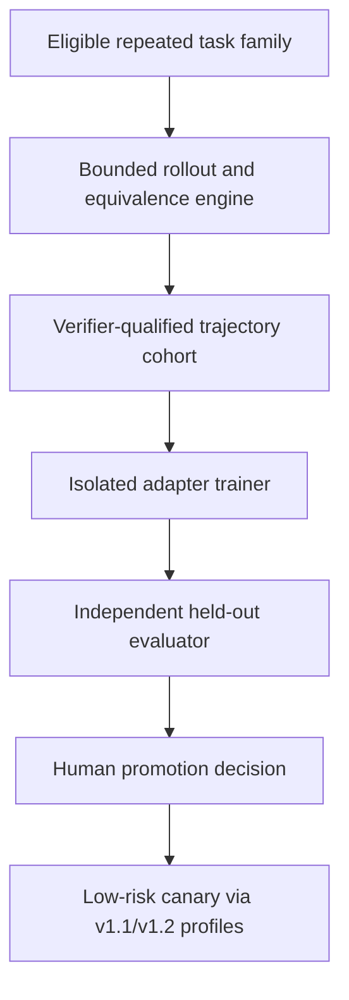

# Accretion v1.6.0 Software Design Description

## Open-Weight Policy Adaptation Lab

**Document status:** Forward experimental technical design baseline  
**Document revision:** 3  
**Release authority:** Locked until v1.5.0 passes all gates  
**Support level:** Research/experimental; not required for core Accretion operation  
**Primary domain:** Repeated, resettable, low-risk, automatically verifiable digital task families

---

## 1. Purpose and primary claim

v1.6.0 introduces a sandboxed lab for adapting an open-weight model or parameter-efficient adapter from repeated execution trajectories. TTPO-style asymmetric learning is one candidate method, not a mandated product dependency.

Primary claim:

> For an eligible recurring low-risk digital task family, an independently evaluated adapted open-weight policy reduces amortized TTVS and/or compute per verified success relative to frozen-model and standard adaptation baselines, while preserving held-out verified success, calibration, security, reproducibility, and rollback gates.

The adaptation must repay rollout/training/evaluation cost at a preregistered workload horizon. A one-task latency increase cannot be marketed as optimization merely because later inference might improve.

## 2. Golden Direction alignment

- Accretion remains a meta-harness, not a foundation-model project.
- Adaptation is optional and replaceable; closed/frontier runtimes remain supported.
- Harness/routing/state/recovery optimization is exhausted or measured before weight adaptation.
- Training occurs offline in an isolated research environment.
- Majority/self-consensus is not truth; executable/independent verification remains authoritative.
- Adapted policies cannot change authority, verification, tools, secrets, or safety.
- Human promotion and immediate rollback are mandatory.
- Physical/high-risk adaptation and online weight changes are excluded.

## 3. Entry conditions

1. v1.5 operational and required predecessor gates pass. Conditions 2-8 below govern starting an adaptation experiment, not whether the optional lab can safely exist. A persistent target gap after harness optimization is required to start that experiment.
2. Failure attribution supports an intrinsic policy/model limitation hypothesis.
3. The task family is repeated, resettable, reversible, low-risk, and has reliable behavioral equivalence/verification.
4. An eligible open-weight base model and license permit the intended training/deployment.
5. Base model, tokenizer, quantization, runtime, data, and adapter formats can be content-pinned.
6. Training privacy, intellectual-property, contamination, and retention reviews pass.
7. Sufficient compute/storage budget and an amortization horizon are approved.
8. Hidden project-disjoint and time-forward holdouts are inaccessible to training.
9. Adapter signing, serving isolation, canary, revocation, and rollback are operational.

Lab release additionally requires all applicable platform, isolation, budget, lineage, API, and rollback acceptance evidence even when an experiment is not justified. Research closure is PASS, FAIL, INCONCLUSIVE, or explicit DEFERRED with reason, accountable human owner, dependency-impact review, and revisit condition. A negative/absent result promotes no adapter and makes no optimization claim. The frozen base model remains active. The v1.7 dependency is this governed closure plus compatible operational interfaces, not a successful adapter. No critical incident can be deferred through this exception.

## 4. Scope

### Included

- `PolicyAdaptationExperiment`, `RolloutEquivalenceSpec`, `PseudoLabelCohort`, `AdapterArtifact`, and evaluation/promotion receipts;
- Parameter-efficient adapters by default;
- Bounded multi-rollout trajectory generation;
- Behavior/outcome-based equivalence grouping;
- Verified/consensus-qualified positive and negative trajectory construction;
- TTPO-inspired asymmetric objectives as one experiment arm;
- SFT, preference/RL, no-adaptation, and frozen-policy baselines;
- Offline training, evaluation, artifact signing, limited low-risk canary, rollback;
- Full compute, energy where feasible, and amortization accounting.

### Excluded

- Changing proprietary closed-model weights without an authorized provider interface;
- Live per-request production weight updates;
- Physical/high-risk task adaptation;
- Training on secrets, hidden tests, prohibited code/data, or unresolved/quarantined evidence;
- Consensus-only acceptance;
- Full unrestricted model pretraining;
- Adapter authority expansion;
- Automatic global promotion;
- Treating adapter quality as verifier independence.

## 5. Inherited invariants

- Only eligible verified provenance-complete experience may be used.
- `INCONCLUSIVE` is ineligible as a resolved training label and contributes H in capped TTVS reporting unless independently resolved by the horizon.
- Hidden holdout and verifier secrets stay outside training/proposer contexts.
- Base and adapter digests, data snapshot, code, hyperparameters, seeds, and environments are pinned.
- Adapted model output uses the same frozen NodeContract/VerificationSpec.
- Critical regression blocks promotion irrespective of average gain.
- The frozen predecessor profile remains available.

## 6. System context and authority



Training services have no production promotion credentials. Serving resolves an immutable approved base-plus-adapter pair through an existing compatible ComputeProfile.

## 7. Components

### 7.1 Adaptation Eligibility Service

Checks task recurrence, reset safety, risk, verifier reliability, evidence eligibility, data license/privacy, base-model license, expected amortization, and whether simpler harness/routing changes were tested.

### 7.2 Rollout Engine

- Samples bounded trajectories using pinned policy/harness/environment;
- supports adaptive sample count and early stop based on registered confidence/agreement rules;
- records all rollouts and failures;
- prevents external irreversible effects;
- enforces per-task and total budgets.

### 7.3 Equivalence and Pseudo-Label Engine

Groups trajectories by behavioral result, such as test outcome, normalized patch effect, structured output, environment state, or task-specific verifier result—not text similarity alone.

Each group records:

- equivalence rule/version;
- agreement and sample count;
- deterministic/independent verification evidence;
- uncertainty/conflicts;
- inclusion/exclusion rationale.

Low agreement or no verified-correct trajectory causes `SKIP`, not forced training.

### 7.4 Adapter Trainer

Default is parameter-efficient adaptation. Candidate methods include:

- verified-success SFT;
- positive trajectory distillation;
- preference optimization;
- selective negative optimization;
- TTPO-inspired positive-distillation/negative-RL split.

No method is promoted without matched-budget comparison.

### 7.5 Artifact Registry/Serving Adapter

- Binds adapter to exact base-model/tokenizer/runtime/quantization digests;
- stores license, training/evaluation lineage, supported cohorts, and revoked state;
- rejects incompatible serving combinations;
- exposes only human-promoted artifacts to live ComputeProfiles.

### 7.6 Independent Evaluator

Evaluates held-out tasks, alternate verifiers, calibration, adversarial behavior, regressions, contamination, resource use, and break-even horizon. It is organizationally and technically separated from training.

## 8. Contracts

```yaml
PolicyAdaptationExperiment:
  experiment_id: uuid
  research_protocol_ref: object
  task_family_ref: object
  base_model_ref: object
  base_runtime_ref: object
  baseline_harness_ref: object
  eligibility_receipt_ref: object
  rollout_equivalence_spec_ref: object
  data_snapshot_ref: object
  training_method: string
  budget: object
  hidden_holdout_ref: opaque-ref
  status: object
  content_hash: sha256

RolloutEquivalenceSpec:
  spec_id: uuid
  task_family_ref: object
  normalization_rules: [object]
  behavioral_checks: [object]
  required_verifier_refs: [object]
  minimum_samples: integer
  maximum_samples: integer
  minimum_agreement: number
  low_agreement_policy: SKIP | HUMAN_REVIEW
  content_hash: sha256

AdapterArtifact:
  adapter_id: uuid
  adapter_version: semver
  base_model_digest: sha256
  tokenizer_digest: sha256
  adapter_digest: sha256
  training_code_digest: sha256
  data_snapshot_ref: object
  hyperparameter_ref: object
  license_ref: object
  supported_cohorts: [object]
  evaluation_report_ref: object
  promotion_receipt_ref: object | null
  status: CANDIDATE | CANARY | ACTIVE | RETIRED | REVOKED
```

## 9. Lifecycle and state machines

```text
PROPOSED → ELIGIBILITY_REVIEWED → PROTOCOL_FROZEN
→ ROLLOUTS_GENERATED → PSEUDO_LABELS_VALIDATED
→ TRAINED → OFFLINE_EVALUATED → HUMAN_REVIEW
→ REJECTED | INCONCLUSIVE | CANARY_LOW_DIGITAL
→ ACTIVE_NAMED_COHORT | ROLLED_BACK | REVOKED
```

Every retraining creates a new adapter artifact. It never mutates an active adapter in place.

## 10. Algorithms and rules

### 10.1 Behavioral equivalence

The equivalence function is part of the frozen protocol. Exact string equality is allowed only when the task contract makes exact output semantically complete. Coding tasks use executable/structural effects and hidden/independent verification where available.

### 10.2 Pseudo-label confidence

Consensus provides a hypothesis. Inclusion requires the protocol's verifier rule. If all rollouts agree on an incorrect outcome, the group must not become positive merely because it is large.

### 10.3 TTPO-inspired candidate

One candidate may:

1. Distill tokens/trajectories from verifier-supported dominant successful groups;
2. Apply bounded selective negative optimization to verified or high-confidence failing groups;
3. Down-weight uncertain tokens/trajectories;
4. Skip low-consensus/no-success tasks;
5. constrain KL/update magnitude and monitor collapse.

The exact loss is an implementation-time research decision, versioned in the protocol. The SDD does not assume the original math-domain recipe transfers directly to engineering.

### 10.4 Adaptive rollout budget

Begin at a registered minimum. Stop early when a verifier-supported group clears confidence/stability rules or when continued sampling has non-positive conservative information value. Never exceed per-task/experiment caps.

### 10.5 Amortized objective

For horizon \(N\):

\[
Cost_N=C_{rollout}+C_{train}+C_{eval}+N\cdot C_{serve}
\]

and similarly for compute/time. Report break-even against the frozen baseline. Promotion requires positive value at one or more preregistered realistic horizons, not an invented post-hoc volume.

## 11. APIs and idempotency

| Method | Endpoint | Purpose |
|---|---|---|
| POST | `/api/v1/policy-adaptation-experiments` | Register frozen experiment |
| POST | `/api/v1/policy-adaptation-experiments/{id}/rollouts` | Run bounded rollout stage |
| POST | `/api/v1/policy-adaptation-experiments/{id}/train` | Start isolated training |
| POST | `/api/v1/policy-adaptation-experiments/{id}/evaluate` | Start independent evaluation |
| GET | `/api/v1/adapters/{id}` | Inspect artifact and lineage |
| POST | `/api/v1/adapters/{id}/promotion-decisions` | Record human decision |
| POST | `/api/v1/adapters/{id}/rollback` | Remove named cohort activation |

Stage commands require idempotency keys, expected state, immutable inputs, authorized role, and budget reservation. Retries reconcile job state before starting new compute.

## 12. Events and replay

```text
policy_adaptation.eligibility_decided
policy_adaptation.protocol_frozen
policy_adaptation.rollout_completed
policy_adaptation.pseudo_labels_validated
policy_adaptation.training_started
policy_adaptation.training_completed
policy_adaptation.experiment.completed
adapter.artifact.registered
adapter.evaluation.completed
adapter.promotion_decided
adapter.canary_started
adapter.rolled_back
adapter.revoked
```

Replay includes all training inputs/digests, seeds, environment, code, hardware class, logs, metrics, evaluation, promotion, and serving profile. Non-deterministic kernels/providers are disclosed.

## 13. Persistence and migrations

- Store experiments, eligibility, equivalence specs, rollout groups, pseudo-label decisions, training jobs, adapter metadata, evaluations, and promotion receipts.
- Large datasets/checkpoints/logs live in content-addressed encrypted artifact storage.
- Training data links to immutable evidence and quarantine status.
- Serving tables reference immutable base/adapter combinations.
- Revocation invalidates dependent ComputeProfiles and triggers safe fallback.
- Product rollback does not delete adapter/research history.

## 14. Identity, tenancy, secrets, licensing, and policy

- Training jobs use isolated service identities and no production Token Broker scope.
- Data stays within workspace/project policy; cross-workspace disabled by default.
- Secrets, credentials, hidden tests, and prohibited licensed data are excluded/scanned.
- Model and dataset licenses are recorded and evaluated for training, redistribution, and deployment.
- Adapter export respects base-model and data restrictions.
- Supply-chain verification covers model weights, tokenizer, code, packages, and checkpoint format.
- Only approved serving workers can load active signed adapters.

## 15. Failure handling and recovery

| Failure | Behavior |
|---|---|
| No verified-correct rollout | Skip task; record gap |
| Low agreement | Skip or human review per protocol |
| Training divergence/collapse | Stop, preserve checkpoint/logs, reject |
| License/privacy uncertainty | Block experiment/promotion |
| Hidden leakage/contamination | Invalidate evaluation, quarantine lineage |
| Incompatible base/runtime | Refuse load; use frozen baseline |
| Canary regression | Immediate cohort rollback |
| Serving adapter unavailable | Compatible frozen model/harness fallback |
| Critical false acceptance | Revoke adapter, incident, dependent re-verification |

## 16. Verification and contradictions

- Training labels and release acceptance are distinct.
- The same policy cannot be its sole trajectory judge and final verifier.
- Alternate verifier and human-reviewed samples challenge consensus/reward hacking.
- `INCONCLUSIVE` remains visible, is ineligible as a resolved training label, and contributes H unless independently resolved to PASS by the frozen horizon.
- Contradictory evidence about adapter cohorts results in restricted support or rejection.
- Later incident quarantine propagates to rollouts, pseudo-labels, adapter, profiles, and results.

## 17. Observability and Experiment Studio

Add:

- experiment eligibility and licensing/privacy checklist;
- rollout groups, agreement, verifier support, and skipped cases;
- training method/configuration/curve/resource use;
- base-versus-adapter held-out comparison;
- calibration and critical-cohort regressions;
- online and amortized TTVS/cost with break-even curve;
- supported cohort and compatibility matrix;
- canary, rollback, revocation, and dependent-lineage view;
- evidence classification separating reported research from Accretion results.

## 18. Test strategy

### Unit/property

- Equivalence normalization and grouping;
- consensus never bypasses verifier rule;
- low-agreement skip;
- rollout/training caps;
- adapter/base compatibility;
- artifact hashing/signatures;
- quarantine/revocation propagation.

### Integration

- Eligibility → rollout → grouping → train → independent evaluate → promote → serve;
- container/GPU/job failure recovery;
- hidden split isolation;
- serving fallback/rollback;
- event replay and artifact integrity.

### Adversarial

- pseudo-label poisoning;
- majority-wrong consensus;
- hidden-test leakage;
- malicious checkpoint format/dependency;
- data/license laundering;
- adapter attempting tool/authority expansion;
- reward hacking and verifier exploitation;
- resource-exhaustion rollout loop.

## 19. Research benchmark

Choose one or more repeated families such as repository repair patterns, compiler/configuration migrations, structured extraction, or resettable browser/tool workflows, only when reliable verification and licensing exist.

Required baselines:

1. Frozen v1.5 model/harness;
2. More inference-time sampling without training;
3. Verified-success SFT;
4. preference optimization or comparable standard adapter method;
5. TTPO-inspired candidate;
6. full harness optimization without weights;
7. post-hoc upper bound where feasible.

Primary endpoint: amortized TTVS/compute per verified success at preregistered horizons under held-out success constraints. Report one-off cost separately.

Required ablations:

- text versus behavioral equivalence;
- consensus-only versus verifier-qualified labels;
- fixed versus adaptive rollout count;
- positive-only versus asymmetric objective;
- no uncertainty skip;
- no project-disjoint holdout;
- adapter versus harness-only improvement.

### 19.1 Revision-3 label and calibration qualification

Before rollout labels can train an adapter, the frozen verifier is qualified on correct, subtly incorrect, incomplete, corrupted-artifact and adversarial outputs from the intended task family. The report distinguishes rule checks, model judges and execution-grounded verification and records their precision/recall or false-acceptance/false-rejection denominators separately. Consensus is compared with verifier-qualified labels; agreement alone never becomes a positive label.

Adaptive rollout allocation may use uncertainty or intermediate scores only when the score is defined, logged and available at the same point in every arm. Calibration is evaluated time-forward and by task/project shift. Any formal coverage or conformal guarantee is withdrawn when exchangeability diagnostics fail or filtering changes error rates; the system falls back to a fixed conservative rollout cap and independent verification.

Results from hosted APIs are treated as observable input/output behavior only. They cannot support claims about internal GPU scheduling, KV-cache placement, training dynamics or unobserved reasoning. The study reports label qualification, rollout generation, training, verifier, rejected-adapter and serving costs separately.

## 20. Implementation milestones

| Milestone | Deliverable | Exit evidence |
|---|---|---|
| A1 | Eligibility/license/privacy protocol | Governance sign-off |
| A2 | Rollout/equivalence/pseudo-label pipeline | Golden/adversarial fixtures |
| A3 | Isolated parameter-efficient training | Reproduction and resource tests |
| A4 | Artifact registry/compatible serving | Signature/fallback tests |
| A5 | Independent evaluation/baselines | Hidden-held-out report |
| A6 | Studio/amortization views | Operator and accounting tests |
| A7 | Named low-risk canary | Rollback/incident report |
| A8 | Scientific/operational gate | Full reproduction and sign-off |

## 21. Acceptance criteria

Stable IDs map to accountable roles, evidence targets and design fixtures in `18_ACCEPTANCE_TRACEABILITY.json`. All implementation/research evidence remains pending.

Research-only criteria apply to a launched study/promotion claim. A governed DEFERRED or negative closure is recorded separately; it does not mark failed research criteria PASS or waive operational tests (addendum §6).

- [ ] **AC16-A1-001** Target family is repeated, resettable, low-risk, verifiable, and licensed.
- [ ] **AC16-A1-002** Base model/tokenizer/runtime/data/training/artifact digests are complete.
- [ ] **AC16-A2-003** Behavioral equivalence is frozen and tested before rollouts.
- [ ] **AC16-A2-004** Consensus alone cannot create an accepted positive label.
- [ ] **AC16-A2-005** Low-agreement/no-success cases are skipped or reviewed, not forced.
- [ ] **AC16-A3-006** Rollout/training/search budgets terminate reliably.
- [ ] **AC16-A3-007** Training has no production secrets, authority, or hidden holdout access.
- [ ] **AC16-A5-008** Adapted output uses unchanged independent verification.
- [ ] **AC16-A7-009** Frozen predecessor fallback and cohort rollback pass.
- [ ] **AC16-A3-010** No physical/high-risk adaptation or online production update is possible.
- [ ] **AC16-A8-011** No critical correctness, policy, authority, privacy, license, secret, isolation, or safety regression occurs.
- [ ] **AC16-A8-012** Held-out verified-success/calibration gates pass.
- [ ] **AC16-A8-013** Amortized TTVS/compute improvement passes at a preregistered realistic horizon.
- [ ] **AC16-A8-014** Required matched-budget baselines and ablations complete.
- [ ] **AC16-A7-015** Canary, revocation, quarantine, incident, and dependent re-verification drills pass.
- [ ] **AC16-A8-016** Platform readiness, research closure and adapter promotion remain separate; DEFERRED has an accountable owner, reason, dependency review and revisit condition, with no adapter promotion.
- [ ] **AC16-A8-017** Training labels require task-family verifier qualification on correct, incorrect, corrupted and adversarial outputs; calibration or conformal guarantees are withdrawn under detected shift and consensus alone never establishes success.

## 22. Open questions and defaults

| ID | Question | Proposed default | Resolve by |
|---|---|---|---|
| A-OQ1 | Adaptation form | Parameter-efficient adapter, not full fine-tune | A3 |
| A-OQ2 | First task family | Select only after recurrence/verifier audit | Protocol freeze |
| A-OQ3 | Rollout count | Adaptive bounded sampling, not fixed 64 | A2 |
| A-OQ4 | Consensus | Verifier-qualified behavioral groups | A2 |
| A-OQ5 | TTPO | One experimental arm, not product dependency | A5 |
| A-OQ6 | Promotion | Named LOW_DIGITAL cohort only | A7 |
| A-OQ7 | Physical/robotics | Prohibited; simulation research only outside live adaptation | Permanent |

## 23. Handoff to v1.7.0

v1.7 remains locked until:

1. v1.6 records governed PASS, FAIL, INCONCLUSIVE or DEFERRED research closure with preserved evidence/decision and no unresolved critical incident;
2. v1.1-v1.5 efficiency artifacts have stable typed compatibility metadata;
3. v0.7 embodiment/transfer contracts and target-simulation verification remain operational;
4. A source-target domain pair has a plausible but unproven efficiency transfer hypothesis;
5. Target-only scratch baselines and negative-transfer detection are reproducible;
6. No physical target authority is required for the primary experiment.
