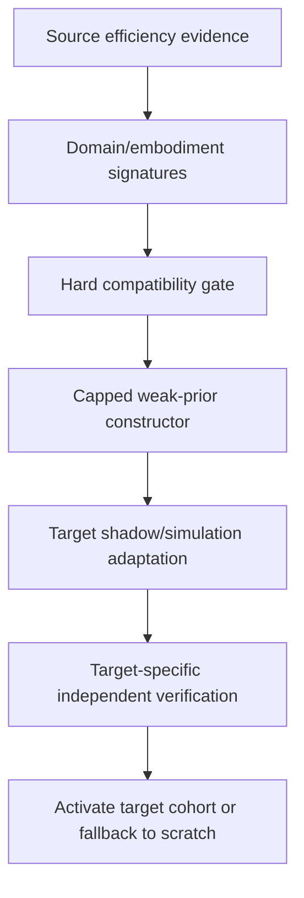

# Accretion v1.7.0 Software Design Description

## Cross-Domain Efficiency Transfer in Simulation

**Document status:** Forward technical design baseline  
**Document revision:** 3  
**Release authority:** Locked until operational dependencies and governed v1.6 research closure pass review  
**Primary boundary:** Target-domain shadow and simulation only  
**Primary objective:** Reuse efficiency knowledge as a weak prior without granting target authority

---

## 1. Purpose and primary claim

v1.7.0 transfers evidence about compute profiles, harnesses, recovery, and state coordination across compatible task domains or embodiments. It tests whether source experience can reduce target profiling/adaptation work while retaining target-specific verification and conservative fallback.

Primary claim:

> On domain- or embodiment-disjoint target simulation tasks, compatibility-gated weak-prior efficiency transfer reduces target samples/trials or TTVS needed to reach a preregistered verified-efficiency threshold relative to target-only scratch adaptation, without unacceptable negative transfer, critical regression, or source-evidence substitution for target proof.

## 2. Golden Direction alignment

- v0.7 remains the owner of embodiment/task transfer semantics and hard compatibility gates.
- v1.7 transfers **efficiency priors**, not permissions, safety, verification acceptance, or physical evidence.
- Cross-domain evidence begins weak and shadow-only.
- Target-specific simulation evidence is required before activation.
- Negative transfer triggers target-only fallback.
- Software/AI and simulation are the primary research environments; physical execution is excluded.
- Historical source contradictions and failures remain part of the transfer evidence set.

## 3. Entry conditions

1. v1.1-v1.5 artifacts expose stable compatibility, cohort, evidence, cost, and outcome metadata.
2. v1.6 has a governed PASS, FAIL, INCONCLUSIVE, or DEFERRED research closure and no unresolved critical incident. DEFERRED requires the reason, human owner, dependency-impact review and revisit condition. v1.1-v1.5 operational interfaces, current v0.7 conformance and target-only baseline are required; v1.6 adapter success or deployment is not. If any lab interface is consumed, its platform readiness must separately pass.
3. v0.7 embodiment compatibility and negative-transfer contracts pass current conformance tests.
4. Source and target tasks have explicit NodeContract, verifier, environment, risk, capability, and data-modality mappings.
5. Target-only scratch adaptation is reproducible.
6. Target simulator/environment snapshots are content-pinned and resettable.
7. A domain-disjoint split and negative-transfer boundary are preregistered.
8. Transfer cannot activate any physical execution path.

## 4. Scope

### Included

- `EfficiencyDomainSignature`, `EfficiencyTransferCandidate`, `EfficiencyTransferDecision`, and `EfficiencyTransferOutcome`;
- Transfer of priors over compute profile, harness regime, recovery action, and state action;
- Optional adapter evidence as a hypothesis only when model/runtime/license compatibility passes;
- Hard semantic/technical compatibility gates;
- Capped source prior and target evidence annealing;
- Target shadow evaluation and simulation canary;
- Negative-transfer detection and immediate fallback;
- Domain/embodiment-disjoint research benchmark;
- Studio transfer lineage and source/target comparison.

### Excluded

- Direct live authority from source experience;
- Source verifier satisfying target verification;
- Simulation evidence satisfying physical acceptance;
- Cross-workspace transfer by default;
- Online physical exploration, retry, adaptation, or control;
- Automatic relaxation of target contract/capabilities/environment/safety;
- Universal transfer claims;
- Hiding source failures or contradictions.

## 5. Inherited invariants

- Compatibility precedes semantic similarity/ranking.
- Cross-domain source evidence is a capped weak prior.
- Target-specific verifier and evidence create target authority.
- Source and target evidence classes remain distinct.
- Negative transfer is append-only evidence and triggers fallback.
- Protected data/secret/tenant boundaries apply before feature construction.
- Physical/high-risk execution remains outside learning/exploration.

## 6. System context and authority



The transfer estimator cannot register a target configuration as supported. Only target evaluation plus normal human promotion can do so.

## 7. Components

### 7.1 Domain Signature Builder

Builds typed signatures from:

- NodeContract/task semantics and output form;
- graph/operator patterns;
- capability/tool schemas;
- runtime/model family and reasoning interface;
- harness/state/recovery actions;
- environment/data modality;
- verifier semantics/reliability;
- risk/evidence class;
- embodiment observation/action/frame properties where applicable;
- measured source outcomes and contradictions.

### 7.2 Hard Compatibility Gate

Fails transfer on incompatible:

- authority, policy, risk, evidence, or verifier requirements;
- input/output/task semantics;
- required capabilities/tool schemas;
- environment or data modality;
- model/runtime/harness interfaces;
- embodiment action/observation/frame/unit/safety semantics;
- license/privacy/workspace restrictions.

### 7.3 Source Evidence Selector

- Retrieves eligible verified successes, failures, and contradictions;
- limits source concentration and duplication;
- scores evidence quality/freshness;
- exposes domain distance and missing mappings;
- records why evidence was selected or rejected.

### 7.4 Weak-Prior Constructor

Constructs priors over only declared transferable fields. It assigns capped influence based on hard compatibility, evidence quality, domain distance, and uncertainty. It cannot create a live decision directly.

### 7.5 Target Adaptation/Shadow Service

- Starts from source weak prior or scratch baseline;
- executes only target simulation/shadow tasks;
- collects target verifier evidence;
- increases target authority as target evidence accumulates;
- supports paired stopping at the registered threshold.

### 7.6 Negative-Transfer Monitor

Compares source-prior and target-scratch cohorts continuously during the experiment. It detects success, TTVS, safety proxy, calibration, recovery, or sample-efficiency harm and triggers fallback at preregistered boundaries.

## 8. Contracts

```yaml
EfficiencyDomainSignature:
  signature_id: uuid
  domain: string
  task_contract_fingerprint: sha256
  graph_operator_profile: object
  capability_schema_refs: [object]
  runtime_model_profile: object
  harness_action_profile: object
  verifier_profile: object
  environment_data_profile: object
  risk_class: RiskClass
  evidence_class: string
  embodiment_signature_ref: object | null
  content_hash: sha256

EfficiencyTransferDecision:
  decision_id: uuid
  source_signature_refs: [object]
  target_signature_ref: object
  hard_gate_receipts: [object]
  transferable_fields: [string]
  prohibited_fields: [string]
  source_evidence_set_ref: object
  prior_weight_cap: number
  target_shadow_plan_ref: object
  fallback_ref: object
  decision: ELIGIBLE_SHADOW | INELIGIBLE | HUMAN_REVIEW
  content_hash: sha256
```

`EfficiencyTransferOutcome` includes target samples, TTVS, verified success, threshold attainment, calibration, negative-transfer events, and final promotion/rejection.

## 9. Lifecycle and state machines

```text
PROPOSED → SIGNATURED → COMPATIBILITY_CHECKED
→ INELIGIBLE | SHADOW_ELIGIBLE
→ TARGET_BASELINE_FROZEN
→ PAIRED_TARGET_ADAPTATION
→ NEGATIVE_TRANSFER_STOP | THRESHOLD_REACHED | BUDGET_STOP | INCONCLUSIVE
→ TARGET_EVALUATED
→ REJECTED | TARGET_COHORT_PROMOTED
→ ROLLED_BACK | RETIRED
```

Promotion creates a target-specific artifact/policy version. It never relabels the source artifact as universally valid.

## 10. Algorithms and rules

### 10.1 Hard-before-soft transfer

Only candidates passing all hard mappings reach similarity/distance scoring. Embedding or semantic similarity cannot override a failed unit, frame, capability, verifier, environment, policy, risk, evidence, or license gate.

### 10.2 Prior weighting

For source \(s\) and target \(t\):

\[
w_{s\rightarrow t}=\min(w_{max}, Q_s\cdot C_{hard}\cdot S_{soft}\cdot U^{-1})
\]

where `C_hard` is zero on any failed gate, Q_s and S_soft are in [0,1], and w_max is a frozen cap in [0,1]. Require finite U >= u_min > 0 with u_min preregistered; missing, negative, zero or nonfinite uncertainty yields ABSTAIN and weight 0, never division by zero or maximum influence. The estimator and normalization are frozen before evaluation.

### 10.3 Target evidence annealing

Source influence must not increase merely because early target outcomes are sparse. As compatible target evidence accumulates, target estimates dominate. A minimum target evidence floor is required before any target activation.

### 10.4 Negative transfer

Compare transfer and scratch arms using registered sequential/fixed-sample rules. On a critical or boundary-crossing harm signal, stop transfer, record `NegativeTransferEvent`, and use target-only baseline. Do not delete the source evidence.

### 10.5 Robotics simulation

For embodiment transfer, reuse v0.7 task/embodiment compatibility and target simulator verification. Transfer may recommend high-level compute/harness profiles for simulated perception/planning/research nodes; it never emits low-level commands or changes a SafetyEnvelope.

## 11. APIs and idempotency

| Method | Endpoint | Purpose |
|---|---|---|
| POST | `/api/v1/efficiency-domain-signatures` | Register immutable signature |
| POST | `/api/v1/efficiency-transfer-studies` | Freeze source/target study |
| POST | `/api/v1/efficiency-transfer-studies/{id}/decide` | Run compatibility/prior decision |
| POST | `/api/v1/efficiency-transfer-studies/{id}/start-shadow` | Start paired target experiment |
| GET | `/api/v1/efficiency-transfer-studies/{id}` | Inspect lineage/outcomes |
| POST | `/api/v1/efficiency-transfer-studies/{id}/promotion-decisions` | Record target-specific human decision |
| POST | `/api/v1/efficiency-transfer-studies/{id}/rollback` | Target cohort rollback |

Start/decision/promotion commands require idempotency, expected version, immutable source/target hashes, and authorized project/workspace scope.

## 12. Events and replay

```text
efficiency_domain.signature.registered
efficiency_transfer.study.frozen
efficiency_transfer.compatibility.decided
efficiency_transfer.shadow.started
efficiency_transfer.target_observation.recorded
efficiency_transfer.negative_detected
efficiency_transfer.threshold_reached
efficiency_transfer.outcome.recorded
efficiency_transfer.promotion_decided
efficiency_transfer.rolled_back
```

Replay includes source eligibility, signatures, mappings, prior construction, source/scratch assignments, target environment, decisions, simulations, verifier evidence, sequential decisions, and final target artifact.

## 13. Persistence and migrations

- Store signatures, mapping receipts, studies, assignments, priors, target observations, negative-transfer events, outcomes, and promotion decisions.
- Reference existing Experience, TransferEvidenceSet, ComputeProfile, HarnessBundle, policy, and embodiment artifacts.
- Preserve source and target namespaces/lineage.
- Do not backfill target authority from historical source similarity.
- Quarantine source evidence invalidates affected priors and triggers target review, not automatic target-history deletion.
- Rollback disables target-transferred policy and uses target scratch/predecessor baseline.

## 14. Identity, tenancy, secrets, and policy

- Transfer is scoped to the target workspace/project and approved source sharing policy.
- Cross-workspace transfer is denied by default and requires explicit data/governance review.
- Signatures exclude secrets and minimize proprietary content.
- Source evidence visibility and use purpose are independently checked.
- Simulator/robot adapter credentials remain opaque.
- Model-generated mappings are proposals validated by deterministic schemas and human review when material.
- Domain labels cannot reduce risk class or bypass approvals.

## 15. Failure handling and recovery

| Failure | Behavior |
|---|---|
| Missing required mapping | INELIGIBLE or human review |
| Hard compatibility failure | No transfer; target scratch |
| Source evidence quarantined | Recompute prior and review dependent target |
| Target simulator drift | Pause, snapshot new version, rebaseline |
| Negative transfer boundary crossed | Stop transfer and fall back |
| Target verifier unavailable | Pause; never accept source proof |
| Transfer model unavailable | Target scratch baseline |
| Budget exhausted | Stop and report PASS/FAIL/INCONCLUSIVE evidence |

## 16. Verification and contradictions

- Source verifier results are evidence about source only.
- Target verifier is defined before target shadow execution.
- Source failures and contradictions are included in prior quality.
- Conflicting transfer effects by cohort remain separate; do not average away harm.
- Target success cannot convert an unsafe/unauthorized action into acceptable behavior.
- Later source incident triggers dependency analysis and re-verification according to target lineage.

## 17. Observability and Experiment Studio

Add:

- source-target signature comparison;
- hard compatibility map and failed gates;
- selected/rejected source evidence and quality;
- prior weight and transferable/prohibited fields;
- paired transfer-versus-scratch learning curves;
- target samples/trials-to-threshold and TTVS;
- negative-transfer alarms/fallback;
- target-specific verifier and promotion evidence;
- simulation versus physical evidence labels;
- lineage from source artifacts to target policy.

## 18. Test strategy

### Unit/property

- Any hard gate failure yields zero transfer authority;
- prior weight caps;
- target evidence dominance/annealing;
- source/target namespace separation;
- negative-transfer stopping;
- physical activation impossible;
- hash/idempotency/replay.

### Integration

- Source registry → signature → compatibility → target shadow → verifier → target promotion;
- v0.7 embodiment mapping;
- simulator version drift;
- source quarantine propagation;
- target fallback/rollback;
- workspace isolation.

### Adversarial

- semantic-similarity bypass of hard gates;
- unit/frame/action mismatch;
- source verifier substitution;
- source data/secret leakage;
- risk-class downgrade;
- cherry-picked source evidence;
- hidden negative transfer;
- simulation evidence relabeled physical.

## 19. Research benchmark

Use multiple domain-disjoint pairs, including at least:

- Software/AI task-family transfer with shared capabilities but unseen projects;
- simulator-to-simulator or embodiment-disjoint Robotics simulation transfer where v0.7 compatibility is meaningful;
- deliberately incompatible negative-control pairs.

Required baselines:

1. Target-only scratch;
2. unfiltered source transfer;
3. semantic similarity only;
4. hard compatibility only with uniform prior;
5. compatibility plus calibrated weak prior;
6. full v1.7 with negative-transfer monitor;
7. post-hoc source selection upper bound.

Primary endpoint: target samples/trials or TTVS to a verified-efficiency threshold under success constraints. Report final target performance, negative-transfer rate/severity, calibration, transfer coverage, and source-selection cost.

Required ablations:

- no hard compatibility;
- no source failure/contradiction evidence;
- no prior cap;
- no target annealing;
- no negative-transfer monitor;
- no domain-disjoint split;
- compute-only versus harness/recovery/state priors.

### 19.1 Revision-3 drift schedule and transfer study

The primary study uses time-forward, domain-disjoint target cohorts and matched label and compute budgets to compare three frozen update strategies: no update, periodic update and drift-triggered update. Each strategy uses target-specific independent verification, and all source evidence remains a capped prior. Target-only scratch is the mandatory baseline; deliberately incompatible source-target pairs estimate false-transfer risk.

The drift alarm, trigger threshold, update payload, label budget, compute budget, fallback and negative-transfer stop rule freeze before the forward window opens. A formal calibration guarantee may be stated only while the recorded exchangeability assessment passes. When it fails, the guarantee is withdrawn, outputs abstain or use the conservative target-only fallback, and the failure remains visible rather than being repaired with the evaluation window.

A workflow-allocation simulation may follow as a separate sub-study after transfer closes. It uses the same frozen graph and compares workflow FCFS, static critical-path priority and the learned allocator under matched simulated resources. It cannot be used to infer hosted-provider GPU scheduling or physical benefit.

## 20. Implementation milestones

| Milestone | Deliverable | Exit evidence |
|---|---|---|
| T1 | Signature and mapping contracts | Schema/golden fixtures |
| T2 | Compatibility/source evidence service | Negative-control tests |
| T3 | Weak-prior constructor | Calibration/offline report |
| T4 | Paired target adaptation/shadow | Assignment/replay tests |
| T5 | Negative-transfer monitor/fallback | Fault/sensitivity tests |
| T6 | Robotics-simulation integration | v0.7 conformance/replay |
| T7 | Studio and lineage | Operator/privacy tests |
| T8 | Scientific/operational gate | Domain-disjoint report/sign-off |

## 21. Acceptance criteria

Stable IDs map to accountable roles, evidence targets and design fixtures in `18_ACCEPTANCE_TRACEABILITY.json`. All implementation/research evidence remains pending.

- [ ] **AC17-T1-001** All source-target mappings are typed, versioned, and content-hashed.
- [ ] **AC17-T2-002** Hard compatibility always precedes similarity or learned ranking.
- [ ] **AC17-T3-003** Source evidence is a capped weak prior only.
- [ ] **AC17-T2-004** Source success/verifier cannot satisfy target verification.
- [ ] **AC17-T1-005** Source failures and contradictions remain represented.
- [ ] **AC17-T5-006** Target-only fallback is always available.
- [ ] **AC17-T5-007** Negative-transfer rules stop and record harmful transfer.
- [ ] **AC17-T7-008** Target promotion requires target-specific evidence and human authorization.
- [ ] **AC17-T2-009** No physical authority, evidence relabeling, exploration, or automatic retry is possible.
- [ ] **AC17-T8-010** No critical correctness, policy, authority, privacy, secret, isolation, transfer-safety, or simulator-safety regression occurs.
- [ ] **AC17-T8-011** Target verified-success gate passes.
- [ ] **AC17-T8-012** Sample/TTVS-to-threshold improvement meets the preregistered effect/confidence gate.
- [ ] **AC17-T8-013** Required incompatible controls, baselines, and ablations complete.
- [ ] **AC17-T7-014** Quarantine, target fallback, rollback, and reproducibility drills pass.
- [ ] **AC17-T1-015** Dependency review accepts governed v1.6 negative or deferred research closure without requiring adapter success, while enforcing all operational dependencies.
- [ ] **AC17-T8-016** Frozen, periodic and drift-triggered updates are compared time-forward under matched target label/compute budgets, with target-only fallback, incompatible controls and automatic withdrawal of formal guarantees when exchangeability fails.

## 22. Open questions and defaults

| ID | Question | Proposed default | Resolve by |
|---|---|---|---|
| T-OQ1 | First source-target pairs | Software/AI pair plus simulator/embodiment pair | Protocol freeze |
| T-OQ2 | Prior type | Compute/harness/recovery/state; adapters separate | T3 |
| T-OQ3 | Cross-workspace | Disabled | Permanent default |
| T-OQ4 | Similarity | Only after hard gates | T2 |
| T-OQ5 | Target activation | Simulation/low-risk digital only | T4 |
| T-OQ6 | Negative threshold | Preregister by success/TTVS/safety proxy | Protocol freeze |
| T-OQ7 | Physical evidence | Excluded | Permanent |

## 23. Handoff to v1.8.0

v1.8 remains locked until:

1. v1.7 passes domain/embodiment-disjoint simulation gates;
2. v1.0/v0.6 physical safety case, approval, preflight, lockout, and incident systems pass current independent review;
3. A bounded physical cell/robot profile is concretely supported;
4. The intended optimization is advisory and completed before physical trial freeze;
5. Configuration freeze invalidation and exact reapproval behavior are proven;
6. No online physical learning, exploration, or automatic retry is required.
