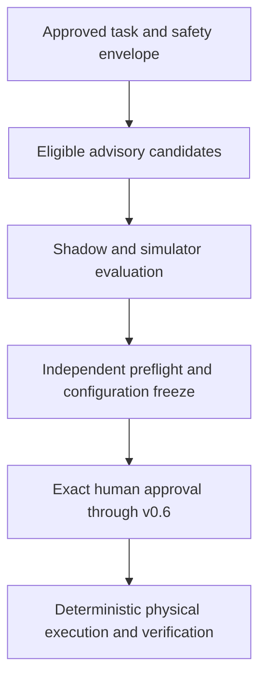

# Accretion v1.8.0 Software Design Description

## Governed Physical Efficiency Advisory

**Document status:** Forward technical design baseline  
**Document revision:** 3  
**Release authority:** Locked until v1.7.0 and the physical-readiness entry gates pass  
**Primary boundary:** Advisory optimization completed before an approved physical trial is frozen  
**Primary objective:** Reduce preparation and compute burden without changing physical authority, control, verification, or safety

---

## 1. Purpose and primary claim

v1.8.0 applies the verified-efficiency work from v1.1-v1.7 to a tightly governed physical workflow. It may recommend compatible digital planning, perception, harness, compute, simulation, and preflight-preparation choices before a physical trial is frozen. It never controls, arms, approves, retries, or changes a physical execution.

Primary claim:

> For a preregistered, already-supported physical task profile, a compatibility-gated advisory reduces preparation effort, controlled compute, or time-to-verified-trial-success relative to the governed static/manual preparation baseline, while preserving task success and every existing approval, safety, evidence, verifier, stop-path, and reproducibility requirement.

This claim is valid only for the evaluated cell, task, embodiment, sensor, environment, and configuration cohort. It is not evidence of general physical autonomy.

## 2. Golden Direction alignment

- v0.6 remains the sole owner of physical trial contracts, exact approval, arming, leases, safety envelopes, supervision, watchdogs, stop paths, execution, and incident response.
- v0.7 remains the owner of embodiment compatibility and transfer semantics.
- v1.8 adds a non-authoritative optimization advisory before trial freeze; it creates no physical action or approval path.
- Learned components may rank only options already admitted by deterministic compatibility, policy, risk, and safety-case constraints.
- Independent preflight and physical verification remain mandatory.
- Any physical configuration change after freeze invalidates the freeze receipt and requires a new preflight and exact single-use approval.
- No online learning, exploration, automatic retry, or adaptive physical control is allowed.
- `FAIL`, `INCONCLUSIVE`, `ERROR`, and `QUARANTINED` remain non-success states.

## 3. Entry conditions

1. v1.7.0 is released after its registered gates pass and all critical incidents are resolved; v1.8 still uses the target-only conservative baseline for any physical cohort that is transfer-ineligible or lacks positive target-specific transfer evidence.
2. v1.0.0 and the v0.6 physical safety case, approval, lockout, watchdog, emergency-stop, incident, and audit paths pass current independent conformance review.
3. v1.1-v1.4 decision and outcome receipts are stable enough to reproduce the proposed advisory; v1.5-v1.7 artifacts are optional inputs, never prerequisites for authority.
4. One bounded physical cell, embodiment, task family, environment, and evidence class is selected.
5. The cell has a supported controller/driver path, calibrated sensors, deterministic safety supervisor, tested stop path, reset procedure, and named human roles.
6. The exact physical risk assessment and approved SafetyEnvelope exist before advisory can enter preflight evaluation.
7. A governed static/manual preparation baseline is reproducible.
8. Physical task success and safety outcomes are defined separately before evaluation.
9. ResearchProtocol, cohorts, exclusions, effect size, stopping rules, and rollback rules are preregistered.
10. The user explicitly authorizes implementation and, later, each exact physical trial through the existing v0.6 process.

The previously discussed six-degree-of-freedom robot plus webcam may be proposed as the first profile, but hardware, driver, frame, unit, calibration, latency, stop, workspace, and task assumptions must be revalidated at v1.8 entry. This document does not mark that profile supported.

## 4. Scope

### Included

- `PhysicalOptimizationAdvisory`, `PhysicalExecutionFreezeReceipt`, and `PhysicalEfficiencyOutcome`;
- Deterministic eligibility and compatibility filtering;
- Advisory ranking of already-allowed compute profiles, promoted harnesses, perception/planning configurations, simulator/preflight sequences, and evidence-acquisition steps;
- Target-only or compatibility-gated weak-prior evidence from v1.7;
- Shadow and simulator evaluation before any physical trial;
- Independent preflight evaluation of the complete advisory-derived configuration;
- Content-addressed configuration freeze and invalidation;
- Human review and exact v0.6 single-use approval;
- Separate efficiency, task-success, and safety reporting;
- Immediate conservative fallback and advisory revocation;
- Experiment Studio views for advisory lineage, freeze state, approval binding, and outcome evidence.

### Excluded

- Low-level control, actuator commands, direct trajectory execution, or dynamic safety decisions by a learned component;
- Learned modification of controller gains, force/torque/current/velocity limits, workspace limits, collision rules, watchdogs, emergency stops, or safety envelopes;
- Approval, arming, lease issuance, execution, verification acceptance, or incident closure by the advisory;
- Post-freeze adaptation or configuration substitution;
- Online physical exploration, bandits, reinforcement learning, self-correction, or automatic retry;
- Treating simulation, shadow, source-domain, or paper evidence as physical evidence;
- Autonomous expansion to a new task, robot, sensor, environment, or risk class;
- Optimization of safety margins as a cost term;
- Physical execution when advisory, preflight, freeze, approval, or safety evidence is missing, stale, mismatched, or inconclusive.

## 5. Inherited invariants

- No evidence, no acceptance.
- The producer cannot be its sole verifier.
- Policy, identity, risk, compatibility, safety, and approval gates precede learned ranking.
- Contradictions, failures, incidents, and negative transfer remain visible and append-only.
- Simulation evidence and physical evidence are distinct classes.
- Physical approval is exact, scoped, time-bounded, single-use, and non-transferable.
- A consumed, expired, revoked, or mismatched approval cannot be restored by replay.
- Physical execution uses deterministic safety enforcement and a tested independent stop path.
- The advisory cannot create a candidate outside the approved candidate manifest.
- An inconclusive advisory or preflight falls back to static/manual preparation or pauses for human review.
- Efficiency never compensates for a safety, authority, policy, verification, or correctness regression.

## 6. System context and authority



The advisory produces a recommendation only. The existing physical trial controller resolves the frozen configuration, verifies the approval binding, arms the trial, and invokes the existing deterministic execution and safety path. No v1.8 learned component is on the live control or stop path.

## 7. Components

### 7.1 Physical Advisory Eligibility Gate

- Resolves the exact ObjectiveContract, PhysicalTrialContract, embodiment, environment, task, risk, policy, verifier, and SafetyEnvelope references;
- Confirms the intended advisory fields are declared optimizable;
- Rejects unknown, stale, incompatible, unsupported, or post-freeze inputs;
- Requires target-specific evidence and a conservative baseline;
- Routes unresolved authority, safety, or compatibility questions to human review.

### 7.2 Advisory Candidate Builder

Builds a finite candidate set from promoted and compatible artifacts only. Candidate fields may include:

- compute tier and reasoning budget for digital perception/planning/research nodes;
- promoted harness bundle and bounded state/recovery policy;
- already-supported perception preprocessing or planning profile;
- simulator scenario ordering and preflight evidence-acquisition sequence;
- permitted target-only or weak-prior efficiency profile.

It cannot synthesize a new physical capability, controller, driver, safety value, or approval.

### 7.3 Physical Efficiency Advisor

- Predicts task-success probability, uncertainty, preparation time, compute, simulation burden, preflight burden, verification burden, and TTVS for each eligible candidate;
- Applies the verified-success lower-bound and OOD/uncertainty gates;
- Selects one candidate, abstains, or recommends the static/manual fallback;
- Emits an immutable explanation and lineage receipt;
- Has no command channel to the robot or physical trial controller.

### 7.4 Shadow and Simulation Evaluator

- Replays historical target evidence where eligible;
- Runs paired target simulation against the frozen baseline;
- Exercises nominal, boundary, fault, and negative-control scenarios;
- Preserves all failures, contradictions, and simulator limitations;
- Produces evidence for preflight review, not physical acceptance.

### 7.5 Independent Preflight Evaluator

- Resolves every referenced artifact by immutable digest;
- Runs v0.6 preflight, compatibility, calibration, safety, stop-path, environment, and evidence checks;
- Evaluates the complete assembled configuration rather than isolated components;
- Rejects any mismatch between advisory and physical trial package;
- Cannot be bypassed by a favorable advisor score.

### 7.6 Configuration Freeze Binder

- Canonicalizes and hashes the exact advisory, task, embodiment, sensor, calibration, environment, software, model, harness, planner, controller, verifier, safety, and preflight snapshots;
- Creates an audit `PhysicalExecutionFreezeReceipt` before the existing v0.6 approval step;
- Binds its manifest transitively through the unchanged signed v0.6 trial and preflight hashes; it does not add an approval field or replace the v0.6 approval record;
- Invalidates the receipt on any semantic or binary/configuration change;
- Never issues or refreshes approval.

### 7.7 Outcome and Drift Recorder

- Records preparation, simulation, preflight, execution, verification, human, compute, and cost measurements separately;
- Records task outcome separately from safety outcome;
- Detects configuration, environment, provider, model, sensor, and calibration drift;
- revokes future advisory eligibility for affected cohorts pending review;
- preserves incident and negative-result lineage.

## 8. Contracts

All contracts include the existing canonical header, typed immutable references, content hash, and event lineage.

```yaml
PhysicalOptimizationAdvisory:
  advisory_id: uuid
  advisory_revision: integer
  objective_contract_ref: ObjectiveContractRef
  physical_trial_contract_ref: ArtifactRef
  embodiment_signature_ref: ArtifactRef
  environment_snapshot_ref: ArtifactRef
  safety_envelope_ref: ArtifactRef
  candidate_manifest_ref: ArtifactRef
  compatibility_receipt_refs: [ArtifactRef]
  target_evidence_set_ref: EvidenceRef
  weak_prior_ref: ArtifactRef | null
  baseline_configuration_ref: ArtifactRef
  candidate_configuration_refs: [ArtifactRef]
  predicted_outcomes:
    p_task_verified_pass: number
    p_task_verified_pass_lcb: number
    expected_preparation_ms: number
    expected_compute: number
    expected_ttvs_ms: number
    uncertainty_score: number
    ood_score: number
  recommendation: SELECT | STATIC_FALLBACK | ABSTAIN | HUMAN_REVIEW
  selected_configuration_ref: ArtifactRef | null
  prohibited_change_classes: [string]
  policy_snapshot_ref: PolicyRef
  content_hash: sha256

PhysicalExecutionFreezeReceipt:
  freeze_receipt_id: uuid
  advisory_ref: ArtifactRef
  physical_trial_contract_ref: ArtifactRef
  assembled_configuration_ref: ArtifactRef
  preflight_report_ref: EvidenceRef
  task_snapshot_hash: sha256
  embodiment_snapshot_hash: sha256
  sensor_calibration_hash: sha256
  environment_snapshot_hash: sha256
  software_artifact_set_hash: sha256
  model_harness_policy_set_hash: sha256
  controller_driver_set_hash: sha256
  verifier_set_hash: sha256
  safety_system_set_hash: sha256
  configuration_manifest_hash: sha256
  trial_contract_hash: sha256
  preflight_receipt_hash: sha256
  frozen_at: timestamp
  content_hash: sha256

PhysicalEfficiencyOutcome:
  outcome_id: uuid
  stage: PRE_FREEZE | FROZEN_UNAPPROVED | APPROVED_UNARMED | ARMED_NO_EXECUTION | EXECUTED_UNVERIFIED | VERIFIED
  terminal_reason: string
  freeze_receipt_ref: ArtifactRef | null
  physical_trial_approval_ref: ApprovalArtifactRef | null
  armed_trial_lease_ref: ArtifactRef | null
  task_verification_result_ref: EvidenceRef | null
  safety_outcome_ref: EvidenceRef | null
  preparation_time_ms: integer | null
  simulation_time_ms: integer | null
  preflight_time_ms: integer | null
  approval_wait_time_ms: integer | null
  execution_time_ms: integer | null
  verification_time_ms: integer | null
  observed_terminal_ms: integer | null
  capped_ttvs_ms: integer
  horizon_ms: integer
  compute_usage: object
  human_effort: object
  retry_requests_observed: integer  # >=0, count prohibited requests too
  physical_reexecutions_observed: integer  # >=0; >0 is a hard-gate incident
  incident_refs: [EvidenceRef]
  configuration_match: boolean | null
  content_hash: sha256
```

The freeze receipt is an immutable audit wrapper, never an approval token. Invalidation is a separate append-only record referencing its digest, time, reason and evidence. The configuration manifest is created before the PhysicalTrialContract and preflight; neither references a future freeze receipt. Stage-conditional references and strict payload fixtures are defined in the revision-2 addendum and contract kit. Unknown/unperformed timing is null with measurement quality/reason; zero means actually measured zero. A denied approval is not fabricated as a granted PhysicalTrialApproval. An expired granted approval retains its real reference at APPROVED_UNARMED. Every observed prohibited retry request is retained and denied; any actual physical reexecution is a hard-gate incident, never forced to zero by schema. Raw approval credentials, safety secrets, or robot credentials never enter model-visible data.

## 9. Lifecycle and state machines

```text
PROPOSED
→ ELIGIBILITY_CHECKED
→ INELIGIBLE | CANDIDATES_FROZEN
→ SHADOW_EVALUATED
→ SIMULATION_PASS | SIMULATION_FAIL | INCONCLUSIVE
→ INDEPENDENT_PREFLIGHT
→ PREFLIGHT_REJECTED | CONFIGURATION_FROZEN
→ HUMAN_APPROVAL_PENDING
→ APPROVAL_DENIED | APPROVAL_EXPIRED | EXACT_APPROVAL_GRANTED
→ ARMED_BY_V0_6
→ EXECUTED_ONCE | ABORTED | STOPPED | LEASE_EXPIRED
→ INDEPENDENTLY_VERIFIED
→ OUTCOME_RECORDED
→ RETIRED | REVOKED
```

Any material configuration mutation after CONFIGURATION_FROZEN appends a FreezeInvalidation record and derives INVALIDATED in the projection; the receipt's hashed bytes never change. The path must create a new manifest, trial and independent preflight before a new exact approval. Every rejection, denial, expiration, stop or inconclusive branch records an outcome at the furthest genuinely reached stage. There is no transition from a failed physical attempt to automatic retry.

## 10. Algorithms and rules

### 10.1 Hard-before-learned eligibility

The candidate set is constructed only after deterministic checks of contract, capability, policy, risk, embodiment, environment, verifier, evidence, safety, and approval schema compatibility. A learned score cannot reintroduce a filtered candidate.

### 10.2 Constrained advisory selection

For eligible advisory candidate \(a\) and frozen context \(x\), selection minimizes registered expected resource burden:

\[
J(a\mid x)=\mathbb{E}[TTVS]+\lambda_c C_{compute}+\lambda_h C_{human}+\lambda_p C_{preflight}
\]

subject to:

\[
\operatorname{LCB}(P(VerifiedTaskPass\mid x,a))\ge\tau(x)
\]

and all deterministic policy, authority, compatibility, verifier, evidence, and safety gates. Safety is a hard constraint and separate outcome; it is never a weighted term that can be traded for speed or cost.

### 10.3 Physical TTVS accounting

For the registered protocol, report:

\[
TTT_{physical}=T_{ready\rightarrow terminal},\qquad TTVS_H=\min(T_{pass},H)
\]

Report preparation, simulation, preflight, approval wait, execution, verification and commit spans and both wall-clock and controlled-service views. Overlapping spans are not added into wall time. Failed, stopped, expired, denied, inconclusive, and quarantined trials remain in the intention-to-treat denominator and contribute H without independent PASS by H. An unsuccessful early termination cannot improve the primary metric.

### 10.4 Freeze and approval binding

The freeze binder hashes every material execution/verification input. The existing v0.6 PhysicalTrialApproval continues to sign **trial_contract_hash and preflight_receipt_hash**, not a new freeze field. The binding order is acyclic: configuration manifest → PhysicalTrialContract/task-parameters artifact → independent preflight receipt → immutable freeze audit wrapper → existing exact approval. The trial's task_parameters_ref resolves to a content-addressed task-parameters artifact that contains the configuration manifest digest through an explicitly versioned, validated task schema; no arbitrary new field is inserted into the predecessor contract. If the current supported task schema cannot carry and validate this binding, P5/P7 are blocked pending an approved compatible integration design; no trial is authorized by the wrapper.

The mapping is: manifest cell/embodiment → physical_cell_descriptor_hash/embodiment_descriptor_hash; adapter/controller → adapter_digest/controller_configuration_digest; calibration → calibration_bundle_hashes; environment → environment_snapshot_hash; safety supervisor/envelope → safety_supervisor_contract_hash/safety_envelope_hash; verifier → verification_spec_hash; model, prompt, harness, planner, digital policies and full task inputs → content-addressed task_parameters_ref manifest, with node semantics bound by node_contract_hash. Simulation evidence remains simulation_evidence_refs. Freeze repeats these exact trial and preflight digests, so approval covers the selected configuration transitively without any circular reference or new approval authority.

At v0.6 arming, the existing gateway verifies the approval signature/role/expiry and exact trial+preflight hashes, resolves and compares the manifest against the actual loaded configuration, rechecks current freeze invalidation/revocation and safety state, and atomically consumes AVAILABLE approval while issuing the bound lease. The invalidation check and consume/arm transition share a serialized authority boundary or a compare-and-swap epoch checked by that boundary. A mutation winning the race rejects arming; arming winning it prohibits mutation, and a detected later drift uses the existing v0.6 stop path. The advisory service cannot consume, arm, create a lease, or stop a robot directly. Lease issuance/consumption remains the v0.6 transaction owner. No implementation may silently claim this atomicity from two unrelated service reads.

Any material model, prompt, harness, planner, controller, driver, calibration, environment, verifier, policy, safety or task change requires a new manifest, trial, preflight and exact approval. Explicitly non-semantic display fields may be outside the manifest only under a frozen deterministic schema; ambiguity fails closed.

### 10.5 No physical learning loop

Physical outcomes may be recorded for later offline analysis only after incident/quarantine and data-governance filters. They cannot update the live advisory, controller, planner, harness, or policy during the trial or cause an automatic second trial. A future candidate must undergo the complete offline evaluation, promotion, preflight, freeze, and exact-approval sequence.

### 10.6 Conservative fallback

On high uncertainty, OOD, model unavailability, inconsistent evidence, drift, or failed non-inferiority, the service returns `STATIC_FALLBACK`, `ABSTAIN`, or `HUMAN_REVIEW`. The fallback is the tested governed predecessor configuration, not an improvised cheaper path.

## 11. APIs and idempotency

| Method | Endpoint | Purpose |
|---|---|---|
| POST | `/api/v1/physical-optimization/advisories` | Create advisory from immutable eligible inputs |
| GET | `/api/v1/physical-optimization/advisories/{id}` | Inspect recommendation and lineage |
| POST | `/api/v1/physical-optimization/advisories/{id}/evaluate-shadow` | Start bounded shadow/simulation evaluation |
| POST | `/api/v1/physical-optimization/advisories/{id}/preflight` | Request independent complete-configuration preflight |
| POST | `/api/v1/physical-execution-freezes` | Freeze a preflight-passed exact configuration |
| POST | `/api/v1/physical-execution-freezes/{id}/invalidate` | Record deterministic invalidation |
| GET | `/api/v1/physical-execution-freezes/{id}/compare` | Compare live resolved inputs with freeze digest |
| GET | `/api/v1/physical-efficiency-outcomes/{id}` | Retrieve separated efficiency/task/safety evidence |

These endpoints do not approve, arm, execute, retry, or verify a physical trial. Those commands remain exclusively in the existing v0.6-owned API. Mutations require idempotency key, expected aggregate version, immutable input hashes, principal, purpose, and project/workspace scope.

## 12. Events and replay

```text
physical_optimization.eligibility.decided
physical_optimization.candidates.frozen
physical_optimization.advisory.created
physical_optimization.shadow.completed
physical_optimization.simulation.completed
physical_optimization.preflight.requested
physical_optimization.preflight.completed
physical_execution.configuration.frozen
physical_execution.freeze.invalidated
physical_optimization.drift.detected
physical_efficiency.outcome.recorded
physical_optimization.advisory.revoked
```

Replay resolves the objective, trial, embodiment, environment, safety, candidate, evidence, model/policy, preflight, freeze, approval, lease, execution, verification, incident, and outcome lineage. Event replay cannot issue a new approval, lease, command, or retry.

## 13. Persistence and migrations

- Store advisory inputs, candidate sets, compatibility receipts, predictions, recommendations, simulator/shadow reports, preflight reports, freeze receipts, invalidations, drift events, outcomes, and revocations append-only.
- Reference existing v0.6 physical trial, approval, lease, safety, execution, verification, and incident records; do not duplicate their authority state.
- Resolve aliases before freeze and store immutable digests.
- Derived training/projection data excludes quarantined or unresolved incident evidence.
- Historical outcomes are never rewritten after recalibration or advisory replacement.
- Schema readers reject unknown fields under the inherited extra-forbid policy; a versioned approved upcaster is required for additions. Unknown authority/safety values or major versions fail closed.
- Rollback disables advisory selection and returns to the governed static/manual baseline; it cannot undo a completed physical event.

## 14. Identity, tenancy, secrets, and policy

- Advisory creation, preflight request, freeze, approval, arming, and execution use distinct role checks and auditable principals.
- Separation of duties prevents the advisory producer from being sole preflight evaluator, verifier, approver, or incident closer.
- Workspace/project, robot/cell, task, environment, and purpose boundaries are enforced before evidence retrieval.
- Raw robot, camera, model-provider, signing, approval, or safety credentials remain in opaque brokers and never enter prompts, traces, features, or exported research bundles.
- Human approval UI displays exact freeze digest, material configuration, changes from baseline, risk, safety envelope, evidence, expiry, and single-use behavior.
- Denial cannot be retried with weaker parameters or a relabeled task.
- Incident retention/legal holds override training-data eligibility and deletion requests as applicable.

## 15. Failure handling and recovery

| Failure | Required behavior |
|---|---|
| Unsupported task/embodiment/environment | `INELIGIBLE`; no physical path |
| Compatibility, policy, authority, or safety ambiguity | Fail closed and request human review |
| Advisor unavailable or OOD | Governed static/manual fallback or pause |
| Simulator drift or mismatch | Pause, version snapshot, and rebaseline |
| Preflight failure/inconclusive result | No freeze or approval request |
| Post-freeze configuration drift | Invalidate receipt; repeat preflight and approval |
| Approval denial/expiry/consumption/mismatch | No arm or execution |
| Lease/watchdog/stop-path problem | Existing v0.6 stop/lockout behavior |
| Physical execution failure | Stop; record evidence; no automatic retry |
| Verifier unavailable/inconclusive | No acceptance; preserve trial state/evidence |
| Incident or near miss | Stop, quarantine lineage, revoke advisory cohort, human investigation |
| Outcome/configuration hash mismatch | Quarantine result and investigate |

## 16. Verification and contradictions

- Task verification and safety outcome are distinct mandatory records.
- The advisory cannot verify the result it helped configure.
- Simulation/shadow pass never becomes physical PASS.
- A safe stop is not a task success; a task success with a safety violation is a release-gate failure.
- Conflicting outcomes by robot, sensor, task, environment, model, harness, or operator cohort remain separate.
- A later calibration defect, incident, model/provider change, or source-evidence quarantine triggers dependency analysis and advisory revalidation.
- `INCONCLUSIVE` remains human-review evidence and cannot be relabeled through majority vote or expected-value calculation.

## 17. Observability and Experiment Studio

Add read-only views for:

- eligible and rejected advisory candidates with deterministic reasons;
- predicted task success, uncertainty, TTVS, compute, human, simulator, and preflight burden;
- selected configuration versus governed baseline;
- source/target evidence class and weak-prior weight;
- simulator/shadow limitations and negative controls;
- independent preflight checklist and evidence;
- complete freeze-digest composition and live mismatch status;
- exact human approval/lease state from v0.6 without exposing secrets;
- physical execution, task verification, safety outcome, incidents, and stops;
- component-level TTVS and amortized cost;
- drift, revocation, fallback, and rollback state.

Operators must be able to answer: what was recommended, why it was eligible, what was frozen, who approved it, what actually ran, how it was verified, whether it was safe, and whether the efficiency claim still holds.

## 18. Test strategy

### Unit/property

- Candidate builder cannot include a prohibited or incompatible field;
- learned score cannot override a hard gate;
- every material configuration change invalidates freeze;
- unknown safety/authority values fail closed;
- approval, lease, and execution commands are absent from advisory authority;
- physical retries remain zero;
- task and safety outcomes cannot collapse into one status;
- canonical hash, idempotency, and replay invariants.

### Integration

- v1.1-v1.4 artifacts → advisory → shadow/simulator → independent preflight → freeze;
- freeze → existing v0.6 exact approval/lease/execution/verification path;
- six-degree-of-freedom robot/webcam profile mapping in simulation, if selected;
- sensor/calibration/environment/model/harness/controller drift invalidation;
- approval denial/expiry/consumption and lease expiry;
- emergency stop/watchdog/lockout behavior;
- incident/quarantine propagation;
- static fallback and full advisory rollback;
- workspace and robot/cell isolation.

### Adversarial

- prompt or metadata tries to change safety limits;
- stale approval is rebound to a new freeze;
- simulator evidence is relabeled physical;
- post-freeze artifact alias resolves to a new digest;
- advisory output is sent as a robot command;
- failure triggers hidden automatic retry;
- model receives raw credentials or hidden safety data;
- task label is changed to lower risk;
- producer attempts self-verification or self-approval;
- mean efficiency hides a near miss or unsafe cohort.

### Hardware-in-the-loop and physical drills

- Start with command-disabled hardware-in-the-loop or simulator where possible;
- test stop path, watchdog, lockout, reset, approval binding, and lease expiry independently;
- run the smallest bounded exact trial only after every gate passes;
- require a human safety observer and documented abort conditions;
- do not increase physical scope automatically after a successful trial.

## 19. Research benchmark

Use one preregistered, supported, bounded physical task profile with a target simulator and exact physical evidence plan. If the six-degree-of-freedom robot plus webcam is selected, freeze robot model/serial or cell identity, controller/driver, camera/calibration, coordinate frames, units, workspace, lighting/environment range, task, payload/tooling, safety envelope, and success verifier.

Required comparison arms:

1. Governed static/manual v1.0.0/v0.6 preparation baseline;
2. v1.1 compute optimization only;
3. v1.2-v1.4 compatible digital optimization without transfer;
4. target-only full v1.8 advisory;
5. v1.7 weak-prior advisory when eligible;
6. post-hoc oracle for analysis only, never live execution.

Primary endpoint: preregistered reduction in physical TTVS or controlled preparation/compute burden subject to verified task-success non-inferiority and zero critical safety/authority events.

Report:

- preparation, simulation, preflight, approval, execution, and verification time;
- compute/cost per verified physical success;
- human preparation/review burden;
- physical trial count and all stops/failures/inconclusive outcomes;
- task success and safety outcomes separately;
- simulator-to-physical prediction error;
- calibration, abstention, OOD, fallback, and drift behavior;
- offline search/training and amortization cost;
- exact cohort limits and threats to validity.

Required ablations:

- no compatibility pruning;
- no uncertainty/OOD abstention in simulation only;
- no specialized harness;
- no targeted recovery in pre-physical digital work;
- no state coordination;
- no weak-prior transfer;
- no freeze binder in command-disabled test only;
- online-only cost versus total amortized cost.

Unsafe ablations are never executed physically.

### 19.1 Revision-3 workflow advisory boundary

Before any freeze or physical readiness claim, an optional command-disabled simulator study may rank a fixed digital workflow graph. It compares workflow FCFS, static critical-path priority and one learned advisory under identical simulated resource budgets, release times and verification rules. The study may optimize task readiness, digital model/harness choice and preflight ordering only; it cannot emit device commands, alter a signed trial, consume approval, schedule provider GPUs, place KV caches or mutate any post-freeze input.

Provider queue time, quota delay and API latency are observed external costs. Because hosted providers expose no reliable GPU/KV placement authority, v1.8 makes no internal serving-scheduler claim. Physical benefit remains unestablished until the separate v0.6-controlled physical protocol passes; simulator efficiency cannot be relabeled as physical success or safety evidence.

The advisory study freezes the graph, simulator, resource model and arms before evaluation. Any chosen advisory is content-bound into the pre-freeze manifest and then passes existing independent preflight and v0.6 human approval unchanged. The first readiness work is command-disabled and produces no authorization to execute a physical trial.

## 20. Implementation milestones

| Milestone | Deliverable | Exit evidence |
|---|---|---|
| P1 | Advisory schemas and authority boundary | Contract fixtures and forbidden-command tests |
| P2 | Eligibility gate/candidate builder | Compatibility, risk, and safety negative controls |
| P3 | Offline advisor and conservative fallback | Calibration/OOD/replay report |
| P4 | Shadow/simulation evaluator | Paired simulator benchmark and limitation report |
| P5 | Independent preflight integration | Complete-configuration conformance tests |
| P6 | Freeze binder and invalidation | Golden hashes and mutation/fault tests |
| P7 | v0.6 approval/lease read-only integration | Separation-of-duty and exact-binding tests |
| P8 | Studio, outcomes, drift, and rollback | Operator, audit, isolation, and incident drills |
| P9 | Command-disabled/HIL readiness | Safety case and stop-path review |
| P10 | Smallest approved physical evaluation | Registered report and human sign-off |

Each milestone is separately reviewable. P10 is not authorized by completing P1-P9; it still requires exact v0.6 trial approval.

## 21. Acceptance criteria

Stable IDs map to accountable roles, evidence targets and design fixtures in `18_ACCEPTANCE_TRACEABILITY.json`. All implementation/research evidence remains pending.

- [ ] **AC18-P1-001** v0.6 remains the sole owner of physical approval, arming, execution, safety, stop, retry prohibition, and incident behavior.
- [ ] **AC18-P1-002** Advisory authority is technically unable to issue robot/control/approval/lease commands.
- [ ] **AC18-P2-003** Candidate generation is finite, promoted, compatible, policy-safe, and restricted to declared pre-freeze fields.
- [ ] **AC18-P2-004** Hard gates always precede learned ranking.
- [ ] **AC18-P5-005** Independent simulator, preflight, task-verification, and safety evidence retain distinct classes.
- [ ] **AC18-P6-006** Exact freeze binds every material execution and verification input.
- [ ] **AC18-P6-007** Any post-freeze material change invalidates the receipt and requires new preflight and human approval.
- [ ] **AC18-P7-008** Physical execution performs no online learning, exploration, automatic retry, or post-freeze adaptation.
- [ ] **AC18-P8-009** Static/manual fallback, cohort revocation, and full rollback are proven.
- [ ] **AC18-P8-010** All failures, contradictions, stops, near misses, incidents, and inconclusive results remain visible.
- [ ] **AC18-P10-011** No critical correctness, policy, authority, identity, privacy, secret, isolation, physical-safety, stop-path, or verification event occurs.
- [ ] **AC18-P10-012** Verified physical task-success non-inferiority gate passes.
- [ ] **AC18-P10-013** Safety gate passes independently for every physical run and cohort.
- [ ] **AC18-P10-014** TTVS or burden improvement meets the preregistered minimum effect and uncertainty criterion.
- [ ] **AC18-P10-015** Total offline and online cost, physical trial count, and human burden are reported.
- [ ] **AC18-P9-016** Required baselines, safe ablations, negative controls, replay, incident, and drift drills pass.
- [ ] **AC18-P10-017** Human release-promotion decision records scope, limitations, and supported profile exactly.
- [ ] **AC18-P7-018** Unchanged v0.6 signed trial and preflight hashes bind the manifest transitively; configuration mutation and approval consumption are serialized at the existing authority boundary.
- [ ] **AC18-P8-019** Every denied, rejected, expired, armed or executed trial records stage-correct nullable references, unknown measurements and truthful prohibited retry observations.
- [ ] **AC18-P9-020** Workflow-allocation evidence is limited to a frozen command-disabled simulator comparison and makes no hosted GPU/KV, physical-success or physical-safety claim; the unchanged v0.6 authority boundary controls every physical trial.

## 22. Open questions and defaults

| ID | Question | Proposed default | Resolve by |
|---|---|---|---|
| P-OQ1 | First physical profile | One six-degree-of-freedom robot plus one calibrated webcam only if entry validation passes | Entry review |
| P-OQ2 | First task | Low-energy, reversible, bounded manipulation/inspection task | Protocol freeze |
| P-OQ3 | Advisor fields | Digital compute/harness/planning/perception/preflight sequence only | P1 |
| P-OQ4 | Transfer prior | Disabled unless v1.7 target compatibility and benefit pass | P3 |
| P-OQ5 | Physical trial budget | Smallest statistically/scientifically defensible number within safety case | Protocol freeze |
| P-OQ6 | Human roles | Separate operator, safety observer, approver, and verifier where practical | Entry review |
| P-OQ7 | Online adaptation | Prohibited | Permanent |
| P-OQ8 | Automatic physical retry | Prohibited | Permanent |
| P-OQ9 | Safety optimization | Never an efficiency tradeoff | Permanent |
| P-OQ10 | Expansion to new robot/task | New evidence, entry review, protocol, and explicit approval | Before expansion |

## 23. Handoff after v1.8.0

v1.8.0 closes this initial v1.x capability roadmap; it does not imply an automatic v1.9.0 or v2.0.

- Use `1.8.z` for compatible defects, security corrections, or internal optimizations that preserve the v1.8 contracts and physical authority boundary.
- Use a later `1.y.0` for a new backward-compatible capability, supported profile, or learned action type with its own SDD and entry gates.
- Use `2.0.0` only for an intentional incompatible public/contract change after a new Golden Direction and migration plan.
- Continue using immutable model, policy, harness, calibration, and evidence artifact versions inside the supported lifecycle without treating every artifact refresh as a product release.
- Preserve v1.0.0 and the governed static/manual physical preparation path as conservative fallbacks until a successor independently earns replacement authority.
