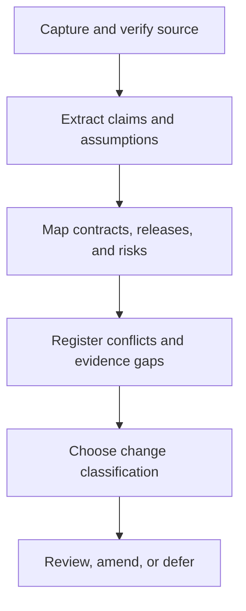

# Accretion v1.x Research Intake and SDD Amendment Process

**Document revision:** 3  
**Revised:** 2026-09-05

**Status:** Normative change-control process  
**Applies to:** New papers, experiments, implementation findings, incidents, benchmarks, and user ideas affecting the v1.x roadmap  
**Purpose:** Convert evidence into traceable decisions without silently changing released semantics or future release scope

---

## 1. Core rule

New research is evidence, not automatic product scope.

Before a target release ships, additional detail normally increments the SDD's `document_revision`. It does **not** create a patch number. For example, evidence that sharpens the v1.2 design produces:

```yaml
target_release: 1.2.0
document_revision: 2
supersedes_document_revision: 1
```

Only a compatible software correction or internal optimization made after v1.2.0 is released can become v1.2.1.

## 2. Accepted evidence inputs

The process accepts:

- peer-reviewed papers and primary preprints;
- official specifications, standards, vendor/runtime documentation, and release notes;
- reproducible code, datasets, benchmarks, and artifact evaluations;
- Accretion experiments and negative results;
- production/shadow telemetry and operator reports;
- defects, incidents, near misses, security reports, and audit findings;
- user goals and domain-expert observations;
- implementation constraints discovered in the repository.

Secondary summaries may help discovery but cannot be the sole evidence for a material technical, safety, security, or product claim.

## 3. Evidence status vocabulary

Every claim carries one status:

```text
REPORTED         source claims it
SOURCE_VERIFIED  primary source and metadata checked
REPRODUCED       independent or Accretion reproduction passed
CONTRADICTED     credible evidence conflicts
INCONCLUSIVE     evidence cannot distinguish the claim
RETRACTED        source withdrew or invalidated it
STALE            relevant environment/model/runtime changed materially
```

Paper-reported results begin as `REPORTED` or `SOURCE_VERIFIED`, never `REPRODUCED`. An Accretion release claim requires its own registered evaluation.

`review_depth` states how much of the primary source was actually inspected. `SOURCE_VERIFIED` is permitted only for claims supported by the recorded sections or pages; metadata or abstract inspection alone supports discovery, not a material design claim. `REPRODUCED` additionally requires a preserved local protocol, code/data identity and result bundle.

## 4. Research Intake Card

Create one immutable card per source or coherent evidence bundle:

```yaml
ResearchIntakeCard:
  intake_id: uuid
  title: string
  source_type: PAPER | SPEC | DOCS | CODE | DATASET | EXPERIMENT | INCIDENT | USER_IDEA
  canonical_url_or_ref: string
  authors_or_owner: [string]
  published_or_observed_at: timestamp | null
  accessed_at: timestamp
  source_version: string | null
  source_content_hash: sha256 | null
  review_depth: METADATA_ONLY | SELECTIVE_FULL_TEXT | FULL_TEXT | REPRODUCED
  reviewed_sections_or_pages: [string]
  evidence_status: REPORTED | SOURCE_VERIFIED | REPRODUCED | CONTRADICTED | INCONCLUSIVE | RETRACTED | STALE
  central_claims: [string]
  assumptions: [string]
  evaluated_domains: [string]
  evaluated_models_runtimes: [string]
  datasets_and_splits: [string]
  baselines: [string]
  metrics_and_effects: [object]
  compute_search_human_cost: object
  limitations: [string]
  safety_security_authority_notes: [string]
  reproducibility_assets: [string]
  conflict_refs: [EvidenceRef]
  candidate_release_impacts: [string]
  reviewer_refs: [PrincipalRef]
  content_hash: sha256
```

Do not copy unsupported claims into an SDD as facts. Attribute the source and label what is reported, inferred, reproduced, or still unknown.

## 5. Intake workflow



### Step 1 — Capture

- Record canonical source, version/date, authors/owner, and immutable reference/hash where permitted;
- prefer the primary paper/specification/code repository;
- preserve access date because model/runtime/provider claims drift;
- store sufficient metadata to distinguish revisions.

### Step 2 — Verify

- Confirm the source exists and the cited version supports the extracted claim;
- inspect methods, appendices, limitations, datasets, baselines, metrics, and cost accounting;
- distinguish empirical result from author hypothesis or marketing claim;
- check corrections, withdrawals, superseding versions, and artifact availability;
- record what could not be verified.

### Step 3 — Extract

For each material claim capture:

- mechanism and required inputs;
- output/action space;
- training/search/evaluation process;
- model/runtime/harness assumptions;
- domain and dataset boundary;
- verifier/reward construction;
- baselines and ablations;
- success, latency, TTVS, compute, cost, and human burden;
- failure, uncertainty, OOD, and negative-result behavior;
- safety, security, privacy, license, and reproducibility limits.

### Step 4 — Map to Accretion

Map the idea to:

- existing contract owner;
- candidate v1.x release and milestone;
- deterministic versus learned responsibility;
- online versus offline/shadow/simulation/physical boundary;
- required evidence and verifier class;
- authority, identity, secret, tenant, safety, and migration surfaces;
- conservative fallback and rollback;
- new tests, baselines, ablations, open questions, and threats to validity.

If no existing owner applies, record a contract gap; do not create a second source of truth informally.

### Step 5 — Register contradictions

Conflicting evidence creates a `ContradictionRecord`, not an overwritten summary:

```yaml
ContradictionRecord:
  contradiction_id: uuid
  claim_refs: [EvidenceRef]
  conflict_dimension: string
  affected_release_refs: [string]
  affected_contract_refs: [string]
  current_status: OPEN | BOUNDED_BY_COHORT | RESOLVED | INCONCLUSIVE
  resolution_protocol_ref: ArtifactRef | null
  decision_ref: ArtifactRef | null
```

Stratify by model, task, project, runtime, harness, verifier, risk, environment, embodiment, and cost regime before concluding that results agree or conflict.

## 6. Release-impact matrix

Complete this matrix for material evidence:

| Surface | No impact | Clarification | Compatible design change | New capability | Breaking/prohibited | Notes/evidence |
|---|---:|---:|---:|---:|---:|---|
| Product behavior |  |  |  |  |  |  |
| Public API/events |  |  |  |  |  |  |
| Contracts/persistence |  |  |  |  |  |  |
| Learned actions/cohorts |  |  |  |  |  |  |
| Verification/evidence |  |  |  |  |  |  |
| Authority/policy |  |  |  |  |  |  |
| Identity/secrets/tenancy |  |  |  |  |  |  |
| Safety/physical execution |  |  |  |  |  |  |
| Research protocol/metrics |  |  |  |  |  |  |
| Migration/rollback |  |  |  |  |  |  |
| UI/operations |  |  |  |  |  |  |

An authority, evidence, verifier, safety, or physical change cannot be treated as a harmless documentation refinement.

## 7. Allowed intake decisions

Choose exactly one:

| Decision | Use when | Version effect |
|---|---|---|
| `NO_CHANGE` | Evidence is irrelevant, duplicate, too weak, or already covered | None |
| `SDD_CLARIFICATION` | Wording/examples become clearer without normative design change | Increment document revision |
| `SDD_AMENDMENT` | Future unreleased design, tests, gates, or algorithm changes compatibly | Increment document revision; ADR if material |
| `NEW_MINOR_CANDIDATE` | New backward-compatible product capability or research claim | New `1.y.0` proposal and full SDD |
| `PATCH_CANDIDATE` | Released behavior needs compatible fix/internal optimization | New `1.y.z` proposal using patch template |
| `MAJOR_REVIEW` | Released public semantic/compatibility must break | Proposed `2.0.0`, Golden Direction impact, migration plan |
| `REJECT` | Violates permanent invariant, lacks lawful/safe path, or has unacceptable risk | No implementation |

`DEFER` is represented as `NO_CHANGE` plus an open research-backlog item and explicit reconsideration trigger; it is not hidden scope.

## 8. Decision rules

Apply in order:

1. Would the idea violate a permanent invariant, law, policy, physical safety boundary, verifier independence, or human authority? → `REJECT` or redesign with the unsafe portion removed.
2. Does it require incompatible released API, event, contract, persistence, authority, evidence, or safety meaning? → `MAJOR_REVIEW`.
3. Does it add a backward-compatible product capability, supported cohort, learned action, or material shipped research claim? → `NEW_MINOR_CANDIDATE`.
4. Does it correct or internally optimize already released behavior with no semantic expansion? → `PATCH_CANDIDATE`.
5. Does it materially refine an unreleased SDD? → `SDD_AMENDMENT`.
6. Does it only improve explanation or references? → `SDD_CLARIFICATION`.
7. Otherwise → `NO_CHANGE` or `REJECT`, with reason.

## 9. SDD amendment requirements

An `SDD_AMENDMENT` includes:

```yaml
target_release: 1.y.0
new_document_revision: integer
supersedes_document_revision: integer
intake_card_refs: [ArtifactRef]
change_summary: string
normative_sections_changed: [string]
affected_contracts: [string]
affected_milestones: [string]
affected_acceptance_gates: [string]
authority_delta: NONE | REVIEW_REQUIRED
safety_delta: NONE | REVIEW_REQUIRED
migration_delta: NONE | REVIEW_REQUIRED
benchmark_delta: NONE | DESCRIPTION
adr_ref: ArtifactRef | null
approval_refs: [PrincipalRef]
```

The amendment must update all dependent sections, not only the algorithm description. Review at least scope, exclusions, contracts, authority, failure handling, security, verification, tests, benchmark, milestones, acceptance, open questions, and handoff gates.

## 10. ADR trigger

Create an Architecture Decision Record when new evidence:

- changes a contract owner or introduces a canonical contract;
- changes deterministic-versus-learned responsibility;
- adds or removes a service, trust boundary, runtime, datastore, or external dependency;
- changes online/shadow/simulation/physical placement;
- changes a public API/event/persistence strategy;
- changes promotion, rollback, quarantine, evidence, or verifier flow;
- resolves a contradiction through a non-obvious tradeoff;
- changes a baseline or primary research estimand materially.

The ADR records alternatives, consequences, evidence strength, rejected unsafe options, compatibility, migration, rollback, and revisit trigger.

## 11. Research backlog

Unresolved work is explicit:

```yaml
ResearchBacklogItem:
  item_id: uuid
  question: string
  affected_release: string | null
  blocking: boolean
  evidence_needed: [string]
  protocol_needed: string | null
  owner: string | null
  review_trigger: DATE | NEW_PAPER | EXPERIMENT_RESULT | INCIDENT | IMPLEMENTATION_FINDING | USER_DECISION
  trigger_value: string
  status: OPEN | ACTIVE | RESOLVED | REJECTED | SUPERSEDED
  decision_ref: ArtifactRef | null
```

Do not convert a backlog item into an implementation ticket until its release classification and authority are approved.

## 12. Review roles

Material changes require appropriate independent review:

| Impact | Minimum review |
|---|---|
| Algorithm/research claim | Research/method review |
| API/contract/persistence | Architecture and compatibility review |
| Identity/secret/tenancy | Security/privacy review |
| Verification/evidence | Independent verification/governance review |
| Learned authority/action | Policy/authority review |
| Physical/safety | Physical safety owner and exact human authority |
| Product release/scope | User/product-owner approval |

The paper reader, proposer, implementer, evaluator, and promoter may overlap only where the existing separation-of-duty rules permit. The producer never becomes its sole acceptor.

## 13. Approval state machine

```text
DRAFT
→ SOURCE_VERIFIED
→ IMPACT_MAPPED
→ REVIEW_REQUESTED
→ NEEDS_EVIDENCE | REJECTED | APPROVED_CLASSIFICATION
→ DOCUMENT_AMENDED | NEW_SDD_OPENED | PATCH_SDD_OPENED | NO_CHANGE_RECORDED
→ IMPLEMENTATION_LOCKED | AUTHORIZED_FOR_IMPLEMENTATION
```

Approval of a research classification or SDD revision does not authorize repository modification, deployment, GitHub actions, model training, or physical execution. Those remain separately authorized.

## 14. Revalidation triggers

Reopen affected intake decisions when:

- a paper is corrected, withdrawn, superseded, or contradicted;
- code/data cannot reproduce a central result;
- model/runtime/provider behavior changes materially;
- a verifier weakness, leakage, reward hack, or benchmark contamination is found;
- total search/training/human cost changes the value claim;
- implementation reveals a missing contract or incompatible assumption;
- a security incident, near miss, negative transfer, or physical incident occurs;
- target cohort or supported hardware/environment changes;
- user goals, constraints, or acceptance thresholds change.

Revalidation may downgrade evidence, block a milestone, revoke a candidate, or amend a future SDD. It does not erase the earlier decision.

## 15. Application to the current research set

The current v1.x package treats the supplied harness-optimization research as design inspiration with Accretion-specific claims still unproven:

| Research direction | Initial Accretion mapping | Required local evidence |
|---|---|---|
| Flow/harness compilation | v1.2 specialized portfolio design | Project-disjoint verified TTVS and cost comparison |
| Smaller models with better harnesses | v1.1-v1.2 compute/harness interaction | Verified-success-constrained frontier-call and TTVS study |
| Adaptive/retrospective/meta harnesses | v1.5 offline proposal pipeline | Hidden holdout, total search cost, independent promotion |
| Test-time policy optimization | v1.6 open-weight lab only | Eligible license/runtime, verifier-supported pseudo-labels, amortization |
| Harness reinforcement/evolution | v1.5-v1.6 sandbox candidate study | Reward-hacking, leakage, safety, and search-cost controls |
| Transfer of learned efficiency | v1.7 simulation weak prior | Target-only comparison and negative-transfer stopping |
| Physical use | v1.8 pre-freeze advisory only | Exact target simulator, preflight, freeze, approval, task, and safety evidence |
| Adaptive task acquisition | v1.1 profile pilot, then v1.5 trace coreset | Positive propensities, paired candidates, uniform arm, common untouched holdout, total acquisition cost |
| Observable intervention/replay | v1.3 restorable digital study | Actual descendant re-execution, independent verification, no proposer gold access, full-retry control |
| Memory write-path defense | v1.4 trust/provenance study | Actual storage/retrieval attack, separate attack/retrieval denominators, least-trust derivation, exact invalidation |
| Verification and calibration | Shared protocol and v1.6 labels | Task-family false-acceptance bound, corrupted/adversarial cases, time-forward shift assessment |
| Drift-triggered updating | v1.7 transfer study | Frozen/periodic/triggered comparison under matched target budgets and target-only fallback |
| Workflow allocation | v1.7-v1.8 simulation only | Fixed graph/resource model, FCFS/static controls, no provider GPU/KV or physical inference |

No paper result changes the existing v0.4-v1.0 SDDs or proves a v1.x release gate.

## 16. Worked versioning examples

### More v1.2 detail before release

A new paper suggests a stronger regime detector and an additional leakage ablation. Update `Accretion_SDD_v1.2.0` from document revision 1 to revision 2, cite the intake card, amend the benchmark and risk sections, and review the change. Do **not** call this v1.2.1.

### Bug after v1.2 release

After v1.2.0 ships, a harness-cache defect returns a stale promoted bundle. Open `PATCH_CANDIDATE` v1.2.1 using the patch template.

### New behavior after v1.2 release

Research proposes automatic harness repair as a new learned action. This is not v1.2.1; open a `NEW_MINOR_CANDIDATE` such as a later v1.y.0 with full authority, contract, evaluation, and rollback design.

### Breaking contract discovery

A required change would alter released evidence-state meaning for all clients. Open `MAJOR_REVIEW`; do not hide it inside a patch or model artifact update.

## 17. Intake acceptance checklist

- [ ] Canonical source/version and access date are recorded.
- [ ] Central claims are supported by the cited primary source.
- [ ] Assumptions, evaluated boundary, limitations, and total cost are extracted.
- [ ] Reported evidence is not mislabeled reproduced evidence.
- [ ] Contracts, releases, authority, safety, verification, security, migration, and rollback impacts are mapped.
- [ ] Contradictions and negative/inconclusive evidence remain visible.
- [ ] Release classification follows Section 8.
- [ ] Pre-release design detail uses document revision, not patch SemVer.
- [ ] Material amendments update every dependent SDD section and include an ADR when triggered.
- [ ] Required independent reviewers and human approvals are recorded.
- [ ] Implementation, deployment, GitHub, training, and physical-execution authority remain separate.
- [ ] Revalidation triggers and deferred evidence gaps are explicit.

## 18. Final rule

> Accretion adopts a research idea only after its assumptions are mapped to existing owners, its contradictions and risks remain visible, and an Accretion-specific evaluation earns the claimed scope. Version numbers describe shipped compatibility; they do not substitute for evidence or authorization.
