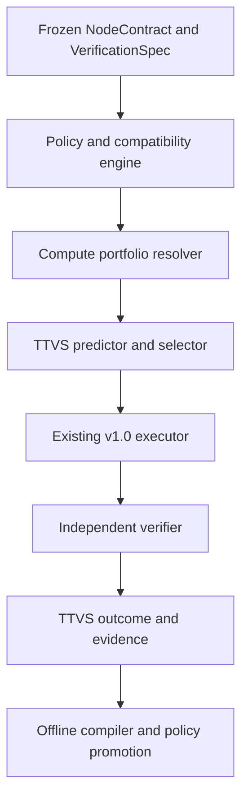

# Accretion v1.1.0 Software Design Description

## Verified Compute Optimizer

**Document status:** Forward technical design baseline  
**Document revision:** 4  
**Supersedes document revision:** 3  
**Release authority:** Locked until v1.0.0 is stable and every entry gate passes  
**Primary domains:** Software engineering and AI research  
**Secondary shadow domain:** Robotics simulation  
**Primary objective:** Reduce time-to-verified-success under a hard verified-success constraint

---

## 1. Purpose and primary claim

v1.1.0 adds a compute-efficiency layer above the stable v1.0 orchestration system. It compiles approved execution configurations into Pareto-efficient compute portfolios and selects the best starting profile for each eligible node.

Primary research claim:

> On unseen Software/AI projects, the Verified Compute Optimizer reduces expected time-to-verified-success and compute per verified success relative to the strongest governed v1.0.0 baseline, while preserving the preregistered verified-success floor and every critical correctness, security, policy, safety, and reproducibility gate.

Reducing frontier calls is secondary. A frontier model remains correct when it is the fastest safe route to verified success.

## 2. Golden Direction alignment

v1.1 extends, rather than replaces, the v0.4 node router:

- v0.4 owns the canonical `ExecutionConfiguration`, compatibility, routing, and promotion semantics;
- v1.1 makes reasoning budget, context policy, execution tier, retry policy, and escalation cost explicit;
- v1.1 optimizes full TTVS rather than first-attempt latency;
- deterministic policy/compatibility pruning still precedes learning;
- independent verification remains frozen before selection;
- v1.0.0 remains the conservative fallback.

## 3. Entry conditions

All conditions are mandatory:

1. v1.0.0 is released rather than preview and its platform claim passed.
2. v1.0 contract profile, replay, backup, canary, incident, and rollback drills pass.
3. Node-level timestamps cover routing, execution, verification, retries, escalation, and evidence commit.
4. Runtime/model/tool/harness/verifier/environment versions are pinned to outcomes.
5. Candidate sets and propensities are available where off-policy evaluation is planned.
6. Project-disjoint evaluation infrastructure and leakage audit are reproducible.
7. The v1.0 deterministic/governed fallback can be activated per workspace and cohort.
8. A release ResearchProtocol freezes the TTVS boundary, non-inferiority margin, minimum effect, cohorts, and cost accounting.

## 4. Scope

### 4.1 Included

- Explicit tiered `ComputeProfile` registry;
- Offline subagent/node profiling;
- Pareto portfolio compilation;
- Calibrated verified-pass, latency, attempts, cost, and TTVS prediction;
- Uncertainty and OOD-aware abstention;
- Selection among already compatible profiles;
- Deterministic, small/specialized, mid-tier, and frontier tiers;
- Shadow, canary, cohort activation, and rollback;
- TTVS and amortized-cost accounting;
- Routing explanation and compatible human override;
- Software/AI primary benchmark and Robotics-simulation shadow analysis.

### 4.2 Excluded

- New graph-planning authority;
- Harness generation or mutation;
- Learned repair sequences beyond existing deterministic escalation;
- Model-weight updates or TTPO;
- New physical execution behavior;
- Online exploration on medium/high-risk, physical, or unknown cohorts;
- Changing permissions, verification semantics, objectives, or safety rules;
- Accepting cached/reused output without the required current verifier.

### Revision-4 study scope

Freeze task-family and difficulty strata, supported repeat counts, execution order and cold/warm-cache policy before acquisition. The new research payloads and gates are normative design requirements; empirical benefits remain unproven.

## 5. Inherited invariants

The Golden Direction, v0.4-v1.0 registry, v1.x registry, and shared evaluation protocol are normative. In particular:

- No evidence, no acceptance.
- A producer cannot be its sole verifier.
- `FAIL`, `INCONCLUSIVE`, `ERROR`, and `QUARANTINED` are non-passing.
- Learned components never see policy-incompatible candidates.
- Secrets remain behind opaque connection handles and the Token Broker.
- Critical cohort regression blocks promotion.
- Physical/high-risk execution remains outside online exploration and automatic retry.

## 6. System context and authority



The optimizer may select a compatible profile. It cannot execute a capability directly, validate its own output, edit the candidate set after observing hidden results, or promote itself.

## 7. Component responsibilities

### 7.1 Compute Profile Registry

- Registers immutable profiles and dependency digests;
- Resolves supported/experimental/retired state;
- Validates runtime, model, tool, harness, verifier, and environment references;
- Exposes only policy-compatible candidates to the compiler/router.

### 7.2 Profiler

- Executes candidate profiles on development tasks under fixed budgets;
- Records quality, TTVS decomposition, token/compute/cost, errors, and verifier burden;
- Separates provider wait, controlled execution, and offline costs;
- Produces immutable profiling datasets.

### 7.3 Portfolio Compiler

- Prunes infeasible candidates first;
- Estimates node/subagent response surfaces;
- Removes empirically or conservatively dominated profiles;
- Emits a versioned portfolio for a declared cohort;
- Validates that the v1.0 fallback remains present.

### 7.4 Outcome Models

- Calibrated classifier for verified PASS;
- Quantile models for execution and verification latency;
- Count/survival model for attempts and timeout risk;
- Cost and frontier-escalation estimators;
- OOD and epistemic-uncertainty estimator.

Initial default: interpretable calibrated logistic/gradient-boosted models. Deep models require evidence that they materially improve the registered target.

### 7.5 Compute Selector

- Receives only compatible portfolio entries;
- applies success lower-confidence, OOD, budget, and risk gates;
- minimizes predicted TTVS among remaining candidates;
- abstains to the v1.0 fallback when uncertainty or coverage is inadequate;
- emits a complete `ComputeDecisionReceipt`.

### 7.6 TTVS Meter

- Uses monotonic clocks within a host and synchronized trace correlation across services;
- records queue, route, context, inference, tools, verification, repair, escalation, and commit segments;
- marks missing spans and measurement quality;
- never fabricates zero-duration missing work.

### Evidence responsibilities

The Profiler records requested, accepted and observably effective settings through `EffectiveSettingObservation`. The TTVS Meter binds prompt semantics, harness/tool schema, reasoning interface, context/compaction, gateway, provider/accounting version, execution order and cache condition. Runtime acceptance alone does not prove a setting took effect; a supported observable signal or an explicit UNKNOWN is required. Private reasoning text is neither required nor collected.

## 8. Contracts

Canonical contracts are owned by the v1.x registry. A decision minimally contains:

```yaml
ComputeDecisionReceipt:
  decision_id: uuid
  node_contract_ref: object
  verification_spec_ref: object
  routing_context_hash: sha256
  portfolio_ref: object
  candidate_profile_refs: [object]
  compatibility_receipt_refs: [object]
  predictions: [ComputePrediction]
  selected_profile_ref: object | null  # null exactly on ABSTAIN
  decision_mode: BASELINE | SHADOW | EXPLOIT | EXPLORE | ABSTAIN
  abstention_reason: string | null
  fallback_profile_ref: object
  policy_artifact_ref: object | null  # null for deterministic baseline
  objective_contract_ref: object
  created_at: timestamp
  content_hash: sha256
```

`ComputeProfile` references, but does not replace, the v0.4 `ExecutionConfiguration`.

The registry and revision-2 addendum define the required `ComputeDispatchBinding` extension. `ComputeDecisionReceipt` is an immutable proposal/evidence receipt, never dispatch authority. The existing v0.4 RoutingDecisionReceipt is the single authoritative routing decision. ABSTAIN has no selected profile and has a reason; fallback_profile_ref is a proposed fallback, which still requires fresh complete compatibility validation. SHADOW records a proposal but never creates an optimizer dispatch. An empty candidate set may abstain; if no admissible baseline exists, PAUSE without dispatch. Selection probabilities (including abstention where randomized) and the exact eligible candidate-set hash are recorded; off-policy evaluation is forbidden without valid behavior propensities. Deterministic choices record probability 1 for the chosen action.

### 8.1 Immutable assembly and dispatch bridge

Resolve aliases, then assemble the complete effective configuration from the registered ExecutionConfiguration and profile: runtime/model/provider bindings, reasoning limits, context policy, tool subset, optional harness, retry and escalation policies. Record the materialized configuration digest and each resolved immutable dependency. Existing ExecutionConfiguration fields use their existing schema; additive dimensions live in the extension payload consumed only by a declared compatible executor adapter. An adapter that cannot apply any field rejects the profile; no ignored extras or post-validation defaults are allowed.

Validate the **assembled** configuration against the frozen NodeContract, VerificationSpec, ObjectiveContract, JointPolicySnapshot, graph revision, remaining budget, risk, current policy and verifier-independence constraints. Bind that final CompatibilityDecision and the existing RoutingDecisionReceipt to a ComputeDispatchBinding. All referenced hashes must agree. The extension may tighten limits but cannot authorize retry, escalation, tools, or capabilities beyond predecessor ownership. A retry/escalation is a new authorized attempt and decision, never a hidden mutation of this binding.

In one transaction, reserve budget and persist the proposal, canonical routing decision, dispatch binding, and outbox entry with expected aggregate version. The idempotency scope is workspace + node + attempt + key; identical payload returns the prior result, changed payload under the same key is a conflict. Only the existing executor consumes the outbox. Before execution it atomically checks unconsumed attempt/budget, current revocation/policy/graph epoch, expiry, and all binding digests. A stale dependency requires a new decision; it cannot be repaired in place. Duplicate delivery is deduplicated before invocation. An uncertain provider invocation is reconciled or paused; it is never blindly replayed as a retry. Crash recovery cannot create a second authoritative dispatch.

### Revision-4 research payloads

Each profile trial links its immutable candidate and effective-configuration references to an `EffectiveSettingObservation`, with supported-field outcomes, evidence references, cache condition and accounting identity. `ResearchStudyPlan.comparison_plan_ref` resolves a `ResearchComparisonPlan` of kind `PROFILE_ACQUISITION`; it binds the three candidates and the separate adaptive/uniform arm budgets. Receipt schema acceptance is not proof of runtime activation.

## 9. Lifecycle and state machines

### 9.1 Portfolio

```text
DRAFT → PROFILED → VALIDATED → SHADOW → ACTIVE → RETIRED
                                      ↘ REVOKED
```

### 9.2 Compute policy

```text
CANDIDATE → OFFLINE_EVALUATED → SHADOW → CANARY
→ ACTIVE_COHORT → RETIRED | ROLLED_BACK | REVOKED
```

### 9.3 Decision

```text
CREATED → FILTERED → PREDICTED → SELECTED | ABSTAINED
→ ASSEMBLED → FINAL_VALIDATED → DECISION_COMMITTED_WITH_OUTBOX
→ DISPATCH_CLAIMED → EXECUTED → VERIFIED → OUTCOME_RECORDED
```

A retry creates a new execution linked to the same causal chain; it never overwrites the prior decision or outcome.

SHADOW ends at PROPOSAL_RECORDED. Failed assembly/compatibility ends REJECTED; inadmissible fallback ends PAUSED. Revocation, stale epoch, or digest mismatch before dispatch ends INVALIDATED with append-only evidence and no execution. An immutable receipt is never updated to represent a lifecycle transition; events derive its current projection.

## 10. Algorithms and compatibility rules

### 10.1 Candidate generation

1. Resolve the frozen node and verification contracts.
2. Enumerate registered execution configurations.
3. Apply capability, policy, environment, data, risk, provider, verifier-independence, and budget rules.
4. Join each surviving configuration with allowed reasoning/context/retry/escalation policies.
5. Resolve a matching active portfolio or use the conservative baseline.

### 10.2 Selection objective

For candidate \(a\):

\[
\widehat{TTVS_H}(a|x)=\int_0^H [1-\widehat{P}(T_{pass}\le t\mid x,a)]\,dt
\]

Select:

\[
a^*=\arg\min_{a\in A_{feasible}} \widehat{TTVS_H}(a|x)
\]

where feasibility requires the lower confidence bound for verified PASS, hard policy/risk compatibility, remaining resource budget, and OOD coverage. Cost breaks near-ties according to the approved `ObjectiveContract`.

Predict success by the frozen horizon, including the entire governed attempt chain, queue, verification and commit. Component latency and expected recovery costs are diagnostics, not an uncapped primary surrogate that rewards failure. Failure/timeout/unresolved mass remains at H under the shared protocol. Final deterministic validation in §8.1 still follows selection.

### 10.3 Cold start

- Use exact compatible historical profiles first;
- use workspace-level evidence as a capped prior;
- use cross-domain evidence only as a weak shadow prior;
- abstain to v1.0 when coverage or calibration is insufficient.

### 10.4 Cache/reuse tier

T0 reuse requires input/environment/dependency identity and the current NodeContract's reuse policy. Reused artifacts still pass the current required verifier unless the frozen VerificationSpec explicitly recognizes a still-valid signed verification receipt.

### Revision-4 method rules

Before a trial, check all required settings against the executor adapter. Unsupported or silently ignored fields reject the intended profile; ambiguous observations block readiness or retain UNKNOWN according to the frozen protocol. Keep every allocated trial in intention-to-treat accounting, including activation failures. Counterbalance or randomize execution order when cache/provider timing can affect the comparison. An inert configuration change may be a diagnostic control; it never substitutes for all three profiles.

## 11. APIs and idempotency

| Method | Endpoint | Purpose |
|---|---|---|
| POST | `/api/v1/compute-profiles` | Register immutable profile |
| GET | `/api/v1/compute-profiles` | Query compatible profiles |
| POST | `/api/v1/compute-compiler-runs` | Start offline profiling/compilation |
| GET | `/api/v1/compute-portfolios/{id}` | Inspect portfolio and lineage |
| POST | `/api/v1/nodes/{id}/compute-decisions` | Create selection/abstention receipt |
| GET | `/api/v1/compute-decisions/{id}` | Inspect candidates and predictions |
| POST | `/api/v1/compute-policies/{id}/promote` | Enforce signed promotion workflow |
| POST | `/api/v1/compute-policies/{id}/rollback` | Roll back named cohort |

Mutations require `Idempotency-Key`; promotion and rollback require expected current version and authorized principal. Repeated decision creation with the same key returns the original receipt.

## 12. Events and replay

Required events:

```text
compute.profile.registered
compute.compiler.started
compute.portfolio.compiled
compute.portfolio.validation_failed
compute.decision.recorded
compute.decision.abstained
compute.execution.started
compute.outcome.recorded
compute.policy.promoted
compute.policy.rolled_back
```

Replay reconstructs the exact portfolio, model, feature view, candidate set, predictions, selection, execution, verification, and timing segments. Events hold references for large feature/trace artifacts.

## 13. Persistence and migrations

- Add versioned profile, portfolio, compiler-run, prediction, decision, and TTVS outcome aggregates.
- Preserve existing routing receipts and link them; do not backfill guessed predictions.
- Historical v1.0 executions may be used only when timestamp and lineage completeness meet a declared quality threshold.
- Missing measurements carry explicit `UNKNOWN` quality state.
- Feature views are reproducible from immutable evidence snapshots.
- Database migration supports coexistence with v1.0 and rollback that ignores additive v1.1 tables safely.

### Research lineage and migration

Store observation references with immutable trial/candidate identity, provider/accounting snapshot and timing quality. Historical runs without these observations remain historical and ineligible for activation-specific claims; no successful observation is backfilled.

## 14. Identity, tenancy, secrets, and policy

- Workspace/project boundaries apply to profiles, data, feature views, and policies.
- Cross-workspace training is disabled by default.
- Cost/provider metadata respects workspace confidentiality.
- Raw prompts/traces are redacted and access-controlled before training.
- Runtime credentials remain opaque and never become router features.
- A profile may reference a connection class/health state, not a raw token.
- Policy denial and rate limits are typed inputs, not signals to seek an alternate unauthorized route.

Research inputs, observations and comparison plans inherit existing least-privilege, redaction and proposer/evaluator separation. Diagnostic controls that intentionally omit an invariant are confined to isolated command-disabled tests and cannot reach live or physical authority.

## 15. Failure handling and recovery

| Failure | Required behavior |
|---|---|
| No compatible profile | Pause or use explicitly registered v1.0 baseline |
| Portfolio unavailable/corrupt | Fail to v1.0 baseline and raise incident |
| Prediction service unavailable | Deterministic v1.0 routing |
| OOD/high uncertainty | Abstain to v1.0 baseline |
| Selected provider unavailable | Existing compatible failover under cap; otherwise pause |
| Verifier unavailable | Equivalent preapproved verifier or pause; never skip |
| Measurement span missing | Mark low-quality outcome; exclude from strict training |
| Critical false acceptance | Quarantine lineage, revoke policy, roll back cohort |

v1.1 does not learn a recovery sequence; it invokes existing bounded v1.0 behavior and records it in TTVS.

### Research failure semantics

A setting mismatch blocks intended-profile readiness and follows the existing failure/compatibility path. Missing telemetry is UNKNOWN; it cannot be converted to a measured zero or assumed activation. Requalification creates a new observation and preserves the failed trial.

## 16. Verification and contradiction handling

- VerificationSpec is frozen before compute selection.
- The selector cannot choose a profile that breaks verifier independence.
- Profile success labels derive from the canonical v0.4 independent-verification contract—semantic `VerificationResult`, current repository code type `IndependentVerificationResult`—plus final-run attribution; they do not reuse the distinct v0.1 API type as a routing label.
- Verifier disagreement produces `INCONCLUSIVE` and may trigger human review.
- Later false acceptance quarantines affected outcomes, features, portfolios, policies, and dependent releases through lineage.
- Contradictory cohort evidence remains visible and can result in cohort-specific rather than global activation.

Every uncertainty claim references the shared typed uncertainty statement and applicable data-role/assumption evidence. Source-paper results, synthetic design fixtures, observed runtime outcomes and independent research conclusions retain separate verification status.

## 17. Observability and Experiment Studio

Add:

- TTVS decomposition waterfall;
- selected tier/profile and v1.0 fallback;
- candidate Pareto plot for verified success, latency, and cost;
- uncertainty/OOD and abstention reason;
- expected versus observed attempts/TTVS;
- frontier-call and escalation counts;
- portfolio/compiler lineage;
- cohort health, drift, canary, and rollback status;
- compatible human override with required reason.

The UI is a projection and cannot insert an incompatible candidate.

### Research evidence views

Show requested/accepted/observed setting status, cache and order controls, trial counts by acquisition arm, holdout cost, and missing accounting fields beside TTVS. Explain unsupported settings without displaying hidden reasoning or credentials.

## 18. Test strategy

### Unit/property

- Canonical hashes and schemas;
- Pareto pruning invariants;
- no incompatible candidate survives;
- selection honors success floor and budgets;
- missing/NaN/extreme predictions fail safely;
- monotonic TTVS segment accounting;
- idempotency and concurrency.

### Integration/replay

- Registry → selector → executor → verifier → outcome;
- provider/verifier failures and fallback;
- event replay and historical migration;
- quarantine propagation;
- workspace isolation;
- v1.0 rollback.

### Adversarial

- manipulated latency/cost metadata;
- prompt/tool output attempting candidate injection;
- confidence spoofing;
- verifier leakage;
- reward/cost tampering;
- secrets in features/traces;
- resource-amplification loops.

### Revision-4 negative and boundary tests

Test an ignored reasoning setting, unsupported adapter field, missing observable signal, cache-state mismatch, incomplete three-profile batch, duplicated arm cost, missing verifier cost and holdout-selected winner. Check that configuration failure remains an allocated non-success and cannot manufacture a cost saving.

## 19. Research benchmark

Primary cohort: unseen Software/AI projects with repeated node families and independently executable verification. Include code repair, test generation, structured research extraction, repository analysis, data transformation, and bounded tool workflows where legally and technically feasible.

Required baselines:

1. v1.0 strongest governed router;
2. fixed frontier;
3. cheapest compatible;
4. deterministic difficulty heuristic;
5. portfolio compiler without learned per-instance selection;
6. learned selector without TTVS recovery term;
7. full v1.1;
8. post-hoc oracle.

Primary endpoint: paired TTVS under verified-success non-inferiority. Secondary endpoints follow the shared protocol.

Required v1.1 ablations:

- no offline portfolio compiler;
- no success LCB;
- no uncertainty/OOD gate;
- first-call latency instead of TTVS;
- no retry/escalation prediction;
- no project adaptation;
- no deterministic T0 tier.

### 19.1 Revision-4 profile-only pilot

The first study is narrower than the full v1.1 claim. It tests whether cost-aware adaptive task acquisition can identify one useful **fixed compute profile** without paying for every available development task. It does not test conditional per-task routing, portfolio compilation, online learning, physical execution or release promotion.

The pilot uses exactly three prevalidated, policy-compatible profiles: the current governed baseline, one lower-cost candidate and one higher-capability candidate. Profile definitions, compatibility results, provider/runtime snapshots, pricing basis, verifier version, task population, acquisition rule, analysis code and stop rules freeze before any adaptive observation. Every acquired development task runs all three profiles. No profile is eliminated in the primary pilot; this preserves paired observations and positive inclusion probability for every profile/task comparison. A matched uniform rotating acquisition arm measures whether adaptivity saves evaluations or merely chooses longer or easier tasks.

| Stage | Purpose | Required exit evidence |
|---|---|---|
| 0 | Qualify the verifier | Correct/incorrect labeled cases, false-acceptance bound, failure taxonomy and explicit scope |
| 1 | Inventory existing traces | Eligible count by task family, project lineage, profile coverage, missingness and latency/cost quality |
| 2 | Offline replay | Frozen selector simulation, leakage audit, acquisition propensity and effective-sample-size diagnostics |
| 3 | Bounded development pilot | Paired three-profile observations, uniform comparator and all acquisition/verification costs |
| 4 | Common untouched holdout | All three profiles on the same tasks, selection regret, verified success and capped TTVS |

Budget complete batches explicitly. With three profiles, a per-arm cap of 20 permits six complete task batches (18 profile trials); a cap of 24 permits eight. If adaptive and uniform arms each receive 24 profile trials and six common holdout tasks each run all three profiles once, the total is 66 profile trials before qualification, repeats beyond those counted, retries and other extra evaluations. This is arithmetic, not a sample-size recommendation. Document 24 defines the full formula and the inventory-dependent freeze decisions; no prior 38–42 total is retained.

The pilot reports evaluation count, tokens, provider wait/quota time, wall time, local compute, money, verifier cost, selector cost, failed-candidate cost and human review separately. A lower evaluation count is not a benefit if total time or money rises. Only after this profile-only stage passes may v1.1 study conditional routing, portfolio compilation or live shadow behavior under a new frozen protocol.

### Revision-4 comparison and claim boundary

Freeze task-family and difficulty strata, supported repeat counts, execution order and cold/warm-cache policy before acquisition. Measure intended-treatment outcomes first and activation-qualified outcomes second. Do not discard a failed configuration after seeing its cost. The mature governed baseline is mandatory. Acquisition arms have isolated histories, although a complete historical panel may be replayed separately by both algorithms with collection cost reported once and replay cost separately. The holdout evaluates all three frozen profiles; it cannot choose a different winner after being opened.

## 20. Implementation milestones

| Milestone | Deliverable | Exit evidence |
|---|---|---|
| C1 | TTVS contract and trace instrumentation | Clock/trace conformance, activation observations and replay tests |
| C2 | Compute Profile Registry | Schema, compatibility, migration tests |
| C3 | Offline profiler/compiler | Reproducible portfolio fixtures |
| C4 | Outcome models and calibration | Project-disjoint offline report |
| C5 | Shadow selector and Studio views | Shadow parity and explanation tests |
| C6 | Low-risk digital canary | Preregistered canary report and rollback drill |
| C7 | Research evaluation | Full report, ablations, reproduction bundle |
| C8 | Release hardening | Security, SLO, incident, and sign-off |

## 21. Release acceptance criteria

Stable IDs map to accountable roles, evidence targets and design fixtures in `18_ACCEPTANCE_TRACEABILITY.json`. All implementation/research evidence remains pending.

- [ ] **AC11-C1-001** Every decision uses a frozen NodeContract and VerificationSpec.
- [ ] **AC11-C2-002** Only policy-compatible profiles reach prediction and selection.
- [ ] **AC11-C5-003** v1.0 fallback is tested and immediately activatable by cohort.
- [ ] **AC11-C1-004** TTVS includes failed attempts, verification, and escalation.
- [ ] **AC11-C1-005** Only independently verified PASS counts as success.
- [ ] **AC11-C4-006** OOD/uncertain inputs abstain according to preregistered rules.
- [ ] **AC11-C5-007** Decision receipts reproduce from pinned snapshots.
- [ ] **AC11-C3-008** Profile/compiler/policy lineage is complete and quarantine-capable.
- [ ] **AC11-C8-009** No critical correctness, authority, policy, secret, safety, or isolation regression occurs.
- [ ] **AC11-C7-010** Verified-success non-inferiority passes globally and on critical cohorts.
- [ ] **AC11-C7-011** TTVS improvement meets the preregistered minimum effect and confidence gate.
- [ ] **AC11-C7-012** Total/offline/amortized costs and break-even horizon are reported.
- [ ] **AC11-C7-013** Required baselines and ablations are complete.
- [ ] **AC11-C6-014** Shadow, canary, promotion, rollback, and incident drills pass.
- [ ] **AC11-C8-015** Negative and inconclusive results remain available.
- [ ] **AC11-C1-016** Complete profile assembly is content-bound to the frozen node, verifier, objective, joint policy, graph, final compatibility and single canonical routing receipt.
- [ ] **AC11-C5-017** Receipts and budget reservation commit atomically with the outbox before dispatch; stale epochs, mismatched digests and duplicate attempts cannot invoke the executor.
- [ ] **AC11-C1-018** ABSTAIN has no selected profile, SHADOW cannot dispatch, and fallback requires final complete compatibility validation.
- [ ] **AC11-C7-019** Failure, timeout and unresolved outcomes contribute the frozen horizon; time-to-terminal cannot substitute for capped time-to-PASS.
- [ ] **AC11-C7-020** The profile-only adaptive pilot preserves paired three-profile observations, positive logged acquisition probabilities and a matched uniform acquisition comparator.
- [ ] **AC11-C7-021** The selected profile and every comparator are evaluated on the same untouched holdout, with selection regret and acquisition/holdout costs reported separately.

- [ ] **AC11-C1-022** Every profile trial records requested, accepted and observed supported settings with immutable configuration, cache, order and accounting evidence; UNKNOWN cannot establish activation.
- [ ] **AC11-C7-023** The pilot budgets complete three-profile batches for each acquisition arm, qualification, repeats and common holdout, while preserving activation failures in intention-to-treat outcomes.

## 22. Open questions and proposed defaults

| ID | Question | Proposed default | Resolve by |
|---|---|---|---|
| C-OQ1 | Initial model class | Calibrated gradient-boosted ranker plus logistic baseline | C4 design freeze |
| C-OQ2 | Success confidence method | Cluster-aware bound for the declared success estimand; prediction coverage is not a per-task probability bound | Protocol freeze |
| C-OQ3 | TTVS start/end | Node READY to committed independent PASS capped at frozen H; no-PASS contributes H; TTT separate | C1 |
| C-OQ4 | Cost source | Measured provider/local compute with explicit unknown quality | C1 |
| C-OQ5 | Portfolio refresh | Offline on drift/evidence trigger, never silent live mutation | C3 |
| C-OQ6 | Initial activation | LOW_DIGITAL only | C6 |
| C-OQ7 | Robotics | Simulation shadow only | Release gate |
| C-OQ8 | Non-inferiority margin | Preregister from baseline variability and task criticality | Protocol freeze |
| C-OQ9 | Pilot profiles | Exactly three fixed compatible profiles; select from the trace inventory before protocol freeze | Pilot protocol freeze |
| C-OQ10 | Workload and amortization horizon | Infer from observed eligible traffic and report sensitivity; do not assume a production volume | Pilot protocol freeze |
| C-OQ11 | Observation and budget readiness | Resolve supported effective-setting signals, cache/order design and complete per-arm trial ledger from inventory | C1 and pilot freeze |

## 23. Handoff to v1.2.0

v1.2 remains locked until:

1. v1.1 passes its scientific and operational gates;
2. ComputeProfile/portfolio/decision contracts are stable;
3. Profile and harness effects can be separated experimentally;
4. A general/global harness remains a measurable efficiency bottleneck;
5. Harness candidates can use the v0.10 sandbox/evaluation/promotion path;
6. v1.1 cohort rollback is proven.

The v1.1 handoff includes activation-qualified profile identities, complete trial/cost accounting and an untouched selection assessment. Passing the fixed-profile feasibility study does not by itself satisfy the full routing claim.

