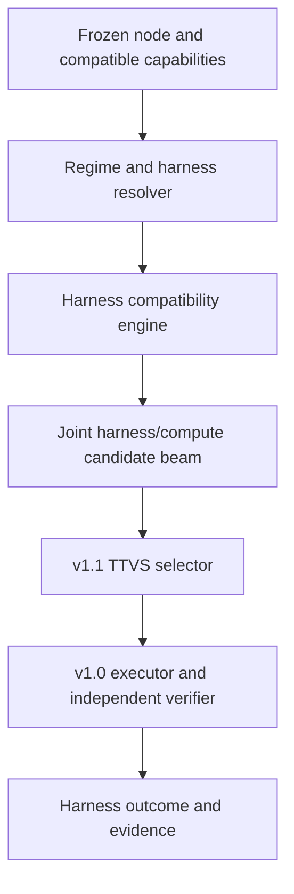

# Accretion v1.2.0 Software Design Description

## Specialized Harness Portfolio Compiler

**Document status:** Forward technical design baseline  
**Document revision:** 4  
**Supersedes document revision:** 3  
**Release authority:** Locked until v1.1.0 passes all gates  
**Primary domains:** Software engineering and AI research  
**Primary objective:** Match tasks to compact, verified, task-appropriate harnesses instead of one dense global harness

---

## 1. Purpose and primary claim

v1.2.0 introduces versioned specialized harness bundles, regime-aware portfolios, and joint harness/compute selection. It adapts the executable context around a model—prompt structure, context selection, tool schemas, deterministic hooks, loop policy, and state-view policy—without changing model weights or verification authority.

Primary research claim:

> On heterogeneous unseen Software/AI projects containing recurring task regimes, a compiled portfolio of specialized harnesses reduces TTVS, model-visible context, and tool-use failures relative to the strongest v1.1 general-harness baseline, while preserving verified-success and critical non-regression gates.

## 2. Golden Direction alignment

- Harnesses are governed capability packages, not authorities.
- v0.10 remains the only path for proposing, evaluating, and promoting new capability code.
- v1.1 remains the owner of compute-tier/TTVS selection.
- v1.2 adds harness identity, portfolio organization, and selection evidence.
- Frozen NodeContract, VerificationSpec, policy, connections, and safety rules remain outside the harness.
- General harness and v1.1 conservative compute profile remain fallbacks.

## 3. Entry conditions

1. v1.1 TTVS and verified-success claims pass.
2. Compute profiles can reference an immutable harness bundle.
3. v0.10 candidate sandbox, supply-chain checks, hidden holdout, promotion, canary, and rollback are operational.
4. Traces identify prompt/context/tool/hook/loop contributions without exposing secrets.
5. At least two recurring task regimes show evidence that a single harness is a material bottleneck.
6. Harness effects can be separated from model/tier effects through factorial evaluation.
7. A v1.2 ResearchProtocol freezes regime definitions, portfolio size/cost, generalization boundary, and over-specialization tests.

## 4. Scope

### Included

- `HarnessBundle`, `HarnessVariant`, `HarnessRegime`, and `HarnessPortfolio`;
- Context templates and selection policies;
- Tool-schema adapters and reduced tool surfaces;
- Deterministic pre/post hooks;
- Bounded loop/stop policies;
- Runtime/model compatibility declarations;
- Offline harness profiling and Pareto compilation;
- Regime classifier/router with calibrated uncertainty;
- Joint final validation with v1.1 ComputeProfiles;
- General-harness fallback, shadow/canary, lineage, signing, and rollback;
- Studio inspection, comparison, and compatible override.

### Excluded

- Request-time generation of arbitrary executable harness code;
- Unreviewed dynamic installation;
- Model-weight adaptation;
- Learned graph-topology changes;
- Harness access to secrets or raw connections;
- Harness changes to policy, verification, objective, evidence, approval, or safety semantics;
- Physical harness activation;
- Unlimited growth of a global harness;
- Treating task labels as authorization.

### Revision-4 study scope

The primary contrast is specialization over the mature governed general harness at matched compute, followed by the interaction contrast. The new research payloads and gates are normative design requirements; empirical benefits remain unproven.

## 5. Inherited invariants

All predecessor and shared-package invariants apply. A harness:

- can restrict tool visibility but cannot grant a tool;
- can request context but sees only policy-filtered views;
- can add deterministic checks but cannot remove required verifiers;
- can format a runtime request but cannot alter the NodeContract;
- can define a retry suggestion but remains subject to hard global caps;
- must be content-addressed, supply-chain attested, independently evaluated, and human-promoted.

## 6. System context and authority



The regime prediction is descriptive, not authoritative. Compatibility and policy are deterministic. The final executable configuration remains the canonical v0.4 `ExecutionConfiguration`, enriched by a v1.1 ComputeProfile referencing a promoted HarnessBundle.

## 7. Components

### 7.1 Harness Registry

- Stores immutable bundles, versions, digests, SBOM/attestation, status, compatibility, and promotion lineage;
- rejects duplicate identity/digest conflicts;
- distinguishes `GENERAL`, `SPECIALIZED`, `EXPERIMENTAL`, `RETIRED`, and `REVOKED` support state;
- resolves dependencies to immutable tools/skills/hooks.

### 7.2 Harness Builder/Packager

- Validates manifest and schemas;
- resolves prompt/context assets;
- packages deterministic hooks in a sandboxable form;
- produces an SBOM and dependency digest;
- cannot sign or promote its own output.

### 7.3 Regime Model

Inputs may include node kind, repository language/size, task/failure type, required capabilities, tool-schema complexity, context scale, verifier class, and compatible environment metadata. It must not use protected attributes or secrets.

Outputs a calibrated distribution over registered regimes plus OOD/novelty. It does not choose permissions.

### 7.4 Harness Compatibility Engine

Checks:

- node input/output contract;
- runtime/model support;
- required and forbidden capabilities;
- tool schema versions;
- context/data classification;
- verifier compatibility and independence;
- environment and risk profile;
- bundle/hook supply-chain state;
- project/workspace policy.

### 7.5 Portfolio Compiler

- Profiles each harness over declared regimes and compute profiles;
- estimates verified success, TTVS, context tokens, tool failures, and verification burden;
- removes dominated or statistically unsupported variants;
- limits portfolio complexity through registered size/maintenance budgets;
- preserves a general fallback and cohort-specific rollback target.

### 7.6 Joint Selector

Maintains a small beam of complete harness/compute combinations. It avoids independently selecting a harness and model that are individually plausible but jointly invalid. v1.1 performs the final TTVS-constrained selection.

### Evidence responsibilities

The Harness Registry and executor integration distinguish packaged, installed, loaded and triggered behavior. The Portfolio Compiler records the strongest current general harness and its qualification evidence. If a proposer is used, its optimizer harness has a separate identity from the target execution harness.

## 8. Contracts

```yaml
HarnessRegime:
  regime_id: uuid
  regime_version: semver
  label: string
  task_predicates: object
  required_evidence_characteristics: object
  excluded_risk_classes: [RiskClass]
  training_snapshot_ref: ArtifactRef | null
  validation_report_ref: ArtifactRef
  content_hash: sha256

HarnessSelectionReceipt:
  selection_id: uuid
  node_contract_ref: object
  regime_predictions: [{regime_ref: object, probability: number}]
  ood_score: number
  portfolio_ref: object
  candidate_harness_refs: [object]
  compatibility_receipt_refs: [object]
  candidate_compute_profile_refs: [object]
  selected_harness_ref: object | null  # null exactly on ABSTAIN
  fallback_harness_ref: object | null
  abstention_reason: string | null
  compute_decision_ref: object | null  # later binding links the joint decision
  mode: GENERAL_FALLBACK | SHADOW | SPECIALIZED | ABSTAIN
  policy_artifact_ref: object | null
  content_hash: sha256
```

Complete `HarnessBundle` ownership is defined in the v1.x registry.

Bundle identity is fixed before evaluation; promotion/revocation live in a separate HarnessLifecycleRecord referencing the bundle. Selection is advisory to v1.1 assembly. ABSTAIN never carries a selected bundle; fallback is validated as a complete joint profile before the one existing RoutingDecisionReceipt authorizes execution. SHADOW cannot dispatch. The final dispatch binding links the compute and harness proposal receipts; neither receipt must forward-reference the other.

### Revision-4 research payloads

`ResearchComparisonPlan` kind `HARNESS_FACTORIAL` binds the mature baseline, specialist candidates, three compute profiles, factorial manifest, optimizer-harness reference when used, target harness references, and an activation-observation policy. `EffectiveSettingObservation` can record target hook/skill loading and triggering without treating installation as execution.

## 9. Lifecycle and state machines

### Harness candidate

```text
DRAFT → PACKAGED → SANDBOX_VALIDATED → OFFLINE_EVALUATED
→ SHADOW → CANARY → PROMOTED → RETIRED
                         ↘ REJECTED
                         ↘ REVOKED
```

### Portfolio

```text
DRAFT → COMPILED → VALIDATED → SHADOW → ACTIVE → SUPERSEDED | REVOKED
```

### Runtime selection

```text
REGIME_PREDICTED → COMPATIBILITY_FILTERED → JOINT_CANDIDATES
→ COMPUTE_SELECTED | GENERAL_FALLBACK | ABSTAINED
→ PROPOSAL_RECORDED → V1_1_FINAL_ASSEMBLY_AND_VALIDATION
→ CANONICAL_DISPATCH_COMMITTED → EXECUTED → VERIFIED → OUTCOME_RECORDED
```

## 10. Algorithms and rules

### 10.1 Specialization search space

A harness variant may change only declared writable dimensions:

```text
prompt/context templates
context selection/compression policy
tool descriptions/schema adapters
allowed tool subset
deterministic hooks
bounded loop/stop policy
structured state-view policy
runtime formatting adapter
```

Protected dimensions remain outside the search space.

### 10.2 Routing

1. Predict top-k regimes with uncertainty.
2. Retrieve promoted harnesses for those regimes plus the general fallback.
3. Apply deterministic compatibility/supply-chain/policy pruning.
4. Cross product only with compatible v1.1 ComputeProfiles using bounded beam search.
5. Jointly validate complete candidates.
6. Select using v1.1 TTVS and success constraints.
7. Fall back when OOD, low confidence, or no specialized candidate survives.

### 10.3 Complexity control

Portfolio compilation penalizes maintenance and selection complexity. A new specialized harness must demonstrate a preregistered incremental benefit and adequate cohort support. Near-duplicate harnesses are consolidated only through a new evaluated candidate; history is preserved.

### 10.4 Context safety

Context compaction preserves mandatory instructions, contract fields, verifier requirements, security warnings, and unresolved contradictions. Token reduction cannot remove safety-critical or acceptance-critical context.

### Revision-4 method rules

Compare a small bounded specialist and the mature general harness across all three frozen profiles before increasing portfolio size. A deliberately minimal seed is a diagnostic comparator only. Evaluate a static regime map before fitting a learned regime model. Penalize bundle count, context growth, fixed load/lookup overhead and maintenance/requalification cost under the registered complexity rule.

## 11. APIs and idempotency

| Method | Endpoint | Purpose |
|---|---|---|
| POST | `/api/v1/harness-bundles` | Register packaged candidate |
| GET | `/api/v1/harness-bundles/{id}` | Inspect bundle, dependencies, evidence |
| POST | `/api/v1/harness-regimes` | Register versioned regime definition |
| POST | `/api/v1/harness-portfolios/compile` | Compile offline portfolio |
| GET | `/api/v1/harness-portfolios/{id}` | Inspect portfolio and coverage |
| POST | `/api/v1/nodes/{id}/harness-selections` | Produce selection/fallback receipt |
| POST | `/api/v1/harness-bundles/{id}/promote` | Invoke v0.10 promotion workflow |
| POST | `/api/v1/harness-portfolios/{id}/rollback` | Roll back affected cohort |

Registration, compilation, promotion, and rollback require idempotency keys. Mutating portfolio state uses optimistic concurrency.

## 12. Events and replay

```text
harness.bundle.registered
harness.bundle.packaged
harness.bundle.validation_failed
harness.regime.registered
harness.portfolio.compile_started
harness.portfolio.compiled
harness.portfolio.promoted
harness.selection.recorded
harness.selection.fallback
harness.bundle.promoted
harness.bundle.revoked
harness.portfolio.rolled_back
```

Replay pins the node, regime model, portfolio, bundle assets, complete compute profile, runtime/tool schemas, policy, environment, and verifier. Deleted upstream web content is referenced by preserved permitted artifacts/digests or recorded as a reproduction limitation.

## 13. Persistence and migrations

- Add bundle, asset, dependency, regime, portfolio, compatibility, selection, and harness-outcome tables/aggregates.
- Bundle assets are content-addressed; metadata is relational and append-only/versioned.
- Use the optional harness reference already defined by v1.1; v1.2 supplies its bundle owner and joint compatibility rules. Existing profiles retain their pinned general-harness binding; no silent runtime default or historical rewrite is allowed.
- Do not rewrite historical general-harness runs as specialized.
- Revocation marks dependent portfolios inactive and triggers lineage review/quarantine.
- Migrations retain v1.1 behavior when v1.2 is rolled back.

### Research lineage and migration

Preserve baseline-strength evidence, optimizer and target harness identities, factorial membership and activation observations with the existing bundle/portfolio history. No historical general run is reclassified as specialized.

## 14. Identity, tenancy, secrets, and security

- Bundles are workspace-owned or explicitly shared under policy.
- Cross-workspace bundle activation is denied by default.
- Prompt/tool assets are scanned for secret literals and unsafe connection references.
- Hooks run with declared capabilities in isolated environments.
- Package signatures, SBOM, dependency pins, and vulnerability state are verified before activation.
- Tool descriptions are untrusted model input; policy enforcement remains server-side.
- Regime labels cannot reveal protected workspace/task information across tenants.

Research inputs, observations and comparison plans inherit existing least-privilege, redaction and proposer/evaluator separation. Diagnostic controls that intentionally omit an invariant are confined to isolated command-disabled tests and cannot reach live or physical authority.

## 15. Failure handling and recovery

| Failure | Response |
|---|---|
| No regime confidence | Use general fallback |
| No compatible specialized bundle | Use general fallback or pause |
| Bundle dependency unhealthy | Remove bundle candidate; record typed failure |
| Hook crash | Fail node attempt; do not bypass hook if required |
| Tool-schema mismatch | Compatibility FAIL and portfolio invalidation review |
| Context policy drops mandatory field | Critical candidate failure; revoke/quarantine |
| Specialized cohort regresses | Cohort rollback, not necessarily global rollback |
| Bundle compromised | Revoke bundle and dependent portfolios; incident/quarantine |

v1.2 uses predecessor recovery behavior; it does not learn recovery sequences.

### Research failure semantics

An untriggered mandatory hook or unsupported load is an activation/configuration failure, not a successful specialist run. Use the already-admissible general fallback through v1.1 final assembly, or pause; preserve the allocated failed cell.

## 16. Verification and contradictions

- Harness output uses the preexisting independent VerificationSpec.
- Harness candidate evaluation uses hidden tests and security/conformance suites outside proposer access.
- Self-reported harness confidence is diagnostic only.
- General and specialized outcomes remain paired where possible.
- Conflicting regime/cohort evidence is preserved and may restrict activation.
- A discovered false acceptance quarantines the bundle, portfolio, decisions, and derived training data.

Every uncertainty claim references the shared typed uncertainty statement and applicable data-role/assumption evidence. Source-paper results, synthetic design fixtures, observed runtime outcomes and independent research conclusions retain separate verification status.

## 17. Observability and Experiment Studio

Add:

- harness portfolio tree/list by regime;
- selected versus fallback harness;
- bundle composition and dependency digest;
- compatibility pruning reasons;
- context/tool surface diff against general harness;
- expected and observed TTVS/context/tool-error effects;
- cohort coverage and uncertainty;
- candidate evaluation, promotion, canary, revocation, and rollback lineage;
- human override among compatible promoted bundles with reason.

### Research evidence views

Display mature-baseline comparison, installation/load/trigger state, factorial coverage, fallback-winning cohorts, bundle count and maintenance/requalification cost.

## 18. Test strategy

### Unit/property

- Manifest/schema/hash/signature validation;
- deterministic compatibility;
- mandatory-context preservation;
- beam contains only jointly valid tuples;
- general fallback always remains resolvable;
- unknown hook/tool versions fail closed;
- idempotency and optimistic concurrency.

### Integration

- Bundle registry → regime router → compute selector → executor → verifier;
- v0.10 candidate/promotion lifecycle;
- supply-chain revocation propagation;
- event replay and rollback;
- workspace isolation and redaction.

### Adversarial

- prompt/tool schema injection;
- harness attempting permission expansion;
- evaluator/test leakage;
- malicious hook/package;
- context omission of verifier/safety instructions;
- regime manipulation and routing poisoning;
- portfolio explosion/resource amplification.

### Revision-4 negative and boundary tests

Include a packaged-but-unloaded skill, loaded-but-untriggered hook, wrong target/optimizer identity, missing factorial cell, specialist-only holdout and a portfolio whose maintenance cost erases its apparent benefit. Retain joint compatibility, protected-context and fallback tests.

## 19. Research benchmark

Use heterogeneous projects with recurring regimes and sufficient within-regime examples. Report results by diversity and base-model capability.

Required baselines:

1. v1.1 general harness;
2. hand-authored per-domain harness;
3. one increasingly dense global harness;
4. specialized portfolios with deterministic regime mapping;
5. learned regime routing;
6. full joint harness/compute selection;
7. post-hoc best harness per task.

Primary endpoint: TTVS under verified-success non-inferiority. Secondary: context tokens, tool-call/schema errors, frontier calls, portfolio maintenance/search cost, harness-selection regret, and OOD fallback.

Required ablations:

- no tool-surface reduction;
- no deterministic hooks;
- no context specialization;
- no regime router;
- single global harness;
- no joint compute validation;
- no OOD fallback;
- no portfolio complexity penalty.

### 19.1 Revision-4 sequencing and factorial control

v1.2 research starts only after the v1.1 profile-only pilot and the full v1.1 operational entry gates close. The first v1.2 study freezes a small candidate set and measures the complete harness-by-compute factorial on each acquired task. This separates harness effects, compute effects and interactions before any joint selector is trained. Harness eligibility, verifier qualification and all three v1.1 compute profiles are frozen inputs.

Adaptive task acquisition may be reused only with logged positive propensities, a uniform acquisition comparator and all frozen factorial candidates evaluated on every acquired task. It may not adapt the harness candidates and the task sample simultaneously in the confirmatory analysis. The first study therefore freezes the candidate set before acquisition; later portfolio search uses a separate development split and reports its full proposal, sandbox, verification and rejection costs.

Joint selection is eligible for evaluation only when the factorial shows repeatable interaction value beyond the profile-only baseline, sufficient coverage exists for every candidate, and OOD fallback remains deterministic. A favorable result for one harness or project family cannot establish a general joint-routing claim.

### Revision-4 comparison and claim boundary

The primary contrast is specialization over the mature governed general harness at matched compute, followed by the interaction contrast. Preserve every frozen factorial cell on the common holdout. Report regions where the general fallback wins, unused/failed activations, portability across declared runtimes and all proposer costs. Weak-seed improvements cannot establish the release claim.

## 20. Implementation milestones

| Milestone | Deliverable | Exit evidence |
|---|---|---|
| H1 | Harness contracts and package format | Golden fixtures and supply-chain review |
| H2 | Registry/compatibility engine | Deterministic conformance tests |
| H3 | Regime dataset/model | Leakage, calibration, and OOD report |
| H4 | Offline portfolio compiler | Reproducible portfolio and cost accounting |
| H5 | Joint selector integration | Complete factorial, activation and joint-identity replay tests |
| H6 | Studio/shadow | Explanation and parity tests |
| H7 | Low-risk canary | Cohort report and rollback drill |
| H8 | Scientific evaluation/release | Preregistered report and sign-off |

## 21. Acceptance criteria

Stable IDs map to accountable roles, evidence targets and design fixtures in `18_ACCEPTANCE_TRACEABILITY.json`. All implementation/research evidence remains pending.

- [ ] **AC12-H1-001** HarnessBundle format, schemas, digest, SBOM, and signatures pass.
- [ ] **AC12-H2-002** No harness can grant capabilities or modify frozen requirements.
- [ ] **AC12-H2-003** Mandatory context and verifier semantics survive every context policy.
- [ ] **AC12-H2-004** Only promoted, compatible bundles enter live candidates.
- [ ] **AC12-H5-005** General v1.1 fallback remains available and tested.
- [ ] **AC12-H5-006** Joint harness/compute decisions are reproducible.
- [ ] **AC12-H3-007** OOD/uncertain regimes fall back safely.
- [ ] **AC12-H4-008** Portfolio size and offline compilation cost are fully reported.
- [ ] **AC12-H8-009** No critical correctness, policy, secret, supply-chain, isolation, or safety regression occurs.
- [ ] **AC12-H8-010** Verified-success non-inferiority passes globally and per critical cohort.
- [ ] **AC12-H8-011** TTVS improvement meets the preregistered minimum effect.
- [ ] **AC12-H8-012** Context/tool-error improvements and negative cohorts are reported.
- [ ] **AC12-H8-013** Required baselines, factorial controls, and ablations are complete.
- [ ] **AC12-H7-014** Promotion, canary, revocation, quarantine, and rollback pass.
- [ ] **AC12-H1-015** Pre-promotion bundles are representable without a future promotion reference; promotion and revocation append lifecycle evidence without changing bundle identity.
- [ ] **AC12-H5-016** Abstaining harness receipts remain valid and joint selection flows through the one v1.1 assembly/dispatch binding.
- [ ] **AC12-H8-017** Joint harness/compute selection is evaluated only after the profile-only predecessor and a frozen matched factorial identify separable harness, compute and interaction effects.

- [ ] **AC12-H5-018** A specialist claim uses a mature governed general baseline, separates optimizer and target harness identities, and proves installed, loaded and triggered behavior where required.
- [ ] **AC12-H8-019** Every frozen harness-by-profile cell reaches the common holdout and the incremental specialization report includes fixed, context, portfolio and maintenance costs plus fallback-winning cohorts.

## 22. Open questions and defaults

| ID | Question | Proposed default | Resolve by |
|---|---|---|---|
| H-OQ1 | Bundle format | Signed manifest plus content-addressed assets | H1 |
| H-OQ2 | Initial regimes | Repository repair, testing, research extraction, data transformation | Protocol freeze |
| H-OQ3 | Regime model | Calibrated lightweight classifier with explicit OOD | H3 |
| H-OQ4 | Portfolio maximum | Evidence-based cap per workspace/cohort | H4 |
| H-OQ5 | Runtime code in hooks | Deterministic sandboxed hooks only | H1 |
| H-OQ6 | JIT harness generation | Excluded from live path | Release gate |
| H-OQ7 | Robotics | Simulation shadow only | H7 |
| H-OQ8 | Initial factorial size | Mature general plus one bounded specialist across three profiles; expand only with adequate cohort support | H4/protocol freeze |

## 23. Handoff to v1.3.0

v1.3 remains locked until:

1. v1.2 passes scientific and operational gates;
2. Harness and compute decisions remain independently inspectable;
3. Failure attribution can identify whether a failure belongs to configuration, harness, structure, capability, environment, verification, safety, or authority;
4. Attempt-chain and complete TTVS evidence is reliable;
5. Deterministic recovery baselines and hard stop rules are reproducible;
6. A measurable recovery-waste gap remains.

The recovery handoff retains mature-baseline and activation evidence so a failed or unused harness is not mislabeled an intrinsic model failure.

