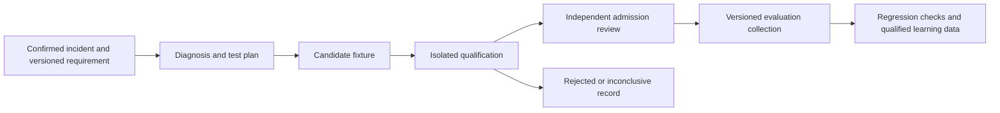

# Adapting the research to Accretion

6 September 2026 · Proposed design · Repository baseline `71893d4`

## What the research changes

The direction remains sound, but the practical first feature is narrower than a general self-improving research system: **turn independently confirmed software failures into stronger, reusable evaluation fixtures**. Accretion already has routing, feedback, independent verdicts and promotion controls. The addition should improve the evidence those systems consume.

Three refinements matter:

1. A test passing on a fix and failing on buggy code is necessary evidence, but does not establish that the test constrains the intended behavior. Mutation-based studies expose tests that accept plausible incorrect repairs or reject valid alternatives. Qualification must examine both errors. See [COHARDEN](https://www.alphaxiv.org/abs/2607.19843v1), §§2–3, and [PROBE](https://www.alphaxiv.org/abs/2604.01518v2), §§3–5.
2. Lightweight monitoring can help prioritize investigation, but healthy calibration and naturally occurring failures are difficult. The [telemetry study](https://www.alphaxiv.org/abs/2608.02464v1), §§3–5, supports inexpensive experiments; it does not establish a general replacement for independent verification.
3. Reordering mandatory checks does not automatically save money on successful runs. If all still run, the main gain is earlier feedback. Cost savings need permitted early rejection, fewer genuinely supplementary checks, or qualified reuse of existing evidence. This is an inference from Accretion's acceptance rules, not a reported paper result.

## 1. Evaluation Foundry: proposed architecture

**Incident intake.** Read authorized failure events and their evidence, linking the original execution, configuration and verification specification. Preserve disagreements and missing evidence. An anomaly score alone is not a confirmed incident. Do not reuse the positive-experience retrieval filter as the entire incident source: a failure-analysis queue must be able to inspect failures and contradictions that routing correctly refuses to learn from.

**Diagnosis.** Use a phase with read-only repository tools. Require a structured artifact containing location, expected/observed behavior, triggering conditions, causal hypothesis, reference tests and proposed assertions. [DPIAgent](https://www.alphaxiv.org/abs/2608.23341v1), §3, provides the architectural inspiration. For Accretion, the important part is an enforced phase boundary, not simply a longer prompt. A diagnosis remains a hypothesis until the reproduction supports it.

**Generation.** Start with deterministic transformations and existing test conventions. Allow an LLM to propose a fixture when those methods are insufficient. Restrict writes to a disposable test workspace. Use separate bounded runtime invocations if the runtime cannot reliably narrow tools mid-session. Do not rely on a prompt claiming that the tools changed.

**Qualification.** A trusted evaluator checks the following evidence matrix:

| Evaluation input | Required observation | Purpose |
|---|---|---|
| Confirmed buggy revision | Target behavior fails | Reproduces the incident |
| Independently accepted fixed revision | Test passes | Rejects an oracle that encodes the bug |
| Reviewed faulty variants | Relevant variants fail | Challenges weak assertions and partial repairs |
| Reviewed behavior-preserving variants | Test passes | Challenges dependence on implementation details |
| Unrelated healthy controls | Test passes | Detects overbroad rejection |
| Fresh repeated environments | Stable observations | Detects environmental accidents and flakiness |

Build errors, missing dependencies and timeouts are infrastructure outcomes unless the frozen incident definition specifically concerns that condition. A mutant compiling and surviving tests does not prove it is semantically wrong; equivalent variants must remain distinguishable from genuine missed defects.

The bad/fixed pair does not establish universal correctness. Neither does a perfect score on a finite mutant pool. Candidate generation may see development examples; independent holdout cases and admission decisions must remain outside its access. If discovery reveals that the requirement itself is inadequate, route a specification amendment separately from fixture admission.

**Admission.** Produce an append-only qualification report with evaluator identity, inputs, digests, outcomes, exclusions and limitations. Human review accepts an evaluation collection revision. That revision affects explicitly pinned future evaluations; it does not rewrite historical verdicts or silently activate a router model.

The mutation hardening pattern is supported by [ACH](https://www.alphaxiv.org/abs/2501.12862v1), §§2–3. The adaptation above deliberately adds Accretion's authority, provenance and independence requirements; it is not a claim that ACH implements them.

### Proposed new contracts

These names are design proposals and do not exist in the inspected repository.

| Contract | Minimum contents |
|---|---|
| `FixtureCandidate` | Incident/evidence references, spec hash, bad/fixed revision references, test artifact digest, diagnosis reference, declared writes and resources, generation provenance |
| `FixtureQualificationReport` | Candidate digest, evaluator identity/context, environment digest, all execution outcomes, target-failure diagnosis, mutant and control results, exclusions, flakiness, admission recommendation |
| `EvaluationCollectionRevision` | Previous revision, admitted fixture digests, lineage and split membership, approval reference, compatibility and applicability constraints |
| `AssuranceObservation` | Run/configuration reference, observed check or telemetry feature, missing-data flags, monitor version, score and reason; no acceptance authority |

The exact fields need a contract review against the existing v1.x attachments before becoming an SDD.

## 2. Where this fits in the existing code

| Existing component | Verified role | Proposed use or boundary |
|---|---|---|
| [Routing contracts](/mnt/data/company/apps/Accretion/src/accretion/contracts/routing.py:1421) | `VerificationSpec` pins claims, metrics and independence; `IndependentVerificationResult` distinguishes deterministic evidence and model review; `FailureEvent` names a recovery owner | Reference these contracts. Do not add fixture-generation state to a routing receipt or treat a detector score as a verdict. |
| [Feedback pipeline](/mnt/data/company/apps/Accretion/src/accretion/feedback/service.py:173) | Records local/final results, classifies failure and routes recovery | Add an asynchronous, idempotent incident projection; fixture production should not delay ordinary execution. |
| [Evidence retrieval](/mnt/data/company/apps/Accretion/src/accretion/feedback/evidence.py:67) | Filters eligible, visible, uncontradicted experience as of the decision time | Preserve its admission rules. Add a separately scoped incident reader for diagnosis. |
| [Independent recorder](/mnt/data/company/apps/Accretion/src/accretion/feedback/verification.py:1) | Checks claim coverage and producer/verifier session separation | Reuse result semantics; add oracle qualification evidence rather than weakening independence. A separate session is necessary here, but not by itself proof of statistical independence. |
| [Verifier registry](/mnt/data/company/apps/Accretion/src/accretion/verifiers/registry.py:10) | Registers trusted verifier implementations | Only an admitted evaluator belongs here. An arbitrary generated test must first enter qualification. |
| [Command verifier](/mnt/data/company/apps/Accretion/src/accretion/verifiers/command.py:21) and [process wrapper](/mnt/data/company/apps/Accretion/src/accretion/verifiers/process.py:18) | Execute trusted arguments with time/output limits | Introduce an outer execution boundary before running untrusted fixtures; these wrappers do not establish OS isolation. |
| [Split utilities](/mnt/data/company/apps/Accretion/src/accretion/routing/split.py:1) | Group repository/task ancestry into lineages | Extend the lineage relation to incidents, fixture variants and derivatives. The inspected module explicitly defers persisted read-time enforcement and true era-aware drift separation. |
| [Breakers](/mnt/data/company/apps/Accretion/src/accretion/routing/breakers.py:1) | Pure predicates over frozen observations, including version validity and calibration | A Sentinel can produce qualified observations upstream; keep the deterministic decision boundary. |
| [Promotion service](/mnt/data/company/apps/Accretion/src/accretion/routing/promotion.py:1) | Uses held-out evidence, a rollback drill and activation governance | Reuse the governance pattern, not the router-specific estimator without checking its assumptions. Fixture admission and monitor promotion require their own contracts. |
| [Branched rollout](/mnt/data/company/apps/Accretion/src/accretion/routing/rollout.py:1) | Compares executions in separate control/shadow forks | Use fresh branches when changed configurations may take different actions. Trace rescoring only evaluates a detector on a fixed trace; it cannot measure the outcome of a new execution policy. |

The [forward v0.10 design](/mnt/data/company/apps/Accretion/docs/sdd/future/v0.4-v1.0/02_SDDS/Accretion_SDD_v0.10.md:345) already distinguishes equivalent verifier implementation changes from human-governed semantic changes. Preserve that ownership. Future v1.1–v1.8 attachments were not audited in this pass, so the final release placement is unresolved.

## 3. Semantic Drift Sentinel: two different problems

**Declared configuration changes:** record model/provider version, runtime version, tool schema, prompt/skill digests, environment, sampling settings and telemetry schema. Invalidate applicability of the old calibration when material components change. Preserve the old record for audit.

**Undeclared behavioral changes:** run a stable set of contract-specific canaries, with periodic broader audits. Compare failure categories and required evidence coverage, not just text similarity. A public model identifier remaining unchanged does not prove unchanged behavior. If an old provider snapshot is unavailable, state the limitation and use recorded baseline distributions without claiming a perfectly controlled paired experiment.

The [paired tool-data study](https://www.alphaxiv.org/abs/2603.12564v7) supports checking task-specific violations against an independent reference. Its manipulation experiment is not a benchmark for vendor updates. That transfer is our proposed experiment.

Start with fixed critical probes and stratified sampling. Later compare risk-ranked probes under the same budget. Retain random audits so the model cannot make its blind spots invisible.

## 4. Where small ML models belong

| Problem | First baseline | Candidate ML method | Authority limit |
|---|---|---|---|
| Incident duplication | Stable identifiers and normalized signatures | Similarity clustering | Groups review work; never merges away conflicting evidence |
| Fixture generation priority | Severity, recurrence and expected reuse | Logistic regression or small gradient-boosted trees | Chooses queue order |
| Mid-run anomaly triage | Completion, tool-schema and repeated-error checks | Mahalanobis score; then a temporal monitor with CUSUM | Raises an observation or escalation recommendation |
| Drift probe selection | Fixed critical plus stratified probes | Risk or information-value ranking | Cannot declare an untested configuration validated |
| Supplementary verification ordering | Recorded failure yield divided by cost | Calibrated ranking | Preserves required checks and fixed acceptance semantics |

Accretion already contains small GBDT and calibration components. Reusing serialization or validation patterns is sensible; reusing fitted router weights for a different prediction target is not.

The telemetry code uses deterministic hashing features and explicitly represents unavailable log probabilities. For Accretion, start with fields its adapters actually expose: event kind, tool outcome, duration, repetition, budget consumption and output shape. Do not fabricate hidden reasoning, token probabilities or tool-level events absent from a runtime. Measure missingness per provider and recalibrate on the supported schema. See the inspected [official adapter](https://github.com/sunnydubey1111/agent-trajectory-sentinel/blob/main/derail/telemetry/adapter.py).

A CUSUM-style score accumulates deviations over time: `S[t] = max(0, S[t−1] + deviation[t] − allowance)`. Calibrate an alarm against held-out healthy **episode maxima**, not randomly split steps. Begin with deterministic and memoryless baselines; the paper's temporal advantage depends on failures having time to develop. An alarm-free run is not an independent healthy label.

## 5. Adaptive Assurance Scheduler: conservative scope

The current run manager preserves all mandatory checks even when routing pins one primary verifier. Start by instrumenting actual check duration, cost, failure yield and coverage. The first scheduler should order checks; early stopping may only occur where the frozen policy permits it and conflict/audit evidence requirements remain satisfied.

For later supplementary selection, [Learn then Test](https://www.alphaxiv.org/abs/2110.01052v5), §2, offers a useful statistical pattern: freeze candidate policies, test unsafe-risk hypotheses on held-out data with multiplicity control, then choose a low-cost policy among those qualified. It is not a proof of agent safety. Valid p-values require an appropriate sampling model, labels and loss definition; correlated runs, temporal drift and adapting policy candidates to reused data can invalidate a naive application.

Define the target carefully: missed failures among independently known-bad cases, harmful acceptance across all runs, and task-specific coverage are different quantities. A scheduler that never selects a useful supplementary check can look good on average if failures are rare. Assess critical cohorts separately and keep full-stack audit samples.

## 6. Sandbox as infrastructure

Separate the trusted control plane, the provider worker and the generated-code execution environment. A provider worker may need mediated network access to its model service; that does not justify giving a generated test outbound network or provider credentials.

For qualification, propose disposable environments with deny-by-default egress, bounded CPU/memory/processes/time/output, no host-control socket, no production secrets, restricted mounts and whole-job cleanup. Keep hidden evaluator material outside the generator's filesystem and process access. Read-only access still reveals a hidden test. Persist evidence outside candidate-controlled storage and verify its origin and digest.

[SandboxEscapeBench](https://www.alphaxiv.org/abs/2603.02277v3), §§4–7, evaluates deliberately weakened containers inside an outer VM. Adopt its separation between test subject and evaluator host. Do not transfer its escape rate to hardened deployments, or run its intentionally vulnerable scenarios on the ordinary development host. This report does not establish that Accretion's current environments satisfy the proposed boundary.

## 7. Research advice and federation

For a future Research Portfolio Advisor, first add explicit hypothesis, baseline, ablation, cost and claim-to-evidence records. [XCIENTIST](https://www.alphaxiv.org/abs/2606.18874v3), §5 and Appendix A.4, supplies useful artifact and phase-gating patterns. Its case studies do not prove optimal budget allocation. A transparent human-edited shortlist is a better initial baseline than a learned portfolio optimizer.

[Research exploration analysis](https://www.alphaxiv.org/abs/2605.27905v2) motivates checking diversity across hypotheses and mechanisms, but embedding distance is only a proxy for scientific novelty. Keep a human-selected exploratory slot and record why it was chosen.

For federation, first consider curated, versioned fixture exchange with local qualification. [Fed-SE](https://www.alphaxiv.org/abs/2512.08870v2) trains and averages LoRA adapters over compatible model parameters. It does not supply a protocol for combining heterogeneous closed-provider agents, and explicitly leaves privacy protections against reconstruction outside its implementation. Sharing no raw traces is not a privacy guarantee.

## Practical order

1. Reconcile existing v1.x ownership and inventory incidents and verifier costs.
2. Qualify generated-code containment.
3. Build a bounded offline fixture proposal/qualification experiment.
4. Evaluate configuration fingerprints and fixed behavioral probes.
5. Add ML only where it beats the simple baseline on independent data.
6. Revisit learned scheduling, research advice and federation after their separate evidence gates.

The [experiment protocol](/mnt/data/accretion-research-2026-09-06/experiment-protocol.md) makes those decisions measurable. No release number or claim of production readiness follows from this research alone.
